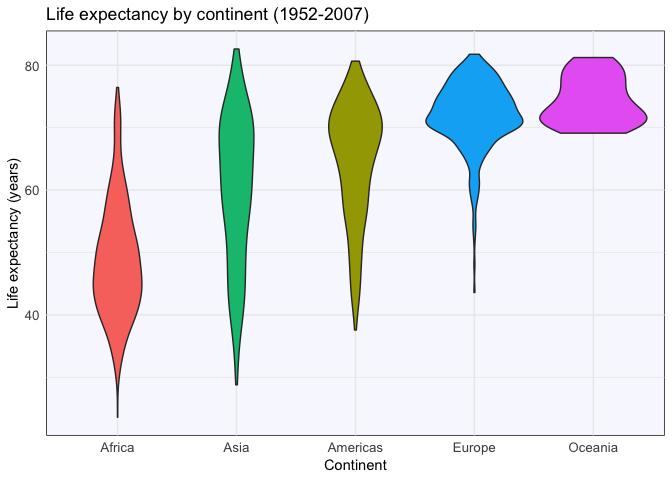

hw05CarolineSeip
================
Caroline Seip
October 16, 2018

Table of Contents
=================

-   Load packages
-   Part 1: Factor management
-   Part 2: File I/O
-   Part 3: Visualization design
-   Part 4: Writing figures to file

Load packages
=============

Load the required packages for this assignment:

``` r
suppressPackageStartupMessages(library(tidyverse))      
suppressPackageStartupMessages(library(knitr)) 
suppressPackageStartupMessages(library(gapminder)) 
suppressPackageStartupMessages(library(plotly)) 
suppressPackageStartupMessages(library(htmlwidgets))
```

Part 1: Factor management
=========================

In this section we will determine whether we are working with factors, then drop factors and reorder the levels.

First let's check if we are working with factors:

``` r
glimpse(gapminder)
```

    ## Observations: 1,704
    ## Variables: 6
    ## $ country   <fct> Afghanistan, Afghanistan, Afghanistan, Afghanistan, ...
    ## $ continent <fct> Asia, Asia, Asia, Asia, Asia, Asia, Asia, Asia, Asia...
    ## $ year      <int> 1952, 1957, 1962, 1967, 1972, 1977, 1982, 1987, 1992...
    ## $ lifeExp   <dbl> 28.801, 30.332, 31.997, 34.020, 36.088, 38.438, 39.8...
    ## $ pop       <int> 8425333, 9240934, 10267083, 11537966, 13079460, 1488...
    ## $ gdpPercap <dbl> 779.4453, 820.8530, 853.1007, 836.1971, 739.9811, 78...

Ok, so now we know that country and continent are both factors, and there are 1704 observations in the gapminder dataset.

Let's drop the continent Oceania from the gapminder dataset now:

Drop Oceania
------------

``` r
noO <- gapminder %>% 
  filter(continent != "Oceania") %>% #filter gapminder dataset for continents that are not Oceania
  glimpse()
```

    ## Observations: 1,680
    ## Variables: 6
    ## $ country   <fct> Afghanistan, Afghanistan, Afghanistan, Afghanistan, ...
    ## $ continent <fct> Asia, Asia, Asia, Asia, Asia, Asia, Asia, Asia, Asia...
    ## $ year      <int> 1952, 1957, 1962, 1967, 1972, 1977, 1982, 1987, 1992...
    ## $ lifeExp   <dbl> 28.801, 30.332, 31.997, 34.020, 36.088, 38.438, 39.8...
    ## $ pop       <int> 8425333, 9240934, 10267083, 11537966, 13079460, 1488...
    ## $ gdpPercap <dbl> 779.4453, 820.8530, 853.1007, 836.1971, 739.9811, 78...

Now we can see that the tibble only contains 1680 observations. So it worked! We removed Oceania.

Let's check the levels of the continent factor of our new object:

``` r
unique(noO$continent) #check levels of continent
```

    ## [1] Asia     Europe   Africa   Americas
    ## Levels: Africa Americas Asia Europe Oceania

Uh oh! There are no values for Oceania in the new object, but it still exists as a level. Let's get rid of it.

Remove unused factor levels
---------------------------

Using `fct_drop` let's remove the unused factor level:

``` r
dropO <- noO %>% #make a new variable
  mutate(continent = fct_drop(continent)) #drop unused factors of continent

unique(dropO$continent) #check levels of continent in the new variable
```

    ## [1] Asia     Europe   Africa   Americas
    ## Levels: Africa Americas Asia Europe

Now we can see that Oceania was removed as a factor, yay!

Reorder the levels of continent
-------------------------------

For this part I will reorder the levels of continent by minimum life expectancy using `fct_reorder`.

``` r
gapminder %>% 
  #Make a plot, reordering continent by minimum life expectancy
  ggplot(aes(fct_reorder(continent, lifeExp, .fun = min), lifeExp, fill = continent)) +
  #Add a violin plot
  geom_violin() +
  #Add an x label
  xlab("Continent") +
  #Add a y label
  ylab("Life expectancy (years)") +
  #Remove the legend
  guides(fill = FALSE)
```


Yay! We reordered the continents by minimum life expectancy.

Part 2: File I/O
================

For this section I will create a new dataset by filtering the gapminder dataset for only Oceania, reordering by population size, write the file as a .csv to my local drive, and read the .csv back into R.

``` r
OceanaData <- gapminder %>% #make a new dataset
  filter(continent == "Oceania") %>% #filter for Oceana
  arrange(pop) #arrange by population

write_csv(OceanaData, "OceanaData.csv") #write the new data to a csv

readOceana <- read_csv("OceanaData.csv") #read the csv back in
```

    ## Parsed with column specification:
    ## cols(
    ##   country = col_character(),
    ##   continent = col_character(),
    ##   year = col_integer(),
    ##   lifeExp = col_double(),
    ##   pop = col_integer(),
    ##   gdpPercap = col_double()
    ## )

Let's look at what the data looked like before we wrote it to a csv

``` r
OceanaData %>% 
  kable()
```

| country     | continent |  year|  lifeExp|       pop|  gdpPercap|
|:------------|:----------|-----:|--------:|---------:|----------:|
| New Zealand | Oceania   |  1952|   69.390|   1994794|   10556.58|
| New Zealand | Oceania   |  1957|   70.260|   2229407|   12247.40|
| New Zealand | Oceania   |  1962|   71.240|   2488550|   13175.68|
| New Zealand | Oceania   |  1967|   71.520|   2728150|   14463.92|
| New Zealand | Oceania   |  1972|   71.890|   2929100|   16046.04|
| New Zealand | Oceania   |  1977|   72.220|   3164900|   16233.72|
| New Zealand | Oceania   |  1982|   73.840|   3210650|   17632.41|
| New Zealand | Oceania   |  1987|   74.320|   3317166|   19007.19|
| New Zealand | Oceania   |  1992|   76.330|   3437674|   18363.32|
| New Zealand | Oceania   |  1997|   77.550|   3676187|   21050.41|
| New Zealand | Oceania   |  2002|   79.110|   3908037|   23189.80|
| New Zealand | Oceania   |  2007|   80.204|   4115771|   25185.01|
| Australia   | Oceania   |  1952|   69.120|   8691212|   10039.60|
| Australia   | Oceania   |  1957|   70.330|   9712569|   10949.65|
| Australia   | Oceania   |  1962|   70.930|  10794968|   12217.23|
| Australia   | Oceania   |  1967|   71.100|  11872264|   14526.12|
| Australia   | Oceania   |  1972|   71.930|  13177000|   16788.63|
| Australia   | Oceania   |  1977|   73.490|  14074100|   18334.20|
| Australia   | Oceania   |  1982|   74.740|  15184200|   19477.01|
| Australia   | Oceania   |  1987|   76.320|  16257249|   21888.89|
| Australia   | Oceania   |  1992|   77.560|  17481977|   23424.77|
| Australia   | Oceania   |  1997|   78.830|  18565243|   26997.94|
| Australia   | Oceania   |  2002|   80.370|  19546792|   30687.75|
| Australia   | Oceania   |  2007|   81.235|  20434176|   34435.37|

Great, it filtered for Oceania and ordered by population, like I wanted.

Now let's see what the dataset looks like after we read it back in:

``` r
readOceana %>% 
  kable()
```

| country     | continent |  year|  lifeExp|       pop|  gdpPercap|
|:------------|:----------|-----:|--------:|---------:|----------:|
| New Zealand | Oceania   |  1952|   69.390|   1994794|   10556.58|
| New Zealand | Oceania   |  1957|   70.260|   2229407|   12247.40|
| New Zealand | Oceania   |  1962|   71.240|   2488550|   13175.68|
| New Zealand | Oceania   |  1967|   71.520|   2728150|   14463.92|
| New Zealand | Oceania   |  1972|   71.890|   2929100|   16046.04|
| New Zealand | Oceania   |  1977|   72.220|   3164900|   16233.72|
| New Zealand | Oceania   |  1982|   73.840|   3210650|   17632.41|
| New Zealand | Oceania   |  1987|   74.320|   3317166|   19007.19|
| New Zealand | Oceania   |  1992|   76.330|   3437674|   18363.32|
| New Zealand | Oceania   |  1997|   77.550|   3676187|   21050.41|
| New Zealand | Oceania   |  2002|   79.110|   3908037|   23189.80|
| New Zealand | Oceania   |  2007|   80.204|   4115771|   25185.01|
| Australia   | Oceania   |  1952|   69.120|   8691212|   10039.60|
| Australia   | Oceania   |  1957|   70.330|   9712569|   10949.65|
| Australia   | Oceania   |  1962|   70.930|  10794968|   12217.23|
| Australia   | Oceania   |  1967|   71.100|  11872264|   14526.12|
| Australia   | Oceania   |  1972|   71.930|  13177000|   16788.63|
| Australia   | Oceania   |  1977|   73.490|  14074100|   18334.20|
| Australia   | Oceania   |  1982|   74.740|  15184200|   19477.01|
| Australia   | Oceania   |  1987|   76.320|  16257249|   21888.89|
| Australia   | Oceania   |  1992|   77.560|  17481977|   23424.77|
| Australia   | Oceania   |  1997|   78.830|  18565243|   26997.94|
| Australia   | Oceania   |  2002|   80.370|  19546792|   30687.75|
| Australia   | Oceania   |  2007|   81.235|  20434176|   34435.37|

Great! It looks like the filtering and arranging survived through being written and read as a csv.

Part 3: Visualization design
============================

In this section I will recreate a graph I made in hw01.

My graph from hw01 looked like this:

``` r
plot(gapminder$continent, gapminder$lifeExp)
```


Let's see how we could clean this up.

-   Use `ggplot2` instead of base R graphics
-   Use violin plots over boxplots to better portray the shape of the data
-   Reorder your data in a meaningful way, for this I ordered by median life expectancy
-   Colour each continent differently
-   Add meaningful x and y labels, and a title
-   Remove unnecessary information, in this case, the legend
-   Add a theme, I chose `minimal` to keep it clean, and then added a background of `ghostwhite` :ghost: spooky

``` r
#Store graph as variable `l`
l <- (gapminder %>%
#Plot continent vs lifeExp, reorder by lifeExp
ggplot(aes(fct_reorder(continent, lifeExp, .fun = median), lifeExp, fill = continent)) +
#Add a violin plot
  geom_violin() +
  #Add an x label
  xlab("Continent") +
  #Add a y label
  ylab("Life expectancy (years)") +
  #Add a title
  ggtitle("Life expectancy by continent (1952-2007)") +
  #Remove the legend
  guides(fill = FALSE) +
  #Add a theme
  theme_minimal() +
  #Change font size of axis text
  theme(axis.text = element_text(size=10),
        #Change panel background colour
        panel.background = element_rect(fill="ghostwhite")))
#Print graph
l
```



Now we will make this graph using `plotly`

``` r
#Make plotly graph with object `l`
gg <- ggplotly(l)
#Print plotly graph
gg
```

<!--html_preserve-->

<script type="application/json" data-for="htmlwidget-b5a74c5018a9ed367402">{"x":{"data":[{"x":[0.998493106546523,0.99848354924762,0.998475461079413,0.998469216092422,0.998464011672294,0.998459624403699,0.998455894610626,0.998452599190744,0.998449167058661,0.998445355583534,0.998440931655424,0.998434809847914,0.998426977725232,0.998417147256581,0.998404985104592,0.998388410275536,0.998368222629678,0.998344078407268,0.998315466588086,0.998279396236013,0.998237558745422,0.998189585127029,0.998134712372521,0.998069197498317,0.99799565514874,0.997913714454923,0.997822289684913,0.997717121775252,0.99760170478399,0.997475689064498,0.997337608580824,0.997182971917412,0.997016041453313,0.996836509317971,0.996642492487724,0.99642956439146,0.996202592166462,0.995961325612949,0.995703453256059,0.995424890113698,0.995130911244426,0.994821333619725,0.994493430877436,0.994143686928291,0.99377757608336,0.993394984544631,0.99299280472666,0.992568247733781,0.992126787883762,0.991668375220771,0.991189566008765,0.990688381142799,0.990170123449356,0.989634795225301,0.989078662733383,0.988500570693326,0.987905519405378,0.987293548013803,0.986660670772609,0.986006520207909,0.985335708740591,0.984648296148017,0.983940068764997,0.983211385041154,0.982466427223068,0.981705261506396,0.980923455227593,0.980122027695955,0.979304722799938,0.978471602692721,0.977618011642027,0.976745576796898,0.975857617356863,0.97495418486901,0.974030386215509,0.97308842096025,0.972131207075354,0.971158781368244,0.970165988479099,0.969155581012374,0.968130099886915,0.967089563016333,0.966028511445686,0.96495024512458,0.963856947858502,0.962748612140991,0.961619405970031,0.960473188388702,0.959311800317504,0.958135198862409,0.956937067749672,0.955721868145366,0.954491106732775,0.953244692904003,0.951975664160835,0.950689180030855,0.949386415840728,0.948067222041013,0.94672378134102,0.945362122440656,0.943983085064263,0.942586455860534,0.941163332045025,0.939720864249005,0.938259543534031,0.936779100067291,0.93526934095588,0.933738852821871,0.932187756535816,0.930615749948809,0.929011240551396,0.927384568259329,0.92573545906779,0.924063157096997,0.922356127908042,0.920625297296194,0.918870445106972,0.917090348565652,0.915274060210233,0.9134328884275,0.911566752042749,0.909674028110503,0.907744965005319,0.905790931521466,0.90381205115538,0.901806453187625,0.899766216854738,0.897702296129572,0.895615068968248,0.893502664739717,0.891359521599493,0.889195603144015,0.887011563026581,0.884805863723245,0.882575592465925,0.880329128801349,0.878067386274641,0.875789545651796,0.873495302113423,0.8711909358935,0.868877566173015,0.86655547792908,0.864226575544424,0.861894693042573,0.859561069687007,0.857227422798859,0.854897163341125,0.852571562600429,0.850251878043583,0.84794148000848,0.845644403223139,0.843359488485789,0.841087912920861,0.838834787992385,0.836603870224863,0.834391920961239,0.832199961234001,0.830034808309467,0.827899171897191,0.825788233447655,0.823702818922402,0.821651335064069,0.819634909390361,0.817647699971697,0.815690339929657,0.813772691145786,0.811894017419369,0.810047977925704,0.808235049869153,0.80646646003124,0.804739523111475,0.803047826844674,0.801391748441562,0.799783871289551,0.798219564408917,0.796692645778248,0.795203447213143,0.793765978814097,0.792373645368566,0.791020678599355,0.789707399175151,0.788449343325447,0.787237843667751,0.786067643976175,0.784939055480521,0.783869186115648,0.782847105038849,0.781868122569797,0.780932507795188,0.780058839502145,0.779233730261012,0.778453100793369,0.777717119809882,0.777045518221031,0.77642238686288,0.775844304525707,0.775311272757175,0.774843614679389,0.774423093164641,0.774046990709129,0.773715086514468,0.773447534200655,0.773224302606079,0.773043402192233,0.772904363918712,0.772826307415565,0.77278827630073,0.772788990624046,0.772827989048423,0.772921802168792,0.773050376428461,0.773212826750981,0.773409118888013,0.773651452804731,0.773922928917711,0.774222570362604,0.774550605313635,0.774915312951616,0.775303192784022,0.775713279086396,0.776145923992164,0.776606241422513,0.777084050512768,0.777578498165157,0.778089983070383,0.778621405391553,0.77916552421183,0.779721683306106,0.780290335807366,0.780873142051706,0.781465196236603,0.782066094722085,0.782676445929568,0.783297507946844,0.783925983844924,0.784561743898835,0.785205734229697,0.78585939526802,0.786520300280047,0.78718857947171,0.787865750667197,0.78855370717906,0.789250236858299,0.789955683362015,0.790672376204804,0.791402614748642,0.792143899643153,0.792896714610481,0.793664390882394,0.794449319529807,0.795248407434318,0.796062186066055,0.796895070155937,0.797749055208578,0.798620354680637,0.799509446924969,0.800421753833678,0.801358341803393,0.8023148219431,0.803291522683309,0.804294609512187,0.805323780057123,0.806374284253011,0.807446221683157,0.80854605351612,0.80967189128426,0.810818955572984,0.811987069015235,0.813182397290673,0.814401559095625,0.81564009864804,0.816897553597753,0.818179136779987,0.819480401298868,0.820797521213154,0.82212978410875,0.823480827284135,0.824845846099189,0.82622185003793,0.827607949511309,0.82900572257123,0.830410872421674,0.831821319413016,0.833236095245371,0.834654458426629,0.836073478109534,0.837491930451369,0.838908875211827,0.840321259500561,0.841728201709446,0.843129174767569,0.844523363435073,0.845905676229932,0.847277661024195,0.848639269147186,0.849989882742801,0.851322860358794,0.852642196342002,0.853948093029406,0.855240169637551,0.856510860632219,0.857766276177783,0.859006677013701,0.860231925972966,0.861434209574271,0.862621152530278,0.863792945021606,0.86494946545326,0.866083925083535,0.867204078403281,0.868310198108645,0.86940210013138,0.870474710780849,0.871534981734378,0.872583323354647,0.873619559280503,0.874640442289302,0.875651696118682,0.876653821684963,0.877646749872429,0.878628955106126,0.879604699284955,0.880574529280434,0.881538592568014,0.882496823505906,0.883451950544621,0.884404524923675,0.885355009393,0.8863044314718,0.887254044668337,0.888204365376954,0.889156239403104,0.890111361530962,0.891069670564477,0.892031611194873,0.892998431169993,0.893972053155575,0.894951338917339,0.895936628505608,0.896929528813869,0.897931785967505,0.898941476091965,0.899958808573655,0.900985640401252,0.902023220109633,0.903069156850539,0.90412351360826,0.905188227563016,0.906263852364903,0.907347846354527,0.908440123037687,0.909542483857363,0.910654737243574,0.911774474169847,0.91290146859415,0.914037145547133,0.915180665161971,0.916329976020612,0.917484733500711,0.918645744001003,0.919811741466879,0.920981181985419,0.922153630612573,0.923329051936943,0.924506063202702,0.925683697841977,0.926861461715344,0.928038288409695,0.929213031764668,0.93038529848336,0.931554565326438,0.932718588313397,0.933876815088477,0.935029361854014,0.936175702820189,0.937312316328266,0.938439574422064,0.939557997384124,0.940667078988437,0.941761967791371,0.942844243897734,0.943914702579518,0.944972875213959,0.946012577810351,0.947036822311493,0.948046541601865,0.94904131948917,0.95001368765902,0.950968244366191,0.95190592639217,0.952826382222182,0.953720959202354,0.954595918981838,0.955452081074223,0.956289168335777,0.957097493545317,0.957884975257355,0.958652213767509,0.959399012994052,0.960114844915747,0.960809193106907,0.961482360995245,0.962134219927564,0.962753680912527,0.96335156901952,0.963927858118415,0.964482056027215,0.965004061793224,0.965504505228085,0.965983442563509,0.966440031035878,0.966865391052098,0.967269698974749,0.96765309110104,0.968014417630205,0.968346185213742,0.968657898861183,0.968949774085578,0.969220429529122,0.969463863514921,0.969688729122241,0.969895322435989,0.970082139801712,0.970244723036529,0.970390723105835,0.97052051941762,0.970632630054202,0.970724136015247,0.970801559875874,0.970865366074673,0.970914271053741,0.970946822764079,0.970968311324512,0.97097928337784,0.970978855044151,0.970966884537675,0.970947353069417,0.970920878612387,0.97088718765902,0.970847194708886,0.970803534939786,0.970756876323711,0.970707753056682,0.970657784774963,0.970608277183488,0.97055991602704,0.970514199158063,0.970473022658944,0.970436444834631,0.970405127989264,0.970381619012884,0.970367624748521,0.970362108082831,0.970365661755117,0.970381871471134,0.970411809144087,0.970453558029661,0.970507595875358,0.970578426045042,0.970666123838407,0.970768155454731,0.97088484512205,0.971021380689454,0.971176621928137,0.971347701652715,0.97153476467009,0.971743353733894,0.971971077996296,0.972215011561307,0.972475110747088,0.972756878931693,0.973056836866068,0.973372236402352,0.97370285497125,0.9740537414,0.974420668674386,0.974801241452168,0.975195085518389,0.975606407935247,0.976030703632327,0.976466030512738,0.976911903741989,0.977371374487226,0.977840187470765,0.978316878286866,0.978800900246734,0.979293940492614,0.97979250118039,0.980295553906113,0.98080253956388,0.981313693956098,0.981826694403138,0.982340858879511,0.98285565932654,0.983369908830927,0.983882740258484,0.984393702569476,0.984902331366821,0.985406140220532,0.985905842732612,0.986401099155548,0.986891482679635,0.987373531023306,0.987849382664822,0.988318747811625,0.988781123584774,0.989232652284507,0.989676403595478,0.990112174850281,0.990539337579675,0.990954003054275,0.991359827578055,1.00864017242195,1.00904599694573,1.00946066242032,1.00988782514972,1.01032359640452,1.01076734771549,1.01121887641523,1.01168125218838,1.01215061733518,1.01262646897669,1.01310851732036,1.01359890084445,1.01409415726739,1.01459385977947,1.01509766863318,1.01560629743052,1.01611725974152,1.01663009116907,1.01714434067346,1.01765914112049,1.01817330559686,1.0186863060439,1.01919746043612,1.01970444609389,1.02020749881961,1.02070605950739,1.02119909975327,1.02168312171313,1.02215981252924,1.02262862551277,1.02308809625801,1.02353396948726,1.02396929636767,1.02439359206475,1.02480491448161,1.02519875854783,1.02557933132561,1.0259462586,1.02629714502875,1.02662776359765,1.02694316313393,1.02724312106831,1.02752488925291,1.02778498843869,1.0280289220037,1.02825664626611,1.02846523532991,1.02865229834728,1.02882337807186,1.02897861931055,1.02911515487795,1.02923184454527,1.02933387616159,1.02942157395496,1.02949240412464,1.02954644197034,1.02958819085591,1.02961812852887,1.02963433824488,1.02963789191717,1.02963237525148,1.02961838098712,1.02959487201074,1.02956355516537,1.02952697734106,1.02948580084194,1.02944008397296,1.02939172281651,1.02934221522504,1.02929224694332,1.02924312367629,1.02919646506021,1.02915280529111,1.02911281234098,1.02907912138761,1.02905264693058,1.02903311546232,1.02902114495585,1.02902071662216,1.02903168867549,1.02905317723592,1.02908572894626,1.02913463392533,1.02919844012413,1.02927586398475,1.0293673699458,1.02947948058238,1.02960927689416,1.02975527696347,1.02991786019829,1.03010467756401,1.03031127087776,1.03053613648508,1.03077957047088,1.03105022591442,1.03134210113882,1.03165381478626,1.0319855823698,1.03234690889896,1.03273030102525,1.0331346089479,1.03355996896412,1.03401655743649,1.03449549477191,1.03499593820678,1.03551794397279,1.03607214188159,1.03664843098048,1.03724631908747,1.03786578007244,1.03851763900475,1.03919080689309,1.03988515508425,1.04060098700595,1.04134778623249,1.04211502474264,1.04290250645468,1.04371083166422,1.04454791892578,1.04540408101816,1.04627904079765,1.04717361777782,1.04809407360783,1.04903175563381,1.04998631234098,1.05095868051083,1.05195345839814,1.05296317768851,1.05398742218965,1.05502712478604,1.05608529742048,1.05715575610227,1.05823803220863,1.05933292101156,1.06044200261588,1.06156042557794,1.06268768367173,1.06382429717981,1.06497063814599,1.06612318491152,1.0672814116866,1.06844543467356,1.06961470151664,1.07078696823533,1.07196171159031,1.07313853828466,1.07431630215802,1.0754939367973,1.07667094806306,1.07784636938743,1.07901881801458,1.08018825853312,1.081354255999,1.08251526649929,1.08367002397939,1.08481933483803,1.08596285445287,1.08709853140585,1.08822552583015,1.08934526275643,1.09045751614264,1.09155987696231,1.09265215364547,1.0937361476351,1.09481177243698,1.09587648639174,1.09693084314946,1.09797677989037,1.09901435959875,1.10004119142634,1.10105852390804,1.10206821403249,1.10307047118613,1.10406337149439,1.10504866108266,1.10602794684442,1.10700156883001,1.10796838880513,1.10893032943552,1.10988863846904,1.1108437605969,1.11179563462305,1.11274595533166,1.1136955685282,1.114644990607,1.11559547507632,1.11654804945538,1.11750317649409,1.11846140743199,1.11942547071957,1.12039530071504,1.12137104489387,1.12235325012757,1.12334617831504,1.12434830388132,1.1253595577107,1.1263804407195,1.12741667664535,1.12846501826562,1.12952528921915,1.13059789986862,1.13168980189135,1.13279592159672,1.13391607491646,1.13505053454674,1.13620705497839,1.13737884746972,1.13856579042573,1.13976807402703,1.1409933229863,1.14223372382222,1.14348913936778,1.14475983036245,1.14605190697059,1.147357803658,1.14867713964121,1.1500101172572,1.15136073085281,1.1527223389758,1.15409432377007,1.15547663656493,1.15687082523243,1.15827179829055,1.15967874049944,1.16109112478817,1.16250806954863,1.16392652189047,1.16534554157337,1.16676390475463,1.16817868058698,1.16958912757833,1.17099427742877,1.17239205048869,1.17377814996207,1.17515415390081,1.17651917271587,1.17787021589125,1.17920247878685,1.18051959870113,1.18182086322001,1.18310244640225,1.18435990135196,1.18559844090438,1.18681760270933,1.18801293098477,1.18918104442702,1.19032810871574,1.19145394648388,1.19255377831684,1.19362571574699,1.19467621994288,1.19570539048781,1.19670847731669,1.1976851780569,1.19864165819661,1.19957824616632,1.20049055307503,1.20137964531936,1.20225094479142,1.20310492984406,1.20393781393395,1.20475159256568,1.20555068047019,1.20633560911761,1.20710328538952,1.20785610035685,1.20859738525136,1.2093276237952,1.21004431663799,1.2107497631417,1.21144629282094,1.2121342493328,1.21281142052829,1.21347969971995,1.21414060473198,1.2147942657703,1.21543825610117,1.21607401615508,1.21670249205316,1.21732355407043,1.21793390527791,1.2185348037634,1.21912685794829,1.21970966419263,1.22027831669389,1.22083447578817,1.22137859460845,1.22191001692962,1.22242150183484,1.22291594948723,1.22339375857749,1.22385407600784,1.2242867209136,1.22469680721598,1.22508468704838,1.22544939468637,1.2257774296374,1.22607707108229,1.22634854719527,1.22659088111199,1.22678717324902,1.22694962357154,1.22707819783121,1.22717201095158,1.22721100937595,1.22721172369927,1.22717369258443,1.22709563608129,1.22695659780777,1.22677569739392,1.22655246579934,1.22628491348553,1.22595300929087,1.22557690683536,1.22515638532061,1.22468872724283,1.22415569547429,1.22357761313712,1.22295448177897,1.22228288019012,1.22154689920663,1.22076626973899,1.21994116049786,1.21906749220481,1.2181318774302,1.21715289496115,1.21613081388435,1.21506094451948,1.21393235602382,1.21276215633225,1.21155065667455,1.21029260082485,1.20897932140065,1.20762635463143,1.2062340211859,1.20479655278686,1.20330735422175,1.20178043559108,1.20021612871045,1.19860825155844,1.19695217315533,1.19526047688853,1.19353353996876,1.19176495013085,1.1899520220743,1.18810598258063,1.18622730885421,1.18430966007034,1.1823523000283,1.18036509060964,1.17834866493593,1.1762971810776,1.17421176655235,1.17210082810281,1.16996519169053,1.167800038766,1.16560807903876,1.16339612977514,1.16116521200762,1.15891208707914,1.15664051151421,1.15435559677686,1.15205851999152,1.14974812195642,1.14742843739957,1.14510283665887,1.14277257720114,1.14043893031299,1.13810530695743,1.13577342445558,1.13344452207092,1.13112243382698,1.1288090641065,1.12650469788658,1.1242104543482,1.12193261372536,1.11967087119865,1.11742440753408,1.11519413627676,1.11298843697342,1.11080439685598,1.10864047840051,1.10649733526028,1.10438493103175,1.10229770387043,1.10023378314526,1.09819354681237,1.09618794884462,1.09420906847853,1.09225503499468,1.0903259718895,1.08843324795725,1.0865671115725,1.08472593978977,1.08290965143435,1.08112955489303,1.07937470270381,1.07764387209196,1.075936842903,1.07426454093221,1.07261543174067,1.0709887594486,1.06938425005119,1.06781224346418,1.06626114717813,1.06473065904412,1.06322089993271,1.06174045646597,1.06027913575099,1.05883666795498,1.05741354413947,1.05601691493574,1.05463787755934,1.05327621865898,1.05193277795899,1.05061358415927,1.04931081996914,1.04802433583916,1.046755307096,1.04550889326723,1.04427813185463,1.04306293225033,1.04186480113759,1.0406881996825,1.0395268116113,1.03838059402997,1.03725138785901,1.0361430521415,1.03504975487542,1.03397148855431,1.03291043698367,1.03186990011309,1.03084441898763,1.0298340115209,1.02884121863176,1.02786879292465,1.02691157903975,1.02596961378449,1.02504581513099,1.02414238264314,1.0232544232031,1.02238198835797,1.02152839730728,1.02069527720006,1.01987797230405,1.01907654477241,1.0182947384936,1.01753357277693,1.01678861495885,1.016059931235,1.01535170385198,1.01466429125941,1.01399347979209,1.01333932922739,1.0127064519862,1.01209448059462,1.01149942930667,1.01092133726662,1.0103652047747,1.00982987655064,1.0093116188572,1.00881043399123,1.00833162477923,1.00787321211624,1.00743175226622,1.00700719527334,1.00660501545537,1.00622242391664,1.00585631307171,1.00550656912256,1.00517866638028,1.00486908875557,1.0045751098863,1.00429654674394,1.00403867438705,1.00379740783354,1.00357043560854,1.00335750751228,1.00316349068203,1.00298395854669,1.00281702808259,1.00266239141918,1.0025243109355,1.00239829521601,1.00228287822475,1.00217771031509,1.00208628554508,1.00200434485126,1.00193080250168,1.00186528762748,1.00181041487297,1.00176244125458,1.00172060376399,1.00168453341191,1.00165592159273,1.00163177737032,1.00161158972446,1.00159501489541,1.00158285274342,1.00157302227477,1.00156519015209,1.00155906834458,1.00155464441647,1.00155083294134,1.00154740080926,1.00154410538937,1.0015403755963,1.00153598832771,1.00153078390758,1.00152453892059,1.00151645075238,1.00150689345348,0.998493106546523],"y":[23.599,23.7024109589041,23.8058219178082,23.9092328767123,24.0126438356164,24.1160547945205,24.2194657534247,24.3228767123288,24.4262876712329,24.529698630137,24.6331095890411,24.7365205479452,24.8399315068493,24.9433424657534,25.0467534246575,25.1501643835616,25.2535753424658,25.3569863013699,25.460397260274,25.5638082191781,25.6672191780822,25.7706301369863,25.8740410958904,25.9774520547945,26.0808630136986,26.1842739726027,26.2876849315068,26.391095890411,26.4945068493151,26.5979178082192,26.7013287671233,26.8047397260274,26.9081506849315,27.0115616438356,27.1149726027397,27.2183835616438,27.3217945205479,27.4252054794521,27.5286164383562,27.6320273972603,27.7354383561644,27.8388493150685,27.9422602739726,28.0456712328767,28.1490821917808,28.2524931506849,28.355904109589,28.4593150684932,28.5627260273973,28.6661369863014,28.7695479452055,28.8729589041096,28.9763698630137,29.0797808219178,29.1831917808219,29.286602739726,29.3900136986301,29.4934246575342,29.5968356164384,29.7002465753425,29.8036575342466,29.9070684931507,30.0104794520548,30.1138904109589,30.217301369863,30.3207123287671,30.4241232876712,30.5275342465753,30.6309452054794,30.7343561643836,30.8377671232877,30.9411780821918,31.0445890410959,31.148,31.2514109589041,31.3548219178082,31.4582328767123,31.5616438356164,31.6650547945205,31.7684657534247,31.8718767123288,31.9752876712329,32.078698630137,32.1821095890411,32.2855205479452,32.3889315068493,32.4923424657534,32.5957534246575,32.6991643835616,32.8025753424658,32.9059863013699,33.009397260274,33.1128082191781,33.2162191780822,33.3196301369863,33.4230410958904,33.5264520547945,33.6298630136986,33.7332739726027,33.8366849315068,33.940095890411,34.0435068493151,34.1469178082192,34.2503287671233,34.3537397260274,34.4571506849315,34.5605616438356,34.6639726027397,34.7673835616438,34.8707945205479,34.9742054794521,35.0776164383562,35.1810273972603,35.2844383561644,35.3878493150685,35.4912602739726,35.5946712328767,35.6980821917808,35.8014931506849,35.904904109589,36.0083150684931,36.1117260273973,36.2151369863014,36.3185479452055,36.4219589041096,36.5253698630137,36.6287808219178,36.7321917808219,36.835602739726,36.9390136986301,37.0424246575342,37.1458356164384,37.2492465753425,37.3526575342466,37.4560684931507,37.5594794520548,37.6628904109589,37.766301369863,37.8697123287671,37.9731232876712,38.0765342465753,38.1799452054794,38.2833561643836,38.3867671232877,38.4901780821918,38.5935890410959,38.697,38.8004109589041,38.9038219178082,39.0072328767123,39.1106438356164,39.2140547945205,39.3174657534247,39.4208767123288,39.5242876712329,39.627698630137,39.7311095890411,39.8345205479452,39.9379315068493,40.0413424657534,40.1447534246575,40.2481643835616,40.3515753424658,40.4549863013699,40.558397260274,40.6618082191781,40.7652191780822,40.8686301369863,40.9720410958904,41.0754520547945,41.1788630136986,41.2822739726027,41.3856849315068,41.489095890411,41.5925068493151,41.6959178082192,41.7993287671233,41.9027397260274,42.0061506849315,42.1095616438356,42.2129726027397,42.3163835616438,42.4197945205479,42.523205479452,42.6266164383562,42.7300273972603,42.8334383561644,42.9368493150685,43.0402602739726,43.1436712328767,43.2470821917808,43.3504931506849,43.453904109589,43.5573150684931,43.6607260273973,43.7641369863014,43.8675479452055,43.9709589041096,44.0743698630137,44.1777808219178,44.2811917808219,44.384602739726,44.4880136986301,44.5914246575342,44.6948356164384,44.7982465753425,44.9016575342466,45.0050684931507,45.1084794520548,45.2118904109589,45.315301369863,45.4187123287671,45.5221232876712,45.6255342465753,45.7289452054794,45.8323561643836,45.9357671232877,46.0391780821918,46.1425890410959,46.246,46.3494109589041,46.4528219178082,46.5562328767123,46.6596438356164,46.7630547945205,46.8664657534246,46.9698767123288,47.0732876712329,47.176698630137,47.2801095890411,47.3835205479452,47.4869315068493,47.5903424657534,47.6937534246575,47.7971643835616,47.9005753424657,48.0039863013699,48.107397260274,48.2108082191781,48.3142191780822,48.4176301369863,48.5210410958904,48.6244520547945,48.7278630136986,48.8312739726027,48.9346849315068,49.038095890411,49.1415068493151,49.2449178082192,49.3483287671233,49.4517397260274,49.5551506849315,49.6585616438356,49.7619726027397,49.8653835616438,49.9687945205479,50.0722054794521,50.1756164383562,50.2790273972603,50.3824383561644,50.4858493150685,50.5892602739726,50.6926712328767,50.7960821917808,50.8994931506849,51.002904109589,51.1063150684931,51.2097260273973,51.3131369863014,51.4165479452055,51.5199589041096,51.6233698630137,51.7267808219178,51.8301917808219,51.933602739726,52.0370136986301,52.1404246575342,52.2438356164383,52.3472465753425,52.4506575342466,52.5540684931507,52.6574794520548,52.7608904109589,52.864301369863,52.9677123287671,53.0711232876712,53.1745342465753,53.2779452054794,53.3813561643836,53.4847671232877,53.5881780821918,53.6915890410959,53.795,53.8984109589041,54.0018219178082,54.1052328767123,54.2086438356164,54.3120547945205,54.4154657534246,54.5188767123288,54.6222876712329,54.725698630137,54.8291095890411,54.9325205479452,55.0359315068493,55.1393424657534,55.2427534246575,55.3461643835616,55.4495753424657,55.5529863013699,55.656397260274,55.7598082191781,55.8632191780822,55.9666301369863,56.0700410958904,56.1734520547945,56.2768630136986,56.3802739726027,56.4836849315068,56.587095890411,56.6905068493151,56.7939178082192,56.8973287671233,57.0007397260274,57.1041506849315,57.2075616438356,57.3109726027397,57.4143835616438,57.5177945205479,57.621205479452,57.7246164383562,57.8280273972603,57.9314383561644,58.0348493150685,58.1382602739726,58.2416712328767,58.3450821917808,58.4484931506849,58.551904109589,58.6553150684931,58.7587260273972,58.8621369863014,58.9655479452055,59.0689589041096,59.1723698630137,59.2757808219178,59.3791917808219,59.482602739726,59.5860136986301,59.6894246575342,59.7928356164384,59.8962465753425,59.9996575342466,60.1030684931507,60.2064794520548,60.3098904109589,60.413301369863,60.5167123287671,60.6201232876712,60.7235342465753,60.8269452054794,60.9303561643836,61.0337671232877,61.1371780821918,61.2405890410959,61.344,61.4474109589041,61.5508219178082,61.6542328767123,61.7576438356164,61.8610547945205,61.9644657534246,62.0678767123288,62.1712876712329,62.274698630137,62.3781095890411,62.4815205479452,62.5849315068493,62.6883424657534,62.7917534246575,62.8951643835616,62.9985753424657,63.1019863013698,63.205397260274,63.3088082191781,63.4122191780822,63.5156301369863,63.6190410958904,63.7224520547945,63.8258630136986,63.9292739726027,64.0326849315068,64.1360958904109,64.2395068493151,64.3429178082192,64.4463287671233,64.5497397260274,64.6531506849315,64.7565616438356,64.8599726027397,64.9633835616438,65.0667945205479,65.1702054794521,65.2736164383562,65.3770273972603,65.4804383561644,65.5838493150685,65.6872602739726,65.7906712328767,65.8940821917808,65.9974931506849,66.100904109589,66.2043150684931,66.3077260273973,66.4111369863014,66.5145479452055,66.6179589041096,66.7213698630137,66.8247808219178,66.9281917808219,67.031602739726,67.1350136986301,67.2384246575342,67.3418356164383,67.4452465753425,67.5486575342466,67.6520684931507,67.7554794520548,67.8588904109589,67.962301369863,68.0657123287671,68.1691232876712,68.2725342465753,68.3759452054794,68.4793561643835,68.5827671232877,68.6861780821918,68.7895890410959,68.893,68.9964109589041,69.0998219178082,69.2032328767123,69.3066438356164,69.4100547945205,69.5134657534246,69.6168767123288,69.7202876712329,69.823698630137,69.9271095890411,70.0305205479452,70.1339315068493,70.2373424657534,70.3407534246575,70.4441643835616,70.5475753424657,70.6509863013699,70.754397260274,70.8578082191781,70.9612191780822,71.0646301369863,71.1680410958904,71.2714520547945,71.3748630136986,71.4782739726027,71.5816849315068,71.6850958904109,71.7885068493151,71.8919178082192,71.9953287671233,72.0987397260274,72.2021506849315,72.3055616438356,72.4089726027397,72.5123835616438,72.6157945205479,72.719205479452,72.8226164383561,72.9260273972603,73.0294383561644,73.1328493150685,73.2362602739726,73.3396712328767,73.4430821917808,73.5464931506849,73.649904109589,73.7533150684931,73.8567260273972,73.9601369863014,74.0635479452055,74.1669589041096,74.2703698630137,74.3737808219178,74.4771917808219,74.580602739726,74.6840136986301,74.7874246575342,74.8908356164383,74.9942465753425,75.0976575342466,75.2010684931507,75.3044794520548,75.4078904109589,75.511301369863,75.6147123287671,75.7181232876712,75.8215342465753,75.9249452054794,76.0283561643836,76.1317671232877,76.2351780821918,76.3385890410959,76.442,76.442,76.3385890410959,76.2351780821918,76.1317671232877,76.0283561643836,75.9249452054794,75.8215342465753,75.7181232876712,75.6147123287671,75.511301369863,75.4078904109589,75.3044794520548,75.2010684931507,75.0976575342466,74.9942465753425,74.8908356164383,74.7874246575342,74.6840136986301,74.580602739726,74.4771917808219,74.3737808219178,74.2703698630137,74.1669589041096,74.0635479452055,73.9601369863014,73.8567260273972,73.7533150684931,73.649904109589,73.5464931506849,73.4430821917808,73.3396712328767,73.2362602739726,73.1328493150685,73.0294383561644,72.9260273972603,72.8226164383561,72.719205479452,72.6157945205479,72.5123835616438,72.4089726027397,72.3055616438356,72.2021506849315,72.0987397260274,71.9953287671233,71.8919178082192,71.7885068493151,71.6850958904109,71.5816849315068,71.4782739726027,71.3748630136986,71.2714520547945,71.1680410958904,71.0646301369863,70.9612191780822,70.8578082191781,70.754397260274,70.6509863013699,70.5475753424657,70.4441643835616,70.3407534246575,70.2373424657534,70.1339315068493,70.0305205479452,69.9271095890411,69.823698630137,69.7202876712329,69.6168767123288,69.5134657534246,69.4100547945205,69.3066438356164,69.2032328767123,69.0998219178082,68.9964109589041,68.893,68.7895890410959,68.6861780821918,68.5827671232877,68.4793561643835,68.3759452054794,68.2725342465753,68.1691232876712,68.0657123287671,67.962301369863,67.8588904109589,67.7554794520548,67.6520684931507,67.5486575342466,67.4452465753425,67.3418356164383,67.2384246575342,67.1350136986301,67.031602739726,66.9281917808219,66.8247808219178,66.7213698630137,66.6179589041096,66.5145479452055,66.4111369863014,66.3077260273973,66.2043150684931,66.100904109589,65.9974931506849,65.8940821917808,65.7906712328767,65.6872602739726,65.5838493150685,65.4804383561644,65.3770273972603,65.2736164383562,65.1702054794521,65.0667945205479,64.9633835616438,64.8599726027397,64.7565616438356,64.6531506849315,64.5497397260274,64.4463287671233,64.3429178082192,64.2395068493151,64.1360958904109,64.0326849315068,63.9292739726027,63.8258630136986,63.7224520547945,63.6190410958904,63.5156301369863,63.4122191780822,63.3088082191781,63.205397260274,63.1019863013698,62.9985753424657,62.8951643835616,62.7917534246575,62.6883424657534,62.5849315068493,62.4815205479452,62.3781095890411,62.274698630137,62.1712876712329,62.0678767123288,61.9644657534246,61.8610547945205,61.7576438356164,61.6542328767123,61.5508219178082,61.4474109589041,61.344,61.2405890410959,61.1371780821918,61.0337671232877,60.9303561643836,60.8269452054794,60.7235342465753,60.6201232876712,60.5167123287671,60.413301369863,60.3098904109589,60.2064794520548,60.1030684931507,59.9996575342466,59.8962465753425,59.7928356164384,59.6894246575342,59.5860136986301,59.482602739726,59.3791917808219,59.2757808219178,59.1723698630137,59.0689589041096,58.9655479452055,58.8621369863014,58.7587260273972,58.6553150684931,58.551904109589,58.4484931506849,58.3450821917808,58.2416712328767,58.1382602739726,58.0348493150685,57.9314383561644,57.8280273972603,57.7246164383562,57.621205479452,57.5177945205479,57.4143835616438,57.3109726027397,57.2075616438356,57.1041506849315,57.0007397260274,56.8973287671233,56.7939178082192,56.6905068493151,56.587095890411,56.4836849315068,56.3802739726027,56.2768630136986,56.1734520547945,56.0700410958904,55.9666301369863,55.8632191780822,55.7598082191781,55.656397260274,55.5529863013699,55.4495753424657,55.3461643835616,55.2427534246575,55.1393424657534,55.0359315068493,54.9325205479452,54.8291095890411,54.725698630137,54.6222876712329,54.5188767123288,54.4154657534246,54.3120547945205,54.2086438356164,54.1052328767123,54.0018219178082,53.8984109589041,53.795,53.6915890410959,53.5881780821918,53.4847671232877,53.3813561643836,53.2779452054794,53.1745342465753,53.0711232876712,52.9677123287671,52.864301369863,52.7608904109589,52.6574794520548,52.5540684931507,52.4506575342466,52.3472465753425,52.2438356164383,52.1404246575342,52.0370136986301,51.933602739726,51.8301917808219,51.7267808219178,51.6233698630137,51.5199589041096,51.4165479452055,51.3131369863014,51.2097260273973,51.1063150684931,51.002904109589,50.8994931506849,50.7960821917808,50.6926712328767,50.5892602739726,50.4858493150685,50.3824383561644,50.2790273972603,50.1756164383562,50.0722054794521,49.9687945205479,49.8653835616438,49.7619726027397,49.6585616438356,49.5551506849315,49.4517397260274,49.3483287671233,49.2449178082192,49.1415068493151,49.038095890411,48.9346849315068,48.8312739726027,48.7278630136986,48.6244520547945,48.5210410958904,48.4176301369863,48.3142191780822,48.2108082191781,48.107397260274,48.0039863013699,47.9005753424657,47.7971643835616,47.6937534246575,47.5903424657534,47.4869315068493,47.3835205479452,47.2801095890411,47.176698630137,47.0732876712329,46.9698767123288,46.8664657534246,46.7630547945205,46.6596438356164,46.5562328767123,46.4528219178082,46.3494109589041,46.246,46.1425890410959,46.0391780821918,45.9357671232877,45.8323561643836,45.7289452054794,45.6255342465753,45.5221232876712,45.4187123287671,45.315301369863,45.2118904109589,45.1084794520548,45.0050684931507,44.9016575342466,44.7982465753425,44.6948356164384,44.5914246575342,44.4880136986301,44.384602739726,44.2811917808219,44.1777808219178,44.0743698630137,43.9709589041096,43.8675479452055,43.7641369863014,43.6607260273973,43.5573150684931,43.453904109589,43.3504931506849,43.2470821917808,43.1436712328767,43.0402602739726,42.9368493150685,42.8334383561644,42.7300273972603,42.6266164383562,42.523205479452,42.4197945205479,42.3163835616438,42.2129726027397,42.1095616438356,42.0061506849315,41.9027397260274,41.7993287671233,41.6959178082192,41.5925068493151,41.489095890411,41.3856849315068,41.2822739726027,41.1788630136986,41.0754520547945,40.9720410958904,40.8686301369863,40.7652191780822,40.6618082191781,40.558397260274,40.4549863013699,40.3515753424658,40.2481643835616,40.1447534246575,40.0413424657534,39.9379315068493,39.8345205479452,39.7311095890411,39.627698630137,39.5242876712329,39.4208767123288,39.3174657534247,39.2140547945205,39.1106438356164,39.0072328767123,38.9038219178082,38.8004109589041,38.697,38.5935890410959,38.4901780821918,38.3867671232877,38.2833561643836,38.1799452054794,38.0765342465753,37.9731232876712,37.8697123287671,37.766301369863,37.6628904109589,37.5594794520548,37.4560684931507,37.3526575342466,37.2492465753425,37.1458356164384,37.0424246575342,36.9390136986301,36.835602739726,36.7321917808219,36.6287808219178,36.5253698630137,36.4219589041096,36.3185479452055,36.2151369863014,36.1117260273973,36.0083150684931,35.904904109589,35.8014931506849,35.6980821917808,35.5946712328767,35.4912602739726,35.3878493150685,35.2844383561644,35.1810273972603,35.0776164383562,34.9742054794521,34.8707945205479,34.7673835616438,34.6639726027397,34.5605616438356,34.4571506849315,34.3537397260274,34.2503287671233,34.1469178082192,34.0435068493151,33.940095890411,33.8366849315068,33.7332739726027,33.6298630136986,33.5264520547945,33.4230410958904,33.3196301369863,33.2162191780822,33.1128082191781,33.009397260274,32.9059863013699,32.8025753424658,32.6991643835616,32.5957534246575,32.4923424657534,32.3889315068493,32.2855205479452,32.1821095890411,32.078698630137,31.9752876712329,31.8718767123288,31.7684657534247,31.6650547945205,31.5616438356164,31.4582328767123,31.3548219178082,31.2514109589041,31.148,31.0445890410959,30.9411780821918,30.8377671232877,30.7343561643836,30.6309452054794,30.5275342465753,30.4241232876712,30.3207123287671,30.217301369863,30.1138904109589,30.0104794520548,29.9070684931507,29.8036575342466,29.7002465753425,29.5968356164384,29.4934246575342,29.3900136986301,29.286602739726,29.1831917808219,29.0797808219178,28.9763698630137,28.8729589041096,28.7695479452055,28.6661369863014,28.5627260273973,28.4593150684932,28.355904109589,28.2524931506849,28.1490821917808,28.0456712328767,27.9422602739726,27.8388493150685,27.7354383561644,27.6320273972603,27.5286164383562,27.4252054794521,27.3217945205479,27.2183835616438,27.1149726027397,27.0115616438356,26.9081506849315,26.8047397260274,26.7013287671233,26.5979178082192,26.4945068493151,26.391095890411,26.2876849315068,26.1842739726027,26.0808630136986,25.9774520547945,25.8740410958904,25.7706301369863,25.6672191780822,25.5638082191781,25.460397260274,25.3569863013699,25.2535753424658,25.1501643835616,25.0467534246575,24.9433424657534,24.8399315068493,24.7365205479452,24.6331095890411,24.529698630137,24.4262876712329,24.3228767123288,24.2194657534247,24.1160547945205,24.0126438356164,23.9092328767123,23.8058219178082,23.7024109589041,23.599,23.599],"text":["fct_reorder(continent, lifeExp, .fun = median): Africa<br />lifeExp: 23.59900<br />continent: Africa<br />density: 0.0003009443","fct_reorder(continent, lifeExp, .fun = median): Africa<br />lifeExp: 23.70241<br />continent: Africa<br />density: 0.0003028530","fct_reorder(continent, lifeExp, .fun = median): Africa<br />lifeExp: 23.80582<br />continent: Africa<br />density: 0.0003044683","fct_reorder(continent, lifeExp, .fun = median): Africa<br />lifeExp: 23.90923<br />continent: Africa<br />density: 0.0003057155","fct_reorder(continent, lifeExp, .fun = median): Africa<br />lifeExp: 24.01264<br />continent: Africa<br />density: 0.0003067549","fct_reorder(continent, lifeExp, .fun = median): Africa<br />lifeExp: 24.11605<br />continent: Africa<br />density: 0.0003076310","fct_reorder(continent, lifeExp, .fun = median): Africa<br />lifeExp: 24.21947<br />continent: Africa<br />density: 0.0003083759","fct_reorder(continent, lifeExp, .fun = median): Africa<br />lifeExp: 24.32288<br />continent: Africa<br />density: 0.0003090341","fct_reorder(continent, lifeExp, .fun = median): Africa<br />lifeExp: 24.42629<br />continent: Africa<br />density: 0.0003097195","fct_reorder(continent, lifeExp, .fun = median): Africa<br />lifeExp: 24.52970<br />continent: Africa<br />density: 0.0003104807","fct_reorder(continent, lifeExp, .fun = median): Africa<br />lifeExp: 24.63311<br />continent: Africa<br />density: 0.0003113642","fct_reorder(continent, lifeExp, .fun = median): Africa<br />lifeExp: 24.73652<br />continent: Africa<br />density: 0.0003125868","fct_reorder(continent, lifeExp, .fun = median): Africa<br />lifeExp: 24.83993<br />continent: Africa<br />density: 0.0003141510","fct_reorder(continent, lifeExp, .fun = median): Africa<br />lifeExp: 24.94334<br />continent: Africa<br />density: 0.0003161142","fct_reorder(continent, lifeExp, .fun = median): Africa<br />lifeExp: 25.04675<br />continent: Africa<br />density: 0.0003185432","fct_reorder(continent, lifeExp, .fun = median): Africa<br />lifeExp: 25.15016<br />continent: Africa<br />density: 0.0003218533","fct_reorder(continent, lifeExp, .fun = median): Africa<br />lifeExp: 25.25358<br />continent: Africa<br />density: 0.0003258851","fct_reorder(continent, lifeExp, .fun = median): Africa<br />lifeExp: 25.35699<br />continent: Africa<br />density: 0.0003307069","fct_reorder(continent, lifeExp, .fun = median): Africa<br />lifeExp: 25.46040<br />continent: Africa<br />density: 0.0003364210","fct_reorder(continent, lifeExp, .fun = median): Africa<br />lifeExp: 25.56381<br />continent: Africa<br />density: 0.0003436247","fct_reorder(continent, lifeExp, .fun = median): Africa<br />lifeExp: 25.66722<br />continent: Africa<br />density: 0.0003519802","fct_reorder(continent, lifeExp, .fun = median): Africa<br />lifeExp: 25.77063<br />continent: Africa<br />density: 0.0003615611","fct_reorder(continent, lifeExp, .fun = median): Africa<br />lifeExp: 25.87404<br />continent: Africa<br />density: 0.0003725198","fct_reorder(continent, lifeExp, .fun = median): Africa<br />lifeExp: 25.97745<br />continent: Africa<br />density: 0.0003856039","fct_reorder(continent, lifeExp, .fun = median): Africa<br />lifeExp: 26.08086<br />continent: Africa<br />density: 0.0004002911","fct_reorder(continent, lifeExp, .fun = median): Africa<br />lifeExp: 26.18427<br />continent: Africa<br />density: 0.0004166557","fct_reorder(continent, lifeExp, .fun = median): Africa<br />lifeExp: 26.28768<br />continent: Africa<br />density: 0.0004349143","fct_reorder(continent, lifeExp, .fun = median): Africa<br />lifeExp: 26.39110<br />continent: Africa<br />density: 0.0004559175","fct_reorder(continent, lifeExp, .fun = median): Africa<br />lifeExp: 26.49451<br />continent: Africa<br />density: 0.0004789676","fct_reorder(continent, lifeExp, .fun = median): Africa<br />lifeExp: 26.59792<br />continent: Africa<br />density: 0.0005041345","fct_reorder(continent, lifeExp, .fun = median): Africa<br />lifeExp: 26.70133<br />continent: Africa<br />density: 0.0005317107","fct_reorder(continent, lifeExp, .fun = median): Africa<br />lifeExp: 26.80474<br />continent: Africa<br />density: 0.0005625935","fct_reorder(continent, lifeExp, .fun = median): Africa<br />lifeExp: 26.90815<br />continent: Africa<br />density: 0.0005959315","fct_reorder(continent, lifeExp, .fun = median): Africa<br />lifeExp: 27.01156<br />continent: Africa<br />density: 0.0006317861","fct_reorder(continent, lifeExp, .fun = median): Africa<br />lifeExp: 27.11497<br />continent: Africa<br />density: 0.0006705336","fct_reorder(continent, lifeExp, .fun = median): Africa<br />lifeExp: 27.21838<br />continent: Africa<br />density: 0.0007130578","fct_reorder(continent, lifeExp, .fun = median): Africa<br />lifeExp: 27.32179<br />continent: Africa<br />density: 0.0007583868","fct_reorder(continent, lifeExp, .fun = median): Africa<br />lifeExp: 27.42521<br />continent: Africa<br />density: 0.0008065706","fct_reorder(continent, lifeExp, .fun = median): Africa<br />lifeExp: 27.52862<br />continent: Africa<br />density: 0.0008580707","fct_reorder(continent, lifeExp, .fun = median): Africa<br />lifeExp: 27.63203<br />continent: Africa<br />density: 0.0009137030","fct_reorder(continent, lifeExp, .fun = median): Africa<br />lifeExp: 27.73544<br />continent: Africa<br />density: 0.0009724140","fct_reorder(continent, lifeExp, .fun = median): Africa<br />lifeExp: 27.83885<br />continent: Africa<br />density: 0.0010342403","fct_reorder(continent, lifeExp, .fun = median): Africa<br />lifeExp: 27.94226<br />continent: Africa<br />density: 0.0010997263","fct_reorder(continent, lifeExp, .fun = median): Africa<br />lifeExp: 28.04567<br />continent: Africa<br />density: 0.0011695743","fct_reorder(continent, lifeExp, .fun = median): Africa<br />lifeExp: 28.14908<br />continent: Africa<br />density: 0.0012426909","fct_reorder(continent, lifeExp, .fun = median): Africa<br />lifeExp: 28.25249<br />continent: Africa<br />density: 0.0013190989","fct_reorder(continent, lifeExp, .fun = median): Africa<br />lifeExp: 28.35590<br />continent: Africa<br />density: 0.0013994190","fct_reorder(continent, lifeExp, .fun = median): Africa<br />lifeExp: 28.45932<br />continent: Africa<br />density: 0.0014842080","fct_reorder(continent, lifeExp, .fun = median): Africa<br />lifeExp: 28.56273<br />continent: Africa<br />density: 0.0015723727","fct_reorder(continent, lifeExp, .fun = median): Africa<br />lifeExp: 28.66614<br />continent: Africa<br />density: 0.0016639230","fct_reorder(continent, lifeExp, .fun = median): Africa<br />lifeExp: 28.76955<br />continent: Africa<br />density: 0.0017595468","fct_reorder(continent, lifeExp, .fun = median): Africa<br />lifeExp: 28.87296<br />continent: Africa<br />density: 0.0018596393","fct_reorder(continent, lifeExp, .fun = median): Africa<br />lifeExp: 28.97637<br />continent: Africa<br />density: 0.0019631415","fct_reorder(continent, lifeExp, .fun = median): Africa<br />lifeExp: 29.07978<br />continent: Africa<br />density: 0.0020700528","fct_reorder(continent, lifeExp, .fun = median): Africa<br />lifeExp: 29.18319<br />continent: Africa<br />density: 0.0021811190","fct_reorder(continent, lifeExp, .fun = median): Africa<br />lifeExp: 29.28660<br />continent: Africa<br />density: 0.0022965707","fct_reorder(continent, lifeExp, .fun = median): Africa<br />lifeExp: 29.39001<br />continent: Africa<br />density: 0.0024154094","fct_reorder(continent, lifeExp, .fun = median): Africa<br />lifeExp: 29.49342<br />continent: Africa<br />density: 0.0025376273","fct_reorder(continent, lifeExp, .fun = median): Africa<br />lifeExp: 29.59684<br />continent: Africa<br />density: 0.0026640203","fct_reorder(continent, lifeExp, .fun = median): Africa<br />lifeExp: 29.70025<br />continent: Africa<br />density: 0.0027946618","fct_reorder(continent, lifeExp, .fun = median): Africa<br />lifeExp: 29.80366<br />continent: Africa<br />density: 0.0029286307","fct_reorder(continent, lifeExp, .fun = median): Africa<br />lifeExp: 29.90707<br />continent: Africa<br />density: 0.0030659150","fct_reorder(continent, lifeExp, .fun = median): Africa<br />lifeExp: 30.01048<br />continent: Africa<br />density: 0.0032073563","fct_reorder(continent, lifeExp, .fun = median): Africa<br />lifeExp: 30.11389<br />continent: Africa<br />density: 0.0033528830","fct_reorder(continent, lifeExp, .fun = median): Africa<br />lifeExp: 30.21730<br />continent: Africa<br />density: 0.0035016598","fct_reorder(continent, lifeExp, .fun = median): Africa<br />lifeExp: 30.32071<br />continent: Africa<br />density: 0.0036536735","fct_reorder(continent, lifeExp, .fun = median): Africa<br />lifeExp: 30.42412<br />continent: Africa<br />density: 0.0038098094","fct_reorder(continent, lifeExp, .fun = median): Africa<br />lifeExp: 30.52753<br />continent: Africa<br />density: 0.0039698639","fct_reorder(continent, lifeExp, .fun = median): Africa<br />lifeExp: 30.63095<br />continent: Africa<br />density: 0.0041330892","fct_reorder(continent, lifeExp, .fun = median): Africa<br />lifeExp: 30.73436<br />continent: Africa<br />density: 0.0042994731","fct_reorder(continent, lifeExp, .fun = median): Africa<br />lifeExp: 30.83777<br />continent: Africa<br />density: 0.0044699452","fct_reorder(continent, lifeExp, .fun = median): Africa<br />lifeExp: 30.94118<br />continent: Africa<br />density: 0.0046441806","fct_reorder(continent, lifeExp, .fun = median): Africa<br />lifeExp: 31.04459<br />continent: Africa<br />density: 0.0048215165","fct_reorder(continent, lifeExp, .fun = median): Africa<br />lifeExp: 31.14800<br />continent: Africa<br />density: 0.0050019426","fct_reorder(continent, lifeExp, .fun = median): Africa<br />lifeExp: 31.25141<br />continent: Africa<br />density: 0.0051864360","fct_reorder(continent, lifeExp, .fun = median): Africa<br />lifeExp: 31.35482<br />continent: Africa<br />density: 0.0053745575","fct_reorder(continent, lifeExp, .fun = median): Africa<br />lifeExp: 31.45823<br />continent: Africa<br />density: 0.0055657243","fct_reorder(continent, lifeExp, .fun = median): Africa<br />lifeExp: 31.56164<br />continent: Africa<br />density: 0.0057599291","fct_reorder(continent, lifeExp, .fun = median): Africa<br />lifeExp: 31.66505<br />continent: Africa<br />density: 0.0059582015","fct_reorder(continent, lifeExp, .fun = median): Africa<br />lifeExp: 31.76847<br />continent: Africa<br />density: 0.0061599917","fct_reorder(continent, lifeExp, .fun = median): Africa<br />lifeExp: 31.87188<br />continent: Africa<br />density: 0.0063647923","fct_reorder(continent, lifeExp, .fun = median): Africa<br />lifeExp: 31.97529<br />continent: Africa<br />density: 0.0065725997","fct_reorder(continent, lifeExp, .fun = median): Africa<br />lifeExp: 32.07870<br />continent: Africa<br />density: 0.0067845041","fct_reorder(continent, lifeExp, .fun = median): Africa<br />lifeExp: 32.18211<br />continent: Africa<br />density: 0.0069998465","fct_reorder(continent, lifeExp, .fun = median): Africa<br />lifeExp: 32.28552<br />continent: Africa<br />density: 0.0072181908","fct_reorder(continent, lifeExp, .fun = median): Africa<br />lifeExp: 32.38893<br />continent: Africa<br />density: 0.0074395384","fct_reorder(continent, lifeExp, .fun = median): Africa<br />lifeExp: 32.49234<br />continent: Africa<br />density: 0.0076650541","fct_reorder(continent, lifeExp, .fun = median): Africa<br />lifeExp: 32.59575<br />continent: Africa<br />density: 0.0078939672","fct_reorder(continent, lifeExp, .fun = median): Africa<br />lifeExp: 32.69916<br />continent: Africa<br />density: 0.0081259100","fct_reorder(continent, lifeExp, .fun = median): Africa<br />lifeExp: 32.80258<br />continent: Africa<br />density: 0.0083608911","fct_reorder(continent, lifeExp, .fun = median): Africa<br />lifeExp: 32.90599<br />continent: Africa<br />density: 0.0086001719","fct_reorder(continent, lifeExp, .fun = median): Africa<br />lifeExp: 33.00940<br />continent: Africa<br />density: 0.0088428615","fct_reorder(continent, lifeExp, .fun = median): Africa<br />lifeExp: 33.11281<br />continent: Africa<br />density: 0.0090886589","fct_reorder(continent, lifeExp, .fun = median): Africa<br />lifeExp: 33.21622<br />continent: Africa<br />density: 0.0093375824","fct_reorder(continent, lifeExp, .fun = median): Africa<br />lifeExp: 33.31963<br />continent: Africa<br />density: 0.0095910223","fct_reorder(continent, lifeExp, .fun = median): Africa<br />lifeExp: 33.42304<br />continent: Africa<br />density: 0.0098479482","fct_reorder(continent, lifeExp, .fun = median): Africa<br />lifeExp: 33.52645<br />continent: Africa<br />density: 0.0101081255","fct_reorder(continent, lifeExp, .fun = median): Africa<br />lifeExp: 33.62986<br />continent: Africa<br />density: 0.0103715839","fct_reorder(continent, lifeExp, .fun = median): Africa<br />lifeExp: 33.73327<br />continent: Africa<br />density: 0.0106398848","fct_reorder(continent, lifeExp, .fun = median): Africa<br />lifeExp: 33.83668<br />continent: Africa<br />density: 0.0109118240","fct_reorder(continent, lifeExp, .fun = median): Africa<br />lifeExp: 33.94010<br />continent: Africa<br />density: 0.0111872339","fct_reorder(continent, lifeExp, .fun = median): Africa<br />lifeExp: 34.04351<br />continent: Africa<br />density: 0.0114661571","fct_reorder(continent, lifeExp, .fun = median): Africa<br />lifeExp: 34.14692<br />continent: Africa<br />density: 0.0117503716","fct_reorder(continent, lifeExp, .fun = median): Africa<br />lifeExp: 34.25033<br />continent: Africa<br />density: 0.0120384493","fct_reorder(continent, lifeExp, .fun = median): Africa<br />lifeExp: 34.35374<br />continent: Africa<br />density: 0.0123302922","fct_reorder(continent, lifeExp, .fun = median): Africa<br />lifeExp: 34.45715<br />continent: Africa<br />density: 0.0126259541","fct_reorder(continent, lifeExp, .fun = median): Africa<br />lifeExp: 34.56056<br />continent: Africa<br />density: 0.0129274707","fct_reorder(continent, lifeExp, .fun = median): Africa<br />lifeExp: 34.66397<br />continent: Africa<br />density: 0.0132331271","fct_reorder(continent, lifeExp, .fun = median): Africa<br />lifeExp: 34.76738<br />continent: Africa<br />density: 0.0135428992","fct_reorder(continent, lifeExp, .fun = median): Africa<br />lifeExp: 34.87079<br />continent: Africa<br />density: 0.0138568473","fct_reorder(continent, lifeExp, .fun = median): Africa<br />lifeExp: 34.97421<br />continent: Africa<br />density: 0.0141772866","fct_reorder(continent, lifeExp, .fun = median): Africa<br />lifeExp: 35.07762<br />continent: Africa<br />density: 0.0145021521","fct_reorder(continent, lifeExp, .fun = median): Africa<br />lifeExp: 35.18103<br />continent: Africa<br />density: 0.0148314985","fct_reorder(continent, lifeExp, .fun = median): Africa<br />lifeExp: 35.28444<br />continent: Africa<br />density: 0.0151654768","fct_reorder(continent, lifeExp, .fun = median): Africa<br />lifeExp: 35.38785<br />continent: Africa<br />density: 0.0155063905","fct_reorder(continent, lifeExp, .fun = median): Africa<br />lifeExp: 35.49126<br />continent: Africa<br />density: 0.0158520577","fct_reorder(continent, lifeExp, .fun = median): Africa<br />lifeExp: 35.59467<br />continent: Africa<br />density: 0.0162025222","fct_reorder(continent, lifeExp, .fun = median): Africa<br />lifeExp: 35.69808<br />continent: Africa<br />density: 0.0165580283","fct_reorder(continent, lifeExp, .fun = median): Africa<br />lifeExp: 35.80149<br />continent: Africa<br />density: 0.0169207624","fct_reorder(continent, lifeExp, .fun = median): Africa<br />lifeExp: 35.90490<br />continent: Africa<br />density: 0.0172884660","fct_reorder(continent, lifeExp, .fun = median): Africa<br />lifeExp: 36.00832<br />continent: Africa<br />density: 0.0176611552","fct_reorder(continent, lifeExp, .fun = median): Africa<br />lifeExp: 36.11173<br />continent: Africa<br />density: 0.0180391544","fct_reorder(continent, lifeExp, .fun = median): Africa<br />lifeExp: 36.21514<br />continent: Africa<br />density: 0.0184244109","fct_reorder(continent, lifeExp, .fun = median): Africa<br />lifeExp: 36.31855<br />continent: Africa<br />density: 0.0188146542","fct_reorder(continent, lifeExp, .fun = median): Africa<br />lifeExp: 36.42196<br />continent: Africa<br />density: 0.0192098598","fct_reorder(continent, lifeExp, .fun = median): Africa<br />lifeExp: 36.52537<br />continent: Africa<br />density: 0.0196104012","fct_reorder(continent, lifeExp, .fun = median): Africa<br />lifeExp: 36.62878<br />continent: Africa<br />density: 0.0200178603","fct_reorder(continent, lifeExp, .fun = median): Africa<br />lifeExp: 36.73219<br />continent: Africa<br />density: 0.0204300495","fct_reorder(continent, lifeExp, .fun = median): Africa<br />lifeExp: 36.83560<br />continent: Africa<br />density: 0.0208468932","fct_reorder(continent, lifeExp, .fun = median): Africa<br />lifeExp: 36.93901<br />continent: Africa<br />density: 0.0212687650","fct_reorder(continent, lifeExp, .fun = median): Africa<br />lifeExp: 37.04242<br />continent: Africa<br />density: 0.0216967758","fct_reorder(continent, lifeExp, .fun = median): Africa<br />lifeExp: 37.14584<br />continent: Africa<br />density: 0.0221289357","fct_reorder(continent, lifeExp, .fun = median): Africa<br />lifeExp: 37.24925<br />continent: Africa<br />density: 0.0225651141","fct_reorder(continent, lifeExp, .fun = median): Africa<br />lifeExp: 37.35266<br />continent: Africa<br />density: 0.0230056180","fct_reorder(continent, lifeExp, .fun = median): Africa<br />lifeExp: 37.45607<br />continent: Africa<br />density: 0.0234510293","fct_reorder(continent, lifeExp, .fun = median): Africa<br />lifeExp: 37.55948<br />continent: Africa<br />density: 0.0238996744","fct_reorder(continent, lifeExp, .fun = median): Africa<br />lifeExp: 37.66289<br />continent: Africa<br />density: 0.0243513709","fct_reorder(continent, lifeExp, .fun = median): Africa<br />lifeExp: 37.76630<br />continent: Africa<br />density: 0.0248062823","fct_reorder(continent, lifeExp, .fun = median): Africa<br />lifeExp: 37.86971<br />continent: Africa<br />density: 0.0252644696","fct_reorder(continent, lifeExp, .fun = median): Africa<br />lifeExp: 37.97312<br />continent: Africa<br />density: 0.0257246786","fct_reorder(continent, lifeExp, .fun = median): Africa<br />lifeExp: 38.07653<br />continent: Africa<br />density: 0.0261866856","fct_reorder(continent, lifeExp, .fun = median): Africa<br />lifeExp: 38.17995<br />continent: Africa<br />density: 0.0266504338","fct_reorder(continent, lifeExp, .fun = median): Africa<br />lifeExp: 38.28336<br />continent: Africa<br />density: 0.0271155429","fct_reorder(continent, lifeExp, .fun = median): Africa<br />lifeExp: 38.38677<br />continent: Africa<br />density: 0.0275812471","fct_reorder(continent, lifeExp, .fun = median): Africa<br />lifeExp: 38.49018<br />continent: Africa<br />density: 0.0280472990","fct_reorder(continent, lifeExp, .fun = median): Africa<br />lifeExp: 38.59359<br />continent: Africa<br />density: 0.0285133557","fct_reorder(continent, lifeExp, .fun = median): Africa<br />lifeExp: 38.69700<br />continent: Africa<br />density: 0.0289787358","fct_reorder(continent, lifeExp, .fun = median): Africa<br />lifeExp: 38.80041<br />continent: Africa<br />density: 0.0294431855","fct_reorder(continent, lifeExp, .fun = median): Africa<br />lifeExp: 38.90382<br />continent: Africa<br />density: 0.0299064536","fct_reorder(continent, lifeExp, .fun = median): Africa<br />lifeExp: 39.00723<br />continent: Africa<br />density: 0.0303678672","fct_reorder(continent, lifeExp, .fun = median): Africa<br />lifeExp: 39.11064<br />continent: Africa<br />density: 0.0308266203","fct_reorder(continent, lifeExp, .fun = median): Africa<br />lifeExp: 39.21405<br />continent: Africa<br />density: 0.0312829445","fct_reorder(continent, lifeExp, .fun = median): Africa<br />lifeExp: 39.31747<br />continent: Africa<br />density: 0.0317366048","fct_reorder(continent, lifeExp, .fun = median): Africa<br />lifeExp: 39.42088<br />continent: Africa<br />density: 0.0321865802","fct_reorder(continent, lifeExp, .fun = median): Africa<br />lifeExp: 39.52429<br />continent: Africa<br />density: 0.0326321206","fct_reorder(continent, lifeExp, .fun = median): Africa<br />lifeExp: 39.62770<br />continent: Africa<br />density: 0.0330738728","fct_reorder(continent, lifeExp, .fun = median): Africa<br />lifeExp: 39.73111<br />continent: Africa<br />density: 0.0335116328","fct_reorder(continent, lifeExp, .fun = median): Africa<br />lifeExp: 39.83452<br />continent: Africa<br />density: 0.0339440392","fct_reorder(continent, lifeExp, .fun = median): Africa<br />lifeExp: 39.93793<br />continent: Africa<br />density: 0.0343705508","fct_reorder(continent, lifeExp, .fun = median): Africa<br />lifeExp: 40.04134<br />continent: Africa<br />density: 0.0347921300","fct_reorder(continent, lifeExp, .fun = median): Africa<br />lifeExp: 40.14475<br />continent: Africa<br />density: 0.0352086117","fct_reorder(continent, lifeExp, .fun = median): Africa<br />lifeExp: 40.24816<br />continent: Africa<br />density: 0.0356183170","fct_reorder(continent, lifeExp, .fun = median): Africa<br />lifeExp: 40.35158<br />continent: Africa<br />density: 0.0360210208","fct_reorder(continent, lifeExp, .fun = median): Africa<br />lifeExp: 40.45499<br />continent: Africa<br />density: 0.0364178898","fct_reorder(continent, lifeExp, .fun = median): Africa<br />lifeExp: 40.55840<br />continent: Africa<br />density: 0.0368087975","fct_reorder(continent, lifeExp, .fun = median): Africa<br />lifeExp: 40.66181<br />continent: Africa<br />density: 0.0371917745","fct_reorder(continent, lifeExp, .fun = median): Africa<br />lifeExp: 40.76522<br />continent: Africa<br />density: 0.0375669676","fct_reorder(continent, lifeExp, .fun = median): Africa<br />lifeExp: 40.86863<br />continent: Africa<br />density: 0.0379356433","fct_reorder(continent, lifeExp, .fun = median): Africa<br />lifeExp: 40.97204<br />continent: Africa<br />density: 0.0382977063","fct_reorder(continent, lifeExp, .fun = median): Africa<br />lifeExp: 41.07545<br />continent: Africa<br />density: 0.0386509144","fct_reorder(continent, lifeExp, .fun = median): Africa<br />lifeExp: 41.17886<br />continent: Africa<br />density: 0.0389958039","fct_reorder(continent, lifeExp, .fun = median): Africa<br />lifeExp: 41.28227<br />continent: Africa<br />density: 0.0393336555","fct_reorder(continent, lifeExp, .fun = median): Africa<br />lifeExp: 41.38568<br />continent: Africa<br />density: 0.0396643937","fct_reorder(continent, lifeExp, .fun = median): Africa<br />lifeExp: 41.48910<br />continent: Africa<br />density: 0.0399855056","fct_reorder(continent, lifeExp, .fun = median): Africa<br />lifeExp: 41.59251<br />continent: Africa<br />density: 0.0402979160","fct_reorder(continent, lifeExp, .fun = median): Africa<br />lifeExp: 41.69592<br />continent: Africa<br />density: 0.0406028595","fct_reorder(continent, lifeExp, .fun = median): Africa<br />lifeExp: 41.79933<br />continent: Africa<br />density: 0.0409002699","fct_reorder(continent, lifeExp, .fun = median): Africa<br />lifeExp: 41.90274<br />continent: Africa<br />density: 0.0411873492","fct_reorder(continent, lifeExp, .fun = median): Africa<br />lifeExp: 42.00615<br />continent: Africa<br />density: 0.0414654145","fct_reorder(continent, lifeExp, .fun = median): Africa<br />lifeExp: 42.10956<br />continent: Africa<br />density: 0.0417356178","fct_reorder(continent, lifeExp, .fun = median): Africa<br />lifeExp: 42.21297<br />continent: Africa<br />density: 0.0419978951","fct_reorder(continent, lifeExp, .fun = median): Africa<br />lifeExp: 42.31638<br />continent: Africa<br />density: 0.0422491436","fct_reorder(continent, lifeExp, .fun = median): Africa<br />lifeExp: 42.41979<br />continent: Africa<br />density: 0.0424910942","fct_reorder(continent, lifeExp, .fun = median): Africa<br />lifeExp: 42.52321<br />continent: Africa<br />density: 0.0427247968","fct_reorder(continent, lifeExp, .fun = median): Africa<br />lifeExp: 42.62662<br />continent: Africa<br />density: 0.0429501892","fct_reorder(continent, lifeExp, .fun = median): Africa<br />lifeExp: 42.73003<br />continent: Africa<br />density: 0.0431638546","fct_reorder(continent, lifeExp, .fun = median): Africa<br />lifeExp: 42.83344<br />continent: Africa<br />density: 0.0433679762","fct_reorder(continent, lifeExp, .fun = median): Africa<br />lifeExp: 42.93685<br />continent: Africa<br />density: 0.0435634904","fct_reorder(continent, lifeExp, .fun = median): Africa<br />lifeExp: 43.04026<br />continent: Africa<br />density: 0.0437503437","fct_reorder(continent, lifeExp, .fun = median): Africa<br />lifeExp: 43.14367<br />continent: Africa<br />density: 0.0439248255","fct_reorder(continent, lifeExp, .fun = median): Africa<br />lifeExp: 43.24708<br />continent: Africa<br />density: 0.0440896094","fct_reorder(continent, lifeExp, .fun = median): Africa<br />lifeExp: 43.35049<br />continent: Africa<br />density: 0.0442455103","fct_reorder(continent, lifeExp, .fun = median): Africa<br />lifeExp: 43.45390<br />continent: Africa<br />density: 0.0443924943","fct_reorder(continent, lifeExp, .fun = median): Africa<br />lifeExp: 43.55732<br />continent: Africa<br />density: 0.0445266210","fct_reorder(continent, lifeExp, .fun = median): Africa<br />lifeExp: 43.66073<br />continent: Africa<br />density: 0.0446510676","fct_reorder(continent, lifeExp, .fun = median): Africa<br />lifeExp: 43.76414<br />continent: Africa<br />density: 0.0447665174","fct_reorder(continent, lifeExp, .fun = median): Africa<br />lifeExp: 43.86755<br />continent: Africa<br />density: 0.0448729701","fct_reorder(continent, lifeExp, .fun = median): Africa<br />lifeExp: 43.97096<br />continent: Africa<br />density: 0.0449663669","fct_reorder(continent, lifeExp, .fun = median): Africa<br />lifeExp: 44.07437<br />continent: Africa<br />density: 0.0450503500","fct_reorder(continent, lifeExp, .fun = median): Africa<br />lifeExp: 44.17778<br />continent: Africa<br />density: 0.0451254621","fct_reorder(continent, lifeExp, .fun = median): Africa<br />lifeExp: 44.28119<br />continent: Africa<br />density: 0.0451917472","fct_reorder(continent, lifeExp, .fun = median): Africa<br />lifeExp: 44.38460<br />continent: Africa<br />density: 0.0452451805","fct_reorder(continent, lifeExp, .fun = median): Africa<br />lifeExp: 44.48801<br />continent: Africa<br />density: 0.0452897625","fct_reorder(continent, lifeExp, .fun = median): Africa<br />lifeExp: 44.59142<br />continent: Africa<br />density: 0.0453258904","fct_reorder(continent, lifeExp, .fun = median): Africa<br />lifeExp: 44.69484<br />continent: Africa<br />density: 0.0453536580","fct_reorder(continent, lifeExp, .fun = median): Africa<br />lifeExp: 44.79825<br />continent: Africa<br />density: 0.0453692468","fct_reorder(continent, lifeExp, .fun = median): Africa<br />lifeExp: 44.90166<br />continent: Africa<br />density: 0.0453768421","fct_reorder(continent, lifeExp, .fun = median): Africa<br />lifeExp: 45.00507<br />continent: Africa<br />density: 0.0453766994","fct_reorder(continent, lifeExp, .fun = median): Africa<br />lifeExp: 45.10848<br />continent: Africa<br />density: 0.0453689110","fct_reorder(continent, lifeExp, .fun = median): Africa<br />lifeExp: 45.21189<br />continent: Africa<br />density: 0.0453501754","fct_reorder(continent, lifeExp, .fun = median): Africa<br />lifeExp: 45.31530<br />continent: Africa<br />density: 0.0453244976","fct_reorder(continent, lifeExp, .fun = median): Africa<br />lifeExp: 45.41871<br />continent: Africa<br />density: 0.0452920544","fct_reorder(continent, lifeExp, .fun = median): Africa<br />lifeExp: 45.52212<br />continent: Africa<br />density: 0.0452528525","fct_reorder(continent, lifeExp, .fun = median): Africa<br />lifeExp: 45.62553<br />continent: Africa<br />density: 0.0452044556","fct_reorder(continent, lifeExp, .fun = median): Africa<br />lifeExp: 45.72895<br />continent: Africa<br />density: 0.0451502387","fct_reorder(continent, lifeExp, .fun = median): Africa<br />lifeExp: 45.83236<br />continent: Africa<br />density: 0.0450903967","fct_reorder(continent, lifeExp, .fun = median): Africa<br />lifeExp: 45.93577<br />continent: Africa<br />density: 0.0450248843","fct_reorder(continent, lifeExp, .fun = median): Africa<br />lifeExp: 46.03918<br />continent: Africa<br />density: 0.0449520479","fct_reorder(continent, lifeExp, .fun = median): Africa<br />lifeExp: 46.14259<br />continent: Africa<br />density: 0.0448745838","fct_reorder(continent, lifeExp, .fun = median): Africa<br />lifeExp: 46.24600<br />continent: Africa<br />density: 0.0447926848","fct_reorder(continent, lifeExp, .fun = median): Africa<br />lifeExp: 46.34941<br />continent: Africa<br />density: 0.0447062805","fct_reorder(continent, lifeExp, .fun = median): Africa<br />lifeExp: 46.45282<br />continent: Africa<br />density: 0.0446143497","fct_reorder(continent, lifeExp, .fun = median): Africa<br />lifeExp: 46.55623<br />continent: Africa<br />density: 0.0445189257","fct_reorder(continent, lifeExp, .fun = median): Africa<br />lifeExp: 46.65964<br />continent: Africa<br />density: 0.0444201787","fct_reorder(continent, lifeExp, .fun = median): Africa<br />lifeExp: 46.76305<br />continent: Africa<br />density: 0.0443180291","fct_reorder(continent, lifeExp, .fun = median): Africa<br />lifeExp: 46.86647<br />continent: Africa<br />density: 0.0442118979","fct_reorder(continent, lifeExp, .fun = median): Africa<br />lifeExp: 46.96988<br />continent: Africa<br />density: 0.0441032310","fct_reorder(continent, lifeExp, .fun = median): Africa<br />lifeExp: 47.07329<br />continent: Africa<br />density: 0.0439921595","fct_reorder(continent, lifeExp, .fun = median): Africa<br />lifeExp: 47.17670<br />continent: Africa<br />density: 0.0438785929","fct_reorder(continent, lifeExp, .fun = median): Africa<br />lifeExp: 47.28011<br />continent: Africa<br />density: 0.0437621997","fct_reorder(continent, lifeExp, .fun = median): Africa<br />lifeExp: 47.38352<br />continent: Africa<br />density: 0.0436439595","fct_reorder(continent, lifeExp, .fun = median): Africa<br />lifeExp: 47.48693<br />continent: Africa<br />density: 0.0435239531","fct_reorder(continent, lifeExp, .fun = median): Africa<br />lifeExp: 47.59034<br />continent: Africa<br />density: 0.0434020588","fct_reorder(continent, lifeExp, .fun = median): Africa<br />lifeExp: 47.69375<br />continent: Africa<br />density: 0.0432780254","fct_reorder(continent, lifeExp, .fun = median): Africa<br />lifeExp: 47.79716<br />continent: Africa<br />density: 0.0431525114","fct_reorder(continent, lifeExp, .fun = median): Africa<br />lifeExp: 47.90058<br />continent: Africa<br />density: 0.0430255427","fct_reorder(continent, lifeExp, .fun = median): Africa<br />lifeExp: 48.00399<br />continent: Africa<br />density: 0.0428969303","fct_reorder(continent, lifeExp, .fun = median): Africa<br />lifeExp: 48.10740<br />continent: Africa<br />density: 0.0427663865","fct_reorder(continent, lifeExp, .fun = median): Africa<br />lifeExp: 48.21081<br />continent: Africa<br />density: 0.0426343961","fct_reorder(continent, lifeExp, .fun = median): Africa<br />lifeExp: 48.31422<br />continent: Africa<br />density: 0.0425009329","fct_reorder(continent, lifeExp, .fun = median): Africa<br />lifeExp: 48.41763<br />continent: Africa<br />density: 0.0423656939","fct_reorder(continent, lifeExp, .fun = median): Africa<br />lifeExp: 48.52104<br />continent: Africa<br />density: 0.0422283009","fct_reorder(continent, lifeExp, .fun = median): Africa<br />lifeExp: 48.62445<br />continent: Africa<br />density: 0.0420891958","fct_reorder(continent, lifeExp, .fun = median): Africa<br />lifeExp: 48.72786<br />continent: Africa<br />density: 0.0419483098","fct_reorder(continent, lifeExp, .fun = median): Africa<br />lifeExp: 48.83127<br />continent: Africa<br />density: 0.0418051779","fct_reorder(continent, lifeExp, .fun = median): Africa<br />lifeExp: 48.93468<br />continent: Africa<br />density: 0.0416593407","fct_reorder(continent, lifeExp, .fun = median): Africa<br />lifeExp: 49.03810<br />continent: Africa<br />density: 0.0415112974","fct_reorder(continent, lifeExp, .fun = median): Africa<br />lifeExp: 49.14151<br />continent: Africa<br />density: 0.0413609515","fct_reorder(continent, lifeExp, .fun = median): Africa<br />lifeExp: 49.24492<br />continent: Africa<br />density: 0.0412076375","fct_reorder(continent, lifeExp, .fun = median): Africa<br />lifeExp: 49.34833<br />continent: Africa<br />density: 0.0410508781","fct_reorder(continent, lifeExp, .fun = median): Africa<br />lifeExp: 49.45174<br />continent: Africa<br />density: 0.0408912909","fct_reorder(continent, lifeExp, .fun = median): Africa<br />lifeExp: 49.55515<br />continent: Africa<br />density: 0.0407287697","fct_reorder(continent, lifeExp, .fun = median): Africa<br />lifeExp: 49.65856<br />continent: Africa<br />density: 0.0405624330","fct_reorder(continent, lifeExp, .fun = median): Africa<br />lifeExp: 49.76197<br />continent: Africa<br />density: 0.0403918822","fct_reorder(continent, lifeExp, .fun = median): Africa<br />lifeExp: 49.86538<br />continent: Africa<br />density: 0.0402178735","fct_reorder(continent, lifeExp, .fun = median): Africa<br />lifeExp: 49.96879<br />continent: Africa<br />density: 0.0400403114","fct_reorder(continent, lifeExp, .fun = median): Africa<br />lifeExp: 50.07221<br />continent: Africa<br />density: 0.0398581130","fct_reorder(continent, lifeExp, .fun = median): Africa<br />lifeExp: 50.17562<br />continent: Africa<br />density: 0.0396710654","fct_reorder(continent, lifeExp, .fun = median): Africa<br />lifeExp: 50.27903<br />continent: Africa<br />density: 0.0394800451","fct_reorder(continent, lifeExp, .fun = median): Africa<br />lifeExp: 50.38244<br />continent: Africa<br />density: 0.0392849865","fct_reorder(continent, lifeExp, .fun = median): Africa<br />lifeExp: 50.48585<br />continent: Africa<br />density: 0.0390846584","fct_reorder(continent, lifeExp, .fun = median): Africa<br />lifeExp: 50.58926<br />continent: Africa<br />density: 0.0388791209","fct_reorder(continent, lifeExp, .fun = median): Africa<br />lifeExp: 50.69267<br />continent: Africa<br />density: 0.0386693230","fct_reorder(continent, lifeExp, .fun = median): Africa<br />lifeExp: 50.79608<br />continent: Africa<br />density: 0.0384552445","fct_reorder(continent, lifeExp, .fun = median): Africa<br />lifeExp: 50.89949<br />continent: Africa<br />density: 0.0382355952","fct_reorder(continent, lifeExp, .fun = median): Africa<br />lifeExp: 51.00290<br />continent: Africa<br />density: 0.0380107522","fct_reorder(continent, lifeExp, .fun = median): Africa<br />lifeExp: 51.10632<br />continent: Africa<br />density: 0.0377816700","fct_reorder(continent, lifeExp, .fun = median): Africa<br />lifeExp: 51.20973<br />continent: Africa<br />density: 0.0375483841","fct_reorder(continent, lifeExp, .fun = median): Africa<br />lifeExp: 51.31314<br />continent: Africa<br />density: 0.0373096631","fct_reorder(continent, lifeExp, .fun = median): Africa<br />lifeExp: 51.41655<br />continent: Africa<br />density: 0.0370661822","fct_reorder(continent, lifeExp, .fun = median): Africa<br />lifeExp: 51.51996<br />continent: Africa<br />density: 0.0368188313","fct_reorder(continent, lifeExp, .fun = median): Africa<br />lifeExp: 51.62337<br />continent: Africa<br />density: 0.0365677028","fct_reorder(continent, lifeExp, .fun = median): Africa<br />lifeExp: 51.72678<br />continent: Africa<br />density: 0.0363117557","fct_reorder(continent, lifeExp, .fun = median): Africa<br />lifeExp: 51.83019<br />continent: Africa<br />density: 0.0360518779","fct_reorder(continent, lifeExp, .fun = median): Africa<br />lifeExp: 51.93360<br />continent: Africa<br />density: 0.0357888336","fct_reorder(continent, lifeExp, .fun = median): Africa<br />lifeExp: 52.03701<br />continent: Africa<br />density: 0.0355227651","fct_reorder(continent, lifeExp, .fun = median): Africa<br />lifeExp: 52.14042<br />continent: Africa<br />density: 0.0352529460","fct_reorder(continent, lifeExp, .fun = median): Africa<br />lifeExp: 52.24384<br />continent: Africa<br />density: 0.0349803357","fct_reorder(continent, lifeExp, .fun = median): Africa<br />lifeExp: 52.34725<br />continent: Africa<br />density: 0.0347055316","fct_reorder(continent, lifeExp, .fun = median): Africa<br />lifeExp: 52.45066<br />continent: Africa<br />density: 0.0344287113","fct_reorder(continent, lifeExp, .fun = median): Africa<br />lifeExp: 52.55407<br />continent: Africa<br />density: 0.0341495597","fct_reorder(continent, lifeExp, .fun = median): Africa<br />lifeExp: 52.65748<br />continent: Africa<br />density: 0.0338689348","fct_reorder(continent, lifeExp, .fun = median): Africa<br />lifeExp: 52.76089<br />continent: Africa<br />density: 0.0335872520","fct_reorder(continent, lifeExp, .fun = median): Africa<br />lifeExp: 52.86430<br />continent: Africa<br />density: 0.0333047047","fct_reorder(continent, lifeExp, .fun = median): Africa<br />lifeExp: 52.96771<br />continent: Africa<br />density: 0.0330214410","fct_reorder(continent, lifeExp, .fun = median): Africa<br />lifeExp: 53.07112<br />continent: Africa<br />density: 0.0327380461","fct_reorder(continent, lifeExp, .fun = median): Africa<br />lifeExp: 53.17453<br />continent: Africa<br />density: 0.0324547646","fct_reorder(continent, lifeExp, .fun = median): Africa<br />lifeExp: 53.27795<br />continent: Africa<br />density: 0.0321717841","fct_reorder(continent, lifeExp, .fun = median): Africa<br />lifeExp: 53.38136<br />continent: Africa<br />density: 0.0318897145","fct_reorder(continent, lifeExp, .fun = median): Africa<br />lifeExp: 53.48477<br />continent: Africa<br />density: 0.0316087316","fct_reorder(continent, lifeExp, .fun = median): Africa<br />lifeExp: 53.58818<br />continent: Africa<br />density: 0.0313289409","fct_reorder(continent, lifeExp, .fun = median): Africa<br />lifeExp: 53.69159<br />continent: Africa<br />density: 0.0310505051","fct_reorder(continent, lifeExp, .fun = median): Africa<br />lifeExp: 53.79500<br />continent: Africa<br />density: 0.0307744410","fct_reorder(continent, lifeExp, .fun = median): Africa<br />lifeExp: 53.89841<br />continent: Africa<br />density: 0.0305004396","fct_reorder(continent, lifeExp, .fun = median): Africa<br />lifeExp: 54.00182<br />continent: Africa<br />density: 0.0302285105","fct_reorder(continent, lifeExp, .fun = median): Africa<br />lifeExp: 54.10523<br />continent: Africa<br />density: 0.0299587772","fct_reorder(continent, lifeExp, .fun = median): Africa<br />lifeExp: 54.20864<br />continent: Africa<br />density: 0.0296925659","fct_reorder(continent, lifeExp, .fun = median): Africa<br />lifeExp: 54.31205<br />continent: Africa<br />density: 0.0294290791","fct_reorder(continent, lifeExp, .fun = median): Africa<br />lifeExp: 54.41547<br />continent: Africa<br />density: 0.0291682762","fct_reorder(continent, lifeExp, .fun = median): Africa<br />lifeExp: 54.51888<br />continent: Africa<br />density: 0.0289102334","fct_reorder(continent, lifeExp, .fun = median): Africa<br />lifeExp: 54.62229<br />continent: Africa<br />density: 0.0286564615","fct_reorder(continent, lifeExp, .fun = median): Africa<br />lifeExp: 54.72570<br />continent: Africa<br />density: 0.0284057403","fct_reorder(continent, lifeExp, .fun = median): Africa<br />lifeExp: 54.82911<br />continent: Africa<br />density: 0.0281580178","fct_reorder(continent, lifeExp, .fun = median): Africa<br />lifeExp: 54.93252<br />continent: Africa<br />density: 0.0279133212","fct_reorder(continent, lifeExp, .fun = median): Africa<br />lifeExp: 55.03593<br />continent: Africa<br />density: 0.0276732111","fct_reorder(continent, lifeExp, .fun = median): Africa<br />lifeExp: 55.13934<br />continent: Africa<br />density: 0.0274361647","fct_reorder(continent, lifeExp, .fun = median): Africa<br />lifeExp: 55.24275<br />continent: Africa<br />density: 0.0272021440","fct_reorder(continent, lifeExp, .fun = median): Africa<br />lifeExp: 55.34616<br />continent: Africa<br />density: 0.0269711733","fct_reorder(continent, lifeExp, .fun = median): Africa<br />lifeExp: 55.44958<br />continent: Africa<br />density: 0.0267446084","fct_reorder(continent, lifeExp, .fun = median): Africa<br />lifeExp: 55.55299<br />continent: Africa<br />density: 0.0265209007","fct_reorder(continent, lifeExp, .fun = median): Africa<br />lifeExp: 55.65640<br />continent: Africa<br />density: 0.0262999956","fct_reorder(continent, lifeExp, .fun = median): Africa<br />lifeExp: 55.75981<br />continent: Africa<br />density: 0.0260819300","fct_reorder(continent, lifeExp, .fun = median): Africa<br />lifeExp: 55.86322<br />continent: Africa<br />density: 0.0258677171","fct_reorder(continent, lifeExp, .fun = median): Africa<br />lifeExp: 55.96663<br />continent: Africa<br />density: 0.0256559686","fct_reorder(continent, lifeExp, .fun = median): Africa<br />lifeExp: 56.07004<br />continent: Africa<br />density: 0.0254466025","fct_reorder(continent, lifeExp, .fun = median): Africa<br />lifeExp: 56.17345<br />continent: Africa<br />density: 0.0252396540","fct_reorder(continent, lifeExp, .fun = median): Africa<br />lifeExp: 56.27686<br />continent: Africa<br />density: 0.0250357717","fct_reorder(continent, lifeExp, .fun = median): Africa<br />lifeExp: 56.38027<br />continent: Africa<br />density: 0.0248338125","fct_reorder(continent, lifeExp, .fun = median): Africa<br />lifeExp: 56.48368<br />continent: Africa<br />density: 0.0246336763","fct_reorder(continent, lifeExp, .fun = median): Africa<br />lifeExp: 56.58710<br />continent: Africa<br />density: 0.0244353769","fct_reorder(continent, lifeExp, .fun = median): Africa<br />lifeExp: 56.69051<br />continent: Africa<br />density: 0.0242392190","fct_reorder(continent, lifeExp, .fun = median): Africa<br />lifeExp: 56.79392<br />continent: Africa<br />density: 0.0240443515","fct_reorder(continent, lifeExp, .fun = median): Africa<br />lifeExp: 56.89733<br />continent: Africa<br />density: 0.0238506651","fct_reorder(continent, lifeExp, .fun = median): Africa<br />lifeExp: 57.00074<br />continent: Africa<br />density: 0.0236581303","fct_reorder(continent, lifeExp, .fun = median): Africa<br />lifeExp: 57.10415<br />continent: Africa<br />density: 0.0234667604","fct_reorder(continent, lifeExp, .fun = median): Africa<br />lifeExp: 57.20756<br />continent: Africa<br />density: 0.0232760104","fct_reorder(continent, lifeExp, .fun = median): Africa<br />lifeExp: 57.31097<br />continent: Africa<br />density: 0.0230857701","fct_reorder(continent, lifeExp, .fun = median): Africa<br />lifeExp: 57.41438<br />continent: Africa<br />density: 0.0228959472","fct_reorder(continent, lifeExp, .fun = median): Africa<br />lifeExp: 57.51779<br />continent: Africa<br />density: 0.0227063365","fct_reorder(continent, lifeExp, .fun = median): Africa<br />lifeExp: 57.62121<br />continent: Africa<br />density: 0.0225166876","fct_reorder(continent, lifeExp, .fun = median): Africa<br />lifeExp: 57.72462<br />continent: Africa<br />density: 0.0223268975","fct_reorder(continent, lifeExp, .fun = median): Africa<br />lifeExp: 57.82803<br />continent: Africa<br />density: 0.0221367971","fct_reorder(continent, lifeExp, .fun = median): Africa<br />lifeExp: 57.93144<br />continent: Africa<br />density: 0.0219460480","fct_reorder(continent, lifeExp, .fun = median): Africa<br />lifeExp: 58.03485<br />continent: Africa<br />density: 0.0217546625","fct_reorder(continent, lifeExp, .fun = median): Africa<br />lifeExp: 58.13826<br />continent: Africa<br />density: 0.0215625516","fct_reorder(continent, lifeExp, .fun = median): Africa<br />lifeExp: 58.24167<br />continent: Africa<br />density: 0.0213694664","fct_reorder(continent, lifeExp, .fun = median): Africa<br />lifeExp: 58.34508<br />continent: Africa<br />density: 0.0211750227","fct_reorder(continent, lifeExp, .fun = median): Africa<br />lifeExp: 58.44849<br />continent: Africa<br />density: 0.0209794478","fct_reorder(continent, lifeExp, .fun = median): Africa<br />lifeExp: 58.55190<br />continent: Africa<br />density: 0.0207826740","fct_reorder(continent, lifeExp, .fun = median): Africa<br />lifeExp: 58.65532<br />continent: Africa<br />density: 0.0205843801","fct_reorder(continent, lifeExp, .fun = median): Africa<br />lifeExp: 58.75873<br />continent: Africa<br />density: 0.0203842176","fct_reorder(continent, lifeExp, .fun = median): Africa<br />lifeExp: 58.86214<br />continent: Africa<br />density: 0.0201825707","fct_reorder(continent, lifeExp, .fun = median): Africa<br />lifeExp: 58.96555<br />continent: Africa<br />density: 0.0199793975","fct_reorder(continent, lifeExp, .fun = median): Africa<br />lifeExp: 59.06896<br />continent: Africa<br />density: 0.0197743272","fct_reorder(continent, lifeExp, .fun = median): Africa<br />lifeExp: 59.17237<br />continent: Africa<br />density: 0.0195671103","fct_reorder(continent, lifeExp, .fun = median): Africa<br />lifeExp: 59.27578<br />continent: Africa<br />density: 0.0193582245","fct_reorder(continent, lifeExp, .fun = median): Africa<br />lifeExp: 59.37919<br />continent: Africa<br />density: 0.0191476571","fct_reorder(continent, lifeExp, .fun = median): Africa<br />lifeExp: 59.48260<br />continent: Africa<br />density: 0.0189350213","fct_reorder(continent, lifeExp, .fun = median): Africa<br />lifeExp: 59.58601<br />continent: Africa<br />density: 0.0187202064","fct_reorder(continent, lifeExp, .fun = median): Africa<br />lifeExp: 59.68942<br />continent: Africa<br />density: 0.0185037201","fct_reorder(continent, lifeExp, .fun = median): Africa<br />lifeExp: 59.79284<br />continent: Africa<br />density: 0.0182855797","fct_reorder(continent, lifeExp, .fun = median): Africa<br />lifeExp: 59.89625<br />continent: Africa<br />density: 0.0180654253","fct_reorder(continent, lifeExp, .fun = median): Africa<br />lifeExp: 59.99966<br />continent: Africa<br />density: 0.0178432953","fct_reorder(continent, lifeExp, .fun = median): Africa<br />lifeExp: 60.10307<br />continent: Africa<br />density: 0.0176196707","fct_reorder(continent, lifeExp, .fun = median): Africa<br />lifeExp: 60.20648<br />continent: Africa<br />density: 0.0173945967","fct_reorder(continent, lifeExp, .fun = median): Africa<br />lifeExp: 60.30989<br />continent: Africa<br />density: 0.0171677887","fct_reorder(continent, lifeExp, .fun = median): Africa<br />lifeExp: 60.41330<br />continent: Africa<br />density: 0.0169394145","fct_reorder(continent, lifeExp, .fun = median): Africa<br />lifeExp: 60.51671<br />continent: Africa<br />density: 0.0167098836","fct_reorder(continent, lifeExp, .fun = median): Africa<br />lifeExp: 60.62012<br />continent: Africa<br />density: 0.0164792650","fct_reorder(continent, lifeExp, .fun = median): Africa<br />lifeExp: 60.72353<br />continent: Africa<br />density: 0.0162473977","fct_reorder(continent, lifeExp, .fun = median): Africa<br />lifeExp: 60.82695<br />continent: Africa<br />density: 0.0160145343","fct_reorder(continent, lifeExp, .fun = median): Africa<br />lifeExp: 60.93036<br />continent: Africa<br />density: 0.0157809833","fct_reorder(continent, lifeExp, .fun = median): Africa<br />lifeExp: 61.03377<br />continent: Africa<br />density: 0.0155468316","fct_reorder(continent, lifeExp, .fun = median): Africa<br />lifeExp: 61.13718<br />continent: Africa<br />density: 0.0153120862","fct_reorder(continent, lifeExp, .fun = median): Africa<br />lifeExp: 61.24059<br />continent: Africa<br />density: 0.0150770233","fct_reorder(continent, lifeExp, .fun = median): Africa<br />lifeExp: 61.34400<br />continent: Africa<br />density: 0.0148418358","fct_reorder(continent, lifeExp, .fun = median): Africa<br />lifeExp: 61.44741<br />continent: Africa<br />density: 0.0146066226","fct_reorder(continent, lifeExp, .fun = median): Africa<br />lifeExp: 61.55082<br />continent: Africa<br />density: 0.0143715965","fct_reorder(continent, lifeExp, .fun = median): Africa<br />lifeExp: 61.65423<br />continent: Africa<br />density: 0.0141369865","fct_reorder(continent, lifeExp, .fun = median): Africa<br />lifeExp: 61.75764<br />continent: Africa<br />density: 0.0139028711","fct_reorder(continent, lifeExp, .fun = median): Africa<br />lifeExp: 61.86105<br />continent: Africa<br />density: 0.0136693549","fct_reorder(continent, lifeExp, .fun = median): Africa<br />lifeExp: 61.96447<br />continent: Africa<br />density: 0.0134368858","fct_reorder(continent, lifeExp, .fun = median): Africa<br />lifeExp: 62.06788<br />continent: Africa<br />density: 0.0132055744","fct_reorder(continent, lifeExp, .fun = median): Africa<br />lifeExp: 62.17129<br />continent: Africa<br />density: 0.0129753973","fct_reorder(continent, lifeExp, .fun = median): Africa<br />lifeExp: 62.27470<br />continent: Africa<br />density: 0.0127464596","fct_reorder(continent, lifeExp, .fun = median): Africa<br />lifeExp: 62.37811<br />continent: Africa<br />density: 0.0125194646","fct_reorder(continent, lifeExp, .fun = median): Africa<br />lifeExp: 62.48152<br />continent: Africa<br />density: 0.0122943379","fct_reorder(continent, lifeExp, .fun = median): Africa<br />lifeExp: 62.58493<br />continent: Africa<br />density: 0.0120709758","fct_reorder(continent, lifeExp, .fun = median): Africa<br />lifeExp: 62.68834<br />continent: Africa<br />density: 0.0118494792","fct_reorder(continent, lifeExp, .fun = median): Africa<br />lifeExp: 62.79175<br />continent: Africa<br />density: 0.0116308170","fct_reorder(continent, lifeExp, .fun = median): Africa<br />lifeExp: 62.89516<br />continent: Africa<br />density: 0.0114146738","fct_reorder(continent, lifeExp, .fun = median): Africa<br />lifeExp: 62.99858<br />continent: Africa<br />density: 0.0112008907","fct_reorder(continent, lifeExp, .fun = median): Africa<br />lifeExp: 63.10199<br />continent: Africa<br />density: 0.0109895612","fct_reorder(continent, lifeExp, .fun = median): Africa<br />lifeExp: 63.20540<br />continent: Africa<br />density: 0.0107819205","fct_reorder(continent, lifeExp, .fun = median): Africa<br />lifeExp: 63.30881<br />continent: Africa<br />density: 0.0105773668","fct_reorder(continent, lifeExp, .fun = median): Africa<br />lifeExp: 63.41222<br />continent: Africa<br />density: 0.0103757141","fct_reorder(continent, lifeExp, .fun = median): Africa<br />lifeExp: 63.51563<br />continent: Africa<br />density: 0.0101770453","fct_reorder(continent, lifeExp, .fun = median): Africa<br />lifeExp: 63.61904<br />continent: Africa<br />density: 0.0099828520","fct_reorder(continent, lifeExp, .fun = median): Africa<br />lifeExp: 63.72245<br />continent: Africa<br />density: 0.0097922158","fct_reorder(continent, lifeExp, .fun = median): Africa<br />lifeExp: 63.82586<br />continent: Africa<br />density: 0.0096049497","fct_reorder(continent, lifeExp, .fun = median): Africa<br />lifeExp: 63.92927<br />continent: Africa<br />density: 0.0094211239","fct_reorder(continent, lifeExp, .fun = median): Africa<br />lifeExp: 64.03268<br />continent: Africa<br />density: 0.0092424664","fct_reorder(continent, lifeExp, .fun = median): Africa<br />lifeExp: 64.13610<br />continent: Africa<br />density: 0.0090677267","fct_reorder(continent, lifeExp, .fun = median): Africa<br />lifeExp: 64.23951<br />continent: Africa<br />density: 0.0088967411","fct_reorder(continent, lifeExp, .fun = median): Africa<br />lifeExp: 64.34292<br />continent: Africa<br />density: 0.0087295650","fct_reorder(continent, lifeExp, .fun = median): Africa<br />lifeExp: 64.44633<br />continent: Africa<br />density: 0.0085681330","fct_reorder(continent, lifeExp, .fun = median): Africa<br />lifeExp: 64.54974<br />continent: Africa<br />density: 0.0084108636","fct_reorder(continent, lifeExp, .fun = median): Africa<br />lifeExp: 64.65315<br />continent: Africa<br />density: 0.0082576371","fct_reorder(continent, lifeExp, .fun = median): Africa<br />lifeExp: 64.75656<br />continent: Africa<br />density: 0.0081084926","fct_reorder(continent, lifeExp, .fun = median): Africa<br />lifeExp: 64.85997<br />continent: Africa<br />density: 0.0079655326","fct_reorder(continent, lifeExp, .fun = median): Africa<br />lifeExp: 64.96338<br />continent: Africa<br />density: 0.0078268631","fct_reorder(continent, lifeExp, .fun = median): Africa<br />lifeExp: 65.06679<br />continent: Africa<br />density: 0.0076924236","fct_reorder(continent, lifeExp, .fun = median): Africa<br />lifeExp: 65.17021<br />continent: Africa<br />density: 0.0075622397","fct_reorder(continent, lifeExp, .fun = median): Africa<br />lifeExp: 65.27362<br />continent: Africa<br />density: 0.0074385261","fct_reorder(continent, lifeExp, .fun = median): Africa<br />lifeExp: 65.37703<br />continent: Africa<br />density: 0.0073191209","fct_reorder(continent, lifeExp, .fun = median): Africa<br />lifeExp: 65.48044<br />continent: Africa<br />density: 0.0072040292","fct_reorder(continent, lifeExp, .fun = median): Africa<br />lifeExp: 65.58385<br />continent: Africa<br />density: 0.0070933494","fct_reorder(continent, lifeExp, .fun = median): Africa<br />lifeExp: 65.68726<br />continent: Africa<br />density: 0.0069890987","fct_reorder(continent, lifeExp, .fun = median): Africa<br />lifeExp: 65.79067<br />continent: Africa<br />density: 0.0068891543","fct_reorder(continent, lifeExp, .fun = median): Africa<br />lifeExp: 65.89408<br />continent: Africa<br />density: 0.0067935049","fct_reorder(continent, lifeExp, .fun = median): Africa<br />lifeExp: 65.99749<br />continent: Africa<br />density: 0.0067023188","fct_reorder(continent, lifeExp, .fun = median): Africa<br />lifeExp: 66.10090<br />continent: Africa<br />density: 0.0066173694","fct_reorder(continent, lifeExp, .fun = median): Africa<br />lifeExp: 66.20432<br />continent: Africa<br />density: 0.0065366244","fct_reorder(continent, lifeExp, .fun = median): Africa<br />lifeExp: 66.30773<br />continent: Africa<br />density: 0.0064600565","fct_reorder(continent, lifeExp, .fun = median): Africa<br />lifeExp: 66.41114<br />continent: Africa<br />density: 0.0063878954","fct_reorder(continent, lifeExp, .fun = median): Africa<br />lifeExp: 66.51455<br />continent: Africa<br />density: 0.0063216375","fct_reorder(continent, lifeExp, .fun = median): Africa<br />lifeExp: 66.61796<br />continent: Africa<br />density: 0.0062593846","fct_reorder(continent, lifeExp, .fun = median): Africa<br />lifeExp: 66.72137<br />continent: Africa<br />density: 0.0062010937","fct_reorder(continent, lifeExp, .fun = median): Africa<br />lifeExp: 66.82478<br />continent: Africa<br />density: 0.0061470407","fct_reorder(continent, lifeExp, .fun = median): Africa<br />lifeExp: 66.92819<br />continent: Africa<br />density: 0.0060984241","fct_reorder(continent, lifeExp, .fun = median): Africa<br />lifeExp: 67.03160<br />continent: Africa<br />density: 0.0060535158","fct_reorder(continent, lifeExp, .fun = median): Africa<br />lifeExp: 67.13501<br />continent: Africa<br />density: 0.0060122567","fct_reorder(continent, lifeExp, .fun = median): Africa<br />lifeExp: 67.23842<br />continent: Africa<br />density: 0.0059749470","fct_reorder(continent, lifeExp, .fun = median): Africa<br />lifeExp: 67.34184<br />continent: Africa<br />density: 0.0059424773","fct_reorder(continent, lifeExp, .fun = median): Africa<br />lifeExp: 67.44525<br />continent: Africa<br />density: 0.0059133193","fct_reorder(continent, lifeExp, .fun = median): Africa<br />lifeExp: 67.54866<br />continent: Africa<br />density: 0.0058873975","fct_reorder(continent, lifeExp, .fun = median): Africa<br />lifeExp: 67.65207<br />continent: Africa<br />density: 0.0058650077","fct_reorder(continent, lifeExp, .fun = median): Africa<br />lifeExp: 67.75548<br />continent: Africa<br />density: 0.0058467329","fct_reorder(continent, lifeExp, .fun = median): Africa<br />lifeExp: 67.85889<br />continent: Africa<br />density: 0.0058312704","fct_reorder(continent, lifeExp, .fun = median): Africa<br />lifeExp: 67.96230<br />continent: Africa<br />density: 0.0058185276","fct_reorder(continent, lifeExp, .fun = median): Africa<br />lifeExp: 68.06571<br />continent: Africa<br />density: 0.0058087607","fct_reorder(continent, lifeExp, .fun = median): Africa<br />lifeExp: 68.16912<br />continent: Africa<br />density: 0.0058022597","fct_reorder(continent, lifeExp, .fun = median): Africa<br />lifeExp: 68.27253<br />continent: Africa<br />density: 0.0057979682","fct_reorder(continent, lifeExp, .fun = median): Africa<br />lifeExp: 68.37595<br />continent: Africa<br />density: 0.0057957770","fct_reorder(continent, lifeExp, .fun = median): Africa<br />lifeExp: 68.47936<br />continent: Africa<br />density: 0.0057958625","fct_reorder(continent, lifeExp, .fun = median): Africa<br />lifeExp: 68.58277<br />continent: Africa<br />density: 0.0057982532","fct_reorder(continent, lifeExp, .fun = median): Africa<br />lifeExp: 68.68618<br />continent: Africa<br />density: 0.0058021538","fct_reorder(continent, lifeExp, .fun = median): Africa<br />lifeExp: 68.78959<br />continent: Africa<br />density: 0.0058074411","fct_reorder(continent, lifeExp, .fun = median): Africa<br />lifeExp: 68.89300<br />continent: Africa<br />density: 0.0058141696","fct_reorder(continent, lifeExp, .fun = median): Africa<br />lifeExp: 68.99641<br />continent: Africa<br />density: 0.0058221566","fct_reorder(continent, lifeExp, .fun = median): Africa<br />lifeExp: 69.09982<br />continent: Africa<br />density: 0.0058308760","fct_reorder(continent, lifeExp, .fun = median): Africa<br />lifeExp: 69.20323<br />continent: Africa<br />density: 0.0058401943","fct_reorder(continent, lifeExp, .fun = median): Africa<br />lifeExp: 69.30664<br />continent: Africa<br />density: 0.0058500048","fct_reorder(continent, lifeExp, .fun = median): Africa<br />lifeExp: 69.41005<br />continent: Africa<br />density: 0.0058599840","fct_reorder(continent, lifeExp, .fun = median): Africa<br />lifeExp: 69.51347<br />continent: Africa<br />density: 0.0058698712","fct_reorder(continent, lifeExp, .fun = median): Africa<br />lifeExp: 69.61688<br />continent: Africa<br />density: 0.0058795295","fct_reorder(continent, lifeExp, .fun = median): Africa<br />lifeExp: 69.72029<br />continent: Africa<br />density: 0.0058886597","fct_reorder(continent, lifeExp, .fun = median): Africa<br />lifeExp: 69.82370<br />continent: Africa<br />density: 0.0058968832","fct_reorder(continent, lifeExp, .fun = median): Africa<br />lifeExp: 69.92711<br />continent: Africa<br />density: 0.0059041882","fct_reorder(continent, lifeExp, .fun = median): Africa<br />lifeExp: 70.03052<br />continent: Africa<br />density: 0.0059104425","fct_reorder(continent, lifeExp, .fun = median): Africa<br />lifeExp: 70.13393<br />continent: Africa<br />density: 0.0059151375","fct_reorder(continent, lifeExp, .fun = median): Africa<br />lifeExp: 70.23734<br />continent: Africa<br />density: 0.0059179324","fct_reorder(continent, lifeExp, .fun = median): Africa<br />lifeExp: 70.34075<br />continent: Africa<br />density: 0.0059190341","fct_reorder(continent, lifeExp, .fun = median): Africa<br />lifeExp: 70.44416<br />continent: Africa<br />density: 0.0059183244","fct_reorder(continent, lifeExp, .fun = median): Africa<br />lifeExp: 70.54758<br />continent: Africa<br />density: 0.0059150871","fct_reorder(continent, lifeExp, .fun = median): Africa<br />lifeExp: 70.65099<br />continent: Africa<br />density: 0.0059091082","fct_reorder(continent, lifeExp, .fun = median): Africa<br />lifeExp: 70.75440<br />continent: Africa<br />density: 0.0059007705","fct_reorder(continent, lifeExp, .fun = median): Africa<br />lifeExp: 70.85781<br />continent: Africa<br />density: 0.0058899785","fct_reorder(continent, lifeExp, .fun = median): Africa<br />lifeExp: 70.96122<br />continent: Africa<br />density: 0.0058758329","fct_reorder(continent, lifeExp, .fun = median): Africa<br />lifeExp: 71.06463<br />continent: Africa<br />density: 0.0058583186","fct_reorder(continent, lifeExp, .fun = median): Africa<br />lifeExp: 71.16804<br />continent: Africa<br />density: 0.0058379417","fct_reorder(continent, lifeExp, .fun = median): Africa<br />lifeExp: 71.27145<br />continent: Africa<br />density: 0.0058146374","fct_reorder(continent, lifeExp, .fun = median): Africa<br />lifeExp: 71.37486<br />continent: Africa<br />density: 0.0057873696","fct_reorder(continent, lifeExp, .fun = median): Africa<br />lifeExp: 71.47827<br />continent: Africa<br />density: 0.0057563661","fct_reorder(continent, lifeExp, .fun = median): Africa<br />lifeExp: 71.58168<br />continent: Africa<br />density: 0.0057221995","fct_reorder(continent, lifeExp, .fun = median): Africa<br />lifeExp: 71.68510<br />continent: Africa<br />density: 0.0056848408","fct_reorder(continent, lifeExp, .fun = median): Africa<br />lifeExp: 71.78851<br />continent: Africa<br />density: 0.0056431832","fct_reorder(continent, lifeExp, .fun = median): Africa<br />lifeExp: 71.89192<br />continent: Africa<br />density: 0.0055977040","fct_reorder(continent, lifeExp, .fun = median): Africa<br />lifeExp: 71.99533<br />continent: Africa<br />density: 0.0055489876","fct_reorder(continent, lifeExp, .fun = median): Africa<br />lifeExp: 72.09874<br />continent: Africa<br />density: 0.0054970427","fct_reorder(continent, lifeExp, .fun = median): Africa<br />lifeExp: 72.20215<br />continent: Africa<br />density: 0.0054407703","fct_reorder(continent, lifeExp, .fun = median): Africa<br />lifeExp: 72.30556<br />continent: Africa<br />density: 0.0053808652","fct_reorder(continent, lifeExp, .fun = median): Africa<br />lifeExp: 72.40897<br />continent: Africa<br />density: 0.0053178762","fct_reorder(continent, lifeExp, .fun = median): Africa<br />lifeExp: 72.51238<br />continent: Africa<br />density: 0.0052518478","fct_reorder(continent, lifeExp, .fun = median): Africa<br />lifeExp: 72.61579<br />continent: Africa<br />density: 0.0051817717","fct_reorder(continent, lifeExp, .fun = median): Africa<br />lifeExp: 72.71921<br />continent: Africa<br />density: 0.0051084920","fct_reorder(continent, lifeExp, .fun = median): Africa<br />lifeExp: 72.82262<br />continent: Africa<br />density: 0.0050324872","fct_reorder(continent, lifeExp, .fun = median): Africa<br />lifeExp: 72.92603<br />continent: Africa<br />density: 0.0049538319","fct_reorder(continent, lifeExp, .fun = median): Africa<br />lifeExp: 73.02944<br />continent: Africa<br />density: 0.0048716860","fct_reorder(continent, lifeExp, .fun = median): Africa<br />lifeExp: 73.13285<br />continent: Africa<br />density: 0.0047869492","fct_reorder(continent, lifeExp, .fun = median): Africa<br />lifeExp: 73.23626<br />continent: Africa<br />density: 0.0047000093","fct_reorder(continent, lifeExp, .fun = median): Africa<br />lifeExp: 73.33967<br />continent: Africa<br />density: 0.0046109632","fct_reorder(continent, lifeExp, .fun = median): Africa<br />lifeExp: 73.44308<br />continent: Africa<br />density: 0.0045192015","fct_reorder(continent, lifeExp, .fun = median): Africa<br />lifeExp: 73.54649<br />continent: Africa<br />density: 0.0044255741","fct_reorder(continent, lifeExp, .fun = median): Africa<br />lifeExp: 73.64990<br />continent: Africa<br />density: 0.0043303733","fct_reorder(continent, lifeExp, .fun = median): Africa<br />lifeExp: 73.75332<br />continent: Africa<br />density: 0.0042337085","fct_reorder(continent, lifeExp, .fun = median): Africa<br />lifeExp: 73.85673<br />continent: Africa<br />density: 0.0041352426","fct_reorder(continent, lifeExp, .fun = median): Africa<br />lifeExp: 73.96014<br />continent: Africa<br />density: 0.0040356742","fct_reorder(continent, lifeExp, .fun = median): Africa<br />lifeExp: 74.06355<br />continent: Africa<br />density: 0.0039352086","fct_reorder(continent, lifeExp, .fun = median): Africa<br />lifeExp: 74.16696<br />continent: Africa<br />density: 0.0038339577","fct_reorder(continent, lifeExp, .fun = median): Africa<br />lifeExp: 74.27037<br />continent: Africa<br />density: 0.0037318741","fct_reorder(continent, lifeExp, .fun = median): Africa<br />lifeExp: 74.37378<br />continent: Africa<br />density: 0.0036294220","fct_reorder(continent, lifeExp, .fun = median): Africa<br />lifeExp: 74.47719<br />continent: Africa<br />density: 0.0035267373","fct_reorder(continent, lifeExp, .fun = median): Africa<br />lifeExp: 74.58060<br />continent: Africa<br />density: 0.0034239256","fct_reorder(continent, lifeExp, .fun = median): Africa<br />lifeExp: 74.68401<br />continent: Africa<br />density: 0.0033212240","fct_reorder(continent, lifeExp, .fun = median): Africa<br />lifeExp: 74.78742<br />continent: Africa<br />density: 0.0032188055","fct_reorder(continent, lifeExp, .fun = median): Africa<br />lifeExp: 74.89084<br />continent: Africa<br />density: 0.0031167604","fct_reorder(continent, lifeExp, .fun = median): Africa<br />lifeExp: 74.99425<br />continent: Africa<br />density: 0.0030151812","fct_reorder(continent, lifeExp, .fun = median): Africa<br />lifeExp: 75.09766<br />continent: Africa<br />density: 0.0029145647","fct_reorder(continent, lifeExp, .fun = median): Africa<br />lifeExp: 75.20107<br />continent: Africa<br />density: 0.0028147683","fct_reorder(continent, lifeExp, .fun = median): Africa<br />lifeExp: 75.30448<br />continent: Africa<br />density: 0.0027158598","fct_reorder(continent, lifeExp, .fun = median): Africa<br />lifeExp: 75.40789<br />continent: Africa<br />density: 0.0026179244","fct_reorder(continent, lifeExp, .fun = median): Africa<br />lifeExp: 75.51130<br />continent: Africa<br />density: 0.0025216537","fct_reorder(continent, lifeExp, .fun = median): Africa<br />lifeExp: 75.61471<br />continent: Africa<br />density: 0.0024266206","fct_reorder(continent, lifeExp, .fun = median): Africa<br />lifeExp: 75.71812<br />continent: Africa<br />density: 0.0023328829","fct_reorder(continent, lifeExp, .fun = median): Africa<br />lifeExp: 75.82153<br />continent: Africa<br />density: 0.0022405410","fct_reorder(continent, lifeExp, .fun = median): Africa<br />lifeExp: 75.92495<br />continent: Africa<br />density: 0.0021503654","fct_reorder(continent, lifeExp, .fun = median): Africa<br />lifeExp: 76.02836<br />continent: Africa<br />density: 0.0020617431","fct_reorder(continent, lifeExp, .fun = median): Africa<br />lifeExp: 76.13177<br />continent: Africa<br />density: 0.0019747145","fct_reorder(continent, lifeExp, .fun = median): Africa<br />lifeExp: 76.23518<br />continent: Africa<br />density: 0.0018894051","fct_reorder(continent, lifeExp, .fun = median): Africa<br />lifeExp: 76.33859<br />continent: Africa<br />density: 0.0018065915","fct_reorder(continent, lifeExp, .fun = median): Africa<br />lifeExp: 76.44200<br />continent: Africa<br />density: 0.0017255436","fct_reorder(continent, lifeExp, .fun = median): Africa<br />lifeExp: 76.44200<br />continent: Africa<br />density: 0.0017255436","fct_reorder(continent, lifeExp, .fun = median): Africa<br />lifeExp: 76.33859<br />continent: Africa<br />density: 0.0018065915","fct_reorder(continent, lifeExp, .fun = median): Africa<br />lifeExp: 76.23518<br />continent: Africa<br />density: 0.0018894051","fct_reorder(continent, lifeExp, .fun = median): Africa<br />lifeExp: 76.13177<br />continent: Africa<br />density: 0.0019747145","fct_reorder(continent, lifeExp, .fun = median): Africa<br />lifeExp: 76.02836<br />continent: Africa<br />density: 0.0020617431","fct_reorder(continent, lifeExp, .fun = median): Africa<br />lifeExp: 75.92495<br />continent: Africa<br />density: 0.0021503654","fct_reorder(continent, lifeExp, .fun = median): Africa<br />lifeExp: 75.82153<br />continent: Africa<br />density: 0.0022405410","fct_reorder(continent, lifeExp, .fun = median): Africa<br />lifeExp: 75.71812<br />continent: Africa<br />density: 0.0023328829","fct_reorder(continent, lifeExp, .fun = median): Africa<br />lifeExp: 75.61471<br />continent: Africa<br />density: 0.0024266206","fct_reorder(continent, lifeExp, .fun = median): Africa<br />lifeExp: 75.51130<br />continent: Africa<br />density: 0.0025216537","fct_reorder(continent, lifeExp, .fun = median): Africa<br />lifeExp: 75.40789<br />continent: Africa<br />density: 0.0026179244","fct_reorder(continent, lifeExp, .fun = median): Africa<br />lifeExp: 75.30448<br />continent: Africa<br />density: 0.0027158598","fct_reorder(continent, lifeExp, .fun = median): Africa<br />lifeExp: 75.20107<br />continent: Africa<br />density: 0.0028147683","fct_reorder(continent, lifeExp, .fun = median): Africa<br />lifeExp: 75.09766<br />continent: Africa<br />density: 0.0029145647","fct_reorder(continent, lifeExp, .fun = median): Africa<br />lifeExp: 74.99425<br />continent: Africa<br />density: 0.0030151812","fct_reorder(continent, lifeExp, .fun = median): Africa<br />lifeExp: 74.89084<br />continent: Africa<br />density: 0.0031167604","fct_reorder(continent, lifeExp, .fun = median): Africa<br />lifeExp: 74.78742<br />continent: Africa<br />density: 0.0032188055","fct_reorder(continent, lifeExp, .fun = median): Africa<br />lifeExp: 74.68401<br />continent: Africa<br />density: 0.0033212240","fct_reorder(continent, lifeExp, .fun = median): Africa<br />lifeExp: 74.58060<br />continent: Africa<br />density: 0.0034239256","fct_reorder(continent, lifeExp, .fun = median): Africa<br />lifeExp: 74.47719<br />continent: Africa<br />density: 0.0035267373","fct_reorder(continent, lifeExp, .fun = median): Africa<br />lifeExp: 74.37378<br />continent: Africa<br />density: 0.0036294220","fct_reorder(continent, lifeExp, .fun = median): Africa<br />lifeExp: 74.27037<br />continent: Africa<br />density: 0.0037318741","fct_reorder(continent, lifeExp, .fun = median): Africa<br />lifeExp: 74.16696<br />continent: Africa<br />density: 0.0038339577","fct_reorder(continent, lifeExp, .fun = median): Africa<br />lifeExp: 74.06355<br />continent: Africa<br />density: 0.0039352086","fct_reorder(continent, lifeExp, .fun = median): Africa<br />lifeExp: 73.96014<br />continent: Africa<br />density: 0.0040356742","fct_reorder(continent, lifeExp, .fun = median): Africa<br />lifeExp: 73.85673<br />continent: Africa<br />density: 0.0041352426","fct_reorder(continent, lifeExp, .fun = median): Africa<br />lifeExp: 73.75332<br />continent: Africa<br />density: 0.0042337085","fct_reorder(continent, lifeExp, .fun = median): Africa<br />lifeExp: 73.64990<br />continent: Africa<br />density: 0.0043303733","fct_reorder(continent, lifeExp, .fun = median): Africa<br />lifeExp: 73.54649<br />continent: Africa<br />density: 0.0044255741","fct_reorder(continent, lifeExp, .fun = median): Africa<br />lifeExp: 73.44308<br />continent: Africa<br />density: 0.0045192015","fct_reorder(continent, lifeExp, .fun = median): Africa<br />lifeExp: 73.33967<br />continent: Africa<br />density: 0.0046109632","fct_reorder(continent, lifeExp, .fun = median): Africa<br />lifeExp: 73.23626<br />continent: Africa<br />density: 0.0047000093","fct_reorder(continent, lifeExp, .fun = median): Africa<br />lifeExp: 73.13285<br />continent: Africa<br />density: 0.0047869492","fct_reorder(continent, lifeExp, .fun = median): Africa<br />lifeExp: 73.02944<br />continent: Africa<br />density: 0.0048716860","fct_reorder(continent, lifeExp, .fun = median): Africa<br />lifeExp: 72.92603<br />continent: Africa<br />density: 0.0049538319","fct_reorder(continent, lifeExp, .fun = median): Africa<br />lifeExp: 72.82262<br />continent: Africa<br />density: 0.0050324872","fct_reorder(continent, lifeExp, .fun = median): Africa<br />lifeExp: 72.71921<br />continent: Africa<br />density: 0.0051084920","fct_reorder(continent, lifeExp, .fun = median): Africa<br />lifeExp: 72.61579<br />continent: Africa<br />density: 0.0051817717","fct_reorder(continent, lifeExp, .fun = median): Africa<br />lifeExp: 72.51238<br />continent: Africa<br />density: 0.0052518478","fct_reorder(continent, lifeExp, .fun = median): Africa<br />lifeExp: 72.40897<br />continent: Africa<br />density: 0.0053178762","fct_reorder(continent, lifeExp, .fun = median): Africa<br />lifeExp: 72.30556<br />continent: Africa<br />density: 0.0053808652","fct_reorder(continent, lifeExp, .fun = median): Africa<br />lifeExp: 72.20215<br />continent: Africa<br />density: 0.0054407703","fct_reorder(continent, lifeExp, .fun = median): Africa<br />lifeExp: 72.09874<br />continent: Africa<br />density: 0.0054970427","fct_reorder(continent, lifeExp, .fun = median): Africa<br />lifeExp: 71.99533<br />continent: Africa<br />density: 0.0055489876","fct_reorder(continent, lifeExp, .fun = median): Africa<br />lifeExp: 71.89192<br />continent: Africa<br />density: 0.0055977040","fct_reorder(continent, lifeExp, .fun = median): Africa<br />lifeExp: 71.78851<br />continent: Africa<br />density: 0.0056431832","fct_reorder(continent, lifeExp, .fun = median): Africa<br />lifeExp: 71.68510<br />continent: Africa<br />density: 0.0056848408","fct_reorder(continent, lifeExp, .fun = median): Africa<br />lifeExp: 71.58168<br />continent: Africa<br />density: 0.0057221995","fct_reorder(continent, lifeExp, .fun = median): Africa<br />lifeExp: 71.47827<br />continent: Africa<br />density: 0.0057563661","fct_reorder(continent, lifeExp, .fun = median): Africa<br />lifeExp: 71.37486<br />continent: Africa<br />density: 0.0057873696","fct_reorder(continent, lifeExp, .fun = median): Africa<br />lifeExp: 71.27145<br />continent: Africa<br />density: 0.0058146374","fct_reorder(continent, lifeExp, .fun = median): Africa<br />lifeExp: 71.16804<br />continent: Africa<br />density: 0.0058379417","fct_reorder(continent, lifeExp, .fun = median): Africa<br />lifeExp: 71.06463<br />continent: Africa<br />density: 0.0058583186","fct_reorder(continent, lifeExp, .fun = median): Africa<br />lifeExp: 70.96122<br />continent: Africa<br />density: 0.0058758329","fct_reorder(continent, lifeExp, .fun = median): Africa<br />lifeExp: 70.85781<br />continent: Africa<br />density: 0.0058899785","fct_reorder(continent, lifeExp, .fun = median): Africa<br />lifeExp: 70.75440<br />continent: Africa<br />density: 0.0059007705","fct_reorder(continent, lifeExp, .fun = median): Africa<br />lifeExp: 70.65099<br />continent: Africa<br />density: 0.0059091082","fct_reorder(continent, lifeExp, .fun = median): Africa<br />lifeExp: 70.54758<br />continent: Africa<br />density: 0.0059150871","fct_reorder(continent, lifeExp, .fun = median): Africa<br />lifeExp: 70.44416<br />continent: Africa<br />density: 0.0059183244","fct_reorder(continent, lifeExp, .fun = median): Africa<br />lifeExp: 70.34075<br />continent: Africa<br />density: 0.0059190341","fct_reorder(continent, lifeExp, .fun = median): Africa<br />lifeExp: 70.23734<br />continent: Africa<br />density: 0.0059179324","fct_reorder(continent, lifeExp, .fun = median): Africa<br />lifeExp: 70.13393<br />continent: Africa<br />density: 0.0059151375","fct_reorder(continent, lifeExp, .fun = median): Africa<br />lifeExp: 70.03052<br />continent: Africa<br />density: 0.0059104425","fct_reorder(continent, lifeExp, .fun = median): Africa<br />lifeExp: 69.92711<br />continent: Africa<br />density: 0.0059041882","fct_reorder(continent, lifeExp, .fun = median): Africa<br />lifeExp: 69.82370<br />continent: Africa<br />density: 0.0058968832","fct_reorder(continent, lifeExp, .fun = median): Africa<br />lifeExp: 69.72029<br />continent: Africa<br />density: 0.0058886597","fct_reorder(continent, lifeExp, .fun = median): Africa<br />lifeExp: 69.61688<br />continent: Africa<br />density: 0.0058795295","fct_reorder(continent, lifeExp, .fun = median): Africa<br />lifeExp: 69.51347<br />continent: Africa<br />density: 0.0058698712","fct_reorder(continent, lifeExp, .fun = median): Africa<br />lifeExp: 69.41005<br />continent: Africa<br />density: 0.0058599840","fct_reorder(continent, lifeExp, .fun = median): Africa<br />lifeExp: 69.30664<br />continent: Africa<br />density: 0.0058500048","fct_reorder(continent, lifeExp, .fun = median): Africa<br />lifeExp: 69.20323<br />continent: Africa<br />density: 0.0058401943","fct_reorder(continent, lifeExp, .fun = median): Africa<br />lifeExp: 69.09982<br />continent: Africa<br />density: 0.0058308760","fct_reorder(continent, lifeExp, .fun = median): Africa<br />lifeExp: 68.99641<br />continent: Africa<br />density: 0.0058221566","fct_reorder(continent, lifeExp, .fun = median): Africa<br />lifeExp: 68.89300<br />continent: Africa<br />density: 0.0058141696","fct_reorder(continent, lifeExp, .fun = median): Africa<br />lifeExp: 68.78959<br />continent: Africa<br />density: 0.0058074411","fct_reorder(continent, lifeExp, .fun = median): Africa<br />lifeExp: 68.68618<br />continent: Africa<br />density: 0.0058021538","fct_reorder(continent, lifeExp, .fun = median): Africa<br />lifeExp: 68.58277<br />continent: Africa<br />density: 0.0057982532","fct_reorder(continent, lifeExp, .fun = median): Africa<br />lifeExp: 68.47936<br />continent: Africa<br />density: 0.0057958625","fct_reorder(continent, lifeExp, .fun = median): Africa<br />lifeExp: 68.37595<br />continent: Africa<br />density: 0.0057957770","fct_reorder(continent, lifeExp, .fun = median): Africa<br />lifeExp: 68.27253<br />continent: Africa<br />density: 0.0057979682","fct_reorder(continent, lifeExp, .fun = median): Africa<br />lifeExp: 68.16912<br />continent: Africa<br />density: 0.0058022597","fct_reorder(continent, lifeExp, .fun = median): Africa<br />lifeExp: 68.06571<br />continent: Africa<br />density: 0.0058087607","fct_reorder(continent, lifeExp, .fun = median): Africa<br />lifeExp: 67.96230<br />continent: Africa<br />density: 0.0058185276","fct_reorder(continent, lifeExp, .fun = median): Africa<br />lifeExp: 67.85889<br />continent: Africa<br />density: 0.0058312704","fct_reorder(continent, lifeExp, .fun = median): Africa<br />lifeExp: 67.75548<br />continent: Africa<br />density: 0.0058467329","fct_reorder(continent, lifeExp, .fun = median): Africa<br />lifeExp: 67.65207<br />continent: Africa<br />density: 0.0058650077","fct_reorder(continent, lifeExp, .fun = median): Africa<br />lifeExp: 67.54866<br />continent: Africa<br />density: 0.0058873975","fct_reorder(continent, lifeExp, .fun = median): Africa<br />lifeExp: 67.44525<br />continent: Africa<br />density: 0.0059133193","fct_reorder(continent, lifeExp, .fun = median): Africa<br />lifeExp: 67.34184<br />continent: Africa<br />density: 0.0059424773","fct_reorder(continent, lifeExp, .fun = median): Africa<br />lifeExp: 67.23842<br />continent: Africa<br />density: 0.0059749470","fct_reorder(continent, lifeExp, .fun = median): Africa<br />lifeExp: 67.13501<br />continent: Africa<br />density: 0.0060122567","fct_reorder(continent, lifeExp, .fun = median): Africa<br />lifeExp: 67.03160<br />continent: Africa<br />density: 0.0060535158","fct_reorder(continent, lifeExp, .fun = median): Africa<br />lifeExp: 66.92819<br />continent: Africa<br />density: 0.0060984241","fct_reorder(continent, lifeExp, .fun = median): Africa<br />lifeExp: 66.82478<br />continent: Africa<br />density: 0.0061470407","fct_reorder(continent, lifeExp, .fun = median): Africa<br />lifeExp: 66.72137<br />continent: Africa<br />density: 0.0062010937","fct_reorder(continent, lifeExp, .fun = median): Africa<br />lifeExp: 66.61796<br />continent: Africa<br />density: 0.0062593846","fct_reorder(continent, lifeExp, .fun = median): Africa<br />lifeExp: 66.51455<br />continent: Africa<br />density: 0.0063216375","fct_reorder(continent, lifeExp, .fun = median): Africa<br />lifeExp: 66.41114<br />continent: Africa<br />density: 0.0063878954","fct_reorder(continent, lifeExp, .fun = median): Africa<br />lifeExp: 66.30773<br />continent: Africa<br />density: 0.0064600565","fct_reorder(continent, lifeExp, .fun = median): Africa<br />lifeExp: 66.20432<br />continent: Africa<br />density: 0.0065366244","fct_reorder(continent, lifeExp, .fun = median): Africa<br />lifeExp: 66.10090<br />continent: Africa<br />density: 0.0066173694","fct_reorder(continent, lifeExp, .fun = median): Africa<br />lifeExp: 65.99749<br />continent: Africa<br />density: 0.0067023188","fct_reorder(continent, lifeExp, .fun = median): Africa<br />lifeExp: 65.89408<br />continent: Africa<br />density: 0.0067935049","fct_reorder(continent, lifeExp, .fun = median): Africa<br />lifeExp: 65.79067<br />continent: Africa<br />density: 0.0068891543","fct_reorder(continent, lifeExp, .fun = median): Africa<br />lifeExp: 65.68726<br />continent: Africa<br />density: 0.0069890987","fct_reorder(continent, lifeExp, .fun = median): Africa<br />lifeExp: 65.58385<br />continent: Africa<br />density: 0.0070933494","fct_reorder(continent, lifeExp, .fun = median): Africa<br />lifeExp: 65.48044<br />continent: Africa<br />density: 0.0072040292","fct_reorder(continent, lifeExp, .fun = median): Africa<br />lifeExp: 65.37703<br />continent: Africa<br />density: 0.0073191209","fct_reorder(continent, lifeExp, .fun = median): Africa<br />lifeExp: 65.27362<br />continent: Africa<br />density: 0.0074385261","fct_reorder(continent, lifeExp, .fun = median): Africa<br />lifeExp: 65.17021<br />continent: Africa<br />density: 0.0075622397","fct_reorder(continent, lifeExp, .fun = median): Africa<br />lifeExp: 65.06679<br />continent: Africa<br />density: 0.0076924236","fct_reorder(continent, lifeExp, .fun = median): Africa<br />lifeExp: 64.96338<br />continent: Africa<br />density: 0.0078268631","fct_reorder(continent, lifeExp, .fun = median): Africa<br />lifeExp: 64.85997<br />continent: Africa<br />density: 0.0079655326","fct_reorder(continent, lifeExp, .fun = median): Africa<br />lifeExp: 64.75656<br />continent: Africa<br />density: 0.0081084926","fct_reorder(continent, lifeExp, .fun = median): Africa<br />lifeExp: 64.65315<br />continent: Africa<br />density: 0.0082576371","fct_reorder(continent, lifeExp, .fun = median): Africa<br />lifeExp: 64.54974<br />continent: Africa<br />density: 0.0084108636","fct_reorder(continent, lifeExp, .fun = median): Africa<br />lifeExp: 64.44633<br />continent: Africa<br />density: 0.0085681330","fct_reorder(continent, lifeExp, .fun = median): Africa<br />lifeExp: 64.34292<br />continent: Africa<br />density: 0.0087295650","fct_reorder(continent, lifeExp, .fun = median): Africa<br />lifeExp: 64.23951<br />continent: Africa<br />density: 0.0088967411","fct_reorder(continent, lifeExp, .fun = median): Africa<br />lifeExp: 64.13610<br />continent: Africa<br />density: 0.0090677267","fct_reorder(continent, lifeExp, .fun = median): Africa<br />lifeExp: 64.03268<br />continent: Africa<br />density: 0.0092424664","fct_reorder(continent, lifeExp, .fun = median): Africa<br />lifeExp: 63.92927<br />continent: Africa<br />density: 0.0094211239","fct_reorder(continent, lifeExp, .fun = median): Africa<br />lifeExp: 63.82586<br />continent: Africa<br />density: 0.0096049497","fct_reorder(continent, lifeExp, .fun = median): Africa<br />lifeExp: 63.72245<br />continent: Africa<br />density: 0.0097922158","fct_reorder(continent, lifeExp, .fun = median): Africa<br />lifeExp: 63.61904<br />continent: Africa<br />density: 0.0099828520","fct_reorder(continent, lifeExp, .fun = median): Africa<br />lifeExp: 63.51563<br />continent: Africa<br />density: 0.0101770453","fct_reorder(continent, lifeExp, .fun = median): Africa<br />lifeExp: 63.41222<br />continent: Africa<br />density: 0.0103757141","fct_reorder(continent, lifeExp, .fun = median): Africa<br />lifeExp: 63.30881<br />continent: Africa<br />density: 0.0105773668","fct_reorder(continent, lifeExp, .fun = median): Africa<br />lifeExp: 63.20540<br />continent: Africa<br />density: 0.0107819205","fct_reorder(continent, lifeExp, .fun = median): Africa<br />lifeExp: 63.10199<br />continent: Africa<br />density: 0.0109895612","fct_reorder(continent, lifeExp, .fun = median): Africa<br />lifeExp: 62.99858<br />continent: Africa<br />density: 0.0112008907","fct_reorder(continent, lifeExp, .fun = median): Africa<br />lifeExp: 62.89516<br />continent: Africa<br />density: 0.0114146738","fct_reorder(continent, lifeExp, .fun = median): Africa<br />lifeExp: 62.79175<br />continent: Africa<br />density: 0.0116308170","fct_reorder(continent, lifeExp, .fun = median): Africa<br />lifeExp: 62.68834<br />continent: Africa<br />density: 0.0118494792","fct_reorder(continent, lifeExp, .fun = median): Africa<br />lifeExp: 62.58493<br />continent: Africa<br />density: 0.0120709758","fct_reorder(continent, lifeExp, .fun = median): Africa<br />lifeExp: 62.48152<br />continent: Africa<br />density: 0.0122943379","fct_reorder(continent, lifeExp, .fun = median): Africa<br />lifeExp: 62.37811<br />continent: Africa<br />density: 0.0125194646","fct_reorder(continent, lifeExp, .fun = median): Africa<br />lifeExp: 62.27470<br />continent: Africa<br />density: 0.0127464596","fct_reorder(continent, lifeExp, .fun = median): Africa<br />lifeExp: 62.17129<br />continent: Africa<br />density: 0.0129753973","fct_reorder(continent, lifeExp, .fun = median): Africa<br />lifeExp: 62.06788<br />continent: Africa<br />density: 0.0132055744","fct_reorder(continent, lifeExp, .fun = median): Africa<br />lifeExp: 61.96447<br />continent: Africa<br />density: 0.0134368858","fct_reorder(continent, lifeExp, .fun = median): Africa<br />lifeExp: 61.86105<br />continent: Africa<br />density: 0.0136693549","fct_reorder(continent, lifeExp, .fun = median): Africa<br />lifeExp: 61.75764<br />continent: Africa<br />density: 0.0139028711","fct_reorder(continent, lifeExp, .fun = median): Africa<br />lifeExp: 61.65423<br />continent: Africa<br />density: 0.0141369865","fct_reorder(continent, lifeExp, .fun = median): Africa<br />lifeExp: 61.55082<br />continent: Africa<br />density: 0.0143715965","fct_reorder(continent, lifeExp, .fun = median): Africa<br />lifeExp: 61.44741<br />continent: Africa<br />density: 0.0146066226","fct_reorder(continent, lifeExp, .fun = median): Africa<br />lifeExp: 61.34400<br />continent: Africa<br />density: 0.0148418358","fct_reorder(continent, lifeExp, .fun = median): Africa<br />lifeExp: 61.24059<br />continent: Africa<br />density: 0.0150770233","fct_reorder(continent, lifeExp, .fun = median): Africa<br />lifeExp: 61.13718<br />continent: Africa<br />density: 0.0153120862","fct_reorder(continent, lifeExp, .fun = median): Africa<br />lifeExp: 61.03377<br />continent: Africa<br />density: 0.0155468316","fct_reorder(continent, lifeExp, .fun = median): Africa<br />lifeExp: 60.93036<br />continent: Africa<br />density: 0.0157809833","fct_reorder(continent, lifeExp, .fun = median): Africa<br />lifeExp: 60.82695<br />continent: Africa<br />density: 0.0160145343","fct_reorder(continent, lifeExp, .fun = median): Africa<br />lifeExp: 60.72353<br />continent: Africa<br />density: 0.0162473977","fct_reorder(continent, lifeExp, .fun = median): Africa<br />lifeExp: 60.62012<br />continent: Africa<br />density: 0.0164792650","fct_reorder(continent, lifeExp, .fun = median): Africa<br />lifeExp: 60.51671<br />continent: Africa<br />density: 0.0167098836","fct_reorder(continent, lifeExp, .fun = median): Africa<br />lifeExp: 60.41330<br />continent: Africa<br />density: 0.0169394145","fct_reorder(continent, lifeExp, .fun = median): Africa<br />lifeExp: 60.30989<br />continent: Africa<br />density: 0.0171677887","fct_reorder(continent, lifeExp, .fun = median): Africa<br />lifeExp: 60.20648<br />continent: Africa<br />density: 0.0173945967","fct_reorder(continent, lifeExp, .fun = median): Africa<br />lifeExp: 60.10307<br />continent: Africa<br />density: 0.0176196707","fct_reorder(continent, lifeExp, .fun = median): Africa<br />lifeExp: 59.99966<br />continent: Africa<br />density: 0.0178432953","fct_reorder(continent, lifeExp, .fun = median): Africa<br />lifeExp: 59.89625<br />continent: Africa<br />density: 0.0180654253","fct_reorder(continent, lifeExp, .fun = median): Africa<br />lifeExp: 59.79284<br />continent: Africa<br />density: 0.0182855797","fct_reorder(continent, lifeExp, .fun = median): Africa<br />lifeExp: 59.68942<br />continent: Africa<br />density: 0.0185037201","fct_reorder(continent, lifeExp, .fun = median): Africa<br />lifeExp: 59.58601<br />continent: Africa<br />density: 0.0187202064","fct_reorder(continent, lifeExp, .fun = median): Africa<br />lifeExp: 59.48260<br />continent: Africa<br />density: 0.0189350213","fct_reorder(continent, lifeExp, .fun = median): Africa<br />lifeExp: 59.37919<br />continent: Africa<br />density: 0.0191476571","fct_reorder(continent, lifeExp, .fun = median): Africa<br />lifeExp: 59.27578<br />continent: Africa<br />density: 0.0193582245","fct_reorder(continent, lifeExp, .fun = median): Africa<br />lifeExp: 59.17237<br />continent: Africa<br />density: 0.0195671103","fct_reorder(continent, lifeExp, .fun = median): Africa<br />lifeExp: 59.06896<br />continent: Africa<br />density: 0.0197743272","fct_reorder(continent, lifeExp, .fun = median): Africa<br />lifeExp: 58.96555<br />continent: Africa<br />density: 0.0199793975","fct_reorder(continent, lifeExp, .fun = median): Africa<br />lifeExp: 58.86214<br />continent: Africa<br />density: 0.0201825707","fct_reorder(continent, lifeExp, .fun = median): Africa<br />lifeExp: 58.75873<br />continent: Africa<br />density: 0.0203842176","fct_reorder(continent, lifeExp, .fun = median): Africa<br />lifeExp: 58.65532<br />continent: Africa<br />density: 0.0205843801","fct_reorder(continent, lifeExp, .fun = median): Africa<br />lifeExp: 58.55190<br />continent: Africa<br />density: 0.0207826740","fct_reorder(continent, lifeExp, .fun = median): Africa<br />lifeExp: 58.44849<br />continent: Africa<br />density: 0.0209794478","fct_reorder(continent, lifeExp, .fun = median): Africa<br />lifeExp: 58.34508<br />continent: Africa<br />density: 0.0211750227","fct_reorder(continent, lifeExp, .fun = median): Africa<br />lifeExp: 58.24167<br />continent: Africa<br />density: 0.0213694664","fct_reorder(continent, lifeExp, .fun = median): Africa<br />lifeExp: 58.13826<br />continent: Africa<br />density: 0.0215625516","fct_reorder(continent, lifeExp, .fun = median): Africa<br />lifeExp: 58.03485<br />continent: Africa<br />density: 0.0217546625","fct_reorder(continent, lifeExp, .fun = median): Africa<br />lifeExp: 57.93144<br />continent: Africa<br />density: 0.0219460480","fct_reorder(continent, lifeExp, .fun = median): Africa<br />lifeExp: 57.82803<br />continent: Africa<br />density: 0.0221367971","fct_reorder(continent, lifeExp, .fun = median): Africa<br />lifeExp: 57.72462<br />continent: Africa<br />density: 0.0223268975","fct_reorder(continent, lifeExp, .fun = median): Africa<br />lifeExp: 57.62121<br />continent: Africa<br />density: 0.0225166876","fct_reorder(continent, lifeExp, .fun = median): Africa<br />lifeExp: 57.51779<br />continent: Africa<br />density: 0.0227063365","fct_reorder(continent, lifeExp, .fun = median): Africa<br />lifeExp: 57.41438<br />continent: Africa<br />density: 0.0228959472","fct_reorder(continent, lifeExp, .fun = median): Africa<br />lifeExp: 57.31097<br />continent: Africa<br />density: 0.0230857701","fct_reorder(continent, lifeExp, .fun = median): Africa<br />lifeExp: 57.20756<br />continent: Africa<br />density: 0.0232760104","fct_reorder(continent, lifeExp, .fun = median): Africa<br />lifeExp: 57.10415<br />continent: Africa<br />density: 0.0234667604","fct_reorder(continent, lifeExp, .fun = median): Africa<br />lifeExp: 57.00074<br />continent: Africa<br />density: 0.0236581303","fct_reorder(continent, lifeExp, .fun = median): Africa<br />lifeExp: 56.89733<br />continent: Africa<br />density: 0.0238506651","fct_reorder(continent, lifeExp, .fun = median): Africa<br />lifeExp: 56.79392<br />continent: Africa<br />density: 0.0240443515","fct_reorder(continent, lifeExp, .fun = median): Africa<br />lifeExp: 56.69051<br />continent: Africa<br />density: 0.0242392190","fct_reorder(continent, lifeExp, .fun = median): Africa<br />lifeExp: 56.58710<br />continent: Africa<br />density: 0.0244353769","fct_reorder(continent, lifeExp, .fun = median): Africa<br />lifeExp: 56.48368<br />continent: Africa<br />density: 0.0246336763","fct_reorder(continent, lifeExp, .fun = median): Africa<br />lifeExp: 56.38027<br />continent: Africa<br />density: 0.0248338125","fct_reorder(continent, lifeExp, .fun = median): Africa<br />lifeExp: 56.27686<br />continent: Africa<br />density: 0.0250357717","fct_reorder(continent, lifeExp, .fun = median): Africa<br />lifeExp: 56.17345<br />continent: Africa<br />density: 0.0252396540","fct_reorder(continent, lifeExp, .fun = median): Africa<br />lifeExp: 56.07004<br />continent: Africa<br />density: 0.0254466025","fct_reorder(continent, lifeExp, .fun = median): Africa<br />lifeExp: 55.96663<br />continent: Africa<br />density: 0.0256559686","fct_reorder(continent, lifeExp, .fun = median): Africa<br />lifeExp: 55.86322<br />continent: Africa<br />density: 0.0258677171","fct_reorder(continent, lifeExp, .fun = median): Africa<br />lifeExp: 55.75981<br />continent: Africa<br />density: 0.0260819300","fct_reorder(continent, lifeExp, .fun = median): Africa<br />lifeExp: 55.65640<br />continent: Africa<br />density: 0.0262999956","fct_reorder(continent, lifeExp, .fun = median): Africa<br />lifeExp: 55.55299<br />continent: Africa<br />density: 0.0265209007","fct_reorder(continent, lifeExp, .fun = median): Africa<br />lifeExp: 55.44958<br />continent: Africa<br />density: 0.0267446084","fct_reorder(continent, lifeExp, .fun = median): Africa<br />lifeExp: 55.34616<br />continent: Africa<br />density: 0.0269711733","fct_reorder(continent, lifeExp, .fun = median): Africa<br />lifeExp: 55.24275<br />continent: Africa<br />density: 0.0272021440","fct_reorder(continent, lifeExp, .fun = median): Africa<br />lifeExp: 55.13934<br />continent: Africa<br />density: 0.0274361647","fct_reorder(continent, lifeExp, .fun = median): Africa<br />lifeExp: 55.03593<br />continent: Africa<br />density: 0.0276732111","fct_reorder(continent, lifeExp, .fun = median): Africa<br />lifeExp: 54.93252<br />continent: Africa<br />density: 0.0279133212","fct_reorder(continent, lifeExp, .fun = median): Africa<br />lifeExp: 54.82911<br />continent: Africa<br />density: 0.0281580178","fct_reorder(continent, lifeExp, .fun = median): Africa<br />lifeExp: 54.72570<br />continent: Africa<br />density: 0.0284057403","fct_reorder(continent, lifeExp, .fun = median): Africa<br />lifeExp: 54.62229<br />continent: Africa<br />density: 0.0286564615","fct_reorder(continent, lifeExp, .fun = median): Africa<br />lifeExp: 54.51888<br />continent: Africa<br />density: 0.0289102334","fct_reorder(continent, lifeExp, .fun = median): Africa<br />lifeExp: 54.41547<br />continent: Africa<br />density: 0.0291682762","fct_reorder(continent, lifeExp, .fun = median): Africa<br />lifeExp: 54.31205<br />continent: Africa<br />density: 0.0294290791","fct_reorder(continent, lifeExp, .fun = median): Africa<br />lifeExp: 54.20864<br />continent: Africa<br />density: 0.0296925659","fct_reorder(continent, lifeExp, .fun = median): Africa<br />lifeExp: 54.10523<br />continent: Africa<br />density: 0.0299587772","fct_reorder(continent, lifeExp, .fun = median): Africa<br />lifeExp: 54.00182<br />continent: Africa<br />density: 0.0302285105","fct_reorder(continent, lifeExp, .fun = median): Africa<br />lifeExp: 53.89841<br />continent: Africa<br />density: 0.0305004396","fct_reorder(continent, lifeExp, .fun = median): Africa<br />lifeExp: 53.79500<br />continent: Africa<br />density: 0.0307744410","fct_reorder(continent, lifeExp, .fun = median): Africa<br />lifeExp: 53.69159<br />continent: Africa<br />density: 0.0310505051","fct_reorder(continent, lifeExp, .fun = median): Africa<br />lifeExp: 53.58818<br />continent: Africa<br />density: 0.0313289409","fct_reorder(continent, lifeExp, .fun = median): Africa<br />lifeExp: 53.48477<br />continent: Africa<br />density: 0.0316087316","fct_reorder(continent, lifeExp, .fun = median): Africa<br />lifeExp: 53.38136<br />continent: Africa<br />density: 0.0318897145","fct_reorder(continent, lifeExp, .fun = median): Africa<br />lifeExp: 53.27795<br />continent: Africa<br />density: 0.0321717841","fct_reorder(continent, lifeExp, .fun = median): Africa<br />lifeExp: 53.17453<br />continent: Africa<br />density: 0.0324547646","fct_reorder(continent, lifeExp, .fun = median): Africa<br />lifeExp: 53.07112<br />continent: Africa<br />density: 0.0327380461","fct_reorder(continent, lifeExp, .fun = median): Africa<br />lifeExp: 52.96771<br />continent: Africa<br />density: 0.0330214410","fct_reorder(continent, lifeExp, .fun = median): Africa<br />lifeExp: 52.86430<br />continent: Africa<br />density: 0.0333047047","fct_reorder(continent, lifeExp, .fun = median): Africa<br />lifeExp: 52.76089<br />continent: Africa<br />density: 0.0335872520","fct_reorder(continent, lifeExp, .fun = median): Africa<br />lifeExp: 52.65748<br />continent: Africa<br />density: 0.0338689348","fct_reorder(continent, lifeExp, .fun = median): Africa<br />lifeExp: 52.55407<br />continent: Africa<br />density: 0.0341495597","fct_reorder(continent, lifeExp, .fun = median): Africa<br />lifeExp: 52.45066<br />continent: Africa<br />density: 0.0344287113","fct_reorder(continent, lifeExp, .fun = median): Africa<br />lifeExp: 52.34725<br />continent: Africa<br />density: 0.0347055316","fct_reorder(continent, lifeExp, .fun = median): Africa<br />lifeExp: 52.24384<br />continent: Africa<br />density: 0.0349803357","fct_reorder(continent, lifeExp, .fun = median): Africa<br />lifeExp: 52.14042<br />continent: Africa<br />density: 0.0352529460","fct_reorder(continent, lifeExp, .fun = median): Africa<br />lifeExp: 52.03701<br />continent: Africa<br />density: 0.0355227651","fct_reorder(continent, lifeExp, .fun = median): Africa<br />lifeExp: 51.93360<br />continent: Africa<br />density: 0.0357888336","fct_reorder(continent, lifeExp, .fun = median): Africa<br />lifeExp: 51.83019<br />continent: Africa<br />density: 0.0360518779","fct_reorder(continent, lifeExp, .fun = median): Africa<br />lifeExp: 51.72678<br />continent: Africa<br />density: 0.0363117557","fct_reorder(continent, lifeExp, .fun = median): Africa<br />lifeExp: 51.62337<br />continent: Africa<br />density: 0.0365677028","fct_reorder(continent, lifeExp, .fun = median): Africa<br />lifeExp: 51.51996<br />continent: Africa<br />density: 0.0368188313","fct_reorder(continent, lifeExp, .fun = median): Africa<br />lifeExp: 51.41655<br />continent: Africa<br />density: 0.0370661822","fct_reorder(continent, lifeExp, .fun = median): Africa<br />lifeExp: 51.31314<br />continent: Africa<br />density: 0.0373096631","fct_reorder(continent, lifeExp, .fun = median): Africa<br />lifeExp: 51.20973<br />continent: Africa<br />density: 0.0375483841","fct_reorder(continent, lifeExp, .fun = median): Africa<br />lifeExp: 51.10632<br />continent: Africa<br />density: 0.0377816700","fct_reorder(continent, lifeExp, .fun = median): Africa<br />lifeExp: 51.00290<br />continent: Africa<br />density: 0.0380107522","fct_reorder(continent, lifeExp, .fun = median): Africa<br />lifeExp: 50.89949<br />continent: Africa<br />density: 0.0382355952","fct_reorder(continent, lifeExp, .fun = median): Africa<br />lifeExp: 50.79608<br />continent: Africa<br />density: 0.0384552445","fct_reorder(continent, lifeExp, .fun = median): Africa<br />lifeExp: 50.69267<br />continent: Africa<br />density: 0.0386693230","fct_reorder(continent, lifeExp, .fun = median): Africa<br />lifeExp: 50.58926<br />continent: Africa<br />density: 0.0388791209","fct_reorder(continent, lifeExp, .fun = median): Africa<br />lifeExp: 50.48585<br />continent: Africa<br />density: 0.0390846584","fct_reorder(continent, lifeExp, .fun = median): Africa<br />lifeExp: 50.38244<br />continent: Africa<br />density: 0.0392849865","fct_reorder(continent, lifeExp, .fun = median): Africa<br />lifeExp: 50.27903<br />continent: Africa<br />density: 0.0394800451","fct_reorder(continent, lifeExp, .fun = median): Africa<br />lifeExp: 50.17562<br />continent: Africa<br />density: 0.0396710654","fct_reorder(continent, lifeExp, .fun = median): Africa<br />lifeExp: 50.07221<br />continent: Africa<br />density: 0.0398581130","fct_reorder(continent, lifeExp, .fun = median): Africa<br />lifeExp: 49.96879<br />continent: Africa<br />density: 0.0400403114","fct_reorder(continent, lifeExp, .fun = median): Africa<br />lifeExp: 49.86538<br />continent: Africa<br />density: 0.0402178735","fct_reorder(continent, lifeExp, .fun = median): Africa<br />lifeExp: 49.76197<br />continent: Africa<br />density: 0.0403918822","fct_reorder(continent, lifeExp, .fun = median): Africa<br />lifeExp: 49.65856<br />continent: Africa<br />density: 0.0405624330","fct_reorder(continent, lifeExp, .fun = median): Africa<br />lifeExp: 49.55515<br />continent: Africa<br />density: 0.0407287697","fct_reorder(continent, lifeExp, .fun = median): Africa<br />lifeExp: 49.45174<br />continent: Africa<br />density: 0.0408912909","fct_reorder(continent, lifeExp, .fun = median): Africa<br />lifeExp: 49.34833<br />continent: Africa<br />density: 0.0410508781","fct_reorder(continent, lifeExp, .fun = median): Africa<br />lifeExp: 49.24492<br />continent: Africa<br />density: 0.0412076375","fct_reorder(continent, lifeExp, .fun = median): Africa<br />lifeExp: 49.14151<br />continent: Africa<br />density: 0.0413609515","fct_reorder(continent, lifeExp, .fun = median): Africa<br />lifeExp: 49.03810<br />continent: Africa<br />density: 0.0415112974","fct_reorder(continent, lifeExp, .fun = median): Africa<br />lifeExp: 48.93468<br />continent: Africa<br />density: 0.0416593407","fct_reorder(continent, lifeExp, .fun = median): Africa<br />lifeExp: 48.83127<br />continent: Africa<br />density: 0.0418051779","fct_reorder(continent, lifeExp, .fun = median): Africa<br />lifeExp: 48.72786<br />continent: Africa<br />density: 0.0419483098","fct_reorder(continent, lifeExp, .fun = median): Africa<br />lifeExp: 48.62445<br />continent: Africa<br />density: 0.0420891958","fct_reorder(continent, lifeExp, .fun = median): Africa<br />lifeExp: 48.52104<br />continent: Africa<br />density: 0.0422283009","fct_reorder(continent, lifeExp, .fun = median): Africa<br />lifeExp: 48.41763<br />continent: Africa<br />density: 0.0423656939","fct_reorder(continent, lifeExp, .fun = median): Africa<br />lifeExp: 48.31422<br />continent: Africa<br />density: 0.0425009329","fct_reorder(continent, lifeExp, .fun = median): Africa<br />lifeExp: 48.21081<br />continent: Africa<br />density: 0.0426343961","fct_reorder(continent, lifeExp, .fun = median): Africa<br />lifeExp: 48.10740<br />continent: Africa<br />density: 0.0427663865","fct_reorder(continent, lifeExp, .fun = median): Africa<br />lifeExp: 48.00399<br />continent: Africa<br />density: 0.0428969303","fct_reorder(continent, lifeExp, .fun = median): Africa<br />lifeExp: 47.90058<br />continent: Africa<br />density: 0.0430255427","fct_reorder(continent, lifeExp, .fun = median): Africa<br />lifeExp: 47.79716<br />continent: Africa<br />density: 0.0431525114","fct_reorder(continent, lifeExp, .fun = median): Africa<br />lifeExp: 47.69375<br />continent: Africa<br />density: 0.0432780254","fct_reorder(continent, lifeExp, .fun = median): Africa<br />lifeExp: 47.59034<br />continent: Africa<br />density: 0.0434020588","fct_reorder(continent, lifeExp, .fun = median): Africa<br />lifeExp: 47.48693<br />continent: Africa<br />density: 0.0435239531","fct_reorder(continent, lifeExp, .fun = median): Africa<br />lifeExp: 47.38352<br />continent: Africa<br />density: 0.0436439595","fct_reorder(continent, lifeExp, .fun = median): Africa<br />lifeExp: 47.28011<br />continent: Africa<br />density: 0.0437621997","fct_reorder(continent, lifeExp, .fun = median): Africa<br />lifeExp: 47.17670<br />continent: Africa<br />density: 0.0438785929","fct_reorder(continent, lifeExp, .fun = median): Africa<br />lifeExp: 47.07329<br />continent: Africa<br />density: 0.0439921595","fct_reorder(continent, lifeExp, .fun = median): Africa<br />lifeExp: 46.96988<br />continent: Africa<br />density: 0.0441032310","fct_reorder(continent, lifeExp, .fun = median): Africa<br />lifeExp: 46.86647<br />continent: Africa<br />density: 0.0442118979","fct_reorder(continent, lifeExp, .fun = median): Africa<br />lifeExp: 46.76305<br />continent: Africa<br />density: 0.0443180291","fct_reorder(continent, lifeExp, .fun = median): Africa<br />lifeExp: 46.65964<br />continent: Africa<br />density: 0.0444201787","fct_reorder(continent, lifeExp, .fun = median): Africa<br />lifeExp: 46.55623<br />continent: Africa<br />density: 0.0445189257","fct_reorder(continent, lifeExp, .fun = median): Africa<br />lifeExp: 46.45282<br />continent: Africa<br />density: 0.0446143497","fct_reorder(continent, lifeExp, .fun = median): Africa<br />lifeExp: 46.34941<br />continent: Africa<br />density: 0.0447062805","fct_reorder(continent, lifeExp, .fun = median): Africa<br />lifeExp: 46.24600<br />continent: Africa<br />density: 0.0447926848","fct_reorder(continent, lifeExp, .fun = median): Africa<br />lifeExp: 46.14259<br />continent: Africa<br />density: 0.0448745838","fct_reorder(continent, lifeExp, .fun = median): Africa<br />lifeExp: 46.03918<br />continent: Africa<br />density: 0.0449520479","fct_reorder(continent, lifeExp, .fun = median): Africa<br />lifeExp: 45.93577<br />continent: Africa<br />density: 0.0450248843","fct_reorder(continent, lifeExp, .fun = median): Africa<br />lifeExp: 45.83236<br />continent: Africa<br />density: 0.0450903967","fct_reorder(continent, lifeExp, .fun = median): Africa<br />lifeExp: 45.72895<br />continent: Africa<br />density: 0.0451502387","fct_reorder(continent, lifeExp, .fun = median): Africa<br />lifeExp: 45.62553<br />continent: Africa<br />density: 0.0452044556","fct_reorder(continent, lifeExp, .fun = median): Africa<br />lifeExp: 45.52212<br />continent: Africa<br />density: 0.0452528525","fct_reorder(continent, lifeExp, .fun = median): Africa<br />lifeExp: 45.41871<br />continent: Africa<br />density: 0.0452920544","fct_reorder(continent, lifeExp, .fun = median): Africa<br />lifeExp: 45.31530<br />continent: Africa<br />density: 0.0453244976","fct_reorder(continent, lifeExp, .fun = median): Africa<br />lifeExp: 45.21189<br />continent: Africa<br />density: 0.0453501754","fct_reorder(continent, lifeExp, .fun = median): Africa<br />lifeExp: 45.10848<br />continent: Africa<br />density: 0.0453689110","fct_reorder(continent, lifeExp, .fun = median): Africa<br />lifeExp: 45.00507<br />continent: Africa<br />density: 0.0453766994","fct_reorder(continent, lifeExp, .fun = median): Africa<br />lifeExp: 44.90166<br />continent: Africa<br />density: 0.0453768421","fct_reorder(continent, lifeExp, .fun = median): Africa<br />lifeExp: 44.79825<br />continent: Africa<br />density: 0.0453692468","fct_reorder(continent, lifeExp, .fun = median): Africa<br />lifeExp: 44.69484<br />continent: Africa<br />density: 0.0453536580","fct_reorder(continent, lifeExp, .fun = median): Africa<br />lifeExp: 44.59142<br />continent: Africa<br />density: 0.0453258904","fct_reorder(continent, lifeExp, .fun = median): Africa<br />lifeExp: 44.48801<br />continent: Africa<br />density: 0.0452897625","fct_reorder(continent, lifeExp, .fun = median): Africa<br />lifeExp: 44.38460<br />continent: Africa<br />density: 0.0452451805","fct_reorder(continent, lifeExp, .fun = median): Africa<br />lifeExp: 44.28119<br />continent: Africa<br />density: 0.0451917472","fct_reorder(continent, lifeExp, .fun = median): Africa<br />lifeExp: 44.17778<br />continent: Africa<br />density: 0.0451254621","fct_reorder(continent, lifeExp, .fun = median): Africa<br />lifeExp: 44.07437<br />continent: Africa<br />density: 0.0450503500","fct_reorder(continent, lifeExp, .fun = median): Africa<br />lifeExp: 43.97096<br />continent: Africa<br />density: 0.0449663669","fct_reorder(continent, lifeExp, .fun = median): Africa<br />lifeExp: 43.86755<br />continent: Africa<br />density: 0.0448729701","fct_reorder(continent, lifeExp, .fun = median): Africa<br />lifeExp: 43.76414<br />continent: Africa<br />density: 0.0447665174","fct_reorder(continent, lifeExp, .fun = median): Africa<br />lifeExp: 43.66073<br />continent: Africa<br />density: 0.0446510676","fct_reorder(continent, lifeExp, .fun = median): Africa<br />lifeExp: 43.55732<br />continent: Africa<br />density: 0.0445266210","fct_reorder(continent, lifeExp, .fun = median): Africa<br />lifeExp: 43.45390<br />continent: Africa<br />density: 0.0443924943","fct_reorder(continent, lifeExp, .fun = median): Africa<br />lifeExp: 43.35049<br />continent: Africa<br />density: 0.0442455103","fct_reorder(continent, lifeExp, .fun = median): Africa<br />lifeExp: 43.24708<br />continent: Africa<br />density: 0.0440896094","fct_reorder(continent, lifeExp, .fun = median): Africa<br />lifeExp: 43.14367<br />continent: Africa<br />density: 0.0439248255","fct_reorder(continent, lifeExp, .fun = median): Africa<br />lifeExp: 43.04026<br />continent: Africa<br />density: 0.0437503437","fct_reorder(continent, lifeExp, .fun = median): Africa<br />lifeExp: 42.93685<br />continent: Africa<br />density: 0.0435634904","fct_reorder(continent, lifeExp, .fun = median): Africa<br />lifeExp: 42.83344<br />continent: Africa<br />density: 0.0433679762","fct_reorder(continent, lifeExp, .fun = median): Africa<br />lifeExp: 42.73003<br />continent: Africa<br />density: 0.0431638546","fct_reorder(continent, lifeExp, .fun = median): Africa<br />lifeExp: 42.62662<br />continent: Africa<br />density: 0.0429501892","fct_reorder(continent, lifeExp, .fun = median): Africa<br />lifeExp: 42.52321<br />continent: Africa<br />density: 0.0427247968","fct_reorder(continent, lifeExp, .fun = median): Africa<br />lifeExp: 42.41979<br />continent: Africa<br />density: 0.0424910942","fct_reorder(continent, lifeExp, .fun = median): Africa<br />lifeExp: 42.31638<br />continent: Africa<br />density: 0.0422491436","fct_reorder(continent, lifeExp, .fun = median): Africa<br />lifeExp: 42.21297<br />continent: Africa<br />density: 0.0419978951","fct_reorder(continent, lifeExp, .fun = median): Africa<br />lifeExp: 42.10956<br />continent: Africa<br />density: 0.0417356178","fct_reorder(continent, lifeExp, .fun = median): Africa<br />lifeExp: 42.00615<br />continent: Africa<br />density: 0.0414654145","fct_reorder(continent, lifeExp, .fun = median): Africa<br />lifeExp: 41.90274<br />continent: Africa<br />density: 0.0411873492","fct_reorder(continent, lifeExp, .fun = median): Africa<br />lifeExp: 41.79933<br />continent: Africa<br />density: 0.0409002699","fct_reorder(continent, lifeExp, .fun = median): Africa<br />lifeExp: 41.69592<br />continent: Africa<br />density: 0.0406028595","fct_reorder(continent, lifeExp, .fun = median): Africa<br />lifeExp: 41.59251<br />continent: Africa<br />density: 0.0402979160","fct_reorder(continent, lifeExp, .fun = median): Africa<br />lifeExp: 41.48910<br />continent: Africa<br />density: 0.0399855056","fct_reorder(continent, lifeExp, .fun = median): Africa<br />lifeExp: 41.38568<br />continent: Africa<br />density: 0.0396643937","fct_reorder(continent, lifeExp, .fun = median): Africa<br />lifeExp: 41.28227<br />continent: Africa<br />density: 0.0393336555","fct_reorder(continent, lifeExp, .fun = median): Africa<br />lifeExp: 41.17886<br />continent: Africa<br />density: 0.0389958039","fct_reorder(continent, lifeExp, .fun = median): Africa<br />lifeExp: 41.07545<br />continent: Africa<br />density: 0.0386509144","fct_reorder(continent, lifeExp, .fun = median): Africa<br />lifeExp: 40.97204<br />continent: Africa<br />density: 0.0382977063","fct_reorder(continent, lifeExp, .fun = median): Africa<br />lifeExp: 40.86863<br />continent: Africa<br />density: 0.0379356433","fct_reorder(continent, lifeExp, .fun = median): Africa<br />lifeExp: 40.76522<br />continent: Africa<br />density: 0.0375669676","fct_reorder(continent, lifeExp, .fun = median): Africa<br />lifeExp: 40.66181<br />continent: Africa<br />density: 0.0371917745","fct_reorder(continent, lifeExp, .fun = median): Africa<br />lifeExp: 40.55840<br />continent: Africa<br />density: 0.0368087975","fct_reorder(continent, lifeExp, .fun = median): Africa<br />lifeExp: 40.45499<br />continent: Africa<br />density: 0.0364178898","fct_reorder(continent, lifeExp, .fun = median): Africa<br />lifeExp: 40.35158<br />continent: Africa<br />density: 0.0360210208","fct_reorder(continent, lifeExp, .fun = median): Africa<br />lifeExp: 40.24816<br />continent: Africa<br />density: 0.0356183170","fct_reorder(continent, lifeExp, .fun = median): Africa<br />lifeExp: 40.14475<br />continent: Africa<br />density: 0.0352086117","fct_reorder(continent, lifeExp, .fun = median): Africa<br />lifeExp: 40.04134<br />continent: Africa<br />density: 0.0347921300","fct_reorder(continent, lifeExp, .fun = median): Africa<br />lifeExp: 39.93793<br />continent: Africa<br />density: 0.0343705508","fct_reorder(continent, lifeExp, .fun = median): Africa<br />lifeExp: 39.83452<br />continent: Africa<br />density: 0.0339440392","fct_reorder(continent, lifeExp, .fun = median): Africa<br />lifeExp: 39.73111<br />continent: Africa<br />density: 0.0335116328","fct_reorder(continent, lifeExp, .fun = median): Africa<br />lifeExp: 39.62770<br />continent: Africa<br />density: 0.0330738728","fct_reorder(continent, lifeExp, .fun = median): Africa<br />lifeExp: 39.52429<br />continent: Africa<br />density: 0.0326321206","fct_reorder(continent, lifeExp, .fun = median): Africa<br />lifeExp: 39.42088<br />continent: Africa<br />density: 0.0321865802","fct_reorder(continent, lifeExp, .fun = median): Africa<br />lifeExp: 39.31747<br />continent: Africa<br />density: 0.0317366048","fct_reorder(continent, lifeExp, .fun = median): Africa<br />lifeExp: 39.21405<br />continent: Africa<br />density: 0.0312829445","fct_reorder(continent, lifeExp, .fun = median): Africa<br />lifeExp: 39.11064<br />continent: Africa<br />density: 0.0308266203","fct_reorder(continent, lifeExp, .fun = median): Africa<br />lifeExp: 39.00723<br />continent: Africa<br />density: 0.0303678672","fct_reorder(continent, lifeExp, .fun = median): Africa<br />lifeExp: 38.90382<br />continent: Africa<br />density: 0.0299064536","fct_reorder(continent, lifeExp, .fun = median): Africa<br />lifeExp: 38.80041<br />continent: Africa<br />density: 0.0294431855","fct_reorder(continent, lifeExp, .fun = median): Africa<br />lifeExp: 38.69700<br />continent: Africa<br />density: 0.0289787358","fct_reorder(continent, lifeExp, .fun = median): Africa<br />lifeExp: 38.59359<br />continent: Africa<br />density: 0.0285133557","fct_reorder(continent, lifeExp, .fun = median): Africa<br />lifeExp: 38.49018<br />continent: Africa<br />density: 0.0280472990","fct_reorder(continent, lifeExp, .fun = median): Africa<br />lifeExp: 38.38677<br />continent: Africa<br />density: 0.0275812471","fct_reorder(continent, lifeExp, .fun = median): Africa<br />lifeExp: 38.28336<br />continent: Africa<br />density: 0.0271155429","fct_reorder(continent, lifeExp, .fun = median): Africa<br />lifeExp: 38.17995<br />continent: Africa<br />density: 0.0266504338","fct_reorder(continent, lifeExp, .fun = median): Africa<br />lifeExp: 38.07653<br />continent: Africa<br />density: 0.0261866856","fct_reorder(continent, lifeExp, .fun = median): Africa<br />lifeExp: 37.97312<br />continent: Africa<br />density: 0.0257246786","fct_reorder(continent, lifeExp, .fun = median): Africa<br />lifeExp: 37.86971<br />continent: Africa<br />density: 0.0252644696","fct_reorder(continent, lifeExp, .fun = median): Africa<br />lifeExp: 37.76630<br />continent: Africa<br />density: 0.0248062823","fct_reorder(continent, lifeExp, .fun = median): Africa<br />lifeExp: 37.66289<br />continent: Africa<br />density: 0.0243513709","fct_reorder(continent, lifeExp, .fun = median): Africa<br />lifeExp: 37.55948<br />continent: Africa<br />density: 0.0238996744","fct_reorder(continent, lifeExp, .fun = median): Africa<br />lifeExp: 37.45607<br />continent: Africa<br />density: 0.0234510293","fct_reorder(continent, lifeExp, .fun = median): Africa<br />lifeExp: 37.35266<br />continent: Africa<br />density: 0.0230056180","fct_reorder(continent, lifeExp, .fun = median): Africa<br />lifeExp: 37.24925<br />continent: Africa<br />density: 0.0225651141","fct_reorder(continent, lifeExp, .fun = median): Africa<br />lifeExp: 37.14584<br />continent: Africa<br />density: 0.0221289357","fct_reorder(continent, lifeExp, .fun = median): Africa<br />lifeExp: 37.04242<br />continent: Africa<br />density: 0.0216967758","fct_reorder(continent, lifeExp, .fun = median): Africa<br />lifeExp: 36.93901<br />continent: Africa<br />density: 0.0212687650","fct_reorder(continent, lifeExp, .fun = median): Africa<br />lifeExp: 36.83560<br />continent: Africa<br />density: 0.0208468932","fct_reorder(continent, lifeExp, .fun = median): Africa<br />lifeExp: 36.73219<br />continent: Africa<br />density: 0.0204300495","fct_reorder(continent, lifeExp, .fun = median): Africa<br />lifeExp: 36.62878<br />continent: Africa<br />density: 0.0200178603","fct_reorder(continent, lifeExp, .fun = median): Africa<br />lifeExp: 36.52537<br />continent: Africa<br />density: 0.0196104012","fct_reorder(continent, lifeExp, .fun = median): Africa<br />lifeExp: 36.42196<br />continent: Africa<br />density: 0.0192098598","fct_reorder(continent, lifeExp, .fun = median): Africa<br />lifeExp: 36.31855<br />continent: Africa<br />density: 0.0188146542","fct_reorder(continent, lifeExp, .fun = median): Africa<br />lifeExp: 36.21514<br />continent: Africa<br />density: 0.0184244109","fct_reorder(continent, lifeExp, .fun = median): Africa<br />lifeExp: 36.11173<br />continent: Africa<br />density: 0.0180391544","fct_reorder(continent, lifeExp, .fun = median): Africa<br />lifeExp: 36.00832<br />continent: Africa<br />density: 0.0176611552","fct_reorder(continent, lifeExp, .fun = median): Africa<br />lifeExp: 35.90490<br />continent: Africa<br />density: 0.0172884660","fct_reorder(continent, lifeExp, .fun = median): Africa<br />lifeExp: 35.80149<br />continent: Africa<br />density: 0.0169207624","fct_reorder(continent, lifeExp, .fun = median): Africa<br />lifeExp: 35.69808<br />continent: Africa<br />density: 0.0165580283","fct_reorder(continent, lifeExp, .fun = median): Africa<br />lifeExp: 35.59467<br />continent: Africa<br />density: 0.0162025222","fct_reorder(continent, lifeExp, .fun = median): Africa<br />lifeExp: 35.49126<br />continent: Africa<br />density: 0.0158520577","fct_reorder(continent, lifeExp, .fun = median): Africa<br />lifeExp: 35.38785<br />continent: Africa<br />density: 0.0155063905","fct_reorder(continent, lifeExp, .fun = median): Africa<br />lifeExp: 35.28444<br />continent: Africa<br />density: 0.0151654768","fct_reorder(continent, lifeExp, .fun = median): Africa<br />lifeExp: 35.18103<br />continent: Africa<br />density: 0.0148314985","fct_reorder(continent, lifeExp, .fun = median): Africa<br />lifeExp: 35.07762<br />continent: Africa<br />density: 0.0145021521","fct_reorder(continent, lifeExp, .fun = median): Africa<br />lifeExp: 34.97421<br />continent: Africa<br />density: 0.0141772866","fct_reorder(continent, lifeExp, .fun = median): Africa<br />lifeExp: 34.87079<br />continent: Africa<br />density: 0.0138568473","fct_reorder(continent, lifeExp, .fun = median): Africa<br />lifeExp: 34.76738<br />continent: Africa<br />density: 0.0135428992","fct_reorder(continent, lifeExp, .fun = median): Africa<br />lifeExp: 34.66397<br />continent: Africa<br />density: 0.0132331271","fct_reorder(continent, lifeExp, .fun = median): Africa<br />lifeExp: 34.56056<br />continent: Africa<br />density: 0.0129274707","fct_reorder(continent, lifeExp, .fun = median): Africa<br />lifeExp: 34.45715<br />continent: Africa<br />density: 0.0126259541","fct_reorder(continent, lifeExp, .fun = median): Africa<br />lifeExp: 34.35374<br />continent: Africa<br />density: 0.0123302922","fct_reorder(continent, lifeExp, .fun = median): Africa<br />lifeExp: 34.25033<br />continent: Africa<br />density: 0.0120384493","fct_reorder(continent, lifeExp, .fun = median): Africa<br />lifeExp: 34.14692<br />continent: Africa<br />density: 0.0117503716","fct_reorder(continent, lifeExp, .fun = median): Africa<br />lifeExp: 34.04351<br />continent: Africa<br />density: 0.0114661571","fct_reorder(continent, lifeExp, .fun = median): Africa<br />lifeExp: 33.94010<br />continent: Africa<br />density: 0.0111872339","fct_reorder(continent, lifeExp, .fun = median): Africa<br />lifeExp: 33.83668<br />continent: Africa<br />density: 0.0109118240","fct_reorder(continent, lifeExp, .fun = median): Africa<br />lifeExp: 33.73327<br />continent: Africa<br />density: 0.0106398848","fct_reorder(continent, lifeExp, .fun = median): Africa<br />lifeExp: 33.62986<br />continent: Africa<br />density: 0.0103715839","fct_reorder(continent, lifeExp, .fun = median): Africa<br />lifeExp: 33.52645<br />continent: Africa<br />density: 0.0101081255","fct_reorder(continent, lifeExp, .fun = median): Africa<br />lifeExp: 33.42304<br />continent: Africa<br />density: 0.0098479482","fct_reorder(continent, lifeExp, .fun = median): Africa<br />lifeExp: 33.31963<br />continent: Africa<br />density: 0.0095910223","fct_reorder(continent, lifeExp, .fun = median): Africa<br />lifeExp: 33.21622<br />continent: Africa<br />density: 0.0093375824","fct_reorder(continent, lifeExp, .fun = median): Africa<br />lifeExp: 33.11281<br />continent: Africa<br />density: 0.0090886589","fct_reorder(continent, lifeExp, .fun = median): Africa<br />lifeExp: 33.00940<br />continent: Africa<br />density: 0.0088428615","fct_reorder(continent, lifeExp, .fun = median): Africa<br />lifeExp: 32.90599<br />continent: Africa<br />density: 0.0086001719","fct_reorder(continent, lifeExp, .fun = median): Africa<br />lifeExp: 32.80258<br />continent: Africa<br />density: 0.0083608911","fct_reorder(continent, lifeExp, .fun = median): Africa<br />lifeExp: 32.69916<br />continent: Africa<br />density: 0.0081259100","fct_reorder(continent, lifeExp, .fun = median): Africa<br />lifeExp: 32.59575<br />continent: Africa<br />density: 0.0078939672","fct_reorder(continent, lifeExp, .fun = median): Africa<br />lifeExp: 32.49234<br />continent: Africa<br />density: 0.0076650541","fct_reorder(continent, lifeExp, .fun = median): Africa<br />lifeExp: 32.38893<br />continent: Africa<br />density: 0.0074395384","fct_reorder(continent, lifeExp, .fun = median): Africa<br />lifeExp: 32.28552<br />continent: Africa<br />density: 0.0072181908","fct_reorder(continent, lifeExp, .fun = median): Africa<br />lifeExp: 32.18211<br />continent: Africa<br />density: 0.0069998465","fct_reorder(continent, lifeExp, .fun = median): Africa<br />lifeExp: 32.07870<br />continent: Africa<br />density: 0.0067845041","fct_reorder(continent, lifeExp, .fun = median): Africa<br />lifeExp: 31.97529<br />continent: Africa<br />density: 0.0065725997","fct_reorder(continent, lifeExp, .fun = median): Africa<br />lifeExp: 31.87188<br />continent: Africa<br />density: 0.0063647923","fct_reorder(continent, lifeExp, .fun = median): Africa<br />lifeExp: 31.76847<br />continent: Africa<br />density: 0.0061599917","fct_reorder(continent, lifeExp, .fun = median): Africa<br />lifeExp: 31.66505<br />continent: Africa<br />density: 0.0059582015","fct_reorder(continent, lifeExp, .fun = median): Africa<br />lifeExp: 31.56164<br />continent: Africa<br />density: 0.0057599291","fct_reorder(continent, lifeExp, .fun = median): Africa<br />lifeExp: 31.45823<br />continent: Africa<br />density: 0.0055657243","fct_reorder(continent, lifeExp, .fun = median): Africa<br />lifeExp: 31.35482<br />continent: Africa<br />density: 0.0053745575","fct_reorder(continent, lifeExp, .fun = median): Africa<br />lifeExp: 31.25141<br />continent: Africa<br />density: 0.0051864360","fct_reorder(continent, lifeExp, .fun = median): Africa<br />lifeExp: 31.14800<br />continent: Africa<br />density: 0.0050019426","fct_reorder(continent, lifeExp, .fun = median): Africa<br />lifeExp: 31.04459<br />continent: Africa<br />density: 0.0048215165","fct_reorder(continent, lifeExp, .fun = median): Africa<br />lifeExp: 30.94118<br />continent: Africa<br />density: 0.0046441806","fct_reorder(continent, lifeExp, .fun = median): Africa<br />lifeExp: 30.83777<br />continent: Africa<br />density: 0.0044699452","fct_reorder(continent, lifeExp, .fun = median): Africa<br />lifeExp: 30.73436<br />continent: Africa<br />density: 0.0042994731","fct_reorder(continent, lifeExp, .fun = median): Africa<br />lifeExp: 30.63095<br />continent: Africa<br />density: 0.0041330892","fct_reorder(continent, lifeExp, .fun = median): Africa<br />lifeExp: 30.52753<br />continent: Africa<br />density: 0.0039698639","fct_reorder(continent, lifeExp, .fun = median): Africa<br />lifeExp: 30.42412<br />continent: Africa<br />density: 0.0038098094","fct_reorder(continent, lifeExp, .fun = median): Africa<br />lifeExp: 30.32071<br />continent: Africa<br />density: 0.0036536735","fct_reorder(continent, lifeExp, .fun = median): Africa<br />lifeExp: 30.21730<br />continent: Africa<br />density: 0.0035016598","fct_reorder(continent, lifeExp, .fun = median): Africa<br />lifeExp: 30.11389<br />continent: Africa<br />density: 0.0033528830","fct_reorder(continent, lifeExp, .fun = median): Africa<br />lifeExp: 30.01048<br />continent: Africa<br />density: 0.0032073563","fct_reorder(continent, lifeExp, .fun = median): Africa<br />lifeExp: 29.90707<br />continent: Africa<br />density: 0.0030659150","fct_reorder(continent, lifeExp, .fun = median): Africa<br />lifeExp: 29.80366<br />continent: Africa<br />density: 0.0029286307","fct_reorder(continent, lifeExp, .fun = median): Africa<br />lifeExp: 29.70025<br />continent: Africa<br />density: 0.0027946618","fct_reorder(continent, lifeExp, .fun = median): Africa<br />lifeExp: 29.59684<br />continent: Africa<br />density: 0.0026640203","fct_reorder(continent, lifeExp, .fun = median): Africa<br />lifeExp: 29.49342<br />continent: Africa<br />density: 0.0025376273","fct_reorder(continent, lifeExp, .fun = median): Africa<br />lifeExp: 29.39001<br />continent: Africa<br />density: 0.0024154094","fct_reorder(continent, lifeExp, .fun = median): Africa<br />lifeExp: 29.28660<br />continent: Africa<br />density: 0.0022965707","fct_reorder(continent, lifeExp, .fun = median): Africa<br />lifeExp: 29.18319<br />continent: Africa<br />density: 0.0021811190","fct_reorder(continent, lifeExp, .fun = median): Africa<br />lifeExp: 29.07978<br />continent: Africa<br />density: 0.0020700528","fct_reorder(continent, lifeExp, .fun = median): Africa<br />lifeExp: 28.97637<br />continent: Africa<br />density: 0.0019631415","fct_reorder(continent, lifeExp, .fun = median): Africa<br />lifeExp: 28.87296<br />continent: Africa<br />density: 0.0018596393","fct_reorder(continent, lifeExp, .fun = median): Africa<br />lifeExp: 28.76955<br />continent: Africa<br />density: 0.0017595468","fct_reorder(continent, lifeExp, .fun = median): Africa<br />lifeExp: 28.66614<br />continent: Africa<br />density: 0.0016639230","fct_reorder(continent, lifeExp, .fun = median): Africa<br />lifeExp: 28.56273<br />continent: Africa<br />density: 0.0015723727","fct_reorder(continent, lifeExp, .fun = median): Africa<br />lifeExp: 28.45932<br />continent: Africa<br />density: 0.0014842080","fct_reorder(continent, lifeExp, .fun = median): Africa<br />lifeExp: 28.35590<br />continent: Africa<br />density: 0.0013994190","fct_reorder(continent, lifeExp, .fun = median): Africa<br />lifeExp: 28.25249<br />continent: Africa<br />density: 0.0013190989","fct_reorder(continent, lifeExp, .fun = median): Africa<br />lifeExp: 28.14908<br />continent: Africa<br />density: 0.0012426909","fct_reorder(continent, lifeExp, .fun = median): Africa<br />lifeExp: 28.04567<br />continent: Africa<br />density: 0.0011695743","fct_reorder(continent, lifeExp, .fun = median): Africa<br />lifeExp: 27.94226<br />continent: Africa<br />density: 0.0010997263","fct_reorder(continent, lifeExp, .fun = median): Africa<br />lifeExp: 27.83885<br />continent: Africa<br />density: 0.0010342403","fct_reorder(continent, lifeExp, .fun = median): Africa<br />lifeExp: 27.73544<br />continent: Africa<br />density: 0.0009724140","fct_reorder(continent, lifeExp, .fun = median): Africa<br />lifeExp: 27.63203<br />continent: Africa<br />density: 0.0009137030","fct_reorder(continent, lifeExp, .fun = median): Africa<br />lifeExp: 27.52862<br />continent: Africa<br />density: 0.0008580707","fct_reorder(continent, lifeExp, .fun = median): Africa<br />lifeExp: 27.42521<br />continent: Africa<br />density: 0.0008065706","fct_reorder(continent, lifeExp, .fun = median): Africa<br />lifeExp: 27.32179<br />continent: Africa<br />density: 0.0007583868","fct_reorder(continent, lifeExp, .fun = median): Africa<br />lifeExp: 27.21838<br />continent: Africa<br />density: 0.0007130578","fct_reorder(continent, lifeExp, .fun = median): Africa<br />lifeExp: 27.11497<br />continent: Africa<br />density: 0.0006705336","fct_reorder(continent, lifeExp, .fun = median): Africa<br />lifeExp: 27.01156<br />continent: Africa<br />density: 0.0006317861","fct_reorder(continent, lifeExp, .fun = median): Africa<br />lifeExp: 26.90815<br />continent: Africa<br />density: 0.0005959315","fct_reorder(continent, lifeExp, .fun = median): Africa<br />lifeExp: 26.80474<br />continent: Africa<br />density: 0.0005625935","fct_reorder(continent, lifeExp, .fun = median): Africa<br />lifeExp: 26.70133<br />continent: Africa<br />density: 0.0005317107","fct_reorder(continent, lifeExp, .fun = median): Africa<br />lifeExp: 26.59792<br />continent: Africa<br />density: 0.0005041345","fct_reorder(continent, lifeExp, .fun = median): Africa<br />lifeExp: 26.49451<br />continent: Africa<br />density: 0.0004789676","fct_reorder(continent, lifeExp, .fun = median): Africa<br />lifeExp: 26.39110<br />continent: Africa<br />density: 0.0004559175","fct_reorder(continent, lifeExp, .fun = median): Africa<br />lifeExp: 26.28768<br />continent: Africa<br />density: 0.0004349143","fct_reorder(continent, lifeExp, .fun = median): Africa<br />lifeExp: 26.18427<br />continent: Africa<br />density: 0.0004166557","fct_reorder(continent, lifeExp, .fun = median): Africa<br />lifeExp: 26.08086<br />continent: Africa<br />density: 0.0004002911","fct_reorder(continent, lifeExp, .fun = median): Africa<br />lifeExp: 25.97745<br />continent: Africa<br />density: 0.0003856039","fct_reorder(continent, lifeExp, .fun = median): Africa<br />lifeExp: 25.87404<br />continent: Africa<br />density: 0.0003725198","fct_reorder(continent, lifeExp, .fun = median): Africa<br />lifeExp: 25.77063<br />continent: Africa<br />density: 0.0003615611","fct_reorder(continent, lifeExp, .fun = median): Africa<br />lifeExp: 25.66722<br />continent: Africa<br />density: 0.0003519802","fct_reorder(continent, lifeExp, .fun = median): Africa<br />lifeExp: 25.56381<br />continent: Africa<br />density: 0.0003436247","fct_reorder(continent, lifeExp, .fun = median): Africa<br />lifeExp: 25.46040<br />continent: Africa<br />density: 0.0003364210","fct_reorder(continent, lifeExp, .fun = median): Africa<br />lifeExp: 25.35699<br />continent: Africa<br />density: 0.0003307069","fct_reorder(continent, lifeExp, .fun = median): Africa<br />lifeExp: 25.25358<br />continent: Africa<br />density: 0.0003258851","fct_reorder(continent, lifeExp, .fun = median): Africa<br />lifeExp: 25.15016<br />continent: Africa<br />density: 0.0003218533","fct_reorder(continent, lifeExp, .fun = median): Africa<br />lifeExp: 25.04675<br />continent: Africa<br />density: 0.0003185432","fct_reorder(continent, lifeExp, .fun = median): Africa<br />lifeExp: 24.94334<br />continent: Africa<br />density: 0.0003161142","fct_reorder(continent, lifeExp, .fun = median): Africa<br />lifeExp: 24.83993<br />continent: Africa<br />density: 0.0003141510","fct_reorder(continent, lifeExp, .fun = median): Africa<br />lifeExp: 24.73652<br />continent: Africa<br />density: 0.0003125868","fct_reorder(continent, lifeExp, .fun = median): Africa<br />lifeExp: 24.63311<br />continent: Africa<br />density: 0.0003113642","fct_reorder(continent, lifeExp, .fun = median): Africa<br />lifeExp: 24.52970<br />continent: Africa<br />density: 0.0003104807","fct_reorder(continent, lifeExp, .fun = median): Africa<br />lifeExp: 24.42629<br />continent: Africa<br />density: 0.0003097195","fct_reorder(continent, lifeExp, .fun = median): Africa<br />lifeExp: 24.32288<br />continent: Africa<br />density: 0.0003090341","fct_reorder(continent, lifeExp, .fun = median): Africa<br />lifeExp: 24.21947<br />continent: Africa<br />density: 0.0003083759","fct_reorder(continent, lifeExp, .fun = median): Africa<br />lifeExp: 24.11605<br />continent: Africa<br />density: 0.0003076310","fct_reorder(continent, lifeExp, .fun = median): Africa<br />lifeExp: 24.01264<br />continent: Africa<br />density: 0.0003067549","fct_reorder(continent, lifeExp, .fun = median): Africa<br />lifeExp: 23.90923<br />continent: Africa<br />density: 0.0003057155","fct_reorder(continent, lifeExp, .fun = median): Africa<br />lifeExp: 23.80582<br />continent: Africa<br />density: 0.0003044683","fct_reorder(continent, lifeExp, .fun = median): Africa<br />lifeExp: 23.70241<br />continent: Africa<br />density: 0.0003028530","fct_reorder(continent, lifeExp, .fun = median): Africa<br />lifeExp: 23.59900<br />continent: Africa<br />density: 0.0003009443","fct_reorder(continent, lifeExp, .fun = median): Africa<br />lifeExp: 23.59900<br />continent: Africa<br />density: 0.0003009443"],"type":"scatter","mode":"lines","line":{"width":1.88976377952756,"color":"rgba(51,51,51,1)","dash":"solid"},"fill":"toself","fillcolor":"rgba(248,118,109,1)","hoveron":"points","name":"Africa","legendgroup":"Africa","showlegend":true,"xaxis":"x","yaxis":"y","hoverinfo":"text","frame":null},{"x":[2.99131487835059,2.99101070836698,2.99069968446494,2.99038306880524,2.99005652819767,2.98972304620622,2.98938392367736,2.98903485420247,2.98867884239771,2.98831721302212,2.98794574706251,2.98756743619683,2.98718361133253,2.9867902061445,2.98639016133856,2.98598479349436,2.98557025690173,2.98514940023623,2.98472350302074,2.98428900836841,2.9838486301274,2.98340358640929,2.98295067510856,2.98249243219495,2.98202998915814,2.98156055981587,2.98108646055565,2.98060871105331,2.98012499492496,2.979637370242,2.97914672062689,2.97865124390698,2.97815270562059,2.9776518309918,2.97714736518992,2.97664075289933,2.97613254139407,2.9756220436803,2.97511036229679,2.97459785061694,2.97408439651079,2.97357074693664,2.97305704969382,2.97254376078415,2.97203126649363,2.97151950216559,2.97100947167522,2.97050120402171,2.96999442033573,2.96949063929331,2.96898954426435,2.96849064568258,2.96799593226247,2.96750476116353,2.96701644087455,2.96653337515474,2.96605462136544,2.96557929983274,2.96511016584725,2.96464600941042,2.96418578113949,2.96373251771308,2.96328477913064,2.96284136893576,2.96240553042432,2.96197563468297,2.96155036439543,2.96113309214172,2.96072204369504,2.96031580997427,2.95991781503598,2.95952618423438,2.95913944792173,2.9587610054295,2.95838892670155,2.95802171397746,2.95766266931271,2.9573098512347,2.95696176667338,2.95662155348542,2.95628730069451,2.95595755212011,2.95563522199146,2.95531846866491,2.95500590346164,2.95470016674672,2.95439952105286,2.95410267324081,2.95381195022107,2.95352574872972,2.9532428956739,2.95296537668797,2.9526917472093,2.95242097428781,2.9521546869226,2.95189161764755,2.95163088859545,2.95137376940274,2.95111918159075,2.95086641160972,2.95061637920119,2.95036820006767,2.95012132821816,2.94987635406538,2.94963258604057,2.94938964299278,2.94914781589882,2.94890659814432,2.94866576513966,2.94842534523638,2.9481850032919,2.9479446582311,2.94770411655556,2.94746319630622,2.94722194328744,2.94697998354616,2.94673726638244,2.94649394578675,2.94624950583676,2.94600400292215,2.94575768027376,2.94550991210723,2.94526083703268,2.94501077029476,2.9447589988425,2.9445057195498,2.94425130616475,2.94399496892845,2.94373694151234,2.94347764823335,2.94321621948344,2.94295290819099,2.94268818843321,2.94242109331532,2.9421518825947,2.94188108749987,2.94160761272103,2.94133171837328,2.94105400887797,2.94077321754585,2.94048960476249,2.94020387255257,2.93991453109807,2.93962184731582,2.93932665254135,2.93902717738579,2.93872370739479,2.93841724035865,2.9381056710655,2.9377893206605,2.93746939338898,2.93714339749542,2.93681171021179,2.9364757819311,2.93613269457771,2.93578290381601,2.93542814201892,2.93506504102862,2.93469415730197,2.93431753346548,2.93393134785197,2.93353627818905,2.93313469450119,2.93272234172576,2.932300035647,2.93187047654124,2.93142902140479,2.93097663557992,2.93051633567427,2.93004316173709,2.92955823362797,2.92906485201454,2.92855783505358,2.9280384547064,2.92751024458271,2.92696791695027,2.92641288573038,2.92584884819496,2.92527054309557,2.92467950859597,2.92407952006967,2.92346548571852,2.92283904328907,2.92220394742337,2.92155542271724,2.92089517596118,2.92022683294517,2.91954607853297,2.91885465354984,2.91815594226592,2.91744622357336,2.91672723450122,2.91600200580749,2.91526752744217,2.91452549375564,2.91377847607613,2.91302426990167,2.91226448874122,2.91150114991173,2.91073292172875,2.90996130107574,2.90918767283562,2.90841161486933,2.90763447547853,2.90685694896505,2.9060795271007,2.90530338264148,2.90452848463071,2.90375621047747,2.90298753625171,2.90222169664647,2.90146089501512,2.90070589590147,2.89995521709205,2.89921179936126,2.89847618731515,2.89774622557677,2.89702547875503,2.89631426934303,2.89560983746423,2.89491623761861,2.89423357378238,2.89355857274315,2.89289562997044,2.89224463961124,2.89160192546267,2.89097206583686,2.89035475800141,2.88974604825399,2.88915053630861,2.8885677388508,2.88799356076351,2.88743246415939,2.88688380384642,2.88634348511629,2.88581568129221,2.88529960550105,2.88479130606209,2.88429452893904,2.88380836641586,2.88332914842905,2.88286007169561,2.88240012837929,2.88194606008149,2.88150041227172,2.88106209695361,2.88062838487012,2.88020109039103,2.87977906402708,2.8793602071695,2.87894554666741,2.87853388849938,2.87812384758772,2.87771563058054,2.87730801387483,2.87690038835517,2.87649213091059,2.87608200109459,2.87567020677447,2.87525530718407,2.87483605544701,2.87441349593619,2.87398540181215,2.87355052782643,2.87311075363122,2.8726631146135,2.87220637289514,2.87174322293977,2.87127002421011,2.87078554973055,2.87029327122296,2.86978894422778,2.86927135415938,2.86874469802284,2.86820420614841,2.86764867600623,2.86708296649472,2.86650186484406,2.86590417870407,2.865295357235,2.86466982705385,2.8640264029094,2.86337104750815,2.86269790712399,2.86200579971656,2.86130112270406,2.86057781801316,2.85983470257831,2.85907853018739,2.85830310869392,2.85750724994886,2.85669798837813,2.85586906151641,2.85501927284447,2.85415586581992,2.85327256474745,2.85236816288628,2.85145004607965,2.85051197630225,2.84955273690681,2.84857979455275,2.84758699463171,2.84657311386367,2.84554564262767,2.84449855183159,2.84343061863426,2.84234930322561,2.84124874234106,2.84012772531248,2.83899362952901,2.83784079815728,2.83666804995692,2.83548262581829,2.83427911838711,2.83305639943451,2.83182151583886,2.83056935728214,2.82929887916603,2.82801687013128,2.82671857078,2.82540305834104,2.82407678941651,2.82273541715264,2.82137818669027,2.82001113660892,2.81863040282806,2.81723545238469,2.81583180554531,2.81441616003223,2.8129882663093,2.81155301031955,2.81010773885313,2.80865255410846,2.80719157547933,2.80572289294798,2.80424703431107,2.80276720456917,2.80128233569117,2.79979345880707,2.7983027028773,2.79680994237052,2.79531679122681,2.79382413000974,2.79233287431123,2.79084529957386,2.78936085925182,2.78788160268809,2.78641054189549,2.78494552366296,2.78348981331741,2.7820472278428,2.78061383344339,2.77919417881635,2.77779294454333,2.77640425513502,2.77503399095464,2.77368774201618,2.77235755036153,2.77105065345266,2.76977358101273,2.76851617964875,2.76728704343715,2.76609365417372,2.76492358487753,2.76378675771519,2.7626915992036,2.76162337154385,2.7605932673978,2.75961062980681,2.75865841867338,2.75774901064731,2.75689261587669,2.75606994944878,2.75529445795382,2.75457714842705,2.75389659894973,2.75326718700103,2.7527006266923,2.7521735166086,2.75170100464242,2.75129540453133,2.75093153994516,2.7506251517316,2.75038903077023,2.75019647293681,2.7500636226672,2.75000361359641,2.74998849724864,2.75003462581825,2.75015533291612,2.75032173788126,2.75055020392236,2.75085411717651,2.75120399709271,2.75161602562201,2.7521034930785,2.75263666227595,2.75323135109629,2.75390060844199,2.75461478539944,2.75538916682147,2.75623642078228,2.75712732417629,2.75807647736404,2.75909603739566,2.76015752876631,2.76127473618324,2.76245918730094,2.76368345285884,2.76496039297782,2.76630080147571,2.76767856461637,2.76910553228667,2.77059167554345,2.77211243121321,2.77367857682935,2.77529918834867,2.77695145047284,2.77864502930429,2.78038805051715,2.78215960417123,2.78396822779349,2.78582105885471,2.78769920962707,2.78961009223398,2.7915598349596,2.79353164890236,2.79553184226048,2.79756552936557,2.79961805795043,2.80169466977558,2.80379947558514,2.8059199610819,2.80806035259277,2.81022378134249,2.81239983895663,2.81459179824019,2.81680184692066,2.81902162083488,2.82125350942474,2.82349880284892,2.82575109401562,2.82801196475276,2.83028186116872,2.8325562253287,2.83483591018418,2.83712057636119,2.83940739137089,2.84169655851741,2.84398701386161,2.84627751605453,2.84856769613571,2.85085582609632,2.85314211613544,2.85542569844465,2.85770423829141,2.85997925782071,2.86224945798915,2.86451194898665,2.86676943036428,2.86902023216267,2.87126095321649,2.87349534567864,2.87572142061721,2.8779352995629,2.88014167626154,2.88233828575418,2.88452079551696,2.88669474690375,2.88885763274608,2.89100467851041,2.89314219839468,2.89526746807995,2.89737527226118,2.89947264343941,2.90155665729378,2.90362164939564,2.90567533593615,2.90771460310351,2.90973332139711,2.91173987439659,2.91373096428692,2.91569997561903,2.91765595849843,2.91959543341732,2.92151127635451,2.92341321454985,2.9252975878853,2.92715674288241,2.92900110117868,2.93082682381707,2.93262571226495,2.93440890113233,2.93617237683227,2.93790738883091,2.93962579909589,2.94132342751976,2.9429909761988,2.94464103938493,2.94626928353853,2.94786588187673,2.94944415174469,2.95099962486822,2.95252197940003,2.95402522875411,2.95550479438151,2.95694990905069,2.958375234876,2.95977611294008,2.96114139575163,2.96248632527695,2.96380619684169,3.03619380315831,3.03751367472305,3.03885860424837,3.04022388705992,3.041624765124,3.04305009094931,3.04449520561849,3.04597477124589,3.04747802059997,3.04900037513178,3.05055584825531,3.05213411812327,3.05373071646147,3.05535896061507,3.0570090238012,3.05867657248024,3.06037420090411,3.06209261116909,3.06382762316773,3.06559109886767,3.06737428773505,3.06917317618293,3.07099889882132,3.07284325711759,3.0747024121147,3.07658678545015,3.07848872364549,3.08040456658268,3.08234404150157,3.08430002438097,3.08626903571308,3.08826012560341,3.09026667860289,3.09228539689649,3.09432466406385,3.09637835060436,3.09844334270622,3.10052735656059,3.10262472773882,3.10473253192005,3.10685780160532,3.10899532148959,3.11114236725392,3.11330525309625,3.11547920448304,3.11766171424582,3.11985832373846,3.1220647004371,3.12427857938279,3.12650465432136,3.12873904678351,3.13097976783733,3.13323056963572,3.13548805101335,3.13775054201085,3.14002074217929,3.14229576170859,3.14457430155535,3.14685788386456,3.14914417390368,3.15143230386429,3.15372248394547,3.15601298613839,3.15830344148259,3.16059260862911,3.16287942363881,3.16516408981582,3.1674437746713,3.16971813883128,3.17198803524724,3.17424890598438,3.17650119715108,3.17874649057526,3.18097837916512,3.18319815307934,3.18540820175981,3.18760016104337,3.18977621865751,3.19193964740723,3.1940800389181,3.19620052441486,3.19830533022442,3.20038194204957,3.20243447063443,3.20446815773952,3.20646835109764,3.2084401650404,3.21038990776602,3.21230079037293,3.21417894114529,3.21603177220651,3.21784039582877,3.21961194948285,3.22135497069571,3.22304854952716,3.22470081165133,3.22632142317065,3.22788756878679,3.22940832445655,3.23089446771333,3.23232143538363,3.23369919852429,3.23503960702218,3.23631654714116,3.23754081269906,3.23872526381676,3.23984247123369,3.24090396260434,3.24192352263596,3.24287267582371,3.24376357921772,3.24461083317853,3.24538521460056,3.24609939155801,3.24676864890371,3.24736333772405,3.2478965069215,3.24838397437799,3.24879600290729,3.24914588282349,3.24944979607764,3.24967826211874,3.24984466708388,3.24996537418175,3.25001150275136,3.24999638640359,3.2499363773328,3.24980352706319,3.24961096922977,3.2493748482684,3.24906846005484,3.24870459546867,3.24829899535758,3.2478264833914,3.2472993733077,3.24673281299897,3.24610340105027,3.24542285157295,3.24470554204618,3.24393005055122,3.24310738412331,3.24225098935269,3.24134158132662,3.24038937019319,3.2394067326022,3.23837662845615,3.2373084007964,3.23621324228481,3.23507641512247,3.23390634582628,3.23271295656285,3.23148382035125,3.23022641898727,3.22894934654734,3.22764244963847,3.22631225798382,3.22496600904536,3.22359574486498,3.22220705545667,3.22080582118365,3.21938616655661,3.2179527721572,3.21651018668259,3.21505447633704,3.21358945810451,3.21211839731191,3.21063914074818,3.20915470042614,3.20766712568877,3.20617586999026,3.20468320877319,3.20319005762948,3.2016972971227,3.20020654119293,3.19871766430883,3.19723279543083,3.19575296568893,3.19427710705202,3.19280842452067,3.19134744589154,3.18989226114687,3.18844698968045,3.1870117336907,3.18558383996777,3.18416819445469,3.18276454761531,3.18136959717194,3.17998886339108,3.17862181330973,3.17726458284736,3.17592321058349,3.17459694165896,3.17328142922,3.17198312986872,3.17070112083397,3.16943064271786,3.16817848416114,3.16694360056549,3.16572088161289,3.16451737418171,3.16333195004308,3.16215920184272,3.16100637047099,3.15987227468752,3.15875125765894,3.15765069677439,3.15656938136574,3.15550144816841,3.15445435737233,3.15342688613633,3.15241300536829,3.15142020544725,3.15044726309319,3.14948802369775,3.14854995392035,3.14763183711372,3.14672743525255,3.14584413418008,3.14498072715553,3.14413093848359,3.14330201162187,3.14249275005114,3.14169689130608,3.14092146981261,3.14016529742169,3.13942218198684,3.13869887729594,3.13799420028344,3.13730209287601,3.13662895249185,3.1359735970906,3.13533017294615,3.134704642765,3.13409582129593,3.13349813515594,3.13291703350528,3.13235132399377,3.13179579385159,3.13125530197716,3.13072864584062,3.13021105577222,3.12970672877704,3.12921445026945,3.12872997578989,3.12825677706023,3.12779362710486,3.1273368853865,3.12688924636878,3.12644947217357,3.12601459818785,3.12558650406381,3.12516394455299,3.12474469281593,3.12432979322553,3.12391799890541,3.12350786908941,3.12309961164483,3.12269198612517,3.12228436941946,3.12187615241228,3.12146611150062,3.12105445333259,3.1206397928305,3.12022093597292,3.11979890960897,3.11937161512988,3.11893790304639,3.11849958772828,3.11805393991851,3.11759987162071,3.11713992830439,3.11667085157095,3.11619163358414,3.11570547106096,3.11520869393791,3.11470039449895,3.11418431870779,3.11365651488371,3.11311619615358,3.11256753584061,3.11200643923649,3.1114322611492,3.11084946369139,3.11025395174601,3.10964524199859,3.10902793416314,3.10839807453733,3.10775536038876,3.10710437002956,3.10644142725685,3.10576642621762,3.10508376238139,3.10439016253577,3.10368573065697,3.10297452124497,3.10225377442323,3.10152381268485,3.10078820063874,3.10004478290795,3.09929410409853,3.09853910498488,3.09777830335353,3.09701246374829,3.09624378952253,3.09547151536929,3.09469661735852,3.0939204728993,3.09314305103495,3.09236552452147,3.09158838513067,3.09081232716438,3.09003869892426,3.08926707827125,3.08849885008827,3.08773551125878,3.08697573009833,3.08622152392387,3.08547450624436,3.08473247255783,3.08399799419251,3.08327276549878,3.08255377642664,3.08184405773408,3.08114534645016,3.08045392146703,3.07977316705483,3.07910482403882,3.07844457728276,3.07779605257663,3.07716095671093,3.07653451428148,3.07592047993033,3.07532049140403,3.07472945690443,3.07415115180504,3.07358711426962,3.07303208304973,3.07248975541729,3.0719615452936,3.07144216494642,3.07093514798546,3.07044176637203,3.06995683826291,3.06948366432573,3.06902336442008,3.06857097859521,3.06812952345876,3.067699964353,3.06727765827424,3.06686530549881,3.06646372181095,3.06606865214803,3.06568246653452,3.06530584269803,3.06493495897138,3.06457185798108,3.06421709618399,3.06386730542229,3.0635242180689,3.06318828978821,3.06285660250458,3.06253060661102,3.0622106793395,3.0618943289345,3.06158275964135,3.06127629260521,3.06097282261421,3.06067334745865,3.06037815268418,3.06008546890193,3.05979612744743,3.05951039523751,3.05922678245415,3.05894599112203,3.05866828162672,3.05839238727897,3.05811891250013,3.0578481174053,3.05757890668468,3.05731181156679,3.05704709180901,3.05678378051656,3.05652235176665,3.05626305848766,3.05600503107155,3.05574869383525,3.0554942804502,3.0552410011575,3.05498922970524,3.05473916296732,3.05449008789277,3.05424231972624,3.05399599707785,3.05375049416324,3.05350605421325,3.05326273361756,3.05302001645384,3.05277805671256,3.05253680369378,3.05229588344444,3.0520553417689,3.0518149967081,3.05157465476362,3.05133423486034,3.05109340185568,3.05085218410118,3.05061035700722,3.05036741395943,3.05012364593462,3.04987867178184,3.04963179993233,3.04938362079881,3.04913358839028,3.04888081840925,3.04862623059726,3.04836911140455,3.04810838235245,3.0478453130774,3.04757902571219,3.0473082527907,3.04703462331203,3.0467571043261,3.04647425127028,3.04618804977893,3.04589732675919,3.04560047894714,3.04529983325328,3.04499409653836,3.04468153133509,3.04436477800854,3.04404244787989,3.04371269930549,3.04337844651458,3.04303823332662,3.0426901487653,3.04233733068729,3.04197828602254,3.04161107329845,3.0412389945705,3.04086055207827,3.04047381576562,3.04008218496402,3.03968419002573,3.03927795630496,3.03886690785828,3.03844963560457,3.03802436531703,3.03759446957568,3.03715863106424,3.03671522086936,3.03626748228692,3.03581421886051,3.03535399058958,3.03488983415275,3.03442070016726,3.03394537863456,3.03346662484526,3.03298355912545,3.03249523883647,3.03200406773753,3.03150935431742,3.03101045573565,3.03050936070669,3.03000557966427,3.02949879597829,3.02899052832478,3.02848049783441,3.02796873350637,3.02745623921585,3.02694295030618,3.02642925306336,3.02591560348921,3.02540214938306,3.02488963770321,3.0243779563197,3.02386745860593,3.02335924710067,3.02285263481008,3.0223481690082,3.02184729437941,3.02134875609302,3.02085327937311,3.020362629758,3.01987500507504,3.01939128894669,3.01891353944435,3.01843944018413,3.01797001084186,3.01750756780505,3.01704932489144,3.01659641359071,3.0161513698726,3.01571099163159,3.01527649697926,3.01485059976377,3.01442974309827,3.01401520650564,3.01360983866144,3.0132097938555,3.01281638866747,3.01243256380317,3.01205425293749,3.01168278697788,3.01132115760229,3.01096514579753,3.01061607632264,3.01027695379378,3.00994347180233,3.00961693119476,3.00930031553506,3.00898929163302,3.00868512164941,2.99131487835059],"y":[37.579,37.6632935420744,37.7475870841487,37.8318806262231,37.9161741682975,38.0004677103718,38.0847612524462,38.1690547945205,38.2533483365949,38.3376418786693,38.4219354207436,38.506228962818,38.5905225048924,38.6748160469667,38.7591095890411,38.8434031311155,38.9276966731898,39.0119902152642,39.0962837573386,39.1805772994129,39.2648708414873,39.3491643835616,39.433457925636,39.5177514677104,39.6020450097847,39.6863385518591,39.7706320939335,39.8549256360078,39.9392191780822,40.0235127201566,40.1078062622309,40.1920998043053,40.2763933463796,40.360686888454,40.4449804305284,40.5292739726027,40.6135675146771,40.6978610567515,40.7821545988258,40.8664481409002,40.9507416829746,41.0350352250489,41.1193287671233,41.2036223091977,41.287915851272,41.3722093933464,41.4565029354207,41.5407964774951,41.6250900195695,41.7093835616438,41.7936771037182,41.8779706457926,41.9622641878669,42.0465577299413,42.1308512720157,42.21514481409,42.2994383561644,42.3837318982388,42.4680254403131,42.5523189823875,42.6366125244618,42.7209060665362,42.8051996086106,42.8894931506849,42.9737866927593,43.0580802348337,43.142373776908,43.2266673189824,43.3109608610568,43.3952544031311,43.4795479452055,43.5638414872798,43.6481350293542,43.7324285714286,43.8167221135029,43.9010156555773,43.9853091976517,44.069602739726,44.1538962818004,44.2381898238748,44.3224833659491,44.4067769080235,44.4910704500979,44.5753639921722,44.6596575342466,44.7439510763209,44.8282446183953,44.9125381604697,44.996831702544,45.0811252446184,45.1654187866928,45.2497123287671,45.3340058708415,45.4182994129159,45.5025929549902,45.5868864970646,45.6711800391389,45.7554735812133,45.8397671232877,45.924060665362,46.0083542074364,46.0926477495108,46.1769412915851,46.2612348336595,46.3455283757339,46.4298219178082,46.5141154598826,46.598409001957,46.6827025440313,46.7669960861057,46.85128962818,46.9355831702544,47.0198767123288,47.1041702544031,47.1884637964775,47.2727573385519,47.3570508806262,47.4413444227006,47.525637964775,47.6099315068493,47.6942250489237,47.778518590998,47.8628121330724,47.9471056751468,48.0313992172211,48.1156927592955,48.1999863013699,48.2842798434442,48.3685733855186,48.452866927593,48.5371604696673,48.6214540117417,48.705747553816,48.7900410958904,48.8743346379648,48.9586281800391,49.0429217221135,49.1272152641879,49.2115088062622,49.2958023483366,49.380095890411,49.4643894324853,49.5486829745597,49.6329765166341,49.7172700587084,49.8015636007828,49.8858571428571,49.9701506849315,50.0544442270059,50.1387377690802,50.2230313111546,50.307324853229,50.3916183953033,50.4759119373777,50.5602054794521,50.6444990215264,50.7287925636008,50.8130861056751,50.8973796477495,50.9816731898239,51.0659667318982,51.1502602739726,51.234553816047,51.3188473581213,51.4031409001957,51.4874344422701,51.5717279843444,51.6560215264188,51.7403150684932,51.8246086105675,51.9089021526419,51.9931956947162,52.0774892367906,52.161782778865,52.2460763209393,52.3303698630137,52.4146634050881,52.4989569471624,52.5832504892368,52.6675440313112,52.7518375733855,52.8361311154599,52.9204246575342,53.0047181996086,53.089011741683,53.1733052837573,53.2575988258317,53.3418923679061,53.4261859099804,53.5104794520548,53.5947729941292,53.6790665362035,53.7633600782779,53.8476536203523,53.9319471624266,54.016240704501,54.1005342465753,54.1848277886497,54.2691213307241,54.3534148727984,54.4377084148728,54.5220019569472,54.6062954990215,54.6905890410959,54.7748825831703,54.8591761252446,54.943469667319,55.0277632093933,55.1120567514677,55.1963502935421,55.2806438356164,55.3649373776908,55.4492309197652,55.5335244618395,55.6178180039139,55.7021115459883,55.7864050880626,55.870698630137,55.9549921722113,56.0392857142857,56.1235792563601,56.2078727984344,56.2921663405088,56.3764598825832,56.4607534246575,56.5450469667319,56.6293405088063,56.7136340508806,56.797927592955,56.8822211350294,56.9665146771037,57.0508082191781,57.1351017612525,57.2193953033268,57.3036888454012,57.3879823874755,57.4722759295499,57.5565694716243,57.6408630136986,57.725156555773,57.8094500978474,57.8937436399217,57.9780371819961,58.0623307240704,58.1466242661448,58.2309178082192,58.3152113502935,58.3995048923679,58.4837984344423,58.5680919765166,58.652385518591,58.7366790606654,58.8209726027397,58.9052661448141,58.9895596868885,59.0738532289628,59.1581467710372,59.2424403131115,59.3267338551859,59.4110273972603,59.4953209393346,59.579614481409,59.6639080234834,59.7482015655577,59.8324951076321,59.9167886497065,60.0010821917808,60.0853757338552,60.1696692759296,60.2539628180039,60.3382563600783,60.4225499021526,60.506843444227,60.5911369863014,60.6754305283757,60.7597240704501,60.8440176125245,60.9283111545988,61.0126046966732,61.0968982387476,61.1811917808219,61.2654853228963,61.3497788649706,61.434072407045,61.5183659491194,61.6026594911937,61.6869530332681,61.7712465753425,61.8555401174168,61.9398336594912,62.0241272015656,62.1084207436399,62.1927142857143,62.2770078277887,62.361301369863,62.4455949119374,62.5298884540117,62.6141819960861,62.6984755381605,62.7827690802348,62.8670626223092,62.9513561643836,63.0356497064579,63.1199432485323,63.2042367906067,63.288530332681,63.3728238747554,63.4571174168297,63.5414109589041,63.6257045009785,63.7099980430528,63.7942915851272,63.8785851272016,63.9628786692759,64.0471722113503,64.1314657534247,64.215759295499,64.3000528375734,64.3843463796478,64.4686399217221,64.5529334637965,64.6372270058708,64.7215205479452,64.8058140900196,64.8901076320939,64.9744011741683,65.0586947162427,65.142988258317,65.2272818003914,65.3115753424658,65.3958688845401,65.4801624266145,65.5644559686888,65.6487495107632,65.7330430528376,65.8173365949119,65.9016301369863,65.9859236790607,66.070217221135,66.1545107632094,66.2388043052838,66.3230978473581,66.4073913894325,66.4916849315069,66.5759784735812,66.6602720156556,66.7445655577299,66.8288590998043,66.9131526418787,66.997446183953,67.0817397260274,67.1660332681018,67.2503268101761,67.3346203522505,67.4189138943249,67.5032074363992,67.5875009784736,67.6717945205479,67.7560880626223,67.8403816046967,67.924675146771,68.0089686888454,68.0932622309198,68.1775557729941,68.2618493150685,68.3461428571429,68.4304363992172,68.5147299412916,68.599023483366,68.6833170254403,68.7676105675147,68.851904109589,68.9361976516634,69.0204911937378,69.1047847358121,69.1890782778865,69.2733718199609,69.3576653620352,69.4419589041096,69.526252446184,69.6105459882583,69.6948395303327,69.779133072407,69.8634266144814,69.9477201565558,70.0320136986301,70.1163072407045,70.2006007827789,70.2848943248532,70.3691878669276,70.453481409002,70.5377749510763,70.6220684931507,70.7063620352251,70.7906555772994,70.8749491193738,70.9592426614481,71.0435362035225,71.1278297455969,71.2121232876712,71.2964168297456,71.38071037182,71.4650039138943,71.5492974559687,71.633590998043,71.7178845401174,71.8021780821918,71.8864716242662,71.9707651663405,72.0550587084149,72.1393522504892,72.2236457925636,72.307939334638,72.3922328767123,72.4765264187867,72.5608199608611,72.6451135029354,72.7294070450098,72.8137005870842,72.8979941291585,72.9822876712329,73.0665812133072,73.1508747553816,73.235168297456,73.3194618395303,73.4037553816047,73.4880489236791,73.5723424657534,73.6566360078278,73.7409295499021,73.8252230919765,73.9095166340509,73.9938101761253,74.0781037181996,74.162397260274,74.2466908023483,74.3309843444227,74.4152778864971,74.4995714285714,74.5838649706458,74.6681585127202,74.7524520547945,74.8367455968689,74.9210391389433,75.0053326810176,75.089626223092,75.1739197651663,75.2582133072407,75.3425068493151,75.4268003913894,75.5110939334638,75.5953874755382,75.6796810176125,75.7639745596869,75.8482681017612,75.9325616438356,76.01685518591,76.1011487279844,76.1854422700587,76.2697358121331,76.3540293542074,76.4383228962818,76.5226164383562,76.6069099804305,76.6912035225049,76.7754970645793,76.8597906066536,76.944084148728,77.0283776908024,77.1126712328767,77.1969647749511,77.2812583170254,77.3655518590998,77.4498454011742,77.5341389432485,77.6184324853229,77.7027260273973,77.7870195694716,77.871313111546,77.9556066536204,78.0399001956947,78.1241937377691,78.2084872798434,78.2927808219178,78.3770743639922,78.4613679060665,78.5456614481409,78.6299549902153,78.7142485322896,78.798542074364,78.8828356164384,78.9671291585127,79.0514227005871,79.1357162426615,79.2200097847358,79.3043033268102,79.3885968688845,79.4728904109589,79.5571839530333,79.6414774951076,79.725771037182,79.8100645792564,79.8943581213307,79.9786516634051,80.0629452054795,80.1472387475538,80.2315322896282,80.3158258317025,80.4001193737769,80.4844129158513,80.5687064579256,80.653,80.653,80.5687064579256,80.4844129158513,80.4001193737769,80.3158258317025,80.2315322896282,80.1472387475538,80.0629452054795,79.9786516634051,79.8943581213307,79.8100645792564,79.725771037182,79.6414774951076,79.5571839530333,79.4728904109589,79.3885968688845,79.3043033268102,79.2200097847358,79.1357162426615,79.0514227005871,78.9671291585127,78.8828356164384,78.798542074364,78.7142485322896,78.6299549902153,78.5456614481409,78.4613679060665,78.3770743639922,78.2927808219178,78.2084872798434,78.1241937377691,78.0399001956947,77.9556066536204,77.871313111546,77.7870195694716,77.7027260273973,77.6184324853229,77.5341389432485,77.4498454011742,77.3655518590998,77.2812583170254,77.1969647749511,77.1126712328767,77.0283776908024,76.944084148728,76.8597906066536,76.7754970645793,76.6912035225049,76.6069099804305,76.5226164383562,76.4383228962818,76.3540293542074,76.2697358121331,76.1854422700587,76.1011487279844,76.01685518591,75.9325616438356,75.8482681017612,75.7639745596869,75.6796810176125,75.5953874755382,75.5110939334638,75.4268003913894,75.3425068493151,75.2582133072407,75.1739197651663,75.089626223092,75.0053326810176,74.9210391389433,74.8367455968689,74.7524520547945,74.6681585127202,74.5838649706458,74.4995714285714,74.4152778864971,74.3309843444227,74.2466908023483,74.162397260274,74.0781037181996,73.9938101761253,73.9095166340509,73.8252230919765,73.7409295499021,73.6566360078278,73.5723424657534,73.4880489236791,73.4037553816047,73.3194618395303,73.235168297456,73.1508747553816,73.0665812133072,72.9822876712329,72.8979941291585,72.8137005870842,72.7294070450098,72.6451135029354,72.5608199608611,72.4765264187867,72.3922328767123,72.307939334638,72.2236457925636,72.1393522504892,72.0550587084149,71.9707651663405,71.8864716242662,71.8021780821918,71.7178845401174,71.633590998043,71.5492974559687,71.4650039138943,71.38071037182,71.2964168297456,71.2121232876712,71.1278297455969,71.0435362035225,70.9592426614481,70.8749491193738,70.7906555772994,70.7063620352251,70.6220684931507,70.5377749510763,70.453481409002,70.3691878669276,70.2848943248532,70.2006007827789,70.1163072407045,70.0320136986301,69.9477201565558,69.8634266144814,69.779133072407,69.6948395303327,69.6105459882583,69.526252446184,69.4419589041096,69.3576653620352,69.2733718199609,69.1890782778865,69.1047847358121,69.0204911937378,68.9361976516634,68.851904109589,68.7676105675147,68.6833170254403,68.599023483366,68.5147299412916,68.4304363992172,68.3461428571429,68.2618493150685,68.1775557729941,68.0932622309198,68.0089686888454,67.924675146771,67.8403816046967,67.7560880626223,67.6717945205479,67.5875009784736,67.5032074363992,67.4189138943249,67.3346203522505,67.2503268101761,67.1660332681018,67.0817397260274,66.997446183953,66.9131526418787,66.8288590998043,66.7445655577299,66.6602720156556,66.5759784735812,66.4916849315069,66.4073913894325,66.3230978473581,66.2388043052838,66.1545107632094,66.070217221135,65.9859236790607,65.9016301369863,65.8173365949119,65.7330430528376,65.6487495107632,65.5644559686888,65.4801624266145,65.3958688845401,65.3115753424658,65.2272818003914,65.142988258317,65.0586947162427,64.9744011741683,64.8901076320939,64.8058140900196,64.7215205479452,64.6372270058708,64.5529334637965,64.4686399217221,64.3843463796478,64.3000528375734,64.215759295499,64.1314657534247,64.0471722113503,63.9628786692759,63.8785851272016,63.7942915851272,63.7099980430528,63.6257045009785,63.5414109589041,63.4571174168297,63.3728238747554,63.288530332681,63.2042367906067,63.1199432485323,63.0356497064579,62.9513561643836,62.8670626223092,62.7827690802348,62.6984755381605,62.6141819960861,62.5298884540117,62.4455949119374,62.361301369863,62.2770078277887,62.1927142857143,62.1084207436399,62.0241272015656,61.9398336594912,61.8555401174168,61.7712465753425,61.6869530332681,61.6026594911937,61.5183659491194,61.434072407045,61.3497788649706,61.2654853228963,61.1811917808219,61.0968982387476,61.0126046966732,60.9283111545988,60.8440176125245,60.7597240704501,60.6754305283757,60.5911369863014,60.506843444227,60.4225499021526,60.3382563600783,60.2539628180039,60.1696692759296,60.0853757338552,60.0010821917808,59.9167886497065,59.8324951076321,59.7482015655577,59.6639080234834,59.579614481409,59.4953209393346,59.4110273972603,59.3267338551859,59.2424403131115,59.1581467710372,59.0738532289628,58.9895596868885,58.9052661448141,58.8209726027397,58.7366790606654,58.652385518591,58.5680919765166,58.4837984344423,58.3995048923679,58.3152113502935,58.2309178082192,58.1466242661448,58.0623307240704,57.9780371819961,57.8937436399217,57.8094500978474,57.725156555773,57.6408630136986,57.5565694716243,57.4722759295499,57.3879823874755,57.3036888454012,57.2193953033268,57.1351017612525,57.0508082191781,56.9665146771037,56.8822211350294,56.797927592955,56.7136340508806,56.6293405088063,56.5450469667319,56.4607534246575,56.3764598825832,56.2921663405088,56.2078727984344,56.1235792563601,56.0392857142857,55.9549921722113,55.870698630137,55.7864050880626,55.7021115459883,55.6178180039139,55.5335244618395,55.4492309197652,55.3649373776908,55.2806438356164,55.1963502935421,55.1120567514677,55.0277632093933,54.943469667319,54.8591761252446,54.7748825831703,54.6905890410959,54.6062954990215,54.5220019569472,54.4377084148728,54.3534148727984,54.2691213307241,54.1848277886497,54.1005342465753,54.016240704501,53.9319471624266,53.8476536203523,53.7633600782779,53.6790665362035,53.5947729941292,53.5104794520548,53.4261859099804,53.3418923679061,53.2575988258317,53.1733052837573,53.089011741683,53.0047181996086,52.9204246575342,52.8361311154599,52.7518375733855,52.6675440313112,52.5832504892368,52.4989569471624,52.4146634050881,52.3303698630137,52.2460763209393,52.161782778865,52.0774892367906,51.9931956947162,51.9089021526419,51.8246086105675,51.7403150684932,51.6560215264188,51.5717279843444,51.4874344422701,51.4031409001957,51.3188473581213,51.234553816047,51.1502602739726,51.0659667318982,50.9816731898239,50.8973796477495,50.8130861056751,50.7287925636008,50.6444990215264,50.5602054794521,50.4759119373777,50.3916183953033,50.307324853229,50.2230313111546,50.1387377690802,50.0544442270059,49.9701506849315,49.8858571428571,49.8015636007828,49.7172700587084,49.6329765166341,49.5486829745597,49.4643894324853,49.380095890411,49.2958023483366,49.2115088062622,49.1272152641879,49.0429217221135,48.9586281800391,48.8743346379648,48.7900410958904,48.705747553816,48.6214540117417,48.5371604696673,48.452866927593,48.3685733855186,48.2842798434442,48.1999863013699,48.1156927592955,48.0313992172211,47.9471056751468,47.8628121330724,47.778518590998,47.6942250489237,47.6099315068493,47.525637964775,47.4413444227006,47.3570508806262,47.2727573385519,47.1884637964775,47.1041702544031,47.0198767123288,46.9355831702544,46.85128962818,46.7669960861057,46.6827025440313,46.598409001957,46.5141154598826,46.4298219178082,46.3455283757339,46.2612348336595,46.1769412915851,46.0926477495108,46.0083542074364,45.924060665362,45.8397671232877,45.7554735812133,45.6711800391389,45.5868864970646,45.5025929549902,45.4182994129159,45.3340058708415,45.2497123287671,45.1654187866928,45.0811252446184,44.996831702544,44.9125381604697,44.8282446183953,44.7439510763209,44.6596575342466,44.5753639921722,44.4910704500979,44.4067769080235,44.3224833659491,44.2381898238748,44.1538962818004,44.069602739726,43.9853091976517,43.9010156555773,43.8167221135029,43.7324285714286,43.6481350293542,43.5638414872798,43.4795479452055,43.3952544031311,43.3109608610568,43.2266673189824,43.142373776908,43.0580802348337,42.9737866927593,42.8894931506849,42.8051996086106,42.7209060665362,42.6366125244618,42.5523189823875,42.4680254403131,42.3837318982388,42.2994383561644,42.21514481409,42.1308512720157,42.0465577299413,41.9622641878669,41.8779706457926,41.7936771037182,41.7093835616438,41.6250900195695,41.5407964774951,41.4565029354207,41.3722093933464,41.287915851272,41.2036223091977,41.1193287671233,41.0350352250489,40.9507416829746,40.8664481409002,40.7821545988258,40.6978610567515,40.6135675146771,40.5292739726027,40.4449804305284,40.360686888454,40.2763933463796,40.1920998043053,40.1078062622309,40.0235127201566,39.9392191780822,39.8549256360078,39.7706320939335,39.6863385518591,39.6020450097847,39.5177514677104,39.433457925636,39.3491643835616,39.2648708414873,39.1805772994129,39.0962837573386,39.0119902152642,38.9276966731898,38.8434031311155,38.7591095890411,38.6748160469667,38.5905225048924,38.506228962818,38.4219354207436,38.3376418786693,38.2533483365949,38.1690547945205,38.0847612524462,38.0004677103718,37.9161741682975,37.8318806262231,37.7475870841487,37.6632935420744,37.579,37.579],"text":["fct_reorder(continent, lifeExp, .fun = median): Americas<br />lifeExp: 37.57900<br />continent: Americas<br />density: 0.0017345205","fct_reorder(continent, lifeExp, .fun = median): Americas<br />lifeExp: 37.66329<br />continent: Americas<br />density: 0.0017952668","fct_reorder(continent, lifeExp, .fun = median): Americas<br />lifeExp: 37.74759<br />continent: Americas<br />density: 0.0018573819","fct_reorder(continent, lifeExp, .fun = median): Americas<br />lifeExp: 37.83188<br />continent: Americas<br />density: 0.0019206138","fct_reorder(continent, lifeExp, .fun = median): Americas<br />lifeExp: 37.91617<br />continent: Americas<br />density: 0.0019858278","fct_reorder(continent, lifeExp, .fun = median): Americas<br />lifeExp: 38.00047<br />continent: Americas<br />density: 0.0020524280","fct_reorder(continent, lifeExp, .fun = median): Americas<br />lifeExp: 38.08476<br />continent: Americas<br />density: 0.0021201548","fct_reorder(continent, lifeExp, .fun = median): Americas<br />lifeExp: 38.16905<br />continent: Americas<br />density: 0.0021898680","fct_reorder(continent, lifeExp, .fun = median): Americas<br />lifeExp: 38.25335<br />continent: Americas<br />density: 0.0022609678","fct_reorder(continent, lifeExp, .fun = median): Americas<br />lifeExp: 38.33764<br />continent: Americas<br />density: 0.0023331894","fct_reorder(continent, lifeExp, .fun = median): Americas<br />lifeExp: 38.42194<br />continent: Americas<br />density: 0.0024073755","fct_reorder(continent, lifeExp, .fun = median): Americas<br />lifeExp: 38.50623<br />continent: Americas<br />density: 0.0024829286","fct_reorder(continent, lifeExp, .fun = median): Americas<br />lifeExp: 38.59052<br />continent: Americas<br />density: 0.0025595829","fct_reorder(continent, lifeExp, .fun = median): Americas<br />lifeExp: 38.67482<br />continent: Americas<br />density: 0.0026381505","fct_reorder(continent, lifeExp, .fun = median): Americas<br />lifeExp: 38.75911<br />continent: Americas<br />density: 0.0027180442","fct_reorder(continent, lifeExp, .fun = median): Americas<br />lifeExp: 38.84340<br />continent: Americas<br />density: 0.0027990009","fct_reorder(continent, lifeExp, .fun = median): Americas<br />lifeExp: 38.92770<br />continent: Americas<br />density: 0.0028817887","fct_reorder(continent, lifeExp, .fun = median): Americas<br />lifeExp: 39.01199<br />continent: Americas<br />density: 0.0029658387","fct_reorder(continent, lifeExp, .fun = median): Americas<br />lifeExp: 39.09628<br />continent: Americas<br />density: 0.0030508953","fct_reorder(continent, lifeExp, .fun = median): Americas<br />lifeExp: 39.18058<br />continent: Americas<br />density: 0.0031376690","fct_reorder(continent, lifeExp, .fun = median): Americas<br />lifeExp: 39.26487<br />continent: Americas<br />density: 0.0032256177","fct_reorder(continent, lifeExp, .fun = median): Americas<br />lifeExp: 39.34916<br />continent: Americas<br />density: 0.0033144982","fct_reorder(continent, lifeExp, .fun = median): Americas<br />lifeExp: 39.43346<br />continent: Americas<br />density: 0.0034049498","fct_reorder(continent, lifeExp, .fun = median): Americas<br />lifeExp: 39.51775<br />continent: Americas<br />density: 0.0034964663","fct_reorder(continent, lifeExp, .fun = median): Americas<br />lifeExp: 39.60205<br />continent: Americas<br />density: 0.0035888216","fct_reorder(continent, lifeExp, .fun = median): Americas<br />lifeExp: 39.68634<br />continent: Americas<br />density: 0.0036825721","fct_reorder(continent, lifeExp, .fun = median): Americas<br />lifeExp: 39.77063<br />continent: Americas<br />density: 0.0037772553","fct_reorder(continent, lifeExp, .fun = median): Americas<br />lifeExp: 39.85493<br />continent: Americas<br />density: 0.0038726675","fct_reorder(continent, lifeExp, .fun = median): Americas<br />lifeExp: 39.93922<br />continent: Americas<br />density: 0.0039692713","fct_reorder(continent, lifeExp, .fun = median): Americas<br />lifeExp: 40.02351<br />continent: Americas<br />density: 0.0040666556","fct_reorder(continent, lifeExp, .fun = median): Americas<br />lifeExp: 40.10781<br />continent: Americas<br />density: 0.0041646441","fct_reorder(continent, lifeExp, .fun = median): Americas<br />lifeExp: 40.19210<br />continent: Americas<br />density: 0.0042635966","fct_reorder(continent, lifeExp, .fun = median): Americas<br />lifeExp: 40.27639<br />continent: Americas<br />density: 0.0043631605","fct_reorder(continent, lifeExp, .fun = median): Americas<br />lifeExp: 40.36069<br />continent: Americas<br />density: 0.0044631911","fct_reorder(continent, lifeExp, .fun = median): Americas<br />lifeExp: 40.44498<br />continent: Americas<br />density: 0.0045639388","fct_reorder(continent, lifeExp, .fun = median): Americas<br />lifeExp: 40.52927<br />continent: Americas<br />density: 0.0046651152","fct_reorder(continent, lifeExp, .fun = median): Americas<br />lifeExp: 40.61357<br />continent: Americas<br />density: 0.0047666110","fct_reorder(continent, lifeExp, .fun = median): Americas<br />lifeExp: 40.69786<br />continent: Americas<br />density: 0.0048685634","fct_reorder(continent, lifeExp, .fun = median): Americas<br />lifeExp: 40.78215<br />continent: Americas<br />density: 0.0049707521","fct_reorder(continent, lifeExp, .fun = median): Americas<br />lifeExp: 40.86645<br />continent: Americas<br />density: 0.0050731067","fct_reorder(continent, lifeExp, .fun = median): Americas<br />lifeExp: 40.95074<br />continent: Americas<br />density: 0.0051756495","fct_reorder(continent, lifeExp, .fun = median): Americas<br />lifeExp: 41.03504<br />continent: Americas<br />density: 0.0052782313","fct_reorder(continent, lifeExp, .fun = median): Americas<br />lifeExp: 41.11933<br />continent: Americas<br />density: 0.0053808227","fct_reorder(continent, lifeExp, .fun = median): Americas<br />lifeExp: 41.20362<br />continent: Americas<br />density: 0.0054833325","fct_reorder(continent, lifeExp, .fun = median): Americas<br />lifeExp: 41.28792<br />continent: Americas<br />density: 0.0055856836","fct_reorder(continent, lifeExp, .fun = median): Americas<br />lifeExp: 41.37221<br />continent: Americas<br />density: 0.0056878889","fct_reorder(continent, lifeExp, .fun = median): Americas<br />lifeExp: 41.45650<br />continent: Americas<br />density: 0.0057897480","fct_reorder(continent, lifeExp, .fun = median): Americas<br />lifeExp: 41.54080<br />continent: Americas<br />density: 0.0058912550","fct_reorder(continent, lifeExp, .fun = median): Americas<br />lifeExp: 41.62509<br />continent: Americas<br />density: 0.0059924657","fct_reorder(continent, lifeExp, .fun = median): Americas<br />lifeExp: 41.70938<br />continent: Americas<br />density: 0.0060930766","fct_reorder(continent, lifeExp, .fun = median): Americas<br />lifeExp: 41.79368<br />continent: Americas<br />density: 0.0061931512","fct_reorder(continent, lifeExp, .fun = median): Americas<br />lifeExp: 41.87797<br />continent: Americas<br />density: 0.0062927871","fct_reorder(continent, lifeExp, .fun = median): Americas<br />lifeExp: 41.96226<br />continent: Americas<br />density: 0.0063915871","fct_reorder(continent, lifeExp, .fun = median): Americas<br />lifeExp: 42.04656<br />continent: Americas<br />density: 0.0064896797","fct_reorder(continent, lifeExp, .fun = median): Americas<br />lifeExp: 42.13085<br />continent: Americas<br />density: 0.0065872030","fct_reorder(continent, lifeExp, .fun = median): Americas<br />lifeExp: 42.21514<br />continent: Americas<br />density: 0.0066836769","fct_reorder(continent, lifeExp, .fun = median): Americas<br />lifeExp: 42.29944<br />continent: Americas<br />density: 0.0067792896","fct_reorder(continent, lifeExp, .fun = median): Americas<br />lifeExp: 42.38373<br />continent: Americas<br />density: 0.0068742169","fct_reorder(continent, lifeExp, .fun = median): Americas<br />lifeExp: 42.46803<br />continent: Americas<br />density: 0.0069679085","fct_reorder(continent, lifeExp, .fun = median): Americas<br />lifeExp: 42.55232<br />continent: Americas<br />density: 0.0070606059","fct_reorder(continent, lifeExp, .fun = median): Americas<br />lifeExp: 42.63661<br />continent: Americas<br />density: 0.0071525189","fct_reorder(continent, lifeExp, .fun = median): Americas<br />lifeExp: 42.72091<br />continent: Americas<br />density: 0.0072430409","fct_reorder(continent, lifeExp, .fun = median): Americas<br />lifeExp: 42.80520<br />continent: Americas<br />density: 0.0073324596","fct_reorder(continent, lifeExp, .fun = median): Americas<br />lifeExp: 42.88949<br />continent: Americas<br />density: 0.0074210138","fct_reorder(continent, lifeExp, .fun = median): Americas<br />lifeExp: 42.97379<br />continent: Americas<br />density: 0.0075080558","fct_reorder(continent, lifeExp, .fun = median): Americas<br />lifeExp: 43.05808<br />continent: Americas<br />density: 0.0075939111","fct_reorder(continent, lifeExp, .fun = median): Americas<br />lifeExp: 43.14237<br />continent: Americas<br />density: 0.0076788425","fct_reorder(continent, lifeExp, .fun = median): Americas<br />lifeExp: 43.22667<br />continent: Americas<br />density: 0.0077621767","fct_reorder(continent, lifeExp, .fun = median): Americas<br />lifeExp: 43.31096<br />continent: Americas<br />density: 0.0078442679","fct_reorder(continent, lifeExp, .fun = median): Americas<br />lifeExp: 43.39525<br />continent: Americas<br />density: 0.0079253975","fct_reorder(continent, lifeExp, .fun = median): Americas<br />lifeExp: 43.47955<br />continent: Americas<br />density: 0.0080048817","fct_reorder(continent, lifeExp, .fun = median): Americas<br />lifeExp: 43.56384<br />continent: Americas<br />density: 0.0080830950","fct_reorder(continent, lifeExp, .fun = median): Americas<br />lifeExp: 43.64814<br />continent: Americas<br />density: 0.0081603308","fct_reorder(continent, lifeExp, .fun = median): Americas<br />lifeExp: 43.73243<br />continent: Americas<br />density: 0.0082359102","fct_reorder(continent, lifeExp, .fun = median): Americas<br />lifeExp: 43.81672<br />continent: Americas<br />density: 0.0083102186","fct_reorder(continent, lifeExp, .fun = median): Americas<br />lifeExp: 43.90102<br />continent: Americas<br />density: 0.0083835553","fct_reorder(continent, lifeExp, .fun = median): Americas<br />lifeExp: 43.98531<br />continent: Americas<br />density: 0.0084552607","fct_reorder(continent, lifeExp, .fun = median): Americas<br />lifeExp: 44.06960<br />continent: Americas<br />density: 0.0085257226","fct_reorder(continent, lifeExp, .fun = median): Americas<br />lifeExp: 44.15390<br />continent: Americas<br />density: 0.0085952392","fct_reorder(continent, lifeExp, .fun = median): Americas<br />lifeExp: 44.23819<br />continent: Americas<br />density: 0.0086631838","fct_reorder(continent, lifeExp, .fun = median): Americas<br />lifeExp: 44.32248<br />continent: Americas<br />density: 0.0087299380","fct_reorder(continent, lifeExp, .fun = median): Americas<br />lifeExp: 44.40678<br />continent: Americas<br />density: 0.0087957926","fct_reorder(continent, lifeExp, .fun = median): Americas<br />lifeExp: 44.49107<br />continent: Americas<br />density: 0.0088601657","fct_reorder(continent, lifeExp, .fun = median): Americas<br />lifeExp: 44.57536<br />continent: Americas<br />density: 0.0089234251","fct_reorder(continent, lifeExp, .fun = median): Americas<br />lifeExp: 44.65966<br />continent: Americas<br />density: 0.0089858480","fct_reorder(continent, lifeExp, .fun = median): Americas<br />lifeExp: 44.74395<br />continent: Americas<br />density: 0.0090469072","fct_reorder(continent, lifeExp, .fun = median): Americas<br />lifeExp: 44.82824<br />continent: Americas<br />density: 0.0091069497","fct_reorder(continent, lifeExp, .fun = median): Americas<br />lifeExp: 44.91254<br />continent: Americas<br />density: 0.0091662337","fct_reorder(continent, lifeExp, .fun = median): Americas<br />lifeExp: 44.99683<br />continent: Americas<br />density: 0.0092242944","fct_reorder(continent, lifeExp, .fun = median): Americas<br />lifeExp: 45.08113<br />continent: Americas<br />density: 0.0092814522","fct_reorder(continent, lifeExp, .fun = median): Americas<br />lifeExp: 45.16542<br />continent: Americas<br />density: 0.0093379413","fct_reorder(continent, lifeExp, .fun = median): Americas<br />lifeExp: 45.24971<br />continent: Americas<br />density: 0.0093933651","fct_reorder(continent, lifeExp, .fun = median): Americas<br />lifeExp: 45.33401<br />continent: Americas<br />density: 0.0094480121","fct_reorder(continent, lifeExp, .fun = median): Americas<br />lifeExp: 45.41830<br />continent: Americas<br />density: 0.0095020886","fct_reorder(continent, lifeExp, .fun = median): Americas<br />lifeExp: 45.50259<br />continent: Americas<br />density: 0.0095552693","fct_reorder(continent, lifeExp, .fun = median): Americas<br />lifeExp: 45.58689<br />continent: Americas<br />density: 0.0096078073","fct_reorder(continent, lifeExp, .fun = median): Americas<br />lifeExp: 45.67118<br />continent: Americas<br />density: 0.0096598780","fct_reorder(continent, lifeExp, .fun = median): Americas<br />lifeExp: 45.75547<br />continent: Americas<br />density: 0.0097112277","fct_reorder(continent, lifeExp, .fun = median): Americas<br />lifeExp: 45.83977<br />continent: Americas<br />density: 0.0097620719","fct_reorder(continent, lifeExp, .fun = median): Americas<br />lifeExp: 45.92406<br />continent: Americas<br />density: 0.0098125530","fct_reorder(continent, lifeExp, .fun = median): Americas<br />lifeExp: 46.00835<br />continent: Americas<br />density: 0.0098624874","fct_reorder(continent, lifeExp, .fun = median): Americas<br />lifeExp: 46.09265<br />continent: Americas<br />density: 0.0099120517","fct_reorder(continent, lifeExp, .fun = median): Americas<br />lifeExp: 46.17694<br />continent: Americas<br />density: 0.0099613549","fct_reorder(continent, lifeExp, .fun = median): Americas<br />lifeExp: 46.26123<br />continent: Americas<br />density: 0.0100102791","fct_reorder(continent, lifeExp, .fun = median): Americas<br />lifeExp: 46.34553<br />continent: Americas<br />density: 0.0100589624","fct_reorder(continent, lifeExp, .fun = median): Americas<br />lifeExp: 46.42982<br />continent: Americas<br />density: 0.0101074810","fct_reorder(continent, lifeExp, .fun = median): Americas<br />lifeExp: 46.51412<br />continent: Americas<br />density: 0.0101557767","fct_reorder(continent, lifeExp, .fun = median): Americas<br />lifeExp: 46.59841<br />continent: Americas<br />density: 0.0102039507","fct_reorder(continent, lifeExp, .fun = median): Americas<br />lifeExp: 46.68270<br />continent: Americas<br />density: 0.0102520479","fct_reorder(continent, lifeExp, .fun = median): Americas<br />lifeExp: 46.76700<br />continent: Americas<br />density: 0.0103000625","fct_reorder(continent, lifeExp, .fun = median): Americas<br />lifeExp: 46.85129<br />continent: Americas<br />density: 0.0103480616","fct_reorder(continent, lifeExp, .fun = median): Americas<br />lifeExp: 46.93558<br />continent: Americas<br />density: 0.0103960614","fct_reorder(continent, lifeExp, .fun = median): Americas<br />lifeExp: 47.01988<br />continent: Americas<br />density: 0.0104441004","fct_reorder(continent, lifeExp, .fun = median): Americas<br />lifeExp: 47.10417<br />continent: Americas<br />density: 0.0104922149","fct_reorder(continent, lifeExp, .fun = median): Americas<br />lifeExp: 47.18846<br />continent: Americas<br />density: 0.0105403960","fct_reorder(continent, lifeExp, .fun = median): Americas<br />lifeExp: 47.27276<br />continent: Americas<br />density: 0.0105887182","fct_reorder(continent, lifeExp, .fun = median): Americas<br />lifeExp: 47.35705<br />continent: Americas<br />density: 0.0106371917","fct_reorder(continent, lifeExp, .fun = median): Americas<br />lifeExp: 47.44134<br />continent: Americas<br />density: 0.0106857856","fct_reorder(continent, lifeExp, .fun = median): Americas<br />lifeExp: 47.52564<br />continent: Americas<br />density: 0.0107346031","fct_reorder(continent, lifeExp, .fun = median): Americas<br />lifeExp: 47.60993<br />continent: Americas<br />density: 0.0107836330","fct_reorder(continent, lifeExp, .fun = median): Americas<br />lifeExp: 47.69423<br />continent: Americas<br />density: 0.0108328265","fct_reorder(continent, lifeExp, .fun = median): Americas<br />lifeExp: 47.77852<br />continent: Americas<br />density: 0.0108823087","fct_reorder(continent, lifeExp, .fun = median): Americas<br />lifeExp: 47.86281<br />continent: Americas<br />density: 0.0109320519","fct_reorder(continent, lifeExp, .fun = median): Americas<br />lifeExp: 47.94711<br />continent: Americas<br />density: 0.0109819931","fct_reorder(continent, lifeExp, .fun = median): Americas<br />lifeExp: 48.03140<br />continent: Americas<br />density: 0.0110322749","fct_reorder(continent, lifeExp, .fun = median): Americas<br />lifeExp: 48.11569<br />continent: Americas<br />density: 0.0110828577","fct_reorder(continent, lifeExp, .fun = median): Americas<br />lifeExp: 48.19999<br />continent: Americas<br />density: 0.0111336670","fct_reorder(continent, lifeExp, .fun = median): Americas<br />lifeExp: 48.28428<br />continent: Americas<br />density: 0.0111848606","fct_reorder(continent, lifeExp, .fun = median): Americas<br />lifeExp: 48.36857<br />continent: Americas<br />density: 0.0112363917","fct_reorder(continent, lifeExp, .fun = median): Americas<br />lifeExp: 48.45287<br />continent: Americas<br />density: 0.0112881756","fct_reorder(continent, lifeExp, .fun = median): Americas<br />lifeExp: 48.53716<br />continent: Americas<br />density: 0.0113403860","fct_reorder(continent, lifeExp, .fun = median): Americas<br />lifeExp: 48.62145<br />continent: Americas<br />density: 0.0113929723","fct_reorder(continent, lifeExp, .fun = median): Americas<br />lifeExp: 48.70575<br />continent: Americas<br />density: 0.0114458399","fct_reorder(continent, lifeExp, .fun = median): Americas<br />lifeExp: 48.79004<br />continent: Americas<br />density: 0.0114991820","fct_reorder(continent, lifeExp, .fun = median): Americas<br />lifeExp: 48.87433<br />continent: Americas<br />density: 0.0115529465","fct_reorder(continent, lifeExp, .fun = median): Americas<br />lifeExp: 48.95863<br />continent: Americas<br />density: 0.0116070274","fct_reorder(continent, lifeExp, .fun = median): Americas<br />lifeExp: 49.04292<br />continent: Americas<br />density: 0.0116616436","fct_reorder(continent, lifeExp, .fun = median): Americas<br />lifeExp: 49.12722<br />continent: Americas<br />density: 0.0117167429","fct_reorder(continent, lifeExp, .fun = median): Americas<br />lifeExp: 49.21151<br />continent: Americas<br />density: 0.0117722047","fct_reorder(continent, lifeExp, .fun = median): Americas<br />lifeExp: 49.29580<br />continent: Americas<br />density: 0.0118282821","fct_reorder(continent, lifeExp, .fun = median): Americas<br />lifeExp: 49.38010<br />continent: Americas<br />density: 0.0118849228","fct_reorder(continent, lifeExp, .fun = median): Americas<br />lifeExp: 49.46439<br />continent: Americas<br />density: 0.0119419869","fct_reorder(continent, lifeExp, .fun = median): Americas<br />lifeExp: 49.54868<br />continent: Americas<br />density: 0.0119997718","fct_reorder(continent, lifeExp, .fun = median): Americas<br />lifeExp: 49.63298<br />continent: Americas<br />density: 0.0120582242","fct_reorder(continent, lifeExp, .fun = median): Americas<br />lifeExp: 49.71727<br />continent: Americas<br />density: 0.0121171780","fct_reorder(continent, lifeExp, .fun = median): Americas<br />lifeExp: 49.80156<br />continent: Americas<br />density: 0.0121769867","fct_reorder(continent, lifeExp, .fun = median): Americas<br />lifeExp: 49.88586<br />continent: Americas<br />density: 0.0122375932","fct_reorder(continent, lifeExp, .fun = median): Americas<br />lifeExp: 49.97015<br />continent: Americas<br />density: 0.0122987983","fct_reorder(continent, lifeExp, .fun = median): Americas<br />lifeExp: 50.05444<br />continent: Americas<br />density: 0.0123610223","fct_reorder(continent, lifeExp, .fun = median): Americas<br />lifeExp: 50.13874<br />continent: Americas<br />density: 0.0124242012","fct_reorder(continent, lifeExp, .fun = median): Americas<br />lifeExp: 50.22303<br />continent: Americas<br />density: 0.0124880944","fct_reorder(continent, lifeExp, .fun = median): Americas<br />lifeExp: 50.30732<br />continent: Americas<br />density: 0.0125531996","fct_reorder(continent, lifeExp, .fun = median): Americas<br />lifeExp: 50.39162<br />continent: Americas<br />density: 0.0126194415","fct_reorder(continent, lifeExp, .fun = median): Americas<br />lifeExp: 50.47591<br />continent: Americas<br />density: 0.0126865303","fct_reorder(continent, lifeExp, .fun = median): Americas<br />lifeExp: 50.56021<br />continent: Americas<br />density: 0.0127550488","fct_reorder(continent, lifeExp, .fun = median): Americas<br />lifeExp: 50.64450<br />continent: Americas<br />density: 0.0128249061","fct_reorder(continent, lifeExp, .fun = median): Americas<br />lifeExp: 50.72879<br />continent: Americas<br />density: 0.0128957562","fct_reorder(continent, lifeExp, .fun = median): Americas<br />lifeExp: 50.81309<br />continent: Americas<br />density: 0.0129682718","fct_reorder(continent, lifeExp, .fun = median): Americas<br />lifeExp: 50.89738<br />continent: Americas<br />density: 0.0130423416","fct_reorder(continent, lifeExp, .fun = median): Americas<br />lifeExp: 50.98167<br />continent: Americas<br />density: 0.0131175578","fct_reorder(continent, lifeExp, .fun = median): Americas<br />lifeExp: 51.06597<br />continent: Americas<br />density: 0.0131946836","fct_reorder(continent, lifeExp, .fun = median): Americas<br />lifeExp: 51.15026<br />continent: Americas<br />density: 0.0132735836","fct_reorder(continent, lifeExp, .fun = median): Americas<br />lifeExp: 51.23455<br />continent: Americas<br />density: 0.0133537846","fct_reorder(continent, lifeExp, .fun = median): Americas<br />lifeExp: 51.31885<br />continent: Americas<br />density: 0.0134361362","fct_reorder(continent, lifeExp, .fun = median): Americas<br />lifeExp: 51.40314<br />continent: Americas<br />density: 0.0135204757","fct_reorder(continent, lifeExp, .fun = median): Americas<br />lifeExp: 51.48743<br />continent: Americas<br />density: 0.0136062637","fct_reorder(continent, lifeExp, .fun = median): Americas<br />lifeExp: 51.57173<br />continent: Americas<br />density: 0.0136944275","fct_reorder(continent, lifeExp, .fun = median): Americas<br />lifeExp: 51.65602<br />continent: Americas<br />density: 0.0137847742","fct_reorder(continent, lifeExp, .fun = median): Americas<br />lifeExp: 51.74032<br />continent: Americas<br />density: 0.0138767015","fct_reorder(continent, lifeExp, .fun = median): Americas<br />lifeExp: 51.82461<br />continent: Americas<br />density: 0.0139711999","fct_reorder(continent, lifeExp, .fun = median): Americas<br />lifeExp: 51.90890<br />continent: Americas<br />density: 0.0140680457","fct_reorder(continent, lifeExp, .fun = median): Americas<br />lifeExp: 51.99320<br />continent: Americas<br />density: 0.0141665798","fct_reorder(continent, lifeExp, .fun = median): Americas<br />lifeExp: 52.07749<br />continent: Americas<br />density: 0.0142678370","fct_reorder(continent, lifeExp, .fun = median): Americas<br />lifeExp: 52.16178<br />continent: Americas<br />density: 0.0143715633","fct_reorder(continent, lifeExp, .fun = median): Americas<br />lifeExp: 52.24608<br />continent: Americas<br />density: 0.0144770531","fct_reorder(continent, lifeExp, .fun = median): Americas<br />lifeExp: 52.33037<br />continent: Americas<br />density: 0.0145853623","fct_reorder(continent, lifeExp, .fun = median): Americas<br />lifeExp: 52.41466<br />continent: Americas<br />density: 0.0146962085","fct_reorder(continent, lifeExp, .fun = median): Americas<br />lifeExp: 52.49896<br />continent: Americas<br />density: 0.0148088534","fct_reorder(continent, lifeExp, .fun = median): Americas<br />lifeExp: 52.58325<br />continent: Americas<br />density: 0.0149243477","fct_reorder(continent, lifeExp, .fun = median): Americas<br />lifeExp: 52.66754<br />continent: Americas<br />density: 0.0150423842","fct_reorder(continent, lifeExp, .fun = median): Americas<br />lifeExp: 52.75184<br />continent: Americas<br />density: 0.0151622089","fct_reorder(continent, lifeExp, .fun = median): Americas<br />lifeExp: 52.83613<br />continent: Americas<br />density: 0.0152848388","fct_reorder(continent, lifeExp, .fun = median): Americas<br />lifeExp: 52.92042<br />continent: Americas<br />density: 0.0154099467","fct_reorder(continent, lifeExp, .fun = median): Americas<br />lifeExp: 53.00472<br />continent: Americas<br />density: 0.0155367828","fct_reorder(continent, lifeExp, .fun = median): Americas<br />lifeExp: 53.08901<br />continent: Americas<br />density: 0.0156663007","fct_reorder(continent, lifeExp, .fun = median): Americas<br />lifeExp: 53.17331<br />continent: Americas<br />density: 0.0157981597","fct_reorder(continent, lifeExp, .fun = median): Americas<br />lifeExp: 53.25760<br />continent: Americas<br />density: 0.0159316357","fct_reorder(continent, lifeExp, .fun = median): Americas<br />lifeExp: 53.34189<br />continent: Americas<br />density: 0.0160675903","fct_reorder(continent, lifeExp, .fun = median): Americas<br />lifeExp: 53.42619<br />continent: Americas<br />density: 0.0162056760","fct_reorder(continent, lifeExp, .fun = median): Americas<br />lifeExp: 53.51048<br />continent: Americas<br />density: 0.0163452168","fct_reorder(continent, lifeExp, .fun = median): Americas<br />lifeExp: 53.59477<br />continent: Americas<br />density: 0.0164869559","fct_reorder(continent, lifeExp, .fun = median): Americas<br />lifeExp: 53.67907<br />continent: Americas<br />density: 0.0166305465","fct_reorder(continent, lifeExp, .fun = median): Americas<br />lifeExp: 53.76336<br />continent: Americas<br />density: 0.0167753831","fct_reorder(continent, lifeExp, .fun = median): Americas<br />lifeExp: 53.84765<br />continent: Americas<br />density: 0.0169220671","fct_reorder(continent, lifeExp, .fun = median): Americas<br />lifeExp: 53.93195<br />continent: Americas<br />density: 0.0170702599","fct_reorder(continent, lifeExp, .fun = median): Americas<br />lifeExp: 54.01624<br />continent: Americas<br />density: 0.0172194481","fct_reorder(continent, lifeExp, .fun = median): Americas<br />lifeExp: 54.10053<br />continent: Americas<br />density: 0.0173700719","fct_reorder(continent, lifeExp, .fun = median): Americas<br />lifeExp: 54.18483<br />continent: Americas<br />density: 0.0175218091","fct_reorder(continent, lifeExp, .fun = median): Americas<br />lifeExp: 54.26912<br />continent: Americas<br />density: 0.0176742568","fct_reorder(continent, lifeExp, .fun = median): Americas<br />lifeExp: 54.35341<br />continent: Americas<br />density: 0.0178276809","fct_reorder(continent, lifeExp, .fun = median): Americas<br />lifeExp: 54.43771<br />continent: Americas<br />density: 0.0179817826","fct_reorder(continent, lifeExp, .fun = median): Americas<br />lifeExp: 54.52200<br />continent: Americas<br />density: 0.0181362852","fct_reorder(continent, lifeExp, .fun = median): Americas<br />lifeExp: 54.60630<br />continent: Americas<br />density: 0.0182912731","fct_reorder(continent, lifeExp, .fun = median): Americas<br />lifeExp: 54.69059<br />continent: Americas<br />density: 0.0184464769","fct_reorder(continent, lifeExp, .fun = median): Americas<br />lifeExp: 54.77488<br />continent: Americas<br />density: 0.0186017581","fct_reorder(continent, lifeExp, .fun = median): Americas<br />lifeExp: 54.85918<br />continent: Americas<br />density: 0.0187570183","fct_reorder(continent, lifeExp, .fun = median): Americas<br />lifeExp: 54.94347<br />continent: Americas<br />density: 0.0189120235","fct_reorder(continent, lifeExp, .fun = median): Americas<br />lifeExp: 55.02776<br />continent: Americas<br />density: 0.0190667797","fct_reorder(continent, lifeExp, .fun = median): Americas<br />lifeExp: 55.11206<br />continent: Americas<br />density: 0.0192210119","fct_reorder(continent, lifeExp, .fun = median): Americas<br />lifeExp: 55.19635<br />continent: Americas<br />density: 0.0193745251","fct_reorder(continent, lifeExp, .fun = median): Americas<br />lifeExp: 55.28064<br />continent: Americas<br />density: 0.0195274722","fct_reorder(continent, lifeExp, .fun = median): Americas<br />lifeExp: 55.36494<br />continent: Americas<br />density: 0.0196794132","fct_reorder(continent, lifeExp, .fun = median): Americas<br />lifeExp: 55.44923<br />continent: Americas<br />density: 0.0198301954","fct_reorder(continent, lifeExp, .fun = median): Americas<br />lifeExp: 55.53352<br />continent: Americas<br />density: 0.0199801148","fct_reorder(continent, lifeExp, .fun = median): Americas<br />lifeExp: 55.61782<br />continent: Americas<br />density: 0.0201285840","fct_reorder(continent, lifeExp, .fun = median): Americas<br />lifeExp: 55.70211<br />continent: Americas<br />density: 0.0202754943","fct_reorder(continent, lifeExp, .fun = median): Americas<br />lifeExp: 55.78641<br />continent: Americas<br />density: 0.0204212762","fct_reorder(continent, lifeExp, .fun = median): Americas<br />lifeExp: 55.87070<br />continent: Americas<br />density: 0.0205652178","fct_reorder(continent, lifeExp, .fun = median): Americas<br />lifeExp: 55.95499<br />continent: Americas<br />density: 0.0207072547","fct_reorder(continent, lifeExp, .fun = median): Americas<br />lifeExp: 56.03929<br />continent: Americas<br />density: 0.0208479380","fct_reorder(continent, lifeExp, .fun = median): Americas<br />lifeExp: 56.12358<br />continent: Americas<br />density: 0.0209864580","fct_reorder(continent, lifeExp, .fun = median): Americas<br />lifeExp: 56.20787<br />continent: Americas<br />density: 0.0211227939","fct_reorder(continent, lifeExp, .fun = median): Americas<br />lifeExp: 56.29217<br />continent: Americas<br />density: 0.0212575995","fct_reorder(continent, lifeExp, .fun = median): Americas<br />lifeExp: 56.37646<br />continent: Americas<br />density: 0.0213899970","fct_reorder(continent, lifeExp, .fun = median): Americas<br />lifeExp: 56.46075<br />continent: Americas<br />density: 0.0215200074","fct_reorder(continent, lifeExp, .fun = median): Americas<br />lifeExp: 56.54505<br />continent: Americas<br />density: 0.0216483649","fct_reorder(continent, lifeExp, .fun = median): Americas<br />lifeExp: 56.62934<br />continent: Americas<br />density: 0.0217741553","fct_reorder(continent, lifeExp, .fun = median): Americas<br />lifeExp: 56.71363<br />continent: Americas<br />density: 0.0218974389","fct_reorder(continent, lifeExp, .fun = median): Americas<br />lifeExp: 56.79793<br />continent: Americas<br />density: 0.0220190053","fct_reorder(continent, lifeExp, .fun = median): Americas<br />lifeExp: 56.88222<br />continent: Americas<br />density: 0.0221379360","fct_reorder(continent, lifeExp, .fun = median): Americas<br />lifeExp: 56.96651<br />continent: Americas<br />density: 0.0222543275","fct_reorder(continent, lifeExp, .fun = median): Americas<br />lifeExp: 57.05081<br />continent: Americas<br />density: 0.0223689976","fct_reorder(continent, lifeExp, .fun = median): Americas<br />lifeExp: 57.13510<br />continent: Americas<br />density: 0.0224810552","fct_reorder(continent, lifeExp, .fun = median): Americas<br />lifeExp: 57.21940<br />continent: Americas<br />density: 0.0225906291","fct_reorder(continent, lifeExp, .fun = median): Americas<br />lifeExp: 57.30369<br />continent: Americas<br />density: 0.0226985370","fct_reorder(continent, lifeExp, .fun = median): Americas<br />lifeExp: 57.38798<br />continent: Americas<br />density: 0.0228039456","fct_reorder(continent, lifeExp, .fun = median): Americas<br />lifeExp: 57.47228<br />continent: Americas<br />density: 0.0229070120","fct_reorder(continent, lifeExp, .fun = median): Americas<br />lifeExp: 57.55657<br />continent: Americas<br />density: 0.0230085254","fct_reorder(continent, lifeExp, .fun = median): Americas<br />lifeExp: 57.64086<br />continent: Americas<br />density: 0.0231077376","fct_reorder(continent, lifeExp, .fun = median): Americas<br />lifeExp: 57.72516<br />continent: Americas<br />density: 0.0232048299","fct_reorder(continent, lifeExp, .fun = median): Americas<br />lifeExp: 57.80945<br />continent: Americas<br />density: 0.0233005354","fct_reorder(continent, lifeExp, .fun = median): Americas<br />lifeExp: 57.89374<br />continent: Americas<br />density: 0.0233942155","fct_reorder(continent, lifeExp, .fun = median): Americas<br />lifeExp: 57.97804<br />continent: Americas<br />density: 0.0234860716","fct_reorder(continent, lifeExp, .fun = median): Americas<br />lifeExp: 58.06233<br />continent: Americas<br />density: 0.0235767543","fct_reorder(continent, lifeExp, .fun = median): Americas<br />lifeExp: 58.14662<br />continent: Americas<br />density: 0.0236657554","fct_reorder(continent, lifeExp, .fun = median): Americas<br />lifeExp: 58.23092<br />continent: Americas<br />density: 0.0237532921","fct_reorder(continent, lifeExp, .fun = median): Americas<br />lifeExp: 58.31521<br />continent: Americas<br />density: 0.0238399095","fct_reorder(continent, lifeExp, .fun = median): Americas<br />lifeExp: 58.39950<br />continent: Americas<br />density: 0.0239252452","fct_reorder(continent, lifeExp, .fun = median): Americas<br />lifeExp: 58.48380<br />continent: Americas<br />density: 0.0240095288","fct_reorder(continent, lifeExp, .fun = median): Americas<br />lifeExp: 58.56809<br />continent: Americas<br />density: 0.0240931794","fct_reorder(continent, lifeExp, .fun = median): Americas<br />lifeExp: 58.65239<br />continent: Americas<br />density: 0.0241759920","fct_reorder(continent, lifeExp, .fun = median): Americas<br />lifeExp: 58.73668<br />continent: Americas<br />density: 0.0242582049","fct_reorder(continent, lifeExp, .fun = median): Americas<br />lifeExp: 58.82097<br />continent: Americas<br />density: 0.0243400949","fct_reorder(continent, lifeExp, .fun = median): Americas<br />lifeExp: 58.90527<br />continent: Americas<br />density: 0.0244216206","fct_reorder(continent, lifeExp, .fun = median): Americas<br />lifeExp: 58.98956<br />continent: Americas<br />density: 0.0245030265","fct_reorder(continent, lifeExp, .fun = median): Americas<br />lifeExp: 59.07385<br />continent: Americas<br />density: 0.0245844340","fct_reorder(continent, lifeExp, .fun = median): Americas<br />lifeExp: 59.15815<br />continent: Americas<br />density: 0.0246659678","fct_reorder(continent, lifeExp, .fun = median): Americas<br />lifeExp: 59.24244<br />continent: Americas<br />density: 0.0247478756","fct_reorder(continent, lifeExp, .fun = median): Americas<br />lifeExp: 59.32673<br />continent: Americas<br />density: 0.0248301157","fct_reorder(continent, lifeExp, .fun = median): Americas<br />lifeExp: 59.41103<br />continent: Americas<br />density: 0.0249129760","fct_reorder(continent, lifeExp, .fun = median): Americas<br />lifeExp: 59.49532<br />continent: Americas<br />density: 0.0249967055","fct_reorder(continent, lifeExp, .fun = median): Americas<br />lifeExp: 59.57961<br />continent: Americas<br />density: 0.0250810956","fct_reorder(continent, lifeExp, .fun = median): Americas<br />lifeExp: 59.66391<br />continent: Americas<br />density: 0.0251665910","fct_reorder(continent, lifeExp, .fun = median): Americas<br />lifeExp: 59.74820<br />continent: Americas<br />density: 0.0252534404","fct_reorder(continent, lifeExp, .fun = median): Americas<br />lifeExp: 59.83250<br />continent: Americas<br />density: 0.0253412685","fct_reorder(continent, lifeExp, .fun = median): Americas<br />lifeExp: 59.91679<br />continent: Americas<br />density: 0.0254306672","fct_reorder(continent, lifeExp, .fun = median): Americas<br />lifeExp: 60.00108<br />continent: Americas<br />density: 0.0255218839","fct_reorder(continent, lifeExp, .fun = median): Americas<br />lifeExp: 60.08538<br />continent: Americas<br />density: 0.0256143804","fct_reorder(continent, lifeExp, .fun = median): Americas<br />lifeExp: 60.16967<br />continent: Americas<br />density: 0.0257088837","fct_reorder(continent, lifeExp, .fun = median): Americas<br />lifeExp: 60.25396<br />continent: Americas<br />density: 0.0258056389","fct_reorder(continent, lifeExp, .fun = median): Americas<br />lifeExp: 60.33826<br />continent: Americas<br />density: 0.0259039527","fct_reorder(continent, lifeExp, .fun = median): Americas<br />lifeExp: 60.42255<br />continent: Americas<br />density: 0.0260046727","fct_reorder(continent, lifeExp, .fun = median): Americas<br />lifeExp: 60.50684<br />continent: Americas<br />density: 0.0261080415","fct_reorder(continent, lifeExp, .fun = median): Americas<br />lifeExp: 60.59114<br />continent: Americas<br />density: 0.0262132209","fct_reorder(continent, lifeExp, .fun = median): Americas<br />lifeExp: 60.67543<br />continent: Americas<br />density: 0.0263211635","fct_reorder(continent, lifeExp, .fun = median): Americas<br />lifeExp: 60.75972<br />continent: Americas<br />density: 0.0264321094","fct_reorder(continent, lifeExp, .fun = median): Americas<br />lifeExp: 60.84402<br />continent: Americas<br />density: 0.0265450882","fct_reorder(continent, lifeExp, .fun = median): Americas<br />lifeExp: 60.92831<br />continent: Americas<br />density: 0.0266611410","fct_reorder(continent, lifeExp, .fun = median): Americas<br />lifeExp: 61.01260<br />continent: Americas<br />density: 0.0267805059","fct_reorder(continent, lifeExp, .fun = median): Americas<br />lifeExp: 61.09690<br />continent: Americas<br />density: 0.0269020947","fct_reorder(continent, lifeExp, .fun = median): Americas<br />lifeExp: 61.18119<br />continent: Americas<br />density: 0.0270270204","fct_reorder(continent, lifeExp, .fun = median): Americas<br />lifeExp: 61.26549<br />continent: Americas<br />density: 0.0271555197","fct_reorder(continent, lifeExp, .fun = median): Americas<br />lifeExp: 61.34978<br />continent: Americas<br />density: 0.0272864019","fct_reorder(continent, lifeExp, .fun = median): Americas<br />lifeExp: 61.43407<br />continent: Americas<br />density: 0.0274208359","fct_reorder(continent, lifeExp, .fun = median): Americas<br />lifeExp: 61.51837<br />continent: Americas<br />density: 0.0275590578","fct_reorder(continent, lifeExp, .fun = median): Americas<br />lifeExp: 61.60266<br />continent: Americas<br />density: 0.0276997901","fct_reorder(continent, lifeExp, .fun = median): Americas<br />lifeExp: 61.68695<br />continent: Americas<br />density: 0.0278442425","fct_reorder(continent, lifeExp, .fun = median): Americas<br />lifeExp: 61.77125<br />continent: Americas<br />density: 0.0279926514","fct_reorder(continent, lifeExp, .fun = median): Americas<br />lifeExp: 61.85554<br />continent: Americas<br />density: 0.0281436678","fct_reorder(continent, lifeExp, .fun = median): Americas<br />lifeExp: 61.93983<br />continent: Americas<br />density: 0.0282985286","fct_reorder(continent, lifeExp, .fun = median): Americas<br />lifeExp: 62.02413<br />continent: Americas<br />density: 0.0284574709","fct_reorder(continent, lifeExp, .fun = median): Americas<br />lifeExp: 62.10842<br />continent: Americas<br />density: 0.0286190899","fct_reorder(continent, lifeExp, .fun = median): Americas<br />lifeExp: 62.19271<br />continent: Americas<br />density: 0.0287846363","fct_reorder(continent, lifeExp, .fun = median): Americas<br />lifeExp: 62.27701<br />continent: Americas<br />density: 0.0289543491","fct_reorder(continent, lifeExp, .fun = median): Americas<br />lifeExp: 62.36130<br />continent: Americas<br />density: 0.0291267816","fct_reorder(continent, lifeExp, .fun = median): Americas<br />lifeExp: 62.44559<br />continent: Americas<br />density: 0.0293031871","fct_reorder(continent, lifeExp, .fun = median): Americas<br />lifeExp: 62.52989<br />continent: Americas<br />density: 0.0294838068","fct_reorder(continent, lifeExp, .fun = median): Americas<br />lifeExp: 62.61418<br />continent: Americas<br />density: 0.0296671654","fct_reorder(continent, lifeExp, .fun = median): Americas<br />lifeExp: 62.69848<br />continent: Americas<br />density: 0.0298545090","fct_reorder(continent, lifeExp, .fun = median): Americas<br />lifeExp: 62.78277<br />continent: Americas<br />density: 0.0300460803","fct_reorder(continent, lifeExp, .fun = median): Americas<br />lifeExp: 62.86706<br />continent: Americas<br />density: 0.0302403883","fct_reorder(continent, lifeExp, .fun = median): Americas<br />lifeExp: 62.95136<br />continent: Americas<br />density: 0.0304386621","fct_reorder(continent, lifeExp, .fun = median): Americas<br />lifeExp: 63.03565<br />continent: Americas<br />density: 0.0306411459","fct_reorder(continent, lifeExp, .fun = median): Americas<br />lifeExp: 63.11994<br />continent: Americas<br />density: 0.0308463440","fct_reorder(continent, lifeExp, .fun = median): Americas<br />lifeExp: 63.20424<br />continent: Americas<br />density: 0.0310554603","fct_reorder(continent, lifeExp, .fun = median): Americas<br />lifeExp: 63.28853<br />continent: Americas<br />density: 0.0312687390","fct_reorder(continent, lifeExp, .fun = median): Americas<br />lifeExp: 63.37282<br />continent: Americas<br />density: 0.0314846904","fct_reorder(continent, lifeExp, .fun = median): Americas<br />lifeExp: 63.45712<br />continent: Americas<br />density: 0.0317044853","fct_reorder(continent, lifeExp, .fun = median): Americas<br />lifeExp: 63.54141<br />continent: Americas<br />density: 0.0319283655","fct_reorder(continent, lifeExp, .fun = median): Americas<br />lifeExp: 63.62570<br />continent: Americas<br />density: 0.0321548577","fct_reorder(continent, lifeExp, .fun = median): Americas<br />lifeExp: 63.71000<br />continent: Americas<br />density: 0.0323850916","fct_reorder(continent, lifeExp, .fun = median): Americas<br />lifeExp: 63.79429<br />continent: Americas<br />density: 0.0326193032","fct_reorder(continent, lifeExp, .fun = median): Americas<br />lifeExp: 63.87859<br />continent: Americas<br />density: 0.0328560463","fct_reorder(continent, lifeExp, .fun = median): Americas<br />lifeExp: 63.96288<br />continent: Americas<br />density: 0.0330964008","fct_reorder(continent, lifeExp, .fun = median): Americas<br />lifeExp: 64.04717<br />continent: Americas<br />density: 0.0333405921","fct_reorder(continent, lifeExp, .fun = median): Americas<br />lifeExp: 64.13147<br />continent: Americas<br />density: 0.0335872128","fct_reorder(continent, lifeExp, .fun = median): Americas<br />lifeExp: 64.21576<br />continent: Americas<br />density: 0.0338372835","fct_reorder(continent, lifeExp, .fun = median): Americas<br />lifeExp: 64.30005<br />continent: Americas<br />density: 0.0340910129","fct_reorder(continent, lifeExp, .fun = median): Americas<br />lifeExp: 64.38435<br />continent: Americas<br />density: 0.0343470451","fct_reorder(continent, lifeExp, .fun = median): Americas<br />lifeExp: 64.46864<br />continent: Americas<br />density: 0.0346063307","fct_reorder(continent, lifeExp, .fun = median): Americas<br />lifeExp: 64.55293<br />continent: Americas<br />density: 0.0348690539","fct_reorder(continent, lifeExp, .fun = median): Americas<br />lifeExp: 64.63723<br />continent: Americas<br />density: 0.0351339254","fct_reorder(continent, lifeExp, .fun = median): Americas<br />lifeExp: 64.72152<br />continent: Americas<br />density: 0.0354018131","fct_reorder(continent, lifeExp, .fun = median): Americas<br />lifeExp: 64.80581<br />continent: Americas<br />density: 0.0356728679","fct_reorder(continent, lifeExp, .fun = median): Americas<br />lifeExp: 64.89011<br />continent: Americas<br />density: 0.0359458838","fct_reorder(continent, lifeExp, .fun = median): Americas<br />lifeExp: 64.97440<br />continent: Americas<br />density: 0.0362216326","fct_reorder(continent, lifeExp, .fun = median): Americas<br />lifeExp: 65.05869<br />continent: Americas<br />density: 0.0365002205","fct_reorder(continent, lifeExp, .fun = median): Americas<br />lifeExp: 65.14299<br />continent: Americas<br />density: 0.0367805452","fct_reorder(continent, lifeExp, .fun = median): Americas<br />lifeExp: 65.22728<br />continent: Americas<br />density: 0.0370632662","fct_reorder(continent, lifeExp, .fun = median): Americas<br />lifeExp: 65.31158<br />continent: Americas<br />density: 0.0373484333","fct_reorder(continent, lifeExp, .fun = median): Americas<br />lifeExp: 65.39587<br />continent: Americas<br />density: 0.0376350707","fct_reorder(continent, lifeExp, .fun = median): Americas<br />lifeExp: 65.48016<br />continent: Americas<br />density: 0.0379237084","fct_reorder(continent, lifeExp, .fun = median): Americas<br />lifeExp: 65.56446<br />continent: Americas<br />density: 0.0382143258","fct_reorder(continent, lifeExp, .fun = median): Americas<br />lifeExp: 65.64875<br />continent: Americas<br />density: 0.0385061003","fct_reorder(continent, lifeExp, .fun = median): Americas<br />lifeExp: 65.73304<br />continent: Americas<br />density: 0.0387994134","fct_reorder(continent, lifeExp, .fun = median): Americas<br />lifeExp: 65.81734<br />continent: Americas<br />density: 0.0390941597","fct_reorder(continent, lifeExp, .fun = median): Americas<br />lifeExp: 65.90163<br />continent: Americas<br />density: 0.0393896990","fct_reorder(continent, lifeExp, .fun = median): Americas<br />lifeExp: 65.98592<br />continent: Americas<br />density: 0.0396862447","fct_reorder(continent, lifeExp, .fun = median): Americas<br />lifeExp: 66.07022<br />continent: Americas<br />density: 0.0399835909","fct_reorder(continent, lifeExp, .fun = median): Americas<br />lifeExp: 66.15451<br />continent: Americas<br />density: 0.0402813123","fct_reorder(continent, lifeExp, .fun = median): Americas<br />lifeExp: 66.23880<br />continent: Americas<br />density: 0.0405794340","fct_reorder(continent, lifeExp, .fun = median): Americas<br />lifeExp: 66.32310<br />continent: Americas<br />density: 0.0408776338","fct_reorder(continent, lifeExp, .fun = median): Americas<br />lifeExp: 66.40739<br />continent: Americas<br />density: 0.0411757357","fct_reorder(continent, lifeExp, .fun = median): Americas<br />lifeExp: 66.49168<br />continent: Americas<br />density: 0.0414735570","fct_reorder(continent, lifeExp, .fun = median): Americas<br />lifeExp: 66.57598<br />continent: Americas<br />density: 0.0417706431","fct_reorder(continent, lifeExp, .fun = median): Americas<br />lifeExp: 66.66027<br />continent: Americas<br />density: 0.0420671032","fct_reorder(continent, lifeExp, .fun = median): Americas<br />lifeExp: 66.74457<br />continent: Americas<br />density: 0.0423625280","fct_reorder(continent, lifeExp, .fun = median): Americas<br />lifeExp: 66.82886<br />continent: Americas<br />density: 0.0426563161","fct_reorder(continent, lifeExp, .fun = median): Americas<br />lifeExp: 66.91315<br />continent: Americas<br />density: 0.0429488974","fct_reorder(continent, lifeExp, .fun = median): Americas<br />lifeExp: 66.99745<br />continent: Americas<br />density: 0.0432396198","fct_reorder(continent, lifeExp, .fun = median): Americas<br />lifeExp: 67.08174<br />continent: Americas<br />density: 0.0435277210","fct_reorder(continent, lifeExp, .fun = median): Americas<br />lifeExp: 67.16603<br />continent: Americas<br />density: 0.0438139867","fct_reorder(continent, lifeExp, .fun = median): Americas<br />lifeExp: 67.25033<br />continent: Americas<br />density: 0.0440975083","fct_reorder(continent, lifeExp, .fun = median): Americas<br />lifeExp: 67.33462<br />continent: Americas<br />density: 0.0443773512","fct_reorder(continent, lifeExp, .fun = median): Americas<br />lifeExp: 67.41891<br />continent: Americas<br />density: 0.0446546887","fct_reorder(continent, lifeExp, .fun = median): Americas<br />lifeExp: 67.50321<br />continent: Americas<br />density: 0.0449283466","fct_reorder(continent, lifeExp, .fun = median): Americas<br />lifeExp: 67.58750<br />continent: Americas<br />density: 0.0451972082","fct_reorder(continent, lifeExp, .fun = median): Americas<br />lifeExp: 67.67179<br />continent: Americas<br />density: 0.0454628631","fct_reorder(continent, lifeExp, .fun = median): Americas<br />lifeExp: 67.75609<br />continent: Americas<br />density: 0.0457238657","fct_reorder(continent, lifeExp, .fun = median): Americas<br />lifeExp: 67.84038<br />continent: Americas<br />density: 0.0459789120","fct_reorder(continent, lifeExp, .fun = median): Americas<br />lifeExp: 67.92468<br />continent: Americas<br />density: 0.0462300298","fct_reorder(continent, lifeExp, .fun = median): Americas<br />lifeExp: 68.00897<br />continent: Americas<br />density: 0.0464755027","fct_reorder(continent, lifeExp, .fun = median): Americas<br />lifeExp: 68.09326<br />continent: Americas<br />density: 0.0467138365","fct_reorder(continent, lifeExp, .fun = median): Americas<br />lifeExp: 68.17756<br />continent: Americas<br />density: 0.0469475130","fct_reorder(continent, lifeExp, .fun = median): Americas<br />lifeExp: 68.26185<br />continent: Americas<br />density: 0.0471745507","fct_reorder(continent, lifeExp, .fun = median): Americas<br />lifeExp: 68.34614<br />continent: Americas<br />density: 0.0473932667","fct_reorder(continent, lifeExp, .fun = median): Americas<br />lifeExp: 68.43044<br />continent: Americas<br />density: 0.0476066043","fct_reorder(continent, lifeExp, .fun = median): Americas<br />lifeExp: 68.51473<br />continent: Americas<br />density: 0.0478123282","fct_reorder(continent, lifeExp, .fun = median): Americas<br />lifeExp: 68.59902<br />continent: Americas<br />density: 0.0480085724","fct_reorder(continent, lifeExp, .fun = median): Americas<br />lifeExp: 68.68332<br />continent: Americas<br />density: 0.0481987401","fct_reorder(continent, lifeExp, .fun = median): Americas<br />lifeExp: 68.76761<br />continent: Americas<br />density: 0.0483803595","fct_reorder(continent, lifeExp, .fun = median): Americas<br />lifeExp: 68.85190<br />continent: Americas<br />density: 0.0485513916","fct_reorder(continent, lifeExp, .fun = median): Americas<br />lifeExp: 68.93620<br />continent: Americas<br />density: 0.0487156877","fct_reorder(continent, lifeExp, .fun = median): Americas<br />lifeExp: 69.02049<br />continent: Americas<br />density: 0.0488705625","fct_reorder(continent, lifeExp, .fun = median): Americas<br />lifeExp: 69.10478<br />continent: Americas<br />density: 0.0490138176","fct_reorder(continent, lifeExp, .fun = median): Americas<br />lifeExp: 69.18908<br />continent: Americas<br />density: 0.0491497313","fct_reorder(continent, lifeExp, .fun = median): Americas<br />lifeExp: 69.27337<br />continent: Americas<br />density: 0.0492754322","fct_reorder(continent, lifeExp, .fun = median): Americas<br />lifeExp: 69.35767<br />continent: Americas<br />density: 0.0493885809","fct_reorder(continent, lifeExp, .fun = median): Americas<br />lifeExp: 69.44196<br />continent: Americas<br />density: 0.0494938510","fct_reorder(continent, lifeExp, .fun = median): Americas<br />lifeExp: 69.52625<br />continent: Americas<br />density: 0.0495882172","fct_reorder(continent, lifeExp, .fun = median): Americas<br />lifeExp: 69.61055<br />continent: Americas<br />density: 0.0496692203","fct_reorder(continent, lifeExp, .fun = median): Americas<br />lifeExp: 69.69484<br />continent: Americas<br />density: 0.0497418883","fct_reorder(continent, lifeExp, .fun = median): Americas<br />lifeExp: 69.77913<br />continent: Americas<br />density: 0.0498030776","fct_reorder(continent, lifeExp, .fun = median): Americas<br />lifeExp: 69.86343<br />continent: Americas<br />density: 0.0498502337","fct_reorder(continent, lifeExp, .fun = median): Americas<br />lifeExp: 69.94772<br />continent: Americas<br />density: 0.0498886898","fct_reorder(continent, lifeExp, .fun = median): Americas<br />lifeExp: 70.03201<br />continent: Americas<br />density: 0.0499152215","fct_reorder(continent, lifeExp, .fun = median): Americas<br />lifeExp: 70.11631<br />continent: Americas<br />density: 0.0499272060","fct_reorder(continent, lifeExp, .fun = median): Americas<br />lifeExp: 70.20060<br />continent: Americas<br />density: 0.0499302250","fct_reorder(continent, lifeExp, .fun = median): Americas<br />lifeExp: 70.28489<br />continent: Americas<br />density: 0.0499210125","fct_reorder(continent, lifeExp, .fun = median): Americas<br />lifeExp: 70.36919<br />continent: Americas<br />density: 0.0498969059","fct_reorder(continent, lifeExp, .fun = median): Americas<br />lifeExp: 70.45348<br />continent: Americas<br />density: 0.0498636729","fct_reorder(continent, lifeExp, .fun = median): Americas<br />lifeExp: 70.53777<br />continent: Americas<br />density: 0.0498180456","fct_reorder(continent, lifeExp, .fun = median): Americas<br />lifeExp: 70.62207<br />continent: Americas<br />density: 0.0497573505","fct_reorder(continent, lifeExp, .fun = median): Americas<br />lifeExp: 70.70636<br />continent: Americas<br />density: 0.0496874754","fct_reorder(continent, lifeExp, .fun = median): Americas<br />lifeExp: 70.79066<br />continent: Americas<br />density: 0.0496051885","fct_reorder(continent, lifeExp, .fun = median): Americas<br />lifeExp: 70.87495<br />continent: Americas<br />density: 0.0495078355","fct_reorder(continent, lifeExp, .fun = median): Americas<br />lifeExp: 70.95924<br />continent: Americas<br />density: 0.0494013554","fct_reorder(continent, lifeExp, .fun = median): Americas<br />lifeExp: 71.04354<br />continent: Americas<br />density: 0.0492825891","fct_reorder(continent, lifeExp, .fun = median): Americas<br />lifeExp: 71.12783<br />continent: Americas<br />density: 0.0491489305","fct_reorder(continent, lifeExp, .fun = median): Americas<br />lifeExp: 71.21212<br />continent: Americas<br />density: 0.0490063010","fct_reorder(continent, lifeExp, .fun = median): Americas<br />lifeExp: 71.29642<br />continent: Americas<br />density: 0.0488516480","fct_reorder(continent, lifeExp, .fun = median): Americas<br />lifeExp: 71.38071<br />continent: Americas<br />density: 0.0486824415","fct_reorder(continent, lifeExp, .fun = median): Americas<br />lifeExp: 71.46500<br />continent: Americas<br />density: 0.0485045176","fct_reorder(continent, lifeExp, .fun = median): Americas<br />lifeExp: 71.54930<br />continent: Americas<br />density: 0.0483149606","fct_reorder(continent, lifeExp, .fun = median): Americas<br />lifeExp: 71.63359<br />continent: Americas<br />density: 0.0481113425","fct_reorder(continent, lifeExp, .fun = median): Americas<br />lifeExp: 71.71788<br />continent: Americas<br />density: 0.0478993503","fct_reorder(continent, lifeExp, .fun = median): Americas<br />lifeExp: 71.80218<br />continent: Americas<br />density: 0.0476762309","fct_reorder(continent, lifeExp, .fun = median): Americas<br />lifeExp: 71.88647<br />continent: Americas<br />density: 0.0474396821","fct_reorder(continent, lifeExp, .fun = median): Americas<br />lifeExp: 71.97077<br />continent: Americas<br />density: 0.0471951819","fct_reorder(continent, lifeExp, .fun = median): Americas<br />lifeExp: 72.05506<br />continent: Americas<br />density: 0.0469401620","fct_reorder(continent, lifeExp, .fun = median): Americas<br />lifeExp: 72.13935<br />continent: Americas<br />density: 0.0466724668","fct_reorder(continent, lifeExp, .fun = median): Americas<br />lifeExp: 72.22365<br />continent: Americas<br />density: 0.0463973113","fct_reorder(continent, lifeExp, .fun = median): Americas<br />lifeExp: 72.30794<br />continent: Americas<br />density: 0.0461123292","fct_reorder(continent, lifeExp, .fun = median): Americas<br />lifeExp: 72.39223<br />continent: Americas<br />density: 0.0458155290","fct_reorder(continent, lifeExp, .fun = median): Americas<br />lifeExp: 72.47653<br />continent: Americas<br />density: 0.0455118162","fct_reorder(continent, lifeExp, .fun = median): Americas<br />lifeExp: 72.56082<br />continent: Americas<br />density: 0.0451990386","fct_reorder(continent, lifeExp, .fun = median): Americas<br />lifeExp: 72.64511<br />continent: Americas<br />density: 0.0448753835","fct_reorder(continent, lifeExp, .fun = median): Americas<br />lifeExp: 72.72941<br />continent: Americas<br />density: 0.0445454074","fct_reorder(continent, lifeExp, .fun = median): Americas<br />lifeExp: 72.81370<br />continent: Americas<br />density: 0.0442071799","fct_reorder(continent, lifeExp, .fun = median): Americas<br />lifeExp: 72.89799<br />continent: Americas<br />density: 0.0438590782","fct_reorder(continent, lifeExp, .fun = median): Americas<br />lifeExp: 72.98229<br />continent: Americas<br />density: 0.0435052781","fct_reorder(continent, lifeExp, .fun = median): Americas<br />lifeExp: 73.06658<br />continent: Americas<br />density: 0.0431440748","fct_reorder(continent, lifeExp, .fun = median): Americas<br />lifeExp: 73.15087<br />continent: Americas<br />density: 0.0427740428","fct_reorder(continent, lifeExp, .fun = median): Americas<br />lifeExp: 73.23517<br />continent: Americas<br />density: 0.0423989541","fct_reorder(continent, lifeExp, .fun = median): Americas<br />lifeExp: 73.31946<br />continent: Americas<br />density: 0.0420173284","fct_reorder(continent, lifeExp, .fun = median): Americas<br />lifeExp: 73.40376<br />continent: Americas<br />density: 0.0416279420","fct_reorder(continent, lifeExp, .fun = median): Americas<br />lifeExp: 73.48805<br />continent: Americas<br />density: 0.0412341476","fct_reorder(continent, lifeExp, .fun = median): Americas<br />lifeExp: 73.57234<br />continent: Americas<br />density: 0.0408346856","fct_reorder(continent, lifeExp, .fun = median): Americas<br />lifeExp: 73.65664<br />continent: Americas<br />density: 0.0404285345","fct_reorder(continent, lifeExp, .fun = median): Americas<br />lifeExp: 73.74093<br />continent: Americas<br />density: 0.0400186205","fct_reorder(continent, lifeExp, .fun = median): Americas<br />lifeExp: 73.82522<br />continent: Americas<br />density: 0.0396038968","fct_reorder(continent, lifeExp, .fun = median): Americas<br />lifeExp: 73.90952<br />continent: Americas<br />density: 0.0391835424","fct_reorder(continent, lifeExp, .fun = median): Americas<br />lifeExp: 73.99381<br />continent: Americas<br />density: 0.0387600566","fct_reorder(continent, lifeExp, .fun = median): Americas<br />lifeExp: 74.07810<br />continent: Americas<br />density: 0.0383325954","fct_reorder(continent, lifeExp, .fun = median): Americas<br />lifeExp: 74.16240<br />continent: Americas<br />density: 0.0379005333","fct_reorder(continent, lifeExp, .fun = median): Americas<br />lifeExp: 74.24669<br />continent: Americas<br />density: 0.0374659491","fct_reorder(continent, lifeExp, .fun = median): Americas<br />lifeExp: 74.33098<br />continent: Americas<br />density: 0.0370281892","fct_reorder(continent, lifeExp, .fun = median): Americas<br />lifeExp: 74.41528<br />continent: Americas<br />density: 0.0365868166","fct_reorder(continent, lifeExp, .fun = median): Americas<br />lifeExp: 74.49957<br />continent: Americas<br />density: 0.0361435017","fct_reorder(continent, lifeExp, .fun = median): Americas<br />lifeExp: 74.58386<br />continent: Americas<br />density: 0.0356977674","fct_reorder(continent, lifeExp, .fun = median): Americas<br />lifeExp: 74.66816<br />continent: Americas<br />density: 0.0352493561","fct_reorder(continent, lifeExp, .fun = median): Americas<br />lifeExp: 74.75245<br />continent: Americas<br />density: 0.0347995471","fct_reorder(continent, lifeExp, .fun = median): Americas<br />lifeExp: 74.83675<br />continent: Americas<br />density: 0.0343480248","fct_reorder(continent, lifeExp, .fun = median): Americas<br />lifeExp: 74.92104<br />continent: Americas<br />density: 0.0338946999","fct_reorder(continent, lifeExp, .fun = median): Americas<br />lifeExp: 75.00533<br />continent: Americas<br />density: 0.0334404827","fct_reorder(continent, lifeExp, .fun = median): Americas<br />lifeExp: 75.08963<br />continent: Americas<br />density: 0.0329852030","fct_reorder(continent, lifeExp, .fun = median): Americas<br />lifeExp: 75.17392<br />continent: Americas<br />density: 0.0325289284","fct_reorder(continent, lifeExp, .fun = median): Americas<br />lifeExp: 75.25821<br />continent: Americas<br />density: 0.0320722246","fct_reorder(continent, lifeExp, .fun = median): Americas<br />lifeExp: 75.34251<br />continent: Americas<br />density: 0.0316150511","fct_reorder(continent, lifeExp, .fun = median): Americas<br />lifeExp: 75.42680<br />continent: Americas<br />density: 0.0311576204","fct_reorder(continent, lifeExp, .fun = median): Americas<br />lifeExp: 75.51109<br />continent: Americas<br />density: 0.0307001803","fct_reorder(continent, lifeExp, .fun = median): Americas<br />lifeExp: 75.59539<br />continent: Americas<br />density: 0.0302428045","fct_reorder(continent, lifeExp, .fun = median): Americas<br />lifeExp: 75.67968<br />continent: Americas<br />density: 0.0297858381","fct_reorder(continent, lifeExp, .fun = median): Americas<br />lifeExp: 75.76397<br />continent: Americas<br />density: 0.0293292392","fct_reorder(continent, lifeExp, .fun = median): Americas<br />lifeExp: 75.84827<br />continent: Americas<br />density: 0.0288731811","fct_reorder(continent, lifeExp, .fun = median): Americas<br />lifeExp: 75.93256<br />continent: Americas<br />density: 0.0284181300","fct_reorder(continent, lifeExp, .fun = median): Americas<br />lifeExp: 76.01686<br />continent: Americas<br />density: 0.0279637820","fct_reorder(continent, lifeExp, .fun = median): Americas<br />lifeExp: 76.10115<br />continent: Americas<br />density: 0.0275103964","fct_reorder(continent, lifeExp, .fun = median): Americas<br />lifeExp: 76.18544<br />continent: Americas<br />density: 0.0270585505","fct_reorder(continent, lifeExp, .fun = median): Americas<br />lifeExp: 76.26974<br />continent: Americas<br />density: 0.0266077050","fct_reorder(continent, lifeExp, .fun = median): Americas<br />lifeExp: 76.35403<br />continent: Americas<br />density: 0.0261581935","fct_reorder(continent, lifeExp, .fun = median): Americas<br />lifeExp: 76.43832<br />continent: Americas<br />density: 0.0257106953","fct_reorder(continent, lifeExp, .fun = median): Americas<br />lifeExp: 76.52262<br />continent: Americas<br />density: 0.0252644609","fct_reorder(continent, lifeExp, .fun = median): Americas<br />lifeExp: 76.60691<br />continent: Americas<br />density: 0.0248198877","fct_reorder(continent, lifeExp, .fun = median): Americas<br />lifeExp: 76.69120<br />continent: Americas<br />density: 0.0243777502","fct_reorder(continent, lifeExp, .fun = median): Americas<br />lifeExp: 76.77550<br />continent: Americas<br />density: 0.0239371109","fct_reorder(continent, lifeExp, .fun = median): Americas<br />lifeExp: 76.85979<br />continent: Americas<br />density: 0.0234984223","fct_reorder(continent, lifeExp, .fun = median): Americas<br />lifeExp: 76.94408<br />continent: Americas<br />density: 0.0230625495","fct_reorder(continent, lifeExp, .fun = median): Americas<br />lifeExp: 77.02838<br />continent: Americas<br />density: 0.0226283859","fct_reorder(continent, lifeExp, .fun = median): Americas<br />lifeExp: 77.11267<br />continent: Americas<br />density: 0.0221964323","fct_reorder(continent, lifeExp, .fun = median): Americas<br />lifeExp: 77.19696<br />continent: Americas<br />density: 0.0217676421","fct_reorder(continent, lifeExp, .fun = median): Americas<br />lifeExp: 77.28126<br />continent: Americas<br />density: 0.0213407544","fct_reorder(continent, lifeExp, .fun = median): Americas<br />lifeExp: 77.36555<br />continent: Americas<br />density: 0.0209163131","fct_reorder(continent, lifeExp, .fun = median): Americas<br />lifeExp: 77.44985<br />continent: Americas<br />density: 0.0204953600","fct_reorder(continent, lifeExp, .fun = median): Americas<br />lifeExp: 77.53414<br />continent: Americas<br />density: 0.0200764904","fct_reorder(continent, lifeExp, .fun = median): Americas<br />lifeExp: 77.61843<br />continent: Americas<br />density: 0.0196602884","fct_reorder(continent, lifeExp, .fun = median): Americas<br />lifeExp: 77.70273<br />continent: Americas<br />density: 0.0192478853","fct_reorder(continent, lifeExp, .fun = median): Americas<br />lifeExp: 77.78702<br />continent: Americas<br />density: 0.0188377400","fct_reorder(continent, lifeExp, .fun = median): Americas<br />lifeExp: 77.87131<br />continent: Americas<br />density: 0.0184304745","fct_reorder(continent, lifeExp, .fun = median): Americas<br />lifeExp: 77.95561<br />continent: Americas<br />density: 0.0180273128","fct_reorder(continent, lifeExp, .fun = median): Americas<br />lifeExp: 78.03990<br />continent: Americas<br />density: 0.0176265807","fct_reorder(continent, lifeExp, .fun = median): Americas<br />lifeExp: 78.12419<br />continent: Americas<br />density: 0.0172289367","fct_reorder(continent, lifeExp, .fun = median): Americas<br />lifeExp: 78.20849<br />continent: Americas<br />density: 0.0168357021","fct_reorder(continent, lifeExp, .fun = median): Americas<br />lifeExp: 78.29278<br />continent: Americas<br />density: 0.0164450694","fct_reorder(continent, lifeExp, .fun = median): Americas<br />lifeExp: 78.37707<br />continent: Americas<br />density: 0.0160577336","fct_reorder(continent, lifeExp, .fun = median): Americas<br />lifeExp: 78.46137<br />continent: Americas<br />density: 0.0156751173","fct_reorder(continent, lifeExp, .fun = median): Americas<br />lifeExp: 78.54566<br />continent: Americas<br />density: 0.0152952780","fct_reorder(continent, lifeExp, .fun = median): Americas<br />lifeExp: 78.62995<br />continent: Americas<br />density: 0.0149189465","fct_reorder(continent, lifeExp, .fun = median): Americas<br />lifeExp: 78.71425<br />continent: Americas<br />density: 0.0145476515","fct_reorder(continent, lifeExp, .fun = median): Americas<br />lifeExp: 78.79854<br />continent: Americas<br />density: 0.0141793116","fct_reorder(continent, lifeExp, .fun = median): Americas<br />lifeExp: 78.88284<br />continent: Americas<br />density: 0.0138146934","fct_reorder(continent, lifeExp, .fun = median): Americas<br />lifeExp: 78.96713<br />continent: Americas<br />density: 0.0134554343","fct_reorder(continent, lifeExp, .fun = median): Americas<br />lifeExp: 79.05142<br />continent: Americas<br />density: 0.0130993106","fct_reorder(continent, lifeExp, .fun = median): Americas<br />lifeExp: 79.13572<br />continent: Americas<br />density: 0.0127471238","fct_reorder(continent, lifeExp, .fun = median): Americas<br />lifeExp: 79.22001<br />continent: Americas<br />density: 0.0124006216","fct_reorder(continent, lifeExp, .fun = median): Americas<br />lifeExp: 79.30430<br />continent: Americas<br />density: 0.0120574350","fct_reorder(continent, lifeExp, .fun = median): Americas<br />lifeExp: 79.38860<br />continent: Americas<br />density: 0.0117183987","fct_reorder(continent, lifeExp, .fun = median): Americas<br />lifeExp: 79.47289<br />continent: Americas<br />density: 0.0113853697","fct_reorder(continent, lifeExp, .fun = median): Americas<br />lifeExp: 79.55718<br />continent: Americas<br />density: 0.0110558327","fct_reorder(continent, lifeExp, .fun = median): Americas<br />lifeExp: 79.64148<br />continent: Americas<br />density: 0.0107306533","fct_reorder(continent, lifeExp, .fun = median): Americas<br />lifeExp: 79.72577<br />continent: Americas<br />density: 0.0104117939","fct_reorder(continent, lifeExp, .fun = median): Americas<br />lifeExp: 79.81006<br />continent: Americas<br />density: 0.0100965949","fct_reorder(continent, lifeExp, .fun = median): Americas<br />lifeExp: 79.89436<br />continent: Americas<br />density: 0.0097859488","fct_reorder(continent, lifeExp, .fun = median): Americas<br />lifeExp: 79.97865<br />continent: Americas<br />density: 0.0094819167","fct_reorder(continent, lifeExp, .fun = median): Americas<br />lifeExp: 80.06295<br />continent: Americas<br />density: 0.0091817002","fct_reorder(continent, lifeExp, .fun = median): Americas<br />lifeExp: 80.14724<br />continent: Americas<br />density: 0.0088862136","fct_reorder(continent, lifeExp, .fun = median): Americas<br />lifeExp: 80.23153<br />continent: Americas<br />density: 0.0085976073","fct_reorder(continent, lifeExp, .fun = median): Americas<br />lifeExp: 80.31583<br />continent: Americas<br />density: 0.0083129531","fct_reorder(continent, lifeExp, .fun = median): Americas<br />lifeExp: 80.40012<br />continent: Americas<br />density: 0.0080331813","fct_reorder(continent, lifeExp, .fun = median): Americas<br />lifeExp: 80.48441<br />continent: Americas<br />density: 0.0077605183","fct_reorder(continent, lifeExp, .fun = median): Americas<br />lifeExp: 80.56871<br />continent: Americas<br />density: 0.0074919202","fct_reorder(continent, lifeExp, .fun = median): Americas<br />lifeExp: 80.65300<br />continent: Americas<br />density: 0.0072283264","fct_reorder(continent, lifeExp, .fun = median): Americas<br />lifeExp: 80.65300<br />continent: Americas<br />density: 0.0072283264","fct_reorder(continent, lifeExp, .fun = median): Americas<br />lifeExp: 80.56871<br />continent: Americas<br />density: 0.0074919202","fct_reorder(continent, lifeExp, .fun = median): Americas<br />lifeExp: 80.48441<br />continent: Americas<br />density: 0.0077605183","fct_reorder(continent, lifeExp, .fun = median): Americas<br />lifeExp: 80.40012<br />continent: Americas<br />density: 0.0080331813","fct_reorder(continent, lifeExp, .fun = median): Americas<br />lifeExp: 80.31583<br />continent: Americas<br />density: 0.0083129531","fct_reorder(continent, lifeExp, .fun = median): Americas<br />lifeExp: 80.23153<br />continent: Americas<br />density: 0.0085976073","fct_reorder(continent, lifeExp, .fun = median): Americas<br />lifeExp: 80.14724<br />continent: Americas<br />density: 0.0088862136","fct_reorder(continent, lifeExp, .fun = median): Americas<br />lifeExp: 80.06295<br />continent: Americas<br />density: 0.0091817002","fct_reorder(continent, lifeExp, .fun = median): Americas<br />lifeExp: 79.97865<br />continent: Americas<br />density: 0.0094819167","fct_reorder(continent, lifeExp, .fun = median): Americas<br />lifeExp: 79.89436<br />continent: Americas<br />density: 0.0097859488","fct_reorder(continent, lifeExp, .fun = median): Americas<br />lifeExp: 79.81006<br />continent: Americas<br />density: 0.0100965949","fct_reorder(continent, lifeExp, .fun = median): Americas<br />lifeExp: 79.72577<br />continent: Americas<br />density: 0.0104117939","fct_reorder(continent, lifeExp, .fun = median): Americas<br />lifeExp: 79.64148<br />continent: Americas<br />density: 0.0107306533","fct_reorder(continent, lifeExp, .fun = median): Americas<br />lifeExp: 79.55718<br />continent: Americas<br />density: 0.0110558327","fct_reorder(continent, lifeExp, .fun = median): Americas<br />lifeExp: 79.47289<br />continent: Americas<br />density: 0.0113853697","fct_reorder(continent, lifeExp, .fun = median): Americas<br />lifeExp: 79.38860<br />continent: Americas<br />density: 0.0117183987","fct_reorder(continent, lifeExp, .fun = median): Americas<br />lifeExp: 79.30430<br />continent: Americas<br />density: 0.0120574350","fct_reorder(continent, lifeExp, .fun = median): Americas<br />lifeExp: 79.22001<br />continent: Americas<br />density: 0.0124006216","fct_reorder(continent, lifeExp, .fun = median): Americas<br />lifeExp: 79.13572<br />continent: Americas<br />density: 0.0127471238","fct_reorder(continent, lifeExp, .fun = median): Americas<br />lifeExp: 79.05142<br />continent: Americas<br />density: 0.0130993106","fct_reorder(continent, lifeExp, .fun = median): Americas<br />lifeExp: 78.96713<br />continent: Americas<br />density: 0.0134554343","fct_reorder(continent, lifeExp, .fun = median): Americas<br />lifeExp: 78.88284<br />continent: Americas<br />density: 0.0138146934","fct_reorder(continent, lifeExp, .fun = median): Americas<br />lifeExp: 78.79854<br />continent: Americas<br />density: 0.0141793116","fct_reorder(continent, lifeExp, .fun = median): Americas<br />lifeExp: 78.71425<br />continent: Americas<br />density: 0.0145476515","fct_reorder(continent, lifeExp, .fun = median): Americas<br />lifeExp: 78.62995<br />continent: Americas<br />density: 0.0149189465","fct_reorder(continent, lifeExp, .fun = median): Americas<br />lifeExp: 78.54566<br />continent: Americas<br />density: 0.0152952780","fct_reorder(continent, lifeExp, .fun = median): Americas<br />lifeExp: 78.46137<br />continent: Americas<br />density: 0.0156751173","fct_reorder(continent, lifeExp, .fun = median): Americas<br />lifeExp: 78.37707<br />continent: Americas<br />density: 0.0160577336","fct_reorder(continent, lifeExp, .fun = median): Americas<br />lifeExp: 78.29278<br />continent: Americas<br />density: 0.0164450694","fct_reorder(continent, lifeExp, .fun = median): Americas<br />lifeExp: 78.20849<br />continent: Americas<br />density: 0.0168357021","fct_reorder(continent, lifeExp, .fun = median): Americas<br />lifeExp: 78.12419<br />continent: Americas<br />density: 0.0172289367","fct_reorder(continent, lifeExp, .fun = median): Americas<br />lifeExp: 78.03990<br />continent: Americas<br />density: 0.0176265807","fct_reorder(continent, lifeExp, .fun = median): Americas<br />lifeExp: 77.95561<br />continent: Americas<br />density: 0.0180273128","fct_reorder(continent, lifeExp, .fun = median): Americas<br />lifeExp: 77.87131<br />continent: Americas<br />density: 0.0184304745","fct_reorder(continent, lifeExp, .fun = median): Americas<br />lifeExp: 77.78702<br />continent: Americas<br />density: 0.0188377400","fct_reorder(continent, lifeExp, .fun = median): Americas<br />lifeExp: 77.70273<br />continent: Americas<br />density: 0.0192478853","fct_reorder(continent, lifeExp, .fun = median): Americas<br />lifeExp: 77.61843<br />continent: Americas<br />density: 0.0196602884","fct_reorder(continent, lifeExp, .fun = median): Americas<br />lifeExp: 77.53414<br />continent: Americas<br />density: 0.0200764904","fct_reorder(continent, lifeExp, .fun = median): Americas<br />lifeExp: 77.44985<br />continent: Americas<br />density: 0.0204953600","fct_reorder(continent, lifeExp, .fun = median): Americas<br />lifeExp: 77.36555<br />continent: Americas<br />density: 0.0209163131","fct_reorder(continent, lifeExp, .fun = median): Americas<br />lifeExp: 77.28126<br />continent: Americas<br />density: 0.0213407544","fct_reorder(continent, lifeExp, .fun = median): Americas<br />lifeExp: 77.19696<br />continent: Americas<br />density: 0.0217676421","fct_reorder(continent, lifeExp, .fun = median): Americas<br />lifeExp: 77.11267<br />continent: Americas<br />density: 0.0221964323","fct_reorder(continent, lifeExp, .fun = median): Americas<br />lifeExp: 77.02838<br />continent: Americas<br />density: 0.0226283859","fct_reorder(continent, lifeExp, .fun = median): Americas<br />lifeExp: 76.94408<br />continent: Americas<br />density: 0.0230625495","fct_reorder(continent, lifeExp, .fun = median): Americas<br />lifeExp: 76.85979<br />continent: Americas<br />density: 0.0234984223","fct_reorder(continent, lifeExp, .fun = median): Americas<br />lifeExp: 76.77550<br />continent: Americas<br />density: 0.0239371109","fct_reorder(continent, lifeExp, .fun = median): Americas<br />lifeExp: 76.69120<br />continent: Americas<br />density: 0.0243777502","fct_reorder(continent, lifeExp, .fun = median): Americas<br />lifeExp: 76.60691<br />continent: Americas<br />density: 0.0248198877","fct_reorder(continent, lifeExp, .fun = median): Americas<br />lifeExp: 76.52262<br />continent: Americas<br />density: 0.0252644609","fct_reorder(continent, lifeExp, .fun = median): Americas<br />lifeExp: 76.43832<br />continent: Americas<br />density: 0.0257106953","fct_reorder(continent, lifeExp, .fun = median): Americas<br />lifeExp: 76.35403<br />continent: Americas<br />density: 0.0261581935","fct_reorder(continent, lifeExp, .fun = median): Americas<br />lifeExp: 76.26974<br />continent: Americas<br />density: 0.0266077050","fct_reorder(continent, lifeExp, .fun = median): Americas<br />lifeExp: 76.18544<br />continent: Americas<br />density: 0.0270585505","fct_reorder(continent, lifeExp, .fun = median): Americas<br />lifeExp: 76.10115<br />continent: Americas<br />density: 0.0275103964","fct_reorder(continent, lifeExp, .fun = median): Americas<br />lifeExp: 76.01686<br />continent: Americas<br />density: 0.0279637820","fct_reorder(continent, lifeExp, .fun = median): Americas<br />lifeExp: 75.93256<br />continent: Americas<br />density: 0.0284181300","fct_reorder(continent, lifeExp, .fun = median): Americas<br />lifeExp: 75.84827<br />continent: Americas<br />density: 0.0288731811","fct_reorder(continent, lifeExp, .fun = median): Americas<br />lifeExp: 75.76397<br />continent: Americas<br />density: 0.0293292392","fct_reorder(continent, lifeExp, .fun = median): Americas<br />lifeExp: 75.67968<br />continent: Americas<br />density: 0.0297858381","fct_reorder(continent, lifeExp, .fun = median): Americas<br />lifeExp: 75.59539<br />continent: Americas<br />density: 0.0302428045","fct_reorder(continent, lifeExp, .fun = median): Americas<br />lifeExp: 75.51109<br />continent: Americas<br />density: 0.0307001803","fct_reorder(continent, lifeExp, .fun = median): Americas<br />lifeExp: 75.42680<br />continent: Americas<br />density: 0.0311576204","fct_reorder(continent, lifeExp, .fun = median): Americas<br />lifeExp: 75.34251<br />continent: Americas<br />density: 0.0316150511","fct_reorder(continent, lifeExp, .fun = median): Americas<br />lifeExp: 75.25821<br />continent: Americas<br />density: 0.0320722246","fct_reorder(continent, lifeExp, .fun = median): Americas<br />lifeExp: 75.17392<br />continent: Americas<br />density: 0.0325289284","fct_reorder(continent, lifeExp, .fun = median): Americas<br />lifeExp: 75.08963<br />continent: Americas<br />density: 0.0329852030","fct_reorder(continent, lifeExp, .fun = median): Americas<br />lifeExp: 75.00533<br />continent: Americas<br />density: 0.0334404827","fct_reorder(continent, lifeExp, .fun = median): Americas<br />lifeExp: 74.92104<br />continent: Americas<br />density: 0.0338946999","fct_reorder(continent, lifeExp, .fun = median): Americas<br />lifeExp: 74.83675<br />continent: Americas<br />density: 0.0343480248","fct_reorder(continent, lifeExp, .fun = median): Americas<br />lifeExp: 74.75245<br />continent: Americas<br />density: 0.0347995471","fct_reorder(continent, lifeExp, .fun = median): Americas<br />lifeExp: 74.66816<br />continent: Americas<br />density: 0.0352493561","fct_reorder(continent, lifeExp, .fun = median): Americas<br />lifeExp: 74.58386<br />continent: Americas<br />density: 0.0356977674","fct_reorder(continent, lifeExp, .fun = median): Americas<br />lifeExp: 74.49957<br />continent: Americas<br />density: 0.0361435017","fct_reorder(continent, lifeExp, .fun = median): Americas<br />lifeExp: 74.41528<br />continent: Americas<br />density: 0.0365868166","fct_reorder(continent, lifeExp, .fun = median): Americas<br />lifeExp: 74.33098<br />continent: Americas<br />density: 0.0370281892","fct_reorder(continent, lifeExp, .fun = median): Americas<br />lifeExp: 74.24669<br />continent: Americas<br />density: 0.0374659491","fct_reorder(continent, lifeExp, .fun = median): Americas<br />lifeExp: 74.16240<br />continent: Americas<br />density: 0.0379005333","fct_reorder(continent, lifeExp, .fun = median): Americas<br />lifeExp: 74.07810<br />continent: Americas<br />density: 0.0383325954","fct_reorder(continent, lifeExp, .fun = median): Americas<br />lifeExp: 73.99381<br />continent: Americas<br />density: 0.0387600566","fct_reorder(continent, lifeExp, .fun = median): Americas<br />lifeExp: 73.90952<br />continent: Americas<br />density: 0.0391835424","fct_reorder(continent, lifeExp, .fun = median): Americas<br />lifeExp: 73.82522<br />continent: Americas<br />density: 0.0396038968","fct_reorder(continent, lifeExp, .fun = median): Americas<br />lifeExp: 73.74093<br />continent: Americas<br />density: 0.0400186205","fct_reorder(continent, lifeExp, .fun = median): Americas<br />lifeExp: 73.65664<br />continent: Americas<br />density: 0.0404285345","fct_reorder(continent, lifeExp, .fun = median): Americas<br />lifeExp: 73.57234<br />continent: Americas<br />density: 0.0408346856","fct_reorder(continent, lifeExp, .fun = median): Americas<br />lifeExp: 73.48805<br />continent: Americas<br />density: 0.0412341476","fct_reorder(continent, lifeExp, .fun = median): Americas<br />lifeExp: 73.40376<br />continent: Americas<br />density: 0.0416279420","fct_reorder(continent, lifeExp, .fun = median): Americas<br />lifeExp: 73.31946<br />continent: Americas<br />density: 0.0420173284","fct_reorder(continent, lifeExp, .fun = median): Americas<br />lifeExp: 73.23517<br />continent: Americas<br />density: 0.0423989541","fct_reorder(continent, lifeExp, .fun = median): Americas<br />lifeExp: 73.15087<br />continent: Americas<br />density: 0.0427740428","fct_reorder(continent, lifeExp, .fun = median): Americas<br />lifeExp: 73.06658<br />continent: Americas<br />density: 0.0431440748","fct_reorder(continent, lifeExp, .fun = median): Americas<br />lifeExp: 72.98229<br />continent: Americas<br />density: 0.0435052781","fct_reorder(continent, lifeExp, .fun = median): Americas<br />lifeExp: 72.89799<br />continent: Americas<br />density: 0.0438590782","fct_reorder(continent, lifeExp, .fun = median): Americas<br />lifeExp: 72.81370<br />continent: Americas<br />density: 0.0442071799","fct_reorder(continent, lifeExp, .fun = median): Americas<br />lifeExp: 72.72941<br />continent: Americas<br />density: 0.0445454074","fct_reorder(continent, lifeExp, .fun = median): Americas<br />lifeExp: 72.64511<br />continent: Americas<br />density: 0.0448753835","fct_reorder(continent, lifeExp, .fun = median): Americas<br />lifeExp: 72.56082<br />continent: Americas<br />density: 0.0451990386","fct_reorder(continent, lifeExp, .fun = median): Americas<br />lifeExp: 72.47653<br />continent: Americas<br />density: 0.0455118162","fct_reorder(continent, lifeExp, .fun = median): Americas<br />lifeExp: 72.39223<br />continent: Americas<br />density: 0.0458155290","fct_reorder(continent, lifeExp, .fun = median): Americas<br />lifeExp: 72.30794<br />continent: Americas<br />density: 0.0461123292","fct_reorder(continent, lifeExp, .fun = median): Americas<br />lifeExp: 72.22365<br />continent: Americas<br />density: 0.0463973113","fct_reorder(continent, lifeExp, .fun = median): Americas<br />lifeExp: 72.13935<br />continent: Americas<br />density: 0.0466724668","fct_reorder(continent, lifeExp, .fun = median): Americas<br />lifeExp: 72.05506<br />continent: Americas<br />density: 0.0469401620","fct_reorder(continent, lifeExp, .fun = median): Americas<br />lifeExp: 71.97077<br />continent: Americas<br />density: 0.0471951819","fct_reorder(continent, lifeExp, .fun = median): Americas<br />lifeExp: 71.88647<br />continent: Americas<br />density: 0.0474396821","fct_reorder(continent, lifeExp, .fun = median): Americas<br />lifeExp: 71.80218<br />continent: Americas<br />density: 0.0476762309","fct_reorder(continent, lifeExp, .fun = median): Americas<br />lifeExp: 71.71788<br />continent: Americas<br />density: 0.0478993503","fct_reorder(continent, lifeExp, .fun = median): Americas<br />lifeExp: 71.63359<br />continent: Americas<br />density: 0.0481113425","fct_reorder(continent, lifeExp, .fun = median): Americas<br />lifeExp: 71.54930<br />continent: Americas<br />density: 0.0483149606","fct_reorder(continent, lifeExp, .fun = median): Americas<br />lifeExp: 71.46500<br />continent: Americas<br />density: 0.0485045176","fct_reorder(continent, lifeExp, .fun = median): Americas<br />lifeExp: 71.38071<br />continent: Americas<br />density: 0.0486824415","fct_reorder(continent, lifeExp, .fun = median): Americas<br />lifeExp: 71.29642<br />continent: Americas<br />density: 0.0488516480","fct_reorder(continent, lifeExp, .fun = median): Americas<br />lifeExp: 71.21212<br />continent: Americas<br />density: 0.0490063010","fct_reorder(continent, lifeExp, .fun = median): Americas<br />lifeExp: 71.12783<br />continent: Americas<br />density: 0.0491489305","fct_reorder(continent, lifeExp, .fun = median): Americas<br />lifeExp: 71.04354<br />continent: Americas<br />density: 0.0492825891","fct_reorder(continent, lifeExp, .fun = median): Americas<br />lifeExp: 70.95924<br />continent: Americas<br />density: 0.0494013554","fct_reorder(continent, lifeExp, .fun = median): Americas<br />lifeExp: 70.87495<br />continent: Americas<br />density: 0.0495078355","fct_reorder(continent, lifeExp, .fun = median): Americas<br />lifeExp: 70.79066<br />continent: Americas<br />density: 0.0496051885","fct_reorder(continent, lifeExp, .fun = median): Americas<br />lifeExp: 70.70636<br />continent: Americas<br />density: 0.0496874754","fct_reorder(continent, lifeExp, .fun = median): Americas<br />lifeExp: 70.62207<br />continent: Americas<br />density: 0.0497573505","fct_reorder(continent, lifeExp, .fun = median): Americas<br />lifeExp: 70.53777<br />continent: Americas<br />density: 0.0498180456","fct_reorder(continent, lifeExp, .fun = median): Americas<br />lifeExp: 70.45348<br />continent: Americas<br />density: 0.0498636729","fct_reorder(continent, lifeExp, .fun = median): Americas<br />lifeExp: 70.36919<br />continent: Americas<br />density: 0.0498969059","fct_reorder(continent, lifeExp, .fun = median): Americas<br />lifeExp: 70.28489<br />continent: Americas<br />density: 0.0499210125","fct_reorder(continent, lifeExp, .fun = median): Americas<br />lifeExp: 70.20060<br />continent: Americas<br />density: 0.0499302250","fct_reorder(continent, lifeExp, .fun = median): Americas<br />lifeExp: 70.11631<br />continent: Americas<br />density: 0.0499272060","fct_reorder(continent, lifeExp, .fun = median): Americas<br />lifeExp: 70.03201<br />continent: Americas<br />density: 0.0499152215","fct_reorder(continent, lifeExp, .fun = median): Americas<br />lifeExp: 69.94772<br />continent: Americas<br />density: 0.0498886898","fct_reorder(continent, lifeExp, .fun = median): Americas<br />lifeExp: 69.86343<br />continent: Americas<br />density: 0.0498502337","fct_reorder(continent, lifeExp, .fun = median): Americas<br />lifeExp: 69.77913<br />continent: Americas<br />density: 0.0498030776","fct_reorder(continent, lifeExp, .fun = median): Americas<br />lifeExp: 69.69484<br />continent: Americas<br />density: 0.0497418883","fct_reorder(continent, lifeExp, .fun = median): Americas<br />lifeExp: 69.61055<br />continent: Americas<br />density: 0.0496692203","fct_reorder(continent, lifeExp, .fun = median): Americas<br />lifeExp: 69.52625<br />continent: Americas<br />density: 0.0495882172","fct_reorder(continent, lifeExp, .fun = median): Americas<br />lifeExp: 69.44196<br />continent: Americas<br />density: 0.0494938510","fct_reorder(continent, lifeExp, .fun = median): Americas<br />lifeExp: 69.35767<br />continent: Americas<br />density: 0.0493885809","fct_reorder(continent, lifeExp, .fun = median): Americas<br />lifeExp: 69.27337<br />continent: Americas<br />density: 0.0492754322","fct_reorder(continent, lifeExp, .fun = median): Americas<br />lifeExp: 69.18908<br />continent: Americas<br />density: 0.0491497313","fct_reorder(continent, lifeExp, .fun = median): Americas<br />lifeExp: 69.10478<br />continent: Americas<br />density: 0.0490138176","fct_reorder(continent, lifeExp, .fun = median): Americas<br />lifeExp: 69.02049<br />continent: Americas<br />density: 0.0488705625","fct_reorder(continent, lifeExp, .fun = median): Americas<br />lifeExp: 68.93620<br />continent: Americas<br />density: 0.0487156877","fct_reorder(continent, lifeExp, .fun = median): Americas<br />lifeExp: 68.85190<br />continent: Americas<br />density: 0.0485513916","fct_reorder(continent, lifeExp, .fun = median): Americas<br />lifeExp: 68.76761<br />continent: Americas<br />density: 0.0483803595","fct_reorder(continent, lifeExp, .fun = median): Americas<br />lifeExp: 68.68332<br />continent: Americas<br />density: 0.0481987401","fct_reorder(continent, lifeExp, .fun = median): Americas<br />lifeExp: 68.59902<br />continent: Americas<br />density: 0.0480085724","fct_reorder(continent, lifeExp, .fun = median): Americas<br />lifeExp: 68.51473<br />continent: Americas<br />density: 0.0478123282","fct_reorder(continent, lifeExp, .fun = median): Americas<br />lifeExp: 68.43044<br />continent: Americas<br />density: 0.0476066043","fct_reorder(continent, lifeExp, .fun = median): Americas<br />lifeExp: 68.34614<br />continent: Americas<br />density: 0.0473932667","fct_reorder(continent, lifeExp, .fun = median): Americas<br />lifeExp: 68.26185<br />continent: Americas<br />density: 0.0471745507","fct_reorder(continent, lifeExp, .fun = median): Americas<br />lifeExp: 68.17756<br />continent: Americas<br />density: 0.0469475130","fct_reorder(continent, lifeExp, .fun = median): Americas<br />lifeExp: 68.09326<br />continent: Americas<br />density: 0.0467138365","fct_reorder(continent, lifeExp, .fun = median): Americas<br />lifeExp: 68.00897<br />continent: Americas<br />density: 0.0464755027","fct_reorder(continent, lifeExp, .fun = median): Americas<br />lifeExp: 67.92468<br />continent: Americas<br />density: 0.0462300298","fct_reorder(continent, lifeExp, .fun = median): Americas<br />lifeExp: 67.84038<br />continent: Americas<br />density: 0.0459789120","fct_reorder(continent, lifeExp, .fun = median): Americas<br />lifeExp: 67.75609<br />continent: Americas<br />density: 0.0457238657","fct_reorder(continent, lifeExp, .fun = median): Americas<br />lifeExp: 67.67179<br />continent: Americas<br />density: 0.0454628631","fct_reorder(continent, lifeExp, .fun = median): Americas<br />lifeExp: 67.58750<br />continent: Americas<br />density: 0.0451972082","fct_reorder(continent, lifeExp, .fun = median): Americas<br />lifeExp: 67.50321<br />continent: Americas<br />density: 0.0449283466","fct_reorder(continent, lifeExp, .fun = median): Americas<br />lifeExp: 67.41891<br />continent: Americas<br />density: 0.0446546887","fct_reorder(continent, lifeExp, .fun = median): Americas<br />lifeExp: 67.33462<br />continent: Americas<br />density: 0.0443773512","fct_reorder(continent, lifeExp, .fun = median): Americas<br />lifeExp: 67.25033<br />continent: Americas<br />density: 0.0440975083","fct_reorder(continent, lifeExp, .fun = median): Americas<br />lifeExp: 67.16603<br />continent: Americas<br />density: 0.0438139867","fct_reorder(continent, lifeExp, .fun = median): Americas<br />lifeExp: 67.08174<br />continent: Americas<br />density: 0.0435277210","fct_reorder(continent, lifeExp, .fun = median): Americas<br />lifeExp: 66.99745<br />continent: Americas<br />density: 0.0432396198","fct_reorder(continent, lifeExp, .fun = median): Americas<br />lifeExp: 66.91315<br />continent: Americas<br />density: 0.0429488974","fct_reorder(continent, lifeExp, .fun = median): Americas<br />lifeExp: 66.82886<br />continent: Americas<br />density: 0.0426563161","fct_reorder(continent, lifeExp, .fun = median): Americas<br />lifeExp: 66.74457<br />continent: Americas<br />density: 0.0423625280","fct_reorder(continent, lifeExp, .fun = median): Americas<br />lifeExp: 66.66027<br />continent: Americas<br />density: 0.0420671032","fct_reorder(continent, lifeExp, .fun = median): Americas<br />lifeExp: 66.57598<br />continent: Americas<br />density: 0.0417706431","fct_reorder(continent, lifeExp, .fun = median): Americas<br />lifeExp: 66.49168<br />continent: Americas<br />density: 0.0414735570","fct_reorder(continent, lifeExp, .fun = median): Americas<br />lifeExp: 66.40739<br />continent: Americas<br />density: 0.0411757357","fct_reorder(continent, lifeExp, .fun = median): Americas<br />lifeExp: 66.32310<br />continent: Americas<br />density: 0.0408776338","fct_reorder(continent, lifeExp, .fun = median): Americas<br />lifeExp: 66.23880<br />continent: Americas<br />density: 0.0405794340","fct_reorder(continent, lifeExp, .fun = median): Americas<br />lifeExp: 66.15451<br />continent: Americas<br />density: 0.0402813123","fct_reorder(continent, lifeExp, .fun = median): Americas<br />lifeExp: 66.07022<br />continent: Americas<br />density: 0.0399835909","fct_reorder(continent, lifeExp, .fun = median): Americas<br />lifeExp: 65.98592<br />continent: Americas<br />density: 0.0396862447","fct_reorder(continent, lifeExp, .fun = median): Americas<br />lifeExp: 65.90163<br />continent: Americas<br />density: 0.0393896990","fct_reorder(continent, lifeExp, .fun = median): Americas<br />lifeExp: 65.81734<br />continent: Americas<br />density: 0.0390941597","fct_reorder(continent, lifeExp, .fun = median): Americas<br />lifeExp: 65.73304<br />continent: Americas<br />density: 0.0387994134","fct_reorder(continent, lifeExp, .fun = median): Americas<br />lifeExp: 65.64875<br />continent: Americas<br />density: 0.0385061003","fct_reorder(continent, lifeExp, .fun = median): Americas<br />lifeExp: 65.56446<br />continent: Americas<br />density: 0.0382143258","fct_reorder(continent, lifeExp, .fun = median): Americas<br />lifeExp: 65.48016<br />continent: Americas<br />density: 0.0379237084","fct_reorder(continent, lifeExp, .fun = median): Americas<br />lifeExp: 65.39587<br />continent: Americas<br />density: 0.0376350707","fct_reorder(continent, lifeExp, .fun = median): Americas<br />lifeExp: 65.31158<br />continent: Americas<br />density: 0.0373484333","fct_reorder(continent, lifeExp, .fun = median): Americas<br />lifeExp: 65.22728<br />continent: Americas<br />density: 0.0370632662","fct_reorder(continent, lifeExp, .fun = median): Americas<br />lifeExp: 65.14299<br />continent: Americas<br />density: 0.0367805452","fct_reorder(continent, lifeExp, .fun = median): Americas<br />lifeExp: 65.05869<br />continent: Americas<br />density: 0.0365002205","fct_reorder(continent, lifeExp, .fun = median): Americas<br />lifeExp: 64.97440<br />continent: Americas<br />density: 0.0362216326","fct_reorder(continent, lifeExp, .fun = median): Americas<br />lifeExp: 64.89011<br />continent: Americas<br />density: 0.0359458838","fct_reorder(continent, lifeExp, .fun = median): Americas<br />lifeExp: 64.80581<br />continent: Americas<br />density: 0.0356728679","fct_reorder(continent, lifeExp, .fun = median): Americas<br />lifeExp: 64.72152<br />continent: Americas<br />density: 0.0354018131","fct_reorder(continent, lifeExp, .fun = median): Americas<br />lifeExp: 64.63723<br />continent: Americas<br />density: 0.0351339254","fct_reorder(continent, lifeExp, .fun = median): Americas<br />lifeExp: 64.55293<br />continent: Americas<br />density: 0.0348690539","fct_reorder(continent, lifeExp, .fun = median): Americas<br />lifeExp: 64.46864<br />continent: Americas<br />density: 0.0346063307","fct_reorder(continent, lifeExp, .fun = median): Americas<br />lifeExp: 64.38435<br />continent: Americas<br />density: 0.0343470451","fct_reorder(continent, lifeExp, .fun = median): Americas<br />lifeExp: 64.30005<br />continent: Americas<br />density: 0.0340910129","fct_reorder(continent, lifeExp, .fun = median): Americas<br />lifeExp: 64.21576<br />continent: Americas<br />density: 0.0338372835","fct_reorder(continent, lifeExp, .fun = median): Americas<br />lifeExp: 64.13147<br />continent: Americas<br />density: 0.0335872128","fct_reorder(continent, lifeExp, .fun = median): Americas<br />lifeExp: 64.04717<br />continent: Americas<br />density: 0.0333405921","fct_reorder(continent, lifeExp, .fun = median): Americas<br />lifeExp: 63.96288<br />continent: Americas<br />density: 0.0330964008","fct_reorder(continent, lifeExp, .fun = median): Americas<br />lifeExp: 63.87859<br />continent: Americas<br />density: 0.0328560463","fct_reorder(continent, lifeExp, .fun = median): Americas<br />lifeExp: 63.79429<br />continent: Americas<br />density: 0.0326193032","fct_reorder(continent, lifeExp, .fun = median): Americas<br />lifeExp: 63.71000<br />continent: Americas<br />density: 0.0323850916","fct_reorder(continent, lifeExp, .fun = median): Americas<br />lifeExp: 63.62570<br />continent: Americas<br />density: 0.0321548577","fct_reorder(continent, lifeExp, .fun = median): Americas<br />lifeExp: 63.54141<br />continent: Americas<br />density: 0.0319283655","fct_reorder(continent, lifeExp, .fun = median): Americas<br />lifeExp: 63.45712<br />continent: Americas<br />density: 0.0317044853","fct_reorder(continent, lifeExp, .fun = median): Americas<br />lifeExp: 63.37282<br />continent: Americas<br />density: 0.0314846904","fct_reorder(continent, lifeExp, .fun = median): Americas<br />lifeExp: 63.28853<br />continent: Americas<br />density: 0.0312687390","fct_reorder(continent, lifeExp, .fun = median): Americas<br />lifeExp: 63.20424<br />continent: Americas<br />density: 0.0310554603","fct_reorder(continent, lifeExp, .fun = median): Americas<br />lifeExp: 63.11994<br />continent: Americas<br />density: 0.0308463440","fct_reorder(continent, lifeExp, .fun = median): Americas<br />lifeExp: 63.03565<br />continent: Americas<br />density: 0.0306411459","fct_reorder(continent, lifeExp, .fun = median): Americas<br />lifeExp: 62.95136<br />continent: Americas<br />density: 0.0304386621","fct_reorder(continent, lifeExp, .fun = median): Americas<br />lifeExp: 62.86706<br />continent: Americas<br />density: 0.0302403883","fct_reorder(continent, lifeExp, .fun = median): Americas<br />lifeExp: 62.78277<br />continent: Americas<br />density: 0.0300460803","fct_reorder(continent, lifeExp, .fun = median): Americas<br />lifeExp: 62.69848<br />continent: Americas<br />density: 0.0298545090","fct_reorder(continent, lifeExp, .fun = median): Americas<br />lifeExp: 62.61418<br />continent: Americas<br />density: 0.0296671654","fct_reorder(continent, lifeExp, .fun = median): Americas<br />lifeExp: 62.52989<br />continent: Americas<br />density: 0.0294838068","fct_reorder(continent, lifeExp, .fun = median): Americas<br />lifeExp: 62.44559<br />continent: Americas<br />density: 0.0293031871","fct_reorder(continent, lifeExp, .fun = median): Americas<br />lifeExp: 62.36130<br />continent: Americas<br />density: 0.0291267816","fct_reorder(continent, lifeExp, .fun = median): Americas<br />lifeExp: 62.27701<br />continent: Americas<br />density: 0.0289543491","fct_reorder(continent, lifeExp, .fun = median): Americas<br />lifeExp: 62.19271<br />continent: Americas<br />density: 0.0287846363","fct_reorder(continent, lifeExp, .fun = median): Americas<br />lifeExp: 62.10842<br />continent: Americas<br />density: 0.0286190899","fct_reorder(continent, lifeExp, .fun = median): Americas<br />lifeExp: 62.02413<br />continent: Americas<br />density: 0.0284574709","fct_reorder(continent, lifeExp, .fun = median): Americas<br />lifeExp: 61.93983<br />continent: Americas<br />density: 0.0282985286","fct_reorder(continent, lifeExp, .fun = median): Americas<br />lifeExp: 61.85554<br />continent: Americas<br />density: 0.0281436678","fct_reorder(continent, lifeExp, .fun = median): Americas<br />lifeExp: 61.77125<br />continent: Americas<br />density: 0.0279926514","fct_reorder(continent, lifeExp, .fun = median): Americas<br />lifeExp: 61.68695<br />continent: Americas<br />density: 0.0278442425","fct_reorder(continent, lifeExp, .fun = median): Americas<br />lifeExp: 61.60266<br />continent: Americas<br />density: 0.0276997901","fct_reorder(continent, lifeExp, .fun = median): Americas<br />lifeExp: 61.51837<br />continent: Americas<br />density: 0.0275590578","fct_reorder(continent, lifeExp, .fun = median): Americas<br />lifeExp: 61.43407<br />continent: Americas<br />density: 0.0274208359","fct_reorder(continent, lifeExp, .fun = median): Americas<br />lifeExp: 61.34978<br />continent: Americas<br />density: 0.0272864019","fct_reorder(continent, lifeExp, .fun = median): Americas<br />lifeExp: 61.26549<br />continent: Americas<br />density: 0.0271555197","fct_reorder(continent, lifeExp, .fun = median): Americas<br />lifeExp: 61.18119<br />continent: Americas<br />density: 0.0270270204","fct_reorder(continent, lifeExp, .fun = median): Americas<br />lifeExp: 61.09690<br />continent: Americas<br />density: 0.0269020947","fct_reorder(continent, lifeExp, .fun = median): Americas<br />lifeExp: 61.01260<br />continent: Americas<br />density: 0.0267805059","fct_reorder(continent, lifeExp, .fun = median): Americas<br />lifeExp: 60.92831<br />continent: Americas<br />density: 0.0266611410","fct_reorder(continent, lifeExp, .fun = median): Americas<br />lifeExp: 60.84402<br />continent: Americas<br />density: 0.0265450882","fct_reorder(continent, lifeExp, .fun = median): Americas<br />lifeExp: 60.75972<br />continent: Americas<br />density: 0.0264321094","fct_reorder(continent, lifeExp, .fun = median): Americas<br />lifeExp: 60.67543<br />continent: Americas<br />density: 0.0263211635","fct_reorder(continent, lifeExp, .fun = median): Americas<br />lifeExp: 60.59114<br />continent: Americas<br />density: 0.0262132209","fct_reorder(continent, lifeExp, .fun = median): Americas<br />lifeExp: 60.50684<br />continent: Americas<br />density: 0.0261080415","fct_reorder(continent, lifeExp, .fun = median): Americas<br />lifeExp: 60.42255<br />continent: Americas<br />density: 0.0260046727","fct_reorder(continent, lifeExp, .fun = median): Americas<br />lifeExp: 60.33826<br />continent: Americas<br />density: 0.0259039527","fct_reorder(continent, lifeExp, .fun = median): Americas<br />lifeExp: 60.25396<br />continent: Americas<br />density: 0.0258056389","fct_reorder(continent, lifeExp, .fun = median): Americas<br />lifeExp: 60.16967<br />continent: Americas<br />density: 0.0257088837","fct_reorder(continent, lifeExp, .fun = median): Americas<br />lifeExp: 60.08538<br />continent: Americas<br />density: 0.0256143804","fct_reorder(continent, lifeExp, .fun = median): Americas<br />lifeExp: 60.00108<br />continent: Americas<br />density: 0.0255218839","fct_reorder(continent, lifeExp, .fun = median): Americas<br />lifeExp: 59.91679<br />continent: Americas<br />density: 0.0254306672","fct_reorder(continent, lifeExp, .fun = median): Americas<br />lifeExp: 59.83250<br />continent: Americas<br />density: 0.0253412685","fct_reorder(continent, lifeExp, .fun = median): Americas<br />lifeExp: 59.74820<br />continent: Americas<br />density: 0.0252534404","fct_reorder(continent, lifeExp, .fun = median): Americas<br />lifeExp: 59.66391<br />continent: Americas<br />density: 0.0251665910","fct_reorder(continent, lifeExp, .fun = median): Americas<br />lifeExp: 59.57961<br />continent: Americas<br />density: 0.0250810956","fct_reorder(continent, lifeExp, .fun = median): Americas<br />lifeExp: 59.49532<br />continent: Americas<br />density: 0.0249967055","fct_reorder(continent, lifeExp, .fun = median): Americas<br />lifeExp: 59.41103<br />continent: Americas<br />density: 0.0249129760","fct_reorder(continent, lifeExp, .fun = median): Americas<br />lifeExp: 59.32673<br />continent: Americas<br />density: 0.0248301157","fct_reorder(continent, lifeExp, .fun = median): Americas<br />lifeExp: 59.24244<br />continent: Americas<br />density: 0.0247478756","fct_reorder(continent, lifeExp, .fun = median): Americas<br />lifeExp: 59.15815<br />continent: Americas<br />density: 0.0246659678","fct_reorder(continent, lifeExp, .fun = median): Americas<br />lifeExp: 59.07385<br />continent: Americas<br />density: 0.0245844340","fct_reorder(continent, lifeExp, .fun = median): Americas<br />lifeExp: 58.98956<br />continent: Americas<br />density: 0.0245030265","fct_reorder(continent, lifeExp, .fun = median): Americas<br />lifeExp: 58.90527<br />continent: Americas<br />density: 0.0244216206","fct_reorder(continent, lifeExp, .fun = median): Americas<br />lifeExp: 58.82097<br />continent: Americas<br />density: 0.0243400949","fct_reorder(continent, lifeExp, .fun = median): Americas<br />lifeExp: 58.73668<br />continent: Americas<br />density: 0.0242582049","fct_reorder(continent, lifeExp, .fun = median): Americas<br />lifeExp: 58.65239<br />continent: Americas<br />density: 0.0241759920","fct_reorder(continent, lifeExp, .fun = median): Americas<br />lifeExp: 58.56809<br />continent: Americas<br />density: 0.0240931794","fct_reorder(continent, lifeExp, .fun = median): Americas<br />lifeExp: 58.48380<br />continent: Americas<br />density: 0.0240095288","fct_reorder(continent, lifeExp, .fun = median): Americas<br />lifeExp: 58.39950<br />continent: Americas<br />density: 0.0239252452","fct_reorder(continent, lifeExp, .fun = median): Americas<br />lifeExp: 58.31521<br />continent: Americas<br />density: 0.0238399095","fct_reorder(continent, lifeExp, .fun = median): Americas<br />lifeExp: 58.23092<br />continent: Americas<br />density: 0.0237532921","fct_reorder(continent, lifeExp, .fun = median): Americas<br />lifeExp: 58.14662<br />continent: Americas<br />density: 0.0236657554","fct_reorder(continent, lifeExp, .fun = median): Americas<br />lifeExp: 58.06233<br />continent: Americas<br />density: 0.0235767543","fct_reorder(continent, lifeExp, .fun = median): Americas<br />lifeExp: 57.97804<br />continent: Americas<br />density: 0.0234860716","fct_reorder(continent, lifeExp, .fun = median): Americas<br />lifeExp: 57.89374<br />continent: Americas<br />density: 0.0233942155","fct_reorder(continent, lifeExp, .fun = median): Americas<br />lifeExp: 57.80945<br />continent: Americas<br />density: 0.0233005354","fct_reorder(continent, lifeExp, .fun = median): Americas<br />lifeExp: 57.72516<br />continent: Americas<br />density: 0.0232048299","fct_reorder(continent, lifeExp, .fun = median): Americas<br />lifeExp: 57.64086<br />continent: Americas<br />density: 0.0231077376","fct_reorder(continent, lifeExp, .fun = median): Americas<br />lifeExp: 57.55657<br />continent: Americas<br />density: 0.0230085254","fct_reorder(continent, lifeExp, .fun = median): Americas<br />lifeExp: 57.47228<br />continent: Americas<br />density: 0.0229070120","fct_reorder(continent, lifeExp, .fun = median): Americas<br />lifeExp: 57.38798<br />continent: Americas<br />density: 0.0228039456","fct_reorder(continent, lifeExp, .fun = median): Americas<br />lifeExp: 57.30369<br />continent: Americas<br />density: 0.0226985370","fct_reorder(continent, lifeExp, .fun = median): Americas<br />lifeExp: 57.21940<br />continent: Americas<br />density: 0.0225906291","fct_reorder(continent, lifeExp, .fun = median): Americas<br />lifeExp: 57.13510<br />continent: Americas<br />density: 0.0224810552","fct_reorder(continent, lifeExp, .fun = median): Americas<br />lifeExp: 57.05081<br />continent: Americas<br />density: 0.0223689976","fct_reorder(continent, lifeExp, .fun = median): Americas<br />lifeExp: 56.96651<br />continent: Americas<br />density: 0.0222543275","fct_reorder(continent, lifeExp, .fun = median): Americas<br />lifeExp: 56.88222<br />continent: Americas<br />density: 0.0221379360","fct_reorder(continent, lifeExp, .fun = median): Americas<br />lifeExp: 56.79793<br />continent: Americas<br />density: 0.0220190053","fct_reorder(continent, lifeExp, .fun = median): Americas<br />lifeExp: 56.71363<br />continent: Americas<br />density: 0.0218974389","fct_reorder(continent, lifeExp, .fun = median): Americas<br />lifeExp: 56.62934<br />continent: Americas<br />density: 0.0217741553","fct_reorder(continent, lifeExp, .fun = median): Americas<br />lifeExp: 56.54505<br />continent: Americas<br />density: 0.0216483649","fct_reorder(continent, lifeExp, .fun = median): Americas<br />lifeExp: 56.46075<br />continent: Americas<br />density: 0.0215200074","fct_reorder(continent, lifeExp, .fun = median): Americas<br />lifeExp: 56.37646<br />continent: Americas<br />density: 0.0213899970","fct_reorder(continent, lifeExp, .fun = median): Americas<br />lifeExp: 56.29217<br />continent: Americas<br />density: 0.0212575995","fct_reorder(continent, lifeExp, .fun = median): Americas<br />lifeExp: 56.20787<br />continent: Americas<br />density: 0.0211227939","fct_reorder(continent, lifeExp, .fun = median): Americas<br />lifeExp: 56.12358<br />continent: Americas<br />density: 0.0209864580","fct_reorder(continent, lifeExp, .fun = median): Americas<br />lifeExp: 56.03929<br />continent: Americas<br />density: 0.0208479380","fct_reorder(continent, lifeExp, .fun = median): Americas<br />lifeExp: 55.95499<br />continent: Americas<br />density: 0.0207072547","fct_reorder(continent, lifeExp, .fun = median): Americas<br />lifeExp: 55.87070<br />continent: Americas<br />density: 0.0205652178","fct_reorder(continent, lifeExp, .fun = median): Americas<br />lifeExp: 55.78641<br />continent: Americas<br />density: 0.0204212762","fct_reorder(continent, lifeExp, .fun = median): Americas<br />lifeExp: 55.70211<br />continent: Americas<br />density: 0.0202754943","fct_reorder(continent, lifeExp, .fun = median): Americas<br />lifeExp: 55.61782<br />continent: Americas<br />density: 0.0201285840","fct_reorder(continent, lifeExp, .fun = median): Americas<br />lifeExp: 55.53352<br />continent: Americas<br />density: 0.0199801148","fct_reorder(continent, lifeExp, .fun = median): Americas<br />lifeExp: 55.44923<br />continent: Americas<br />density: 0.0198301954","fct_reorder(continent, lifeExp, .fun = median): Americas<br />lifeExp: 55.36494<br />continent: Americas<br />density: 0.0196794132","fct_reorder(continent, lifeExp, .fun = median): Americas<br />lifeExp: 55.28064<br />continent: Americas<br />density: 0.0195274722","fct_reorder(continent, lifeExp, .fun = median): Americas<br />lifeExp: 55.19635<br />continent: Americas<br />density: 0.0193745251","fct_reorder(continent, lifeExp, .fun = median): Americas<br />lifeExp: 55.11206<br />continent: Americas<br />density: 0.0192210119","fct_reorder(continent, lifeExp, .fun = median): Americas<br />lifeExp: 55.02776<br />continent: Americas<br />density: 0.0190667797","fct_reorder(continent, lifeExp, .fun = median): Americas<br />lifeExp: 54.94347<br />continent: Americas<br />density: 0.0189120235","fct_reorder(continent, lifeExp, .fun = median): Americas<br />lifeExp: 54.85918<br />continent: Americas<br />density: 0.0187570183","fct_reorder(continent, lifeExp, .fun = median): Americas<br />lifeExp: 54.77488<br />continent: Americas<br />density: 0.0186017581","fct_reorder(continent, lifeExp, .fun = median): Americas<br />lifeExp: 54.69059<br />continent: Americas<br />density: 0.0184464769","fct_reorder(continent, lifeExp, .fun = median): Americas<br />lifeExp: 54.60630<br />continent: Americas<br />density: 0.0182912731","fct_reorder(continent, lifeExp, .fun = median): Americas<br />lifeExp: 54.52200<br />continent: Americas<br />density: 0.0181362852","fct_reorder(continent, lifeExp, .fun = median): Americas<br />lifeExp: 54.43771<br />continent: Americas<br />density: 0.0179817826","fct_reorder(continent, lifeExp, .fun = median): Americas<br />lifeExp: 54.35341<br />continent: Americas<br />density: 0.0178276809","fct_reorder(continent, lifeExp, .fun = median): Americas<br />lifeExp: 54.26912<br />continent: Americas<br />density: 0.0176742568","fct_reorder(continent, lifeExp, .fun = median): Americas<br />lifeExp: 54.18483<br />continent: Americas<br />density: 0.0175218091","fct_reorder(continent, lifeExp, .fun = median): Americas<br />lifeExp: 54.10053<br />continent: Americas<br />density: 0.0173700719","fct_reorder(continent, lifeExp, .fun = median): Americas<br />lifeExp: 54.01624<br />continent: Americas<br />density: 0.0172194481","fct_reorder(continent, lifeExp, .fun = median): Americas<br />lifeExp: 53.93195<br />continent: Americas<br />density: 0.0170702599","fct_reorder(continent, lifeExp, .fun = median): Americas<br />lifeExp: 53.84765<br />continent: Americas<br />density: 0.0169220671","fct_reorder(continent, lifeExp, .fun = median): Americas<br />lifeExp: 53.76336<br />continent: Americas<br />density: 0.0167753831","fct_reorder(continent, lifeExp, .fun = median): Americas<br />lifeExp: 53.67907<br />continent: Americas<br />density: 0.0166305465","fct_reorder(continent, lifeExp, .fun = median): Americas<br />lifeExp: 53.59477<br />continent: Americas<br />density: 0.0164869559","fct_reorder(continent, lifeExp, .fun = median): Americas<br />lifeExp: 53.51048<br />continent: Americas<br />density: 0.0163452168","fct_reorder(continent, lifeExp, .fun = median): Americas<br />lifeExp: 53.42619<br />continent: Americas<br />density: 0.0162056760","fct_reorder(continent, lifeExp, .fun = median): Americas<br />lifeExp: 53.34189<br />continent: Americas<br />density: 0.0160675903","fct_reorder(continent, lifeExp, .fun = median): Americas<br />lifeExp: 53.25760<br />continent: Americas<br />density: 0.0159316357","fct_reorder(continent, lifeExp, .fun = median): Americas<br />lifeExp: 53.17331<br />continent: Americas<br />density: 0.0157981597","fct_reorder(continent, lifeExp, .fun = median): Americas<br />lifeExp: 53.08901<br />continent: Americas<br />density: 0.0156663007","fct_reorder(continent, lifeExp, .fun = median): Americas<br />lifeExp: 53.00472<br />continent: Americas<br />density: 0.0155367828","fct_reorder(continent, lifeExp, .fun = median): Americas<br />lifeExp: 52.92042<br />continent: Americas<br />density: 0.0154099467","fct_reorder(continent, lifeExp, .fun = median): Americas<br />lifeExp: 52.83613<br />continent: Americas<br />density: 0.0152848388","fct_reorder(continent, lifeExp, .fun = median): Americas<br />lifeExp: 52.75184<br />continent: Americas<br />density: 0.0151622089","fct_reorder(continent, lifeExp, .fun = median): Americas<br />lifeExp: 52.66754<br />continent: Americas<br />density: 0.0150423842","fct_reorder(continent, lifeExp, .fun = median): Americas<br />lifeExp: 52.58325<br />continent: Americas<br />density: 0.0149243477","fct_reorder(continent, lifeExp, .fun = median): Americas<br />lifeExp: 52.49896<br />continent: Americas<br />density: 0.0148088534","fct_reorder(continent, lifeExp, .fun = median): Americas<br />lifeExp: 52.41466<br />continent: Americas<br />density: 0.0146962085","fct_reorder(continent, lifeExp, .fun = median): Americas<br />lifeExp: 52.33037<br />continent: Americas<br />density: 0.0145853623","fct_reorder(continent, lifeExp, .fun = median): Americas<br />lifeExp: 52.24608<br />continent: Americas<br />density: 0.0144770531","fct_reorder(continent, lifeExp, .fun = median): Americas<br />lifeExp: 52.16178<br />continent: Americas<br />density: 0.0143715633","fct_reorder(continent, lifeExp, .fun = median): Americas<br />lifeExp: 52.07749<br />continent: Americas<br />density: 0.0142678370","fct_reorder(continent, lifeExp, .fun = median): Americas<br />lifeExp: 51.99320<br />continent: Americas<br />density: 0.0141665798","fct_reorder(continent, lifeExp, .fun = median): Americas<br />lifeExp: 51.90890<br />continent: Americas<br />density: 0.0140680457","fct_reorder(continent, lifeExp, .fun = median): Americas<br />lifeExp: 51.82461<br />continent: Americas<br />density: 0.0139711999","fct_reorder(continent, lifeExp, .fun = median): Americas<br />lifeExp: 51.74032<br />continent: Americas<br />density: 0.0138767015","fct_reorder(continent, lifeExp, .fun = median): Americas<br />lifeExp: 51.65602<br />continent: Americas<br />density: 0.0137847742","fct_reorder(continent, lifeExp, .fun = median): Americas<br />lifeExp: 51.57173<br />continent: Americas<br />density: 0.0136944275","fct_reorder(continent, lifeExp, .fun = median): Americas<br />lifeExp: 51.48743<br />continent: Americas<br />density: 0.0136062637","fct_reorder(continent, lifeExp, .fun = median): Americas<br />lifeExp: 51.40314<br />continent: Americas<br />density: 0.0135204757","fct_reorder(continent, lifeExp, .fun = median): Americas<br />lifeExp: 51.31885<br />continent: Americas<br />density: 0.0134361362","fct_reorder(continent, lifeExp, .fun = median): Americas<br />lifeExp: 51.23455<br />continent: Americas<br />density: 0.0133537846","fct_reorder(continent, lifeExp, .fun = median): Americas<br />lifeExp: 51.15026<br />continent: Americas<br />density: 0.0132735836","fct_reorder(continent, lifeExp, .fun = median): Americas<br />lifeExp: 51.06597<br />continent: Americas<br />density: 0.0131946836","fct_reorder(continent, lifeExp, .fun = median): Americas<br />lifeExp: 50.98167<br />continent: Americas<br />density: 0.0131175578","fct_reorder(continent, lifeExp, .fun = median): Americas<br />lifeExp: 50.89738<br />continent: Americas<br />density: 0.0130423416","fct_reorder(continent, lifeExp, .fun = median): Americas<br />lifeExp: 50.81309<br />continent: Americas<br />density: 0.0129682718","fct_reorder(continent, lifeExp, .fun = median): Americas<br />lifeExp: 50.72879<br />continent: Americas<br />density: 0.0128957562","fct_reorder(continent, lifeExp, .fun = median): Americas<br />lifeExp: 50.64450<br />continent: Americas<br />density: 0.0128249061","fct_reorder(continent, lifeExp, .fun = median): Americas<br />lifeExp: 50.56021<br />continent: Americas<br />density: 0.0127550488","fct_reorder(continent, lifeExp, .fun = median): Americas<br />lifeExp: 50.47591<br />continent: Americas<br />density: 0.0126865303","fct_reorder(continent, lifeExp, .fun = median): Americas<br />lifeExp: 50.39162<br />continent: Americas<br />density: 0.0126194415","fct_reorder(continent, lifeExp, .fun = median): Americas<br />lifeExp: 50.30732<br />continent: Americas<br />density: 0.0125531996","fct_reorder(continent, lifeExp, .fun = median): Americas<br />lifeExp: 50.22303<br />continent: Americas<br />density: 0.0124880944","fct_reorder(continent, lifeExp, .fun = median): Americas<br />lifeExp: 50.13874<br />continent: Americas<br />density: 0.0124242012","fct_reorder(continent, lifeExp, .fun = median): Americas<br />lifeExp: 50.05444<br />continent: Americas<br />density: 0.0123610223","fct_reorder(continent, lifeExp, .fun = median): Americas<br />lifeExp: 49.97015<br />continent: Americas<br />density: 0.0122987983","fct_reorder(continent, lifeExp, .fun = median): Americas<br />lifeExp: 49.88586<br />continent: Americas<br />density: 0.0122375932","fct_reorder(continent, lifeExp, .fun = median): Americas<br />lifeExp: 49.80156<br />continent: Americas<br />density: 0.0121769867","fct_reorder(continent, lifeExp, .fun = median): Americas<br />lifeExp: 49.71727<br />continent: Americas<br />density: 0.0121171780","fct_reorder(continent, lifeExp, .fun = median): Americas<br />lifeExp: 49.63298<br />continent: Americas<br />density: 0.0120582242","fct_reorder(continent, lifeExp, .fun = median): Americas<br />lifeExp: 49.54868<br />continent: Americas<br />density: 0.0119997718","fct_reorder(continent, lifeExp, .fun = median): Americas<br />lifeExp: 49.46439<br />continent: Americas<br />density: 0.0119419869","fct_reorder(continent, lifeExp, .fun = median): Americas<br />lifeExp: 49.38010<br />continent: Americas<br />density: 0.0118849228","fct_reorder(continent, lifeExp, .fun = median): Americas<br />lifeExp: 49.29580<br />continent: Americas<br />density: 0.0118282821","fct_reorder(continent, lifeExp, .fun = median): Americas<br />lifeExp: 49.21151<br />continent: Americas<br />density: 0.0117722047","fct_reorder(continent, lifeExp, .fun = median): Americas<br />lifeExp: 49.12722<br />continent: Americas<br />density: 0.0117167429","fct_reorder(continent, lifeExp, .fun = median): Americas<br />lifeExp: 49.04292<br />continent: Americas<br />density: 0.0116616436","fct_reorder(continent, lifeExp, .fun = median): Americas<br />lifeExp: 48.95863<br />continent: Americas<br />density: 0.0116070274","fct_reorder(continent, lifeExp, .fun = median): Americas<br />lifeExp: 48.87433<br />continent: Americas<br />density: 0.0115529465","fct_reorder(continent, lifeExp, .fun = median): Americas<br />lifeExp: 48.79004<br />continent: Americas<br />density: 0.0114991820","fct_reorder(continent, lifeExp, .fun = median): Americas<br />lifeExp: 48.70575<br />continent: Americas<br />density: 0.0114458399","fct_reorder(continent, lifeExp, .fun = median): Americas<br />lifeExp: 48.62145<br />continent: Americas<br />density: 0.0113929723","fct_reorder(continent, lifeExp, .fun = median): Americas<br />lifeExp: 48.53716<br />continent: Americas<br />density: 0.0113403860","fct_reorder(continent, lifeExp, .fun = median): Americas<br />lifeExp: 48.45287<br />continent: Americas<br />density: 0.0112881756","fct_reorder(continent, lifeExp, .fun = median): Americas<br />lifeExp: 48.36857<br />continent: Americas<br />density: 0.0112363917","fct_reorder(continent, lifeExp, .fun = median): Americas<br />lifeExp: 48.28428<br />continent: Americas<br />density: 0.0111848606","fct_reorder(continent, lifeExp, .fun = median): Americas<br />lifeExp: 48.19999<br />continent: Americas<br />density: 0.0111336670","fct_reorder(continent, lifeExp, .fun = median): Americas<br />lifeExp: 48.11569<br />continent: Americas<br />density: 0.0110828577","fct_reorder(continent, lifeExp, .fun = median): Americas<br />lifeExp: 48.03140<br />continent: Americas<br />density: 0.0110322749","fct_reorder(continent, lifeExp, .fun = median): Americas<br />lifeExp: 47.94711<br />continent: Americas<br />density: 0.0109819931","fct_reorder(continent, lifeExp, .fun = median): Americas<br />lifeExp: 47.86281<br />continent: Americas<br />density: 0.0109320519","fct_reorder(continent, lifeExp, .fun = median): Americas<br />lifeExp: 47.77852<br />continent: Americas<br />density: 0.0108823087","fct_reorder(continent, lifeExp, .fun = median): Americas<br />lifeExp: 47.69423<br />continent: Americas<br />density: 0.0108328265","fct_reorder(continent, lifeExp, .fun = median): Americas<br />lifeExp: 47.60993<br />continent: Americas<br />density: 0.0107836330","fct_reorder(continent, lifeExp, .fun = median): Americas<br />lifeExp: 47.52564<br />continent: Americas<br />density: 0.0107346031","fct_reorder(continent, lifeExp, .fun = median): Americas<br />lifeExp: 47.44134<br />continent: Americas<br />density: 0.0106857856","fct_reorder(continent, lifeExp, .fun = median): Americas<br />lifeExp: 47.35705<br />continent: Americas<br />density: 0.0106371917","fct_reorder(continent, lifeExp, .fun = median): Americas<br />lifeExp: 47.27276<br />continent: Americas<br />density: 0.0105887182","fct_reorder(continent, lifeExp, .fun = median): Americas<br />lifeExp: 47.18846<br />continent: Americas<br />density: 0.0105403960","fct_reorder(continent, lifeExp, .fun = median): Americas<br />lifeExp: 47.10417<br />continent: Americas<br />density: 0.0104922149","fct_reorder(continent, lifeExp, .fun = median): Americas<br />lifeExp: 47.01988<br />continent: Americas<br />density: 0.0104441004","fct_reorder(continent, lifeExp, .fun = median): Americas<br />lifeExp: 46.93558<br />continent: Americas<br />density: 0.0103960614","fct_reorder(continent, lifeExp, .fun = median): Americas<br />lifeExp: 46.85129<br />continent: Americas<br />density: 0.0103480616","fct_reorder(continent, lifeExp, .fun = median): Americas<br />lifeExp: 46.76700<br />continent: Americas<br />density: 0.0103000625","fct_reorder(continent, lifeExp, .fun = median): Americas<br />lifeExp: 46.68270<br />continent: Americas<br />density: 0.0102520479","fct_reorder(continent, lifeExp, .fun = median): Americas<br />lifeExp: 46.59841<br />continent: Americas<br />density: 0.0102039507","fct_reorder(continent, lifeExp, .fun = median): Americas<br />lifeExp: 46.51412<br />continent: Americas<br />density: 0.0101557767","fct_reorder(continent, lifeExp, .fun = median): Americas<br />lifeExp: 46.42982<br />continent: Americas<br />density: 0.0101074810","fct_reorder(continent, lifeExp, .fun = median): Americas<br />lifeExp: 46.34553<br />continent: Americas<br />density: 0.0100589624","fct_reorder(continent, lifeExp, .fun = median): Americas<br />lifeExp: 46.26123<br />continent: Americas<br />density: 0.0100102791","fct_reorder(continent, lifeExp, .fun = median): Americas<br />lifeExp: 46.17694<br />continent: Americas<br />density: 0.0099613549","fct_reorder(continent, lifeExp, .fun = median): Americas<br />lifeExp: 46.09265<br />continent: Americas<br />density: 0.0099120517","fct_reorder(continent, lifeExp, .fun = median): Americas<br />lifeExp: 46.00835<br />continent: Americas<br />density: 0.0098624874","fct_reorder(continent, lifeExp, .fun = median): Americas<br />lifeExp: 45.92406<br />continent: Americas<br />density: 0.0098125530","fct_reorder(continent, lifeExp, .fun = median): Americas<br />lifeExp: 45.83977<br />continent: Americas<br />density: 0.0097620719","fct_reorder(continent, lifeExp, .fun = median): Americas<br />lifeExp: 45.75547<br />continent: Americas<br />density: 0.0097112277","fct_reorder(continent, lifeExp, .fun = median): Americas<br />lifeExp: 45.67118<br />continent: Americas<br />density: 0.0096598780","fct_reorder(continent, lifeExp, .fun = median): Americas<br />lifeExp: 45.58689<br />continent: Americas<br />density: 0.0096078073","fct_reorder(continent, lifeExp, .fun = median): Americas<br />lifeExp: 45.50259<br />continent: Americas<br />density: 0.0095552693","fct_reorder(continent, lifeExp, .fun = median): Americas<br />lifeExp: 45.41830<br />continent: Americas<br />density: 0.0095020886","fct_reorder(continent, lifeExp, .fun = median): Americas<br />lifeExp: 45.33401<br />continent: Americas<br />density: 0.0094480121","fct_reorder(continent, lifeExp, .fun = median): Americas<br />lifeExp: 45.24971<br />continent: Americas<br />density: 0.0093933651","fct_reorder(continent, lifeExp, .fun = median): Americas<br />lifeExp: 45.16542<br />continent: Americas<br />density: 0.0093379413","fct_reorder(continent, lifeExp, .fun = median): Americas<br />lifeExp: 45.08113<br />continent: Americas<br />density: 0.0092814522","fct_reorder(continent, lifeExp, .fun = median): Americas<br />lifeExp: 44.99683<br />continent: Americas<br />density: 0.0092242944","fct_reorder(continent, lifeExp, .fun = median): Americas<br />lifeExp: 44.91254<br />continent: Americas<br />density: 0.0091662337","fct_reorder(continent, lifeExp, .fun = median): Americas<br />lifeExp: 44.82824<br />continent: Americas<br />density: 0.0091069497","fct_reorder(continent, lifeExp, .fun = median): Americas<br />lifeExp: 44.74395<br />continent: Americas<br />density: 0.0090469072","fct_reorder(continent, lifeExp, .fun = median): Americas<br />lifeExp: 44.65966<br />continent: Americas<br />density: 0.0089858480","fct_reorder(continent, lifeExp, .fun = median): Americas<br />lifeExp: 44.57536<br />continent: Americas<br />density: 0.0089234251","fct_reorder(continent, lifeExp, .fun = median): Americas<br />lifeExp: 44.49107<br />continent: Americas<br />density: 0.0088601657","fct_reorder(continent, lifeExp, .fun = median): Americas<br />lifeExp: 44.40678<br />continent: Americas<br />density: 0.0087957926","fct_reorder(continent, lifeExp, .fun = median): Americas<br />lifeExp: 44.32248<br />continent: Americas<br />density: 0.0087299380","fct_reorder(continent, lifeExp, .fun = median): Americas<br />lifeExp: 44.23819<br />continent: Americas<br />density: 0.0086631838","fct_reorder(continent, lifeExp, .fun = median): Americas<br />lifeExp: 44.15390<br />continent: Americas<br />density: 0.0085952392","fct_reorder(continent, lifeExp, .fun = median): Americas<br />lifeExp: 44.06960<br />continent: Americas<br />density: 0.0085257226","fct_reorder(continent, lifeExp, .fun = median): Americas<br />lifeExp: 43.98531<br />continent: Americas<br />density: 0.0084552607","fct_reorder(continent, lifeExp, .fun = median): Americas<br />lifeExp: 43.90102<br />continent: Americas<br />density: 0.0083835553","fct_reorder(continent, lifeExp, .fun = median): Americas<br />lifeExp: 43.81672<br />continent: Americas<br />density: 0.0083102186","fct_reorder(continent, lifeExp, .fun = median): Americas<br />lifeExp: 43.73243<br />continent: Americas<br />density: 0.0082359102","fct_reorder(continent, lifeExp, .fun = median): Americas<br />lifeExp: 43.64814<br />continent: Americas<br />density: 0.0081603308","fct_reorder(continent, lifeExp, .fun = median): Americas<br />lifeExp: 43.56384<br />continent: Americas<br />density: 0.0080830950","fct_reorder(continent, lifeExp, .fun = median): Americas<br />lifeExp: 43.47955<br />continent: Americas<br />density: 0.0080048817","fct_reorder(continent, lifeExp, .fun = median): Americas<br />lifeExp: 43.39525<br />continent: Americas<br />density: 0.0079253975","fct_reorder(continent, lifeExp, .fun = median): Americas<br />lifeExp: 43.31096<br />continent: Americas<br />density: 0.0078442679","fct_reorder(continent, lifeExp, .fun = median): Americas<br />lifeExp: 43.22667<br />continent: Americas<br />density: 0.0077621767","fct_reorder(continent, lifeExp, .fun = median): Americas<br />lifeExp: 43.14237<br />continent: Americas<br />density: 0.0076788425","fct_reorder(continent, lifeExp, .fun = median): Americas<br />lifeExp: 43.05808<br />continent: Americas<br />density: 0.0075939111","fct_reorder(continent, lifeExp, .fun = median): Americas<br />lifeExp: 42.97379<br />continent: Americas<br />density: 0.0075080558","fct_reorder(continent, lifeExp, .fun = median): Americas<br />lifeExp: 42.88949<br />continent: Americas<br />density: 0.0074210138","fct_reorder(continent, lifeExp, .fun = median): Americas<br />lifeExp: 42.80520<br />continent: Americas<br />density: 0.0073324596","fct_reorder(continent, lifeExp, .fun = median): Americas<br />lifeExp: 42.72091<br />continent: Americas<br />density: 0.0072430409","fct_reorder(continent, lifeExp, .fun = median): Americas<br />lifeExp: 42.63661<br />continent: Americas<br />density: 0.0071525189","fct_reorder(continent, lifeExp, .fun = median): Americas<br />lifeExp: 42.55232<br />continent: Americas<br />density: 0.0070606059","fct_reorder(continent, lifeExp, .fun = median): Americas<br />lifeExp: 42.46803<br />continent: Americas<br />density: 0.0069679085","fct_reorder(continent, lifeExp, .fun = median): Americas<br />lifeExp: 42.38373<br />continent: Americas<br />density: 0.0068742169","fct_reorder(continent, lifeExp, .fun = median): Americas<br />lifeExp: 42.29944<br />continent: Americas<br />density: 0.0067792896","fct_reorder(continent, lifeExp, .fun = median): Americas<br />lifeExp: 42.21514<br />continent: Americas<br />density: 0.0066836769","fct_reorder(continent, lifeExp, .fun = median): Americas<br />lifeExp: 42.13085<br />continent: Americas<br />density: 0.0065872030","fct_reorder(continent, lifeExp, .fun = median): Americas<br />lifeExp: 42.04656<br />continent: Americas<br />density: 0.0064896797","fct_reorder(continent, lifeExp, .fun = median): Americas<br />lifeExp: 41.96226<br />continent: Americas<br />density: 0.0063915871","fct_reorder(continent, lifeExp, .fun = median): Americas<br />lifeExp: 41.87797<br />continent: Americas<br />density: 0.0062927871","fct_reorder(continent, lifeExp, .fun = median): Americas<br />lifeExp: 41.79368<br />continent: Americas<br />density: 0.0061931512","fct_reorder(continent, lifeExp, .fun = median): Americas<br />lifeExp: 41.70938<br />continent: Americas<br />density: 0.0060930766","fct_reorder(continent, lifeExp, .fun = median): Americas<br />lifeExp: 41.62509<br />continent: Americas<br />density: 0.0059924657","fct_reorder(continent, lifeExp, .fun = median): Americas<br />lifeExp: 41.54080<br />continent: Americas<br />density: 0.0058912550","fct_reorder(continent, lifeExp, .fun = median): Americas<br />lifeExp: 41.45650<br />continent: Americas<br />density: 0.0057897480","fct_reorder(continent, lifeExp, .fun = median): Americas<br />lifeExp: 41.37221<br />continent: Americas<br />density: 0.0056878889","fct_reorder(continent, lifeExp, .fun = median): Americas<br />lifeExp: 41.28792<br />continent: Americas<br />density: 0.0055856836","fct_reorder(continent, lifeExp, .fun = median): Americas<br />lifeExp: 41.20362<br />continent: Americas<br />density: 0.0054833325","fct_reorder(continent, lifeExp, .fun = median): Americas<br />lifeExp: 41.11933<br />continent: Americas<br />density: 0.0053808227","fct_reorder(continent, lifeExp, .fun = median): Americas<br />lifeExp: 41.03504<br />continent: Americas<br />density: 0.0052782313","fct_reorder(continent, lifeExp, .fun = median): Americas<br />lifeExp: 40.95074<br />continent: Americas<br />density: 0.0051756495","fct_reorder(continent, lifeExp, .fun = median): Americas<br />lifeExp: 40.86645<br />continent: Americas<br />density: 0.0050731067","fct_reorder(continent, lifeExp, .fun = median): Americas<br />lifeExp: 40.78215<br />continent: Americas<br />density: 0.0049707521","fct_reorder(continent, lifeExp, .fun = median): Americas<br />lifeExp: 40.69786<br />continent: Americas<br />density: 0.0048685634","fct_reorder(continent, lifeExp, .fun = median): Americas<br />lifeExp: 40.61357<br />continent: Americas<br />density: 0.0047666110","fct_reorder(continent, lifeExp, .fun = median): Americas<br />lifeExp: 40.52927<br />continent: Americas<br />density: 0.0046651152","fct_reorder(continent, lifeExp, .fun = median): Americas<br />lifeExp: 40.44498<br />continent: Americas<br />density: 0.0045639388","fct_reorder(continent, lifeExp, .fun = median): Americas<br />lifeExp: 40.36069<br />continent: Americas<br />density: 0.0044631911","fct_reorder(continent, lifeExp, .fun = median): Americas<br />lifeExp: 40.27639<br />continent: Americas<br />density: 0.0043631605","fct_reorder(continent, lifeExp, .fun = median): Americas<br />lifeExp: 40.19210<br />continent: Americas<br />density: 0.0042635966","fct_reorder(continent, lifeExp, .fun = median): Americas<br />lifeExp: 40.10781<br />continent: Americas<br />density: 0.0041646441","fct_reorder(continent, lifeExp, .fun = median): Americas<br />lifeExp: 40.02351<br />continent: Americas<br />density: 0.0040666556","fct_reorder(continent, lifeExp, .fun = median): Americas<br />lifeExp: 39.93922<br />continent: Americas<br />density: 0.0039692713","fct_reorder(continent, lifeExp, .fun = median): Americas<br />lifeExp: 39.85493<br />continent: Americas<br />density: 0.0038726675","fct_reorder(continent, lifeExp, .fun = median): Americas<br />lifeExp: 39.77063<br />continent: Americas<br />density: 0.0037772553","fct_reorder(continent, lifeExp, .fun = median): Americas<br />lifeExp: 39.68634<br />continent: Americas<br />density: 0.0036825721","fct_reorder(continent, lifeExp, .fun = median): Americas<br />lifeExp: 39.60205<br />continent: Americas<br />density: 0.0035888216","fct_reorder(continent, lifeExp, .fun = median): Americas<br />lifeExp: 39.51775<br />continent: Americas<br />density: 0.0034964663","fct_reorder(continent, lifeExp, .fun = median): Americas<br />lifeExp: 39.43346<br />continent: Americas<br />density: 0.0034049498","fct_reorder(continent, lifeExp, .fun = median): Americas<br />lifeExp: 39.34916<br />continent: Americas<br />density: 0.0033144982","fct_reorder(continent, lifeExp, .fun = median): Americas<br />lifeExp: 39.26487<br />continent: Americas<br />density: 0.0032256177","fct_reorder(continent, lifeExp, .fun = median): Americas<br />lifeExp: 39.18058<br />continent: Americas<br />density: 0.0031376690","fct_reorder(continent, lifeExp, .fun = median): Americas<br />lifeExp: 39.09628<br />continent: Americas<br />density: 0.0030508953","fct_reorder(continent, lifeExp, .fun = median): Americas<br />lifeExp: 39.01199<br />continent: Americas<br />density: 0.0029658387","fct_reorder(continent, lifeExp, .fun = median): Americas<br />lifeExp: 38.92770<br />continent: Americas<br />density: 0.0028817887","fct_reorder(continent, lifeExp, .fun = median): Americas<br />lifeExp: 38.84340<br />continent: Americas<br />density: 0.0027990009","fct_reorder(continent, lifeExp, .fun = median): Americas<br />lifeExp: 38.75911<br />continent: Americas<br />density: 0.0027180442","fct_reorder(continent, lifeExp, .fun = median): Americas<br />lifeExp: 38.67482<br />continent: Americas<br />density: 0.0026381505","fct_reorder(continent, lifeExp, .fun = median): Americas<br />lifeExp: 38.59052<br />continent: Americas<br />density: 0.0025595829","fct_reorder(continent, lifeExp, .fun = median): Americas<br />lifeExp: 38.50623<br />continent: Americas<br />density: 0.0024829286","fct_reorder(continent, lifeExp, .fun = median): Americas<br />lifeExp: 38.42194<br />continent: Americas<br />density: 0.0024073755","fct_reorder(continent, lifeExp, .fun = median): Americas<br />lifeExp: 38.33764<br />continent: Americas<br />density: 0.0023331894","fct_reorder(continent, lifeExp, .fun = median): Americas<br />lifeExp: 38.25335<br />continent: Americas<br />density: 0.0022609678","fct_reorder(continent, lifeExp, .fun = median): Americas<br />lifeExp: 38.16905<br />continent: Americas<br />density: 0.0021898680","fct_reorder(continent, lifeExp, .fun = median): Americas<br />lifeExp: 38.08476<br />continent: Americas<br />density: 0.0021201548","fct_reorder(continent, lifeExp, .fun = median): Americas<br />lifeExp: 38.00047<br />continent: Americas<br />density: 0.0020524280","fct_reorder(continent, lifeExp, .fun = median): Americas<br />lifeExp: 37.91617<br />continent: Americas<br />density: 0.0019858278","fct_reorder(continent, lifeExp, .fun = median): Americas<br />lifeExp: 37.83188<br />continent: Americas<br />density: 0.0019206138","fct_reorder(continent, lifeExp, .fun = median): Americas<br />lifeExp: 37.74759<br />continent: Americas<br />density: 0.0018573819","fct_reorder(continent, lifeExp, .fun = median): Americas<br />lifeExp: 37.66329<br />continent: Americas<br />density: 0.0017952668","fct_reorder(continent, lifeExp, .fun = median): Americas<br />lifeExp: 37.57900<br />continent: Americas<br />density: 0.0017345205","fct_reorder(continent, lifeExp, .fun = median): Americas<br />lifeExp: 37.57900<br />continent: Americas<br />density: 0.0017345205"],"type":"scatter","mode":"lines","line":{"width":1.88976377952756,"color":"rgba(51,51,51,1)","dash":"solid"},"fill":"toself","fillcolor":"rgba(163,165,0,1)","hoveron":"points","name":"Americas","legendgroup":"Americas","showlegend":true,"xaxis":"x","yaxis":"y","hoverinfo":"text","frame":null},{"x":[1.99233138009048,1.99210139282547,1.99186899917796,1.99163347541117,1.99139410338482,1.99115235593186,1.99090769103032,1.99065899749505,1.99040791245268,1.99015406717861,1.98989592663457,1.98963532324633,1.98937206415416,1.98910413454901,1.98883360988659,1.98856048454471,1.98828219374688,1.98800110824855,1.98771722312444,1.98742797499074,1.9871354503873,1.98683986516179,1.9865386539556,1.98623358457749,1.98592513661625,1.98561075723197,1.98529183493491,1.98496916787504,1.98464024761517,1.98430599975529,1.9839676048534,1.98362264629666,1.98327148538998,1.98291575405239,1.98255318733171,1.98218347030684,1.98180875552664,1.98142699776929,1.98103709212447,1.98064177599789,1.98023929525344,1.97982764900688,1.97941021313588,1.97898559386393,1.97855080597414,1.97810990141306,1.97766190854068,1.97720279648582,1.97673730996632,1.97626494865736,1.9757806100959,1.97528972355635,1.97479228366513,1.97428215801075,1.97376539893374,1.97324201499622,1.9727064099054,1.97216369058457,1.97161438099343,1.97105349722352,1.97048514178098,1.96991034211147,1.96932478023589,1.96873153893221,1.96813211279309,1.96752287818195,1.96690592924116,1.9662831668023,1.96565166370355,1.96501260346336,1.9643682086142,1.96371622435914,1.96305704701165,1.96239311451765,1.96172279518171,1.96104586366905,1.96036484794608,1.9596786669629,1.95898667672962,1.95829135394883,1.95759207520757,1.95688801249758,1.95618143768065,1.95547207454973,1.9547591707954,1.95404463138965,1.95332840293245,1.95261008655043,1.95189105372161,1.95117133889223,1.95045118575459,1.94973126434168,1.94901161051001,1.94829323823594,1.94757611601652,1.94686022554827,1.94614720885198,1.94543660550177,1.94472819893233,1.94402410800335,1.94332372392809,1.94262648877101,1.94193484184339,1.941248306933,1.94056584641435,1.93989006226978,1.93922088458478,1.93855666631686,1.93790001675012,1.93725153119944,1.93660883588184,1.93597439825186,1.93534971545491,1.93473158584632,1.93412219599738,1.93352415172822,1.93293334235465,1.93235154840519,1.93178265427487,1.93122158260915,1.93066960035191,1.93013199667245,1.92960269681052,1.92908236772401,1.92857777978558,1.92808185992697,1.92759462024071,1.92712431228715,1.92666291756697,1.92621043398676,1.92577450839413,1.92534829077667,1.92493108150106,1.92452980784517,1.92413890484046,1.92375696940147,1.92339012316805,1.92303414704339,1.92268695861658,1.92235381888103,1.92203185778864,1.92171836775182,1.92141772639524,1.92112835841652,1.92084701401231,1.92057719702661,1.92031851755302,1.92006729288751,1.91982619372778,1.91959585588342,1.9193722957484,1.91915742000601,1.91895268701637,1.91875396220749,1.91856248215201,1.91838028973826,1.91820326172391,1.91803207855734,1.91786910466379,1.91771039671724,1.91755620776854,1.91740894629259,1.91726501761534,1.91712438690549,1.91698922001355,1.91685643902594,1.91672600714467,1.9165991328619,1.91647384577956,1.91634996218045,1.91622788698163,1.91610647807105,1.91598554485739,1.91586484585997,1.91574378638033,1.91562230379255,1.91549966546867,1.91537554923423,1.91525014736761,1.91512238536355,1.9149919500391,1.91485940626581,1.91472347835151,1.9145836129299,1.91444085586179,1.91429386124591,1.91414160153333,1.91398570372697,1.91382487314396,1.91365738836348,1.91348555120311,1.91330823119343,1.9131228058756,1.91293234104042,1.91273597659364,1.91252999263207,1.9123183051449,1.91210042526673,1.9118713492797,1.91163592725695,1.91139413565314,1.91113951888641,1.91087793471755,1.91060936335285,1.91032740454922,1.91003733132769,1.90973968395842,1.90942823411547,1.90910747977464,1.90877860693534,1.90843567755063,1.90808223742966,1.90772019392261,1.90734401727149,1.90695614389044,1.90655926282331,1.90614836608378,1.90572465292088,1.90529163254434,1.904844921735,1.90438439596055,1.90391439379383,1.903431242057,1.90293345967359,1.90242618702671,1.90190652074179,1.90137165657327,1.90082746573218,1.90027184140208,1.89970076598514,1.8991207221283,1.89853038701795,1.89792472274799,1.89731065315931,1.8966875833036,1.89604973317385,1.89540424749021,1.89475115706017,1.89408430178221,1.89341077878296,1.89273062991685,1.89203915789647,1.89134169656456,1.89063876793654,1.88992707788999,1.88921041296288,1.88848959123937,1.88776260613114,1.88703199089915,1.88629864530684,1.88556168487684,1.88482274635591,1.88408257738581,1.88334120988432,1.88259978348497,1.8818586533296,1.88111853379572,1.88038048606203,1.87964423965842,1.8789109429666,1.8781819917538,1.87745627790049,1.87673513508234,1.87602067662597,1.87531077852475,1.87460672454357,1.87391167626134,1.87322236003569,1.87253980029505,1.87186846692863,1.8712038552823,1.87054655678059,1.86990252575522,1.86926600209384,1.86863701342198,1.8680230832396,1.8674172294562,1.86681946703231,1.86623697519249,1.86566354409671,1.86509854202766,1.86454859484159,1.86400851607186,1.86347699069888,1.86295993986841,1.8624533562266,1.8619552510133,1.86147074399638,1.86099707361345,1.86053162748514,1.86007867874899,1.8596366974189,1.85920253158765,1.85877960836395,1.85836754581814,1.85796276279601,1.85756787968213,1.85718352352565,1.85680581211827,1.85643662911173,1.85607743057038,1.85572417119788,1.85537809037477,1.85504126684668,1.85470963248507,1.85438388946605,1.85406652003796,1.85375356931238,1.853445316814,1.85314442828151,1.85284718865923,1.85255357070091,1.85226621310004,1.85198175359991,1.85170016529656,1.8514232823092,1.85114877653835,1.85087642849823,1.85060740646147,1.85034018798868,1.85007446365154,1.84981087557043,1.84954848853899,1.84928699514989,1.84902664508382,1.84876689346877,1.84850751152641,1.84824848111564,1.8479894800819,1.84773041579405,1.84747111466975,1.84721134706432,1.84695119064528,1.84669041295538,1.84642879308604,1.8461665847279,1.84590357299304,1.84563951856365,1.8453748225332,1.84510933873466,1.84484285022328,1.84457583588982,1.8443082381883,1.84403998320172,1.84377151002952,1.84350283195025,1.84323423032797,1.84296593213789,1.84269795957805,1.84243126342564,1.84216562571865,1.84190108122067,1.84163932746852,1.84137975048179,1.84112228335273,1.8408694056786,1.84062024526118,1.84037446684863,1.84013531257154,1.83990189103463,1.83967337662494,1.83945369280619,1.83924227268401,1.83903752418021,1.83884390660488,1.83866162175948,1.83848798649297,1.83832778743022,1.83818252808411,1.83804807104509,1.83792926429805,1.83782951525928,1.83774284483163,1.8376738491703,1.83762848354386,1.83759853392092,1.83758799875264,1.83760603258916,1.83764180919517,1.83769836906243,1.83778868543243,1.83789898263043,1.83803098962197,1.83820204327095,1.83839514615494,1.83861039136691,1.83886990717259,1.83915329109687,1.8394606018666,1.83981340743392,1.84019344995067,1.84059889368184,1.84105018333052,1.84153190327381,1.84204010531569,1.84259365526151,1.84318049279479,1.8437944484556,1.8444524277389,1.84514607731535,1.84586700086171,1.84662985550357,1.84743016099413,1.84825739885014,1.84912379667006,1.85002871458129,1.85095972763489,1.851926566798,1.85293219976981,1.85396261589564,1.85502509687295,1.85612579578652,1.85724952984807,1.85840128713789,1.85958981645329,1.86079925142775,1.8620325383271,1.8633002959685,1.86458651569565,1.86589243283023,1.86722971326469,1.86858277486134,1.86995153123862,1.87134781851466,1.87275705086299,1.87417912091301,1.87562252152785,1.87707683551079,1.87854107934543,1.88002080053599,1.88150899685533,1.88300423021976,1.88450959114164,1.88602065254386,1.88753594797142,1.88905661873774,1.89057997516125,1.89210491815179,1.89363114309334,1.89515690046731,1.89668180716361,1.89820459052665,1.89972371650142,1.90123980689065,1.90275105658829,1.9042555191611,1.90575504251548,1.90724766989339,1.90873052752215,1.91020683937714,1.91167481515642,1.91313025936994,1.91457785166849,1.91601622017304,1.91743957376398,1.91885406176116,1.92025891714145,1.92164659268985,1.92302466374639,1.92439309313222,1.92574251781485,1.92708184828557,1.92841107255305,1.92972136102379,1.93102050808106,1.93230928691866,1.93357960883667,1.93483788430166,1.93608570891944,1.9373158411414,1.93853317428878,1.93974011555792,1.94093032409997,1.94210712002746,1.94327368662978,1.94442459581242,1.94556159539534,1.94668859511223,1.94780106154741,1.94889920829618,1.9499876175422,1.9510626132462,1.95212293160287,1.9531737775124,1.95421228571413,1.955235774501,1.9562500330459,1.95725295952613,1.95824050341852,1.9592190161919,1.96018711824762,1.96113941929753,1.962082830753,1.96301666513927,1.9639341955318,1.96484291162348,1.96574280208596,1.9666257784698,1.96749994680027,1.96836530546055,1.96921434998135,1.9700538607394,1.97088449849369,1.97169934923353,1.97250385540554,1.97329936740494,1.97407954856658,1.97484850315785,1.97560829687286,1.9763531762758,1.97708588361046,1.977809233434,2.022190766566,2.02291411638954,2.0236468237242,2.02439170312714,2.02515149684215,2.02592045143342,2.02670063259506,2.02749614459446,2.02830065076647,2.02911550150631,2.0299461392606,2.03078565001865,2.03163469453945,2.03250005319973,2.0333742215302,2.03425719791404,2.03515708837652,2.0360658044682,2.03698333486073,2.037917169247,2.03886058070247,2.03981288175238,2.0407809838081,2.04175949658148,2.04274704047387,2.0437499669541,2.044764225499,2.04578771428587,2.0468262224876,2.04787706839713,2.0489373867538,2.0500123824578,2.05110079170382,2.05219893845259,2.05331140488777,2.05443840460466,2.05557540418758,2.05672631337022,2.05789287997254,2.05906967590003,2.06025988444208,2.06146682571122,2.0626841588586,2.06391429108056,2.06516211569835,2.06642039116333,2.06769071308134,2.06897949191894,2.07027863897621,2.07158892744695,2.07291815171443,2.07425748218515,2.07560690686778,2.07697533625361,2.07835340731015,2.07974108285855,2.08114593823884,2.08256042623602,2.08398377982696,2.08542214833151,2.08686974063006,2.08832518484358,2.08979316062286,2.09126947247785,2.09275233010661,2.09424495748452,2.0957444808389,2.09724894341171,2.09876019310935,2.10027628349858,2.10179540947335,2.10331819283639,2.10484309953269,2.10636885690666,2.10789508184821,2.10942002483875,2.11094338126226,2.11246405202858,2.11397934745614,2.11549040885836,2.11699576978024,2.11849100314467,2.11997919946401,2.12145892065457,2.12292316448921,2.12437747847215,2.12582087908699,2.12724294913701,2.12865218148534,2.13004846876138,2.13141722513866,2.13277028673531,2.13410756716977,2.13541348430435,2.1366997040315,2.1379674616729,2.13920074857225,2.14041018354671,2.14159871286211,2.14275047015193,2.14387420421348,2.14497490312705,2.14603738410436,2.14706780023019,2.148073433202,2.14904027236511,2.14997128541871,2.15087620332994,2.15174260114986,2.15256983900587,2.15337014449643,2.15413299913829,2.15485392268465,2.1555475722611,2.1562055515444,2.15681950720521,2.15740634473849,2.15795989468431,2.15846809672619,2.15894981666948,2.15940110631816,2.15980655004933,2.16018659256608,2.1605393981334,2.16084670890313,2.16113009282741,2.16138960863309,2.16160485384506,2.16179795672905,2.16196901037803,2.16210101736957,2.16221131456757,2.16230163093757,2.16235819080483,2.16239396741084,2.16241200124736,2.16240146607908,2.16237151645614,2.1623261508297,2.16225715516837,2.16217048474072,2.16207073570195,2.16195192895491,2.16181747191589,2.16167221256978,2.16151201350703,2.16133837824052,2.16115609339512,2.16096247581979,2.16075772731599,2.16054630719381,2.16032662337506,2.16009810896537,2.15986468742846,2.15962553315137,2.15937975473882,2.1591305943214,2.15887771664727,2.15862024951821,2.15836067253148,2.15809891877933,2.15783437428135,2.15756873657436,2.15730204042195,2.15703406786211,2.15676576967203,2.15649716804975,2.15622848997048,2.15596001679828,2.1556917618117,2.15542416411018,2.15515714977672,2.15489066126534,2.15462517746679,2.15436048143635,2.15409642700696,2.1538334152721,2.15357120691396,2.15330958704462,2.15304880935472,2.15278865293568,2.15252888533025,2.15226958420595,2.1520105199181,2.15175151888436,2.15149248847359,2.15123310653123,2.15097335491618,2.15071300485011,2.15045151146101,2.15018912442957,2.14992553634846,2.14965981201132,2.14939259353853,2.14912357150177,2.14885122346165,2.1485767176908,2.14829983470344,2.14801824640009,2.14773378689996,2.14744642929909,2.14715281134077,2.14685557171849,2.146554683186,2.14624643068762,2.14593347996204,2.14561611053395,2.14529036751493,2.14495873315332,2.14462190962523,2.14427582880212,2.14392256942962,2.14356337088827,2.14319418788173,2.14281647647435,2.14243212031787,2.14203723720399,2.14163245418186,2.14122039163605,2.14079746841235,2.1403633025811,2.13992132125101,2.13946837251486,2.13900292638655,2.13852925600362,2.1380447489867,2.1375466437734,2.13704006013159,2.13652300930112,2.13599148392814,2.13545140515841,2.13490145797234,2.13433645590329,2.13376302480751,2.13318053296769,2.1325827705438,2.1319769167604,2.13136298657802,2.13073399790616,2.13009747424478,2.12945344321941,2.1287961447177,2.12813153307137,2.12746019970495,2.12677763996431,2.12608832373866,2.12539327545643,2.12468922147525,2.12397932337403,2.12326486491766,2.12254372209951,2.1218180082462,2.1210890570334,2.12035576034158,2.11961951393797,2.11888146620428,2.1181413466704,2.11740021651503,2.11665879011568,2.11591742261419,2.11517725364409,2.11443831512316,2.11370135469316,2.11296800910085,2.11223739386886,2.11151040876063,2.11078958703712,2.11007292211001,2.10936123206346,2.10865830343544,2.10796084210353,2.10726937008315,2.10658922121704,2.10591569821779,2.10524884293983,2.10459575250979,2.10395026682615,2.1033124166964,2.10268934684069,2.10207527725201,2.10146961298205,2.1008792778717,2.10029923401486,2.09972815859792,2.09917253426782,2.09862834342673,2.09809347925821,2.09757381297329,2.09706654032641,2.096568757943,2.09608560620617,2.09561560403945,2.095155078265,2.09470836745566,2.09427534707912,2.09385163391622,2.09344073717669,2.09304385610956,2.09265598272851,2.09227980607739,2.09191776257034,2.09156432244937,2.09122139306466,2.09089252022536,2.09057176588453,2.09026031604158,2.08996266867231,2.08967259545078,2.08939063664715,2.08912206528245,2.08886048111359,2.08860586434686,2.08836407274305,2.0881286507203,2.08789957473327,2.0876816948551,2.08747000736793,2.08726402340636,2.08706765895958,2.0868771941244,2.08669176880657,2.08651444879689,2.08634261163652,2.08617512685604,2.08601429627303,2.08585839846667,2.08570613875409,2.08555914413821,2.0854163870701,2.08527652164849,2.08514059373419,2.0850080499609,2.08487761463645,2.08474985263239,2.08462445076577,2.08450033453133,2.08437769620745,2.08425621361968,2.08413515414003,2.08401445514261,2.08389352192895,2.08377211301837,2.08365003781955,2.08352615422044,2.0834008671381,2.08327399285533,2.08314356097406,2.08301077998645,2.08287561309451,2.08273498238466,2.08259105370741,2.08244379223146,2.08228960328276,2.08213089533621,2.08196792144266,2.08179673827609,2.08161971026174,2.08143751784799,2.08124603779251,2.08104731298363,2.08084257999399,2.0806277042516,2.08040414411658,2.08017380627222,2.07993270711249,2.07968148244698,2.07942280297339,2.07915298598769,2.07887164158348,2.07858227360476,2.07828163224818,2.07796814221136,2.07764618111897,2.07731304138342,2.07696585295661,2.07660987683195,2.07624303059853,2.07586109515954,2.07547019215483,2.07506891849894,2.07465170922333,2.07422549160587,2.07378956601324,2.07333708243303,2.07287568771285,2.07240537975929,2.07191814007303,2.07142222021442,2.07091763227599,2.07039730318948,2.06986800332755,2.06933039964809,2.06877841739085,2.06821734572513,2.06764845159481,2.06706665764535,2.06647584827178,2.06587780400262,2.06526841415368,2.06465028454509,2.06402560174814,2.06339116411816,2.06274846880056,2.06209998324988,2.06144333368314,2.06077911541522,2.06010993773022,2.05943415358565,2.058751693067,2.05806515815661,2.05737351122899,2.05667627607191,2.05597589199665,2.05527180106767,2.05456339449823,2.05385279114802,2.05313977445173,2.05242388398348,2.05170676176406,2.05098838948999,2.05026873565832,2.04954881424541,2.04882866110777,2.04810894627839,2.04738991344957,2.04667159706755,2.04595536861035,2.0452408292046,2.04452792545027,2.04381856231935,2.04311198750242,2.04240792479243,2.04170864605117,2.04101332327038,2.0403213330371,2.03963515205392,2.03895413633095,2.03827720481829,2.03760688548235,2.03694295298835,2.03628377564086,2.0356317913858,2.03498739653664,2.03434833629645,2.0337168331977,2.03309407075884,2.03247712181805,2.03186788720691,2.03126846106779,2.03067521976411,2.03008965788853,2.02951485821902,2.02894650277648,2.02838561900657,2.02783630941543,2.0272935900946,2.02675798500378,2.02623460106626,2.02571784198925,2.02520771633487,2.02471027644365,2.0242193899041,2.02373505134264,2.02326269003368,2.02279720351418,2.02233809145932,2.02189009858694,2.02144919402586,2.02101440613607,2.02058978686412,2.02017235099312,2.01976070474656,2.01935822400211,2.01896290787553,2.01857300223071,2.01819124447336,2.01781652969316,2.01744681266829,2.01708424594761,2.01672851461002,2.01637735370334,2.0160323951466,2.01569400024471,2.01535975238483,2.01503083212496,2.01470816506509,2.01438924276803,2.01407486338375,2.01376641542251,2.0134613460444,2.01316013483821,2.0128645496127,2.01257202500926,2.01228277687556,2.01199889175145,2.01171780625312,2.01143951545529,2.01116639011341,2.01089586545099,2.01062793584584,2.01036467675367,2.01010407336543,2.00984593282139,2.00959208754732,2.00934100250495,2.00909230896968,2.00884764406814,2.00860589661518,2.00836652458883,2.00813100082204,2.00789860717453,2.00766861990952,1.99233138009048],"y":[28.801,28.9062876712329,29.0115753424658,29.1168630136986,29.2221506849315,29.3274383561644,29.4327260273973,29.5380136986301,29.643301369863,29.7485890410959,29.8538767123288,29.9591643835616,30.0644520547945,30.1697397260274,30.2750273972603,30.3803150684932,30.485602739726,30.5908904109589,30.6961780821918,30.8014657534247,30.9067534246575,31.0120410958904,31.1173287671233,31.2226164383562,31.327904109589,31.4331917808219,31.5384794520548,31.6437671232877,31.7490547945205,31.8543424657534,31.9596301369863,32.0649178082192,32.1702054794521,32.2754931506849,32.3807808219178,32.4860684931507,32.5913561643836,32.6966438356164,32.8019315068493,32.9072191780822,33.0125068493151,33.1177945205479,33.2230821917808,33.3283698630137,33.4336575342466,33.5389452054795,33.6442328767123,33.7495205479452,33.8548082191781,33.960095890411,34.0653835616438,34.1706712328767,34.2759589041096,34.3812465753425,34.4865342465753,34.5918219178082,34.6971095890411,34.802397260274,34.9076849315069,35.0129726027397,35.1182602739726,35.2235479452055,35.3288356164384,35.4341232876712,35.5394109589041,35.644698630137,35.7499863013699,35.8552739726027,35.9605616438356,36.0658493150685,36.1711369863014,36.2764246575342,36.3817123287671,36.487,36.5922876712329,36.6975753424658,36.8028630136986,36.9081506849315,37.0134383561644,37.1187260273973,37.2240136986301,37.329301369863,37.4345890410959,37.5398767123288,37.6451643835616,37.7504520547945,37.8557397260274,37.9610273972603,38.0663150684931,38.171602739726,38.2768904109589,38.3821780821918,38.4874657534247,38.5927534246575,38.6980410958904,38.8033287671233,38.9086164383562,39.013904109589,39.1191917808219,39.2244794520548,39.3297671232877,39.4350547945205,39.5403424657534,39.6456301369863,39.7509178082192,39.8562054794521,39.9614931506849,40.0667808219178,40.1720684931507,40.2773561643836,40.3826438356164,40.4879315068493,40.5932191780822,40.6985068493151,40.8037945205479,40.9090821917808,41.0143698630137,41.1196575342466,41.2249452054795,41.3302328767123,41.4355205479452,41.5408082191781,41.646095890411,41.7513835616438,41.8566712328767,41.9619589041096,42.0672465753425,42.1725342465753,42.2778219178082,42.3831095890411,42.488397260274,42.5936849315068,42.6989726027397,42.8042602739726,42.9095479452055,43.0148356164384,43.1201232876712,43.2254109589041,43.330698630137,43.4359863013699,43.5412739726027,43.6465616438356,43.7518493150685,43.8571369863014,43.9624246575342,44.0677123287671,44.173,44.2782876712329,44.3835753424657,44.4888630136986,44.5941506849315,44.6994383561644,44.8047260273973,44.9100136986301,45.015301369863,45.1205890410959,45.2258767123288,45.3311643835616,45.4364520547945,45.5417397260274,45.6470273972603,45.7523150684931,45.857602739726,45.9628904109589,46.0681780821918,46.1734657534247,46.2787534246575,46.3840410958904,46.4893287671233,46.5946164383562,46.699904109589,46.8051917808219,46.9104794520548,47.0157671232877,47.1210547945205,47.2263424657534,47.3316301369863,47.4369178082192,47.5422054794521,47.6474931506849,47.7527808219178,47.8580684931507,47.9633561643836,48.0686438356164,48.1739315068493,48.2792191780822,48.3845068493151,48.4897945205479,48.5950821917808,48.7003698630137,48.8056575342466,48.9109452054795,49.0162328767123,49.1215205479452,49.2268082191781,49.332095890411,49.4373835616438,49.5426712328767,49.6479589041096,49.7532465753425,49.8585342465753,49.9638219178082,50.0691095890411,50.174397260274,50.2796849315068,50.3849726027397,50.4902602739726,50.5955479452055,50.7008356164384,50.8061232876712,50.9114109589041,51.016698630137,51.1219863013699,51.2272739726027,51.3325616438356,51.4378493150685,51.5431369863014,51.6484246575342,51.7537123287671,51.859,51.9642876712329,52.0695753424658,52.1748630136986,52.2801506849315,52.3854383561644,52.4907260273973,52.5960136986301,52.701301369863,52.8065890410959,52.9118767123288,53.0171643835616,53.1224520547945,53.2277397260274,53.3330273972603,53.4383150684931,53.543602739726,53.6488904109589,53.7541780821918,53.8594657534247,53.9647534246575,54.0700410958904,54.1753287671233,54.2806164383562,54.385904109589,54.4911917808219,54.5964794520548,54.7017671232877,54.8070547945205,54.9123424657534,55.0176301369863,55.1229178082192,55.2282054794521,55.3334931506849,55.4387808219178,55.5440684931507,55.6493561643836,55.7546438356164,55.8599315068493,55.9652191780822,56.0705068493151,56.1757945205479,56.2810821917808,56.3863698630137,56.4916575342466,56.5969452054794,56.7022328767123,56.8075205479452,56.9128082191781,57.018095890411,57.1233835616438,57.2286712328767,57.3339589041096,57.4392465753425,57.5445342465753,57.6498219178082,57.7551095890411,57.860397260274,57.9656849315068,58.0709726027397,58.1762602739726,58.2815479452055,58.3868356164383,58.4921232876712,58.5974109589041,58.702698630137,58.8079863013699,58.9132739726027,59.0185616438356,59.1238493150685,59.2291369863014,59.3344246575342,59.4397123287671,59.545,59.6502876712329,59.7555753424657,59.8608630136986,59.9661506849315,60.0714383561644,60.1767260273973,60.2820136986301,60.387301369863,60.4925890410959,60.5978767123288,60.7031643835616,60.8084520547945,60.9137397260274,61.0190273972603,61.1243150684931,61.229602739726,61.3348904109589,61.4401780821918,61.5454657534247,61.6507534246575,61.7560410958904,61.8613287671233,61.9666164383562,62.071904109589,62.1771917808219,62.2824794520548,62.3877671232877,62.4930547945205,62.5983424657534,62.7036301369863,62.8089178082192,62.9142054794521,63.0194931506849,63.1247808219178,63.2300684931507,63.3353561643836,63.4406438356164,63.5459315068493,63.6512191780822,63.7565068493151,63.8617945205479,63.9670821917808,64.0723698630137,64.1776575342466,64.2829452054795,64.3882328767123,64.4935205479452,64.5988082191781,64.704095890411,64.8093835616438,64.9146712328767,65.0199589041096,65.1252465753425,65.2305342465753,65.3358219178082,65.4411095890411,65.546397260274,65.6516849315068,65.7569726027397,65.8622602739726,65.9675479452055,66.0728356164384,66.1781232876712,66.2834109589041,66.388698630137,66.4939863013699,66.5992739726027,66.7045616438356,66.8098493150685,66.9151369863014,67.0204246575342,67.1257123287671,67.231,67.3362876712329,67.4415753424658,67.5468630136986,67.6521506849315,67.7574383561644,67.8627260273973,67.9680136986301,68.073301369863,68.1785890410959,68.2838767123288,68.3891643835616,68.4944520547945,68.5997397260274,68.7050273972603,68.8103150684931,68.915602739726,69.0208904109589,69.1261780821918,69.2314657534247,69.3367534246575,69.4420410958904,69.5473287671233,69.6526164383562,69.757904109589,69.8631917808219,69.9684794520548,70.0737671232877,70.1790547945205,70.2843424657534,70.3896301369863,70.4949178082192,70.600205479452,70.7054931506849,70.8107808219178,70.9160684931507,71.0213561643836,71.1266438356164,71.2319315068493,71.3372191780822,71.4425068493151,71.5477945205479,71.6530821917808,71.7583698630137,71.8636575342466,71.9689452054794,72.0742328767123,72.1795205479452,72.2848082191781,72.3900958904109,72.4953835616438,72.6006712328767,72.7059589041096,72.8112465753425,72.9165342465753,73.0218219178082,73.1271095890411,73.232397260274,73.3376849315068,73.4429726027397,73.5482602739726,73.6535479452055,73.7588356164383,73.8641232876712,73.9694109589041,74.074698630137,74.1799863013699,74.2852739726027,74.3905616438356,74.4958493150685,74.6011369863014,74.7064246575342,74.8117123287671,74.917,75.0222876712329,75.1275753424657,75.2328630136986,75.3381506849315,75.4434383561644,75.5487260273973,75.6540136986301,75.759301369863,75.8645890410959,75.9698767123288,76.0751643835616,76.1804520547945,76.2857397260274,76.3910273972603,76.4963150684931,76.601602739726,76.7068904109589,76.8121780821918,76.9174657534247,77.0227534246575,77.1280410958904,77.2333287671233,77.3386164383562,77.443904109589,77.5491917808219,77.6544794520548,77.7597671232877,77.8650547945205,77.9703424657534,78.0756301369863,78.1809178082192,78.2862054794521,78.3914931506849,78.4967808219178,78.6020684931507,78.7073561643836,78.8126438356164,78.9179315068493,79.0232191780822,79.1285068493151,79.2337945205479,79.3390821917808,79.4443698630137,79.5496575342466,79.6549452054795,79.7602328767123,79.8655205479452,79.9708082191781,80.076095890411,80.1813835616438,80.2866712328767,80.3919589041096,80.4972465753425,80.6025342465753,80.7078219178082,80.8131095890411,80.918397260274,81.0236849315068,81.1289726027397,81.2342602739726,81.3395479452055,81.4448356164384,81.5501232876712,81.6554109589041,81.760698630137,81.8659863013699,81.9712739726027,82.0765616438356,82.1818493150685,82.2871369863014,82.3924246575342,82.4977123287671,82.603,82.603,82.4977123287671,82.3924246575342,82.2871369863014,82.1818493150685,82.0765616438356,81.9712739726027,81.8659863013699,81.760698630137,81.6554109589041,81.5501232876712,81.4448356164384,81.3395479452055,81.2342602739726,81.1289726027397,81.0236849315068,80.918397260274,80.8131095890411,80.7078219178082,80.6025342465753,80.4972465753425,80.3919589041096,80.2866712328767,80.1813835616438,80.076095890411,79.9708082191781,79.8655205479452,79.7602328767123,79.6549452054795,79.5496575342466,79.4443698630137,79.3390821917808,79.2337945205479,79.1285068493151,79.0232191780822,78.9179315068493,78.8126438356164,78.7073561643836,78.6020684931507,78.4967808219178,78.3914931506849,78.2862054794521,78.1809178082192,78.0756301369863,77.9703424657534,77.8650547945205,77.7597671232877,77.6544794520548,77.5491917808219,77.443904109589,77.3386164383562,77.2333287671233,77.1280410958904,77.0227534246575,76.9174657534247,76.8121780821918,76.7068904109589,76.601602739726,76.4963150684931,76.3910273972603,76.2857397260274,76.1804520547945,76.0751643835616,75.9698767123288,75.8645890410959,75.759301369863,75.6540136986301,75.5487260273973,75.4434383561644,75.3381506849315,75.2328630136986,75.1275753424657,75.0222876712329,74.917,74.8117123287671,74.7064246575342,74.6011369863014,74.4958493150685,74.3905616438356,74.2852739726027,74.1799863013699,74.074698630137,73.9694109589041,73.8641232876712,73.7588356164383,73.6535479452055,73.5482602739726,73.4429726027397,73.3376849315068,73.232397260274,73.1271095890411,73.0218219178082,72.9165342465753,72.8112465753425,72.7059589041096,72.6006712328767,72.4953835616438,72.3900958904109,72.2848082191781,72.1795205479452,72.0742328767123,71.9689452054794,71.8636575342466,71.7583698630137,71.6530821917808,71.5477945205479,71.4425068493151,71.3372191780822,71.2319315068493,71.1266438356164,71.0213561643836,70.9160684931507,70.8107808219178,70.7054931506849,70.600205479452,70.4949178082192,70.3896301369863,70.2843424657534,70.1790547945205,70.0737671232877,69.9684794520548,69.8631917808219,69.757904109589,69.6526164383562,69.5473287671233,69.4420410958904,69.3367534246575,69.2314657534247,69.1261780821918,69.0208904109589,68.915602739726,68.8103150684931,68.7050273972603,68.5997397260274,68.4944520547945,68.3891643835616,68.2838767123288,68.1785890410959,68.073301369863,67.9680136986301,67.8627260273973,67.7574383561644,67.6521506849315,67.5468630136986,67.4415753424658,67.3362876712329,67.231,67.1257123287671,67.0204246575342,66.9151369863014,66.8098493150685,66.7045616438356,66.5992739726027,66.4939863013699,66.388698630137,66.2834109589041,66.1781232876712,66.0728356164384,65.9675479452055,65.8622602739726,65.7569726027397,65.6516849315068,65.546397260274,65.4411095890411,65.3358219178082,65.2305342465753,65.1252465753425,65.0199589041096,64.9146712328767,64.8093835616438,64.704095890411,64.5988082191781,64.4935205479452,64.3882328767123,64.2829452054795,64.1776575342466,64.0723698630137,63.9670821917808,63.8617945205479,63.7565068493151,63.6512191780822,63.5459315068493,63.4406438356164,63.3353561643836,63.2300684931507,63.1247808219178,63.0194931506849,62.9142054794521,62.8089178082192,62.7036301369863,62.5983424657534,62.4930547945205,62.3877671232877,62.2824794520548,62.1771917808219,62.071904109589,61.9666164383562,61.8613287671233,61.7560410958904,61.6507534246575,61.5454657534247,61.4401780821918,61.3348904109589,61.229602739726,61.1243150684931,61.0190273972603,60.9137397260274,60.8084520547945,60.7031643835616,60.5978767123288,60.4925890410959,60.387301369863,60.2820136986301,60.1767260273973,60.0714383561644,59.9661506849315,59.8608630136986,59.7555753424657,59.6502876712329,59.545,59.4397123287671,59.3344246575342,59.2291369863014,59.1238493150685,59.0185616438356,58.9132739726027,58.8079863013699,58.702698630137,58.5974109589041,58.4921232876712,58.3868356164383,58.2815479452055,58.1762602739726,58.0709726027397,57.9656849315068,57.860397260274,57.7551095890411,57.6498219178082,57.5445342465753,57.4392465753425,57.3339589041096,57.2286712328767,57.1233835616438,57.018095890411,56.9128082191781,56.8075205479452,56.7022328767123,56.5969452054794,56.4916575342466,56.3863698630137,56.2810821917808,56.1757945205479,56.0705068493151,55.9652191780822,55.8599315068493,55.7546438356164,55.6493561643836,55.5440684931507,55.4387808219178,55.3334931506849,55.2282054794521,55.1229178082192,55.0176301369863,54.9123424657534,54.8070547945205,54.7017671232877,54.5964794520548,54.4911917808219,54.385904109589,54.2806164383562,54.1753287671233,54.0700410958904,53.9647534246575,53.8594657534247,53.7541780821918,53.6488904109589,53.543602739726,53.4383150684931,53.3330273972603,53.2277397260274,53.1224520547945,53.0171643835616,52.9118767123288,52.8065890410959,52.701301369863,52.5960136986301,52.4907260273973,52.3854383561644,52.2801506849315,52.1748630136986,52.0695753424658,51.9642876712329,51.859,51.7537123287671,51.6484246575342,51.5431369863014,51.4378493150685,51.3325616438356,51.2272739726027,51.1219863013699,51.016698630137,50.9114109589041,50.8061232876712,50.7008356164384,50.5955479452055,50.4902602739726,50.3849726027397,50.2796849315068,50.174397260274,50.0691095890411,49.9638219178082,49.8585342465753,49.7532465753425,49.6479589041096,49.5426712328767,49.4373835616438,49.332095890411,49.2268082191781,49.1215205479452,49.0162328767123,48.9109452054795,48.8056575342466,48.7003698630137,48.5950821917808,48.4897945205479,48.3845068493151,48.2792191780822,48.1739315068493,48.0686438356164,47.9633561643836,47.8580684931507,47.7527808219178,47.6474931506849,47.5422054794521,47.4369178082192,47.3316301369863,47.2263424657534,47.1210547945205,47.0157671232877,46.9104794520548,46.8051917808219,46.699904109589,46.5946164383562,46.4893287671233,46.3840410958904,46.2787534246575,46.1734657534247,46.0681780821918,45.9628904109589,45.857602739726,45.7523150684931,45.6470273972603,45.5417397260274,45.4364520547945,45.3311643835616,45.2258767123288,45.1205890410959,45.015301369863,44.9100136986301,44.8047260273973,44.6994383561644,44.5941506849315,44.4888630136986,44.3835753424657,44.2782876712329,44.173,44.0677123287671,43.9624246575342,43.8571369863014,43.7518493150685,43.6465616438356,43.5412739726027,43.4359863013699,43.330698630137,43.2254109589041,43.1201232876712,43.0148356164384,42.9095479452055,42.8042602739726,42.6989726027397,42.5936849315068,42.488397260274,42.3831095890411,42.2778219178082,42.1725342465753,42.0672465753425,41.9619589041096,41.8566712328767,41.7513835616438,41.646095890411,41.5408082191781,41.4355205479452,41.3302328767123,41.2249452054795,41.1196575342466,41.0143698630137,40.9090821917808,40.8037945205479,40.6985068493151,40.5932191780822,40.4879315068493,40.3826438356164,40.2773561643836,40.1720684931507,40.0667808219178,39.9614931506849,39.8562054794521,39.7509178082192,39.6456301369863,39.5403424657534,39.4350547945205,39.3297671232877,39.2244794520548,39.1191917808219,39.013904109589,38.9086164383562,38.8033287671233,38.6980410958904,38.5927534246575,38.4874657534247,38.3821780821918,38.2768904109589,38.171602739726,38.0663150684931,37.9610273972603,37.8557397260274,37.7504520547945,37.6451643835616,37.5398767123288,37.4345890410959,37.329301369863,37.2240136986301,37.1187260273973,37.0134383561644,36.9081506849315,36.8028630136986,36.6975753424658,36.5922876712329,36.487,36.3817123287671,36.2764246575342,36.1711369863014,36.0658493150685,35.9605616438356,35.8552739726027,35.7499863013699,35.644698630137,35.5394109589041,35.4341232876712,35.3288356164384,35.2235479452055,35.1182602739726,35.0129726027397,34.9076849315069,34.802397260274,34.6971095890411,34.5918219178082,34.4865342465753,34.3812465753425,34.2759589041096,34.1706712328767,34.0653835616438,33.960095890411,33.8548082191781,33.7495205479452,33.6442328767123,33.5389452054795,33.4336575342466,33.3283698630137,33.2230821917808,33.1177945205479,33.0125068493151,32.9072191780822,32.8019315068493,32.6966438356164,32.5913561643836,32.4860684931507,32.3807808219178,32.2754931506849,32.1702054794521,32.0649178082192,31.9596301369863,31.8543424657534,31.7490547945205,31.6437671232877,31.5384794520548,31.4331917808219,31.327904109589,31.2226164383562,31.1173287671233,31.0120410958904,30.9067534246575,30.8014657534247,30.6961780821918,30.5908904109589,30.485602739726,30.3803150684932,30.2750273972603,30.1697397260274,30.0644520547945,29.9591643835616,29.8538767123288,29.7485890410959,29.643301369863,29.5380136986301,29.4327260273973,29.3274383561644,29.2221506849315,29.1168630136986,29.0115753424658,28.9062876712329,28.801,28.801],"text":["fct_reorder(continent, lifeExp, .fun = median): Asia<br />lifeExp: 28.80100<br />continent: Asia<br />density: 0.0015315132","fct_reorder(continent, lifeExp, .fun = median): Asia<br />lifeExp: 28.90629<br />continent: Asia<br />density: 0.0015774444","fct_reorder(continent, lifeExp, .fun = median): Asia<br />lifeExp: 29.01158<br />continent: Asia<br />density: 0.0016238561","fct_reorder(continent, lifeExp, .fun = median): Asia<br />lifeExp: 29.11686<br />continent: Asia<br />density: 0.0016708929","fct_reorder(continent, lifeExp, .fun = median): Asia<br />lifeExp: 29.22215<br />continent: Asia<br />density: 0.0017186983","fct_reorder(continent, lifeExp, .fun = median): Asia<br />lifeExp: 29.32744<br />continent: Asia<br />density: 0.0017669781","fct_reorder(continent, lifeExp, .fun = median): Asia<br />lifeExp: 29.43273<br />continent: Asia<br />density: 0.0018158406","fct_reorder(continent, lifeExp, .fun = median): Asia<br />lifeExp: 29.53801<br />continent: Asia<br />density: 0.0018655076","fct_reorder(continent, lifeExp, .fun = median): Asia<br />lifeExp: 29.64330<br />continent: Asia<br />density: 0.0019156522","fct_reorder(continent, lifeExp, .fun = median): Asia<br />lifeExp: 29.74859<br />continent: Asia<br />density: 0.0019663481","fct_reorder(continent, lifeExp, .fun = median): Asia<br />lifeExp: 29.85388<br />continent: Asia<br />density: 0.0020179018","fct_reorder(continent, lifeExp, .fun = median): Asia<br />lifeExp: 29.95916<br />continent: Asia<br />density: 0.0020699473","fct_reorder(continent, lifeExp, .fun = median): Asia<br />lifeExp: 30.06445<br />continent: Asia<br />density: 0.0021225233","fct_reorder(continent, lifeExp, .fun = median): Asia<br />lifeExp: 30.16974<br />continent: Asia<br />density: 0.0021760319","fct_reorder(continent, lifeExp, .fun = median): Asia<br />lifeExp: 30.27503<br />continent: Asia<br />density: 0.0022300589","fct_reorder(continent, lifeExp, .fun = median): Asia<br />lifeExp: 30.38032<br />continent: Asia<br />density: 0.0022846052","fct_reorder(continent, lifeExp, .fun = median): Asia<br />lifeExp: 30.48560<br />continent: Asia<br />density: 0.0023401831","fct_reorder(continent, lifeExp, .fun = median): Asia<br />lifeExp: 30.59089<br />continent: Asia<br />density: 0.0023963192","fct_reorder(continent, lifeExp, .fun = median): Asia<br />lifeExp: 30.69618<br />continent: Asia<br />density: 0.0024530144","fct_reorder(continent, lifeExp, .fun = median): Asia<br />lifeExp: 30.80147<br />continent: Asia<br />density: 0.0025107806","fct_reorder(continent, lifeExp, .fun = median): Asia<br />lifeExp: 30.90675<br />continent: Asia<br />density: 0.0025692012","fct_reorder(continent, lifeExp, .fun = median): Asia<br />lifeExp: 31.01204<br />continent: Asia<br />density: 0.0026282330","fct_reorder(continent, lifeExp, .fun = median): Asia<br />lifeExp: 31.11733<br />continent: Asia<br />density: 0.0026883884","fct_reorder(continent, lifeExp, .fun = median): Asia<br />lifeExp: 31.22262<br />continent: Asia<br />density: 0.0027493144","fct_reorder(continent, lifeExp, .fun = median): Asia<br />lifeExp: 31.32790<br />continent: Asia<br />density: 0.0028109150","fct_reorder(continent, lifeExp, .fun = median): Asia<br />lifeExp: 31.43319<br />continent: Asia<br />density: 0.0028737003","fct_reorder(continent, lifeExp, .fun = median): Asia<br />lifeExp: 31.53848<br />continent: Asia<br />density: 0.0029373928","fct_reorder(continent, lifeExp, .fun = median): Asia<br />lifeExp: 31.64377<br />continent: Asia<br />density: 0.0030018332","fct_reorder(continent, lifeExp, .fun = median): Asia<br />lifeExp: 31.74905<br />continent: Asia<br />density: 0.0030675224","fct_reorder(continent, lifeExp, .fun = median): Asia<br />lifeExp: 31.85434<br />continent: Asia<br />density: 0.0031342756","fct_reorder(continent, lifeExp, .fun = median): Asia<br />lifeExp: 31.95963<br />continent: Asia<br />density: 0.0032018571","fct_reorder(continent, lifeExp, .fun = median): Asia<br />lifeExp: 32.06492<br />continent: Asia<br />density: 0.0032707493","fct_reorder(continent, lifeExp, .fun = median): Asia<br />lifeExp: 32.17021<br />continent: Asia<br />density: 0.0033408803","fct_reorder(continent, lifeExp, .fun = median): Asia<br />lifeExp: 32.27549<br />continent: Asia<br />density: 0.0034119240","fct_reorder(continent, lifeExp, .fun = median): Asia<br />lifeExp: 32.38078<br />continent: Asia<br />density: 0.0034843328","fct_reorder(continent, lifeExp, .fun = median): Asia<br />lifeExp: 32.48607<br />continent: Asia<br />density: 0.0035581696","fct_reorder(continent, lifeExp, .fun = median): Asia<br />lifeExp: 32.59136<br />continent: Asia<br />density: 0.0036330046","fct_reorder(continent, lifeExp, .fun = median): Asia<br />lifeExp: 32.69664<br />continent: Asia<br />density: 0.0037092461","fct_reorder(continent, lifeExp, .fun = median): Asia<br />lifeExp: 32.80193<br />continent: Asia<br />density: 0.0037871148","fct_reorder(continent, lifeExp, .fun = median): Asia<br />lifeExp: 32.90722<br />continent: Asia<br />density: 0.0038660640","fct_reorder(continent, lifeExp, .fun = median): Asia<br />lifeExp: 33.01251<br />continent: Asia<br />density: 0.0039464442","fct_reorder(continent, lifeExp, .fun = median): Asia<br />lifeExp: 33.11779<br />continent: Asia<br />density: 0.0040286547","fct_reorder(continent, lifeExp, .fun = median): Asia<br />lifeExp: 33.22308<br />continent: Asia<br />density: 0.0041120216","fct_reorder(continent, lifeExp, .fun = median): Asia<br />lifeExp: 33.32837<br />continent: Asia<br />density: 0.0041968230","fct_reorder(continent, lifeExp, .fun = median): Asia<br />lifeExp: 33.43366<br />continent: Asia<br />density: 0.0042836552","fct_reorder(continent, lifeExp, .fun = median): Asia<br />lifeExp: 33.53895<br />continent: Asia<br />density: 0.0043717090","fct_reorder(continent, lifeExp, .fun = median): Asia<br />lifeExp: 33.64423<br />continent: Asia<br />density: 0.0044611785","fct_reorder(continent, lifeExp, .fun = median): Asia<br />lifeExp: 33.74952<br />continent: Asia<br />density: 0.0045528685","fct_reorder(continent, lifeExp, .fun = median): Asia<br />lifeExp: 33.85481<br />continent: Asia<br />density: 0.0046458316","fct_reorder(continent, lifeExp, .fun = median): Asia<br />lifeExp: 33.96010<br />continent: Asia<br />density: 0.0047401677","fct_reorder(continent, lifeExp, .fun = median): Asia<br />lifeExp: 34.06538<br />continent: Asia<br />density: 0.0048368958","fct_reorder(continent, lifeExp, .fun = median): Asia<br />lifeExp: 34.17067<br />continent: Asia<br />density: 0.0049349316","fct_reorder(continent, lifeExp, .fun = median): Asia<br />lifeExp: 34.27596<br />continent: Asia<br />density: 0.0050342762","fct_reorder(continent, lifeExp, .fun = median): Asia<br />lifeExp: 34.38125<br />continent: Asia<br />density: 0.0051361542","fct_reorder(continent, lifeExp, .fun = median): Asia<br />lifeExp: 34.48653<br />continent: Asia<br />density: 0.0052393571","fct_reorder(continent, lifeExp, .fun = median): Asia<br />lifeExp: 34.59182<br />continent: Asia<br />density: 0.0053438830","fct_reorder(continent, lifeExp, .fun = median): Asia<br />lifeExp: 34.69711<br />continent: Asia<br />density: 0.0054508496","fct_reorder(continent, lifeExp, .fun = median): Asia<br />lifeExp: 34.80240<br />continent: Asia<br />density: 0.0055592370","fct_reorder(continent, lifeExp, .fun = median): Asia<br />lifeExp: 34.90768<br />continent: Asia<br />density: 0.0056689405","fct_reorder(continent, lifeExp, .fun = median): Asia<br />lifeExp: 35.01297<br />continent: Asia<br />density: 0.0057809556","fct_reorder(continent, lifeExp, .fun = median): Asia<br />lifeExp: 35.11826<br />continent: Asia<br />density: 0.0058944628","fct_reorder(continent, lifeExp, .fun = median): Asia<br />lifeExp: 35.22355<br />continent: Asia<br />density: 0.0060092571","fct_reorder(continent, lifeExp, .fun = median): Asia<br />lifeExp: 35.32884<br />continent: Asia<br />density: 0.0061262006","fct_reorder(continent, lifeExp, .fun = median): Asia<br />lifeExp: 35.43412<br />continent: Asia<br />density: 0.0062446779","fct_reorder(continent, lifeExp, .fun = median): Asia<br />lifeExp: 35.53941<br />continent: Asia<br />density: 0.0063643903","fct_reorder(continent, lifeExp, .fun = median): Asia<br />lifeExp: 35.64470<br />continent: Asia<br />density: 0.0064860616","fct_reorder(continent, lifeExp, .fun = median): Asia<br />lifeExp: 35.74999<br />continent: Asia<br />density: 0.0066092735","fct_reorder(continent, lifeExp, .fun = median): Asia<br />lifeExp: 35.85527<br />continent: Asia<br />density: 0.0067336464","fct_reorder(continent, lifeExp, .fun = median): Asia<br />lifeExp: 35.96056<br />continent: Asia<br />density: 0.0068597650","fct_reorder(continent, lifeExp, .fun = median): Asia<br />lifeExp: 36.06585<br />continent: Asia<br />density: 0.0069873928","fct_reorder(continent, lifeExp, .fun = median): Asia<br />lifeExp: 36.17114<br />continent: Asia<br />density: 0.0071160860","fct_reorder(continent, lifeExp, .fun = median): Asia<br />lifeExp: 36.27642<br />continent: Asia<br />density: 0.0072462949","fct_reorder(continent, lifeExp, .fun = median): Asia<br />lifeExp: 36.38171<br />continent: Asia<br />density: 0.0073779403","fct_reorder(continent, lifeExp, .fun = median): Asia<br />lifeExp: 36.48700<br />continent: Asia<br />density: 0.0075105354","fct_reorder(continent, lifeExp, .fun = median): Asia<br />lifeExp: 36.59229<br />continent: Asia<br />density: 0.0076444061","fct_reorder(continent, lifeExp, .fun = median): Asia<br />lifeExp: 36.69758<br />continent: Asia<br />density: 0.0077795972","fct_reorder(continent, lifeExp, .fun = median): Asia<br />lifeExp: 36.80286<br />continent: Asia<br />density: 0.0079156040","fct_reorder(continent, lifeExp, .fun = median): Asia<br />lifeExp: 36.90815<br />continent: Asia<br />density: 0.0080526424","fct_reorder(continent, lifeExp, .fun = median): Asia<br />lifeExp: 37.01344<br />continent: Asia<br />density: 0.0081908410","fct_reorder(continent, lifeExp, .fun = median): Asia<br />lifeExp: 37.11873<br />continent: Asia<br />density: 0.0083297051","fct_reorder(continent, lifeExp, .fun = median): Asia<br />lifeExp: 37.22401<br />continent: Asia<br />density: 0.0084693592","fct_reorder(continent, lifeExp, .fun = median): Asia<br />lifeExp: 37.32930<br />continent: Asia<br />density: 0.0086099688","fct_reorder(continent, lifeExp, .fun = median): Asia<br />lifeExp: 37.43459<br />continent: Asia<br />density: 0.0087510800","fct_reorder(continent, lifeExp, .fun = median): Asia<br />lifeExp: 37.53988<br />continent: Asia<br />density: 0.0088927482","fct_reorder(continent, lifeExp, .fun = median): Asia<br />lifeExp: 37.64516<br />continent: Asia<br />density: 0.0090351234","fct_reorder(continent, lifeExp, .fun = median): Asia<br />lifeExp: 37.75045<br />continent: Asia<br />density: 0.0091778253","fct_reorder(continent, lifeExp, .fun = median): Asia<br />lifeExp: 37.85574<br />continent: Asia<br />density: 0.0093208645","fct_reorder(continent, lifeExp, .fun = median): Asia<br />lifeExp: 37.96103<br />continent: Asia<br />density: 0.0094643207","fct_reorder(continent, lifeExp, .fun = median): Asia<br />lifeExp: 38.06632<br />continent: Asia<br />density: 0.0096079200","fct_reorder(continent, lifeExp, .fun = median): Asia<br />lifeExp: 38.17160<br />continent: Asia<br />density: 0.0097516554","fct_reorder(continent, lifeExp, .fun = median): Asia<br />lifeExp: 38.27689<br />continent: Asia<br />density: 0.0098954785","fct_reorder(continent, lifeExp, .fun = median): Asia<br />lifeExp: 38.38218<br />continent: Asia<br />density: 0.0100392552","fct_reorder(continent, lifeExp, .fun = median): Asia<br />lifeExp: 38.48747<br />continent: Asia<br />density: 0.0101829785","fct_reorder(continent, lifeExp, .fun = median): Asia<br />lifeExp: 38.59275<br />continent: Asia<br />density: 0.0103264459","fct_reorder(continent, lifeExp, .fun = median): Asia<br />lifeExp: 38.69804<br />continent: Asia<br />density: 0.0104696636","fct_reorder(continent, lifeExp, .fun = median): Asia<br />lifeExp: 38.80333<br />continent: Asia<br />density: 0.0106126353","fct_reorder(continent, lifeExp, .fun = median): Asia<br />lifeExp: 38.90862<br />continent: Asia<br />density: 0.0107550331","fct_reorder(continent, lifeExp, .fun = median): Asia<br />lifeExp: 39.01390<br />continent: Asia<br />density: 0.0108969489","fct_reorder(continent, lifeExp, .fun = median): Asia<br />lifeExp: 39.11919<br />continent: Asia<br />density: 0.0110384260","fct_reorder(continent, lifeExp, .fun = median): Asia<br />lifeExp: 39.22448<br />continent: Asia<br />density: 0.0111790412","fct_reorder(continent, lifeExp, .fun = median): Asia<br />lifeExp: 39.32977<br />continent: Asia<br />density: 0.0113189161","fct_reorder(continent, lifeExp, .fun = median): Asia<br />lifeExp: 39.43505<br />continent: Asia<br />density: 0.0114581621","fct_reorder(continent, lifeExp, .fun = median): Asia<br />lifeExp: 39.54034<br />continent: Asia<br />density: 0.0115962921","fct_reorder(continent, lifeExp, .fun = median): Asia<br />lifeExp: 39.64563<br />continent: Asia<br />density: 0.0117334011","fct_reorder(continent, lifeExp, .fun = median): Asia<br />lifeExp: 39.75092<br />continent: Asia<br />density: 0.0118696965","fct_reorder(continent, lifeExp, .fun = median): Asia<br />lifeExp: 39.85621<br />continent: Asia<br />density: 0.0120046585","fct_reorder(continent, lifeExp, .fun = median): Asia<br />lifeExp: 39.96149<br />continent: Asia<br />density: 0.0121383011","fct_reorder(continent, lifeExp, .fun = median): Asia<br />lifeExp: 40.06678<br />continent: Asia<br />density: 0.0122709533","fct_reorder(continent, lifeExp, .fun = median): Asia<br />lifeExp: 40.17207<br />continent: Asia<br />density: 0.0124020939","fct_reorder(continent, lifeExp, .fun = median): Asia<br />lifeExp: 40.27736<br />continent: Asia<br />density: 0.0125316041","fct_reorder(continent, lifeExp, .fun = median): Asia<br />lifeExp: 40.38264<br />continent: Asia<br />density: 0.0126599578","fct_reorder(continent, lifeExp, .fun = median): Asia<br />lifeExp: 40.48793<br />continent: Asia<br />density: 0.0127866625","fct_reorder(continent, lifeExp, .fun = median): Asia<br />lifeExp: 40.59322<br />continent: Asia<br />density: 0.0129114189","fct_reorder(continent, lifeExp, .fun = median): Asia<br />lifeExp: 40.69851<br />continent: Asia<br />density: 0.0130348667","fct_reorder(continent, lifeExp, .fun = median): Asia<br />lifeExp: 40.80379<br />continent: Asia<br />density: 0.0131565689","fct_reorder(continent, lifeExp, .fun = median): Asia<br />lifeExp: 40.90908<br />continent: Asia<br />density: 0.0132760054","fct_reorder(continent, lifeExp, .fun = median): Asia<br />lifeExp: 41.01437<br />continent: Asia<br />density: 0.0133939969","fct_reorder(continent, lifeExp, .fun = median): Asia<br />lifeExp: 41.11966<br />continent: Asia<br />density: 0.0135101880","fct_reorder(continent, lifeExp, .fun = median): Asia<br />lifeExp: 41.22495<br />continent: Asia<br />density: 0.0136238028","fct_reorder(continent, lifeExp, .fun = median): Asia<br />lifeExp: 41.33023<br />continent: Asia<br />density: 0.0137358554","fct_reorder(continent, lifeExp, .fun = median): Asia<br />lifeExp: 41.43552<br />continent: Asia<br />density: 0.0138460927","fct_reorder(continent, lifeExp, .fun = median): Asia<br />lifeExp: 41.54081<br />continent: Asia<br />density: 0.0139534585","fct_reorder(continent, lifeExp, .fun = median): Asia<br />lifeExp: 41.64610<br />continent: Asia<br />density: 0.0140591659","fct_reorder(continent, lifeExp, .fun = median): Asia<br />lifeExp: 41.75138<br />continent: Asia<br />density: 0.0141630817","fct_reorder(continent, lifeExp, .fun = median): Asia<br />lifeExp: 41.85667<br />continent: Asia<br />density: 0.0142638538","fct_reorder(continent, lifeExp, .fun = median): Asia<br />lifeExp: 41.96196<br />continent: Asia<br />density: 0.0143628948","fct_reorder(continent, lifeExp, .fun = median): Asia<br />lifeExp: 42.06725<br />continent: Asia<br />density: 0.0144602023","fct_reorder(continent, lifeExp, .fun = median): Asia<br />lifeExp: 42.17253<br />continent: Asia<br />density: 0.0145541283","fct_reorder(continent, lifeExp, .fun = median): Asia<br />lifeExp: 42.27782<br />continent: Asia<br />density: 0.0146462742","fct_reorder(continent, lifeExp, .fun = median): Asia<br />lifeExp: 42.38311<br />continent: Asia<br />density: 0.0147366405","fct_reorder(continent, lifeExp, .fun = median): Asia<br />lifeExp: 42.48840<br />continent: Asia<br />density: 0.0148236999","fct_reorder(continent, lifeExp, .fun = median): Asia<br />lifeExp: 42.59368<br />continent: Asia<br />density: 0.0149088206","fct_reorder(continent, lifeExp, .fun = median): Asia<br />lifeExp: 42.69897<br />continent: Asia<br />density: 0.0149921421","fct_reorder(continent, lifeExp, .fun = median): Asia<br />lifeExp: 42.80426<br />continent: Asia<br />density: 0.0150722812","fct_reorder(continent, lifeExp, .fun = median): Asia<br />lifeExp: 42.90955<br />continent: Asia<br />density: 0.0151503491","fct_reorder(continent, lifeExp, .fun = median): Asia<br />lifeExp: 43.01484<br />continent: Asia<br />density: 0.0152266261","fct_reorder(continent, lifeExp, .fun = median): Asia<br />lifeExp: 43.12012<br />continent: Asia<br />density: 0.0152998896","fct_reorder(continent, lifeExp, .fun = median): Asia<br />lifeExp: 43.22541<br />continent: Asia<br />density: 0.0153709822","fct_reorder(continent, lifeExp, .fun = median): Asia<br />lifeExp: 43.33070<br />continent: Asia<br />density: 0.0154403198","fct_reorder(continent, lifeExp, .fun = median): Asia<br />lifeExp: 43.43599<br />continent: Asia<br />density: 0.0155068517","fct_reorder(continent, lifeExp, .fun = median): Asia<br />lifeExp: 43.54127<br />continent: Asia<br />density: 0.0155711511","fct_reorder(continent, lifeExp, .fun = median): Asia<br />lifeExp: 43.64656<br />continent: Asia<br />density: 0.0156337587","fct_reorder(continent, lifeExp, .fun = median): Asia<br />lifeExp: 43.75185<br />continent: Asia<br />density: 0.0156938003","fct_reorder(continent, lifeExp, .fun = median): Asia<br />lifeExp: 43.85714<br />continent: Asia<br />density: 0.0157515905","fct_reorder(continent, lifeExp, .fun = median): Asia<br />lifeExp: 43.96242<br />continent: Asia<br />density: 0.0158077783","fct_reorder(continent, lifeExp, .fun = median): Asia<br />lifeExp: 44.06771<br />continent: Asia<br />density: 0.0158616639","fct_reorder(continent, lifeExp, .fun = median): Asia<br />lifeExp: 44.17300<br />continent: Asia<br />density: 0.0159133252","fct_reorder(continent, lifeExp, .fun = median): Asia<br />lifeExp: 44.27829<br />continent: Asia<br />density: 0.0159634977","fct_reorder(continent, lifeExp, .fun = median): Asia<br />lifeExp: 44.38358<br />continent: Asia<br />density: 0.0160116480","fct_reorder(continent, lifeExp, .fun = median): Asia<br />lifeExp: 44.48886<br />continent: Asia<br />density: 0.0160576492","fct_reorder(continent, lifeExp, .fun = median): Asia<br />lifeExp: 44.59415<br />continent: Asia<br />density: 0.0161022968","fct_reorder(continent, lifeExp, .fun = median): Asia<br />lifeExp: 44.69944<br />continent: Asia<br />density: 0.0161452100","fct_reorder(continent, lifeExp, .fun = median): Asia<br />lifeExp: 44.80473<br />continent: Asia<br />density: 0.0161860975","fct_reorder(continent, lifeExp, .fun = median): Asia<br />lifeExp: 44.91001<br />continent: Asia<br />density: 0.0162257852","fct_reorder(continent, lifeExp, .fun = median): Asia<br />lifeExp: 45.01530<br />continent: Asia<br />density: 0.0162640260","fct_reorder(continent, lifeExp, .fun = median): Asia<br />lifeExp: 45.12059<br />continent: Asia<br />density: 0.0163004120","fct_reorder(continent, lifeExp, .fun = median): Asia<br />lifeExp: 45.22588<br />continent: Asia<br />density: 0.0163357665","fct_reorder(continent, lifeExp, .fun = median): Asia<br />lifeExp: 45.33116<br />continent: Asia<br />density: 0.0163699538","fct_reorder(continent, lifeExp, .fun = median): Asia<br />lifeExp: 45.43645<br />continent: Asia<br />density: 0.0164025016","fct_reorder(continent, lifeExp, .fun = median): Asia<br />lifeExp: 45.54174<br />continent: Asia<br />density: 0.0164341975","fct_reorder(continent, lifeExp, .fun = median): Asia<br />lifeExp: 45.64703<br />continent: Asia<br />density: 0.0164649908","fct_reorder(continent, lifeExp, .fun = median): Asia<br />lifeExp: 45.75232<br />continent: Asia<br />density: 0.0164944006","fct_reorder(continent, lifeExp, .fun = median): Asia<br />lifeExp: 45.85760<br />continent: Asia<br />density: 0.0165231449","fct_reorder(continent, lifeExp, .fun = median): Asia<br />lifeExp: 45.96289<br />continent: Asia<br />density: 0.0165512305","fct_reorder(continent, lifeExp, .fun = median): Asia<br />lifeExp: 46.06818<br />continent: Asia<br />density: 0.0165782249","fct_reorder(continent, lifeExp, .fun = median): Asia<br />lifeExp: 46.17347<br />continent: Asia<br />density: 0.0166047428","fct_reorder(continent, lifeExp, .fun = median): Asia<br />lifeExp: 46.27875<br />continent: Asia<br />density: 0.0166307916","fct_reorder(continent, lifeExp, .fun = median): Asia<br />lifeExp: 46.38404<br />continent: Asia<br />density: 0.0166561299","fct_reorder(continent, lifeExp, .fun = median): Asia<br />lifeExp: 46.48933<br />continent: Asia<br />density: 0.0166811512","fct_reorder(continent, lifeExp, .fun = median): Asia<br />lifeExp: 46.59462<br />continent: Asia<br />density: 0.0167058922","fct_reorder(continent, lifeExp, .fun = median): Asia<br />lifeExp: 46.69990<br />continent: Asia<br />density: 0.0167302720","fct_reorder(continent, lifeExp, .fun = median): Asia<br />lifeExp: 46.80519<br />continent: Asia<br />density: 0.0167545188","fct_reorder(continent, lifeExp, .fun = median): Asia<br />lifeExp: 46.91048<br />continent: Asia<br />density: 0.0167786706","fct_reorder(continent, lifeExp, .fun = median): Asia<br />lifeExp: 47.01577<br />continent: Asia<br />density: 0.0168027756","fct_reorder(continent, lifeExp, .fun = median): Asia<br />lifeExp: 47.12105<br />continent: Asia<br />density: 0.0168269526","fct_reorder(continent, lifeExp, .fun = median): Asia<br />lifeExp: 47.22634<br />continent: Asia<br />density: 0.0168512141","fct_reorder(continent, lifeExp, .fun = median): Asia<br />lifeExp: 47.33163<br />continent: Asia<br />density: 0.0168757064","fct_reorder(continent, lifeExp, .fun = median): Asia<br />lifeExp: 47.43692<br />continent: Asia<br />density: 0.0169004938","fct_reorder(continent, lifeExp, .fun = median): Asia<br />lifeExp: 47.54221<br />continent: Asia<br />density: 0.0169255381","fct_reorder(continent, lifeExp, .fun = median): Asia<br />lifeExp: 47.64749<br />continent: Asia<br />density: 0.0169510536","fct_reorder(continent, lifeExp, .fun = median): Asia<br />lifeExp: 47.75278<br />continent: Asia<br />density: 0.0169771031","fct_reorder(continent, lifeExp, .fun = median): Asia<br />lifeExp: 47.85807<br />continent: Asia<br />density: 0.0170035736","fct_reorder(continent, lifeExp, .fun = median): Asia<br />lifeExp: 47.96336<br />continent: Asia<br />density: 0.0170307200","fct_reorder(continent, lifeExp, .fun = median): Asia<br />lifeExp: 48.06864<br />continent: Asia<br />density: 0.0170586528","fct_reorder(continent, lifeExp, .fun = median): Asia<br />lifeExp: 48.17393<br />continent: Asia<br />density: 0.0170871631","fct_reorder(continent, lifeExp, .fun = median): Asia<br />lifeExp: 48.27922<br />continent: Asia<br />density: 0.0171165196","fct_reorder(continent, lifeExp, .fun = median): Asia<br />lifeExp: 48.38451<br />continent: Asia<br />density: 0.0171469277","fct_reorder(continent, lifeExp, .fun = median): Asia<br />lifeExp: 48.48979<br />continent: Asia<br />density: 0.0171780623","fct_reorder(continent, lifeExp, .fun = median): Asia<br />lifeExp: 48.59508<br />continent: Asia<br />density: 0.0172101820","fct_reorder(continent, lifeExp, .fun = median): Asia<br />lifeExp: 48.70037<br />continent: Asia<br />density: 0.0172436307","fct_reorder(continent, lifeExp, .fun = median): Asia<br />lifeExp: 48.80566<br />continent: Asia<br />density: 0.0172779486","fct_reorder(continent, lifeExp, .fun = median): Asia<br />lifeExp: 48.91095<br />continent: Asia<br />density: 0.0173133615","fct_reorder(continent, lifeExp, .fun = median): Asia<br />lifeExp: 49.01623<br />continent: Asia<br />density: 0.0173503931","fct_reorder(continent, lifeExp, .fun = median): Asia<br />lifeExp: 49.12152<br />continent: Asia<br />density: 0.0173884311","fct_reorder(continent, lifeExp, .fun = median): Asia<br />lifeExp: 49.22681<br />continent: Asia<br />density: 0.0174276474","fct_reorder(continent, lifeExp, .fun = median): Asia<br />lifeExp: 49.33210<br />continent: Asia<br />density: 0.0174687848","fct_reorder(continent, lifeExp, .fun = median): Asia<br />lifeExp: 49.43738<br />continent: Asia<br />density: 0.0175110613","fct_reorder(continent, lifeExp, .fun = median): Asia<br />lifeExp: 49.54267<br />continent: Asia<br />density: 0.0175545745","fct_reorder(continent, lifeExp, .fun = median): Asia<br />lifeExp: 49.64796<br />continent: Asia<br />density: 0.0176003236","fct_reorder(continent, lifeExp, .fun = median): Asia<br />lifeExp: 49.75325<br />continent: Asia<br />density: 0.0176473401","fct_reorder(continent, lifeExp, .fun = median): Asia<br />lifeExp: 49.85853<br />continent: Asia<br />density: 0.0176956288","fct_reorder(continent, lifeExp, .fun = median): Asia<br />lifeExp: 49.96382<br />continent: Asia<br />density: 0.0177464787","fct_reorder(continent, lifeExp, .fun = median): Asia<br />lifeExp: 50.06911<br />continent: Asia<br />density: 0.0177987201","fct_reorder(continent, lifeExp, .fun = median): Asia<br />lifeExp: 50.17440<br />continent: Asia<br />density: 0.0178523570","fct_reorder(continent, lifeExp, .fun = median): Asia<br />lifeExp: 50.27968<br />continent: Asia<br />density: 0.0179086675","fct_reorder(continent, lifeExp, .fun = median): Asia<br />lifeExp: 50.38497<br />continent: Asia<br />density: 0.0179665985","fct_reorder(continent, lifeExp, .fun = median): Asia<br />lifeExp: 50.49026<br />continent: Asia<br />density: 0.0180260421","fct_reorder(continent, lifeExp, .fun = median): Asia<br />lifeExp: 50.59555<br />continent: Asia<br />density: 0.0180882423","fct_reorder(continent, lifeExp, .fun = median): Asia<br />lifeExp: 50.70084<br />continent: Asia<br />density: 0.0181523007","fct_reorder(continent, lifeExp, .fun = median): Asia<br />lifeExp: 50.80612<br />continent: Asia<br />density: 0.0182179805","fct_reorder(continent, lifeExp, .fun = median): Asia<br />lifeExp: 50.91141<br />continent: Asia<br />density: 0.0182864675","fct_reorder(continent, lifeExp, .fun = median): Asia<br />lifeExp: 51.01670<br />continent: Asia<br />density: 0.0183570536","fct_reorder(continent, lifeExp, .fun = median): Asia<br />lifeExp: 51.12199<br />continent: Asia<br />density: 0.0184293580","fct_reorder(continent, lifeExp, .fun = median): Asia<br />lifeExp: 51.22727<br />continent: Asia<br />density: 0.0185044848","fct_reorder(continent, lifeExp, .fun = median): Asia<br />lifeExp: 51.33256<br />continent: Asia<br />density: 0.0185819477","fct_reorder(continent, lifeExp, .fun = median): Asia<br />lifeExp: 51.43785<br />continent: Asia<br />density: 0.0186612095","fct_reorder(continent, lifeExp, .fun = median): Asia<br />lifeExp: 51.54314<br />continent: Asia<br />density: 0.0187432704","fct_reorder(continent, lifeExp, .fun = median): Asia<br />lifeExp: 51.64842<br />continent: Asia<br />density: 0.0188278909","fct_reorder(continent, lifeExp, .fun = median): Asia<br />lifeExp: 51.75371<br />continent: Asia<br />density: 0.0189143701","fct_reorder(continent, lifeExp, .fun = median): Asia<br />lifeExp: 51.85900<br />continent: Asia<br />density: 0.0190035835","fct_reorder(continent, lifeExp, .fun = median): Asia<br />lifeExp: 51.96429<br />continent: Asia<br />density: 0.0190955559","fct_reorder(continent, lifeExp, .fun = median): Asia<br />lifeExp: 52.06958<br />continent: Asia<br />density: 0.0191894208","fct_reorder(continent, lifeExp, .fun = median): Asia<br />lifeExp: 52.17486<br />continent: Asia<br />density: 0.0192859119","fct_reorder(continent, lifeExp, .fun = median): Asia<br />lifeExp: 52.28015<br />continent: Asia<br />density: 0.0193853248","fct_reorder(continent, lifeExp, .fun = median): Asia<br />lifeExp: 52.38544<br />continent: Asia<br />density: 0.0194866331","fct_reorder(continent, lifeExp, .fun = median): Asia<br />lifeExp: 52.49073<br />continent: Asia<br />density: 0.0195904166","fct_reorder(continent, lifeExp, .fun = median): Asia<br />lifeExp: 52.59601<br />continent: Asia<br />density: 0.0196972352","fct_reorder(continent, lifeExp, .fun = median): Asia<br />lifeExp: 52.70130<br />continent: Asia<br />density: 0.0198059165","fct_reorder(continent, lifeExp, .fun = median): Asia<br />lifeExp: 52.80659<br />continent: Asia<br />density: 0.0199168812","fct_reorder(continent, lifeExp, .fun = median): Asia<br />lifeExp: 52.91188<br />continent: Asia<br />density: 0.0200309316","fct_reorder(continent, lifeExp, .fun = median): Asia<br />lifeExp: 53.01716<br />continent: Asia<br />density: 0.0201467732","fct_reorder(continent, lifeExp, .fun = median): Asia<br />lifeExp: 53.12245<br />continent: Asia<br />density: 0.0202646700","fct_reorder(continent, lifeExp, .fun = median): Asia<br />lifeExp: 53.22774<br />continent: Asia<br />density: 0.0203856283","fct_reorder(continent, lifeExp, .fun = median): Asia<br />lifeExp: 53.33303<br />continent: Asia<br />density: 0.0205082651","fct_reorder(continent, lifeExp, .fun = median): Asia<br />lifeExp: 53.43832<br />continent: Asia<br />density: 0.0206326995","fct_reorder(continent, lifeExp, .fun = median): Asia<br />lifeExp: 53.54360<br />continent: Asia<br />density: 0.0207600856","fct_reorder(continent, lifeExp, .fun = median): Asia<br />lifeExp: 53.64889<br />continent: Asia<br />density: 0.0208889967","fct_reorder(continent, lifeExp, .fun = median): Asia<br />lifeExp: 53.75418<br />continent: Asia<br />density: 0.0210194265","fct_reorder(continent, lifeExp, .fun = median): Asia<br />lifeExp: 53.85947<br />continent: Asia<br />density: 0.0211526053","fct_reorder(continent, lifeExp, .fun = median): Asia<br />lifeExp: 53.96475<br />continent: Asia<br />density: 0.0212871157","fct_reorder(continent, lifeExp, .fun = median): Asia<br />lifeExp: 54.07004<br />continent: Asia<br />density: 0.0214229494","fct_reorder(continent, lifeExp, .fun = median): Asia<br />lifeExp: 54.17533<br />continent: Asia<br />density: 0.0215610445","fct_reorder(continent, lifeExp, .fun = median): Asia<br />lifeExp: 54.28062<br />continent: Asia<br />density: 0.0217003357","fct_reorder(continent, lifeExp, .fun = median): Asia<br />lifeExp: 54.38590<br />continent: Asia<br />density: 0.0218407188","fct_reorder(continent, lifeExp, .fun = median): Asia<br />lifeExp: 54.49119<br />continent: Asia<br />density: 0.0219828516","fct_reorder(continent, lifeExp, .fun = median): Asia<br />lifeExp: 54.59648<br />continent: Asia<br />density: 0.0221259780","fct_reorder(continent, lifeExp, .fun = median): Asia<br />lifeExp: 54.70177<br />continent: Asia<br />density: 0.0222699345","fct_reorder(continent, lifeExp, .fun = median): Asia<br />lifeExp: 54.80705<br />continent: Asia<br />density: 0.0224151220","fct_reorder(continent, lifeExp, .fun = median): Asia<br />lifeExp: 54.91234<br />continent: Asia<br />density: 0.0225610344","fct_reorder(continent, lifeExp, .fun = median): Asia<br />lifeExp: 55.01763<br />continent: Asia<br />density: 0.0227074921","fct_reorder(continent, lifeExp, .fun = median): Asia<br />lifeExp: 55.12292<br />continent: Asia<br />density: 0.0228546717","fct_reorder(continent, lifeExp, .fun = median): Asia<br />lifeExp: 55.22821<br />continent: Asia<br />density: 0.0230022464","fct_reorder(continent, lifeExp, .fun = median): Asia<br />lifeExp: 55.33349<br />continent: Asia<br />density: 0.0231500668","fct_reorder(continent, lifeExp, .fun = median): Asia<br />lifeExp: 55.43878<br />continent: Asia<br />density: 0.0232981266","fct_reorder(continent, lifeExp, .fun = median): Asia<br />lifeExp: 55.54407<br />continent: Asia<br />density: 0.0234461981","fct_reorder(continent, lifeExp, .fun = median): Asia<br />lifeExp: 55.64936<br />continent: Asia<br />density: 0.0235942105","fct_reorder(continent, lifeExp, .fun = median): Asia<br />lifeExp: 55.75464<br />continent: Asia<br />density: 0.0237420210","fct_reorder(continent, lifeExp, .fun = median): Asia<br />lifeExp: 55.85993<br />continent: Asia<br />density: 0.0238894178","fct_reorder(continent, lifeExp, .fun = median): Asia<br />lifeExp: 55.96522<br />continent: Asia<br />density: 0.0240364548","fct_reorder(continent, lifeExp, .fun = median): Asia<br />lifeExp: 56.07051<br />continent: Asia<br />density: 0.0241829027","fct_reorder(continent, lifeExp, .fun = median): Asia<br />lifeExp: 56.17579<br />continent: Asia<br />density: 0.0243284828","fct_reorder(continent, lifeExp, .fun = median): Asia<br />lifeExp: 56.28108<br />continent: Asia<br />density: 0.0244734164","fct_reorder(continent, lifeExp, .fun = median): Asia<br />lifeExp: 56.38637<br />continent: Asia<br />density: 0.0246174371","fct_reorder(continent, lifeExp, .fun = median): Asia<br />lifeExp: 56.49166<br />continent: Asia<br />density: 0.0247601228","fct_reorder(continent, lifeExp, .fun = median): Asia<br />lifeExp: 56.59695<br />continent: Asia<br />density: 0.0249018977","fct_reorder(continent, lifeExp, .fun = median): Asia<br />lifeExp: 56.70223<br />continent: Asia<br />density: 0.0250425056","fct_reorder(continent, lifeExp, .fun = median): Asia<br />lifeExp: 56.80752<br />continent: Asia<br />density: 0.0251813149","fct_reorder(continent, lifeExp, .fun = median): Asia<br />lifeExp: 56.91281<br />continent: Asia<br />density: 0.0253189794","fct_reorder(continent, lifeExp, .fun = median): Asia<br />lifeExp: 57.01810<br />continent: Asia<br />density: 0.0254552946","fct_reorder(continent, lifeExp, .fun = median): Asia<br />lifeExp: 57.12338<br />continent: Asia<br />density: 0.0255893677","fct_reorder(continent, lifeExp, .fun = median): Asia<br />lifeExp: 57.22867<br />continent: Asia<br />density: 0.0257220984","fct_reorder(continent, lifeExp, .fun = median): Asia<br />lifeExp: 57.33396<br />continent: Asia<br />density: 0.0258533686","fct_reorder(continent, lifeExp, .fun = median): Asia<br />lifeExp: 57.43925<br />continent: Asia<br />density: 0.0259819892","fct_reorder(continent, lifeExp, .fun = median): Asia<br />lifeExp: 57.54453<br />continent: Asia<br />density: 0.0261091104","fct_reorder(continent, lifeExp, .fun = median): Asia<br />lifeExp: 57.64982<br />continent: Asia<br />density: 0.0262347268","fct_reorder(continent, lifeExp, .fun = median): Asia<br />lifeExp: 57.75511<br />continent: Asia<br />density: 0.0263573358","fct_reorder(continent, lifeExp, .fun = median): Asia<br />lifeExp: 57.86040<br />continent: Asia<br />density: 0.0264783319","fct_reorder(continent, lifeExp, .fun = median): Asia<br />lifeExp: 57.96568<br />continent: Asia<br />density: 0.0265977121","fct_reorder(continent, lifeExp, .fun = median): Asia<br />lifeExp: 58.07097<br />continent: Asia<br />density: 0.0267140425","fct_reorder(continent, lifeExp, .fun = median): Asia<br />lifeExp: 58.17626<br />continent: Asia<br />density: 0.0268285634","fct_reorder(continent, lifeExp, .fun = median): Asia<br />lifeExp: 58.28155<br />continent: Asia<br />density: 0.0269414010","fct_reorder(continent, lifeExp, .fun = median): Asia<br />lifeExp: 58.38684<br />continent: Asia<br />density: 0.0270512319","fct_reorder(continent, lifeExp, .fun = median): Asia<br />lifeExp: 58.49212<br />continent: Asia<br />density: 0.0271590919","fct_reorder(continent, lifeExp, .fun = median): Asia<br />lifeExp: 58.59741<br />continent: Asia<br />density: 0.0272652438","fct_reorder(continent, lifeExp, .fun = median): Asia<br />lifeExp: 58.70270<br />continent: Asia<br />density: 0.0273685049","fct_reorder(continent, lifeExp, .fun = median): Asia<br />lifeExp: 58.80799<br />continent: Asia<br />density: 0.0274696756","fct_reorder(continent, lifeExp, .fun = median): Asia<br />lifeExp: 58.91327<br />continent: Asia<br />density: 0.0275691530","fct_reorder(continent, lifeExp, .fun = median): Asia<br />lifeExp: 59.01856<br />continent: Asia<br />density: 0.0276659147","fct_reorder(continent, lifeExp, .fun = median): Asia<br />lifeExp: 59.12385<br />continent: Asia<br />density: 0.0277605122","fct_reorder(continent, lifeExp, .fun = median): Asia<br />lifeExp: 59.22914<br />continent: Asia<br />density: 0.0278534673","fct_reorder(continent, lifeExp, .fun = median): Asia<br />lifeExp: 59.33442<br />continent: Asia<br />density: 0.0279439265","fct_reorder(continent, lifeExp, .fun = median): Asia<br />lifeExp: 59.43971<br />continent: Asia<br />density: 0.0280321953","fct_reorder(continent, lifeExp, .fun = median): Asia<br />lifeExp: 59.54500<br />continent: Asia<br />density: 0.0281189033","fct_reorder(continent, lifeExp, .fun = median): Asia<br />lifeExp: 59.65029<br />continent: Asia<br />density: 0.0282033660","fct_reorder(continent, lifeExp, .fun = median): Asia<br />lifeExp: 59.75558<br />continent: Asia<br />density: 0.0282856597","fct_reorder(continent, lifeExp, .fun = median): Asia<br />lifeExp: 59.86086<br />continent: Asia<br />density: 0.0283664996","fct_reorder(continent, lifeExp, .fun = median): Asia<br />lifeExp: 59.96615<br />continent: Asia<br />density: 0.0284453624","fct_reorder(continent, lifeExp, .fun = median): Asia<br />lifeExp: 60.07144<br />continent: Asia<br />density: 0.0285221229","fct_reorder(continent, lifeExp, .fun = median): Asia<br />lifeExp: 60.17673<br />continent: Asia<br />density: 0.0285975562","fct_reorder(continent, lifeExp, .fun = median): Asia<br />lifeExp: 60.28201<br />continent: Asia<br />density: 0.0286712864","fct_reorder(continent, lifeExp, .fun = median): Asia<br />lifeExp: 60.38730<br />continent: Asia<br />density: 0.0287430226","fct_reorder(continent, lifeExp, .fun = median): Asia<br />lifeExp: 60.49259<br />continent: Asia<br />density: 0.0288135726","fct_reorder(continent, lifeExp, .fun = median): Asia<br />lifeExp: 60.59788<br />continent: Asia<br />density: 0.0288826890","fct_reorder(continent, lifeExp, .fun = median): Asia<br />lifeExp: 60.70316<br />continent: Asia<br />density: 0.0289499566","fct_reorder(continent, lifeExp, .fun = median): Asia<br />lifeExp: 60.80845<br />continent: Asia<br />density: 0.0290161879","fct_reorder(continent, lifeExp, .fun = median): Asia<br />lifeExp: 60.91374<br />continent: Asia<br />density: 0.0290812426","fct_reorder(continent, lifeExp, .fun = median): Asia<br />lifeExp: 61.01903<br />continent: Asia<br />density: 0.0291446250","fct_reorder(continent, lifeExp, .fun = median): Asia<br />lifeExp: 61.12432<br />continent: Asia<br />density: 0.0292071249","fct_reorder(continent, lifeExp, .fun = median): Asia<br />lifeExp: 61.22960<br />continent: Asia<br />density: 0.0292686865","fct_reorder(continent, lifeExp, .fun = median): Asia<br />lifeExp: 61.33489<br />continent: Asia<br />density: 0.0293287775","fct_reorder(continent, lifeExp, .fun = median): Asia<br />lifeExp: 61.44018<br />continent: Asia<br />density: 0.0293881397","fct_reorder(continent, lifeExp, .fun = median): Asia<br />lifeExp: 61.54547<br />continent: Asia<br />density: 0.0294467787","fct_reorder(continent, lifeExp, .fun = median): Asia<br />lifeExp: 61.65075<br />continent: Asia<br />density: 0.0295041673","fct_reorder(continent, lifeExp, .fun = median): Asia<br />lifeExp: 61.75604<br />continent: Asia<br />density: 0.0295609772","fct_reorder(continent, lifeExp, .fun = median): Asia<br />lifeExp: 61.86133<br />continent: Asia<br />density: 0.0296172137","fct_reorder(continent, lifeExp, .fun = median): Asia<br />lifeExp: 61.96662<br />continent: Asia<br />density: 0.0296725105","fct_reorder(continent, lifeExp, .fun = median): Asia<br />lifeExp: 62.07190<br />continent: Asia<br />density: 0.0297273325","fct_reorder(continent, lifeExp, .fun = median): Asia<br />lifeExp: 62.17719<br />continent: Asia<br />density: 0.0297817236","fct_reorder(continent, lifeExp, .fun = median): Asia<br />lifeExp: 62.28248<br />continent: Asia<br />density: 0.0298354504","fct_reorder(continent, lifeExp, .fun = median): Asia<br />lifeExp: 62.38777<br />continent: Asia<br />density: 0.0298888171","fct_reorder(continent, lifeExp, .fun = median): Asia<br />lifeExp: 62.49305<br />continent: Asia<br />density: 0.0299418854","fct_reorder(continent, lifeExp, .fun = median): Asia<br />lifeExp: 62.59834<br />continent: Asia<br />density: 0.0299945270","fct_reorder(continent, lifeExp, .fun = median): Asia<br />lifeExp: 62.70363<br />continent: Asia<br />density: 0.0300469288","fct_reorder(continent, lifeExp, .fun = median): Asia<br />lifeExp: 62.80892<br />continent: Asia<br />density: 0.0300991520","fct_reorder(continent, lifeExp, .fun = median): Asia<br />lifeExp: 62.91421<br />continent: Asia<br />density: 0.0301511470","fct_reorder(continent, lifeExp, .fun = median): Asia<br />lifeExp: 63.01949<br />continent: Asia<br />density: 0.0302030224","fct_reorder(continent, lifeExp, .fun = median): Asia<br />lifeExp: 63.12478<br />continent: Asia<br />density: 0.0302548241","fct_reorder(continent, lifeExp, .fun = median): Asia<br />lifeExp: 63.23007<br />continent: Asia<br />density: 0.0303065555","fct_reorder(continent, lifeExp, .fun = median): Asia<br />lifeExp: 63.33536<br />continent: Asia<br />density: 0.0303582810","fct_reorder(continent, lifeExp, .fun = median): Asia<br />lifeExp: 63.44064<br />continent: Asia<br />density: 0.0304100192","fct_reorder(continent, lifeExp, .fun = median): Asia<br />lifeExp: 63.54593<br />continent: Asia<br />density: 0.0304618046","fct_reorder(continent, lifeExp, .fun = median): Asia<br />lifeExp: 63.65122<br />continent: Asia<br />density: 0.0305136833","fct_reorder(continent, lifeExp, .fun = median): Asia<br />lifeExp: 63.75651<br />continent: Asia<br />density: 0.0305656396","fct_reorder(continent, lifeExp, .fun = median): Asia<br />lifeExp: 63.86179<br />continent: Asia<br />density: 0.0306177199","fct_reorder(continent, lifeExp, .fun = median): Asia<br />lifeExp: 63.96708<br />continent: Asia<br />density: 0.0306699685","fct_reorder(continent, lifeExp, .fun = median): Asia<br />lifeExp: 64.07237<br />continent: Asia<br />density: 0.0307223346","fct_reorder(continent, lifeExp, .fun = median): Asia<br />lifeExp: 64.17766<br />continent: Asia<br />density: 0.0307748611","fct_reorder(continent, lifeExp, .fun = median): Asia<br />lifeExp: 64.28295<br />continent: Asia<br />density: 0.0308275958","fct_reorder(continent, lifeExp, .fun = median): Asia<br />lifeExp: 64.38823<br />continent: Asia<br />density: 0.0308804587","fct_reorder(continent, lifeExp, .fun = median): Asia<br />lifeExp: 64.49352<br />continent: Asia<br />density: 0.0309334790","fct_reorder(continent, lifeExp, .fun = median): Asia<br />lifeExp: 64.59881<br />continent: Asia<br />density: 0.0309866998","fct_reorder(continent, lifeExp, .fun = median): Asia<br />lifeExp: 64.70410<br />continent: Asia<br />density: 0.0310400257","fct_reorder(continent, lifeExp, .fun = median): Asia<br />lifeExp: 64.80938<br />continent: Asia<br />density: 0.0310934681","fct_reorder(continent, lifeExp, .fun = median): Asia<br />lifeExp: 64.91467<br />continent: Asia<br />density: 0.0311470418","fct_reorder(continent, lifeExp, .fun = median): Asia<br />lifeExp: 65.01996<br />continent: Asia<br />density: 0.0312006590","fct_reorder(continent, lifeExp, .fun = median): Asia<br />lifeExp: 65.12525<br />continent: Asia<br />density: 0.0312543172","fct_reorder(continent, lifeExp, .fun = median): Asia<br />lifeExp: 65.23053<br />continent: Asia<br />density: 0.0313079601","fct_reorder(continent, lifeExp, .fun = median): Asia<br />lifeExp: 65.33582<br />continent: Asia<br />density: 0.0313615424","fct_reorder(continent, lifeExp, .fun = median): Asia<br />lifeExp: 65.44111<br />continent: Asia<br />density: 0.0314150596","fct_reorder(continent, lifeExp, .fun = median): Asia<br />lifeExp: 65.54640<br />continent: Asia<br />density: 0.0314683220","fct_reorder(continent, lifeExp, .fun = median): Asia<br />lifeExp: 65.65168<br />continent: Asia<br />density: 0.0315213729","fct_reorder(continent, lifeExp, .fun = median): Asia<br />lifeExp: 65.75697<br />continent: Asia<br />density: 0.0315742056","fct_reorder(continent, lifeExp, .fun = median): Asia<br />lifeExp: 65.86226<br />continent: Asia<br />density: 0.0316264808","fct_reorder(continent, lifeExp, .fun = median): Asia<br />lifeExp: 65.96755<br />continent: Asia<br />density: 0.0316783214","fct_reorder(continent, lifeExp, .fun = median): Asia<br />lifeExp: 66.07284<br />continent: Asia<br />density: 0.0317297406","fct_reorder(continent, lifeExp, .fun = median): Asia<br />lifeExp: 66.17812<br />continent: Asia<br />density: 0.0317802432","fct_reorder(continent, lifeExp, .fun = median): Asia<br />lifeExp: 66.28341<br />continent: Asia<br />density: 0.0318300035","fct_reorder(continent, lifeExp, .fun = median): Asia<br />lifeExp: 66.38870<br />continent: Asia<br />density: 0.0318790883","fct_reorder(continent, lifeExp, .fun = median): Asia<br />lifeExp: 66.49399<br />continent: Asia<br />density: 0.0319268502","fct_reorder(continent, lifeExp, .fun = median): Asia<br />lifeExp: 66.59927<br />continent: Asia<br />density: 0.0319734672","fct_reorder(continent, lifeExp, .fun = median): Asia<br />lifeExp: 66.70456<br />continent: Asia<br />density: 0.0320191043","fct_reorder(continent, lifeExp, .fun = median): Asia<br />lifeExp: 66.80985<br />continent: Asia<br />density: 0.0320629777","fct_reorder(continent, lifeExp, .fun = median): Asia<br />lifeExp: 66.91514<br />continent: Asia<br />density: 0.0321052008","fct_reorder(continent, lifeExp, .fun = median): Asia<br />lifeExp: 67.02042<br />continent: Asia<br />density: 0.0321460914","fct_reorder(continent, lifeExp, .fun = median): Asia<br />lifeExp: 67.12571<br />continent: Asia<br />density: 0.0321847591","fct_reorder(continent, lifeExp, .fun = median): Asia<br />lifeExp: 67.23100<br />continent: Asia<br />density: 0.0322211635","fct_reorder(continent, lifeExp, .fun = median): Asia<br />lifeExp: 67.33629<br />continent: Asia<br />density: 0.0322558405","fct_reorder(continent, lifeExp, .fun = median): Asia<br />lifeExp: 67.44158<br />continent: Asia<br />density: 0.0322878342","fct_reorder(continent, lifeExp, .fun = median): Asia<br />lifeExp: 67.54686<br />continent: Asia<br />density: 0.0323168442","fct_reorder(continent, lifeExp, .fun = median): Asia<br />lifeExp: 67.65215<br />continent: Asia<br />density: 0.0323436968","fct_reorder(continent, lifeExp, .fun = median): Asia<br />lifeExp: 67.75744<br />continent: Asia<br />density: 0.0323674239","fct_reorder(continent, lifeExp, .fun = median): Asia<br />lifeExp: 67.86273<br />continent: Asia<br />density: 0.0323873450","fct_reorder(continent, lifeExp, .fun = median): Asia<br />lifeExp: 67.96801<br />continent: Asia<br />density: 0.0324046541","fct_reorder(continent, lifeExp, .fun = median): Asia<br />lifeExp: 68.07330<br />continent: Asia<br />density: 0.0324184333","fct_reorder(continent, lifeExp, .fun = median): Asia<br />lifeExp: 68.17859<br />continent: Asia<br />density: 0.0324274933","fct_reorder(continent, lifeExp, .fun = median): Asia<br />lifeExp: 68.28388<br />continent: Asia<br />density: 0.0324334746","fct_reorder(continent, lifeExp, .fun = median): Asia<br />lifeExp: 68.38916<br />continent: Asia<br />density: 0.0324355786","fct_reorder(continent, lifeExp, .fun = median): Asia<br />lifeExp: 68.49445<br />continent: Asia<br />density: 0.0324319771","fct_reorder(continent, lifeExp, .fun = median): Asia<br />lifeExp: 68.59974<br />continent: Asia<br />density: 0.0324248321","fct_reorder(continent, lifeExp, .fun = median): Asia<br />lifeExp: 68.70503<br />continent: Asia<br />density: 0.0324135364","fct_reorder(continent, lifeExp, .fun = median): Asia<br />lifeExp: 68.81032<br />continent: Asia<br />density: 0.0323954992","fct_reorder(continent, lifeExp, .fun = median): Asia<br />lifeExp: 68.91560<br />continent: Asia<br />density: 0.0323734715","fct_reorder(continent, lifeExp, .fun = median): Asia<br />lifeExp: 69.02089<br />continent: Asia<br />density: 0.0323471082","fct_reorder(continent, lifeExp, .fun = median): Asia<br />lifeExp: 69.12618<br />continent: Asia<br />density: 0.0323129468","fct_reorder(continent, lifeExp, .fun = median): Asia<br />lifeExp: 69.23147<br />continent: Asia<br />density: 0.0322743818","fct_reorder(continent, lifeExp, .fun = median): Asia<br />lifeExp: 69.33675<br />continent: Asia<br />density: 0.0322313949","fct_reorder(continent, lifeExp, .fun = median): Asia<br />lifeExp: 69.44204<br />continent: Asia<br />density: 0.0321795665","fct_reorder(continent, lifeExp, .fun = median): Asia<br />lifeExp: 69.54733<br />continent: Asia<br />density: 0.0321229714","fct_reorder(continent, lifeExp, .fun = median): Asia<br />lifeExp: 69.65262<br />continent: Asia<br />density: 0.0320615979","fct_reorder(continent, lifeExp, .fun = median): Asia<br />lifeExp: 69.75790<br />continent: Asia<br />density: 0.0319911385","fct_reorder(continent, lifeExp, .fun = median): Asia<br />lifeExp: 69.86319<br />continent: Asia<br />density: 0.0319152395","fct_reorder(continent, lifeExp, .fun = median): Asia<br />lifeExp: 69.96848<br />continent: Asia<br />density: 0.0318342677","fct_reorder(continent, lifeExp, .fun = median): Asia<br />lifeExp: 70.07377<br />continent: Asia<br />density: 0.0317441398","fct_reorder(continent, lifeExp, .fun = median): Asia<br />lifeExp: 70.17905<br />continent: Asia<br />density: 0.0316479347","fct_reorder(continent, lifeExp, .fun = median): Asia<br />lifeExp: 70.28434<br />continent: Asia<br />density: 0.0315464408","fct_reorder(continent, lifeExp, .fun = median): Asia<br />lifeExp: 70.38963<br />continent: Asia<br />density: 0.0314358904","fct_reorder(continent, lifeExp, .fun = median): Asia<br />lifeExp: 70.49492<br />continent: Asia<br />density: 0.0313186921","fct_reorder(continent, lifeExp, .fun = median): Asia<br />lifeExp: 70.60021<br />continent: Asia<br />density: 0.0311960779","fct_reorder(continent, lifeExp, .fun = median): Asia<br />lifeExp: 70.70549<br />continent: Asia<br />density: 0.0310646718","fct_reorder(continent, lifeExp, .fun = median): Asia<br />lifeExp: 70.81078<br />continent: Asia<br />density: 0.0309261418","fct_reorder(continent, lifeExp, .fun = median): Asia<br />lifeExp: 70.91607<br />continent: Asia<br />density: 0.0307821650","fct_reorder(continent, lifeExp, .fun = median): Asia<br />lifeExp: 71.02136<br />continent: Asia<br />density: 0.0306298140","fct_reorder(continent, lifeExp, .fun = median): Asia<br />lifeExp: 71.12664<br />continent: Asia<br />density: 0.0304699836","fct_reorder(continent, lifeExp, .fun = median): Asia<br />lifeExp: 71.23193<br />continent: Asia<br />density: 0.0303047745","fct_reorder(continent, lifeExp, .fun = median): Asia<br />lifeExp: 71.33722<br />continent: Asia<br />density: 0.0301317447","fct_reorder(continent, lifeExp, .fun = median): Asia<br />lifeExp: 71.44251<br />continent: Asia<br />density: 0.0299510220","fct_reorder(continent, lifeExp, .fun = median): Asia<br />lifeExp: 71.54779<br />continent: Asia<br />density: 0.0297650878","fct_reorder(continent, lifeExp, .fun = median): Asia<br />lifeExp: 71.65308<br />continent: Asia<br />density: 0.0295719987","fct_reorder(continent, lifeExp, .fun = median): Asia<br />lifeExp: 71.75837<br />continent: Asia<br />density: 0.0293711620","fct_reorder(continent, lifeExp, .fun = median): Asia<br />lifeExp: 71.86366<br />continent: Asia<br />density: 0.0291653758","fct_reorder(continent, lifeExp, .fun = median): Asia<br />lifeExp: 71.96895<br />continent: Asia<br />density: 0.0289531859","fct_reorder(continent, lifeExp, .fun = median): Asia<br />lifeExp: 72.07423<br />continent: Asia<br />density: 0.0287333635","fct_reorder(continent, lifeExp, .fun = median): Asia<br />lifeExp: 72.17952<br />continent: Asia<br />density: 0.0285089406","fct_reorder(continent, lifeExp, .fun = median): Asia<br />lifeExp: 72.28481<br />continent: Asia<br />density: 0.0282789212","fct_reorder(continent, lifeExp, .fun = median): Asia<br />lifeExp: 72.39010<br />continent: Asia<br />density: 0.0280415580","fct_reorder(continent, lifeExp, .fun = median): Asia<br />lifeExp: 72.49538<br />continent: Asia<br />density: 0.0278000197","fct_reorder(continent, lifeExp, .fun = median): Asia<br />lifeExp: 72.60067<br />continent: Asia<br />density: 0.0275537178","fct_reorder(continent, lifeExp, .fun = median): Asia<br />lifeExp: 72.70596<br />continent: Asia<br />density: 0.0273005318","fct_reorder(continent, lifeExp, .fun = median): Asia<br />lifeExp: 72.81125<br />continent: Asia<br />density: 0.0270436586","fct_reorder(continent, lifeExp, .fun = median): Asia<br />lifeExp: 72.91653<br />continent: Asia<br />density: 0.0267828517","fct_reorder(continent, lifeExp, .fun = median): Asia<br />lifeExp: 73.02182<br />continent: Asia<br />density: 0.0265157811","fct_reorder(continent, lifeExp, .fun = median): Asia<br />lifeExp: 73.12711<br />continent: Asia<br />density: 0.0262455589","fct_reorder(continent, lifeExp, .fun = median): Asia<br />lifeExp: 73.23240<br />continent: Asia<br />density: 0.0259722022","fct_reorder(continent, lifeExp, .fun = median): Asia<br />lifeExp: 73.33768<br />continent: Asia<br />density: 0.0256933473","fct_reorder(continent, lifeExp, .fun = median): Asia<br />lifeExp: 73.44297<br />continent: Asia<br />density: 0.0254119071","fct_reorder(continent, lifeExp, .fun = median): Asia<br />lifeExp: 73.54826<br />continent: Asia<br />density: 0.0251279030","fct_reorder(continent, lifeExp, .fun = median): Asia<br />lifeExp: 73.65355<br />continent: Asia<br />density: 0.0248396390","fct_reorder(continent, lifeExp, .fun = median): Asia<br />lifeExp: 73.75884<br />continent: Asia<br />density: 0.0245491955","fct_reorder(continent, lifeExp, .fun = median): Asia<br />lifeExp: 73.86412<br />continent: Asia<br />density: 0.0242567688","fct_reorder(continent, lifeExp, .fun = median): Asia<br />lifeExp: 73.96941<br />continent: Asia<br />density: 0.0239612512","fct_reorder(continent, lifeExp, .fun = median): Asia<br />lifeExp: 74.07470<br />continent: Asia<br />density: 0.0236640410","fct_reorder(continent, lifeExp, .fun = median): Asia<br />lifeExp: 74.17999<br />continent: Asia<br />density: 0.0233654253","fct_reorder(continent, lifeExp, .fun = median): Asia<br />lifeExp: 74.28527<br />continent: Asia<br />density: 0.0230647871","fct_reorder(continent, lifeExp, .fun = median): Asia<br />lifeExp: 74.39056<br />continent: Asia<br />density: 0.0227630105","fct_reorder(continent, lifeExp, .fun = median): Asia<br />lifeExp: 74.49585<br />continent: Asia<br />density: 0.0224603882","fct_reorder(continent, lifeExp, .fun = median): Asia<br />lifeExp: 74.60114<br />continent: Asia<br />density: 0.0221566925","fct_reorder(continent, lifeExp, .fun = median): Asia<br />lifeExp: 74.70642<br />continent: Asia<br />density: 0.0218524604","fct_reorder(continent, lifeExp, .fun = median): Asia<br />lifeExp: 74.81171<br />continent: Asia<br />density: 0.0215479114","fct_reorder(continent, lifeExp, .fun = median): Asia<br />lifeExp: 74.91700<br />continent: Asia<br />density: 0.0212431064","fct_reorder(continent, lifeExp, .fun = median): Asia<br />lifeExp: 75.02229<br />continent: Asia<br />density: 0.0209383948","fct_reorder(continent, lifeExp, .fun = median): Asia<br />lifeExp: 75.12758<br />continent: Asia<br />density: 0.0206338531","fct_reorder(continent, lifeExp, .fun = median): Asia<br />lifeExp: 75.23286<br />continent: Asia<br />density: 0.0203297354","fct_reorder(continent, lifeExp, .fun = median): Asia<br />lifeExp: 75.33815<br />continent: Asia<br />density: 0.0200263481","fct_reorder(continent, lifeExp, .fun = median): Asia<br />lifeExp: 75.44344<br />continent: Asia<br />density: 0.0197235671","fct_reorder(continent, lifeExp, .fun = median): Asia<br />lifeExp: 75.54873<br />continent: Asia<br />density: 0.0194217529","fct_reorder(continent, lifeExp, .fun = median): Asia<br />lifeExp: 75.65401<br />continent: Asia<br />density: 0.0191212941","fct_reorder(continent, lifeExp, .fun = median): Asia<br />lifeExp: 75.75930<br />continent: Asia<br />density: 0.0188218217","fct_reorder(continent, lifeExp, .fun = median): Asia<br />lifeExp: 75.86459<br />continent: Asia<br />density: 0.0185237265","fct_reorder(continent, lifeExp, .fun = median): Asia<br />lifeExp: 75.96988<br />continent: Asia<br />density: 0.0182275825","fct_reorder(continent, lifeExp, .fun = median): Asia<br />lifeExp: 76.07516<br />continent: Asia<br />density: 0.0179327457","fct_reorder(continent, lifeExp, .fun = median): Asia<br />lifeExp: 76.18045<br />continent: Asia<br />density: 0.0176395738","fct_reorder(continent, lifeExp, .fun = median): Asia<br />lifeExp: 76.28574<br />continent: Asia<br />density: 0.0173489045","fct_reorder(continent, lifeExp, .fun = median): Asia<br />lifeExp: 76.39103<br />continent: Asia<br />density: 0.0170598034","fct_reorder(continent, lifeExp, .fun = median): Asia<br />lifeExp: 76.49632<br />continent: Asia<br />density: 0.0167725444","fct_reorder(continent, lifeExp, .fun = median): Asia<br />lifeExp: 76.60160<br />continent: Asia<br />density: 0.0164882840","fct_reorder(continent, lifeExp, .fun = median): Asia<br />lifeExp: 76.70689<br />continent: Asia<br />density: 0.0162057942","fct_reorder(continent, lifeExp, .fun = median): Asia<br />lifeExp: 76.81218<br />continent: Asia<br />density: 0.0159252281","fct_reorder(continent, lifeExp, .fun = median): Asia<br />lifeExp: 76.91747<br />continent: Asia<br />density: 0.0156480930","fct_reorder(continent, lifeExp, .fun = median): Asia<br />lifeExp: 77.02275<br />continent: Asia<br />density: 0.0153728761","fct_reorder(continent, lifeExp, .fun = median): Asia<br />lifeExp: 77.12804<br />continent: Asia<br />density: 0.0150995847","fct_reorder(continent, lifeExp, .fun = median): Asia<br />lifeExp: 77.23333<br />continent: Asia<br />density: 0.0148300888","fct_reorder(continent, lifeExp, .fun = median): Asia<br />lifeExp: 77.33862<br />continent: Asia<br />density: 0.0145626088","fct_reorder(continent, lifeExp, .fun = median): Asia<br />lifeExp: 77.44390<br />continent: Asia<br />density: 0.0142971472","fct_reorder(continent, lifeExp, .fun = median): Asia<br />lifeExp: 77.54919<br />continent: Asia<br />density: 0.0140354672","fct_reorder(continent, lifeExp, .fun = median): Asia<br />lifeExp: 77.65448<br />continent: Asia<br />density: 0.0137760123","fct_reorder(continent, lifeExp, .fun = median): Asia<br />lifeExp: 77.75977<br />continent: Asia<br />density: 0.0135186281","fct_reorder(continent, lifeExp, .fun = median): Asia<br />lifeExp: 77.86505<br />continent: Asia<br />density: 0.0132649300","fct_reorder(continent, lifeExp, .fun = median): Asia<br />lifeExp: 77.97034<br />continent: Asia<br />density: 0.0130136376","fct_reorder(continent, lifeExp, .fun = median): Asia<br />lifeExp: 78.07563<br />continent: Asia<br />density: 0.0127644324","fct_reorder(continent, lifeExp, .fun = median): Asia<br />lifeExp: 78.18092<br />continent: Asia<br />density: 0.0125187606","fct_reorder(continent, lifeExp, .fun = median): Asia<br />lifeExp: 78.28621<br />continent: Asia<br />density: 0.0122756449","fct_reorder(continent, lifeExp, .fun = median): Asia<br />lifeExp: 78.39149<br />continent: Asia<br />density: 0.0120346046","fct_reorder(continent, lifeExp, .fun = median): Asia<br />lifeExp: 78.49678<br />continent: Asia<br />density: 0.0117969060","fct_reorder(continent, lifeExp, .fun = median): Asia<br />lifeExp: 78.60207<br />continent: Asia<br />density: 0.0115618861","fct_reorder(continent, lifeExp, .fun = median): Asia<br />lifeExp: 78.70736<br />continent: Asia<br />density: 0.0113289091","fct_reorder(continent, lifeExp, .fun = median): Asia<br />lifeExp: 78.81264<br />continent: Asia<br />density: 0.0110990591","fct_reorder(continent, lifeExp, .fun = median): Asia<br />lifeExp: 78.91793<br />continent: Asia<br />density: 0.0108719869","fct_reorder(continent, lifeExp, .fun = median): Asia<br />lifeExp: 79.02322<br />continent: Asia<br />density: 0.0106469119","fct_reorder(continent, lifeExp, .fun = median): Asia<br />lifeExp: 79.12851<br />continent: Asia<br />density: 0.0104247393","fct_reorder(continent, lifeExp, .fun = median): Asia<br />lifeExp: 79.23379<br />continent: Asia<br />density: 0.0102054265","fct_reorder(continent, lifeExp, .fun = median): Asia<br />lifeExp: 79.33908<br />continent: Asia<br />density: 0.0099880585","fct_reorder(continent, lifeExp, .fun = median): Asia<br />lifeExp: 79.44437<br />continent: Asia<br />density: 0.0097733692","fct_reorder(continent, lifeExp, .fun = median): Asia<br />lifeExp: 79.54966<br />continent: Asia<br />density: 0.0095616112","fct_reorder(continent, lifeExp, .fun = median): Asia<br />lifeExp: 79.65495<br />continent: Asia<br />density: 0.0093517450","fct_reorder(continent, lifeExp, .fun = median): Asia<br />lifeExp: 79.76023<br />continent: Asia<br />density: 0.0091443428","fct_reorder(continent, lifeExp, .fun = median): Asia<br />lifeExp: 79.86552<br />continent: Asia<br />density: 0.0089399401","fct_reorder(continent, lifeExp, .fun = median): Asia<br />lifeExp: 79.97081<br />continent: Asia<br />density: 0.0087373808","fct_reorder(continent, lifeExp, .fun = median): Asia<br />lifeExp: 80.07610<br />continent: Asia<br />density: 0.0085370846","fct_reorder(continent, lifeExp, .fun = median): Asia<br />lifeExp: 80.18138<br />continent: Asia<br />density: 0.0083398605","fct_reorder(continent, lifeExp, .fun = median): Asia<br />lifeExp: 80.28667<br />continent: Asia<br />density: 0.0081444400","fct_reorder(continent, lifeExp, .fun = median): Asia<br />lifeExp: 80.39196<br />continent: Asia<br />density: 0.0079510987","fct_reorder(continent, lifeExp, .fun = median): Asia<br />lifeExp: 80.49725<br />continent: Asia<br />density: 0.0077609131","fct_reorder(continent, lifeExp, .fun = median): Asia<br />lifeExp: 80.60253<br />continent: Asia<br />density: 0.0075725027","fct_reorder(continent, lifeExp, .fun = median): Asia<br />lifeExp: 80.70782<br />continent: Asia<br />density: 0.0073860051","fct_reorder(continent, lifeExp, .fun = median): Asia<br />lifeExp: 80.81311<br />continent: Asia<br />density: 0.0072027635","fct_reorder(continent, lifeExp, .fun = median): Asia<br />lifeExp: 80.91840<br />continent: Asia<br />density: 0.0070212823","fct_reorder(continent, lifeExp, .fun = median): Asia<br />lifeExp: 81.02368<br />continent: Asia<br />density: 0.0068415636","fct_reorder(continent, lifeExp, .fun = median): Asia<br />lifeExp: 81.12897<br />continent: Asia<br />density: 0.0066652229","fct_reorder(continent, lifeExp, .fun = median): Asia<br />lifeExp: 81.23426<br />continent: Asia<br />density: 0.0064906412","fct_reorder(continent, lifeExp, .fun = median): Asia<br />lifeExp: 81.33955<br />continent: Asia<br />density: 0.0063178190","fct_reorder(continent, lifeExp, .fun = median): Asia<br />lifeExp: 81.44484<br />continent: Asia<br />density: 0.0061482548","fct_reorder(continent, lifeExp, .fun = median): Asia<br />lifeExp: 81.55012<br />continent: Asia<br />density: 0.0059805947","fct_reorder(continent, lifeExp, .fun = median): Asia<br />lifeExp: 81.65541<br />continent: Asia<br />density: 0.0058147066","fct_reorder(continent, lifeExp, .fun = median): Asia<br />lifeExp: 81.76070<br />continent: Asia<br />density: 0.0056519714","fct_reorder(continent, lifeExp, .fun = median): Asia<br />lifeExp: 81.86599<br />continent: Asia<br />density: 0.0054913021","fct_reorder(continent, lifeExp, .fun = median): Asia<br />lifeExp: 81.97127<br />continent: Asia<br />density: 0.0053324290","fct_reorder(continent, lifeExp, .fun = median): Asia<br />lifeExp: 82.07656<br />continent: Asia<br />density: 0.0051766177","fct_reorder(continent, lifeExp, .fun = median): Asia<br />lifeExp: 82.18185<br />continent: Asia<br />density: 0.0050230485","fct_reorder(continent, lifeExp, .fun = median): Asia<br />lifeExp: 82.28714<br />continent: Asia<br />density: 0.0048713088","fct_reorder(continent, lifeExp, .fun = median): Asia<br />lifeExp: 82.39242<br />continent: Asia<br />density: 0.0047225476","fct_reorder(continent, lifeExp, .fun = median): Asia<br />lifeExp: 82.49771<br />continent: Asia<br />density: 0.0045762174","fct_reorder(continent, lifeExp, .fun = median): Asia<br />lifeExp: 82.60300<br />continent: Asia<br />density: 0.0044317560","fct_reorder(continent, lifeExp, .fun = median): Asia<br />lifeExp: 82.60300<br />continent: Asia<br />density: 0.0044317560","fct_reorder(continent, lifeExp, .fun = median): Asia<br />lifeExp: 82.49771<br />continent: Asia<br />density: 0.0045762174","fct_reorder(continent, lifeExp, .fun = median): Asia<br />lifeExp: 82.39242<br />continent: Asia<br />density: 0.0047225476","fct_reorder(continent, lifeExp, .fun = median): Asia<br />lifeExp: 82.28714<br />continent: Asia<br />density: 0.0048713088","fct_reorder(continent, lifeExp, .fun = median): Asia<br />lifeExp: 82.18185<br />continent: Asia<br />density: 0.0050230485","fct_reorder(continent, lifeExp, .fun = median): Asia<br />lifeExp: 82.07656<br />continent: Asia<br />density: 0.0051766177","fct_reorder(continent, lifeExp, .fun = median): Asia<br />lifeExp: 81.97127<br />continent: Asia<br />density: 0.0053324290","fct_reorder(continent, lifeExp, .fun = median): Asia<br />lifeExp: 81.86599<br />continent: Asia<br />density: 0.0054913021","fct_reorder(continent, lifeExp, .fun = median): Asia<br />lifeExp: 81.76070<br />continent: Asia<br />density: 0.0056519714","fct_reorder(continent, lifeExp, .fun = median): Asia<br />lifeExp: 81.65541<br />continent: Asia<br />density: 0.0058147066","fct_reorder(continent, lifeExp, .fun = median): Asia<br />lifeExp: 81.55012<br />continent: Asia<br />density: 0.0059805947","fct_reorder(continent, lifeExp, .fun = median): Asia<br />lifeExp: 81.44484<br />continent: Asia<br />density: 0.0061482548","fct_reorder(continent, lifeExp, .fun = median): Asia<br />lifeExp: 81.33955<br />continent: Asia<br />density: 0.0063178190","fct_reorder(continent, lifeExp, .fun = median): Asia<br />lifeExp: 81.23426<br />continent: Asia<br />density: 0.0064906412","fct_reorder(continent, lifeExp, .fun = median): Asia<br />lifeExp: 81.12897<br />continent: Asia<br />density: 0.0066652229","fct_reorder(continent, lifeExp, .fun = median): Asia<br />lifeExp: 81.02368<br />continent: Asia<br />density: 0.0068415636","fct_reorder(continent, lifeExp, .fun = median): Asia<br />lifeExp: 80.91840<br />continent: Asia<br />density: 0.0070212823","fct_reorder(continent, lifeExp, .fun = median): Asia<br />lifeExp: 80.81311<br />continent: Asia<br />density: 0.0072027635","fct_reorder(continent, lifeExp, .fun = median): Asia<br />lifeExp: 80.70782<br />continent: Asia<br />density: 0.0073860051","fct_reorder(continent, lifeExp, .fun = median): Asia<br />lifeExp: 80.60253<br />continent: Asia<br />density: 0.0075725027","fct_reorder(continent, lifeExp, .fun = median): Asia<br />lifeExp: 80.49725<br />continent: Asia<br />density: 0.0077609131","fct_reorder(continent, lifeExp, .fun = median): Asia<br />lifeExp: 80.39196<br />continent: Asia<br />density: 0.0079510987","fct_reorder(continent, lifeExp, .fun = median): Asia<br />lifeExp: 80.28667<br />continent: Asia<br />density: 0.0081444400","fct_reorder(continent, lifeExp, .fun = median): Asia<br />lifeExp: 80.18138<br />continent: Asia<br />density: 0.0083398605","fct_reorder(continent, lifeExp, .fun = median): Asia<br />lifeExp: 80.07610<br />continent: Asia<br />density: 0.0085370846","fct_reorder(continent, lifeExp, .fun = median): Asia<br />lifeExp: 79.97081<br />continent: Asia<br />density: 0.0087373808","fct_reorder(continent, lifeExp, .fun = median): Asia<br />lifeExp: 79.86552<br />continent: Asia<br />density: 0.0089399401","fct_reorder(continent, lifeExp, .fun = median): Asia<br />lifeExp: 79.76023<br />continent: Asia<br />density: 0.0091443428","fct_reorder(continent, lifeExp, .fun = median): Asia<br />lifeExp: 79.65495<br />continent: Asia<br />density: 0.0093517450","fct_reorder(continent, lifeExp, .fun = median): Asia<br />lifeExp: 79.54966<br />continent: Asia<br />density: 0.0095616112","fct_reorder(continent, lifeExp, .fun = median): Asia<br />lifeExp: 79.44437<br />continent: Asia<br />density: 0.0097733692","fct_reorder(continent, lifeExp, .fun = median): Asia<br />lifeExp: 79.33908<br />continent: Asia<br />density: 0.0099880585","fct_reorder(continent, lifeExp, .fun = median): Asia<br />lifeExp: 79.23379<br />continent: Asia<br />density: 0.0102054265","fct_reorder(continent, lifeExp, .fun = median): Asia<br />lifeExp: 79.12851<br />continent: Asia<br />density: 0.0104247393","fct_reorder(continent, lifeExp, .fun = median): Asia<br />lifeExp: 79.02322<br />continent: Asia<br />density: 0.0106469119","fct_reorder(continent, lifeExp, .fun = median): Asia<br />lifeExp: 78.91793<br />continent: Asia<br />density: 0.0108719869","fct_reorder(continent, lifeExp, .fun = median): Asia<br />lifeExp: 78.81264<br />continent: Asia<br />density: 0.0110990591","fct_reorder(continent, lifeExp, .fun = median): Asia<br />lifeExp: 78.70736<br />continent: Asia<br />density: 0.0113289091","fct_reorder(continent, lifeExp, .fun = median): Asia<br />lifeExp: 78.60207<br />continent: Asia<br />density: 0.0115618861","fct_reorder(continent, lifeExp, .fun = median): Asia<br />lifeExp: 78.49678<br />continent: Asia<br />density: 0.0117969060","fct_reorder(continent, lifeExp, .fun = median): Asia<br />lifeExp: 78.39149<br />continent: Asia<br />density: 0.0120346046","fct_reorder(continent, lifeExp, .fun = median): Asia<br />lifeExp: 78.28621<br />continent: Asia<br />density: 0.0122756449","fct_reorder(continent, lifeExp, .fun = median): Asia<br />lifeExp: 78.18092<br />continent: Asia<br />density: 0.0125187606","fct_reorder(continent, lifeExp, .fun = median): Asia<br />lifeExp: 78.07563<br />continent: Asia<br />density: 0.0127644324","fct_reorder(continent, lifeExp, .fun = median): Asia<br />lifeExp: 77.97034<br />continent: Asia<br />density: 0.0130136376","fct_reorder(continent, lifeExp, .fun = median): Asia<br />lifeExp: 77.86505<br />continent: Asia<br />density: 0.0132649300","fct_reorder(continent, lifeExp, .fun = median): Asia<br />lifeExp: 77.75977<br />continent: Asia<br />density: 0.0135186281","fct_reorder(continent, lifeExp, .fun = median): Asia<br />lifeExp: 77.65448<br />continent: Asia<br />density: 0.0137760123","fct_reorder(continent, lifeExp, .fun = median): Asia<br />lifeExp: 77.54919<br />continent: Asia<br />density: 0.0140354672","fct_reorder(continent, lifeExp, .fun = median): Asia<br />lifeExp: 77.44390<br />continent: Asia<br />density: 0.0142971472","fct_reorder(continent, lifeExp, .fun = median): Asia<br />lifeExp: 77.33862<br />continent: Asia<br />density: 0.0145626088","fct_reorder(continent, lifeExp, .fun = median): Asia<br />lifeExp: 77.23333<br />continent: Asia<br />density: 0.0148300888","fct_reorder(continent, lifeExp, .fun = median): Asia<br />lifeExp: 77.12804<br />continent: Asia<br />density: 0.0150995847","fct_reorder(continent, lifeExp, .fun = median): Asia<br />lifeExp: 77.02275<br />continent: Asia<br />density: 0.0153728761","fct_reorder(continent, lifeExp, .fun = median): Asia<br />lifeExp: 76.91747<br />continent: Asia<br />density: 0.0156480930","fct_reorder(continent, lifeExp, .fun = median): Asia<br />lifeExp: 76.81218<br />continent: Asia<br />density: 0.0159252281","fct_reorder(continent, lifeExp, .fun = median): Asia<br />lifeExp: 76.70689<br />continent: Asia<br />density: 0.0162057942","fct_reorder(continent, lifeExp, .fun = median): Asia<br />lifeExp: 76.60160<br />continent: Asia<br />density: 0.0164882840","fct_reorder(continent, lifeExp, .fun = median): Asia<br />lifeExp: 76.49632<br />continent: Asia<br />density: 0.0167725444","fct_reorder(continent, lifeExp, .fun = median): Asia<br />lifeExp: 76.39103<br />continent: Asia<br />density: 0.0170598034","fct_reorder(continent, lifeExp, .fun = median): Asia<br />lifeExp: 76.28574<br />continent: Asia<br />density: 0.0173489045","fct_reorder(continent, lifeExp, .fun = median): Asia<br />lifeExp: 76.18045<br />continent: Asia<br />density: 0.0176395738","fct_reorder(continent, lifeExp, .fun = median): Asia<br />lifeExp: 76.07516<br />continent: Asia<br />density: 0.0179327457","fct_reorder(continent, lifeExp, .fun = median): Asia<br />lifeExp: 75.96988<br />continent: Asia<br />density: 0.0182275825","fct_reorder(continent, lifeExp, .fun = median): Asia<br />lifeExp: 75.86459<br />continent: Asia<br />density: 0.0185237265","fct_reorder(continent, lifeExp, .fun = median): Asia<br />lifeExp: 75.75930<br />continent: Asia<br />density: 0.0188218217","fct_reorder(continent, lifeExp, .fun = median): Asia<br />lifeExp: 75.65401<br />continent: Asia<br />density: 0.0191212941","fct_reorder(continent, lifeExp, .fun = median): Asia<br />lifeExp: 75.54873<br />continent: Asia<br />density: 0.0194217529","fct_reorder(continent, lifeExp, .fun = median): Asia<br />lifeExp: 75.44344<br />continent: Asia<br />density: 0.0197235671","fct_reorder(continent, lifeExp, .fun = median): Asia<br />lifeExp: 75.33815<br />continent: Asia<br />density: 0.0200263481","fct_reorder(continent, lifeExp, .fun = median): Asia<br />lifeExp: 75.23286<br />continent: Asia<br />density: 0.0203297354","fct_reorder(continent, lifeExp, .fun = median): Asia<br />lifeExp: 75.12758<br />continent: Asia<br />density: 0.0206338531","fct_reorder(continent, lifeExp, .fun = median): Asia<br />lifeExp: 75.02229<br />continent: Asia<br />density: 0.0209383948","fct_reorder(continent, lifeExp, .fun = median): Asia<br />lifeExp: 74.91700<br />continent: Asia<br />density: 0.0212431064","fct_reorder(continent, lifeExp, .fun = median): Asia<br />lifeExp: 74.81171<br />continent: Asia<br />density: 0.0215479114","fct_reorder(continent, lifeExp, .fun = median): Asia<br />lifeExp: 74.70642<br />continent: Asia<br />density: 0.0218524604","fct_reorder(continent, lifeExp, .fun = median): Asia<br />lifeExp: 74.60114<br />continent: Asia<br />density: 0.0221566925","fct_reorder(continent, lifeExp, .fun = median): Asia<br />lifeExp: 74.49585<br />continent: Asia<br />density: 0.0224603882","fct_reorder(continent, lifeExp, .fun = median): Asia<br />lifeExp: 74.39056<br />continent: Asia<br />density: 0.0227630105","fct_reorder(continent, lifeExp, .fun = median): Asia<br />lifeExp: 74.28527<br />continent: Asia<br />density: 0.0230647871","fct_reorder(continent, lifeExp, .fun = median): Asia<br />lifeExp: 74.17999<br />continent: Asia<br />density: 0.0233654253","fct_reorder(continent, lifeExp, .fun = median): Asia<br />lifeExp: 74.07470<br />continent: Asia<br />density: 0.0236640410","fct_reorder(continent, lifeExp, .fun = median): Asia<br />lifeExp: 73.96941<br />continent: Asia<br />density: 0.0239612512","fct_reorder(continent, lifeExp, .fun = median): Asia<br />lifeExp: 73.86412<br />continent: Asia<br />density: 0.0242567688","fct_reorder(continent, lifeExp, .fun = median): Asia<br />lifeExp: 73.75884<br />continent: Asia<br />density: 0.0245491955","fct_reorder(continent, lifeExp, .fun = median): Asia<br />lifeExp: 73.65355<br />continent: Asia<br />density: 0.0248396390","fct_reorder(continent, lifeExp, .fun = median): Asia<br />lifeExp: 73.54826<br />continent: Asia<br />density: 0.0251279030","fct_reorder(continent, lifeExp, .fun = median): Asia<br />lifeExp: 73.44297<br />continent: Asia<br />density: 0.0254119071","fct_reorder(continent, lifeExp, .fun = median): Asia<br />lifeExp: 73.33768<br />continent: Asia<br />density: 0.0256933473","fct_reorder(continent, lifeExp, .fun = median): Asia<br />lifeExp: 73.23240<br />continent: Asia<br />density: 0.0259722022","fct_reorder(continent, lifeExp, .fun = median): Asia<br />lifeExp: 73.12711<br />continent: Asia<br />density: 0.0262455589","fct_reorder(continent, lifeExp, .fun = median): Asia<br />lifeExp: 73.02182<br />continent: Asia<br />density: 0.0265157811","fct_reorder(continent, lifeExp, .fun = median): Asia<br />lifeExp: 72.91653<br />continent: Asia<br />density: 0.0267828517","fct_reorder(continent, lifeExp, .fun = median): Asia<br />lifeExp: 72.81125<br />continent: Asia<br />density: 0.0270436586","fct_reorder(continent, lifeExp, .fun = median): Asia<br />lifeExp: 72.70596<br />continent: Asia<br />density: 0.0273005318","fct_reorder(continent, lifeExp, .fun = median): Asia<br />lifeExp: 72.60067<br />continent: Asia<br />density: 0.0275537178","fct_reorder(continent, lifeExp, .fun = median): Asia<br />lifeExp: 72.49538<br />continent: Asia<br />density: 0.0278000197","fct_reorder(continent, lifeExp, .fun = median): Asia<br />lifeExp: 72.39010<br />continent: Asia<br />density: 0.0280415580","fct_reorder(continent, lifeExp, .fun = median): Asia<br />lifeExp: 72.28481<br />continent: Asia<br />density: 0.0282789212","fct_reorder(continent, lifeExp, .fun = median): Asia<br />lifeExp: 72.17952<br />continent: Asia<br />density: 0.0285089406","fct_reorder(continent, lifeExp, .fun = median): Asia<br />lifeExp: 72.07423<br />continent: Asia<br />density: 0.0287333635","fct_reorder(continent, lifeExp, .fun = median): Asia<br />lifeExp: 71.96895<br />continent: Asia<br />density: 0.0289531859","fct_reorder(continent, lifeExp, .fun = median): Asia<br />lifeExp: 71.86366<br />continent: Asia<br />density: 0.0291653758","fct_reorder(continent, lifeExp, .fun = median): Asia<br />lifeExp: 71.75837<br />continent: Asia<br />density: 0.0293711620","fct_reorder(continent, lifeExp, .fun = median): Asia<br />lifeExp: 71.65308<br />continent: Asia<br />density: 0.0295719987","fct_reorder(continent, lifeExp, .fun = median): Asia<br />lifeExp: 71.54779<br />continent: Asia<br />density: 0.0297650878","fct_reorder(continent, lifeExp, .fun = median): Asia<br />lifeExp: 71.44251<br />continent: Asia<br />density: 0.0299510220","fct_reorder(continent, lifeExp, .fun = median): Asia<br />lifeExp: 71.33722<br />continent: Asia<br />density: 0.0301317447","fct_reorder(continent, lifeExp, .fun = median): Asia<br />lifeExp: 71.23193<br />continent: Asia<br />density: 0.0303047745","fct_reorder(continent, lifeExp, .fun = median): Asia<br />lifeExp: 71.12664<br />continent: Asia<br />density: 0.0304699836","fct_reorder(continent, lifeExp, .fun = median): Asia<br />lifeExp: 71.02136<br />continent: Asia<br />density: 0.0306298140","fct_reorder(continent, lifeExp, .fun = median): Asia<br />lifeExp: 70.91607<br />continent: Asia<br />density: 0.0307821650","fct_reorder(continent, lifeExp, .fun = median): Asia<br />lifeExp: 70.81078<br />continent: Asia<br />density: 0.0309261418","fct_reorder(continent, lifeExp, .fun = median): Asia<br />lifeExp: 70.70549<br />continent: Asia<br />density: 0.0310646718","fct_reorder(continent, lifeExp, .fun = median): Asia<br />lifeExp: 70.60021<br />continent: Asia<br />density: 0.0311960779","fct_reorder(continent, lifeExp, .fun = median): Asia<br />lifeExp: 70.49492<br />continent: Asia<br />density: 0.0313186921","fct_reorder(continent, lifeExp, .fun = median): Asia<br />lifeExp: 70.38963<br />continent: Asia<br />density: 0.0314358904","fct_reorder(continent, lifeExp, .fun = median): Asia<br />lifeExp: 70.28434<br />continent: Asia<br />density: 0.0315464408","fct_reorder(continent, lifeExp, .fun = median): Asia<br />lifeExp: 70.17905<br />continent: Asia<br />density: 0.0316479347","fct_reorder(continent, lifeExp, .fun = median): Asia<br />lifeExp: 70.07377<br />continent: Asia<br />density: 0.0317441398","fct_reorder(continent, lifeExp, .fun = median): Asia<br />lifeExp: 69.96848<br />continent: Asia<br />density: 0.0318342677","fct_reorder(continent, lifeExp, .fun = median): Asia<br />lifeExp: 69.86319<br />continent: Asia<br />density: 0.0319152395","fct_reorder(continent, lifeExp, .fun = median): Asia<br />lifeExp: 69.75790<br />continent: Asia<br />density: 0.0319911385","fct_reorder(continent, lifeExp, .fun = median): Asia<br />lifeExp: 69.65262<br />continent: Asia<br />density: 0.0320615979","fct_reorder(continent, lifeExp, .fun = median): Asia<br />lifeExp: 69.54733<br />continent: Asia<br />density: 0.0321229714","fct_reorder(continent, lifeExp, .fun = median): Asia<br />lifeExp: 69.44204<br />continent: Asia<br />density: 0.0321795665","fct_reorder(continent, lifeExp, .fun = median): Asia<br />lifeExp: 69.33675<br />continent: Asia<br />density: 0.0322313949","fct_reorder(continent, lifeExp, .fun = median): Asia<br />lifeExp: 69.23147<br />continent: Asia<br />density: 0.0322743818","fct_reorder(continent, lifeExp, .fun = median): Asia<br />lifeExp: 69.12618<br />continent: Asia<br />density: 0.0323129468","fct_reorder(continent, lifeExp, .fun = median): Asia<br />lifeExp: 69.02089<br />continent: Asia<br />density: 0.0323471082","fct_reorder(continent, lifeExp, .fun = median): Asia<br />lifeExp: 68.91560<br />continent: Asia<br />density: 0.0323734715","fct_reorder(continent, lifeExp, .fun = median): Asia<br />lifeExp: 68.81032<br />continent: Asia<br />density: 0.0323954992","fct_reorder(continent, lifeExp, .fun = median): Asia<br />lifeExp: 68.70503<br />continent: Asia<br />density: 0.0324135364","fct_reorder(continent, lifeExp, .fun = median): Asia<br />lifeExp: 68.59974<br />continent: Asia<br />density: 0.0324248321","fct_reorder(continent, lifeExp, .fun = median): Asia<br />lifeExp: 68.49445<br />continent: Asia<br />density: 0.0324319771","fct_reorder(continent, lifeExp, .fun = median): Asia<br />lifeExp: 68.38916<br />continent: Asia<br />density: 0.0324355786","fct_reorder(continent, lifeExp, .fun = median): Asia<br />lifeExp: 68.28388<br />continent: Asia<br />density: 0.0324334746","fct_reorder(continent, lifeExp, .fun = median): Asia<br />lifeExp: 68.17859<br />continent: Asia<br />density: 0.0324274933","fct_reorder(continent, lifeExp, .fun = median): Asia<br />lifeExp: 68.07330<br />continent: Asia<br />density: 0.0324184333","fct_reorder(continent, lifeExp, .fun = median): Asia<br />lifeExp: 67.96801<br />continent: Asia<br />density: 0.0324046541","fct_reorder(continent, lifeExp, .fun = median): Asia<br />lifeExp: 67.86273<br />continent: Asia<br />density: 0.0323873450","fct_reorder(continent, lifeExp, .fun = median): Asia<br />lifeExp: 67.75744<br />continent: Asia<br />density: 0.0323674239","fct_reorder(continent, lifeExp, .fun = median): Asia<br />lifeExp: 67.65215<br />continent: Asia<br />density: 0.0323436968","fct_reorder(continent, lifeExp, .fun = median): Asia<br />lifeExp: 67.54686<br />continent: Asia<br />density: 0.0323168442","fct_reorder(continent, lifeExp, .fun = median): Asia<br />lifeExp: 67.44158<br />continent: Asia<br />density: 0.0322878342","fct_reorder(continent, lifeExp, .fun = median): Asia<br />lifeExp: 67.33629<br />continent: Asia<br />density: 0.0322558405","fct_reorder(continent, lifeExp, .fun = median): Asia<br />lifeExp: 67.23100<br />continent: Asia<br />density: 0.0322211635","fct_reorder(continent, lifeExp, .fun = median): Asia<br />lifeExp: 67.12571<br />continent: Asia<br />density: 0.0321847591","fct_reorder(continent, lifeExp, .fun = median): Asia<br />lifeExp: 67.02042<br />continent: Asia<br />density: 0.0321460914","fct_reorder(continent, lifeExp, .fun = median): Asia<br />lifeExp: 66.91514<br />continent: Asia<br />density: 0.0321052008","fct_reorder(continent, lifeExp, .fun = median): Asia<br />lifeExp: 66.80985<br />continent: Asia<br />density: 0.0320629777","fct_reorder(continent, lifeExp, .fun = median): Asia<br />lifeExp: 66.70456<br />continent: Asia<br />density: 0.0320191043","fct_reorder(continent, lifeExp, .fun = median): Asia<br />lifeExp: 66.59927<br />continent: Asia<br />density: 0.0319734672","fct_reorder(continent, lifeExp, .fun = median): Asia<br />lifeExp: 66.49399<br />continent: Asia<br />density: 0.0319268502","fct_reorder(continent, lifeExp, .fun = median): Asia<br />lifeExp: 66.38870<br />continent: Asia<br />density: 0.0318790883","fct_reorder(continent, lifeExp, .fun = median): Asia<br />lifeExp: 66.28341<br />continent: Asia<br />density: 0.0318300035","fct_reorder(continent, lifeExp, .fun = median): Asia<br />lifeExp: 66.17812<br />continent: Asia<br />density: 0.0317802432","fct_reorder(continent, lifeExp, .fun = median): Asia<br />lifeExp: 66.07284<br />continent: Asia<br />density: 0.0317297406","fct_reorder(continent, lifeExp, .fun = median): Asia<br />lifeExp: 65.96755<br />continent: Asia<br />density: 0.0316783214","fct_reorder(continent, lifeExp, .fun = median): Asia<br />lifeExp: 65.86226<br />continent: Asia<br />density: 0.0316264808","fct_reorder(continent, lifeExp, .fun = median): Asia<br />lifeExp: 65.75697<br />continent: Asia<br />density: 0.0315742056","fct_reorder(continent, lifeExp, .fun = median): Asia<br />lifeExp: 65.65168<br />continent: Asia<br />density: 0.0315213729","fct_reorder(continent, lifeExp, .fun = median): Asia<br />lifeExp: 65.54640<br />continent: Asia<br />density: 0.0314683220","fct_reorder(continent, lifeExp, .fun = median): Asia<br />lifeExp: 65.44111<br />continent: Asia<br />density: 0.0314150596","fct_reorder(continent, lifeExp, .fun = median): Asia<br />lifeExp: 65.33582<br />continent: Asia<br />density: 0.0313615424","fct_reorder(continent, lifeExp, .fun = median): Asia<br />lifeExp: 65.23053<br />continent: Asia<br />density: 0.0313079601","fct_reorder(continent, lifeExp, .fun = median): Asia<br />lifeExp: 65.12525<br />continent: Asia<br />density: 0.0312543172","fct_reorder(continent, lifeExp, .fun = median): Asia<br />lifeExp: 65.01996<br />continent: Asia<br />density: 0.0312006590","fct_reorder(continent, lifeExp, .fun = median): Asia<br />lifeExp: 64.91467<br />continent: Asia<br />density: 0.0311470418","fct_reorder(continent, lifeExp, .fun = median): Asia<br />lifeExp: 64.80938<br />continent: Asia<br />density: 0.0310934681","fct_reorder(continent, lifeExp, .fun = median): Asia<br />lifeExp: 64.70410<br />continent: Asia<br />density: 0.0310400257","fct_reorder(continent, lifeExp, .fun = median): Asia<br />lifeExp: 64.59881<br />continent: Asia<br />density: 0.0309866998","fct_reorder(continent, lifeExp, .fun = median): Asia<br />lifeExp: 64.49352<br />continent: Asia<br />density: 0.0309334790","fct_reorder(continent, lifeExp, .fun = median): Asia<br />lifeExp: 64.38823<br />continent: Asia<br />density: 0.0308804587","fct_reorder(continent, lifeExp, .fun = median): Asia<br />lifeExp: 64.28295<br />continent: Asia<br />density: 0.0308275958","fct_reorder(continent, lifeExp, .fun = median): Asia<br />lifeExp: 64.17766<br />continent: Asia<br />density: 0.0307748611","fct_reorder(continent, lifeExp, .fun = median): Asia<br />lifeExp: 64.07237<br />continent: Asia<br />density: 0.0307223346","fct_reorder(continent, lifeExp, .fun = median): Asia<br />lifeExp: 63.96708<br />continent: Asia<br />density: 0.0306699685","fct_reorder(continent, lifeExp, .fun = median): Asia<br />lifeExp: 63.86179<br />continent: Asia<br />density: 0.0306177199","fct_reorder(continent, lifeExp, .fun = median): Asia<br />lifeExp: 63.75651<br />continent: Asia<br />density: 0.0305656396","fct_reorder(continent, lifeExp, .fun = median): Asia<br />lifeExp: 63.65122<br />continent: Asia<br />density: 0.0305136833","fct_reorder(continent, lifeExp, .fun = median): Asia<br />lifeExp: 63.54593<br />continent: Asia<br />density: 0.0304618046","fct_reorder(continent, lifeExp, .fun = median): Asia<br />lifeExp: 63.44064<br />continent: Asia<br />density: 0.0304100192","fct_reorder(continent, lifeExp, .fun = median): Asia<br />lifeExp: 63.33536<br />continent: Asia<br />density: 0.0303582810","fct_reorder(continent, lifeExp, .fun = median): Asia<br />lifeExp: 63.23007<br />continent: Asia<br />density: 0.0303065555","fct_reorder(continent, lifeExp, .fun = median): Asia<br />lifeExp: 63.12478<br />continent: Asia<br />density: 0.0302548241","fct_reorder(continent, lifeExp, .fun = median): Asia<br />lifeExp: 63.01949<br />continent: Asia<br />density: 0.0302030224","fct_reorder(continent, lifeExp, .fun = median): Asia<br />lifeExp: 62.91421<br />continent: Asia<br />density: 0.0301511470","fct_reorder(continent, lifeExp, .fun = median): Asia<br />lifeExp: 62.80892<br />continent: Asia<br />density: 0.0300991520","fct_reorder(continent, lifeExp, .fun = median): Asia<br />lifeExp: 62.70363<br />continent: Asia<br />density: 0.0300469288","fct_reorder(continent, lifeExp, .fun = median): Asia<br />lifeExp: 62.59834<br />continent: Asia<br />density: 0.0299945270","fct_reorder(continent, lifeExp, .fun = median): Asia<br />lifeExp: 62.49305<br />continent: Asia<br />density: 0.0299418854","fct_reorder(continent, lifeExp, .fun = median): Asia<br />lifeExp: 62.38777<br />continent: Asia<br />density: 0.0298888171","fct_reorder(continent, lifeExp, .fun = median): Asia<br />lifeExp: 62.28248<br />continent: Asia<br />density: 0.0298354504","fct_reorder(continent, lifeExp, .fun = median): Asia<br />lifeExp: 62.17719<br />continent: Asia<br />density: 0.0297817236","fct_reorder(continent, lifeExp, .fun = median): Asia<br />lifeExp: 62.07190<br />continent: Asia<br />density: 0.0297273325","fct_reorder(continent, lifeExp, .fun = median): Asia<br />lifeExp: 61.96662<br />continent: Asia<br />density: 0.0296725105","fct_reorder(continent, lifeExp, .fun = median): Asia<br />lifeExp: 61.86133<br />continent: Asia<br />density: 0.0296172137","fct_reorder(continent, lifeExp, .fun = median): Asia<br />lifeExp: 61.75604<br />continent: Asia<br />density: 0.0295609772","fct_reorder(continent, lifeExp, .fun = median): Asia<br />lifeExp: 61.65075<br />continent: Asia<br />density: 0.0295041673","fct_reorder(continent, lifeExp, .fun = median): Asia<br />lifeExp: 61.54547<br />continent: Asia<br />density: 0.0294467787","fct_reorder(continent, lifeExp, .fun = median): Asia<br />lifeExp: 61.44018<br />continent: Asia<br />density: 0.0293881397","fct_reorder(continent, lifeExp, .fun = median): Asia<br />lifeExp: 61.33489<br />continent: Asia<br />density: 0.0293287775","fct_reorder(continent, lifeExp, .fun = median): Asia<br />lifeExp: 61.22960<br />continent: Asia<br />density: 0.0292686865","fct_reorder(continent, lifeExp, .fun = median): Asia<br />lifeExp: 61.12432<br />continent: Asia<br />density: 0.0292071249","fct_reorder(continent, lifeExp, .fun = median): Asia<br />lifeExp: 61.01903<br />continent: Asia<br />density: 0.0291446250","fct_reorder(continent, lifeExp, .fun = median): Asia<br />lifeExp: 60.91374<br />continent: Asia<br />density: 0.0290812426","fct_reorder(continent, lifeExp, .fun = median): Asia<br />lifeExp: 60.80845<br />continent: Asia<br />density: 0.0290161879","fct_reorder(continent, lifeExp, .fun = median): Asia<br />lifeExp: 60.70316<br />continent: Asia<br />density: 0.0289499566","fct_reorder(continent, lifeExp, .fun = median): Asia<br />lifeExp: 60.59788<br />continent: Asia<br />density: 0.0288826890","fct_reorder(continent, lifeExp, .fun = median): Asia<br />lifeExp: 60.49259<br />continent: Asia<br />density: 0.0288135726","fct_reorder(continent, lifeExp, .fun = median): Asia<br />lifeExp: 60.38730<br />continent: Asia<br />density: 0.0287430226","fct_reorder(continent, lifeExp, .fun = median): Asia<br />lifeExp: 60.28201<br />continent: Asia<br />density: 0.0286712864","fct_reorder(continent, lifeExp, .fun = median): Asia<br />lifeExp: 60.17673<br />continent: Asia<br />density: 0.0285975562","fct_reorder(continent, lifeExp, .fun = median): Asia<br />lifeExp: 60.07144<br />continent: Asia<br />density: 0.0285221229","fct_reorder(continent, lifeExp, .fun = median): Asia<br />lifeExp: 59.96615<br />continent: Asia<br />density: 0.0284453624","fct_reorder(continent, lifeExp, .fun = median): Asia<br />lifeExp: 59.86086<br />continent: Asia<br />density: 0.0283664996","fct_reorder(continent, lifeExp, .fun = median): Asia<br />lifeExp: 59.75558<br />continent: Asia<br />density: 0.0282856597","fct_reorder(continent, lifeExp, .fun = median): Asia<br />lifeExp: 59.65029<br />continent: Asia<br />density: 0.0282033660","fct_reorder(continent, lifeExp, .fun = median): Asia<br />lifeExp: 59.54500<br />continent: Asia<br />density: 0.0281189033","fct_reorder(continent, lifeExp, .fun = median): Asia<br />lifeExp: 59.43971<br />continent: Asia<br />density: 0.0280321953","fct_reorder(continent, lifeExp, .fun = median): Asia<br />lifeExp: 59.33442<br />continent: Asia<br />density: 0.0279439265","fct_reorder(continent, lifeExp, .fun = median): Asia<br />lifeExp: 59.22914<br />continent: Asia<br />density: 0.0278534673","fct_reorder(continent, lifeExp, .fun = median): Asia<br />lifeExp: 59.12385<br />continent: Asia<br />density: 0.0277605122","fct_reorder(continent, lifeExp, .fun = median): Asia<br />lifeExp: 59.01856<br />continent: Asia<br />density: 0.0276659147","fct_reorder(continent, lifeExp, .fun = median): Asia<br />lifeExp: 58.91327<br />continent: Asia<br />density: 0.0275691530","fct_reorder(continent, lifeExp, .fun = median): Asia<br />lifeExp: 58.80799<br />continent: Asia<br />density: 0.0274696756","fct_reorder(continent, lifeExp, .fun = median): Asia<br />lifeExp: 58.70270<br />continent: Asia<br />density: 0.0273685049","fct_reorder(continent, lifeExp, .fun = median): Asia<br />lifeExp: 58.59741<br />continent: Asia<br />density: 0.0272652438","fct_reorder(continent, lifeExp, .fun = median): Asia<br />lifeExp: 58.49212<br />continent: Asia<br />density: 0.0271590919","fct_reorder(continent, lifeExp, .fun = median): Asia<br />lifeExp: 58.38684<br />continent: Asia<br />density: 0.0270512319","fct_reorder(continent, lifeExp, .fun = median): Asia<br />lifeExp: 58.28155<br />continent: Asia<br />density: 0.0269414010","fct_reorder(continent, lifeExp, .fun = median): Asia<br />lifeExp: 58.17626<br />continent: Asia<br />density: 0.0268285634","fct_reorder(continent, lifeExp, .fun = median): Asia<br />lifeExp: 58.07097<br />continent: Asia<br />density: 0.0267140425","fct_reorder(continent, lifeExp, .fun = median): Asia<br />lifeExp: 57.96568<br />continent: Asia<br />density: 0.0265977121","fct_reorder(continent, lifeExp, .fun = median): Asia<br />lifeExp: 57.86040<br />continent: Asia<br />density: 0.0264783319","fct_reorder(continent, lifeExp, .fun = median): Asia<br />lifeExp: 57.75511<br />continent: Asia<br />density: 0.0263573358","fct_reorder(continent, lifeExp, .fun = median): Asia<br />lifeExp: 57.64982<br />continent: Asia<br />density: 0.0262347268","fct_reorder(continent, lifeExp, .fun = median): Asia<br />lifeExp: 57.54453<br />continent: Asia<br />density: 0.0261091104","fct_reorder(continent, lifeExp, .fun = median): Asia<br />lifeExp: 57.43925<br />continent: Asia<br />density: 0.0259819892","fct_reorder(continent, lifeExp, .fun = median): Asia<br />lifeExp: 57.33396<br />continent: Asia<br />density: 0.0258533686","fct_reorder(continent, lifeExp, .fun = median): Asia<br />lifeExp: 57.22867<br />continent: Asia<br />density: 0.0257220984","fct_reorder(continent, lifeExp, .fun = median): Asia<br />lifeExp: 57.12338<br />continent: Asia<br />density: 0.0255893677","fct_reorder(continent, lifeExp, .fun = median): Asia<br />lifeExp: 57.01810<br />continent: Asia<br />density: 0.0254552946","fct_reorder(continent, lifeExp, .fun = median): Asia<br />lifeExp: 56.91281<br />continent: Asia<br />density: 0.0253189794","fct_reorder(continent, lifeExp, .fun = median): Asia<br />lifeExp: 56.80752<br />continent: Asia<br />density: 0.0251813149","fct_reorder(continent, lifeExp, .fun = median): Asia<br />lifeExp: 56.70223<br />continent: Asia<br />density: 0.0250425056","fct_reorder(continent, lifeExp, .fun = median): Asia<br />lifeExp: 56.59695<br />continent: Asia<br />density: 0.0249018977","fct_reorder(continent, lifeExp, .fun = median): Asia<br />lifeExp: 56.49166<br />continent: Asia<br />density: 0.0247601228","fct_reorder(continent, lifeExp, .fun = median): Asia<br />lifeExp: 56.38637<br />continent: Asia<br />density: 0.0246174371","fct_reorder(continent, lifeExp, .fun = median): Asia<br />lifeExp: 56.28108<br />continent: Asia<br />density: 0.0244734164","fct_reorder(continent, lifeExp, .fun = median): Asia<br />lifeExp: 56.17579<br />continent: Asia<br />density: 0.0243284828","fct_reorder(continent, lifeExp, .fun = median): Asia<br />lifeExp: 56.07051<br />continent: Asia<br />density: 0.0241829027","fct_reorder(continent, lifeExp, .fun = median): Asia<br />lifeExp: 55.96522<br />continent: Asia<br />density: 0.0240364548","fct_reorder(continent, lifeExp, .fun = median): Asia<br />lifeExp: 55.85993<br />continent: Asia<br />density: 0.0238894178","fct_reorder(continent, lifeExp, .fun = median): Asia<br />lifeExp: 55.75464<br />continent: Asia<br />density: 0.0237420210","fct_reorder(continent, lifeExp, .fun = median): Asia<br />lifeExp: 55.64936<br />continent: Asia<br />density: 0.0235942105","fct_reorder(continent, lifeExp, .fun = median): Asia<br />lifeExp: 55.54407<br />continent: Asia<br />density: 0.0234461981","fct_reorder(continent, lifeExp, .fun = median): Asia<br />lifeExp: 55.43878<br />continent: Asia<br />density: 0.0232981266","fct_reorder(continent, lifeExp, .fun = median): Asia<br />lifeExp: 55.33349<br />continent: Asia<br />density: 0.0231500668","fct_reorder(continent, lifeExp, .fun = median): Asia<br />lifeExp: 55.22821<br />continent: Asia<br />density: 0.0230022464","fct_reorder(continent, lifeExp, .fun = median): Asia<br />lifeExp: 55.12292<br />continent: Asia<br />density: 0.0228546717","fct_reorder(continent, lifeExp, .fun = median): Asia<br />lifeExp: 55.01763<br />continent: Asia<br />density: 0.0227074921","fct_reorder(continent, lifeExp, .fun = median): Asia<br />lifeExp: 54.91234<br />continent: Asia<br />density: 0.0225610344","fct_reorder(continent, lifeExp, .fun = median): Asia<br />lifeExp: 54.80705<br />continent: Asia<br />density: 0.0224151220","fct_reorder(continent, lifeExp, .fun = median): Asia<br />lifeExp: 54.70177<br />continent: Asia<br />density: 0.0222699345","fct_reorder(continent, lifeExp, .fun = median): Asia<br />lifeExp: 54.59648<br />continent: Asia<br />density: 0.0221259780","fct_reorder(continent, lifeExp, .fun = median): Asia<br />lifeExp: 54.49119<br />continent: Asia<br />density: 0.0219828516","fct_reorder(continent, lifeExp, .fun = median): Asia<br />lifeExp: 54.38590<br />continent: Asia<br />density: 0.0218407188","fct_reorder(continent, lifeExp, .fun = median): Asia<br />lifeExp: 54.28062<br />continent: Asia<br />density: 0.0217003357","fct_reorder(continent, lifeExp, .fun = median): Asia<br />lifeExp: 54.17533<br />continent: Asia<br />density: 0.0215610445","fct_reorder(continent, lifeExp, .fun = median): Asia<br />lifeExp: 54.07004<br />continent: Asia<br />density: 0.0214229494","fct_reorder(continent, lifeExp, .fun = median): Asia<br />lifeExp: 53.96475<br />continent: Asia<br />density: 0.0212871157","fct_reorder(continent, lifeExp, .fun = median): Asia<br />lifeExp: 53.85947<br />continent: Asia<br />density: 0.0211526053","fct_reorder(continent, lifeExp, .fun = median): Asia<br />lifeExp: 53.75418<br />continent: Asia<br />density: 0.0210194265","fct_reorder(continent, lifeExp, .fun = median): Asia<br />lifeExp: 53.64889<br />continent: Asia<br />density: 0.0208889967","fct_reorder(continent, lifeExp, .fun = median): Asia<br />lifeExp: 53.54360<br />continent: Asia<br />density: 0.0207600856","fct_reorder(continent, lifeExp, .fun = median): Asia<br />lifeExp: 53.43832<br />continent: Asia<br />density: 0.0206326995","fct_reorder(continent, lifeExp, .fun = median): Asia<br />lifeExp: 53.33303<br />continent: Asia<br />density: 0.0205082651","fct_reorder(continent, lifeExp, .fun = median): Asia<br />lifeExp: 53.22774<br />continent: Asia<br />density: 0.0203856283","fct_reorder(continent, lifeExp, .fun = median): Asia<br />lifeExp: 53.12245<br />continent: Asia<br />density: 0.0202646700","fct_reorder(continent, lifeExp, .fun = median): Asia<br />lifeExp: 53.01716<br />continent: Asia<br />density: 0.0201467732","fct_reorder(continent, lifeExp, .fun = median): Asia<br />lifeExp: 52.91188<br />continent: Asia<br />density: 0.0200309316","fct_reorder(continent, lifeExp, .fun = median): Asia<br />lifeExp: 52.80659<br />continent: Asia<br />density: 0.0199168812","fct_reorder(continent, lifeExp, .fun = median): Asia<br />lifeExp: 52.70130<br />continent: Asia<br />density: 0.0198059165","fct_reorder(continent, lifeExp, .fun = median): Asia<br />lifeExp: 52.59601<br />continent: Asia<br />density: 0.0196972352","fct_reorder(continent, lifeExp, .fun = median): Asia<br />lifeExp: 52.49073<br />continent: Asia<br />density: 0.0195904166","fct_reorder(continent, lifeExp, .fun = median): Asia<br />lifeExp: 52.38544<br />continent: Asia<br />density: 0.0194866331","fct_reorder(continent, lifeExp, .fun = median): Asia<br />lifeExp: 52.28015<br />continent: Asia<br />density: 0.0193853248","fct_reorder(continent, lifeExp, .fun = median): Asia<br />lifeExp: 52.17486<br />continent: Asia<br />density: 0.0192859119","fct_reorder(continent, lifeExp, .fun = median): Asia<br />lifeExp: 52.06958<br />continent: Asia<br />density: 0.0191894208","fct_reorder(continent, lifeExp, .fun = median): Asia<br />lifeExp: 51.96429<br />continent: Asia<br />density: 0.0190955559","fct_reorder(continent, lifeExp, .fun = median): Asia<br />lifeExp: 51.85900<br />continent: Asia<br />density: 0.0190035835","fct_reorder(continent, lifeExp, .fun = median): Asia<br />lifeExp: 51.75371<br />continent: Asia<br />density: 0.0189143701","fct_reorder(continent, lifeExp, .fun = median): Asia<br />lifeExp: 51.64842<br />continent: Asia<br />density: 0.0188278909","fct_reorder(continent, lifeExp, .fun = median): Asia<br />lifeExp: 51.54314<br />continent: Asia<br />density: 0.0187432704","fct_reorder(continent, lifeExp, .fun = median): Asia<br />lifeExp: 51.43785<br />continent: Asia<br />density: 0.0186612095","fct_reorder(continent, lifeExp, .fun = median): Asia<br />lifeExp: 51.33256<br />continent: Asia<br />density: 0.0185819477","fct_reorder(continent, lifeExp, .fun = median): Asia<br />lifeExp: 51.22727<br />continent: Asia<br />density: 0.0185044848","fct_reorder(continent, lifeExp, .fun = median): Asia<br />lifeExp: 51.12199<br />continent: Asia<br />density: 0.0184293580","fct_reorder(continent, lifeExp, .fun = median): Asia<br />lifeExp: 51.01670<br />continent: Asia<br />density: 0.0183570536","fct_reorder(continent, lifeExp, .fun = median): Asia<br />lifeExp: 50.91141<br />continent: Asia<br />density: 0.0182864675","fct_reorder(continent, lifeExp, .fun = median): Asia<br />lifeExp: 50.80612<br />continent: Asia<br />density: 0.0182179805","fct_reorder(continent, lifeExp, .fun = median): Asia<br />lifeExp: 50.70084<br />continent: Asia<br />density: 0.0181523007","fct_reorder(continent, lifeExp, .fun = median): Asia<br />lifeExp: 50.59555<br />continent: Asia<br />density: 0.0180882423","fct_reorder(continent, lifeExp, .fun = median): Asia<br />lifeExp: 50.49026<br />continent: Asia<br />density: 0.0180260421","fct_reorder(continent, lifeExp, .fun = median): Asia<br />lifeExp: 50.38497<br />continent: Asia<br />density: 0.0179665985","fct_reorder(continent, lifeExp, .fun = median): Asia<br />lifeExp: 50.27968<br />continent: Asia<br />density: 0.0179086675","fct_reorder(continent, lifeExp, .fun = median): Asia<br />lifeExp: 50.17440<br />continent: Asia<br />density: 0.0178523570","fct_reorder(continent, lifeExp, .fun = median): Asia<br />lifeExp: 50.06911<br />continent: Asia<br />density: 0.0177987201","fct_reorder(continent, lifeExp, .fun = median): Asia<br />lifeExp: 49.96382<br />continent: Asia<br />density: 0.0177464787","fct_reorder(continent, lifeExp, .fun = median): Asia<br />lifeExp: 49.85853<br />continent: Asia<br />density: 0.0176956288","fct_reorder(continent, lifeExp, .fun = median): Asia<br />lifeExp: 49.75325<br />continent: Asia<br />density: 0.0176473401","fct_reorder(continent, lifeExp, .fun = median): Asia<br />lifeExp: 49.64796<br />continent: Asia<br />density: 0.0176003236","fct_reorder(continent, lifeExp, .fun = median): Asia<br />lifeExp: 49.54267<br />continent: Asia<br />density: 0.0175545745","fct_reorder(continent, lifeExp, .fun = median): Asia<br />lifeExp: 49.43738<br />continent: Asia<br />density: 0.0175110613","fct_reorder(continent, lifeExp, .fun = median): Asia<br />lifeExp: 49.33210<br />continent: Asia<br />density: 0.0174687848","fct_reorder(continent, lifeExp, .fun = median): Asia<br />lifeExp: 49.22681<br />continent: Asia<br />density: 0.0174276474","fct_reorder(continent, lifeExp, .fun = median): Asia<br />lifeExp: 49.12152<br />continent: Asia<br />density: 0.0173884311","fct_reorder(continent, lifeExp, .fun = median): Asia<br />lifeExp: 49.01623<br />continent: Asia<br />density: 0.0173503931","fct_reorder(continent, lifeExp, .fun = median): Asia<br />lifeExp: 48.91095<br />continent: Asia<br />density: 0.0173133615","fct_reorder(continent, lifeExp, .fun = median): Asia<br />lifeExp: 48.80566<br />continent: Asia<br />density: 0.0172779486","fct_reorder(continent, lifeExp, .fun = median): Asia<br />lifeExp: 48.70037<br />continent: Asia<br />density: 0.0172436307","fct_reorder(continent, lifeExp, .fun = median): Asia<br />lifeExp: 48.59508<br />continent: Asia<br />density: 0.0172101820","fct_reorder(continent, lifeExp, .fun = median): Asia<br />lifeExp: 48.48979<br />continent: Asia<br />density: 0.0171780623","fct_reorder(continent, lifeExp, .fun = median): Asia<br />lifeExp: 48.38451<br />continent: Asia<br />density: 0.0171469277","fct_reorder(continent, lifeExp, .fun = median): Asia<br />lifeExp: 48.27922<br />continent: Asia<br />density: 0.0171165196","fct_reorder(continent, lifeExp, .fun = median): Asia<br />lifeExp: 48.17393<br />continent: Asia<br />density: 0.0170871631","fct_reorder(continent, lifeExp, .fun = median): Asia<br />lifeExp: 48.06864<br />continent: Asia<br />density: 0.0170586528","fct_reorder(continent, lifeExp, .fun = median): Asia<br />lifeExp: 47.96336<br />continent: Asia<br />density: 0.0170307200","fct_reorder(continent, lifeExp, .fun = median): Asia<br />lifeExp: 47.85807<br />continent: Asia<br />density: 0.0170035736","fct_reorder(continent, lifeExp, .fun = median): Asia<br />lifeExp: 47.75278<br />continent: Asia<br />density: 0.0169771031","fct_reorder(continent, lifeExp, .fun = median): Asia<br />lifeExp: 47.64749<br />continent: Asia<br />density: 0.0169510536","fct_reorder(continent, lifeExp, .fun = median): Asia<br />lifeExp: 47.54221<br />continent: Asia<br />density: 0.0169255381","fct_reorder(continent, lifeExp, .fun = median): Asia<br />lifeExp: 47.43692<br />continent: Asia<br />density: 0.0169004938","fct_reorder(continent, lifeExp, .fun = median): Asia<br />lifeExp: 47.33163<br />continent: Asia<br />density: 0.0168757064","fct_reorder(continent, lifeExp, .fun = median): Asia<br />lifeExp: 47.22634<br />continent: Asia<br />density: 0.0168512141","fct_reorder(continent, lifeExp, .fun = median): Asia<br />lifeExp: 47.12105<br />continent: Asia<br />density: 0.0168269526","fct_reorder(continent, lifeExp, .fun = median): Asia<br />lifeExp: 47.01577<br />continent: Asia<br />density: 0.0168027756","fct_reorder(continent, lifeExp, .fun = median): Asia<br />lifeExp: 46.91048<br />continent: Asia<br />density: 0.0167786706","fct_reorder(continent, lifeExp, .fun = median): Asia<br />lifeExp: 46.80519<br />continent: Asia<br />density: 0.0167545188","fct_reorder(continent, lifeExp, .fun = median): Asia<br />lifeExp: 46.69990<br />continent: Asia<br />density: 0.0167302720","fct_reorder(continent, lifeExp, .fun = median): Asia<br />lifeExp: 46.59462<br />continent: Asia<br />density: 0.0167058922","fct_reorder(continent, lifeExp, .fun = median): Asia<br />lifeExp: 46.48933<br />continent: Asia<br />density: 0.0166811512","fct_reorder(continent, lifeExp, .fun = median): Asia<br />lifeExp: 46.38404<br />continent: Asia<br />density: 0.0166561299","fct_reorder(continent, lifeExp, .fun = median): Asia<br />lifeExp: 46.27875<br />continent: Asia<br />density: 0.0166307916","fct_reorder(continent, lifeExp, .fun = median): Asia<br />lifeExp: 46.17347<br />continent: Asia<br />density: 0.0166047428","fct_reorder(continent, lifeExp, .fun = median): Asia<br />lifeExp: 46.06818<br />continent: Asia<br />density: 0.0165782249","fct_reorder(continent, lifeExp, .fun = median): Asia<br />lifeExp: 45.96289<br />continent: Asia<br />density: 0.0165512305","fct_reorder(continent, lifeExp, .fun = median): Asia<br />lifeExp: 45.85760<br />continent: Asia<br />density: 0.0165231449","fct_reorder(continent, lifeExp, .fun = median): Asia<br />lifeExp: 45.75232<br />continent: Asia<br />density: 0.0164944006","fct_reorder(continent, lifeExp, .fun = median): Asia<br />lifeExp: 45.64703<br />continent: Asia<br />density: 0.0164649908","fct_reorder(continent, lifeExp, .fun = median): Asia<br />lifeExp: 45.54174<br />continent: Asia<br />density: 0.0164341975","fct_reorder(continent, lifeExp, .fun = median): Asia<br />lifeExp: 45.43645<br />continent: Asia<br />density: 0.0164025016","fct_reorder(continent, lifeExp, .fun = median): Asia<br />lifeExp: 45.33116<br />continent: Asia<br />density: 0.0163699538","fct_reorder(continent, lifeExp, .fun = median): Asia<br />lifeExp: 45.22588<br />continent: Asia<br />density: 0.0163357665","fct_reorder(continent, lifeExp, .fun = median): Asia<br />lifeExp: 45.12059<br />continent: Asia<br />density: 0.0163004120","fct_reorder(continent, lifeExp, .fun = median): Asia<br />lifeExp: 45.01530<br />continent: Asia<br />density: 0.0162640260","fct_reorder(continent, lifeExp, .fun = median): Asia<br />lifeExp: 44.91001<br />continent: Asia<br />density: 0.0162257852","fct_reorder(continent, lifeExp, .fun = median): Asia<br />lifeExp: 44.80473<br />continent: Asia<br />density: 0.0161860975","fct_reorder(continent, lifeExp, .fun = median): Asia<br />lifeExp: 44.69944<br />continent: Asia<br />density: 0.0161452100","fct_reorder(continent, lifeExp, .fun = median): Asia<br />lifeExp: 44.59415<br />continent: Asia<br />density: 0.0161022968","fct_reorder(continent, lifeExp, .fun = median): Asia<br />lifeExp: 44.48886<br />continent: Asia<br />density: 0.0160576492","fct_reorder(continent, lifeExp, .fun = median): Asia<br />lifeExp: 44.38358<br />continent: Asia<br />density: 0.0160116480","fct_reorder(continent, lifeExp, .fun = median): Asia<br />lifeExp: 44.27829<br />continent: Asia<br />density: 0.0159634977","fct_reorder(continent, lifeExp, .fun = median): Asia<br />lifeExp: 44.17300<br />continent: Asia<br />density: 0.0159133252","fct_reorder(continent, lifeExp, .fun = median): Asia<br />lifeExp: 44.06771<br />continent: Asia<br />density: 0.0158616639","fct_reorder(continent, lifeExp, .fun = median): Asia<br />lifeExp: 43.96242<br />continent: Asia<br />density: 0.0158077783","fct_reorder(continent, lifeExp, .fun = median): Asia<br />lifeExp: 43.85714<br />continent: Asia<br />density: 0.0157515905","fct_reorder(continent, lifeExp, .fun = median): Asia<br />lifeExp: 43.75185<br />continent: Asia<br />density: 0.0156938003","fct_reorder(continent, lifeExp, .fun = median): Asia<br />lifeExp: 43.64656<br />continent: Asia<br />density: 0.0156337587","fct_reorder(continent, lifeExp, .fun = median): Asia<br />lifeExp: 43.54127<br />continent: Asia<br />density: 0.0155711511","fct_reorder(continent, lifeExp, .fun = median): Asia<br />lifeExp: 43.43599<br />continent: Asia<br />density: 0.0155068517","fct_reorder(continent, lifeExp, .fun = median): Asia<br />lifeExp: 43.33070<br />continent: Asia<br />density: 0.0154403198","fct_reorder(continent, lifeExp, .fun = median): Asia<br />lifeExp: 43.22541<br />continent: Asia<br />density: 0.0153709822","fct_reorder(continent, lifeExp, .fun = median): Asia<br />lifeExp: 43.12012<br />continent: Asia<br />density: 0.0152998896","fct_reorder(continent, lifeExp, .fun = median): Asia<br />lifeExp: 43.01484<br />continent: Asia<br />density: 0.0152266261","fct_reorder(continent, lifeExp, .fun = median): Asia<br />lifeExp: 42.90955<br />continent: Asia<br />density: 0.0151503491","fct_reorder(continent, lifeExp, .fun = median): Asia<br />lifeExp: 42.80426<br />continent: Asia<br />density: 0.0150722812","fct_reorder(continent, lifeExp, .fun = median): Asia<br />lifeExp: 42.69897<br />continent: Asia<br />density: 0.0149921421","fct_reorder(continent, lifeExp, .fun = median): Asia<br />lifeExp: 42.59368<br />continent: Asia<br />density: 0.0149088206","fct_reorder(continent, lifeExp, .fun = median): Asia<br />lifeExp: 42.48840<br />continent: Asia<br />density: 0.0148236999","fct_reorder(continent, lifeExp, .fun = median): Asia<br />lifeExp: 42.38311<br />continent: Asia<br />density: 0.0147366405","fct_reorder(continent, lifeExp, .fun = median): Asia<br />lifeExp: 42.27782<br />continent: Asia<br />density: 0.0146462742","fct_reorder(continent, lifeExp, .fun = median): Asia<br />lifeExp: 42.17253<br />continent: Asia<br />density: 0.0145541283","fct_reorder(continent, lifeExp, .fun = median): Asia<br />lifeExp: 42.06725<br />continent: Asia<br />density: 0.0144602023","fct_reorder(continent, lifeExp, .fun = median): Asia<br />lifeExp: 41.96196<br />continent: Asia<br />density: 0.0143628948","fct_reorder(continent, lifeExp, .fun = median): Asia<br />lifeExp: 41.85667<br />continent: Asia<br />density: 0.0142638538","fct_reorder(continent, lifeExp, .fun = median): Asia<br />lifeExp: 41.75138<br />continent: Asia<br />density: 0.0141630817","fct_reorder(continent, lifeExp, .fun = median): Asia<br />lifeExp: 41.64610<br />continent: Asia<br />density: 0.0140591659","fct_reorder(continent, lifeExp, .fun = median): Asia<br />lifeExp: 41.54081<br />continent: Asia<br />density: 0.0139534585","fct_reorder(continent, lifeExp, .fun = median): Asia<br />lifeExp: 41.43552<br />continent: Asia<br />density: 0.0138460927","fct_reorder(continent, lifeExp, .fun = median): Asia<br />lifeExp: 41.33023<br />continent: Asia<br />density: 0.0137358554","fct_reorder(continent, lifeExp, .fun = median): Asia<br />lifeExp: 41.22495<br />continent: Asia<br />density: 0.0136238028","fct_reorder(continent, lifeExp, .fun = median): Asia<br />lifeExp: 41.11966<br />continent: Asia<br />density: 0.0135101880","fct_reorder(continent, lifeExp, .fun = median): Asia<br />lifeExp: 41.01437<br />continent: Asia<br />density: 0.0133939969","fct_reorder(continent, lifeExp, .fun = median): Asia<br />lifeExp: 40.90908<br />continent: Asia<br />density: 0.0132760054","fct_reorder(continent, lifeExp, .fun = median): Asia<br />lifeExp: 40.80379<br />continent: Asia<br />density: 0.0131565689","fct_reorder(continent, lifeExp, .fun = median): Asia<br />lifeExp: 40.69851<br />continent: Asia<br />density: 0.0130348667","fct_reorder(continent, lifeExp, .fun = median): Asia<br />lifeExp: 40.59322<br />continent: Asia<br />density: 0.0129114189","fct_reorder(continent, lifeExp, .fun = median): Asia<br />lifeExp: 40.48793<br />continent: Asia<br />density: 0.0127866625","fct_reorder(continent, lifeExp, .fun = median): Asia<br />lifeExp: 40.38264<br />continent: Asia<br />density: 0.0126599578","fct_reorder(continent, lifeExp, .fun = median): Asia<br />lifeExp: 40.27736<br />continent: Asia<br />density: 0.0125316041","fct_reorder(continent, lifeExp, .fun = median): Asia<br />lifeExp: 40.17207<br />continent: Asia<br />density: 0.0124020939","fct_reorder(continent, lifeExp, .fun = median): Asia<br />lifeExp: 40.06678<br />continent: Asia<br />density: 0.0122709533","fct_reorder(continent, lifeExp, .fun = median): Asia<br />lifeExp: 39.96149<br />continent: Asia<br />density: 0.0121383011","fct_reorder(continent, lifeExp, .fun = median): Asia<br />lifeExp: 39.85621<br />continent: Asia<br />density: 0.0120046585","fct_reorder(continent, lifeExp, .fun = median): Asia<br />lifeExp: 39.75092<br />continent: Asia<br />density: 0.0118696965","fct_reorder(continent, lifeExp, .fun = median): Asia<br />lifeExp: 39.64563<br />continent: Asia<br />density: 0.0117334011","fct_reorder(continent, lifeExp, .fun = median): Asia<br />lifeExp: 39.54034<br />continent: Asia<br />density: 0.0115962921","fct_reorder(continent, lifeExp, .fun = median): Asia<br />lifeExp: 39.43505<br />continent: Asia<br />density: 0.0114581621","fct_reorder(continent, lifeExp, .fun = median): Asia<br />lifeExp: 39.32977<br />continent: Asia<br />density: 0.0113189161","fct_reorder(continent, lifeExp, .fun = median): Asia<br />lifeExp: 39.22448<br />continent: Asia<br />density: 0.0111790412","fct_reorder(continent, lifeExp, .fun = median): Asia<br />lifeExp: 39.11919<br />continent: Asia<br />density: 0.0110384260","fct_reorder(continent, lifeExp, .fun = median): Asia<br />lifeExp: 39.01390<br />continent: Asia<br />density: 0.0108969489","fct_reorder(continent, lifeExp, .fun = median): Asia<br />lifeExp: 38.90862<br />continent: Asia<br />density: 0.0107550331","fct_reorder(continent, lifeExp, .fun = median): Asia<br />lifeExp: 38.80333<br />continent: Asia<br />density: 0.0106126353","fct_reorder(continent, lifeExp, .fun = median): Asia<br />lifeExp: 38.69804<br />continent: Asia<br />density: 0.0104696636","fct_reorder(continent, lifeExp, .fun = median): Asia<br />lifeExp: 38.59275<br />continent: Asia<br />density: 0.0103264459","fct_reorder(continent, lifeExp, .fun = median): Asia<br />lifeExp: 38.48747<br />continent: Asia<br />density: 0.0101829785","fct_reorder(continent, lifeExp, .fun = median): Asia<br />lifeExp: 38.38218<br />continent: Asia<br />density: 0.0100392552","fct_reorder(continent, lifeExp, .fun = median): Asia<br />lifeExp: 38.27689<br />continent: Asia<br />density: 0.0098954785","fct_reorder(continent, lifeExp, .fun = median): Asia<br />lifeExp: 38.17160<br />continent: Asia<br />density: 0.0097516554","fct_reorder(continent, lifeExp, .fun = median): Asia<br />lifeExp: 38.06632<br />continent: Asia<br />density: 0.0096079200","fct_reorder(continent, lifeExp, .fun = median): Asia<br />lifeExp: 37.96103<br />continent: Asia<br />density: 0.0094643207","fct_reorder(continent, lifeExp, .fun = median): Asia<br />lifeExp: 37.85574<br />continent: Asia<br />density: 0.0093208645","fct_reorder(continent, lifeExp, .fun = median): Asia<br />lifeExp: 37.75045<br />continent: Asia<br />density: 0.0091778253","fct_reorder(continent, lifeExp, .fun = median): Asia<br />lifeExp: 37.64516<br />continent: Asia<br />density: 0.0090351234","fct_reorder(continent, lifeExp, .fun = median): Asia<br />lifeExp: 37.53988<br />continent: Asia<br />density: 0.0088927482","fct_reorder(continent, lifeExp, .fun = median): Asia<br />lifeExp: 37.43459<br />continent: Asia<br />density: 0.0087510800","fct_reorder(continent, lifeExp, .fun = median): Asia<br />lifeExp: 37.32930<br />continent: Asia<br />density: 0.0086099688","fct_reorder(continent, lifeExp, .fun = median): Asia<br />lifeExp: 37.22401<br />continent: Asia<br />density: 0.0084693592","fct_reorder(continent, lifeExp, .fun = median): Asia<br />lifeExp: 37.11873<br />continent: Asia<br />density: 0.0083297051","fct_reorder(continent, lifeExp, .fun = median): Asia<br />lifeExp: 37.01344<br />continent: Asia<br />density: 0.0081908410","fct_reorder(continent, lifeExp, .fun = median): Asia<br />lifeExp: 36.90815<br />continent: Asia<br />density: 0.0080526424","fct_reorder(continent, lifeExp, .fun = median): Asia<br />lifeExp: 36.80286<br />continent: Asia<br />density: 0.0079156040","fct_reorder(continent, lifeExp, .fun = median): Asia<br />lifeExp: 36.69758<br />continent: Asia<br />density: 0.0077795972","fct_reorder(continent, lifeExp, .fun = median): Asia<br />lifeExp: 36.59229<br />continent: Asia<br />density: 0.0076444061","fct_reorder(continent, lifeExp, .fun = median): Asia<br />lifeExp: 36.48700<br />continent: Asia<br />density: 0.0075105354","fct_reorder(continent, lifeExp, .fun = median): Asia<br />lifeExp: 36.38171<br />continent: Asia<br />density: 0.0073779403","fct_reorder(continent, lifeExp, .fun = median): Asia<br />lifeExp: 36.27642<br />continent: Asia<br />density: 0.0072462949","fct_reorder(continent, lifeExp, .fun = median): Asia<br />lifeExp: 36.17114<br />continent: Asia<br />density: 0.0071160860","fct_reorder(continent, lifeExp, .fun = median): Asia<br />lifeExp: 36.06585<br />continent: Asia<br />density: 0.0069873928","fct_reorder(continent, lifeExp, .fun = median): Asia<br />lifeExp: 35.96056<br />continent: Asia<br />density: 0.0068597650","fct_reorder(continent, lifeExp, .fun = median): Asia<br />lifeExp: 35.85527<br />continent: Asia<br />density: 0.0067336464","fct_reorder(continent, lifeExp, .fun = median): Asia<br />lifeExp: 35.74999<br />continent: Asia<br />density: 0.0066092735","fct_reorder(continent, lifeExp, .fun = median): Asia<br />lifeExp: 35.64470<br />continent: Asia<br />density: 0.0064860616","fct_reorder(continent, lifeExp, .fun = median): Asia<br />lifeExp: 35.53941<br />continent: Asia<br />density: 0.0063643903","fct_reorder(continent, lifeExp, .fun = median): Asia<br />lifeExp: 35.43412<br />continent: Asia<br />density: 0.0062446779","fct_reorder(continent, lifeExp, .fun = median): Asia<br />lifeExp: 35.32884<br />continent: Asia<br />density: 0.0061262006","fct_reorder(continent, lifeExp, .fun = median): Asia<br />lifeExp: 35.22355<br />continent: Asia<br />density: 0.0060092571","fct_reorder(continent, lifeExp, .fun = median): Asia<br />lifeExp: 35.11826<br />continent: Asia<br />density: 0.0058944628","fct_reorder(continent, lifeExp, .fun = median): Asia<br />lifeExp: 35.01297<br />continent: Asia<br />density: 0.0057809556","fct_reorder(continent, lifeExp, .fun = median): Asia<br />lifeExp: 34.90768<br />continent: Asia<br />density: 0.0056689405","fct_reorder(continent, lifeExp, .fun = median): Asia<br />lifeExp: 34.80240<br />continent: Asia<br />density: 0.0055592370","fct_reorder(continent, lifeExp, .fun = median): Asia<br />lifeExp: 34.69711<br />continent: Asia<br />density: 0.0054508496","fct_reorder(continent, lifeExp, .fun = median): Asia<br />lifeExp: 34.59182<br />continent: Asia<br />density: 0.0053438830","fct_reorder(continent, lifeExp, .fun = median): Asia<br />lifeExp: 34.48653<br />continent: Asia<br />density: 0.0052393571","fct_reorder(continent, lifeExp, .fun = median): Asia<br />lifeExp: 34.38125<br />continent: Asia<br />density: 0.0051361542","fct_reorder(continent, lifeExp, .fun = median): Asia<br />lifeExp: 34.27596<br />continent: Asia<br />density: 0.0050342762","fct_reorder(continent, lifeExp, .fun = median): Asia<br />lifeExp: 34.17067<br />continent: Asia<br />density: 0.0049349316","fct_reorder(continent, lifeExp, .fun = median): Asia<br />lifeExp: 34.06538<br />continent: Asia<br />density: 0.0048368958","fct_reorder(continent, lifeExp, .fun = median): Asia<br />lifeExp: 33.96010<br />continent: Asia<br />density: 0.0047401677","fct_reorder(continent, lifeExp, .fun = median): Asia<br />lifeExp: 33.85481<br />continent: Asia<br />density: 0.0046458316","fct_reorder(continent, lifeExp, .fun = median): Asia<br />lifeExp: 33.74952<br />continent: Asia<br />density: 0.0045528685","fct_reorder(continent, lifeExp, .fun = median): Asia<br />lifeExp: 33.64423<br />continent: Asia<br />density: 0.0044611785","fct_reorder(continent, lifeExp, .fun = median): Asia<br />lifeExp: 33.53895<br />continent: Asia<br />density: 0.0043717090","fct_reorder(continent, lifeExp, .fun = median): Asia<br />lifeExp: 33.43366<br />continent: Asia<br />density: 0.0042836552","fct_reorder(continent, lifeExp, .fun = median): Asia<br />lifeExp: 33.32837<br />continent: Asia<br />density: 0.0041968230","fct_reorder(continent, lifeExp, .fun = median): Asia<br />lifeExp: 33.22308<br />continent: Asia<br />density: 0.0041120216","fct_reorder(continent, lifeExp, .fun = median): Asia<br />lifeExp: 33.11779<br />continent: Asia<br />density: 0.0040286547","fct_reorder(continent, lifeExp, .fun = median): Asia<br />lifeExp: 33.01251<br />continent: Asia<br />density: 0.0039464442","fct_reorder(continent, lifeExp, .fun = median): Asia<br />lifeExp: 32.90722<br />continent: Asia<br />density: 0.0038660640","fct_reorder(continent, lifeExp, .fun = median): Asia<br />lifeExp: 32.80193<br />continent: Asia<br />density: 0.0037871148","fct_reorder(continent, lifeExp, .fun = median): Asia<br />lifeExp: 32.69664<br />continent: Asia<br />density: 0.0037092461","fct_reorder(continent, lifeExp, .fun = median): Asia<br />lifeExp: 32.59136<br />continent: Asia<br />density: 0.0036330046","fct_reorder(continent, lifeExp, .fun = median): Asia<br />lifeExp: 32.48607<br />continent: Asia<br />density: 0.0035581696","fct_reorder(continent, lifeExp, .fun = median): Asia<br />lifeExp: 32.38078<br />continent: Asia<br />density: 0.0034843328","fct_reorder(continent, lifeExp, .fun = median): Asia<br />lifeExp: 32.27549<br />continent: Asia<br />density: 0.0034119240","fct_reorder(continent, lifeExp, .fun = median): Asia<br />lifeExp: 32.17021<br />continent: Asia<br />density: 0.0033408803","fct_reorder(continent, lifeExp, .fun = median): Asia<br />lifeExp: 32.06492<br />continent: Asia<br />density: 0.0032707493","fct_reorder(continent, lifeExp, .fun = median): Asia<br />lifeExp: 31.95963<br />continent: Asia<br />density: 0.0032018571","fct_reorder(continent, lifeExp, .fun = median): Asia<br />lifeExp: 31.85434<br />continent: Asia<br />density: 0.0031342756","fct_reorder(continent, lifeExp, .fun = median): Asia<br />lifeExp: 31.74905<br />continent: Asia<br />density: 0.0030675224","fct_reorder(continent, lifeExp, .fun = median): Asia<br />lifeExp: 31.64377<br />continent: Asia<br />density: 0.0030018332","fct_reorder(continent, lifeExp, .fun = median): Asia<br />lifeExp: 31.53848<br />continent: Asia<br />density: 0.0029373928","fct_reorder(continent, lifeExp, .fun = median): Asia<br />lifeExp: 31.43319<br />continent: Asia<br />density: 0.0028737003","fct_reorder(continent, lifeExp, .fun = median): Asia<br />lifeExp: 31.32790<br />continent: Asia<br />density: 0.0028109150","fct_reorder(continent, lifeExp, .fun = median): Asia<br />lifeExp: 31.22262<br />continent: Asia<br />density: 0.0027493144","fct_reorder(continent, lifeExp, .fun = median): Asia<br />lifeExp: 31.11733<br />continent: Asia<br />density: 0.0026883884","fct_reorder(continent, lifeExp, .fun = median): Asia<br />lifeExp: 31.01204<br />continent: Asia<br />density: 0.0026282330","fct_reorder(continent, lifeExp, .fun = median): Asia<br />lifeExp: 30.90675<br />continent: Asia<br />density: 0.0025692012","fct_reorder(continent, lifeExp, .fun = median): Asia<br />lifeExp: 30.80147<br />continent: Asia<br />density: 0.0025107806","fct_reorder(continent, lifeExp, .fun = median): Asia<br />lifeExp: 30.69618<br />continent: Asia<br />density: 0.0024530144","fct_reorder(continent, lifeExp, .fun = median): Asia<br />lifeExp: 30.59089<br />continent: Asia<br />density: 0.0023963192","fct_reorder(continent, lifeExp, .fun = median): Asia<br />lifeExp: 30.48560<br />continent: Asia<br />density: 0.0023401831","fct_reorder(continent, lifeExp, .fun = median): Asia<br />lifeExp: 30.38032<br />continent: Asia<br />density: 0.0022846052","fct_reorder(continent, lifeExp, .fun = median): Asia<br />lifeExp: 30.27503<br />continent: Asia<br />density: 0.0022300589","fct_reorder(continent, lifeExp, .fun = median): Asia<br />lifeExp: 30.16974<br />continent: Asia<br />density: 0.0021760319","fct_reorder(continent, lifeExp, .fun = median): Asia<br />lifeExp: 30.06445<br />continent: Asia<br />density: 0.0021225233","fct_reorder(continent, lifeExp, .fun = median): Asia<br />lifeExp: 29.95916<br />continent: Asia<br />density: 0.0020699473","fct_reorder(continent, lifeExp, .fun = median): Asia<br />lifeExp: 29.85388<br />continent: Asia<br />density: 0.0020179018","fct_reorder(continent, lifeExp, .fun = median): Asia<br />lifeExp: 29.74859<br />continent: Asia<br />density: 0.0019663481","fct_reorder(continent, lifeExp, .fun = median): Asia<br />lifeExp: 29.64330<br />continent: Asia<br />density: 0.0019156522","fct_reorder(continent, lifeExp, .fun = median): Asia<br />lifeExp: 29.53801<br />continent: Asia<br />density: 0.0018655076","fct_reorder(continent, lifeExp, .fun = median): Asia<br />lifeExp: 29.43273<br />continent: Asia<br />density: 0.0018158406","fct_reorder(continent, lifeExp, .fun = median): Asia<br />lifeExp: 29.32744<br />continent: Asia<br />density: 0.0017669781","fct_reorder(continent, lifeExp, .fun = median): Asia<br />lifeExp: 29.22215<br />continent: Asia<br />density: 0.0017186983","fct_reorder(continent, lifeExp, .fun = median): Asia<br />lifeExp: 29.11686<br />continent: Asia<br />density: 0.0016708929","fct_reorder(continent, lifeExp, .fun = median): Asia<br />lifeExp: 29.01158<br />continent: Asia<br />density: 0.0016238561","fct_reorder(continent, lifeExp, .fun = median): Asia<br />lifeExp: 28.90629<br />continent: Asia<br />density: 0.0015774444","fct_reorder(continent, lifeExp, .fun = median): Asia<br />lifeExp: 28.80100<br />continent: Asia<br />density: 0.0015315132","fct_reorder(continent, lifeExp, .fun = median): Asia<br />lifeExp: 28.80100<br />continent: Asia<br />density: 0.0015315132"],"type":"scatter","mode":"lines","line":{"width":1.88976377952756,"color":"rgba(51,51,51,1)","dash":"solid"},"fill":"toself","fillcolor":"rgba(0,191,125,1)","hoveron":"points","name":"Asia","legendgroup":"Asia","showlegend":true,"xaxis":"x","yaxis":"y","hoverinfo":"text","frame":null},{"x":[3.9954373616991,3.99544636399448,3.99547093623875,3.99551077701153,3.9955654949208,3.99563666162077,3.99572345253772,3.99582231799872,3.99593230061369,3.99605238309744,3.99618274621032,3.99632108082309,3.99646473361121,3.99661242385578,3.99676285864758,3.99691453658147,3.99706516128133,3.99721335372833,3.99735790187188,3.9974976237139,3.99762948781139,3.99775260502284,3.99786672940015,3.99797100358449,3.99806462442465,3.99814353414901,3.99820896460148,3.99826138902979,3.99830043868105,3.99832580740094,3.99833315971991,3.99832577603542,3.99830445371774,3.99826934751981,3.99822067565568,3.99815478755569,3.99807627836897,3.99798606051088,3.99788479860561,3.99777318285237,3.99764946868069,3.99751815560883,3.99738029087402,3.99723696268319,3.99708922539718,3.99693827686858,3.99678672752684,3.99663585948819,3.99648695901619,3.99634162516649,3.996203103399,3.99607164045334,3.9959483952175,3.99583448119636,3.99573198316682,3.99564448528513,3.99557000166256,3.99550916346868,3.99546251469923,3.9954321991598,3.9954203656102,3.99542358007018,3.99544168637947,3.99547442905553,3.99552329923522,3.99558810559081,3.9956651376297,3.99575348268643,3.99585215371011,3.99596127168453,3.99607874736885,3.99620167300871,3.99632869156499,3.99645842138568,3.9965892095938,3.99671854251491,3.99684489828839,3.9969669157841,3.99708326131414,3.99719060280774,3.99728765947149,3.99737428003975,3.99744948164502,3.99751234471918,3.99755843538263,3.99758873849775,3.99760405011474,3.99760397433499,3.99758819076261,3.99755205196832,3.99749883512658,3.99742974745928,3.9973449882142,3.99724482144336,3.9971253132717,3.99699113619876,3.9968434755062,3.99668295686732,3.99651024171695,3.99632274054396,3.99612513204762,3.99591832605229,3.99570308591287,3.99548007940962,3.99524838867931,3.99501119789258,3.99476914362614,3.99452282940721,3.99427270520115,3.99401878736767,3.99376254656236,3.99350431399681,3.99324438444587,3.99298293752461,3.99272004108547,3.99245619701243,3.99219150980962,3.99192607574289,3.99165993419588,3.99139317359275,3.99112609634569,3.99085888049463,3.99059173740975,3.99032502498388,3.99005943857725,3.989795390625,3.98953343498647,3.98927418067079,3.98901900872541,3.98876952342319,3.98852597257902,3.98828932084386,3.9880605660807,3.98784266336631,3.98763739857888,3.98744431339397,3.98726444407456,3.98709879960351,3.9869517818094,3.98682380509861,3.98671338220719,3.98662106558302,3.98654731416625,3.98649689354056,3.98646759382481,3.98645706056338,3.9864649120573,3.98649063951066,3.98653756511258,3.98660108864828,3.98667851303002,3.98676844331104,3.98686937576926,3.98698133297407,3.98709934771602,3.98722091214049,3.98734395694392,3.98746636454985,3.98758371169646,3.98769363873961,3.98779406814515,3.98788283496501,3.98795779881186,3.98801008745848,3.98804246222321,3.98805316822691,3.98804049150503,3.98800211966233,3.98792782242362,3.9878244107262,3.98769083754216,3.98752615701581,3.98732781187405,3.98708696705741,3.98681260476077,3.98650451267652,3.98616257597074,3.98578412376097,3.98536331707307,3.98490953151134,3.98442332065499,3.98390532340464,3.98335312708689,3.98276445225145,3.98214773994641,3.98150420529823,3.98083513542321,3.98013901457787,3.97941684513098,3.97867530336808,3.97791612718856,3.97714110208191,3.97635035647925,3.97554705536333,3.97473563668044,3.97391807447171,3.97309634159433,3.97227264504515,3.97145038387057,3.9706316087594,3.96981804765145,3.96901136331209,3.96821551270451,3.96743204105449,3.96666092594626,3.96590317637504,3.96515969801225,3.96443517146311,3.9637282917242,3.96303782236565,3.96236398633453,3.96170693505386,3.96107127071629,3.96045365436914,3.95985281675036,3.95926874988088,3.95870147163214,3.95815617211071,3.9576290383431,3.95711977789359,3.95662899380623,3.95615740255801,3.95571311366374,3.95529172479119,3.95489429955538,3.95452238036666,3.95417784837136,3.95387312835374,3.95360097493539,3.95336314214902,3.95316130682397,3.95299847890486,3.95288748572887,3.95281748257174,3.952788886886,3.95280182402742,3.95285862398408,3.9529664228244,3.95311162572011,3.95329178085298,3.95350404271104,3.95374714072486,3.95401777483671,3.95430361279808,3.9545991898173,3.95489876579893,3.95519478974669,3.95547481087568,3.95573272898223,3.95596175518912,3.95615512381406,3.95629837546689,3.956377486517,3.95639536182877,3.95634656214139,3.95622598073818,3.95601461523033,3.95570589739123,3.95531058662837,3.95482664928956,3.95425251892491,3.95356905209479,3.95278144460567,3.95190404404164,3.95093840623456,3.94988643683733,3.9487326855092,3.94749117550276,3.94617496687798,3.94478746740949,3.94333214765615,3.9417979091747,3.94020054409016,3.93854871663419,3.93684522650162,3.93509267001252,3.93328123317708,3.93142347515462,3.92952322424359,3.92758115528696,3.92559767055859,3.92355986915675,3.92147816846086,3.91935312452532,3.91718372203723,3.91496884190939,3.91269088408817,3.91036353053304,3.90798627239427,3.90555838296791,3.90307833634835,3.90053040440546,3.8979319341244,3.89528404207685,3.89258815539432,3.88984406167404,3.88704497206595,3.88420776071106,3.88133580478226,3.87843263032422,3.87550036092633,3.87254100055977,3.86956546294254,3.86657708742697,3.8635789438526,3.86057344777934,3.85756306101854,3.8545496860225,3.8515328948115,3.84851156739629,3.84548225919015,3.84243741066415,3.83937253275474,3.83628079534011,3.83315456831684,3.82997596212106,3.82672483970022,3.8233977163277,3.81998216529505,3.81646533883373,3.81280862788845,3.808990299154,3.80501571611359,3.80087158262301,3.79654493761363,3.79197821860329,3.78716780971668,3.78213162067061,3.77686220485472,3.7713532376118,3.76554116141793,3.75945559775907,3.753124887004,3.74655287600139,3.73974496996353,3.73265377659999,3.7253396257825,3.71783547010507,3.71015795120163,3.70232515110032,3.69433042409706,3.68624075525578,3.67808815941659,3.66989892667339,3.66170016311615,3.65354422335377,3.64546703305307,3.63749726437055,3.62966428279314,3.62199784316065,3.61461227193196,3.60747778699944,3.60062005280885,3.59406370589501,3.58784291078487,3.58209188346473,3.57672523322654,3.57175785688093,3.56720297905806,3.56309684652064,3.55955153015687,3.55644772885647,3.55378565471613,3.5515636953037,3.54981392829888,3.54859802968801,3.54779091696814,3.5473787850093,3.5473464352648,3.54771389142774,3.54848818637119,3.549563992507,3.55091878180601,3.55252950595747,3.55439890708584,3.55649802105285,3.55875656257819,3.56115115217115,3.56365884317657,3.56626604131689,3.56893683590155,3.57163781746598,3.57435180103046,3.57706266765078,3.57974774682077,3.58238720184974,3.58497548588535,3.58750499287063,3.58996929074761,3.59234677229318,3.59464050795579,3.59685945914747,3.59900467544394,3.60107804712874,3.60306740112082,3.60499047626996,3.60685944030618,3.60868033117555,3.61045952032012,3.61219787688302,3.61391344631336,3.61561550968379,3.61731104787201,3.61900694931082,3.6207157863278,3.62244463283319,3.6241985522572,3.62598269515966,3.62780189137233,3.62967584898999,3.63159681622979,3.63356678084675,3.63558795002826,3.63766286680525,3.63981049760509,3.6420133449553,3.64427108783906,3.64658309963038,3.64895048298924,3.65138413111474,3.65386563573729,3.65639249665909,3.65896202402241,3.66157365611758,3.66422933735101,3.66691464148697,3.66962595411365,3.67235961250075,3.67511307592112,3.67788206418404,3.68065846575604,3.68343875658223,3.68621950682429,3.68899640740508,3.69176354621221,3.69451914105357,3.69726085953312,3.69998657255451,3.70269134071832,3.70537190464044,3.70803110121375,3.71066848480101,3.71328385671938,3.71587362629183,3.71843923095234,3.72098561425152,3.72351431100154,3.7260270740242,3.72852397063813,3.73101016161716,3.73349041029088,3.7359677775596,3.73844546247443,3.74092920208159,3.74342452905891,3.74593467960893,3.74846347918275,3.75101479205473,3.75360123229954,3.75622440836793,3.75888575850487,3.76158903736691,3.76433793967246,3.76715195950027,3.77002496983819,3.77295707026918,3.77595114654362,3.77900993307687,3.78215821978407,3.78537997901354,3.78867464450982,3.79204352503692,3.79548770211815,3.79903385495324,3.80265653844047,3.80635496963732,3.81012837646917,3.81397739392894,3.81792058365456,3.82193192253084,3.82600868884216,3.83014790555144,3.83434903135352,3.8386188586879,3.84293574495694,3.84729505500043,3.85169196969357,3.85612333480235,3.86058480392524,3.86506218359835,3.86954966586238,3.87404136842632,3.87853008334308,3.88300407300314,3.88745791521945,3.89188559178083,3.89628112721435,3.90063225371363,3.90492534616919,3.9091632062532,3.91334052902054,3.91745214931372,3.92148048967552,3.92541556730232,3.92926643380505,3.93302918657954,3.93670012413432,3.94025699784186,3.94369758564807,3.94703452743359,3.95026568851979,3.95338915700472,4.04661084299527,4.04973431148021,4.05296547256641,4.05630241435193,4.05974300215814,4.06329987586568,4.06697081342046,4.07073356619495,4.07458443269768,4.07851951032448,4.08254785068628,4.08665947097946,4.0908367937468,4.09507465383081,4.09936774628637,4.10371887278565,4.10811440821917,4.11254208478055,4.11699592699686,4.12146991665692,4.12595863157368,4.13045033413762,4.13493781640165,4.13941519607476,4.14387666519765,4.14830803030643,4.15270494499957,4.15706425504306,4.1613811413121,4.16565096864648,4.16985209444856,4.17399131115784,4.17806807746916,4.18207941634544,4.18602260607106,4.18987162353083,4.19364503036268,4.19734346155953,4.20096614504676,4.20451229788185,4.20795647496308,4.21132535549018,4.21462002098646,4.21784178021593,4.22099006692313,4.22404885345638,4.22704292973082,4.22997503016181,4.23284804049973,4.23566206032754,4.23841096263309,4.24111424149513,4.24377559163207,4.24639876770046,4.24898520794527,4.25153652081725,4.25406532039107,4.25657547094109,4.25907079791841,4.26155453752557,4.2640322224404,4.26650958970912,4.26898983838284,4.27147602936187,4.2739729259758,4.27648568899846,4.27901438574848,4.28156076904766,4.28412637370817,4.28671614328062,4.28933151519899,4.29196889878625,4.29462809535956,4.29730865928168,4.30001342744549,4.30273914046688,4.30548085894643,4.30823645378779,4.31100359259492,4.31378049317571,4.31656124341777,4.31934153424396,4.32211793581596,4.32488692407888,4.32764038749925,4.33037404588635,4.33308535851303,4.33577066264899,4.33842634388242,4.34103797597759,4.34360750334091,4.34613436426271,4.34861586888526,4.35104951701076,4.35341690036962,4.35572891216094,4.3579866550447,4.36018950239491,4.36233713319475,4.36441204997174,4.36643321915325,4.36840318377021,4.37032415101001,4.37219810862767,4.37401730484034,4.3758014477428,4.37755536716681,4.3792842136722,4.38099305068918,4.38268895212799,4.38438449031621,4.38608655368664,4.38780212311698,4.38954047967988,4.39131966882445,4.39314055969382,4.39500952373004,4.39693259887918,4.39892195287126,4.40099532455606,4.40314054085253,4.40535949204421,4.40765322770682,4.4100307092524,4.41249500712937,4.41502451411465,4.41761279815026,4.42025225317923,4.42293733234922,4.42564819896954,4.42836218253403,4.43106316409845,4.43373395868311,4.43634115682343,4.43884884782885,4.44124343742181,4.44350197894715,4.44560109291416,4.44747049404253,4.44908121819399,4.450436007493,4.45151181362881,4.45228610857226,4.4526535647352,4.4526212149907,4.45220908303186,4.45140197031199,4.45018607170112,4.4484363046963,4.44621434528387,4.44355227114353,4.44044846984313,4.43690315347936,4.43279702094194,4.42824214311907,4.42327476677346,4.41790811653527,4.41215708921513,4.40593629410499,4.39937994719115,4.39252221300056,4.38538772806804,4.37800215683935,4.37033571720686,4.36250273562945,4.35453296694693,4.34645577664623,4.33829983688385,4.33010107332661,4.32191184058341,4.31375924474422,4.30566957590294,4.29767484889968,4.28984204879837,4.28216452989493,4.2746603742175,4.26734622340001,4.26025503003647,4.25344712399861,4.246875112996,4.24054440224093,4.23445883858207,4.2286467623882,4.22313779514528,4.21786837932939,4.21283219028332,4.20802178139671,4.20345506238637,4.19912841737699,4.19498428388641,4.191009700846,4.18719137211155,4.18353466116627,4.18001783470495,4.1766022836723,4.17327516029978,4.17002403787894,4.16684543168316,4.16371920465989,4.16062746724527,4.15756258933585,4.15451774080985,4.15148843260371,4.1484671051885,4.1454503139775,4.14243693898146,4.13942655222066,4.1364210561474,4.13342291257303,4.13043453705746,4.12745899944023,4.12449963907367,4.12156736967578,4.11866419521774,4.11579223928894,4.11295502793405,4.11015593832596,4.10741184460568,4.10471595792315,4.10206806587559,4.09946959559454,4.09692166365165,4.09444161703209,4.09201372760573,4.08963646946696,4.08730911591183,4.08503115809061,4.08281627796277,4.08064687547468,4.07852183153914,4.07644013084325,4.07440232944141,4.07241884471304,4.07047677575641,4.06857652484538,4.06671876682292,4.06490732998748,4.06315477349839,4.06145128336581,4.05979945590984,4.0582020908253,4.05666785234385,4.05521253259051,4.05382503312202,4.05250882449724,4.0512673144908,4.05011356316267,4.04906159376544,4.04809595595836,4.04721855539433,4.04643094790521,4.04574748107509,4.04517335071044,4.04468941337163,4.04429410260877,4.04398538476967,4.04377401926182,4.04365343785861,4.04360463817123,4.043622513483,4.04370162453311,4.04384487618594,4.04403824481088,4.04426727101777,4.04452518912432,4.04480521025331,4.04510123420107,4.0454008101827,4.04569638720192,4.04598222516329,4.04625285927514,4.04649595728896,4.04670821914702,4.04688837427989,4.0470335771756,4.04714137601592,4.04719817597258,4.047211113114,4.04718251742826,4.04711251427113,4.04700152109514,4.04683869317603,4.04663685785098,4.04639902506461,4.04612687164626,4.04582215162864,4.04547761963334,4.04510570044462,4.04470827520881,4.04428688633626,4.04384259744199,4.04337100619377,4.04288022210641,4.0423709616569,4.04184382788929,4.04129852836786,4.04073125011912,4.04014718324964,4.03954634563086,4.03892872928371,4.03829306494614,4.03763601366547,4.03696217763435,4.0362717082758,4.03556482853689,4.03484030198775,4.03409682362496,4.03333907405374,4.03256795894551,4.03178448729549,4.03098863668791,4.03018195234855,4.0293683912406,4.02854961612943,4.02772735495485,4.02690365840567,4.02608192552829,4.02526436331956,4.02445294463667,4.02364964352075,4.02285889791809,4.02208387281144,4.02132469663192,4.02058315486902,4.01986098542213,4.01916486457679,4.01849579470177,4.01785226005359,4.01723554774855,4.01664687291311,4.01609467659536,4.01557667934501,4.01509046848865,4.01463668292693,4.01421587623903,4.01383742402926,4.01349548732348,4.01318739523923,4.01291303294259,4.01267218812595,4.0124738429842,4.01230916245784,4.0121755892738,4.01207217757638,4.01199788033767,4.01195950849497,4.01194683177309,4.01195753777679,4.01198991254152,4.01204220118814,4.01211716503499,4.01220593185485,4.01230636126039,4.01241628830354,4.01253363545015,4.01265604305608,4.01277908785951,4.01290065228398,4.01301866702593,4.01313062423074,4.01323155668896,4.01332148696998,4.01339891135172,4.01346243488742,4.01350936048934,4.0135350879427,4.01354293943662,4.01353240617519,4.01350310645944,4.01345268583375,4.01337893441698,4.01328661779281,4.01317619490139,4.0130482181906,4.01290120039649,4.01273555592544,4.01255568660603,4.01236260142112,4.01215733663369,4.0119394339193,4.01171067915614,4.01147402742098,4.01123047657681,4.01098099127459,4.01072581932921,4.01046656501353,4.010204609375,4.00994056142275,4.00967497501612,4.00940826259025,4.00914111950537,4.00887390365431,4.00860682640725,4.00834006580412,4.00807392425711,4.00780849019038,4.00754380298757,4.00727995891453,4.00701706247539,4.00675561555413,4.00649568600319,4.00623745343764,4.00598121263233,4.00572729479885,4.00547717059279,4.00523085637386,4.00498880210742,4.00475161132069,4.00451992059038,4.00429691408713,4.00408167394771,4.00387486795238,4.00367725945604,4.00348975828305,4.00331704313268,4.0031565244938,4.00300886380124,4.0028746867283,4.00275517855664,4.0026550117858,4.00257025254072,4.00250116487342,4.00244794803168,4.00241180923739,4.00239602566501,4.00239594988525,4.00241126150225,4.00244156461737,4.00248765528082,4.00255051835498,4.00262571996025,4.00271234052851,4.00280939719226,4.00291673868586,4.0030330842159,4.00315510171161,4.00328145748508,4.0034107904062,4.00354157861432,4.00367130843502,4.00379832699129,4.00392125263115,4.00403872831547,4.00414784628989,4.00424651731357,4.0043348623703,4.00441189440919,4.00447670076478,4.00452557094447,4.00455831362053,4.00457641992982,4.0045796343898,4.0045678008402,4.00453748530077,4.00449083653132,4.00442999833744,4.00435551471487,4.00426801683318,4.00416551880364,4.0040516047825,4.00392835954666,4.003796896601,4.00365837483351,4.00351304098381,4.00336414051181,4.00321327247316,4.00306172313142,4.00291077460282,4.00276303731681,4.00261970912598,4.00248184439117,4.00235053131931,4.00222681714763,4.00211520139439,4.00201393948912,4.00192372163103,4.00184521244431,4.00177932434432,4.00173065248019,4.00169554628226,4.00167422396458,4.00166684028009,4.00167419259906,4.00169956131895,4.00173861097021,4.00179103539852,4.00185646585099,4.00193537557535,4.00202899641551,4.00213327059985,4.00224739497716,4.00237051218861,4.0025023762861,4.00264209812812,4.00278664627167,4.00293483871867,4.00308546341853,4.00323714135242,4.00338757614422,4.00353526638879,4.00367891917691,4.00381725378968,4.00394761690256,4.00406769938631,4.00417768200128,4.00427654746228,4.00436333837923,4.0044345050792,4.00448922298847,4.00452906376125,4.00455363600552,4.0045626383009,3.9954373616991],"y":[43.585,43.6597005870842,43.7344011741683,43.8091017612524,43.8838023483366,43.9585029354207,44.0332035225049,44.107904109589,44.1826046966732,44.2573052837573,44.3320058708415,44.4067064579256,44.4814070450098,44.5561076320939,44.6308082191781,44.7055088062622,44.7802093933464,44.8549099804305,44.9296105675147,45.0043111545988,45.079011741683,45.1537123287671,45.2284129158513,45.3031135029354,45.3778140900196,45.4525146771037,45.5272152641879,45.601915851272,45.6766164383562,45.7513170254403,45.8260176125245,45.9007181996086,45.9754187866928,46.0501193737769,46.1248199608611,46.1995205479452,46.2742211350294,46.3489217221135,46.4236223091977,46.4983228962818,46.573023483366,46.6477240704501,46.7224246575342,46.7971252446184,46.8718258317025,46.9465264187867,47.0212270058708,47.095927592955,47.1706281800391,47.2453287671233,47.3200293542074,47.3947299412916,47.4694305283757,47.5441311154599,47.618831702544,47.6935322896282,47.7682328767123,47.8429334637965,47.9176340508806,47.9923346379648,48.0670352250489,48.1417358121331,48.2164363992172,48.2911369863014,48.3658375733855,48.4405381604697,48.5152387475538,48.589939334638,48.6646399217221,48.7393405088063,48.8140410958904,48.8887416829746,48.9634422700587,49.0381428571429,49.112843444227,49.1875440313112,49.2622446183953,49.3369452054795,49.4116457925636,49.4863463796477,49.5610469667319,49.635747553816,49.7104481409002,49.7851487279843,49.8598493150685,49.9345499021526,50.0092504892368,50.0839510763209,50.1586516634051,50.2333522504892,50.3080528375734,50.3827534246575,50.4574540117417,50.5321545988258,50.60685518591,50.6815557729941,50.7562563600783,50.8309569471624,50.9056575342466,50.9803581213307,51.0550587084149,51.129759295499,51.2044598825832,51.2791604696673,51.3538610567515,51.4285616438356,51.5032622309198,51.5779628180039,51.6526634050881,51.7273639921722,51.8020645792564,51.8767651663405,51.9514657534247,52.0261663405088,52.100866927593,52.1755675146771,52.2502681017613,52.3249686888454,52.3996692759296,52.4743698630137,52.5490704500979,52.623771037182,52.6984716242661,52.7731722113503,52.8478727984344,52.9225733855186,52.9972739726027,53.0719745596869,53.146675146771,53.2213757338552,53.2960763209393,53.3707769080235,53.4454774951076,53.5201780821918,53.5948786692759,53.6695792563601,53.7442798434442,53.8189804305284,53.8936810176125,53.9683816046967,54.0430821917808,54.117782778865,54.1924833659491,54.2671839530333,54.3418845401174,54.4165851272016,54.4912857142857,54.5659863013699,54.640686888454,54.7153874755382,54.7900880626223,54.8647886497065,54.9394892367906,55.0141898238748,55.0888904109589,55.1635909980431,55.2382915851272,55.3129921722114,55.3876927592955,55.4623933463796,55.5370939334638,55.6117945205479,55.6864951076321,55.7611956947162,55.8358962818004,55.9105968688845,55.9852974559687,56.0599980430528,56.134698630137,56.2093992172211,56.2840998043053,56.3588003913894,56.4335009784736,56.5082015655577,56.5829021526419,56.657602739726,56.7323033268102,56.8070039138943,56.8817045009785,56.9564050880626,57.0311056751468,57.1058062622309,57.1805068493151,57.2552074363992,57.3299080234834,57.4046086105675,57.4793091976517,57.5540097847358,57.62871037182,57.7034109589041,57.7781115459883,57.8528121330724,57.9275127201566,58.0022133072407,58.0769138943249,58.151614481409,58.2263150684932,58.3010156555773,58.3757162426615,58.4504168297456,58.5251174168298,58.5998180039139,58.674518590998,58.7492191780822,58.8239197651663,58.8986203522505,58.9733209393346,59.0480215264188,59.1227221135029,59.1974227005871,59.2721232876712,59.3468238747554,59.4215244618395,59.4962250489237,59.5709256360078,59.645626223092,59.7203268101761,59.7950273972603,59.8697279843444,59.9444285714286,60.0191291585127,60.0938297455969,60.168530332681,60.2432309197652,60.3179315068493,60.3926320939335,60.4673326810176,60.5420332681018,60.6167338551859,60.6914344422701,60.7661350293542,60.8408356164384,60.9155362035225,60.9902367906067,61.0649373776908,61.139637964775,61.2143385518591,61.2890391389433,61.3637397260274,61.4384403131115,61.5131409001957,61.5878414872798,61.662542074364,61.7372426614481,61.8119432485323,61.8866438356164,61.9613444227006,62.0360450097847,62.1107455968689,62.185446183953,62.2601467710372,62.3348473581213,62.4095479452055,62.4842485322896,62.5589491193738,62.6336497064579,62.7083502935421,62.7830508806262,62.8577514677104,62.9324520547945,63.0071526418787,63.0818532289628,63.156553816047,63.2312544031311,63.3059549902153,63.3806555772994,63.4553561643836,63.5300567514677,63.6047573385519,63.679457925636,63.7541585127202,63.8288590998043,63.9035596868885,63.9782602739726,64.0529608610568,64.1276614481409,64.2023620352251,64.2770626223092,64.3517632093934,64.4264637964775,64.5011643835616,64.5758649706458,64.6505655577299,64.7252661448141,64.7999667318983,64.8746673189824,64.9493679060665,65.0240684931507,65.0987690802348,65.173469667319,65.2481702544031,65.3228708414873,65.3975714285714,65.4722720156556,65.5469726027397,65.6216731898239,65.696373776908,65.7710743639922,65.8457749510763,65.9204755381605,65.9951761252446,66.0698767123288,66.1445772994129,66.2192778864971,66.2939784735812,66.3686790606654,66.4433796477495,66.5180802348337,66.5927808219178,66.667481409002,66.7421819960861,66.8168825831703,66.8915831702544,66.9662837573386,67.0409843444227,67.1156849315068,67.190385518591,67.2650861056752,67.3397866927593,67.4144872798435,67.4891878669276,67.5638884540117,67.6385890410959,67.71328962818,67.7879902152642,67.8626908023483,67.9373913894325,68.0120919765166,68.0867925636008,68.1614931506849,68.2361937377691,68.3108943248532,68.3855949119374,68.4602954990215,68.5349960861057,68.6096966731898,68.684397260274,68.7590978473581,68.8337984344423,68.9084990215264,68.9831996086106,69.0579001956947,69.1326007827789,69.207301369863,69.2820019569472,69.3567025440313,69.4314031311155,69.5061037181996,69.5808043052838,69.6555048923679,69.7302054794521,69.8049060665362,69.8796066536204,69.9543072407045,70.0290078277887,70.1037084148728,70.178409001957,70.2531095890411,70.3278101761253,70.4025107632094,70.4772113502935,70.5519119373777,70.6266125244618,70.701313111546,70.7760136986302,70.8507142857143,70.9254148727984,71.0001154598826,71.0748160469667,71.1495166340509,71.224217221135,71.2989178082192,71.3736183953033,71.4483189823875,71.5230195694716,71.5977201565558,71.6724207436399,71.7471213307241,71.8218219178082,71.8965225048924,71.9712230919765,72.0459236790607,72.1206242661448,72.195324853229,72.2700254403131,72.3447260273973,72.4194266144814,72.4941272015656,72.5688277886497,72.6435283757339,72.718228962818,72.7929295499022,72.8676301369863,72.9423307240705,73.0170313111546,73.0917318982387,73.1664324853229,73.2411330724071,73.3158336594912,73.3905342465754,73.4652348336595,73.5399354207436,73.6146360078278,73.6893365949119,73.7640371819961,73.8387377690802,73.9134383561644,73.9881389432485,74.0628395303327,74.1375401174168,74.212240704501,74.2869412915851,74.3616418786693,74.4363424657534,74.5110430528376,74.5857436399217,74.6604442270059,74.73514481409,74.8098454011742,74.8845459882583,74.9592465753425,75.0339471624266,75.1086477495108,75.1833483365949,75.2580489236791,75.3327495107632,75.4074500978474,75.4821506849315,75.5568512720157,75.6315518590998,75.706252446184,75.7809530332681,75.8556536203523,75.9303542074364,76.0050547945206,76.0797553816047,76.1544559686889,76.229156555773,76.3038571428571,76.3785577299413,76.4532583170254,76.5279589041096,76.6026594911937,76.6773600782779,76.7520606653621,76.8267612524462,76.9014618395303,76.9761624266145,77.0508630136986,77.1255636007828,77.2002641878669,77.2749647749511,77.3496653620352,77.4243659491194,77.4990665362035,77.5737671232877,77.6484677103718,77.723168297456,77.7978688845401,77.8725694716243,77.9472700587084,78.0219706457926,78.0966712328767,78.1713718199609,78.246072407045,78.3207729941292,78.3954735812133,78.4701741682975,78.5448747553816,78.6195753424658,78.6942759295499,78.7689765166341,78.8436771037182,78.9183776908024,78.9930782778865,79.0677788649706,79.1424794520548,79.217180039139,79.2918806262231,79.3665812133073,79.4412818003914,79.5159823874755,79.5906829745597,79.6653835616438,79.740084148728,79.8147847358121,79.8894853228963,79.9641859099804,80.0388864970646,80.1135870841487,80.1882876712329,80.262988258317,80.3376888454012,80.4123894324853,80.4870900195695,80.5617906066536,80.6364911937378,80.7111917808219,80.7858923679061,80.8605929549902,80.9352935420744,81.0099941291585,81.0846947162427,81.1593953033268,81.234095890411,81.3087964774951,81.3834970645793,81.4581976516634,81.5328982387476,81.6075988258317,81.6822994129159,81.757,81.757,81.6822994129159,81.6075988258317,81.5328982387476,81.4581976516634,81.3834970645793,81.3087964774951,81.234095890411,81.1593953033268,81.0846947162427,81.0099941291585,80.9352935420744,80.8605929549902,80.7858923679061,80.7111917808219,80.6364911937378,80.5617906066536,80.4870900195695,80.4123894324853,80.3376888454012,80.262988258317,80.1882876712329,80.1135870841487,80.0388864970646,79.9641859099804,79.8894853228963,79.8147847358121,79.740084148728,79.6653835616438,79.5906829745597,79.5159823874755,79.4412818003914,79.3665812133073,79.2918806262231,79.217180039139,79.1424794520548,79.0677788649706,78.9930782778865,78.9183776908024,78.8436771037182,78.7689765166341,78.6942759295499,78.6195753424658,78.5448747553816,78.4701741682975,78.3954735812133,78.3207729941292,78.246072407045,78.1713718199609,78.0966712328767,78.0219706457926,77.9472700587084,77.8725694716243,77.7978688845401,77.723168297456,77.6484677103718,77.5737671232877,77.4990665362035,77.4243659491194,77.3496653620352,77.2749647749511,77.2002641878669,77.1255636007828,77.0508630136986,76.9761624266145,76.9014618395303,76.8267612524462,76.7520606653621,76.6773600782779,76.6026594911937,76.5279589041096,76.4532583170254,76.3785577299413,76.3038571428571,76.229156555773,76.1544559686889,76.0797553816047,76.0050547945206,75.9303542074364,75.8556536203523,75.7809530332681,75.706252446184,75.6315518590998,75.5568512720157,75.4821506849315,75.4074500978474,75.3327495107632,75.2580489236791,75.1833483365949,75.1086477495108,75.0339471624266,74.9592465753425,74.8845459882583,74.8098454011742,74.73514481409,74.6604442270059,74.5857436399217,74.5110430528376,74.4363424657534,74.3616418786693,74.2869412915851,74.212240704501,74.1375401174168,74.0628395303327,73.9881389432485,73.9134383561644,73.8387377690802,73.7640371819961,73.6893365949119,73.6146360078278,73.5399354207436,73.4652348336595,73.3905342465754,73.3158336594912,73.2411330724071,73.1664324853229,73.0917318982387,73.0170313111546,72.9423307240705,72.8676301369863,72.7929295499022,72.718228962818,72.6435283757339,72.5688277886497,72.4941272015656,72.4194266144814,72.3447260273973,72.2700254403131,72.195324853229,72.1206242661448,72.0459236790607,71.9712230919765,71.8965225048924,71.8218219178082,71.7471213307241,71.6724207436399,71.5977201565558,71.5230195694716,71.4483189823875,71.3736183953033,71.2989178082192,71.224217221135,71.1495166340509,71.0748160469667,71.0001154598826,70.9254148727984,70.8507142857143,70.7760136986302,70.701313111546,70.6266125244618,70.5519119373777,70.4772113502935,70.4025107632094,70.3278101761253,70.2531095890411,70.178409001957,70.1037084148728,70.0290078277887,69.9543072407045,69.8796066536204,69.8049060665362,69.7302054794521,69.6555048923679,69.5808043052838,69.5061037181996,69.4314031311155,69.3567025440313,69.2820019569472,69.207301369863,69.1326007827789,69.0579001956947,68.9831996086106,68.9084990215264,68.8337984344423,68.7590978473581,68.684397260274,68.6096966731898,68.5349960861057,68.4602954990215,68.3855949119374,68.3108943248532,68.2361937377691,68.1614931506849,68.0867925636008,68.0120919765166,67.9373913894325,67.8626908023483,67.7879902152642,67.71328962818,67.6385890410959,67.5638884540117,67.4891878669276,67.4144872798435,67.3397866927593,67.2650861056752,67.190385518591,67.1156849315068,67.0409843444227,66.9662837573386,66.8915831702544,66.8168825831703,66.7421819960861,66.667481409002,66.5927808219178,66.5180802348337,66.4433796477495,66.3686790606654,66.2939784735812,66.2192778864971,66.1445772994129,66.0698767123288,65.9951761252446,65.9204755381605,65.8457749510763,65.7710743639922,65.696373776908,65.6216731898239,65.5469726027397,65.4722720156556,65.3975714285714,65.3228708414873,65.2481702544031,65.173469667319,65.0987690802348,65.0240684931507,64.9493679060665,64.8746673189824,64.7999667318983,64.7252661448141,64.6505655577299,64.5758649706458,64.5011643835616,64.4264637964775,64.3517632093934,64.2770626223092,64.2023620352251,64.1276614481409,64.0529608610568,63.9782602739726,63.9035596868885,63.8288590998043,63.7541585127202,63.679457925636,63.6047573385519,63.5300567514677,63.4553561643836,63.3806555772994,63.3059549902153,63.2312544031311,63.156553816047,63.0818532289628,63.0071526418787,62.9324520547945,62.8577514677104,62.7830508806262,62.7083502935421,62.6336497064579,62.5589491193738,62.4842485322896,62.4095479452055,62.3348473581213,62.2601467710372,62.185446183953,62.1107455968689,62.0360450097847,61.9613444227006,61.8866438356164,61.8119432485323,61.7372426614481,61.662542074364,61.5878414872798,61.5131409001957,61.4384403131115,61.3637397260274,61.2890391389433,61.2143385518591,61.139637964775,61.0649373776908,60.9902367906067,60.9155362035225,60.8408356164384,60.7661350293542,60.6914344422701,60.6167338551859,60.5420332681018,60.4673326810176,60.3926320939335,60.3179315068493,60.2432309197652,60.168530332681,60.0938297455969,60.0191291585127,59.9444285714286,59.8697279843444,59.7950273972603,59.7203268101761,59.645626223092,59.5709256360078,59.4962250489237,59.4215244618395,59.3468238747554,59.2721232876712,59.1974227005871,59.1227221135029,59.0480215264188,58.9733209393346,58.8986203522505,58.8239197651663,58.7492191780822,58.674518590998,58.5998180039139,58.5251174168298,58.4504168297456,58.3757162426615,58.3010156555773,58.2263150684932,58.151614481409,58.0769138943249,58.0022133072407,57.9275127201566,57.8528121330724,57.7781115459883,57.7034109589041,57.62871037182,57.5540097847358,57.4793091976517,57.4046086105675,57.3299080234834,57.2552074363992,57.1805068493151,57.1058062622309,57.0311056751468,56.9564050880626,56.8817045009785,56.8070039138943,56.7323033268102,56.657602739726,56.5829021526419,56.5082015655577,56.4335009784736,56.3588003913894,56.2840998043053,56.2093992172211,56.134698630137,56.0599980430528,55.9852974559687,55.9105968688845,55.8358962818004,55.7611956947162,55.6864951076321,55.6117945205479,55.5370939334638,55.4623933463796,55.3876927592955,55.3129921722114,55.2382915851272,55.1635909980431,55.0888904109589,55.0141898238748,54.9394892367906,54.8647886497065,54.7900880626223,54.7153874755382,54.640686888454,54.5659863013699,54.4912857142857,54.4165851272016,54.3418845401174,54.2671839530333,54.1924833659491,54.117782778865,54.0430821917808,53.9683816046967,53.8936810176125,53.8189804305284,53.7442798434442,53.6695792563601,53.5948786692759,53.5201780821918,53.4454774951076,53.3707769080235,53.2960763209393,53.2213757338552,53.146675146771,53.0719745596869,52.9972739726027,52.9225733855186,52.8478727984344,52.7731722113503,52.6984716242661,52.623771037182,52.5490704500979,52.4743698630137,52.3996692759296,52.3249686888454,52.2502681017613,52.1755675146771,52.100866927593,52.0261663405088,51.9514657534247,51.8767651663405,51.8020645792564,51.7273639921722,51.6526634050881,51.5779628180039,51.5032622309198,51.4285616438356,51.3538610567515,51.2791604696673,51.2044598825832,51.129759295499,51.0550587084149,50.9803581213307,50.9056575342466,50.8309569471624,50.7562563600783,50.6815557729941,50.60685518591,50.5321545988258,50.4574540117417,50.3827534246575,50.3080528375734,50.2333522504892,50.1586516634051,50.0839510763209,50.0092504892368,49.9345499021526,49.8598493150685,49.7851487279843,49.7104481409002,49.635747553816,49.5610469667319,49.4863463796477,49.4116457925636,49.3369452054795,49.2622446183953,49.1875440313112,49.112843444227,49.0381428571429,48.9634422700587,48.8887416829746,48.8140410958904,48.7393405088063,48.6646399217221,48.589939334638,48.5152387475538,48.4405381604697,48.3658375733855,48.2911369863014,48.2164363992172,48.1417358121331,48.0670352250489,47.9923346379648,47.9176340508806,47.8429334637965,47.7682328767123,47.6935322896282,47.618831702544,47.5441311154599,47.4694305283757,47.3947299412916,47.3200293542074,47.2453287671233,47.1706281800391,47.095927592955,47.0212270058708,46.9465264187867,46.8718258317025,46.7971252446184,46.7224246575342,46.6477240704501,46.573023483366,46.4983228962818,46.4236223091977,46.3489217221135,46.2742211350294,46.1995205479452,46.1248199608611,46.0501193737769,45.9754187866928,45.9007181996086,45.8260176125245,45.7513170254403,45.6766164383562,45.601915851272,45.5272152641879,45.4525146771037,45.3778140900196,45.3031135029354,45.2284129158513,45.1537123287671,45.079011741683,45.0043111545988,44.9296105675147,44.8549099804305,44.7802093933464,44.7055088062622,44.6308082191781,44.5561076320939,44.4814070450098,44.4067064579256,44.3320058708415,44.2573052837573,44.1826046966732,44.107904109589,44.0332035225049,43.9585029354207,43.8838023483366,43.8091017612524,43.7344011741683,43.6597005870842,43.585,43.585],"text":["fct_reorder(continent, lifeExp, .fun = median): Europe<br />lifeExp: 43.58500<br />continent: Europe<br />density: 0.0009112123","fct_reorder(continent, lifeExp, .fun = median): Europe<br />lifeExp: 43.65970<br />continent: Europe<br />density: 0.0009094144","fct_reorder(continent, lifeExp, .fun = median): Europe<br />lifeExp: 43.73440<br />continent: Europe<br />density: 0.0009045071","fct_reorder(continent, lifeExp, .fun = median): Europe<br />lifeExp: 43.80910<br />continent: Europe<br />density: 0.0008965504","fct_reorder(continent, lifeExp, .fun = median): Europe<br />lifeExp: 43.88380<br />continent: Europe<br />density: 0.0008856226","fct_reorder(continent, lifeExp, .fun = median): Europe<br />lifeExp: 43.95850<br />continent: Europe<br />density: 0.0008714098","fct_reorder(continent, lifeExp, .fun = median): Europe<br />lifeExp: 44.03320<br />continent: Europe<br />density: 0.0008540766","fct_reorder(continent, lifeExp, .fun = median): Europe<br />lifeExp: 44.10790<br />continent: Europe<br />density: 0.0008343320","fct_reorder(continent, lifeExp, .fun = median): Europe<br />lifeExp: 44.18260<br />continent: Europe<br />density: 0.0008123672","fct_reorder(continent, lifeExp, .fun = median): Europe<br />lifeExp: 44.25731<br />continent: Europe<br />density: 0.0007883853","fct_reorder(continent, lifeExp, .fun = median): Europe<br />lifeExp: 44.33201<br />continent: Europe<br />density: 0.0007623503","fct_reorder(continent, lifeExp, .fun = median): Europe<br />lifeExp: 44.40671<br />continent: Europe<br />density: 0.0007347232","fct_reorder(continent, lifeExp, .fun = median): Europe<br />lifeExp: 44.48141<br />continent: Europe<br />density: 0.0007060341","fct_reorder(continent, lifeExp, .fun = median): Europe<br />lifeExp: 44.55611<br />continent: Europe<br />density: 0.0006765386","fct_reorder(continent, lifeExp, .fun = median): Europe<br />lifeExp: 44.63081<br />continent: Europe<br />density: 0.0006464950","fct_reorder(continent, lifeExp, .fun = median): Europe<br />lifeExp: 44.70551<br />continent: Europe<br />density: 0.0006162032","fct_reorder(continent, lifeExp, .fun = median): Europe<br />lifeExp: 44.78021<br />continent: Europe<br />density: 0.0005861217","fct_reorder(continent, lifeExp, .fun = median): Europe<br />lifeExp: 44.85491<br />continent: Europe<br />density: 0.0005565259","fct_reorder(continent, lifeExp, .fun = median): Europe<br />lifeExp: 44.92961<br />continent: Europe<br />density: 0.0005276579","fct_reorder(continent, lifeExp, .fun = median): Europe<br />lifeExp: 45.00431<br />continent: Europe<br />density: 0.0004997538","fct_reorder(continent, lifeExp, .fun = median): Europe<br />lifeExp: 45.07901<br />continent: Europe<br />density: 0.0004734190","fct_reorder(continent, lifeExp, .fun = median): Europe<br />lifeExp: 45.15371<br />continent: Europe<br />density: 0.0004488311","fct_reorder(continent, lifeExp, .fun = median): Europe<br />lifeExp: 45.22841<br />continent: Europe<br />density: 0.0004260391","fct_reorder(continent, lifeExp, .fun = median): Europe<br />lifeExp: 45.30311<br />continent: Europe<br />density: 0.0004052143","fct_reorder(continent, lifeExp, .fun = median): Europe<br />lifeExp: 45.37781<br />continent: Europe<br />density: 0.0003865172","fct_reorder(continent, lifeExp, .fun = median): Europe<br />lifeExp: 45.45251<br />continent: Europe<br />density: 0.0003707580","fct_reorder(continent, lifeExp, .fun = median): Europe<br />lifeExp: 45.52722<br />continent: Europe<br />density: 0.0003576907","fct_reorder(continent, lifeExp, .fun = median): Europe<br />lifeExp: 45.60192<br />continent: Europe<br />density: 0.0003472210","fct_reorder(continent, lifeExp, .fun = median): Europe<br />lifeExp: 45.67662<br />continent: Europe<br />density: 0.0003394223","fct_reorder(continent, lifeExp, .fun = median): Europe<br />lifeExp: 45.75132<br />continent: Europe<br />density: 0.0003343559","fct_reorder(continent, lifeExp, .fun = median): Europe<br />lifeExp: 45.82602<br />continent: Europe<br />density: 0.0003328875","fct_reorder(continent, lifeExp, .fun = median): Europe<br />lifeExp: 45.90072<br />continent: Europe<br />density: 0.0003343621","fct_reorder(continent, lifeExp, .fun = median): Europe<br />lifeExp: 45.97542<br />continent: Europe<br />density: 0.0003386204","fct_reorder(continent, lifeExp, .fun = median): Europe<br />lifeExp: 46.05012<br />continent: Europe<br />density: 0.0003456316","fct_reorder(continent, lifeExp, .fun = median): Europe<br />lifeExp: 46.12482<br />continent: Europe<br />density: 0.0003553519","fct_reorder(continent, lifeExp, .fun = median): Europe<br />lifeExp: 46.19952<br />continent: Europe<br />density: 0.0003685105","fct_reorder(continent, lifeExp, .fun = median): Europe<br />lifeExp: 46.27422<br />continent: Europe<br />density: 0.0003841897","fct_reorder(continent, lifeExp, .fun = median): Europe<br />lifeExp: 46.34892<br />continent: Europe<br />density: 0.0004022073","fct_reorder(continent, lifeExp, .fun = median): Europe<br />lifeExp: 46.42362<br />continent: Europe<br />density: 0.0004224305","fct_reorder(continent, lifeExp, .fun = median): Europe<br />lifeExp: 46.49832<br />continent: Europe<br />density: 0.0004447215","fct_reorder(continent, lifeExp, .fun = median): Europe<br />lifeExp: 46.57302<br />continent: Europe<br />density: 0.0004694286","fct_reorder(continent, lifeExp, .fun = median): Europe<br />lifeExp: 46.64772<br />continent: Europe<br />density: 0.0004956534","fct_reorder(continent, lifeExp, .fun = median): Europe<br />lifeExp: 46.72242<br />continent: Europe<br />density: 0.0005231866","fct_reorder(continent, lifeExp, .fun = median): Europe<br />lifeExp: 46.79713<br />continent: Europe<br />density: 0.0005518109","fct_reorder(continent, lifeExp, .fun = median): Europe<br />lifeExp: 46.87183<br />continent: Europe<br />density: 0.0005813158","fct_reorder(continent, lifeExp, .fun = median): Europe<br />lifeExp: 46.94653<br />continent: Europe<br />density: 0.0006114620","fct_reorder(continent, lifeExp, .fun = median): Europe<br />lifeExp: 47.02123<br />continent: Europe<br />density: 0.0006417281","fct_reorder(continent, lifeExp, .fun = median): Europe<br />lifeExp: 47.09593<br />continent: Europe<br />density: 0.0006718583","fct_reorder(continent, lifeExp, .fun = median): Europe<br />lifeExp: 47.17063<br />continent: Europe<br />density: 0.0007015954","fct_reorder(continent, lifeExp, .fun = median): Europe<br />lifeExp: 47.24533<br />continent: Europe<br />density: 0.0007306203","fct_reorder(continent, lifeExp, .fun = median): Europe<br />lifeExp: 47.32003<br />continent: Europe<br />density: 0.0007582847","fct_reorder(continent, lifeExp, .fun = median): Europe<br />lifeExp: 47.39473<br />continent: Europe<br />density: 0.0007845394","fct_reorder(continent, lifeExp, .fun = median): Europe<br />lifeExp: 47.46943<br />continent: Europe<br />density: 0.0008091529","fct_reorder(continent, lifeExp, .fun = median): Europe<br />lifeExp: 47.54413<br />continent: Europe<br />density: 0.0008319029","fct_reorder(continent, lifeExp, .fun = median): Europe<br />lifeExp: 47.61883<br />continent: Europe<br />density: 0.0008523729","fct_reorder(continent, lifeExp, .fun = median): Europe<br />lifeExp: 47.69353<br />continent: Europe<br />density: 0.0008698473","fct_reorder(continent, lifeExp, .fun = median): Europe<br />lifeExp: 47.76823<br />continent: Europe<br />density: 0.0008847225","fct_reorder(continent, lifeExp, .fun = median): Europe<br />lifeExp: 47.84293<br />continent: Europe<br />density: 0.0008968726","fct_reorder(continent, lifeExp, .fun = median): Europe<br />lifeExp: 47.91763<br />continent: Europe<br />density: 0.0009061890","fct_reorder(continent, lifeExp, .fun = median): Europe<br />lifeExp: 47.99233<br />continent: Europe<br />density: 0.0009122433","fct_reorder(continent, lifeExp, .fun = median): Europe<br />lifeExp: 48.06704<br />continent: Europe<br />density: 0.0009146066","fct_reorder(continent, lifeExp, .fun = median): Europe<br />lifeExp: 48.14174<br />continent: Europe<br />density: 0.0009139647","fct_reorder(continent, lifeExp, .fun = median): Europe<br />lifeExp: 48.21644<br />continent: Europe<br />density: 0.0009103486","fct_reorder(continent, lifeExp, .fun = median): Europe<br />lifeExp: 48.29114<br />continent: Europe<br />density: 0.0009038095","fct_reorder(continent, lifeExp, .fun = median): Europe<br />lifeExp: 48.36584<br />continent: Europe<br />density: 0.0008940496","fct_reorder(continent, lifeExp, .fun = median): Europe<br />lifeExp: 48.44054<br />continent: Europe<br />density: 0.0008811070","fct_reorder(continent, lifeExp, .fun = median): Europe<br />lifeExp: 48.51524<br />continent: Europe<br />density: 0.0008657228","fct_reorder(continent, lifeExp, .fun = median): Europe<br />lifeExp: 48.58994<br />continent: Europe<br />density: 0.0008480792","fct_reorder(continent, lifeExp, .fun = median): Europe<br />lifeExp: 48.66464<br />continent: Europe<br />density: 0.0008283735","fct_reorder(continent, lifeExp, .fun = median): Europe<br />lifeExp: 48.73934<br />continent: Europe<br />density: 0.0008065813","fct_reorder(continent, lifeExp, .fun = median): Europe<br />lifeExp: 48.81404<br />continent: Europe<br />density: 0.0007831201","fct_reorder(continent, lifeExp, .fun = median): Europe<br />lifeExp: 48.88874<br />continent: Europe<br />density: 0.0007585704","fct_reorder(continent, lifeExp, .fun = median): Europe<br />lifeExp: 48.96344<br />continent: Europe<br />density: 0.0007332033","fct_reorder(continent, lifeExp, .fun = median): Europe<br />lifeExp: 49.03814<br />continent: Europe<br />density: 0.0007072947","fct_reorder(continent, lifeExp, .fun = median): Europe<br />lifeExp: 49.11284<br />continent: Europe<br />density: 0.0006811748","fct_reorder(continent, lifeExp, .fun = median): Europe<br />lifeExp: 49.18754<br />continent: Europe<br />density: 0.0006553455","fct_reorder(continent, lifeExp, .fun = median): Europe<br />lifeExp: 49.26224<br />continent: Europe<br />density: 0.0006301108","fct_reorder(continent, lifeExp, .fun = median): Europe<br />lifeExp: 49.33695<br />continent: Europe<br />density: 0.0006057424","fct_reorder(continent, lifeExp, .fun = median): Europe<br />lifeExp: 49.41165<br />continent: Europe<br />density: 0.0005825069","fct_reorder(continent, lifeExp, .fun = median): Europe<br />lifeExp: 49.48635<br />continent: Europe<br />density: 0.0005610695","fct_reorder(continent, lifeExp, .fun = median): Europe<br />lifeExp: 49.56105<br />continent: Europe<br />density: 0.0005416862","fct_reorder(continent, lifeExp, .fun = median): Europe<br />lifeExp: 49.63575<br />continent: Europe<br />density: 0.0005243870","fct_reorder(continent, lifeExp, .fun = median): Europe<br />lifeExp: 49.71045<br />continent: Europe<br />density: 0.0005093684","fct_reorder(continent, lifeExp, .fun = median): Europe<br />lifeExp: 49.78515<br />continent: Europe<br />density: 0.0004968139","fct_reorder(continent, lifeExp, .fun = median): Europe<br />lifeExp: 49.85985<br />continent: Europe<br />density: 0.0004876090","fct_reorder(continent, lifeExp, .fun = median): Europe<br />lifeExp: 49.93455<br />continent: Europe<br />density: 0.0004815572","fct_reorder(continent, lifeExp, .fun = median): Europe<br />lifeExp: 50.00925<br />continent: Europe<br />density: 0.0004784993","fct_reorder(continent, lifeExp, .fun = median): Europe<br />lifeExp: 50.08395<br />continent: Europe<br />density: 0.0004785144","fct_reorder(continent, lifeExp, .fun = median): Europe<br />lifeExp: 50.15865<br />continent: Europe<br />density: 0.0004816665","fct_reorder(continent, lifeExp, .fun = median): Europe<br />lifeExp: 50.23335<br />continent: Europe<br />density: 0.0004888839","fct_reorder(continent, lifeExp, .fun = median): Europe<br />lifeExp: 50.30805<br />continent: Europe<br />density: 0.0004995119","fct_reorder(continent, lifeExp, .fun = median): Europe<br />lifeExp: 50.38275<br />continent: Europe<br />density: 0.0005133095","fct_reorder(continent, lifeExp, .fun = median): Europe<br />lifeExp: 50.45745<br />continent: Europe<br />density: 0.0005302369","fct_reorder(continent, lifeExp, .fun = median): Europe<br />lifeExp: 50.53215<br />continent: Europe<br />density: 0.0005502414","fct_reorder(continent, lifeExp, .fun = median): Europe<br />lifeExp: 50.60686<br />continent: Europe<br />density: 0.0005741086","fct_reorder(continent, lifeExp, .fun = median): Europe<br />lifeExp: 50.68156<br />continent: Europe<br />density: 0.0006009053","fct_reorder(continent, lifeExp, .fun = median): Europe<br />lifeExp: 50.75626<br />continent: Europe<br />density: 0.0006303949","fct_reorder(continent, lifeExp, .fun = median): Europe<br />lifeExp: 50.83096<br />continent: Europe<br />density: 0.0006624524","fct_reorder(continent, lifeExp, .fun = median): Europe<br />lifeExp: 50.90566<br />continent: Europe<br />density: 0.0006969456","fct_reorder(continent, lifeExp, .fun = median): Europe<br />lifeExp: 50.98036<br />continent: Europe<br />density: 0.0007343918","fct_reorder(continent, lifeExp, .fun = median): Europe<br />lifeExp: 51.05506<br />continent: Europe<br />density: 0.0007738565","fct_reorder(continent, lifeExp, .fun = median): Europe<br />lifeExp: 51.12976<br />continent: Europe<br />density: 0.0008151581","fct_reorder(continent, lifeExp, .fun = median): Europe<br />lifeExp: 51.20446<br />continent: Europe<br />density: 0.0008581441","fct_reorder(continent, lifeExp, .fun = median): Europe<br />lifeExp: 51.27916<br />continent: Europe<br />density: 0.0009026811","fct_reorder(continent, lifeExp, .fun = median): Europe<br />lifeExp: 51.35386<br />continent: Europe<br />density: 0.0009489524","fct_reorder(continent, lifeExp, .fun = median): Europe<br />lifeExp: 51.42856<br />continent: Europe<br />density: 0.0009963222","fct_reorder(continent, lifeExp, .fun = median): Europe<br />lifeExp: 51.50326<br />continent: Europe<br />density: 0.0010446633","fct_reorder(continent, lifeExp, .fun = median): Europe<br />lifeExp: 51.57796<br />continent: Europe<br />density: 0.0010938551","fct_reorder(continent, lifeExp, .fun = median): Europe<br />lifeExp: 51.65266<br />continent: Europe<br />density: 0.0011438078","fct_reorder(continent, lifeExp, .fun = median): Europe<br />lifeExp: 51.72736<br />continent: Europe<br />density: 0.0011945182","fct_reorder(continent, lifeExp, .fun = median): Europe<br />lifeExp: 51.80206<br />continent: Europe<br />density: 0.0012456925","fct_reorder(continent, lifeExp, .fun = median): Europe<br />lifeExp: 51.87677<br />continent: Europe<br />density: 0.0012972646","fct_reorder(continent, lifeExp, .fun = median): Europe<br />lifeExp: 51.95147<br />continent: Europe<br />density: 0.0013491755","fct_reorder(continent, lifeExp, .fun = median): Europe<br />lifeExp: 52.02617<br />continent: Europe<br />density: 0.0014013896","fct_reorder(continent, lifeExp, .fun = median): Europe<br />lifeExp: 52.10087<br />continent: Europe<br />density: 0.0014538930","fct_reorder(continent, lifeExp, .fun = median): Europe<br />lifeExp: 52.17557<br />continent: Europe<br />density: 0.0015065858","fct_reorder(continent, lifeExp, .fun = median): Europe<br />lifeExp: 52.25027<br />continent: Europe<br />density: 0.0015594469","fct_reorder(continent, lifeExp, .fun = median): Europe<br />lifeExp: 52.32497<br />continent: Europe<br />density: 0.0016124572","fct_reorder(continent, lifeExp, .fun = median): Europe<br />lifeExp: 52.39967<br />continent: Europe<br />density: 0.0016656088","fct_reorder(continent, lifeExp, .fun = median): Europe<br />lifeExp: 52.47437<br />continent: Europe<br />density: 0.0017188840","fct_reorder(continent, lifeExp, .fun = median): Europe<br />lifeExp: 52.54907<br />continent: Europe<br />density: 0.0017722225","fct_reorder(continent, lifeExp, .fun = median): Europe<br />lifeExp: 52.62377<br />continent: Europe<br />density: 0.0018255886","fct_reorder(continent, lifeExp, .fun = median): Europe<br />lifeExp: 52.69847<br />continent: Europe<br />density: 0.0018789402","fct_reorder(continent, lifeExp, .fun = median): Europe<br />lifeExp: 52.77317<br />continent: Europe<br />density: 0.0019322058","fct_reorder(continent, lifeExp, .fun = median): Europe<br />lifeExp: 52.84787<br />continent: Europe<br />density: 0.0019852465","fct_reorder(continent, lifeExp, .fun = median): Europe<br />lifeExp: 52.92257<br />continent: Europe<br />density: 0.0020379800","fct_reorder(continent, lifeExp, .fun = median): Europe<br />lifeExp: 52.99727<br />continent: Europe<br />density: 0.0020902956","fct_reorder(continent, lifeExp, .fun = median): Europe<br />lifeExp: 53.07197<br />continent: Europe<br />density: 0.0021420717","fct_reorder(continent, lifeExp, .fun = median): Europe<br />lifeExp: 53.14668<br />continent: Europe<br />density: 0.0021930326","fct_reorder(continent, lifeExp, .fun = median): Europe<br />lifeExp: 53.22138<br />continent: Europe<br />density: 0.0022428577","fct_reorder(continent, lifeExp, .fun = median): Europe<br />lifeExp: 53.29608<br />continent: Europe<br />density: 0.0022914976","fct_reorder(continent, lifeExp, .fun = median): Europe<br />lifeExp: 53.37078<br />continent: Europe<br />density: 0.0023387598","fct_reorder(continent, lifeExp, .fun = median): Europe<br />lifeExp: 53.44548<br />continent: Europe<br />density: 0.0023844448","fct_reorder(continent, lifeExp, .fun = median): Europe<br />lifeExp: 53.52018<br />continent: Europe<br />density: 0.0024279625","fct_reorder(continent, lifeExp, .fun = median): Europe<br />lifeExp: 53.59488<br />continent: Europe<br />density: 0.0024689563","fct_reorder(continent, lifeExp, .fun = median): Europe<br />lifeExp: 53.66958<br />continent: Europe<br />density: 0.0025075177","fct_reorder(continent, lifeExp, .fun = median): Europe<br />lifeExp: 53.74428<br />continent: Europe<br />density: 0.0025434397","fct_reorder(continent, lifeExp, .fun = median): Europe<br />lifeExp: 53.81898<br />continent: Europe<br />density: 0.0025765208","fct_reorder(continent, lifeExp, .fun = median): Europe<br />lifeExp: 53.89368<br />continent: Europe<br />density: 0.0026058820","fct_reorder(continent, lifeExp, .fun = median): Europe<br />lifeExp: 53.96838<br />continent: Europe<br />density: 0.0026314404","fct_reorder(continent, lifeExp, .fun = median): Europe<br />lifeExp: 54.04308<br />continent: Europe<br />density: 0.0026534932","fct_reorder(continent, lifeExp, .fun = median): Europe<br />lifeExp: 54.11778<br />continent: Europe<br />density: 0.0026719299","fct_reorder(continent, lifeExp, .fun = median): Europe<br />lifeExp: 54.19248<br />continent: Europe<br />density: 0.0026866589","fct_reorder(continent, lifeExp, .fun = median): Europe<br />lifeExp: 54.26718<br />continent: Europe<br />density: 0.0026967285","fct_reorder(continent, lifeExp, .fun = median): Europe<br />lifeExp: 54.34188<br />continent: Europe<br />density: 0.0027025800","fct_reorder(continent, lifeExp, .fun = median): Europe<br />lifeExp: 54.41659<br />continent: Europe<br />density: 0.0027046836","fct_reorder(continent, lifeExp, .fun = median): Europe<br />lifeExp: 54.49129<br />continent: Europe<br />density: 0.0027031156","fct_reorder(continent, lifeExp, .fun = median): Europe<br />lifeExp: 54.56599<br />continent: Europe<br />density: 0.0026979775","fct_reorder(continent, lifeExp, .fun = median): Europe<br />lifeExp: 54.64069<br />continent: Europe<br />density: 0.0026886059","fct_reorder(continent, lifeExp, .fun = median): Europe<br />lifeExp: 54.71539<br />continent: Europe<br />density: 0.0026759195","fct_reorder(continent, lifeExp, .fun = median): Europe<br />lifeExp: 54.79009<br />continent: Europe<br />density: 0.0026604570","fct_reorder(continent, lifeExp, .fun = median): Europe<br />lifeExp: 54.86479<br />continent: Europe<br />density: 0.0026424968","fct_reorder(continent, lifeExp, .fun = median): Europe<br />lifeExp: 54.93949<br />continent: Europe<br />density: 0.0026223394","fct_reorder(continent, lifeExp, .fun = median): Europe<br />lifeExp: 55.01419<br />continent: Europe<br />density: 0.0025999803","fct_reorder(continent, lifeExp, .fun = median): Europe<br />lifeExp: 55.08889<br />continent: Europe<br />density: 0.0025764113","fct_reorder(continent, lifeExp, .fun = median): Europe<br />lifeExp: 55.16359<br />continent: Europe<br />density: 0.0025521335","fct_reorder(continent, lifeExp, .fun = median): Europe<br />lifeExp: 55.23829<br />continent: Europe<br />density: 0.0025275600","fct_reorder(continent, lifeExp, .fun = median): Europe<br />lifeExp: 55.31299<br />continent: Europe<br />density: 0.0025031138","fct_reorder(continent, lifeExp, .fun = median): Europe<br />lifeExp: 55.38769<br />continent: Europe<br />density: 0.0024796782","fct_reorder(continent, lifeExp, .fun = median): Europe<br />lifeExp: 55.46239<br />continent: Europe<br />density: 0.0024577245","fct_reorder(continent, lifeExp, .fun = median): Europe<br />lifeExp: 55.53709<br />continent: Europe<br />density: 0.0024376675","fct_reorder(continent, lifeExp, .fun = median): Europe<br />lifeExp: 55.61179<br />continent: Europe<br />density: 0.0024199398","fct_reorder(continent, lifeExp, .fun = median): Europe<br />lifeExp: 55.68650<br />continent: Europe<br />density: 0.0024049686","fct_reorder(continent, lifeExp, .fun = median): Europe<br />lifeExp: 55.76120<br />continent: Europe<br />density: 0.0023945259","fct_reorder(continent, lifeExp, .fun = median): Europe<br />lifeExp: 55.83590<br />continent: Europe<br />density: 0.0023880603","fct_reorder(continent, lifeExp, .fun = median): Europe<br />lifeExp: 55.91060<br />continent: Europe<br />density: 0.0023859222","fct_reorder(continent, lifeExp, .fun = median): Europe<br />lifeExp: 55.98530<br />continent: Europe<br />density: 0.0023884539","fct_reorder(continent, lifeExp, .fun = median): Europe<br />lifeExp: 56.06000<br />continent: Europe<br />density: 0.0023961172","fct_reorder(continent, lifeExp, .fun = median): Europe<br />lifeExp: 56.13470<br />continent: Europe<br />density: 0.0024109552","fct_reorder(continent, lifeExp, .fun = median): Europe<br />lifeExp: 56.20940<br />continent: Europe<br />density: 0.0024316078","fct_reorder(continent, lifeExp, .fun = median): Europe<br />lifeExp: 56.28410<br />continent: Europe<br />density: 0.0024582839","fct_reorder(continent, lifeExp, .fun = median): Europe<br />lifeExp: 56.35880<br />continent: Europe<br />density: 0.0024911725","fct_reorder(continent, lifeExp, .fun = median): Europe<br />lifeExp: 56.43350<br />continent: Europe<br />density: 0.0025307844","fct_reorder(continent, lifeExp, .fun = median): Europe<br />lifeExp: 56.50820<br />continent: Europe<br />density: 0.0025788839","fct_reorder(continent, lifeExp, .fun = median): Europe<br />lifeExp: 56.58290<br />continent: Europe<br />density: 0.0026336773","fct_reorder(continent, lifeExp, .fun = median): Europe<br />lifeExp: 56.65760<br />continent: Europe<br />density: 0.0026952069","fct_reorder(continent, lifeExp, .fun = median): Europe<br />lifeExp: 56.73230<br />continent: Europe<br />density: 0.0027634956","fct_reorder(continent, lifeExp, .fun = median): Europe<br />lifeExp: 56.80700<br />continent: Europe<br />density: 0.0028390770","fct_reorder(continent, lifeExp, .fun = median): Europe<br />lifeExp: 56.88170<br />continent: Europe<br />density: 0.0029231170","fct_reorder(continent, lifeExp, .fun = median): Europe<br />lifeExp: 56.95641<br />continent: Europe<br />density: 0.0030137433","fct_reorder(continent, lifeExp, .fun = median): Europe<br />lifeExp: 57.03111<br />continent: Europe<br />density: 0.0031108453","fct_reorder(continent, lifeExp, .fun = median): Europe<br />lifeExp: 57.10581<br />continent: Europe<br />density: 0.0032142954","fct_reorder(continent, lifeExp, .fun = median): Europe<br />lifeExp: 57.18051<br />continent: Europe<br />density: 0.0033245755","fct_reorder(continent, lifeExp, .fun = median): Europe<br />lifeExp: 57.25521<br />continent: Europe<br />density: 0.0034421407","fct_reorder(continent, lifeExp, .fun = median): Europe<br />lifeExp: 57.32991<br />continent: Europe<br />density: 0.0035653054","fct_reorder(continent, lifeExp, .fun = median): Europe<br />lifeExp: 57.40461<br />continent: Europe<br />density: 0.0036938268","fct_reorder(continent, lifeExp, .fun = median): Europe<br />lifeExp: 57.47931<br />continent: Europe<br />density: 0.0038274479","fct_reorder(continent, lifeExp, .fun = median): Europe<br />lifeExp: 57.55401<br />continent: Europe<br />density: 0.0039664714","fct_reorder(continent, lifeExp, .fun = median): Europe<br />lifeExp: 57.62871<br />continent: Europe<br />density: 0.0041106971","fct_reorder(continent, lifeExp, .fun = median): Europe<br />lifeExp: 57.70341<br />continent: Europe<br />density: 0.0042587916","fct_reorder(continent, lifeExp, .fun = median): Europe<br />lifeExp: 57.77811<br />continent: Europe<br />density: 0.0044104080","fct_reorder(continent, lifeExp, .fun = median): Europe<br />lifeExp: 57.85281<br />continent: Europe<br />density: 0.0045651896","fct_reorder(continent, lifeExp, .fun = median): Europe<br />lifeExp: 57.92751<br />continent: Europe<br />density: 0.0047231108","fct_reorder(continent, lifeExp, .fun = median): Europe<br />lifeExp: 58.00221<br />continent: Europe<br />density: 0.0048835394","fct_reorder(continent, lifeExp, .fun = median): Europe<br />lifeExp: 58.07691<br />continent: Europe<br />density: 0.0050455892","fct_reorder(continent, lifeExp, .fun = median): Europe<br />lifeExp: 58.15161<br />continent: Europe<br />density: 0.0052088660","fct_reorder(continent, lifeExp, .fun = median): Europe<br />lifeExp: 58.22632<br />continent: Europe<br />density: 0.0053729756","fct_reorder(continent, lifeExp, .fun = median): Europe<br />lifeExp: 58.30102<br />continent: Europe<br />density: 0.0055374775","fct_reorder(continent, lifeExp, .fun = median): Europe<br />lifeExp: 58.37572<br />continent: Europe<br />density: 0.0057016927","fct_reorder(continent, lifeExp, .fun = median): Europe<br />lifeExp: 58.45042<br />continent: Europe<br />density: 0.0058652117","fct_reorder(continent, lifeExp, .fun = median): Europe<br />lifeExp: 58.52512<br />continent: Europe<br />density: 0.0060276893","fct_reorder(continent, lifeExp, .fun = median): Europe<br />lifeExp: 58.59982<br />continent: Europe<br />density: 0.0061887937","fct_reorder(continent, lifeExp, .fun = median): Europe<br />lifeExp: 58.67452<br />continent: Europe<br />density: 0.0063477343","fct_reorder(continent, lifeExp, .fun = median): Europe<br />lifeExp: 58.74922<br />continent: Europe<br />density: 0.0065042028","fct_reorder(continent, lifeExp, .fun = median): Europe<br />lifeExp: 58.82392<br />continent: Europe<br />density: 0.0066582035","fct_reorder(continent, lifeExp, .fun = median): Europe<br />lifeExp: 58.89862<br />continent: Europe<br />density: 0.0068095350","fct_reorder(continent, lifeExp, .fun = median): Europe<br />lifeExp: 58.97332<br />continent: Europe<br />density: 0.0069580163","fct_reorder(continent, lifeExp, .fun = median): Europe<br />lifeExp: 59.04802<br />continent: Europe<br />density: 0.0071027128","fct_reorder(continent, lifeExp, .fun = median): Europe<br />lifeExp: 59.12272<br />continent: Europe<br />density: 0.0072438849","fct_reorder(continent, lifeExp, .fun = median): Europe<br />lifeExp: 59.19742<br />continent: Europe<br />density: 0.0073817797","fct_reorder(continent, lifeExp, .fun = median): Europe<br />lifeExp: 59.27212<br />continent: Europe<br />density: 0.0075163527","fct_reorder(continent, lifeExp, .fun = median): Europe<br />lifeExp: 59.34682<br />continent: Europe<br />density: 0.0076475735","fct_reorder(continent, lifeExp, .fun = median): Europe<br />lifeExp: 59.42152<br />continent: Europe<br />density: 0.0077745231","fct_reorder(continent, lifeExp, .fun = median): Europe<br />lifeExp: 59.49623<br />continent: Europe<br />density: 0.0078978683","fct_reorder(continent, lifeExp, .fun = median): Europe<br />lifeExp: 59.57093<br />continent: Europe<br />density: 0.0080178627","fct_reorder(continent, lifeExp, .fun = median): Europe<br />lifeExp: 59.64563<br />continent: Europe<br />density: 0.0081345076","fct_reorder(continent, lifeExp, .fun = median): Europe<br />lifeExp: 59.72033<br />continent: Europe<br />density: 0.0082477998","fct_reorder(continent, lifeExp, .fun = median): Europe<br />lifeExp: 59.79503<br />continent: Europe<br />density: 0.0083567025","fct_reorder(continent, lifeExp, .fun = median): Europe<br />lifeExp: 59.86973<br />continent: Europe<br />density: 0.0084619772","fct_reorder(continent, lifeExp, .fun = median): Europe<br />lifeExp: 59.94443<br />continent: Europe<br />density: 0.0085636825","fct_reorder(continent, lifeExp, .fun = median): Europe<br />lifeExp: 60.01913<br />continent: Europe<br />density: 0.0086616978","fct_reorder(continent, lifeExp, .fun = median): Europe<br />lifeExp: 60.09383<br />continent: Europe<br />density: 0.0087558801","fct_reorder(continent, lifeExp, .fun = median): Europe<br />lifeExp: 60.16853<br />continent: Europe<br />density: 0.0088446098","fct_reorder(continent, lifeExp, .fun = median): Europe<br />lifeExp: 60.24323<br />continent: Europe<br />density: 0.0089287661","fct_reorder(continent, lifeExp, .fun = median): Europe<br />lifeExp: 60.31793<br />continent: Europe<br />density: 0.0090081366","fct_reorder(continent, lifeExp, .fun = median): Europe<br />lifeExp: 60.39263<br />continent: Europe<br />density: 0.0090824132","fct_reorder(continent, lifeExp, .fun = median): Europe<br />lifeExp: 60.46733<br />continent: Europe<br />density: 0.0091512203","fct_reorder(continent, lifeExp, .fun = median): Europe<br />lifeExp: 60.54203<br />continent: Europe<br />density: 0.0092120765","fct_reorder(continent, lifeExp, .fun = median): Europe<br />lifeExp: 60.61673<br />continent: Europe<br />density: 0.0092664287","fct_reorder(continent, lifeExp, .fun = median): Europe<br />lifeExp: 60.69143<br />continent: Europe<br />density: 0.0093139267","fct_reorder(continent, lifeExp, .fun = median): Europe<br />lifeExp: 60.76614<br />continent: Europe<br />density: 0.0093542355","fct_reorder(continent, lifeExp, .fun = median): Europe<br />lifeExp: 60.84084<br />continent: Europe<br />density: 0.0093867542","fct_reorder(continent, lifeExp, .fun = median): Europe<br />lifeExp: 60.91554<br />continent: Europe<br />density: 0.0094089208","fct_reorder(continent, lifeExp, .fun = median): Europe<br />lifeExp: 60.99024<br />continent: Europe<br />density: 0.0094229013","fct_reorder(continent, lifeExp, .fun = median): Europe<br />lifeExp: 61.06494<br />continent: Europe<br />density: 0.0094286122","fct_reorder(continent, lifeExp, .fun = median): Europe<br />lifeExp: 61.13964<br />continent: Europe<br />density: 0.0094260285","fct_reorder(continent, lifeExp, .fun = median): Europe<br />lifeExp: 61.21434<br />continent: Europe<br />density: 0.0094146849","fct_reorder(continent, lifeExp, .fun = median): Europe<br />lifeExp: 61.28904<br />continent: Europe<br />density: 0.0093931562","fct_reorder(continent, lifeExp, .fun = median): Europe<br />lifeExp: 61.36374<br />continent: Europe<br />density: 0.0093641574","fct_reorder(continent, lifeExp, .fun = median): Europe<br />lifeExp: 61.43844<br />continent: Europe<br />density: 0.0093281784","fct_reorder(continent, lifeExp, .fun = median): Europe<br />lifeExp: 61.51314<br />continent: Europe<br />density: 0.0092857872","fct_reorder(continent, lifeExp, .fun = median): Europe<br />lifeExp: 61.58784<br />continent: Europe<br />density: 0.0092372377","fct_reorder(continent, lifeExp, .fun = median): Europe<br />lifeExp: 61.66254<br />continent: Europe<br />density: 0.0091831889","fct_reorder(continent, lifeExp, .fun = median): Europe<br />lifeExp: 61.73724<br />continent: Europe<br />density: 0.0091261037","fct_reorder(continent, lifeExp, .fun = median): Europe<br />lifeExp: 61.81194<br />continent: Europe<br />density: 0.0090670735","fct_reorder(continent, lifeExp, .fun = median): Europe<br />lifeExp: 61.88664<br />continent: Europe<br />density: 0.0090072446","fct_reorder(continent, lifeExp, .fun = median): Europe<br />lifeExp: 61.96134<br />continent: Europe<br />density: 0.0089481252","fct_reorder(continent, lifeExp, .fun = median): Europe<br />lifeExp: 62.03605<br />continent: Europe<br />density: 0.0088922017","fct_reorder(continent, lifeExp, .fun = median): Europe<br />lifeExp: 62.11075<br />continent: Europe<br />density: 0.0088406924","fct_reorder(continent, lifeExp, .fun = median): Europe<br />lifeExp: 62.18545<br />continent: Europe<br />density: 0.0087949532","fct_reorder(continent, lifeExp, .fun = median): Europe<br />lifeExp: 62.26015<br />continent: Europe<br />density: 0.0087563352","fct_reorder(continent, lifeExp, .fun = median): Europe<br />lifeExp: 62.33485<br />continent: Europe<br />density: 0.0087277262","fct_reorder(continent, lifeExp, .fun = median): Europe<br />lifeExp: 62.40955<br />continent: Europe<br />density: 0.0087119268","fct_reorder(continent, lifeExp, .fun = median): Europe<br />lifeExp: 62.48425<br />continent: Europe<br />density: 0.0087083569","fct_reorder(continent, lifeExp, .fun = median): Europe<br />lifeExp: 62.55895<br />continent: Europe<br />density: 0.0087181028","fct_reorder(continent, lifeExp, .fun = median): Europe<br />lifeExp: 62.63365<br />continent: Europe<br />density: 0.0087421843","fct_reorder(continent, lifeExp, .fun = median): Europe<br />lifeExp: 62.70835<br />continent: Europe<br />density: 0.0087843964","fct_reorder(continent, lifeExp, .fun = median): Europe<br />lifeExp: 62.78305<br />continent: Europe<br />density: 0.0088460510","fct_reorder(continent, lifeExp, .fun = median): Europe<br />lifeExp: 62.85775<br />continent: Europe<br />density: 0.0089249992","fct_reorder(continent, lifeExp, .fun = median): Europe<br />lifeExp: 62.93245<br />continent: Europe<br />density: 0.0090216472","fct_reorder(continent, lifeExp, .fun = median): Europe<br />lifeExp: 63.00715<br />continent: Europe<br />density: 0.0091363077","fct_reorder(continent, lifeExp, .fun = median): Europe<br />lifeExp: 63.08185<br />continent: Europe<br />density: 0.0092728040","fct_reorder(continent, lifeExp, .fun = median): Europe<br />lifeExp: 63.15655<br />continent: Europe<br />density: 0.0094300985","fct_reorder(continent, lifeExp, .fun = median): Europe<br />lifeExp: 63.23125<br />continent: Europe<br />density: 0.0096053257","fct_reorder(continent, lifeExp, .fun = median): Europe<br />lifeExp: 63.30595<br />continent: Europe<br />density: 0.0097981748","fct_reorder(continent, lifeExp, .fun = median): Europe<br />lifeExp: 63.38066<br />continent: Europe<br />density: 0.0100082654","fct_reorder(continent, lifeExp, .fun = median): Europe<br />lifeExp: 63.45536<br />continent: Europe<br />density: 0.0102386831","fct_reorder(continent, lifeExp, .fun = median): Europe<br />lifeExp: 63.53006<br />continent: Europe<br />density: 0.0104866272","fct_reorder(continent, lifeExp, .fun = median): Europe<br />lifeExp: 63.60476<br />continent: Europe<br />density: 0.0107494895","fct_reorder(continent, lifeExp, .fun = median): Europe<br />lifeExp: 63.67946<br />continent: Europe<br />density: 0.0110265893","fct_reorder(continent, lifeExp, .fun = median): Europe<br />lifeExp: 63.75416<br />continent: Europe<br />density: 0.0113172337","fct_reorder(continent, lifeExp, .fun = median): Europe<br />lifeExp: 63.82886<br />continent: Europe<br />density: 0.0116236391","fct_reorder(continent, lifeExp, .fun = median): Europe<br />lifeExp: 63.90356<br />continent: Europe<br />density: 0.0119426516","fct_reorder(continent, lifeExp, .fun = median): Europe<br />lifeExp: 63.97826<br />continent: Europe<br />density: 0.0122725409","fct_reorder(continent, lifeExp, .fun = median): Europe<br />lifeExp: 64.05296<br />continent: Europe<br />density: 0.0126127479","fct_reorder(continent, lifeExp, .fun = median): Europe<br />lifeExp: 64.12766<br />continent: Europe<br />density: 0.0129627539","fct_reorder(continent, lifeExp, .fun = median): Europe<br />lifeExp: 64.20236<br />continent: Europe<br />density: 0.0133245191","fct_reorder(continent, lifeExp, .fun = median): Europe<br />lifeExp: 64.27706<br />continent: Europe<br />density: 0.0136955351","fct_reorder(continent, lifeExp, .fun = median): Europe<br />lifeExp: 64.35176<br />continent: Europe<br />density: 0.0140750375","fct_reorder(continent, lifeExp, .fun = median): Europe<br />lifeExp: 64.42646<br />continent: Europe<br />density: 0.0144628914","fct_reorder(continent, lifeExp, .fun = median): Europe<br />lifeExp: 64.50116<br />continent: Europe<br />density: 0.0148590165","fct_reorder(continent, lifeExp, .fun = median): Europe<br />lifeExp: 64.57586<br />continent: Europe<br />density: 0.0152659893","fct_reorder(continent, lifeExp, .fun = median): Europe<br />lifeExp: 64.65057<br />continent: Europe<br />density: 0.0156817293","fct_reorder(continent, lifeExp, .fun = median): Europe<br />lifeExp: 64.72527<br />continent: Europe<br />density: 0.0161061255","fct_reorder(continent, lifeExp, .fun = median): Europe<br />lifeExp: 64.79997<br />continent: Europe<br />density: 0.0165393806","fct_reorder(continent, lifeExp, .fun = median): Europe<br />lifeExp: 64.87467<br />continent: Europe<br />density: 0.0169817181","fct_reorder(continent, lifeExp, .fun = median): Europe<br />lifeExp: 64.94937<br />continent: Europe<br />density: 0.0174366529","fct_reorder(continent, lifeExp, .fun = median): Europe<br />lifeExp: 65.02407<br />continent: Europe<br />density: 0.0179014527","fct_reorder(continent, lifeExp, .fun = median): Europe<br />lifeExp: 65.09877<br />continent: Europe<br />density: 0.0183762190","fct_reorder(continent, lifeExp, .fun = median): Europe<br />lifeExp: 65.17347<br />continent: Europe<br />density: 0.0188610969","fct_reorder(continent, lifeExp, .fun = median): Europe<br />lifeExp: 65.24817<br />continent: Europe<br />density: 0.0193563913","fct_reorder(continent, lifeExp, .fun = median): Europe<br />lifeExp: 65.32287<br />continent: Europe<br />density: 0.0198652431","fct_reorder(continent, lifeExp, .fun = median): Europe<br />lifeExp: 65.39757<br />continent: Europe<br />density: 0.0203841881","fct_reorder(continent, lifeExp, .fun = median): Europe<br />lifeExp: 65.47227<br />continent: Europe<br />density: 0.0209130031","fct_reorder(continent, lifeExp, .fun = median): Europe<br />lifeExp: 65.54697<br />continent: Europe<br />density: 0.0214514033","fct_reorder(continent, lifeExp, .fun = median): Europe<br />lifeExp: 65.62167<br />continent: Europe<br />density: 0.0219994309","fct_reorder(continent, lifeExp, .fun = median): Europe<br />lifeExp: 65.69637<br />continent: Europe<br />density: 0.0225584419","fct_reorder(continent, lifeExp, .fun = median): Europe<br />lifeExp: 65.77107<br />continent: Europe<br />density: 0.0231250662","fct_reorder(continent, lifeExp, .fun = median): Europe<br />lifeExp: 65.84577<br />continent: Europe<br />density: 0.0236986294","fct_reorder(continent, lifeExp, .fun = median): Europe<br />lifeExp: 65.92048<br />continent: Europe<br />density: 0.0242784274","fct_reorder(continent, lifeExp, .fun = median): Europe<br />lifeExp: 65.99518<br />continent: Europe<br />density: 0.0248640359","fct_reorder(continent, lifeExp, .fun = median): Europe<br />lifeExp: 66.06988<br />continent: Europe<br />density: 0.0254550548","fct_reorder(continent, lifeExp, .fun = median): Europe<br />lifeExp: 66.14458<br />continent: Europe<br />density: 0.0260493046","fct_reorder(continent, lifeExp, .fun = median): Europe<br />lifeExp: 66.21928<br />continent: Europe<br />density: 0.0266461181","fct_reorder(continent, lifeExp, .fun = median): Europe<br />lifeExp: 66.29398<br />continent: Europe<br />density: 0.0272448825","fct_reorder(continent, lifeExp, .fun = median): Europe<br />lifeExp: 66.36868<br />continent: Europe<br />density: 0.0278451153","fct_reorder(continent, lifeExp, .fun = median): Europe<br />lifeExp: 66.44338<br />continent: Europe<br />density: 0.0284463248","fct_reorder(continent, lifeExp, .fun = median): Europe<br />lifeExp: 66.51808<br />continent: Europe<br />density: 0.0290481311","fct_reorder(continent, lifeExp, .fun = median): Europe<br />lifeExp: 66.59278<br />continent: Europe<br />density: 0.0296506196","fct_reorder(continent, lifeExp, .fun = median): Europe<br />lifeExp: 66.66748<br />continent: Europe<br />density: 0.0302540141","fct_reorder(continent, lifeExp, .fun = median): Europe<br />lifeExp: 66.74218<br />continent: Europe<br />density: 0.0308590024","fct_reorder(continent, lifeExp, .fun = median): Europe<br />lifeExp: 66.81688<br />continent: Europe<br />density: 0.0314670943","fct_reorder(continent, lifeExp, .fun = median): Europe<br />lifeExp: 66.89158<br />continent: Europe<br />density: 0.0320791863","fct_reorder(continent, lifeExp, .fun = median): Europe<br />lifeExp: 66.96628<br />continent: Europe<br />density: 0.0326966425","fct_reorder(continent, lifeExp, .fun = median): Europe<br />lifeExp: 67.04098<br />continent: Europe<br />density: 0.0333209866","fct_reorder(continent, lifeExp, .fun = median): Europe<br />lifeExp: 67.11568<br />continent: Europe<br />density: 0.0339557915","fct_reorder(continent, lifeExp, .fun = median): Europe<br />lifeExp: 67.19039<br />continent: Europe<br />density: 0.0346050787","fct_reorder(continent, lifeExp, .fun = median): Europe<br />lifeExp: 67.26509<br />continent: Europe<br />density: 0.0352695442","fct_reorder(continent, lifeExp, .fun = median): Europe<br />lifeExp: 67.33979<br />continent: Europe<br />density: 0.0359516698","fct_reorder(continent, lifeExp, .fun = median): Europe<br />lifeExp: 67.41449<br />continent: Europe<br />density: 0.0366540212","fct_reorder(continent, lifeExp, .fun = median): Europe<br />lifeExp: 67.48919<br />continent: Europe<br />density: 0.0373843092","fct_reorder(continent, lifeExp, .fun = median): Europe<br />lifeExp: 67.56389<br />continent: Europe<br />density: 0.0381468741","fct_reorder(continent, lifeExp, .fun = median): Europe<br />lifeExp: 67.63859<br />continent: Europe<br />density: 0.0389406449","fct_reorder(continent, lifeExp, .fun = median): Europe<br />lifeExp: 67.71329<br />continent: Europe<br />density: 0.0397682769","fct_reorder(continent, lifeExp, .fun = median): Europe<br />lifeExp: 67.78799<br />continent: Europe<br />density: 0.0406323586","fct_reorder(continent, lifeExp, .fun = median): Europe<br />lifeExp: 67.86269<br />continent: Europe<br />density: 0.0415443859","fct_reorder(continent, lifeExp, .fun = median): Europe<br />lifeExp: 67.93739<br />continent: Europe<br />density: 0.0425050808","fct_reorder(continent, lifeExp, .fun = median): Europe<br />lifeExp: 68.01209<br />continent: Europe<br />density: 0.0435108668","fct_reorder(continent, lifeExp, .fun = median): Europe<br />lifeExp: 68.08679<br />continent: Europe<br />density: 0.0445632308","fct_reorder(continent, lifeExp, .fun = median): Europe<br />lifeExp: 68.16149<br />continent: Europe<br />density: 0.0456634361","fct_reorder(continent, lifeExp, .fun = median): Europe<br />lifeExp: 68.23619<br />continent: Europe<br />density: 0.0468241758","fct_reorder(continent, lifeExp, .fun = median): Europe<br />lifeExp: 68.31089<br />continent: Europe<br />density: 0.0480395341","fct_reorder(continent, lifeExp, .fun = median): Europe<br />lifeExp: 68.38559<br />continent: Europe<br />density: 0.0493038512","fct_reorder(continent, lifeExp, .fun = median): Europe<br />lifeExp: 68.46030<br />continent: Europe<br />density: 0.0506163587","fct_reorder(continent, lifeExp, .fun = median): Europe<br />lifeExp: 68.53500<br />continent: Europe<br />density: 0.0519759773","fct_reorder(continent, lifeExp, .fun = median): Europe<br />lifeExp: 68.60970<br />continent: Europe<br />density: 0.0533921717","fct_reorder(continent, lifeExp, .fun = median): Europe<br />lifeExp: 68.68440<br />continent: Europe<br />density: 0.0548528932","fct_reorder(continent, lifeExp, .fun = median): Europe<br />lifeExp: 68.75910<br />continent: Europe<br />density: 0.0563515610","fct_reorder(continent, lifeExp, .fun = median): Europe<br />lifeExp: 68.83380<br />continent: Europe<br />density: 0.0578848514","fct_reorder(continent, lifeExp, .fun = median): Europe<br />lifeExp: 68.90850<br />continent: Europe<br />density: 0.0594491534","fct_reorder(continent, lifeExp, .fun = median): Europe<br />lifeExp: 68.98320<br />continent: Europe<br />density: 0.0610457940","fct_reorder(continent, lifeExp, .fun = median): Europe<br />lifeExp: 69.05790<br />continent: Europe<br />density: 0.0626613956","fct_reorder(continent, lifeExp, .fun = median): Europe<br />lifeExp: 69.13260<br />continent: Europe<br />density: 0.0642895644","fct_reorder(continent, lifeExp, .fun = median): Europe<br />lifeExp: 69.20730<br />continent: Europe<br />density: 0.0659250501","fct_reorder(continent, lifeExp, .fun = median): Europe<br />lifeExp: 69.28200<br />continent: Europe<br />density: 0.0675624392","fct_reorder(continent, lifeExp, .fun = median): Europe<br />lifeExp: 69.35670<br />continent: Europe<br />density: 0.0691912759","fct_reorder(continent, lifeExp, .fun = median): Europe<br />lifeExp: 69.43140<br />continent: Europe<br />density: 0.0708043854","fct_reorder(continent, lifeExp, .fun = median): Europe<br />lifeExp: 69.50610<br />continent: Europe<br />density: 0.0723960415","fct_reorder(continent, lifeExp, .fun = median): Europe<br />lifeExp: 69.58080<br />continent: Europe<br />density: 0.0739603797","fct_reorder(continent, lifeExp, .fun = median): Europe<br />lifeExp: 69.65550<br />continent: Europe<br />density: 0.0754914575","fct_reorder(continent, lifeExp, .fun = median): Europe<br />lifeExp: 69.73021<br />continent: Europe<br />density: 0.0769664425","fct_reorder(continent, lifeExp, .fun = median): Europe<br />lifeExp: 69.80491<br />continent: Europe<br />density: 0.0783912827","fct_reorder(continent, lifeExp, .fun = median): Europe<br />lifeExp: 69.87961<br />continent: Europe<br />density: 0.0797608525","fct_reorder(continent, lifeExp, .fun = median): Europe<br />lifeExp: 69.95431<br />continent: Europe<br />density: 0.0810702318","fct_reorder(continent, lifeExp, .fun = median): Europe<br />lifeExp: 70.02901<br />continent: Europe<br />density: 0.0823125974","fct_reorder(continent, lifeExp, .fun = median): Europe<br />lifeExp: 70.10371<br />continent: Europe<br />density: 0.0834611449","fct_reorder(continent, lifeExp, .fun = median): Europe<br />lifeExp: 70.17841<br />continent: Europe<br />density: 0.0845329278","fct_reorder(continent, lifeExp, .fun = median): Europe<br />lifeExp: 70.25311<br />continent: Europe<br />density: 0.0855249711","fct_reorder(continent, lifeExp, .fun = median): Europe<br />lifeExp: 70.32781<br />continent: Europe<br />density: 0.0864346335","fct_reorder(continent, lifeExp, .fun = median): Europe<br />lifeExp: 70.40251<br />continent: Europe<br />density: 0.0872546763","fct_reorder(continent, lifeExp, .fun = median): Europe<br />lifeExp: 70.47721<br />continent: Europe<br />density: 0.0879627175","fct_reorder(continent, lifeExp, .fun = median): Europe<br />lifeExp: 70.55191<br />continent: Europe<br />density: 0.0885825829","fct_reorder(continent, lifeExp, .fun = median): Europe<br />lifeExp: 70.62661<br />continent: Europe<br />density: 0.0891142303","fct_reorder(continent, lifeExp, .fun = median): Europe<br />lifeExp: 70.70131<br />continent: Europe<br />density: 0.0895579816","fct_reorder(continent, lifeExp, .fun = median): Europe<br />lifeExp: 70.77601<br />continent: Europe<br />density: 0.0899074306","fct_reorder(continent, lifeExp, .fun = median): Europe<br />lifeExp: 70.85071<br />continent: Europe<br />density: 0.0901502598","fct_reorder(continent, lifeExp, .fun = median): Europe<br />lifeExp: 70.92541<br />continent: Europe<br />density: 0.0903114496","fct_reorder(continent, lifeExp, .fun = median): Europe<br />lifeExp: 71.00012<br />continent: Europe<br />density: 0.0903937572","fct_reorder(continent, lifeExp, .fun = median): Europe<br />lifeExp: 71.07482<br />continent: Europe<br />density: 0.0904002178","fct_reorder(continent, lifeExp, .fun = median): Europe<br />lifeExp: 71.14952<br />continent: Europe<br />density: 0.0903268325","fct_reorder(continent, lifeExp, .fun = median): Europe<br />lifeExp: 71.22422<br />continent: Europe<br />density: 0.0901721968","fct_reorder(continent, lifeExp, .fun = median): Europe<br />lifeExp: 71.29892<br />continent: Europe<br />density: 0.0899573457","fct_reorder(continent, lifeExp, .fun = median): Europe<br />lifeExp: 71.37362<br />continent: Europe<br />density: 0.0896867784","fct_reorder(continent, lifeExp, .fun = median): Europe<br />lifeExp: 71.44832<br />continent: Europe<br />density: 0.0893650979","fct_reorder(continent, lifeExp, .fun = median): Europe<br />lifeExp: 71.52302<br />continent: Europe<br />density: 0.0889917566","fct_reorder(continent, lifeExp, .fun = median): Europe<br />lifeExp: 71.59772<br />continent: Europe<br />density: 0.0885725390","fct_reorder(continent, lifeExp, .fun = median): Europe<br />lifeExp: 71.67242<br />continent: Europe<br />density: 0.0881214818","fct_reorder(continent, lifeExp, .fun = median): Europe<br />lifeExp: 71.74712<br />continent: Europe<br />density: 0.0876432542","fct_reorder(continent, lifeExp, .fun = median): Europe<br />lifeExp: 71.82182<br />continent: Europe<br />density: 0.0871424390","fct_reorder(continent, lifeExp, .fun = median): Europe<br />lifeExp: 71.89652<br />continent: Europe<br />density: 0.0866217509","fct_reorder(continent, lifeExp, .fun = median): Europe<br />lifeExp: 71.97122<br />continent: Europe<br />density: 0.0860883620","fct_reorder(continent, lifeExp, .fun = median): Europe<br />lifeExp: 72.04592<br />continent: Europe<br />density: 0.0855489443","fct_reorder(continent, lifeExp, .fun = median): Europe<br />lifeExp: 72.12062<br />continent: Europe<br />density: 0.0850069300","fct_reorder(continent, lifeExp, .fun = median): Europe<br />lifeExp: 72.19532<br />continent: Europe<br />density: 0.0844655382","fct_reorder(continent, lifeExp, .fun = median): Europe<br />lifeExp: 72.27003<br />continent: Europe<br />density: 0.0839292965","fct_reorder(continent, lifeExp, .fun = median): Europe<br />lifeExp: 72.34473<br />continent: Europe<br />density: 0.0834021664","fct_reorder(continent, lifeExp, .fun = median): Europe<br />lifeExp: 72.41943<br />continent: Europe<br />density: 0.0828852558","fct_reorder(continent, lifeExp, .fun = median): Europe<br />lifeExp: 72.49413<br />continent: Europe<br />density: 0.0823800836","fct_reorder(continent, lifeExp, .fun = median): Europe<br />lifeExp: 72.56883<br />continent: Europe<br />density: 0.0818879345","fct_reorder(continent, lifeExp, .fun = median): Europe<br />lifeExp: 72.64353<br />continent: Europe<br />density: 0.0814131235","fct_reorder(continent, lifeExp, .fun = median): Europe<br />lifeExp: 72.71823<br />continent: Europe<br />density: 0.0809550377","fct_reorder(continent, lifeExp, .fun = median): Europe<br />lifeExp: 72.79293<br />continent: Europe<br />density: 0.0805118871","fct_reorder(continent, lifeExp, .fun = median): Europe<br />lifeExp: 72.86763<br />continent: Europe<br />density: 0.0800834623","fct_reorder(continent, lifeExp, .fun = median): Europe<br />lifeExp: 72.94233<br />continent: Europe<br />density: 0.0796693857","fct_reorder(continent, lifeExp, .fun = median): Europe<br />lifeExp: 73.01703<br />continent: Europe<br />density: 0.0792720884","fct_reorder(continent, lifeExp, .fun = median): Europe<br />lifeExp: 73.09173<br />continent: Europe<br />density: 0.0788880278","fct_reorder(continent, lifeExp, .fun = median): Europe<br />lifeExp: 73.16643<br />continent: Europe<br />density: 0.0785147738","fct_reorder(continent, lifeExp, .fun = median): Europe<br />lifeExp: 73.24113<br />continent: Europe<br />density: 0.0781511206","fct_reorder(continent, lifeExp, .fun = median): Europe<br />lifeExp: 73.31583<br />continent: Europe<br />density: 0.0777957956","fct_reorder(continent, lifeExp, .fun = median): Europe<br />lifeExp: 73.39053<br />continent: Europe<br />density: 0.0774486255","fct_reorder(continent, lifeExp, .fun = median): Europe<br />lifeExp: 73.46523<br />continent: Europe<br />density: 0.0771060062","fct_reorder(continent, lifeExp, .fun = median): Europe<br />lifeExp: 73.53994<br />continent: Europe<br />density: 0.0767660842","fct_reorder(continent, lifeExp, .fun = median): Europe<br />lifeExp: 73.61464<br />continent: Europe<br />density: 0.0764274654","fct_reorder(continent, lifeExp, .fun = median): Europe<br />lifeExp: 73.68934<br />continent: Europe<br />density: 0.0760887740","fct_reorder(continent, lifeExp, .fun = median): Europe<br />lifeExp: 73.76404<br />continent: Europe<br />density: 0.0757474992","fct_reorder(continent, lifeExp, .fun = median): Europe<br />lifeExp: 73.83874<br />continent: Europe<br />density: 0.0754022283","fct_reorder(continent, lifeExp, .fun = median): Europe<br />lifeExp: 73.91344<br />continent: Europe<br />density: 0.0750519501","fct_reorder(continent, lifeExp, .fun = median): Europe<br />lifeExp: 73.98814<br />continent: Europe<br />density: 0.0746956358","fct_reorder(continent, lifeExp, .fun = median): Europe<br />lifeExp: 74.06284<br />continent: Europe<br />density: 0.0743323211","fct_reorder(continent, lifeExp, .fun = median): Europe<br />lifeExp: 74.13754<br />continent: Europe<br />density: 0.0739580698","fct_reorder(continent, lifeExp, .fun = median): Europe<br />lifeExp: 74.21224<br />continent: Europe<br />density: 0.0735744301","fct_reorder(continent, lifeExp, .fun = median): Europe<br />lifeExp: 74.28694<br />continent: Europe<br />density: 0.0731810051","fct_reorder(continent, lifeExp, .fun = median): Europe<br />lifeExp: 74.36164<br />continent: Europe<br />density: 0.0727773540","fct_reorder(continent, lifeExp, .fun = median): Europe<br />lifeExp: 74.43634<br />continent: Europe<br />density: 0.0723629688","fct_reorder(continent, lifeExp, .fun = median): Europe<br />lifeExp: 74.51104<br />continent: Europe<br />density: 0.0719340618","fct_reorder(continent, lifeExp, .fun = median): Europe<br />lifeExp: 74.58574<br />continent: Europe<br />density: 0.0714941273","fct_reorder(continent, lifeExp, .fun = median): Europe<br />lifeExp: 74.66044<br />continent: Europe<br />density: 0.0710432297","fct_reorder(continent, lifeExp, .fun = median): Europe<br />lifeExp: 74.73514<br />continent: Europe<br />density: 0.0705814938","fct_reorder(continent, lifeExp, .fun = median): Europe<br />lifeExp: 74.80985<br />continent: Europe<br />density: 0.0701086996","fct_reorder(continent, lifeExp, .fun = median): Europe<br />lifeExp: 74.88455<br />continent: Europe<br />density: 0.0696226716","fct_reorder(continent, lifeExp, .fun = median): Europe<br />lifeExp: 74.95925<br />continent: Europe<br />density: 0.0691270861","fct_reorder(continent, lifeExp, .fun = median): Europe<br />lifeExp: 75.03395<br />continent: Europe<br />density: 0.0686224424","fct_reorder(continent, lifeExp, .fun = median): Europe<br />lifeExp: 75.10865<br />continent: Europe<br />density: 0.0681092777","fct_reorder(continent, lifeExp, .fun = median): Europe<br />lifeExp: 75.18335<br />continent: Europe<br />density: 0.0675877041","fct_reorder(continent, lifeExp, .fun = median): Europe<br />lifeExp: 75.25805<br />continent: Europe<br />density: 0.0670573335","fct_reorder(continent, lifeExp, .fun = median): Europe<br />lifeExp: 75.33275<br />continent: Europe<br />density: 0.0665210468","fct_reorder(continent, lifeExp, .fun = median): Europe<br />lifeExp: 75.40745<br />continent: Europe<br />density: 0.0659795659","fct_reorder(continent, lifeExp, .fun = median): Europe<br />lifeExp: 75.48215<br />continent: Europe<br />density: 0.0654336223","fct_reorder(continent, lifeExp, .fun = median): Europe<br />lifeExp: 75.55685<br />continent: Europe<br />density: 0.0648837234","fct_reorder(continent, lifeExp, .fun = median): Europe<br />lifeExp: 75.63155<br />continent: Europe<br />density: 0.0643307241","fct_reorder(continent, lifeExp, .fun = median): Europe<br />lifeExp: 75.70625<br />continent: Europe<br />density: 0.0637762442","fct_reorder(continent, lifeExp, .fun = median): Europe<br />lifeExp: 75.78095<br />continent: Europe<br />density: 0.0632209875","fct_reorder(continent, lifeExp, .fun = median): Europe<br />lifeExp: 75.85565<br />continent: Europe<br />density: 0.0626656391","fct_reorder(continent, lifeExp, .fun = median): Europe<br />lifeExp: 75.93035<br />continent: Europe<br />density: 0.0621110596","fct_reorder(continent, lifeExp, .fun = median): Europe<br />lifeExp: 76.00505<br />continent: Europe<br />density: 0.0615584295","fct_reorder(continent, lifeExp, .fun = median): Europe<br />lifeExp: 76.07976<br />continent: Europe<br />density: 0.0610081050","fct_reorder(continent, lifeExp, .fun = median): Europe<br />lifeExp: 76.15446<br />continent: Europe<br />density: 0.0604605517","fct_reorder(continent, lifeExp, .fun = median): Europe<br />lifeExp: 76.22916<br />continent: Europe<br />density: 0.0599161949","fct_reorder(continent, lifeExp, .fun = median): Europe<br />lifeExp: 76.30386<br />continent: Europe<br />density: 0.0593760210","fct_reorder(continent, lifeExp, .fun = median): Europe<br />lifeExp: 76.37856<br />continent: Europe<br />density: 0.0588406810","fct_reorder(continent, lifeExp, .fun = median): Europe<br />lifeExp: 76.45326<br />continent: Europe<br />density: 0.0583096083","fct_reorder(continent, lifeExp, .fun = median): Europe<br />lifeExp: 76.52796<br />continent: Europe<br />density: 0.0577828919","fct_reorder(continent, lifeExp, .fun = median): Europe<br />lifeExp: 76.60266<br />continent: Europe<br />density: 0.0572605715","fct_reorder(continent, lifeExp, .fun = median): Europe<br />lifeExp: 76.67736<br />continent: Europe<br />density: 0.0567433642","fct_reorder(continent, lifeExp, .fun = median): Europe<br />lifeExp: 76.75206<br />continent: Europe<br />density: 0.0562309829","fct_reorder(continent, lifeExp, .fun = median): Europe<br />lifeExp: 76.82676<br />continent: Europe<br />density: 0.0557224403","fct_reorder(continent, lifeExp, .fun = median): Europe<br />lifeExp: 76.90146<br />continent: Europe<br />density: 0.0552174300","fct_reorder(continent, lifeExp, .fun = median): Europe<br />lifeExp: 76.97616<br />continent: Europe<br />density: 0.0547156018","fct_reorder(continent, lifeExp, .fun = median): Europe<br />lifeExp: 77.05086<br />continent: Europe<br />density: 0.0542169423","fct_reorder(continent, lifeExp, .fun = median): Europe<br />lifeExp: 77.12556<br />continent: Europe<br />density: 0.0537204208","fct_reorder(continent, lifeExp, .fun = median): Europe<br />lifeExp: 77.20026<br />continent: Europe<br />density: 0.0532250861","fct_reorder(continent, lifeExp, .fun = median): Europe<br />lifeExp: 77.27496<br />continent: Europe<br />density: 0.0527303269","fct_reorder(continent, lifeExp, .fun = median): Europe<br />lifeExp: 77.34967<br />continent: Europe<br />density: 0.0522355042","fct_reorder(continent, lifeExp, .fun = median): Europe<br />lifeExp: 77.42437<br />continent: Europe<br />density: 0.0517394723","fct_reorder(continent, lifeExp, .fun = median): Europe<br />lifeExp: 77.49907<br />continent: Europe<br />density: 0.0512411263","fct_reorder(continent, lifeExp, .fun = median): Europe<br />lifeExp: 77.57377<br />continent: Europe<br />density: 0.0507398198","fct_reorder(continent, lifeExp, .fun = median): Europe<br />lifeExp: 77.64847<br />continent: Europe<br />density: 0.0502347889","fct_reorder(continent, lifeExp, .fun = median): Europe<br />lifeExp: 77.72317<br />continent: Europe<br />density: 0.0497252619","fct_reorder(continent, lifeExp, .fun = median): Europe<br />lifeExp: 77.79787<br />continent: Europe<br />density: 0.0492087195","fct_reorder(continent, lifeExp, .fun = median): Europe<br />lifeExp: 77.87257<br />continent: Europe<br />density: 0.0486848405","fct_reorder(continent, lifeExp, .fun = median): Europe<br />lifeExp: 77.94727<br />continent: Europe<br />density: 0.0481533377","fct_reorder(continent, lifeExp, .fun = median): Europe<br />lifeExp: 78.02197<br />continent: Europe<br />density: 0.0476134612","fct_reorder(continent, lifeExp, .fun = median): Europe<br />lifeExp: 78.09667<br />continent: Europe<br />density: 0.0470644733","fct_reorder(continent, lifeExp, .fun = median): Europe<br />lifeExp: 78.17137<br />continent: Europe<br />density: 0.0465024805","fct_reorder(continent, lifeExp, .fun = median): Europe<br />lifeExp: 78.24607<br />continent: Europe<br />density: 0.0459287067","fct_reorder(continent, lifeExp, .fun = median): Europe<br />lifeExp: 78.32077<br />continent: Europe<br />density: 0.0453431319","fct_reorder(continent, lifeExp, .fun = median): Europe<br />lifeExp: 78.39547<br />continent: Europe<br />density: 0.0447451798","fct_reorder(continent, lifeExp, .fun = median): Europe<br />lifeExp: 78.47017<br />continent: Europe<br />density: 0.0441343043","fct_reorder(continent, lifeExp, .fun = median): Europe<br />lifeExp: 78.54487<br />continent: Europe<br />density: 0.0435055546","fct_reorder(continent, lifeExp, .fun = median): Europe<br />lifeExp: 78.61958<br />continent: Europe<br />density: 0.0428621316","fct_reorder(continent, lifeExp, .fun = median): Europe<br />lifeExp: 78.69428<br />continent: Europe<br />density: 0.0422041483","fct_reorder(continent, lifeExp, .fun = median): Europe<br />lifeExp: 78.76898<br />continent: Europe<br />density: 0.0415313434","fct_reorder(continent, lifeExp, .fun = median): Europe<br />lifeExp: 78.84368<br />continent: Europe<br />density: 0.0408435009","fct_reorder(continent, lifeExp, .fun = median): Europe<br />lifeExp: 78.91838<br />continent: Europe<br />density: 0.0401352927","fct_reorder(continent, lifeExp, .fun = median): Europe<br />lifeExp: 78.99308<br />continent: Europe<br />density: 0.0394118003","fct_reorder(continent, lifeExp, .fun = median): Europe<br />lifeExp: 79.06778<br />continent: Europe<br />density: 0.0386731803","fct_reorder(continent, lifeExp, .fun = median): Europe<br />lifeExp: 79.14248<br />continent: Europe<br />density: 0.0379195868","fct_reorder(continent, lifeExp, .fun = median): Europe<br />lifeExp: 79.21718<br />continent: Europe<br />density: 0.0371508929","fct_reorder(continent, lifeExp, .fun = median): Europe<br />lifeExp: 79.29188<br />continent: Europe<br />density: 0.0363633918","fct_reorder(continent, lifeExp, .fun = median): Europe<br />lifeExp: 79.36658<br />continent: Europe<br />density: 0.0355622804","fct_reorder(continent, lifeExp, .fun = median): Europe<br />lifeExp: 79.44128<br />continent: Europe<br />density: 0.0347481024","fct_reorder(continent, lifeExp, .fun = median): Europe<br />lifeExp: 79.51598<br />continent: Europe<br />density: 0.0339214524","fct_reorder(continent, lifeExp, .fun = median): Europe<br />lifeExp: 79.59068<br />continent: Europe<br />density: 0.0330824384","fct_reorder(continent, lifeExp, .fun = median): Europe<br />lifeExp: 79.66538<br />continent: Europe<br />density: 0.0322297038","fct_reorder(continent, lifeExp, .fun = median): Europe<br />lifeExp: 79.74008<br />continent: Europe<br />density: 0.0313675711","fct_reorder(continent, lifeExp, .fun = median): Europe<br />lifeExp: 79.81478<br />continent: Europe<br />density: 0.0304969658","fct_reorder(continent, lifeExp, .fun = median): Europe<br />lifeExp: 79.88949<br />continent: Europe<br />density: 0.0296188505","fct_reorder(continent, lifeExp, .fun = median): Europe<br />lifeExp: 79.96419<br />continent: Europe<br />density: 0.0287338550","fct_reorder(continent, lifeExp, .fun = median): Europe<br />lifeExp: 80.03889<br />continent: Europe<br />density: 0.0278428473","fct_reorder(continent, lifeExp, .fun = median): Europe<br />lifeExp: 80.11359<br />continent: Europe<br />density: 0.0269486622","fct_reorder(continent, lifeExp, .fun = median): Europe<br />lifeExp: 80.18829<br />continent: Europe<br />density: 0.0260524594","fct_reorder(continent, lifeExp, .fun = median): Europe<br />lifeExp: 80.26299<br />continent: Europe<br />density: 0.0251554138","fct_reorder(continent, lifeExp, .fun = median): Europe<br />lifeExp: 80.33769<br />continent: Europe<br />density: 0.0242589649","fct_reorder(continent, lifeExp, .fun = median): Europe<br />lifeExp: 80.41239<br />continent: Europe<br />density: 0.0233654567","fct_reorder(continent, lifeExp, .fun = median): Europe<br />lifeExp: 80.48709<br />continent: Europe<br />density: 0.0224759723","fct_reorder(continent, lifeExp, .fun = median): Europe<br />lifeExp: 80.56179<br />continent: Europe<br />density: 0.0215917134","fct_reorder(continent, lifeExp, .fun = median): Europe<br />lifeExp: 80.63649<br />continent: Europe<br />density: 0.0207138735","fct_reorder(continent, lifeExp, .fun = median): Europe<br />lifeExp: 80.71119<br />continent: Europe<br />density: 0.0198449026","fct_reorder(continent, lifeExp, .fun = median): Europe<br />lifeExp: 80.78589<br />continent: Europe<br />density: 0.0189875218","fct_reorder(continent, lifeExp, .fun = median): Europe<br />lifeExp: 80.86059<br />continent: Europe<br />density: 0.0181411715","fct_reorder(continent, lifeExp, .fun = median): Europe<br />lifeExp: 80.93529<br />continent: Europe<br />density: 0.0173069112","fct_reorder(continent, lifeExp, .fun = median): Europe<br />lifeExp: 81.00999<br />continent: Europe<br />density: 0.0164857725","fct_reorder(continent, lifeExp, .fun = median): Europe<br />lifeExp: 81.08469<br />continent: Europe<br />density: 0.0156812657","fct_reorder(continent, lifeExp, .fun = median): Europe<br />lifeExp: 81.15940<br />continent: Europe<br />density: 0.0148953847","fct_reorder(continent, lifeExp, .fun = median): Europe<br />lifeExp: 81.23410<br />continent: Europe<br />density: 0.0141263215","fct_reorder(continent, lifeExp, .fun = median): Europe<br />lifeExp: 81.30880<br />continent: Europe<br />density: 0.0133748557","fct_reorder(continent, lifeExp, .fun = median): Europe<br />lifeExp: 81.38350<br />continent: Europe<br />density: 0.0126417265","fct_reorder(continent, lifeExp, .fun = median): Europe<br />lifeExp: 81.45820<br />continent: Europe<br />density: 0.0119313772","fct_reorder(continent, lifeExp, .fun = median): Europe<br />lifeExp: 81.53290<br />continent: Europe<br />density: 0.0112442515","fct_reorder(continent, lifeExp, .fun = median): Europe<br />lifeExp: 81.60760<br />continent: Europe<br />density: 0.0105778251","fct_reorder(continent, lifeExp, .fun = median): Europe<br />lifeExp: 81.68230<br />continent: Europe<br />density: 0.0099325244","fct_reorder(continent, lifeExp, .fun = median): Europe<br />lifeExp: 81.75700<br />continent: Europe<br />density: 0.0093087312","fct_reorder(continent, lifeExp, .fun = median): Europe<br />lifeExp: 81.75700<br />continent: Europe<br />density: 0.0093087312","fct_reorder(continent, lifeExp, .fun = median): Europe<br />lifeExp: 81.68230<br />continent: Europe<br />density: 0.0099325244","fct_reorder(continent, lifeExp, .fun = median): Europe<br />lifeExp: 81.60760<br />continent: Europe<br />density: 0.0105778251","fct_reorder(continent, lifeExp, .fun = median): Europe<br />lifeExp: 81.53290<br />continent: Europe<br />density: 0.0112442515","fct_reorder(continent, lifeExp, .fun = median): Europe<br />lifeExp: 81.45820<br />continent: Europe<br />density: 0.0119313772","fct_reorder(continent, lifeExp, .fun = median): Europe<br />lifeExp: 81.38350<br />continent: Europe<br />density: 0.0126417265","fct_reorder(continent, lifeExp, .fun = median): Europe<br />lifeExp: 81.30880<br />continent: Europe<br />density: 0.0133748557","fct_reorder(continent, lifeExp, .fun = median): Europe<br />lifeExp: 81.23410<br />continent: Europe<br />density: 0.0141263215","fct_reorder(continent, lifeExp, .fun = median): Europe<br />lifeExp: 81.15940<br />continent: Europe<br />density: 0.0148953847","fct_reorder(continent, lifeExp, .fun = median): Europe<br />lifeExp: 81.08469<br />continent: Europe<br />density: 0.0156812657","fct_reorder(continent, lifeExp, .fun = median): Europe<br />lifeExp: 81.00999<br />continent: Europe<br />density: 0.0164857725","fct_reorder(continent, lifeExp, .fun = median): Europe<br />lifeExp: 80.93529<br />continent: Europe<br />density: 0.0173069112","fct_reorder(continent, lifeExp, .fun = median): Europe<br />lifeExp: 80.86059<br />continent: Europe<br />density: 0.0181411715","fct_reorder(continent, lifeExp, .fun = median): Europe<br />lifeExp: 80.78589<br />continent: Europe<br />density: 0.0189875218","fct_reorder(continent, lifeExp, .fun = median): Europe<br />lifeExp: 80.71119<br />continent: Europe<br />density: 0.0198449026","fct_reorder(continent, lifeExp, .fun = median): Europe<br />lifeExp: 80.63649<br />continent: Europe<br />density: 0.0207138735","fct_reorder(continent, lifeExp, .fun = median): Europe<br />lifeExp: 80.56179<br />continent: Europe<br />density: 0.0215917134","fct_reorder(continent, lifeExp, .fun = median): Europe<br />lifeExp: 80.48709<br />continent: Europe<br />density: 0.0224759723","fct_reorder(continent, lifeExp, .fun = median): Europe<br />lifeExp: 80.41239<br />continent: Europe<br />density: 0.0233654567","fct_reorder(continent, lifeExp, .fun = median): Europe<br />lifeExp: 80.33769<br />continent: Europe<br />density: 0.0242589649","fct_reorder(continent, lifeExp, .fun = median): Europe<br />lifeExp: 80.26299<br />continent: Europe<br />density: 0.0251554138","fct_reorder(continent, lifeExp, .fun = median): Europe<br />lifeExp: 80.18829<br />continent: Europe<br />density: 0.0260524594","fct_reorder(continent, lifeExp, .fun = median): Europe<br />lifeExp: 80.11359<br />continent: Europe<br />density: 0.0269486622","fct_reorder(continent, lifeExp, .fun = median): Europe<br />lifeExp: 80.03889<br />continent: Europe<br />density: 0.0278428473","fct_reorder(continent, lifeExp, .fun = median): Europe<br />lifeExp: 79.96419<br />continent: Europe<br />density: 0.0287338550","fct_reorder(continent, lifeExp, .fun = median): Europe<br />lifeExp: 79.88949<br />continent: Europe<br />density: 0.0296188505","fct_reorder(continent, lifeExp, .fun = median): Europe<br />lifeExp: 79.81478<br />continent: Europe<br />density: 0.0304969658","fct_reorder(continent, lifeExp, .fun = median): Europe<br />lifeExp: 79.74008<br />continent: Europe<br />density: 0.0313675711","fct_reorder(continent, lifeExp, .fun = median): Europe<br />lifeExp: 79.66538<br />continent: Europe<br />density: 0.0322297038","fct_reorder(continent, lifeExp, .fun = median): Europe<br />lifeExp: 79.59068<br />continent: Europe<br />density: 0.0330824384","fct_reorder(continent, lifeExp, .fun = median): Europe<br />lifeExp: 79.51598<br />continent: Europe<br />density: 0.0339214524","fct_reorder(continent, lifeExp, .fun = median): Europe<br />lifeExp: 79.44128<br />continent: Europe<br />density: 0.0347481024","fct_reorder(continent, lifeExp, .fun = median): Europe<br />lifeExp: 79.36658<br />continent: Europe<br />density: 0.0355622804","fct_reorder(continent, lifeExp, .fun = median): Europe<br />lifeExp: 79.29188<br />continent: Europe<br />density: 0.0363633918","fct_reorder(continent, lifeExp, .fun = median): Europe<br />lifeExp: 79.21718<br />continent: Europe<br />density: 0.0371508929","fct_reorder(continent, lifeExp, .fun = median): Europe<br />lifeExp: 79.14248<br />continent: Europe<br />density: 0.0379195868","fct_reorder(continent, lifeExp, .fun = median): Europe<br />lifeExp: 79.06778<br />continent: Europe<br />density: 0.0386731803","fct_reorder(continent, lifeExp, .fun = median): Europe<br />lifeExp: 78.99308<br />continent: Europe<br />density: 0.0394118003","fct_reorder(continent, lifeExp, .fun = median): Europe<br />lifeExp: 78.91838<br />continent: Europe<br />density: 0.0401352927","fct_reorder(continent, lifeExp, .fun = median): Europe<br />lifeExp: 78.84368<br />continent: Europe<br />density: 0.0408435009","fct_reorder(continent, lifeExp, .fun = median): Europe<br />lifeExp: 78.76898<br />continent: Europe<br />density: 0.0415313434","fct_reorder(continent, lifeExp, .fun = median): Europe<br />lifeExp: 78.69428<br />continent: Europe<br />density: 0.0422041483","fct_reorder(continent, lifeExp, .fun = median): Europe<br />lifeExp: 78.61958<br />continent: Europe<br />density: 0.0428621316","fct_reorder(continent, lifeExp, .fun = median): Europe<br />lifeExp: 78.54487<br />continent: Europe<br />density: 0.0435055546","fct_reorder(continent, lifeExp, .fun = median): Europe<br />lifeExp: 78.47017<br />continent: Europe<br />density: 0.0441343043","fct_reorder(continent, lifeExp, .fun = median): Europe<br />lifeExp: 78.39547<br />continent: Europe<br />density: 0.0447451798","fct_reorder(continent, lifeExp, .fun = median): Europe<br />lifeExp: 78.32077<br />continent: Europe<br />density: 0.0453431319","fct_reorder(continent, lifeExp, .fun = median): Europe<br />lifeExp: 78.24607<br />continent: Europe<br />density: 0.0459287067","fct_reorder(continent, lifeExp, .fun = median): Europe<br />lifeExp: 78.17137<br />continent: Europe<br />density: 0.0465024805","fct_reorder(continent, lifeExp, .fun = median): Europe<br />lifeExp: 78.09667<br />continent: Europe<br />density: 0.0470644733","fct_reorder(continent, lifeExp, .fun = median): Europe<br />lifeExp: 78.02197<br />continent: Europe<br />density: 0.0476134612","fct_reorder(continent, lifeExp, .fun = median): Europe<br />lifeExp: 77.94727<br />continent: Europe<br />density: 0.0481533377","fct_reorder(continent, lifeExp, .fun = median): Europe<br />lifeExp: 77.87257<br />continent: Europe<br />density: 0.0486848405","fct_reorder(continent, lifeExp, .fun = median): Europe<br />lifeExp: 77.79787<br />continent: Europe<br />density: 0.0492087195","fct_reorder(continent, lifeExp, .fun = median): Europe<br />lifeExp: 77.72317<br />continent: Europe<br />density: 0.0497252619","fct_reorder(continent, lifeExp, .fun = median): Europe<br />lifeExp: 77.64847<br />continent: Europe<br />density: 0.0502347889","fct_reorder(continent, lifeExp, .fun = median): Europe<br />lifeExp: 77.57377<br />continent: Europe<br />density: 0.0507398198","fct_reorder(continent, lifeExp, .fun = median): Europe<br />lifeExp: 77.49907<br />continent: Europe<br />density: 0.0512411263","fct_reorder(continent, lifeExp, .fun = median): Europe<br />lifeExp: 77.42437<br />continent: Europe<br />density: 0.0517394723","fct_reorder(continent, lifeExp, .fun = median): Europe<br />lifeExp: 77.34967<br />continent: Europe<br />density: 0.0522355042","fct_reorder(continent, lifeExp, .fun = median): Europe<br />lifeExp: 77.27496<br />continent: Europe<br />density: 0.0527303269","fct_reorder(continent, lifeExp, .fun = median): Europe<br />lifeExp: 77.20026<br />continent: Europe<br />density: 0.0532250861","fct_reorder(continent, lifeExp, .fun = median): Europe<br />lifeExp: 77.12556<br />continent: Europe<br />density: 0.0537204208","fct_reorder(continent, lifeExp, .fun = median): Europe<br />lifeExp: 77.05086<br />continent: Europe<br />density: 0.0542169423","fct_reorder(continent, lifeExp, .fun = median): Europe<br />lifeExp: 76.97616<br />continent: Europe<br />density: 0.0547156018","fct_reorder(continent, lifeExp, .fun = median): Europe<br />lifeExp: 76.90146<br />continent: Europe<br />density: 0.0552174300","fct_reorder(continent, lifeExp, .fun = median): Europe<br />lifeExp: 76.82676<br />continent: Europe<br />density: 0.0557224403","fct_reorder(continent, lifeExp, .fun = median): Europe<br />lifeExp: 76.75206<br />continent: Europe<br />density: 0.0562309829","fct_reorder(continent, lifeExp, .fun = median): Europe<br />lifeExp: 76.67736<br />continent: Europe<br />density: 0.0567433642","fct_reorder(continent, lifeExp, .fun = median): Europe<br />lifeExp: 76.60266<br />continent: Europe<br />density: 0.0572605715","fct_reorder(continent, lifeExp, .fun = median): Europe<br />lifeExp: 76.52796<br />continent: Europe<br />density: 0.0577828919","fct_reorder(continent, lifeExp, .fun = median): Europe<br />lifeExp: 76.45326<br />continent: Europe<br />density: 0.0583096083","fct_reorder(continent, lifeExp, .fun = median): Europe<br />lifeExp: 76.37856<br />continent: Europe<br />density: 0.0588406810","fct_reorder(continent, lifeExp, .fun = median): Europe<br />lifeExp: 76.30386<br />continent: Europe<br />density: 0.0593760210","fct_reorder(continent, lifeExp, .fun = median): Europe<br />lifeExp: 76.22916<br />continent: Europe<br />density: 0.0599161949","fct_reorder(continent, lifeExp, .fun = median): Europe<br />lifeExp: 76.15446<br />continent: Europe<br />density: 0.0604605517","fct_reorder(continent, lifeExp, .fun = median): Europe<br />lifeExp: 76.07976<br />continent: Europe<br />density: 0.0610081050","fct_reorder(continent, lifeExp, .fun = median): Europe<br />lifeExp: 76.00505<br />continent: Europe<br />density: 0.0615584295","fct_reorder(continent, lifeExp, .fun = median): Europe<br />lifeExp: 75.93035<br />continent: Europe<br />density: 0.0621110596","fct_reorder(continent, lifeExp, .fun = median): Europe<br />lifeExp: 75.85565<br />continent: Europe<br />density: 0.0626656391","fct_reorder(continent, lifeExp, .fun = median): Europe<br />lifeExp: 75.78095<br />continent: Europe<br />density: 0.0632209875","fct_reorder(continent, lifeExp, .fun = median): Europe<br />lifeExp: 75.70625<br />continent: Europe<br />density: 0.0637762442","fct_reorder(continent, lifeExp, .fun = median): Europe<br />lifeExp: 75.63155<br />continent: Europe<br />density: 0.0643307241","fct_reorder(continent, lifeExp, .fun = median): Europe<br />lifeExp: 75.55685<br />continent: Europe<br />density: 0.0648837234","fct_reorder(continent, lifeExp, .fun = median): Europe<br />lifeExp: 75.48215<br />continent: Europe<br />density: 0.0654336223","fct_reorder(continent, lifeExp, .fun = median): Europe<br />lifeExp: 75.40745<br />continent: Europe<br />density: 0.0659795659","fct_reorder(continent, lifeExp, .fun = median): Europe<br />lifeExp: 75.33275<br />continent: Europe<br />density: 0.0665210468","fct_reorder(continent, lifeExp, .fun = median): Europe<br />lifeExp: 75.25805<br />continent: Europe<br />density: 0.0670573335","fct_reorder(continent, lifeExp, .fun = median): Europe<br />lifeExp: 75.18335<br />continent: Europe<br />density: 0.0675877041","fct_reorder(continent, lifeExp, .fun = median): Europe<br />lifeExp: 75.10865<br />continent: Europe<br />density: 0.0681092777","fct_reorder(continent, lifeExp, .fun = median): Europe<br />lifeExp: 75.03395<br />continent: Europe<br />density: 0.0686224424","fct_reorder(continent, lifeExp, .fun = median): Europe<br />lifeExp: 74.95925<br />continent: Europe<br />density: 0.0691270861","fct_reorder(continent, lifeExp, .fun = median): Europe<br />lifeExp: 74.88455<br />continent: Europe<br />density: 0.0696226716","fct_reorder(continent, lifeExp, .fun = median): Europe<br />lifeExp: 74.80985<br />continent: Europe<br />density: 0.0701086996","fct_reorder(continent, lifeExp, .fun = median): Europe<br />lifeExp: 74.73514<br />continent: Europe<br />density: 0.0705814938","fct_reorder(continent, lifeExp, .fun = median): Europe<br />lifeExp: 74.66044<br />continent: Europe<br />density: 0.0710432297","fct_reorder(continent, lifeExp, .fun = median): Europe<br />lifeExp: 74.58574<br />continent: Europe<br />density: 0.0714941273","fct_reorder(continent, lifeExp, .fun = median): Europe<br />lifeExp: 74.51104<br />continent: Europe<br />density: 0.0719340618","fct_reorder(continent, lifeExp, .fun = median): Europe<br />lifeExp: 74.43634<br />continent: Europe<br />density: 0.0723629688","fct_reorder(continent, lifeExp, .fun = median): Europe<br />lifeExp: 74.36164<br />continent: Europe<br />density: 0.0727773540","fct_reorder(continent, lifeExp, .fun = median): Europe<br />lifeExp: 74.28694<br />continent: Europe<br />density: 0.0731810051","fct_reorder(continent, lifeExp, .fun = median): Europe<br />lifeExp: 74.21224<br />continent: Europe<br />density: 0.0735744301","fct_reorder(continent, lifeExp, .fun = median): Europe<br />lifeExp: 74.13754<br />continent: Europe<br />density: 0.0739580698","fct_reorder(continent, lifeExp, .fun = median): Europe<br />lifeExp: 74.06284<br />continent: Europe<br />density: 0.0743323211","fct_reorder(continent, lifeExp, .fun = median): Europe<br />lifeExp: 73.98814<br />continent: Europe<br />density: 0.0746956358","fct_reorder(continent, lifeExp, .fun = median): Europe<br />lifeExp: 73.91344<br />continent: Europe<br />density: 0.0750519501","fct_reorder(continent, lifeExp, .fun = median): Europe<br />lifeExp: 73.83874<br />continent: Europe<br />density: 0.0754022283","fct_reorder(continent, lifeExp, .fun = median): Europe<br />lifeExp: 73.76404<br />continent: Europe<br />density: 0.0757474992","fct_reorder(continent, lifeExp, .fun = median): Europe<br />lifeExp: 73.68934<br />continent: Europe<br />density: 0.0760887740","fct_reorder(continent, lifeExp, .fun = median): Europe<br />lifeExp: 73.61464<br />continent: Europe<br />density: 0.0764274654","fct_reorder(continent, lifeExp, .fun = median): Europe<br />lifeExp: 73.53994<br />continent: Europe<br />density: 0.0767660842","fct_reorder(continent, lifeExp, .fun = median): Europe<br />lifeExp: 73.46523<br />continent: Europe<br />density: 0.0771060062","fct_reorder(continent, lifeExp, .fun = median): Europe<br />lifeExp: 73.39053<br />continent: Europe<br />density: 0.0774486255","fct_reorder(continent, lifeExp, .fun = median): Europe<br />lifeExp: 73.31583<br />continent: Europe<br />density: 0.0777957956","fct_reorder(continent, lifeExp, .fun = median): Europe<br />lifeExp: 73.24113<br />continent: Europe<br />density: 0.0781511206","fct_reorder(continent, lifeExp, .fun = median): Europe<br />lifeExp: 73.16643<br />continent: Europe<br />density: 0.0785147738","fct_reorder(continent, lifeExp, .fun = median): Europe<br />lifeExp: 73.09173<br />continent: Europe<br />density: 0.0788880278","fct_reorder(continent, lifeExp, .fun = median): Europe<br />lifeExp: 73.01703<br />continent: Europe<br />density: 0.0792720884","fct_reorder(continent, lifeExp, .fun = median): Europe<br />lifeExp: 72.94233<br />continent: Europe<br />density: 0.0796693857","fct_reorder(continent, lifeExp, .fun = median): Europe<br />lifeExp: 72.86763<br />continent: Europe<br />density: 0.0800834623","fct_reorder(continent, lifeExp, .fun = median): Europe<br />lifeExp: 72.79293<br />continent: Europe<br />density: 0.0805118871","fct_reorder(continent, lifeExp, .fun = median): Europe<br />lifeExp: 72.71823<br />continent: Europe<br />density: 0.0809550377","fct_reorder(continent, lifeExp, .fun = median): Europe<br />lifeExp: 72.64353<br />continent: Europe<br />density: 0.0814131235","fct_reorder(continent, lifeExp, .fun = median): Europe<br />lifeExp: 72.56883<br />continent: Europe<br />density: 0.0818879345","fct_reorder(continent, lifeExp, .fun = median): Europe<br />lifeExp: 72.49413<br />continent: Europe<br />density: 0.0823800836","fct_reorder(continent, lifeExp, .fun = median): Europe<br />lifeExp: 72.41943<br />continent: Europe<br />density: 0.0828852558","fct_reorder(continent, lifeExp, .fun = median): Europe<br />lifeExp: 72.34473<br />continent: Europe<br />density: 0.0834021664","fct_reorder(continent, lifeExp, .fun = median): Europe<br />lifeExp: 72.27003<br />continent: Europe<br />density: 0.0839292965","fct_reorder(continent, lifeExp, .fun = median): Europe<br />lifeExp: 72.19532<br />continent: Europe<br />density: 0.0844655382","fct_reorder(continent, lifeExp, .fun = median): Europe<br />lifeExp: 72.12062<br />continent: Europe<br />density: 0.0850069300","fct_reorder(continent, lifeExp, .fun = median): Europe<br />lifeExp: 72.04592<br />continent: Europe<br />density: 0.0855489443","fct_reorder(continent, lifeExp, .fun = median): Europe<br />lifeExp: 71.97122<br />continent: Europe<br />density: 0.0860883620","fct_reorder(continent, lifeExp, .fun = median): Europe<br />lifeExp: 71.89652<br />continent: Europe<br />density: 0.0866217509","fct_reorder(continent, lifeExp, .fun = median): Europe<br />lifeExp: 71.82182<br />continent: Europe<br />density: 0.0871424390","fct_reorder(continent, lifeExp, .fun = median): Europe<br />lifeExp: 71.74712<br />continent: Europe<br />density: 0.0876432542","fct_reorder(continent, lifeExp, .fun = median): Europe<br />lifeExp: 71.67242<br />continent: Europe<br />density: 0.0881214818","fct_reorder(continent, lifeExp, .fun = median): Europe<br />lifeExp: 71.59772<br />continent: Europe<br />density: 0.0885725390","fct_reorder(continent, lifeExp, .fun = median): Europe<br />lifeExp: 71.52302<br />continent: Europe<br />density: 0.0889917566","fct_reorder(continent, lifeExp, .fun = median): Europe<br />lifeExp: 71.44832<br />continent: Europe<br />density: 0.0893650979","fct_reorder(continent, lifeExp, .fun = median): Europe<br />lifeExp: 71.37362<br />continent: Europe<br />density: 0.0896867784","fct_reorder(continent, lifeExp, .fun = median): Europe<br />lifeExp: 71.29892<br />continent: Europe<br />density: 0.0899573457","fct_reorder(continent, lifeExp, .fun = median): Europe<br />lifeExp: 71.22422<br />continent: Europe<br />density: 0.0901721968","fct_reorder(continent, lifeExp, .fun = median): Europe<br />lifeExp: 71.14952<br />continent: Europe<br />density: 0.0903268325","fct_reorder(continent, lifeExp, .fun = median): Europe<br />lifeExp: 71.07482<br />continent: Europe<br />density: 0.0904002178","fct_reorder(continent, lifeExp, .fun = median): Europe<br />lifeExp: 71.00012<br />continent: Europe<br />density: 0.0903937572","fct_reorder(continent, lifeExp, .fun = median): Europe<br />lifeExp: 70.92541<br />continent: Europe<br />density: 0.0903114496","fct_reorder(continent, lifeExp, .fun = median): Europe<br />lifeExp: 70.85071<br />continent: Europe<br />density: 0.0901502598","fct_reorder(continent, lifeExp, .fun = median): Europe<br />lifeExp: 70.77601<br />continent: Europe<br />density: 0.0899074306","fct_reorder(continent, lifeExp, .fun = median): Europe<br />lifeExp: 70.70131<br />continent: Europe<br />density: 0.0895579816","fct_reorder(continent, lifeExp, .fun = median): Europe<br />lifeExp: 70.62661<br />continent: Europe<br />density: 0.0891142303","fct_reorder(continent, lifeExp, .fun = median): Europe<br />lifeExp: 70.55191<br />continent: Europe<br />density: 0.0885825829","fct_reorder(continent, lifeExp, .fun = median): Europe<br />lifeExp: 70.47721<br />continent: Europe<br />density: 0.0879627175","fct_reorder(continent, lifeExp, .fun = median): Europe<br />lifeExp: 70.40251<br />continent: Europe<br />density: 0.0872546763","fct_reorder(continent, lifeExp, .fun = median): Europe<br />lifeExp: 70.32781<br />continent: Europe<br />density: 0.0864346335","fct_reorder(continent, lifeExp, .fun = median): Europe<br />lifeExp: 70.25311<br />continent: Europe<br />density: 0.0855249711","fct_reorder(continent, lifeExp, .fun = median): Europe<br />lifeExp: 70.17841<br />continent: Europe<br />density: 0.0845329278","fct_reorder(continent, lifeExp, .fun = median): Europe<br />lifeExp: 70.10371<br />continent: Europe<br />density: 0.0834611449","fct_reorder(continent, lifeExp, .fun = median): Europe<br />lifeExp: 70.02901<br />continent: Europe<br />density: 0.0823125974","fct_reorder(continent, lifeExp, .fun = median): Europe<br />lifeExp: 69.95431<br />continent: Europe<br />density: 0.0810702318","fct_reorder(continent, lifeExp, .fun = median): Europe<br />lifeExp: 69.87961<br />continent: Europe<br />density: 0.0797608525","fct_reorder(continent, lifeExp, .fun = median): Europe<br />lifeExp: 69.80491<br />continent: Europe<br />density: 0.0783912827","fct_reorder(continent, lifeExp, .fun = median): Europe<br />lifeExp: 69.73021<br />continent: Europe<br />density: 0.0769664425","fct_reorder(continent, lifeExp, .fun = median): Europe<br />lifeExp: 69.65550<br />continent: Europe<br />density: 0.0754914575","fct_reorder(continent, lifeExp, .fun = median): Europe<br />lifeExp: 69.58080<br />continent: Europe<br />density: 0.0739603797","fct_reorder(continent, lifeExp, .fun = median): Europe<br />lifeExp: 69.50610<br />continent: Europe<br />density: 0.0723960415","fct_reorder(continent, lifeExp, .fun = median): Europe<br />lifeExp: 69.43140<br />continent: Europe<br />density: 0.0708043854","fct_reorder(continent, lifeExp, .fun = median): Europe<br />lifeExp: 69.35670<br />continent: Europe<br />density: 0.0691912759","fct_reorder(continent, lifeExp, .fun = median): Europe<br />lifeExp: 69.28200<br />continent: Europe<br />density: 0.0675624392","fct_reorder(continent, lifeExp, .fun = median): Europe<br />lifeExp: 69.20730<br />continent: Europe<br />density: 0.0659250501","fct_reorder(continent, lifeExp, .fun = median): Europe<br />lifeExp: 69.13260<br />continent: Europe<br />density: 0.0642895644","fct_reorder(continent, lifeExp, .fun = median): Europe<br />lifeExp: 69.05790<br />continent: Europe<br />density: 0.0626613956","fct_reorder(continent, lifeExp, .fun = median): Europe<br />lifeExp: 68.98320<br />continent: Europe<br />density: 0.0610457940","fct_reorder(continent, lifeExp, .fun = median): Europe<br />lifeExp: 68.90850<br />continent: Europe<br />density: 0.0594491534","fct_reorder(continent, lifeExp, .fun = median): Europe<br />lifeExp: 68.83380<br />continent: Europe<br />density: 0.0578848514","fct_reorder(continent, lifeExp, .fun = median): Europe<br />lifeExp: 68.75910<br />continent: Europe<br />density: 0.0563515610","fct_reorder(continent, lifeExp, .fun = median): Europe<br />lifeExp: 68.68440<br />continent: Europe<br />density: 0.0548528932","fct_reorder(continent, lifeExp, .fun = median): Europe<br />lifeExp: 68.60970<br />continent: Europe<br />density: 0.0533921717","fct_reorder(continent, lifeExp, .fun = median): Europe<br />lifeExp: 68.53500<br />continent: Europe<br />density: 0.0519759773","fct_reorder(continent, lifeExp, .fun = median): Europe<br />lifeExp: 68.46030<br />continent: Europe<br />density: 0.0506163587","fct_reorder(continent, lifeExp, .fun = median): Europe<br />lifeExp: 68.38559<br />continent: Europe<br />density: 0.0493038512","fct_reorder(continent, lifeExp, .fun = median): Europe<br />lifeExp: 68.31089<br />continent: Europe<br />density: 0.0480395341","fct_reorder(continent, lifeExp, .fun = median): Europe<br />lifeExp: 68.23619<br />continent: Europe<br />density: 0.0468241758","fct_reorder(continent, lifeExp, .fun = median): Europe<br />lifeExp: 68.16149<br />continent: Europe<br />density: 0.0456634361","fct_reorder(continent, lifeExp, .fun = median): Europe<br />lifeExp: 68.08679<br />continent: Europe<br />density: 0.0445632308","fct_reorder(continent, lifeExp, .fun = median): Europe<br />lifeExp: 68.01209<br />continent: Europe<br />density: 0.0435108668","fct_reorder(continent, lifeExp, .fun = median): Europe<br />lifeExp: 67.93739<br />continent: Europe<br />density: 0.0425050808","fct_reorder(continent, lifeExp, .fun = median): Europe<br />lifeExp: 67.86269<br />continent: Europe<br />density: 0.0415443859","fct_reorder(continent, lifeExp, .fun = median): Europe<br />lifeExp: 67.78799<br />continent: Europe<br />density: 0.0406323586","fct_reorder(continent, lifeExp, .fun = median): Europe<br />lifeExp: 67.71329<br />continent: Europe<br />density: 0.0397682769","fct_reorder(continent, lifeExp, .fun = median): Europe<br />lifeExp: 67.63859<br />continent: Europe<br />density: 0.0389406449","fct_reorder(continent, lifeExp, .fun = median): Europe<br />lifeExp: 67.56389<br />continent: Europe<br />density: 0.0381468741","fct_reorder(continent, lifeExp, .fun = median): Europe<br />lifeExp: 67.48919<br />continent: Europe<br />density: 0.0373843092","fct_reorder(continent, lifeExp, .fun = median): Europe<br />lifeExp: 67.41449<br />continent: Europe<br />density: 0.0366540212","fct_reorder(continent, lifeExp, .fun = median): Europe<br />lifeExp: 67.33979<br />continent: Europe<br />density: 0.0359516698","fct_reorder(continent, lifeExp, .fun = median): Europe<br />lifeExp: 67.26509<br />continent: Europe<br />density: 0.0352695442","fct_reorder(continent, lifeExp, .fun = median): Europe<br />lifeExp: 67.19039<br />continent: Europe<br />density: 0.0346050787","fct_reorder(continent, lifeExp, .fun = median): Europe<br />lifeExp: 67.11568<br />continent: Europe<br />density: 0.0339557915","fct_reorder(continent, lifeExp, .fun = median): Europe<br />lifeExp: 67.04098<br />continent: Europe<br />density: 0.0333209866","fct_reorder(continent, lifeExp, .fun = median): Europe<br />lifeExp: 66.96628<br />continent: Europe<br />density: 0.0326966425","fct_reorder(continent, lifeExp, .fun = median): Europe<br />lifeExp: 66.89158<br />continent: Europe<br />density: 0.0320791863","fct_reorder(continent, lifeExp, .fun = median): Europe<br />lifeExp: 66.81688<br />continent: Europe<br />density: 0.0314670943","fct_reorder(continent, lifeExp, .fun = median): Europe<br />lifeExp: 66.74218<br />continent: Europe<br />density: 0.0308590024","fct_reorder(continent, lifeExp, .fun = median): Europe<br />lifeExp: 66.66748<br />continent: Europe<br />density: 0.0302540141","fct_reorder(continent, lifeExp, .fun = median): Europe<br />lifeExp: 66.59278<br />continent: Europe<br />density: 0.0296506196","fct_reorder(continent, lifeExp, .fun = median): Europe<br />lifeExp: 66.51808<br />continent: Europe<br />density: 0.0290481311","fct_reorder(continent, lifeExp, .fun = median): Europe<br />lifeExp: 66.44338<br />continent: Europe<br />density: 0.0284463248","fct_reorder(continent, lifeExp, .fun = median): Europe<br />lifeExp: 66.36868<br />continent: Europe<br />density: 0.0278451153","fct_reorder(continent, lifeExp, .fun = median): Europe<br />lifeExp: 66.29398<br />continent: Europe<br />density: 0.0272448825","fct_reorder(continent, lifeExp, .fun = median): Europe<br />lifeExp: 66.21928<br />continent: Europe<br />density: 0.0266461181","fct_reorder(continent, lifeExp, .fun = median): Europe<br />lifeExp: 66.14458<br />continent: Europe<br />density: 0.0260493046","fct_reorder(continent, lifeExp, .fun = median): Europe<br />lifeExp: 66.06988<br />continent: Europe<br />density: 0.0254550548","fct_reorder(continent, lifeExp, .fun = median): Europe<br />lifeExp: 65.99518<br />continent: Europe<br />density: 0.0248640359","fct_reorder(continent, lifeExp, .fun = median): Europe<br />lifeExp: 65.92048<br />continent: Europe<br />density: 0.0242784274","fct_reorder(continent, lifeExp, .fun = median): Europe<br />lifeExp: 65.84577<br />continent: Europe<br />density: 0.0236986294","fct_reorder(continent, lifeExp, .fun = median): Europe<br />lifeExp: 65.77107<br />continent: Europe<br />density: 0.0231250662","fct_reorder(continent, lifeExp, .fun = median): Europe<br />lifeExp: 65.69637<br />continent: Europe<br />density: 0.0225584419","fct_reorder(continent, lifeExp, .fun = median): Europe<br />lifeExp: 65.62167<br />continent: Europe<br />density: 0.0219994309","fct_reorder(continent, lifeExp, .fun = median): Europe<br />lifeExp: 65.54697<br />continent: Europe<br />density: 0.0214514033","fct_reorder(continent, lifeExp, .fun = median): Europe<br />lifeExp: 65.47227<br />continent: Europe<br />density: 0.0209130031","fct_reorder(continent, lifeExp, .fun = median): Europe<br />lifeExp: 65.39757<br />continent: Europe<br />density: 0.0203841881","fct_reorder(continent, lifeExp, .fun = median): Europe<br />lifeExp: 65.32287<br />continent: Europe<br />density: 0.0198652431","fct_reorder(continent, lifeExp, .fun = median): Europe<br />lifeExp: 65.24817<br />continent: Europe<br />density: 0.0193563913","fct_reorder(continent, lifeExp, .fun = median): Europe<br />lifeExp: 65.17347<br />continent: Europe<br />density: 0.0188610969","fct_reorder(continent, lifeExp, .fun = median): Europe<br />lifeExp: 65.09877<br />continent: Europe<br />density: 0.0183762190","fct_reorder(continent, lifeExp, .fun = median): Europe<br />lifeExp: 65.02407<br />continent: Europe<br />density: 0.0179014527","fct_reorder(continent, lifeExp, .fun = median): Europe<br />lifeExp: 64.94937<br />continent: Europe<br />density: 0.0174366529","fct_reorder(continent, lifeExp, .fun = median): Europe<br />lifeExp: 64.87467<br />continent: Europe<br />density: 0.0169817181","fct_reorder(continent, lifeExp, .fun = median): Europe<br />lifeExp: 64.79997<br />continent: Europe<br />density: 0.0165393806","fct_reorder(continent, lifeExp, .fun = median): Europe<br />lifeExp: 64.72527<br />continent: Europe<br />density: 0.0161061255","fct_reorder(continent, lifeExp, .fun = median): Europe<br />lifeExp: 64.65057<br />continent: Europe<br />density: 0.0156817293","fct_reorder(continent, lifeExp, .fun = median): Europe<br />lifeExp: 64.57586<br />continent: Europe<br />density: 0.0152659893","fct_reorder(continent, lifeExp, .fun = median): Europe<br />lifeExp: 64.50116<br />continent: Europe<br />density: 0.0148590165","fct_reorder(continent, lifeExp, .fun = median): Europe<br />lifeExp: 64.42646<br />continent: Europe<br />density: 0.0144628914","fct_reorder(continent, lifeExp, .fun = median): Europe<br />lifeExp: 64.35176<br />continent: Europe<br />density: 0.0140750375","fct_reorder(continent, lifeExp, .fun = median): Europe<br />lifeExp: 64.27706<br />continent: Europe<br />density: 0.0136955351","fct_reorder(continent, lifeExp, .fun = median): Europe<br />lifeExp: 64.20236<br />continent: Europe<br />density: 0.0133245191","fct_reorder(continent, lifeExp, .fun = median): Europe<br />lifeExp: 64.12766<br />continent: Europe<br />density: 0.0129627539","fct_reorder(continent, lifeExp, .fun = median): Europe<br />lifeExp: 64.05296<br />continent: Europe<br />density: 0.0126127479","fct_reorder(continent, lifeExp, .fun = median): Europe<br />lifeExp: 63.97826<br />continent: Europe<br />density: 0.0122725409","fct_reorder(continent, lifeExp, .fun = median): Europe<br />lifeExp: 63.90356<br />continent: Europe<br />density: 0.0119426516","fct_reorder(continent, lifeExp, .fun = median): Europe<br />lifeExp: 63.82886<br />continent: Europe<br />density: 0.0116236391","fct_reorder(continent, lifeExp, .fun = median): Europe<br />lifeExp: 63.75416<br />continent: Europe<br />density: 0.0113172337","fct_reorder(continent, lifeExp, .fun = median): Europe<br />lifeExp: 63.67946<br />continent: Europe<br />density: 0.0110265893","fct_reorder(continent, lifeExp, .fun = median): Europe<br />lifeExp: 63.60476<br />continent: Europe<br />density: 0.0107494895","fct_reorder(continent, lifeExp, .fun = median): Europe<br />lifeExp: 63.53006<br />continent: Europe<br />density: 0.0104866272","fct_reorder(continent, lifeExp, .fun = median): Europe<br />lifeExp: 63.45536<br />continent: Europe<br />density: 0.0102386831","fct_reorder(continent, lifeExp, .fun = median): Europe<br />lifeExp: 63.38066<br />continent: Europe<br />density: 0.0100082654","fct_reorder(continent, lifeExp, .fun = median): Europe<br />lifeExp: 63.30595<br />continent: Europe<br />density: 0.0097981748","fct_reorder(continent, lifeExp, .fun = median): Europe<br />lifeExp: 63.23125<br />continent: Europe<br />density: 0.0096053257","fct_reorder(continent, lifeExp, .fun = median): Europe<br />lifeExp: 63.15655<br />continent: Europe<br />density: 0.0094300985","fct_reorder(continent, lifeExp, .fun = median): Europe<br />lifeExp: 63.08185<br />continent: Europe<br />density: 0.0092728040","fct_reorder(continent, lifeExp, .fun = median): Europe<br />lifeExp: 63.00715<br />continent: Europe<br />density: 0.0091363077","fct_reorder(continent, lifeExp, .fun = median): Europe<br />lifeExp: 62.93245<br />continent: Europe<br />density: 0.0090216472","fct_reorder(continent, lifeExp, .fun = median): Europe<br />lifeExp: 62.85775<br />continent: Europe<br />density: 0.0089249992","fct_reorder(continent, lifeExp, .fun = median): Europe<br />lifeExp: 62.78305<br />continent: Europe<br />density: 0.0088460510","fct_reorder(continent, lifeExp, .fun = median): Europe<br />lifeExp: 62.70835<br />continent: Europe<br />density: 0.0087843964","fct_reorder(continent, lifeExp, .fun = median): Europe<br />lifeExp: 62.63365<br />continent: Europe<br />density: 0.0087421843","fct_reorder(continent, lifeExp, .fun = median): Europe<br />lifeExp: 62.55895<br />continent: Europe<br />density: 0.0087181028","fct_reorder(continent, lifeExp, .fun = median): Europe<br />lifeExp: 62.48425<br />continent: Europe<br />density: 0.0087083569","fct_reorder(continent, lifeExp, .fun = median): Europe<br />lifeExp: 62.40955<br />continent: Europe<br />density: 0.0087119268","fct_reorder(continent, lifeExp, .fun = median): Europe<br />lifeExp: 62.33485<br />continent: Europe<br />density: 0.0087277262","fct_reorder(continent, lifeExp, .fun = median): Europe<br />lifeExp: 62.26015<br />continent: Europe<br />density: 0.0087563352","fct_reorder(continent, lifeExp, .fun = median): Europe<br />lifeExp: 62.18545<br />continent: Europe<br />density: 0.0087949532","fct_reorder(continent, lifeExp, .fun = median): Europe<br />lifeExp: 62.11075<br />continent: Europe<br />density: 0.0088406924","fct_reorder(continent, lifeExp, .fun = median): Europe<br />lifeExp: 62.03605<br />continent: Europe<br />density: 0.0088922017","fct_reorder(continent, lifeExp, .fun = median): Europe<br />lifeExp: 61.96134<br />continent: Europe<br />density: 0.0089481252","fct_reorder(continent, lifeExp, .fun = median): Europe<br />lifeExp: 61.88664<br />continent: Europe<br />density: 0.0090072446","fct_reorder(continent, lifeExp, .fun = median): Europe<br />lifeExp: 61.81194<br />continent: Europe<br />density: 0.0090670735","fct_reorder(continent, lifeExp, .fun = median): Europe<br />lifeExp: 61.73724<br />continent: Europe<br />density: 0.0091261037","fct_reorder(continent, lifeExp, .fun = median): Europe<br />lifeExp: 61.66254<br />continent: Europe<br />density: 0.0091831889","fct_reorder(continent, lifeExp, .fun = median): Europe<br />lifeExp: 61.58784<br />continent: Europe<br />density: 0.0092372377","fct_reorder(continent, lifeExp, .fun = median): Europe<br />lifeExp: 61.51314<br />continent: Europe<br />density: 0.0092857872","fct_reorder(continent, lifeExp, .fun = median): Europe<br />lifeExp: 61.43844<br />continent: Europe<br />density: 0.0093281784","fct_reorder(continent, lifeExp, .fun = median): Europe<br />lifeExp: 61.36374<br />continent: Europe<br />density: 0.0093641574","fct_reorder(continent, lifeExp, .fun = median): Europe<br />lifeExp: 61.28904<br />continent: Europe<br />density: 0.0093931562","fct_reorder(continent, lifeExp, .fun = median): Europe<br />lifeExp: 61.21434<br />continent: Europe<br />density: 0.0094146849","fct_reorder(continent, lifeExp, .fun = median): Europe<br />lifeExp: 61.13964<br />continent: Europe<br />density: 0.0094260285","fct_reorder(continent, lifeExp, .fun = median): Europe<br />lifeExp: 61.06494<br />continent: Europe<br />density: 0.0094286122","fct_reorder(continent, lifeExp, .fun = median): Europe<br />lifeExp: 60.99024<br />continent: Europe<br />density: 0.0094229013","fct_reorder(continent, lifeExp, .fun = median): Europe<br />lifeExp: 60.91554<br />continent: Europe<br />density: 0.0094089208","fct_reorder(continent, lifeExp, .fun = median): Europe<br />lifeExp: 60.84084<br />continent: Europe<br />density: 0.0093867542","fct_reorder(continent, lifeExp, .fun = median): Europe<br />lifeExp: 60.76614<br />continent: Europe<br />density: 0.0093542355","fct_reorder(continent, lifeExp, .fun = median): Europe<br />lifeExp: 60.69143<br />continent: Europe<br />density: 0.0093139267","fct_reorder(continent, lifeExp, .fun = median): Europe<br />lifeExp: 60.61673<br />continent: Europe<br />density: 0.0092664287","fct_reorder(continent, lifeExp, .fun = median): Europe<br />lifeExp: 60.54203<br />continent: Europe<br />density: 0.0092120765","fct_reorder(continent, lifeExp, .fun = median): Europe<br />lifeExp: 60.46733<br />continent: Europe<br />density: 0.0091512203","fct_reorder(continent, lifeExp, .fun = median): Europe<br />lifeExp: 60.39263<br />continent: Europe<br />density: 0.0090824132","fct_reorder(continent, lifeExp, .fun = median): Europe<br />lifeExp: 60.31793<br />continent: Europe<br />density: 0.0090081366","fct_reorder(continent, lifeExp, .fun = median): Europe<br />lifeExp: 60.24323<br />continent: Europe<br />density: 0.0089287661","fct_reorder(continent, lifeExp, .fun = median): Europe<br />lifeExp: 60.16853<br />continent: Europe<br />density: 0.0088446098","fct_reorder(continent, lifeExp, .fun = median): Europe<br />lifeExp: 60.09383<br />continent: Europe<br />density: 0.0087558801","fct_reorder(continent, lifeExp, .fun = median): Europe<br />lifeExp: 60.01913<br />continent: Europe<br />density: 0.0086616978","fct_reorder(continent, lifeExp, .fun = median): Europe<br />lifeExp: 59.94443<br />continent: Europe<br />density: 0.0085636825","fct_reorder(continent, lifeExp, .fun = median): Europe<br />lifeExp: 59.86973<br />continent: Europe<br />density: 0.0084619772","fct_reorder(continent, lifeExp, .fun = median): Europe<br />lifeExp: 59.79503<br />continent: Europe<br />density: 0.0083567025","fct_reorder(continent, lifeExp, .fun = median): Europe<br />lifeExp: 59.72033<br />continent: Europe<br />density: 0.0082477998","fct_reorder(continent, lifeExp, .fun = median): Europe<br />lifeExp: 59.64563<br />continent: Europe<br />density: 0.0081345076","fct_reorder(continent, lifeExp, .fun = median): Europe<br />lifeExp: 59.57093<br />continent: Europe<br />density: 0.0080178627","fct_reorder(continent, lifeExp, .fun = median): Europe<br />lifeExp: 59.49623<br />continent: Europe<br />density: 0.0078978683","fct_reorder(continent, lifeExp, .fun = median): Europe<br />lifeExp: 59.42152<br />continent: Europe<br />density: 0.0077745231","fct_reorder(continent, lifeExp, .fun = median): Europe<br />lifeExp: 59.34682<br />continent: Europe<br />density: 0.0076475735","fct_reorder(continent, lifeExp, .fun = median): Europe<br />lifeExp: 59.27212<br />continent: Europe<br />density: 0.0075163527","fct_reorder(continent, lifeExp, .fun = median): Europe<br />lifeExp: 59.19742<br />continent: Europe<br />density: 0.0073817797","fct_reorder(continent, lifeExp, .fun = median): Europe<br />lifeExp: 59.12272<br />continent: Europe<br />density: 0.0072438849","fct_reorder(continent, lifeExp, .fun = median): Europe<br />lifeExp: 59.04802<br />continent: Europe<br />density: 0.0071027128","fct_reorder(continent, lifeExp, .fun = median): Europe<br />lifeExp: 58.97332<br />continent: Europe<br />density: 0.0069580163","fct_reorder(continent, lifeExp, .fun = median): Europe<br />lifeExp: 58.89862<br />continent: Europe<br />density: 0.0068095350","fct_reorder(continent, lifeExp, .fun = median): Europe<br />lifeExp: 58.82392<br />continent: Europe<br />density: 0.0066582035","fct_reorder(continent, lifeExp, .fun = median): Europe<br />lifeExp: 58.74922<br />continent: Europe<br />density: 0.0065042028","fct_reorder(continent, lifeExp, .fun = median): Europe<br />lifeExp: 58.67452<br />continent: Europe<br />density: 0.0063477343","fct_reorder(continent, lifeExp, .fun = median): Europe<br />lifeExp: 58.59982<br />continent: Europe<br />density: 0.0061887937","fct_reorder(continent, lifeExp, .fun = median): Europe<br />lifeExp: 58.52512<br />continent: Europe<br />density: 0.0060276893","fct_reorder(continent, lifeExp, .fun = median): Europe<br />lifeExp: 58.45042<br />continent: Europe<br />density: 0.0058652117","fct_reorder(continent, lifeExp, .fun = median): Europe<br />lifeExp: 58.37572<br />continent: Europe<br />density: 0.0057016927","fct_reorder(continent, lifeExp, .fun = median): Europe<br />lifeExp: 58.30102<br />continent: Europe<br />density: 0.0055374775","fct_reorder(continent, lifeExp, .fun = median): Europe<br />lifeExp: 58.22632<br />continent: Europe<br />density: 0.0053729756","fct_reorder(continent, lifeExp, .fun = median): Europe<br />lifeExp: 58.15161<br />continent: Europe<br />density: 0.0052088660","fct_reorder(continent, lifeExp, .fun = median): Europe<br />lifeExp: 58.07691<br />continent: Europe<br />density: 0.0050455892","fct_reorder(continent, lifeExp, .fun = median): Europe<br />lifeExp: 58.00221<br />continent: Europe<br />density: 0.0048835394","fct_reorder(continent, lifeExp, .fun = median): Europe<br />lifeExp: 57.92751<br />continent: Europe<br />density: 0.0047231108","fct_reorder(continent, lifeExp, .fun = median): Europe<br />lifeExp: 57.85281<br />continent: Europe<br />density: 0.0045651896","fct_reorder(continent, lifeExp, .fun = median): Europe<br />lifeExp: 57.77811<br />continent: Europe<br />density: 0.0044104080","fct_reorder(continent, lifeExp, .fun = median): Europe<br />lifeExp: 57.70341<br />continent: Europe<br />density: 0.0042587916","fct_reorder(continent, lifeExp, .fun = median): Europe<br />lifeExp: 57.62871<br />continent: Europe<br />density: 0.0041106971","fct_reorder(continent, lifeExp, .fun = median): Europe<br />lifeExp: 57.55401<br />continent: Europe<br />density: 0.0039664714","fct_reorder(continent, lifeExp, .fun = median): Europe<br />lifeExp: 57.47931<br />continent: Europe<br />density: 0.0038274479","fct_reorder(continent, lifeExp, .fun = median): Europe<br />lifeExp: 57.40461<br />continent: Europe<br />density: 0.0036938268","fct_reorder(continent, lifeExp, .fun = median): Europe<br />lifeExp: 57.32991<br />continent: Europe<br />density: 0.0035653054","fct_reorder(continent, lifeExp, .fun = median): Europe<br />lifeExp: 57.25521<br />continent: Europe<br />density: 0.0034421407","fct_reorder(continent, lifeExp, .fun = median): Europe<br />lifeExp: 57.18051<br />continent: Europe<br />density: 0.0033245755","fct_reorder(continent, lifeExp, .fun = median): Europe<br />lifeExp: 57.10581<br />continent: Europe<br />density: 0.0032142954","fct_reorder(continent, lifeExp, .fun = median): Europe<br />lifeExp: 57.03111<br />continent: Europe<br />density: 0.0031108453","fct_reorder(continent, lifeExp, .fun = median): Europe<br />lifeExp: 56.95641<br />continent: Europe<br />density: 0.0030137433","fct_reorder(continent, lifeExp, .fun = median): Europe<br />lifeExp: 56.88170<br />continent: Europe<br />density: 0.0029231170","fct_reorder(continent, lifeExp, .fun = median): Europe<br />lifeExp: 56.80700<br />continent: Europe<br />density: 0.0028390770","fct_reorder(continent, lifeExp, .fun = median): Europe<br />lifeExp: 56.73230<br />continent: Europe<br />density: 0.0027634956","fct_reorder(continent, lifeExp, .fun = median): Europe<br />lifeExp: 56.65760<br />continent: Europe<br />density: 0.0026952069","fct_reorder(continent, lifeExp, .fun = median): Europe<br />lifeExp: 56.58290<br />continent: Europe<br />density: 0.0026336773","fct_reorder(continent, lifeExp, .fun = median): Europe<br />lifeExp: 56.50820<br />continent: Europe<br />density: 0.0025788839","fct_reorder(continent, lifeExp, .fun = median): Europe<br />lifeExp: 56.43350<br />continent: Europe<br />density: 0.0025307844","fct_reorder(continent, lifeExp, .fun = median): Europe<br />lifeExp: 56.35880<br />continent: Europe<br />density: 0.0024911725","fct_reorder(continent, lifeExp, .fun = median): Europe<br />lifeExp: 56.28410<br />continent: Europe<br />density: 0.0024582839","fct_reorder(continent, lifeExp, .fun = median): Europe<br />lifeExp: 56.20940<br />continent: Europe<br />density: 0.0024316078","fct_reorder(continent, lifeExp, .fun = median): Europe<br />lifeExp: 56.13470<br />continent: Europe<br />density: 0.0024109552","fct_reorder(continent, lifeExp, .fun = median): Europe<br />lifeExp: 56.06000<br />continent: Europe<br />density: 0.0023961172","fct_reorder(continent, lifeExp, .fun = median): Europe<br />lifeExp: 55.98530<br />continent: Europe<br />density: 0.0023884539","fct_reorder(continent, lifeExp, .fun = median): Europe<br />lifeExp: 55.91060<br />continent: Europe<br />density: 0.0023859222","fct_reorder(continent, lifeExp, .fun = median): Europe<br />lifeExp: 55.83590<br />continent: Europe<br />density: 0.0023880603","fct_reorder(continent, lifeExp, .fun = median): Europe<br />lifeExp: 55.76120<br />continent: Europe<br />density: 0.0023945259","fct_reorder(continent, lifeExp, .fun = median): Europe<br />lifeExp: 55.68650<br />continent: Europe<br />density: 0.0024049686","fct_reorder(continent, lifeExp, .fun = median): Europe<br />lifeExp: 55.61179<br />continent: Europe<br />density: 0.0024199398","fct_reorder(continent, lifeExp, .fun = median): Europe<br />lifeExp: 55.53709<br />continent: Europe<br />density: 0.0024376675","fct_reorder(continent, lifeExp, .fun = median): Europe<br />lifeExp: 55.46239<br />continent: Europe<br />density: 0.0024577245","fct_reorder(continent, lifeExp, .fun = median): Europe<br />lifeExp: 55.38769<br />continent: Europe<br />density: 0.0024796782","fct_reorder(continent, lifeExp, .fun = median): Europe<br />lifeExp: 55.31299<br />continent: Europe<br />density: 0.0025031138","fct_reorder(continent, lifeExp, .fun = median): Europe<br />lifeExp: 55.23829<br />continent: Europe<br />density: 0.0025275600","fct_reorder(continent, lifeExp, .fun = median): Europe<br />lifeExp: 55.16359<br />continent: Europe<br />density: 0.0025521335","fct_reorder(continent, lifeExp, .fun = median): Europe<br />lifeExp: 55.08889<br />continent: Europe<br />density: 0.0025764113","fct_reorder(continent, lifeExp, .fun = median): Europe<br />lifeExp: 55.01419<br />continent: Europe<br />density: 0.0025999803","fct_reorder(continent, lifeExp, .fun = median): Europe<br />lifeExp: 54.93949<br />continent: Europe<br />density: 0.0026223394","fct_reorder(continent, lifeExp, .fun = median): Europe<br />lifeExp: 54.86479<br />continent: Europe<br />density: 0.0026424968","fct_reorder(continent, lifeExp, .fun = median): Europe<br />lifeExp: 54.79009<br />continent: Europe<br />density: 0.0026604570","fct_reorder(continent, lifeExp, .fun = median): Europe<br />lifeExp: 54.71539<br />continent: Europe<br />density: 0.0026759195","fct_reorder(continent, lifeExp, .fun = median): Europe<br />lifeExp: 54.64069<br />continent: Europe<br />density: 0.0026886059","fct_reorder(continent, lifeExp, .fun = median): Europe<br />lifeExp: 54.56599<br />continent: Europe<br />density: 0.0026979775","fct_reorder(continent, lifeExp, .fun = median): Europe<br />lifeExp: 54.49129<br />continent: Europe<br />density: 0.0027031156","fct_reorder(continent, lifeExp, .fun = median): Europe<br />lifeExp: 54.41659<br />continent: Europe<br />density: 0.0027046836","fct_reorder(continent, lifeExp, .fun = median): Europe<br />lifeExp: 54.34188<br />continent: Europe<br />density: 0.0027025800","fct_reorder(continent, lifeExp, .fun = median): Europe<br />lifeExp: 54.26718<br />continent: Europe<br />density: 0.0026967285","fct_reorder(continent, lifeExp, .fun = median): Europe<br />lifeExp: 54.19248<br />continent: Europe<br />density: 0.0026866589","fct_reorder(continent, lifeExp, .fun = median): Europe<br />lifeExp: 54.11778<br />continent: Europe<br />density: 0.0026719299","fct_reorder(continent, lifeExp, .fun = median): Europe<br />lifeExp: 54.04308<br />continent: Europe<br />density: 0.0026534932","fct_reorder(continent, lifeExp, .fun = median): Europe<br />lifeExp: 53.96838<br />continent: Europe<br />density: 0.0026314404","fct_reorder(continent, lifeExp, .fun = median): Europe<br />lifeExp: 53.89368<br />continent: Europe<br />density: 0.0026058820","fct_reorder(continent, lifeExp, .fun = median): Europe<br />lifeExp: 53.81898<br />continent: Europe<br />density: 0.0025765208","fct_reorder(continent, lifeExp, .fun = median): Europe<br />lifeExp: 53.74428<br />continent: Europe<br />density: 0.0025434397","fct_reorder(continent, lifeExp, .fun = median): Europe<br />lifeExp: 53.66958<br />continent: Europe<br />density: 0.0025075177","fct_reorder(continent, lifeExp, .fun = median): Europe<br />lifeExp: 53.59488<br />continent: Europe<br />density: 0.0024689563","fct_reorder(continent, lifeExp, .fun = median): Europe<br />lifeExp: 53.52018<br />continent: Europe<br />density: 0.0024279625","fct_reorder(continent, lifeExp, .fun = median): Europe<br />lifeExp: 53.44548<br />continent: Europe<br />density: 0.0023844448","fct_reorder(continent, lifeExp, .fun = median): Europe<br />lifeExp: 53.37078<br />continent: Europe<br />density: 0.0023387598","fct_reorder(continent, lifeExp, .fun = median): Europe<br />lifeExp: 53.29608<br />continent: Europe<br />density: 0.0022914976","fct_reorder(continent, lifeExp, .fun = median): Europe<br />lifeExp: 53.22138<br />continent: Europe<br />density: 0.0022428577","fct_reorder(continent, lifeExp, .fun = median): Europe<br />lifeExp: 53.14668<br />continent: Europe<br />density: 0.0021930326","fct_reorder(continent, lifeExp, .fun = median): Europe<br />lifeExp: 53.07197<br />continent: Europe<br />density: 0.0021420717","fct_reorder(continent, lifeExp, .fun = median): Europe<br />lifeExp: 52.99727<br />continent: Europe<br />density: 0.0020902956","fct_reorder(continent, lifeExp, .fun = median): Europe<br />lifeExp: 52.92257<br />continent: Europe<br />density: 0.0020379800","fct_reorder(continent, lifeExp, .fun = median): Europe<br />lifeExp: 52.84787<br />continent: Europe<br />density: 0.0019852465","fct_reorder(continent, lifeExp, .fun = median): Europe<br />lifeExp: 52.77317<br />continent: Europe<br />density: 0.0019322058","fct_reorder(continent, lifeExp, .fun = median): Europe<br />lifeExp: 52.69847<br />continent: Europe<br />density: 0.0018789402","fct_reorder(continent, lifeExp, .fun = median): Europe<br />lifeExp: 52.62377<br />continent: Europe<br />density: 0.0018255886","fct_reorder(continent, lifeExp, .fun = median): Europe<br />lifeExp: 52.54907<br />continent: Europe<br />density: 0.0017722225","fct_reorder(continent, lifeExp, .fun = median): Europe<br />lifeExp: 52.47437<br />continent: Europe<br />density: 0.0017188840","fct_reorder(continent, lifeExp, .fun = median): Europe<br />lifeExp: 52.39967<br />continent: Europe<br />density: 0.0016656088","fct_reorder(continent, lifeExp, .fun = median): Europe<br />lifeExp: 52.32497<br />continent: Europe<br />density: 0.0016124572","fct_reorder(continent, lifeExp, .fun = median): Europe<br />lifeExp: 52.25027<br />continent: Europe<br />density: 0.0015594469","fct_reorder(continent, lifeExp, .fun = median): Europe<br />lifeExp: 52.17557<br />continent: Europe<br />density: 0.0015065858","fct_reorder(continent, lifeExp, .fun = median): Europe<br />lifeExp: 52.10087<br />continent: Europe<br />density: 0.0014538930","fct_reorder(continent, lifeExp, .fun = median): Europe<br />lifeExp: 52.02617<br />continent: Europe<br />density: 0.0014013896","fct_reorder(continent, lifeExp, .fun = median): Europe<br />lifeExp: 51.95147<br />continent: Europe<br />density: 0.0013491755","fct_reorder(continent, lifeExp, .fun = median): Europe<br />lifeExp: 51.87677<br />continent: Europe<br />density: 0.0012972646","fct_reorder(continent, lifeExp, .fun = median): Europe<br />lifeExp: 51.80206<br />continent: Europe<br />density: 0.0012456925","fct_reorder(continent, lifeExp, .fun = median): Europe<br />lifeExp: 51.72736<br />continent: Europe<br />density: 0.0011945182","fct_reorder(continent, lifeExp, .fun = median): Europe<br />lifeExp: 51.65266<br />continent: Europe<br />density: 0.0011438078","fct_reorder(continent, lifeExp, .fun = median): Europe<br />lifeExp: 51.57796<br />continent: Europe<br />density: 0.0010938551","fct_reorder(continent, lifeExp, .fun = median): Europe<br />lifeExp: 51.50326<br />continent: Europe<br />density: 0.0010446633","fct_reorder(continent, lifeExp, .fun = median): Europe<br />lifeExp: 51.42856<br />continent: Europe<br />density: 0.0009963222","fct_reorder(continent, lifeExp, .fun = median): Europe<br />lifeExp: 51.35386<br />continent: Europe<br />density: 0.0009489524","fct_reorder(continent, lifeExp, .fun = median): Europe<br />lifeExp: 51.27916<br />continent: Europe<br />density: 0.0009026811","fct_reorder(continent, lifeExp, .fun = median): Europe<br />lifeExp: 51.20446<br />continent: Europe<br />density: 0.0008581441","fct_reorder(continent, lifeExp, .fun = median): Europe<br />lifeExp: 51.12976<br />continent: Europe<br />density: 0.0008151581","fct_reorder(continent, lifeExp, .fun = median): Europe<br />lifeExp: 51.05506<br />continent: Europe<br />density: 0.0007738565","fct_reorder(continent, lifeExp, .fun = median): Europe<br />lifeExp: 50.98036<br />continent: Europe<br />density: 0.0007343918","fct_reorder(continent, lifeExp, .fun = median): Europe<br />lifeExp: 50.90566<br />continent: Europe<br />density: 0.0006969456","fct_reorder(continent, lifeExp, .fun = median): Europe<br />lifeExp: 50.83096<br />continent: Europe<br />density: 0.0006624524","fct_reorder(continent, lifeExp, .fun = median): Europe<br />lifeExp: 50.75626<br />continent: Europe<br />density: 0.0006303949","fct_reorder(continent, lifeExp, .fun = median): Europe<br />lifeExp: 50.68156<br />continent: Europe<br />density: 0.0006009053","fct_reorder(continent, lifeExp, .fun = median): Europe<br />lifeExp: 50.60686<br />continent: Europe<br />density: 0.0005741086","fct_reorder(continent, lifeExp, .fun = median): Europe<br />lifeExp: 50.53215<br />continent: Europe<br />density: 0.0005502414","fct_reorder(continent, lifeExp, .fun = median): Europe<br />lifeExp: 50.45745<br />continent: Europe<br />density: 0.0005302369","fct_reorder(continent, lifeExp, .fun = median): Europe<br />lifeExp: 50.38275<br />continent: Europe<br />density: 0.0005133095","fct_reorder(continent, lifeExp, .fun = median): Europe<br />lifeExp: 50.30805<br />continent: Europe<br />density: 0.0004995119","fct_reorder(continent, lifeExp, .fun = median): Europe<br />lifeExp: 50.23335<br />continent: Europe<br />density: 0.0004888839","fct_reorder(continent, lifeExp, .fun = median): Europe<br />lifeExp: 50.15865<br />continent: Europe<br />density: 0.0004816665","fct_reorder(continent, lifeExp, .fun = median): Europe<br />lifeExp: 50.08395<br />continent: Europe<br />density: 0.0004785144","fct_reorder(continent, lifeExp, .fun = median): Europe<br />lifeExp: 50.00925<br />continent: Europe<br />density: 0.0004784993","fct_reorder(continent, lifeExp, .fun = median): Europe<br />lifeExp: 49.93455<br />continent: Europe<br />density: 0.0004815572","fct_reorder(continent, lifeExp, .fun = median): Europe<br />lifeExp: 49.85985<br />continent: Europe<br />density: 0.0004876090","fct_reorder(continent, lifeExp, .fun = median): Europe<br />lifeExp: 49.78515<br />continent: Europe<br />density: 0.0004968139","fct_reorder(continent, lifeExp, .fun = median): Europe<br />lifeExp: 49.71045<br />continent: Europe<br />density: 0.0005093684","fct_reorder(continent, lifeExp, .fun = median): Europe<br />lifeExp: 49.63575<br />continent: Europe<br />density: 0.0005243870","fct_reorder(continent, lifeExp, .fun = median): Europe<br />lifeExp: 49.56105<br />continent: Europe<br />density: 0.0005416862","fct_reorder(continent, lifeExp, .fun = median): Europe<br />lifeExp: 49.48635<br />continent: Europe<br />density: 0.0005610695","fct_reorder(continent, lifeExp, .fun = median): Europe<br />lifeExp: 49.41165<br />continent: Europe<br />density: 0.0005825069","fct_reorder(continent, lifeExp, .fun = median): Europe<br />lifeExp: 49.33695<br />continent: Europe<br />density: 0.0006057424","fct_reorder(continent, lifeExp, .fun = median): Europe<br />lifeExp: 49.26224<br />continent: Europe<br />density: 0.0006301108","fct_reorder(continent, lifeExp, .fun = median): Europe<br />lifeExp: 49.18754<br />continent: Europe<br />density: 0.0006553455","fct_reorder(continent, lifeExp, .fun = median): Europe<br />lifeExp: 49.11284<br />continent: Europe<br />density: 0.0006811748","fct_reorder(continent, lifeExp, .fun = median): Europe<br />lifeExp: 49.03814<br />continent: Europe<br />density: 0.0007072947","fct_reorder(continent, lifeExp, .fun = median): Europe<br />lifeExp: 48.96344<br />continent: Europe<br />density: 0.0007332033","fct_reorder(continent, lifeExp, .fun = median): Europe<br />lifeExp: 48.88874<br />continent: Europe<br />density: 0.0007585704","fct_reorder(continent, lifeExp, .fun = median): Europe<br />lifeExp: 48.81404<br />continent: Europe<br />density: 0.0007831201","fct_reorder(continent, lifeExp, .fun = median): Europe<br />lifeExp: 48.73934<br />continent: Europe<br />density: 0.0008065813","fct_reorder(continent, lifeExp, .fun = median): Europe<br />lifeExp: 48.66464<br />continent: Europe<br />density: 0.0008283735","fct_reorder(continent, lifeExp, .fun = median): Europe<br />lifeExp: 48.58994<br />continent: Europe<br />density: 0.0008480792","fct_reorder(continent, lifeExp, .fun = median): Europe<br />lifeExp: 48.51524<br />continent: Europe<br />density: 0.0008657228","fct_reorder(continent, lifeExp, .fun = median): Europe<br />lifeExp: 48.44054<br />continent: Europe<br />density: 0.0008811070","fct_reorder(continent, lifeExp, .fun = median): Europe<br />lifeExp: 48.36584<br />continent: Europe<br />density: 0.0008940496","fct_reorder(continent, lifeExp, .fun = median): Europe<br />lifeExp: 48.29114<br />continent: Europe<br />density: 0.0009038095","fct_reorder(continent, lifeExp, .fun = median): Europe<br />lifeExp: 48.21644<br />continent: Europe<br />density: 0.0009103486","fct_reorder(continent, lifeExp, .fun = median): Europe<br />lifeExp: 48.14174<br />continent: Europe<br />density: 0.0009139647","fct_reorder(continent, lifeExp, .fun = median): Europe<br />lifeExp: 48.06704<br />continent: Europe<br />density: 0.0009146066","fct_reorder(continent, lifeExp, .fun = median): Europe<br />lifeExp: 47.99233<br />continent: Europe<br />density: 0.0009122433","fct_reorder(continent, lifeExp, .fun = median): Europe<br />lifeExp: 47.91763<br />continent: Europe<br />density: 0.0009061890","fct_reorder(continent, lifeExp, .fun = median): Europe<br />lifeExp: 47.84293<br />continent: Europe<br />density: 0.0008968726","fct_reorder(continent, lifeExp, .fun = median): Europe<br />lifeExp: 47.76823<br />continent: Europe<br />density: 0.0008847225","fct_reorder(continent, lifeExp, .fun = median): Europe<br />lifeExp: 47.69353<br />continent: Europe<br />density: 0.0008698473","fct_reorder(continent, lifeExp, .fun = median): Europe<br />lifeExp: 47.61883<br />continent: Europe<br />density: 0.0008523729","fct_reorder(continent, lifeExp, .fun = median): Europe<br />lifeExp: 47.54413<br />continent: Europe<br />density: 0.0008319029","fct_reorder(continent, lifeExp, .fun = median): Europe<br />lifeExp: 47.46943<br />continent: Europe<br />density: 0.0008091529","fct_reorder(continent, lifeExp, .fun = median): Europe<br />lifeExp: 47.39473<br />continent: Europe<br />density: 0.0007845394","fct_reorder(continent, lifeExp, .fun = median): Europe<br />lifeExp: 47.32003<br />continent: Europe<br />density: 0.0007582847","fct_reorder(continent, lifeExp, .fun = median): Europe<br />lifeExp: 47.24533<br />continent: Europe<br />density: 0.0007306203","fct_reorder(continent, lifeExp, .fun = median): Europe<br />lifeExp: 47.17063<br />continent: Europe<br />density: 0.0007015954","fct_reorder(continent, lifeExp, .fun = median): Europe<br />lifeExp: 47.09593<br />continent: Europe<br />density: 0.0006718583","fct_reorder(continent, lifeExp, .fun = median): Europe<br />lifeExp: 47.02123<br />continent: Europe<br />density: 0.0006417281","fct_reorder(continent, lifeExp, .fun = median): Europe<br />lifeExp: 46.94653<br />continent: Europe<br />density: 0.0006114620","fct_reorder(continent, lifeExp, .fun = median): Europe<br />lifeExp: 46.87183<br />continent: Europe<br />density: 0.0005813158","fct_reorder(continent, lifeExp, .fun = median): Europe<br />lifeExp: 46.79713<br />continent: Europe<br />density: 0.0005518109","fct_reorder(continent, lifeExp, .fun = median): Europe<br />lifeExp: 46.72242<br />continent: Europe<br />density: 0.0005231866","fct_reorder(continent, lifeExp, .fun = median): Europe<br />lifeExp: 46.64772<br />continent: Europe<br />density: 0.0004956534","fct_reorder(continent, lifeExp, .fun = median): Europe<br />lifeExp: 46.57302<br />continent: Europe<br />density: 0.0004694286","fct_reorder(continent, lifeExp, .fun = median): Europe<br />lifeExp: 46.49832<br />continent: Europe<br />density: 0.0004447215","fct_reorder(continent, lifeExp, .fun = median): Europe<br />lifeExp: 46.42362<br />continent: Europe<br />density: 0.0004224305","fct_reorder(continent, lifeExp, .fun = median): Europe<br />lifeExp: 46.34892<br />continent: Europe<br />density: 0.0004022073","fct_reorder(continent, lifeExp, .fun = median): Europe<br />lifeExp: 46.27422<br />continent: Europe<br />density: 0.0003841897","fct_reorder(continent, lifeExp, .fun = median): Europe<br />lifeExp: 46.19952<br />continent: Europe<br />density: 0.0003685105","fct_reorder(continent, lifeExp, .fun = median): Europe<br />lifeExp: 46.12482<br />continent: Europe<br />density: 0.0003553519","fct_reorder(continent, lifeExp, .fun = median): Europe<br />lifeExp: 46.05012<br />continent: Europe<br />density: 0.0003456316","fct_reorder(continent, lifeExp, .fun = median): Europe<br />lifeExp: 45.97542<br />continent: Europe<br />density: 0.0003386204","fct_reorder(continent, lifeExp, .fun = median): Europe<br />lifeExp: 45.90072<br />continent: Europe<br />density: 0.0003343621","fct_reorder(continent, lifeExp, .fun = median): Europe<br />lifeExp: 45.82602<br />continent: Europe<br />density: 0.0003328875","fct_reorder(continent, lifeExp, .fun = median): Europe<br />lifeExp: 45.75132<br />continent: Europe<br />density: 0.0003343559","fct_reorder(continent, lifeExp, .fun = median): Europe<br />lifeExp: 45.67662<br />continent: Europe<br />density: 0.0003394223","fct_reorder(continent, lifeExp, .fun = median): Europe<br />lifeExp: 45.60192<br />continent: Europe<br />density: 0.0003472210","fct_reorder(continent, lifeExp, .fun = median): Europe<br />lifeExp: 45.52722<br />continent: Europe<br />density: 0.0003576907","fct_reorder(continent, lifeExp, .fun = median): Europe<br />lifeExp: 45.45251<br />continent: Europe<br />density: 0.0003707580","fct_reorder(continent, lifeExp, .fun = median): Europe<br />lifeExp: 45.37781<br />continent: Europe<br />density: 0.0003865172","fct_reorder(continent, lifeExp, .fun = median): Europe<br />lifeExp: 45.30311<br />continent: Europe<br />density: 0.0004052143","fct_reorder(continent, lifeExp, .fun = median): Europe<br />lifeExp: 45.22841<br />continent: Europe<br />density: 0.0004260391","fct_reorder(continent, lifeExp, .fun = median): Europe<br />lifeExp: 45.15371<br />continent: Europe<br />density: 0.0004488311","fct_reorder(continent, lifeExp, .fun = median): Europe<br />lifeExp: 45.07901<br />continent: Europe<br />density: 0.0004734190","fct_reorder(continent, lifeExp, .fun = median): Europe<br />lifeExp: 45.00431<br />continent: Europe<br />density: 0.0004997538","fct_reorder(continent, lifeExp, .fun = median): Europe<br />lifeExp: 44.92961<br />continent: Europe<br />density: 0.0005276579","fct_reorder(continent, lifeExp, .fun = median): Europe<br />lifeExp: 44.85491<br />continent: Europe<br />density: 0.0005565259","fct_reorder(continent, lifeExp, .fun = median): Europe<br />lifeExp: 44.78021<br />continent: Europe<br />density: 0.0005861217","fct_reorder(continent, lifeExp, .fun = median): Europe<br />lifeExp: 44.70551<br />continent: Europe<br />density: 0.0006162032","fct_reorder(continent, lifeExp, .fun = median): Europe<br />lifeExp: 44.63081<br />continent: Europe<br />density: 0.0006464950","fct_reorder(continent, lifeExp, .fun = median): Europe<br />lifeExp: 44.55611<br />continent: Europe<br />density: 0.0006765386","fct_reorder(continent, lifeExp, .fun = median): Europe<br />lifeExp: 44.48141<br />continent: Europe<br />density: 0.0007060341","fct_reorder(continent, lifeExp, .fun = median): Europe<br />lifeExp: 44.40671<br />continent: Europe<br />density: 0.0007347232","fct_reorder(continent, lifeExp, .fun = median): Europe<br />lifeExp: 44.33201<br />continent: Europe<br />density: 0.0007623503","fct_reorder(continent, lifeExp, .fun = median): Europe<br />lifeExp: 44.25731<br />continent: Europe<br />density: 0.0007883853","fct_reorder(continent, lifeExp, .fun = median): Europe<br />lifeExp: 44.18260<br />continent: Europe<br />density: 0.0008123672","fct_reorder(continent, lifeExp, .fun = median): Europe<br />lifeExp: 44.10790<br />continent: Europe<br />density: 0.0008343320","fct_reorder(continent, lifeExp, .fun = median): Europe<br />lifeExp: 44.03320<br />continent: Europe<br />density: 0.0008540766","fct_reorder(continent, lifeExp, .fun = median): Europe<br />lifeExp: 43.95850<br />continent: Europe<br />density: 0.0008714098","fct_reorder(continent, lifeExp, .fun = median): Europe<br />lifeExp: 43.88380<br />continent: Europe<br />density: 0.0008856226","fct_reorder(continent, lifeExp, .fun = median): Europe<br />lifeExp: 43.80910<br />continent: Europe<br />density: 0.0008965504","fct_reorder(continent, lifeExp, .fun = median): Europe<br />lifeExp: 43.73440<br />continent: Europe<br />density: 0.0009045071","fct_reorder(continent, lifeExp, .fun = median): Europe<br />lifeExp: 43.65970<br />continent: Europe<br />density: 0.0009094144","fct_reorder(continent, lifeExp, .fun = median): Europe<br />lifeExp: 43.58500<br />continent: Europe<br />density: 0.0009112123","fct_reorder(continent, lifeExp, .fun = median): Europe<br />lifeExp: 43.58500<br />continent: Europe<br />density: 0.0009112123"],"type":"scatter","mode":"lines","line":{"width":1.88976377952756,"color":"rgba(51,51,51,1)","dash":"solid"},"fill":"toself","fillcolor":"rgba(0,176,246,1)","hoveron":"points","name":"Europe","legendgroup":"Europe","showlegend":true,"xaxis":"x","yaxis":"y","hoverinfo":"text","frame":null},{"x":[4.69451871054099,4.69140439547992,4.68829008041884,4.6851848307329,4.68207972314006,4.67898450556836,4.67589191863722,4.67280877415576,4.66973205090341,4.66666303005877,4.66360553624673,4.66055269754739,4.65751781439847,4.65448322270088,4.65147433943197,4.64846545616306,4.64548057050951,4.64250107670113,4.63954196247543,4.63659524030026,4.63366395631457,4.63075337264846,4.62785196949563,4.62498086793553,4.62211138622008,4.61928307903462,4.61645477184916,4.61366530763687,4.61088306767609,4.60813279436205,4.60539984695382,4.60269070886829,4.6000102237297,4.59734413998478,4.59471922317739,4.59209808589132,4.58953177184986,4.58696545780841,4.58445268803385,4.58194793169827,4.57948667223072,4.57704634131179,4.57463829778917,4.572265165198,4.56991200171482,4.5676087381867,4.56531207568205,4.56308124262474,4.56085040956743,4.55868669986955,4.5565307424659,4.55442896206434,4.55235020265858,4.5503117042191,4.5483123360155,4.54633841662096,4.54442049772261,4.54251239759692,4.54067784541154,4.53884329322617,4.53708733268972,4.53533791872807,4.53365170309116,4.53198904818222,4.53037348446741,4.52879905441312,4.52725498383673,4.52577008552732,4.52429828270899,4.52290406071796,4.52150983872692,4.52020266657806,4.51890010025402,4.5176673539353,4.51645725500572,4.51529933521938,4.51418234591894,4.51309958237186,4.51207617410576,4.51106882530649,4.51013929785668,4.50920977040688,4.50837203220644,4.50753651348606,4.50677444906467,4.50603289542329,4.50534637791216,4.50469857499196,4.50408740706156,4.50353297120161,4.50299688547975,4.50253526566303,4.50207392516734,4.50170440550211,4.50133488583688,4.50103910681375,4.50076080953856,4.50053785864478,4.50034974764342,4.50019892749375,4.50009981230393,4.50002036231336,4.50000890261048,4.5,4.50007471053485,4.5001494210697,4.50029472732014,4.50045398328705,4.50066625029623,4.50090829310613,4.50118639009865,4.50150933352943,4.50185207826741,4.50225391496214,4.5026600752012,4.50313868348315,4.5036172917651,4.50416012941326,4.50471328038519,4.50531459615277,4.50593996104675,4.50659828925979,4.50729344700282,4.50800728574028,4.50876973070007,4.50953754352005,4.51036469339501,4.51119184326996,4.51207411488576,4.51296331870267,4.51389368332925,4.51484222951225,4.51581900511337,4.51682412958796,4.51784561475426,4.51890450905038,4.51996898478875,4.52107880410774,4.52218862342673,4.52334240684388,4.52450027805508,4.52569067490973,4.52689370444329,4.52811894109173,4.52936422269576,4.53062252273071,4.53190714506233,4.53319673096641,4.53451778498786,4.53583883900932,4.53719146593638,4.53854605208934,4.53992352996875,4.54130876510179,4.54270934605442,4.54412237008088,4.54554431809904,4.54698230036469,4.54842389267108,4.54988403801329,4.5513441833555,4.55282312089486,4.55430267537741,4.55579514942838,4.55729140573848,4.55879579297319,4.5603060954697,4.5618207958572,4.5633425452616,4.56486598303715,4.56639664076117,4.56792729848519,4.56946435749224,4.57100144959856,4.57254176539804,4.57408288619274,4.57562503300642,4.57716784826429,4.57871043121941,4.58025268104522,4.58179433673017,4.58333383806132,4.58487323507198,4.58640788382966,4.58794253258733,4.58947149620281,4.59099926910084,4.59252146836837,4.59404042439047,4.59555471051339,4.59706299207097,4.59856825116424,4.6000640849485,4.60155923821321,4.60304093575619,4.60452263329917,4.60599089760439,4.60745685556466,4.6089114441591,4.6103601443487,4.61180016956274,4.61323017873248,4.61465478811153,4.6160647575122,4.61747313370418,4.61886179844153,4.62025046317887,4.62161933727812,4.62298551547954,4.62433552664906,4.62567811845982,4.62700863474984,4.62832662117645,4.62963704389166,4.63092948550957,4.63221924891105,4.63348528445353,4.634751319996,4.63599270030005,4.63723154514408,4.63845052272686,4.63966146729164,4.64085764680388,4.64204005487618,4.64321307092876,4.64436637792883,4.64551589470301,4.64663960590353,4.64776331710405,4.64885900546874,4.64995269417834,4.65102393827051,4.65208724399236,4.65313385867503,4.65416648524972,4.65518831149796,4.6561900252391,4.65718692972735,4.65815755755691,4.65912818538647,4.6600688598356,4.66100828742514,4.66192379148189,4.66283196140468,4.66372229142851,4.66459920132675,4.66546437590261,4.6663100766727,4.66715013621312,4.66796473021145,4.66877932420978,4.66956337582977,4.67034701510038,4.67110629638575,4.67185918091074,4.67259384158565,4.67331621755854,4.6740264258842,4.67471858400573,4.6754045264078,4.67606680020356,4.67672868090005,4.67736144505874,4.67799420921742,4.67860315441967,4.67920682315054,4.67979261908145,4.68036764448954,4.68093058280843,4.68147745328585,4.68201784037285,4.68253707900462,4.68305523560841,4.68354739859128,4.68403956157415,4.68450933455039,4.68497500962343,4.68542385303572,4.68586365792141,4.68629196195083,4.68670654280606,4.68711470905966,4.68750473893592,4.68789318010657,4.68825935741942,4.68862553473226,4.68897154395387,4.68931459096186,4.68964247697467,4.68996313826852,4.69027336581559,4.69057240681865,4.6908654488811,4.69114365436283,4.69141999183222,4.69167816443645,4.69193633704069,4.69217724457798,4.6924162033686,4.69264222456671,4.69286280359327,4.6930744546828,4.6932775015693,4.69347530399205,4.69366167855216,4.69384615865825,4.6940167315407,4.69418730442315,4.69434407165394,4.69449972302166,4.69464512254559,4.69478674079271,4.69492131885939,4.69504979936986,4.69517410472862,4.69529034868053,4.695404932323,4.69550984554236,4.69561475876172,4.6957097523139,4.69580424418155,4.69589153560252,4.6959765180177,4.69605666503219,4.69613305143582,4.69620661207362,4.69627531653418,4.69634284893907,4.6964047853034,4.69646672166773,4.6965229286546,4.69657900976542,4.69663121551724,4.69668235249887,4.69673111200725,4.69677821362018,4.69682408066601,4.69686805273043,4.69691157976996,4.69695332465771,4.69699506271049,4.6970354789043,4.69707589509812,4.69711595916117,4.69715594087913,4.69719620288792,4.69723663977053,4.69727764095557,4.6973194178122,4.6973616973494,4.69740569395986,4.69744978892819,4.69749687989483,4.69754397086147,4.69759437988125,4.6976454345262,4.69769959066557,4.69775547296706,4.69781390141345,4.69787546997464,4.69793869367806,4.69800680172135,4.69807534139421,4.69815083677339,4.69822633215258,4.69830893611425,4.69839266133666,4.6984824531728,4.6985752454231,4.69867273384914,4.6987754250063,4.69888111653103,4.69899453316984,4.69910893209365,4.69923389546203,4.69935885883041,4.69949482983884,4.69963215580219,4.6997786465671,4.69992914551114,4.70008664808081,4.70025112476452,4.70042012878372,4.70059938213418,4.70078037479145,4.70097519763297,4.70117002047449,4.70137984231685,4.70159102102702,4.70181457780732,4.70204289189333,4.70228065572865,4.70252687731787,4.70277931705538,4.70304421029476,4.70331179136554,4.70359611172532,4.7038804320851,4.70418378947392,4.70448828295193,4.70480843731962,4.70513383954344,4.70547123380195,4.70581826902696,4.70617334095952,4.70654272096217,4.70691590296107,4.70730832582746,4.70770074869385,4.70811619344014,4.70853234225124,4.70896741127229,4.70940795268816,4.70986304266498,4.71032862541136,4.71080412494397,4.71129537820584,4.71179166744095,4.71230919916859,4.71282673089623,4.71337104455917,4.71391543969336,4.71448183657337,4.71505365519737,4.71564246104692,4.71624223647383,4.71685376509685,4.71748200190189,4.71811655470847,4.71877372671655,4.71943159227682,4.72011814051656,4.7208046887563,4.72151592474771,4.72223225538386,4.72296771017184,4.72371419242852,4.72447407433222,4.72525103842015,4.72603553902631,4.72684327408747,4.72765256779716,4.72849131988077,4.72933007196437,4.73019553353884,4.73106550362283,4.73195620771196,4.7328575497841,4.73377356765288,4.73470638686588,4.7356477689876,4.73661211990245,4.73757889557776,4.7385747805093,4.73957066544083,4.74059432496486,4.74162169244329,4.74267063242044,4.74372937578218,4.74480350324924,4.74589345936983,4.74699265754489,4.7481136057263,4.74923773377965,4.75038939480336,4.75154105582707,4.75272032298848,4.75390235834513,4.75510580229703,4.75631781360234,4.75754515976035,4.75878668836626,4.76003763701675,4.76130816382544,4.76258239011163,4.76388133559914,4.76518028108665,4.7665052139675,4.76783193842249,4.76917872432551,4.77053252830733,4.77190070786399,4.77328083288307,4.77466992247927,4.77607555190161,4.77748504391304,4.7789153040891,4.78034556426517,4.7817986287397,4.78325259035674,4.7847239875369,4.78620066719249,4.78768976659994,4.78918812859302,4.79069427875164,4.79221323708621,4.79373576600335,4.79527418659849,4.79681260719363,4.79836910535077,4.79992580844964,4.80149605895156,4.80306982172053,4.80465305367951,4.80624261298783,4.80783803994682,4.80944209531561,4.81104891593402,4.81266613264289,4.81428353138635,4.81591254372464,4.81754155606294,5.18245844393706,5.18408745627536,5.18571646861365,5.18733386735711,5.18895108406598,5.19055790468439,5.19216196005318,5.19375738701217,5.19534694632049,5.19693017827947,5.19850394104844,5.20007419155036,5.20163089464923,5.20318739280637,5.20472581340151,5.20626423399665,5.20778676291379,5.20930572124836,5.21081187140698,5.21231023340006,5.21379933280751,5.2152760124631,5.21674740964326,5.2182013712603,5.21965443573483,5.2210846959109,5.22251495608696,5.22392444809839,5.22533007752073,5.22671916711693,5.22809929213601,5.22946747169267,5.23082127567449,5.23216806157751,5.2334947860325,5.23481971891335,5.23611866440086,5.23741760988837,5.23869183617456,5.23996236298325,5.24121331163374,5.24245484023965,5.24368218639766,5.24489419770297,5.24609764165487,5.24727967701152,5.24845894417293,5.24961060519664,5.25076226622035,5.2518863942737,5.25300734245511,5.25410654063017,5.25519649675076,5.25627062421782,5.25732936757956,5.25837830755671,5.25940567503514,5.26042933455917,5.2614252194907,5.26242110442224,5.26338788009755,5.2643522310124,5.26529361313412,5.26622643234712,5.2671424502159,5.26804379228804,5.26893449637717,5.26980446646116,5.27066992803563,5.27150868011923,5.27234743220284,5.27315672591253,5.27396446097369,5.27474896157985,5.27552592566778,5.27628580757148,5.27703228982816,5.27776774461614,5.27848407525229,5.2791953112437,5.27988185948344,5.28056840772318,5.28122627328345,5.28188344529153,5.28251799809811,5.28314623490315,5.28375776352617,5.28435753895308,5.28494634480263,5.28551816342663,5.28608456030664,5.28662895544083,5.28717326910377,5.28769080083141,5.28820833255905,5.28870462179416,5.28919587505603,5.28967137458864,5.29013695733502,5.29059204731184,5.29103258872771,5.29146765774876,5.29188380655986,5.29229925130615,5.29269167417254,5.29308409703893,5.29345727903783,5.29382665904048,5.29418173097304,5.29452876619805,5.29486616045656,5.29519156268038,5.29551171704807,5.29581621052608,5.2961195679149,5.29640388827468,5.29668820863446,5.29695578970524,5.29722068294462,5.29747312268213,5.29771934427135,5.29795710810667,5.29818542219268,5.29840897897298,5.29862015768315,5.29882997952551,5.29902480236703,5.29921962520855,5.29940061786582,5.29957987121628,5.29974887523548,5.29991335191919,5.30007085448886,5.3002213534329,5.30036784419781,5.30050517016116,5.30064114116959,5.30076610453797,5.30089106790635,5.30100546683016,5.30111888346897,5.3012245749937,5.30132726615086,5.3014247545769,5.3015175468272,5.30160733866334,5.30169106388575,5.30177366784742,5.30184916322661,5.30192465860579,5.30199319827865,5.30206130632194,5.30212453002536,5.30218609858655,5.30224452703294,5.30230040933443,5.3023545654738,5.30240562011875,5.30245602913853,5.30250312010517,5.30255021107181,5.30259430604014,5.3026383026506,5.3026805821878,5.30272235904443,5.30276336022947,5.30280379711208,5.30284405912087,5.30288404083883,5.30292410490188,5.3029645210957,5.30300493728951,5.30304667534229,5.30308842023004,5.30313194726957,5.30317591933399,5.30322178637982,5.30326888799275,5.30331764750113,5.30336878448276,5.30342099023458,5.3034770713454,5.30353327833227,5.3035952146966,5.30365715106093,5.30372468346582,5.30379338792638,5.30386694856418,5.30394333496781,5.3040234819823,5.30410846439748,5.30419575581845,5.3042902476861,5.30438524123828,5.30449015445764,5.304595067677,5.30470965131947,5.30482589527138,5.30495020063014,5.30507868114061,5.30521325920729,5.30535487745441,5.30550027697834,5.30565592834606,5.30581269557685,5.3059832684593,5.30615384134175,5.30633832144784,5.30652469600795,5.3067224984307,5.3069255453172,5.30713719640673,5.30735777543329,5.3075837966314,5.30782275542202,5.30806366295931,5.30832183556355,5.30858000816778,5.30885634563717,5.3091345511189,5.30942759318135,5.30972663418441,5.31003686173148,5.31035752302533,5.31068540903814,5.31102845604613,5.31137446526774,5.31174064258058,5.31210681989343,5.31249526106408,5.31288529094034,5.31329345719394,5.31370803804917,5.31413634207859,5.31457614696428,5.31502499037657,5.31549066544961,5.31596043842585,5.31645260140872,5.31694476439159,5.31746292099538,5.31798215962715,5.31852254671415,5.31906941719157,5.31963235551046,5.32020738091855,5.32079317684946,5.32139684558033,5.32200579078258,5.32263855494126,5.32327131909995,5.32393319979644,5.3245954735922,5.32528141599427,5.3259735741158,5.32668378244146,5.32740615841435,5.32814081908926,5.32889370361425,5.32965298489962,5.33043662417023,5.33122067579022,5.33203526978855,5.33284986378688,5.3336899233273,5.33453562409739,5.33540079867325,5.33627770857149,5.33716803859532,5.33807620851811,5.33899171257486,5.3399311401644,5.34087181461353,5.34184244244309,5.34281307027265,5.3438099747609,5.34481168850204,5.34583351475028,5.34686614132497,5.34791275600764,5.34897606172949,5.35004730582166,5.35114099453126,5.35223668289595,5.35336039409647,5.35448410529699,5.35563362207117,5.35678692907124,5.35795994512382,5.35914235319612,5.36033853270836,5.36154947727314,5.36276845485592,5.36400729969995,5.365248680004,5.36651471554647,5.36778075108895,5.36907051449043,5.37036295610834,5.37167337882355,5.37299136525016,5.37432188154018,5.37566447335094,5.37701448452046,5.37838066272188,5.37974953682113,5.38113820155847,5.38252686629582,5.3839352424878,5.38534521188847,5.38676982126752,5.38819983043726,5.3896398556513,5.3910885558409,5.39254314443534,5.39400910239561,5.39547736670083,5.39695906424381,5.39844076178679,5.3999359150515,5.40143174883576,5.40293700792903,5.40444528948661,5.40595957560953,5.40747853163163,5.40900073089916,5.41052850379719,5.41205746741267,5.41359211617034,5.41512676492802,5.41666616193868,5.41820566326983,5.41974731895478,5.42128956878059,5.42283215173571,5.42437496699358,5.42591711380726,5.42745823460196,5.42899855040144,5.43053564250776,5.43207270151481,5.43360335923883,5.43513401696285,5.4366574547384,5.4381792041428,5.4396939045303,5.44120420702681,5.44270859426152,5.44420485057162,5.44569732462259,5.44717687910514,5.4486558166445,5.45011596198671,5.45157610732892,5.45301769963531,5.45445568190096,5.45587762991912,5.45729065394558,5.45869123489821,5.46007647003125,5.46145394791066,5.46280853406362,5.46416116099068,5.46548221501214,5.46680326903359,5.46809285493767,5.46937747726929,5.47063577730424,5.47188105890827,5.47310629555671,5.47430932509027,5.47549972194492,5.47665759315612,5.47781137657327,5.47892119589226,5.48003101521125,5.48109549094962,5.48215438524574,5.48317587041204,5.48418099488663,5.48515777048775,5.48610631667075,5.48703668129733,5.48792588511424,5.48880815673004,5.48963530660499,5.49046245647995,5.49123026929993,5.49199271425972,5.49270655299718,5.49340171074021,5.49406003895325,5.49468540384723,5.49528671961481,5.49583987058674,5.4963827082349,5.49686131651685,5.4973399247988,5.49774608503786,5.49814792173259,5.49849066647057,5.49881360990135,5.49909170689387,5.49933374970377,5.49954601671295,5.49970527267986,5.4998505789303,5.49992528946515,5.5,5.49999109738952,5.49997963768664,5.49990018769607,5.49980107250625,5.49965025235658,5.49946214135522,5.49923919046144,5.49896089318625,5.49866511416312,5.49829559449789,5.49792607483266,5.49746473433697,5.49700311452025,5.49646702879839,5.49591259293844,5.49530142500804,5.49465362208784,5.49396710457671,5.49322555093533,5.49246348651394,5.49162796779356,5.49079022959312,5.48986070214332,5.48893117469351,5.48792382589424,5.48690041762814,5.48581765408106,5.48470066478062,5.48354274499428,5.4823326460647,5.48109989974598,5.47979733342194,5.47849016127308,5.47709593928204,5.47570171729101,5.47422991447268,5.47274501616327,5.47120094558688,5.46962651553259,5.46801095181778,5.46634829690884,5.46466208127193,5.46291266731028,5.46115670677383,5.45932215458846,5.45748760240308,5.45557950227739,5.45366158337904,5.4516876639845,5.4496882957809,5.44764979734142,5.44557103793566,5.4434692575341,5.44131330013045,5.43914959043257,5.43691875737526,5.43468792431795,5.4323912618133,5.43008799828518,5.427734834802,5.42536170221083,5.42295365868821,5.42051332776928,5.41805206830173,5.41554731196615,5.41303454219159,5.41046822815014,5.40790191410868,5.40528077682261,5.40265586001522,5.3999897762703,5.39730929113171,5.39460015304618,5.39186720563795,5.38911693232391,5.38633469236313,5.38354522815084,5.38071692096538,5.37788861377992,5.37501913206447,5.37214803050437,5.36924662735154,5.36633604368543,5.36340475969974,5.36045803752457,5.35749892329887,5.35451942949049,5.35153454383694,5.34852566056803,5.34551677729912,5.34248218560153,5.33944730245261,5.33639446375327,5.33333696994123,5.33026794909659,5.32719122584424,5.32410808136278,5.32101549443164,5.31792027685994,5.3148151692671,5.31170991958116,5.30859560452008,5.30548128945901,4.69451871054099],"y":[69.12,69.1437084148728,69.1674168297456,69.1911252446184,69.2148336594912,69.238542074364,69.2622504892368,69.2859589041096,69.3096673189824,69.3333757338552,69.357084148728,69.3807925636008,69.4045009784736,69.4282093933464,69.4519178082192,69.475626223092,69.4993346379648,69.5230430528376,69.5467514677104,69.5704598825832,69.594168297456,69.6178767123288,69.6415851272016,69.6652935420744,69.6890019569472,69.71271037182,69.7364187866928,69.7601272015656,69.7838356164384,69.8075440313112,69.831252446184,69.8549608610568,69.8786692759296,69.9023776908024,69.9260861056752,69.949794520548,69.9735029354208,69.9972113502935,70.0209197651663,70.0446281800391,70.0683365949119,70.0920450097847,70.1157534246575,70.1394618395303,70.1631702544031,70.1868786692759,70.2105870841487,70.2342954990215,70.2580039138943,70.2817123287671,70.3054207436399,70.3291291585127,70.3528375733855,70.3765459882583,70.4002544031311,70.4239628180039,70.4476712328767,70.4713796477495,70.4950880626223,70.5187964774951,70.5425048923679,70.5662133072407,70.5899217221135,70.6136301369863,70.6373385518591,70.6610469667319,70.6847553816047,70.7084637964775,70.7321722113503,70.7558806262231,70.7795890410959,70.8032974559687,70.8270058708415,70.8507142857143,70.8744227005871,70.8981311154599,70.9218395303327,70.9455479452055,70.9692563600783,70.9929647749511,71.0166731898239,71.0403816046967,71.0640900195695,71.0877984344423,71.1115068493151,71.1352152641879,71.1589236790607,71.1826320939335,71.2063405088063,71.2300489236791,71.2537573385519,71.2774657534247,71.3011741682975,71.3248825831703,71.3485909980431,71.3722994129159,71.3960078277887,71.4197162426615,71.4434246575343,71.4671330724071,71.4908414872799,71.5145499021527,71.5382583170254,71.5619667318982,71.585675146771,71.6093835616438,71.6330919765166,71.6568003913894,71.6805088062622,71.704217221135,71.7279256360078,71.7516340508806,71.7753424657534,71.7990508806262,71.822759295499,71.8464677103718,71.8701761252446,71.8938845401174,71.9175929549902,71.941301369863,71.9650097847358,71.9887181996086,72.0124266144814,72.0361350293542,72.059843444227,72.0835518590998,72.1072602739726,72.1309686888454,72.1546771037182,72.178385518591,72.2020939334638,72.2258023483366,72.2495107632094,72.2732191780822,72.296927592955,72.3206360078278,72.3443444227006,72.3680528375734,72.3917612524462,72.415469667319,72.4391780821918,72.4628864970646,72.4865949119374,72.5103033268102,72.534011741683,72.5577201565558,72.5814285714286,72.6051369863014,72.6288454011742,72.652553816047,72.6762622309198,72.6999706457926,72.7236790606654,72.7473874755382,72.771095890411,72.7948043052838,72.8185127201566,72.8422211350294,72.8659295499022,72.8896379647749,72.9133463796477,72.9370547945205,72.9607632093933,72.9844716242661,73.0081800391389,73.0318884540117,73.0555968688845,73.0793052837573,73.1030136986301,73.1267221135029,73.1504305283757,73.1741389432485,73.1978473581213,73.2215557729941,73.2452641878669,73.2689726027397,73.2926810176125,73.3163894324853,73.3400978473581,73.3638062622309,73.3875146771037,73.4112230919765,73.4349315068493,73.4586399217221,73.4823483365949,73.5060567514677,73.5297651663405,73.5534735812133,73.5771819960861,73.6008904109589,73.6245988258317,73.6483072407045,73.6720156555773,73.6957240704501,73.7194324853229,73.7431409001957,73.7668493150685,73.7905577299413,73.8142661448141,73.8379745596869,73.8616829745597,73.8853913894325,73.9090998043053,73.9328082191781,73.9565166340509,73.9802250489237,74.0039334637965,74.0276418786693,74.0513502935421,74.0750587084149,74.0987671232877,74.1224755381605,74.1461839530333,74.1698923679061,74.1936007827789,74.2173091976517,74.2410176125245,74.2647260273973,74.2884344422701,74.3121428571429,74.3358512720157,74.3595596868885,74.3832681017613,74.406976516634,74.4306849315068,74.4543933463796,74.4781017612524,74.5018101761252,74.525518590998,74.5492270058708,74.5729354207436,74.5966438356164,74.6203522504892,74.644060665362,74.6677690802348,74.6914774951076,74.7151859099804,74.7388943248532,74.762602739726,74.7863111545988,74.8100195694716,74.8337279843444,74.8574363992172,74.88114481409,74.9048532289628,74.9285616438356,74.9522700587084,74.9759784735812,74.999686888454,75.0233953033268,75.0471037181996,75.0708121330724,75.0945205479452,75.118228962818,75.1419373776908,75.1656457925636,75.1893542074364,75.2130626223092,75.236771037182,75.2604794520548,75.2841878669276,75.3078962818004,75.3316046966732,75.355313111546,75.3790215264188,75.4027299412916,75.4264383561644,75.4501467710372,75.47385518591,75.4975636007828,75.5212720156556,75.5449804305284,75.5686888454012,75.592397260274,75.6161056751468,75.6398140900196,75.6635225048924,75.6872309197652,75.710939334638,75.7346477495108,75.7583561643836,75.7820645792564,75.8057729941292,75.829481409002,75.8531898238748,75.8768982387476,75.9006066536204,75.9243150684932,75.9480234833659,75.9717318982387,75.9954403131115,76.0191487279843,76.0428571428571,76.0665655577299,76.0902739726027,76.1139823874755,76.1376908023483,76.1613992172211,76.1851076320939,76.2088160469667,76.2325244618395,76.2562328767123,76.2799412915851,76.3036497064579,76.3273581213307,76.3510665362035,76.3747749510763,76.3984833659491,76.4221917808219,76.4459001956947,76.4696086105675,76.4933170254403,76.5170254403131,76.5407338551859,76.5644422700587,76.5881506849315,76.6118590998043,76.6355675146771,76.6592759295499,76.6829843444227,76.7066927592955,76.7304011741683,76.7541095890411,76.7778180039139,76.8015264187867,76.8252348336595,76.8489432485323,76.8726516634051,76.8963600782779,76.9200684931507,76.9437769080235,76.9674853228963,76.9911937377691,77.0149021526419,77.0386105675147,77.0623189823875,77.0860273972603,77.1097358121331,77.1334442270059,77.1571526418787,77.1808610567515,77.2045694716243,77.2282778864971,77.2519863013699,77.2756947162427,77.2994031311155,77.3231115459883,77.3468199608611,77.3705283757339,77.3942367906067,77.4179452054795,77.4416536203523,77.4653620352251,77.4890704500978,77.5127788649706,77.5364872798434,77.5601956947162,77.583904109589,77.6076125244618,77.6313209393346,77.6550293542074,77.6787377690802,77.702446183953,77.7261545988258,77.7498630136986,77.7735714285714,77.7972798434442,77.820988258317,77.8446966731898,77.8684050880626,77.8921135029354,77.9158219178082,77.939530332681,77.9632387475538,77.9869471624266,78.0106555772994,78.0343639921722,78.058072407045,78.0817808219178,78.1054892367906,78.1291976516634,78.1529060665362,78.176614481409,78.2003228962818,78.2240313111546,78.2477397260274,78.2714481409002,78.295156555773,78.3188649706458,78.3425733855186,78.3662818003914,78.3899902152642,78.413698630137,78.4374070450098,78.4611154598826,78.4848238747554,78.5085322896282,78.532240704501,78.5559491193738,78.5796575342466,78.6033659491194,78.6270743639922,78.650782778865,78.6744911937378,78.6981996086106,78.7219080234834,78.7456164383562,78.769324853229,78.7930332681018,78.8167416829746,78.8404500978474,78.8641585127202,78.887866927593,78.9115753424658,78.9352837573386,78.9589921722114,78.9827005870842,79.006409001957,79.0301174168297,79.0538258317025,79.0775342465753,79.1012426614481,79.1249510763209,79.1486594911937,79.1723679060665,79.1960763209393,79.2197847358121,79.2434931506849,79.2672015655577,79.2909099804305,79.3146183953033,79.3383268101761,79.3620352250489,79.3857436399217,79.4094520547945,79.4331604696673,79.4568688845401,79.4805772994129,79.5042857142857,79.5279941291585,79.5517025440313,79.5754109589041,79.5991193737769,79.6228277886497,79.6465362035225,79.6702446183953,79.6939530332681,79.7176614481409,79.7413698630137,79.7650782778865,79.7887866927593,79.8124951076321,79.8362035225049,79.8599119373777,79.8836203522505,79.9073287671233,79.9310371819961,79.9547455968689,79.9784540117417,80.0021624266145,80.0258708414873,80.0495792563601,80.0732876712329,80.0969960861057,80.1207045009785,80.1444129158513,80.1681213307241,80.1918297455969,80.2155381604697,80.2392465753425,80.2629549902153,80.2866634050881,80.3103718199609,80.3340802348337,80.3577886497065,80.3814970645792,80.4052054794521,80.4289138943249,80.4526223091977,80.4763307240705,80.5000391389433,80.5237475538161,80.5474559686889,80.5711643835616,80.5948727984344,80.6185812133072,80.64228962818,80.6659980430528,80.6897064579256,80.7134148727984,80.7371232876712,80.760831702544,80.7845401174168,80.8082485322896,80.8319569471624,80.8556653620352,80.879373776908,80.9030821917808,80.9267906066536,80.9504990215264,80.9742074363992,80.997915851272,81.0216242661448,81.0453326810176,81.0690410958904,81.0927495107632,81.116457925636,81.1401663405088,81.1638747553816,81.1875831702544,81.2112915851272,81.235,81.235,81.2112915851272,81.1875831702544,81.1638747553816,81.1401663405088,81.116457925636,81.0927495107632,81.0690410958904,81.0453326810176,81.0216242661448,80.997915851272,80.9742074363992,80.9504990215264,80.9267906066536,80.9030821917808,80.879373776908,80.8556653620352,80.8319569471624,80.8082485322896,80.7845401174168,80.760831702544,80.7371232876712,80.7134148727984,80.6897064579256,80.6659980430528,80.64228962818,80.6185812133072,80.5948727984344,80.5711643835616,80.5474559686889,80.5237475538161,80.5000391389433,80.4763307240705,80.4526223091977,80.4289138943249,80.4052054794521,80.3814970645792,80.3577886497065,80.3340802348337,80.3103718199609,80.2866634050881,80.2629549902153,80.2392465753425,80.2155381604697,80.1918297455969,80.1681213307241,80.1444129158513,80.1207045009785,80.0969960861057,80.0732876712329,80.0495792563601,80.0258708414873,80.0021624266145,79.9784540117417,79.9547455968689,79.9310371819961,79.9073287671233,79.8836203522505,79.8599119373777,79.8362035225049,79.8124951076321,79.7887866927593,79.7650782778865,79.7413698630137,79.7176614481409,79.6939530332681,79.6702446183953,79.6465362035225,79.6228277886497,79.5991193737769,79.5754109589041,79.5517025440313,79.5279941291585,79.5042857142857,79.4805772994129,79.4568688845401,79.4331604696673,79.4094520547945,79.3857436399217,79.3620352250489,79.3383268101761,79.3146183953033,79.2909099804305,79.2672015655577,79.2434931506849,79.2197847358121,79.1960763209393,79.1723679060665,79.1486594911937,79.1249510763209,79.1012426614481,79.0775342465753,79.0538258317025,79.0301174168297,79.006409001957,78.9827005870842,78.9589921722114,78.9352837573386,78.9115753424658,78.887866927593,78.8641585127202,78.8404500978474,78.8167416829746,78.7930332681018,78.769324853229,78.7456164383562,78.7219080234834,78.6981996086106,78.6744911937378,78.650782778865,78.6270743639922,78.6033659491194,78.5796575342466,78.5559491193738,78.532240704501,78.5085322896282,78.4848238747554,78.4611154598826,78.4374070450098,78.413698630137,78.3899902152642,78.3662818003914,78.3425733855186,78.3188649706458,78.295156555773,78.2714481409002,78.2477397260274,78.2240313111546,78.2003228962818,78.176614481409,78.1529060665362,78.1291976516634,78.1054892367906,78.0817808219178,78.058072407045,78.0343639921722,78.0106555772994,77.9869471624266,77.9632387475538,77.939530332681,77.9158219178082,77.8921135029354,77.8684050880626,77.8446966731898,77.820988258317,77.7972798434442,77.7735714285714,77.7498630136986,77.7261545988258,77.702446183953,77.6787377690802,77.6550293542074,77.6313209393346,77.6076125244618,77.583904109589,77.5601956947162,77.5364872798434,77.5127788649706,77.4890704500978,77.4653620352251,77.4416536203523,77.4179452054795,77.3942367906067,77.3705283757339,77.3468199608611,77.3231115459883,77.2994031311155,77.2756947162427,77.2519863013699,77.2282778864971,77.2045694716243,77.1808610567515,77.1571526418787,77.1334442270059,77.1097358121331,77.0860273972603,77.0623189823875,77.0386105675147,77.0149021526419,76.9911937377691,76.9674853228963,76.9437769080235,76.9200684931507,76.8963600782779,76.8726516634051,76.8489432485323,76.8252348336595,76.8015264187867,76.7778180039139,76.7541095890411,76.7304011741683,76.7066927592955,76.6829843444227,76.6592759295499,76.6355675146771,76.6118590998043,76.5881506849315,76.5644422700587,76.5407338551859,76.5170254403131,76.4933170254403,76.4696086105675,76.4459001956947,76.4221917808219,76.3984833659491,76.3747749510763,76.3510665362035,76.3273581213307,76.3036497064579,76.2799412915851,76.2562328767123,76.2325244618395,76.2088160469667,76.1851076320939,76.1613992172211,76.1376908023483,76.1139823874755,76.0902739726027,76.0665655577299,76.0428571428571,76.0191487279843,75.9954403131115,75.9717318982387,75.9480234833659,75.9243150684932,75.9006066536204,75.8768982387476,75.8531898238748,75.829481409002,75.8057729941292,75.7820645792564,75.7583561643836,75.7346477495108,75.710939334638,75.6872309197652,75.6635225048924,75.6398140900196,75.6161056751468,75.592397260274,75.5686888454012,75.5449804305284,75.5212720156556,75.4975636007828,75.47385518591,75.4501467710372,75.4264383561644,75.4027299412916,75.3790215264188,75.355313111546,75.3316046966732,75.3078962818004,75.2841878669276,75.2604794520548,75.236771037182,75.2130626223092,75.1893542074364,75.1656457925636,75.1419373776908,75.118228962818,75.0945205479452,75.0708121330724,75.0471037181996,75.0233953033268,74.999686888454,74.9759784735812,74.9522700587084,74.9285616438356,74.9048532289628,74.88114481409,74.8574363992172,74.8337279843444,74.8100195694716,74.7863111545988,74.762602739726,74.7388943248532,74.7151859099804,74.6914774951076,74.6677690802348,74.644060665362,74.6203522504892,74.5966438356164,74.5729354207436,74.5492270058708,74.525518590998,74.5018101761252,74.4781017612524,74.4543933463796,74.4306849315068,74.406976516634,74.3832681017613,74.3595596868885,74.3358512720157,74.3121428571429,74.2884344422701,74.2647260273973,74.2410176125245,74.2173091976517,74.1936007827789,74.1698923679061,74.1461839530333,74.1224755381605,74.0987671232877,74.0750587084149,74.0513502935421,74.0276418786693,74.0039334637965,73.9802250489237,73.9565166340509,73.9328082191781,73.9090998043053,73.8853913894325,73.8616829745597,73.8379745596869,73.8142661448141,73.7905577299413,73.7668493150685,73.7431409001957,73.7194324853229,73.6957240704501,73.6720156555773,73.6483072407045,73.6245988258317,73.6008904109589,73.5771819960861,73.5534735812133,73.5297651663405,73.5060567514677,73.4823483365949,73.4586399217221,73.4349315068493,73.4112230919765,73.3875146771037,73.3638062622309,73.3400978473581,73.3163894324853,73.2926810176125,73.2689726027397,73.2452641878669,73.2215557729941,73.1978473581213,73.1741389432485,73.1504305283757,73.1267221135029,73.1030136986301,73.0793052837573,73.0555968688845,73.0318884540117,73.0081800391389,72.9844716242661,72.9607632093933,72.9370547945205,72.9133463796477,72.8896379647749,72.8659295499022,72.8422211350294,72.8185127201566,72.7948043052838,72.771095890411,72.7473874755382,72.7236790606654,72.6999706457926,72.6762622309198,72.652553816047,72.6288454011742,72.6051369863014,72.5814285714286,72.5577201565558,72.534011741683,72.5103033268102,72.4865949119374,72.4628864970646,72.4391780821918,72.415469667319,72.3917612524462,72.3680528375734,72.3443444227006,72.3206360078278,72.296927592955,72.2732191780822,72.2495107632094,72.2258023483366,72.2020939334638,72.178385518591,72.1546771037182,72.1309686888454,72.1072602739726,72.0835518590998,72.059843444227,72.0361350293542,72.0124266144814,71.9887181996086,71.9650097847358,71.941301369863,71.9175929549902,71.8938845401174,71.8701761252446,71.8464677103718,71.822759295499,71.7990508806262,71.7753424657534,71.7516340508806,71.7279256360078,71.704217221135,71.6805088062622,71.6568003913894,71.6330919765166,71.6093835616438,71.585675146771,71.5619667318982,71.5382583170254,71.5145499021527,71.4908414872799,71.4671330724071,71.4434246575343,71.4197162426615,71.3960078277887,71.3722994129159,71.3485909980431,71.3248825831703,71.3011741682975,71.2774657534247,71.2537573385519,71.2300489236791,71.2063405088063,71.1826320939335,71.1589236790607,71.1352152641879,71.1115068493151,71.0877984344423,71.0640900195695,71.0403816046967,71.0166731898239,70.9929647749511,70.9692563600783,70.9455479452055,70.9218395303327,70.8981311154599,70.8744227005871,70.8507142857143,70.8270058708415,70.8032974559687,70.7795890410959,70.7558806262231,70.7321722113503,70.7084637964775,70.6847553816047,70.6610469667319,70.6373385518591,70.6136301369863,70.5899217221135,70.5662133072407,70.5425048923679,70.5187964774951,70.4950880626223,70.4713796477495,70.4476712328767,70.4239628180039,70.4002544031311,70.3765459882583,70.3528375733855,70.3291291585127,70.3054207436399,70.2817123287671,70.2580039138943,70.2342954990215,70.2105870841487,70.1868786692759,70.1631702544031,70.1394618395303,70.1157534246575,70.0920450097847,70.0683365949119,70.0446281800391,70.0209197651663,69.9972113502935,69.9735029354208,69.949794520548,69.9260861056752,69.9023776908024,69.8786692759296,69.8549608610568,69.831252446184,69.8075440313112,69.7838356164384,69.7601272015656,69.7364187866928,69.71271037182,69.6890019569472,69.6652935420744,69.6415851272016,69.6178767123288,69.594168297456,69.5704598825832,69.5467514677104,69.5230430528376,69.4993346379648,69.475626223092,69.4519178082192,69.4282093933464,69.4045009784736,69.3807925636008,69.357084148728,69.3333757338552,69.3096673189824,69.2859589041096,69.2622504892368,69.238542074364,69.2148336594912,69.1911252446184,69.1674168297456,69.1437084148728,69.12,69.12],"text":["fct_reorder(continent, lifeExp, .fun = median): Oceania<br />lifeExp: 69.12000<br />continent: Oceania<br />density: 0.0610081910","fct_reorder(continent, lifeExp, .fun = median): Oceania<br />lifeExp: 69.14371<br />continent: Oceania<br />density: 0.0616301561","fct_reorder(continent, lifeExp, .fun = median): Oceania<br />lifeExp: 69.16742<br />continent: Oceania<br />density: 0.0622521213","fct_reorder(continent, lifeExp, .fun = median): Oceania<br />lifeExp: 69.19113<br />continent: Oceania<br />density: 0.0628722761","fct_reorder(continent, lifeExp, .fun = median): Oceania<br />lifeExp: 69.21483<br />continent: Oceania<br />density: 0.0634924024","fct_reorder(continent, lifeExp, .fun = median): Oceania<br />lifeExp: 69.23854<br />continent: Oceania<br />density: 0.0641105536","fct_reorder(continent, lifeExp, .fun = median): Oceania<br />lifeExp: 69.26225<br />continent: Oceania<br />density: 0.0647281794","fct_reorder(continent, lifeExp, .fun = median): Oceania<br />lifeExp: 69.28596<br />continent: Oceania<br />density: 0.0653439195","fct_reorder(continent, lifeExp, .fun = median): Oceania<br />lifeExp: 69.30967<br />continent: Oceania<br />density: 0.0659583772","fct_reorder(continent, lifeExp, .fun = median): Oceania<br />lifeExp: 69.33338<br />continent: Oceania<br />density: 0.0665712966","fct_reorder(continent, lifeExp, .fun = median): Oceania<br />lifeExp: 69.35708<br />continent: Oceania<br />density: 0.0671819139","fct_reorder(continent, lifeExp, .fun = median): Oceania<br />lifeExp: 69.38079<br />continent: Oceania<br />density: 0.0677916015","fct_reorder(continent, lifeExp, .fun = median): Oceania<br />lifeExp: 69.40450<br />continent: Oceania<br />density: 0.0683977032","fct_reorder(continent, lifeExp, .fun = median): Oceania<br />lifeExp: 69.42821<br />continent: Oceania<br />density: 0.0690037467","fct_reorder(continent, lifeExp, .fun = median): Oceania<br />lifeExp: 69.45192<br />continent: Oceania<br />density: 0.0696046560","fct_reorder(continent, lifeExp, .fun = median): Oceania<br />lifeExp: 69.47563<br />continent: Oceania<br />density: 0.0702055652","fct_reorder(continent, lifeExp, .fun = median): Oceania<br />lifeExp: 69.49933<br />continent: Oceania<br />density: 0.0708016818","fct_reorder(continent, lifeExp, .fun = median): Oceania<br />lifeExp: 69.52304<br />continent: Oceania<br />density: 0.0713967216","fct_reorder(continent, lifeExp, .fun = median): Oceania<br />lifeExp: 69.54675<br />continent: Oceania<br />density: 0.0719876914","fct_reorder(continent, lifeExp, .fun = median): Oceania<br />lifeExp: 69.57046<br />continent: Oceania<br />density: 0.0725761863","fct_reorder(continent, lifeExp, .fun = median): Oceania<br />lifeExp: 69.59417<br />continent: Oceania<br />density: 0.0731615980","fct_reorder(continent, lifeExp, .fun = median): Oceania<br />lifeExp: 69.61788<br />continent: Oceania<br />density: 0.0737428757","fct_reorder(continent, lifeExp, .fun = median): Oceania<br />lifeExp: 69.64159<br />continent: Oceania<br />density: 0.0743223199","fct_reorder(continent, lifeExp, .fun = median): Oceania<br />lifeExp: 69.66529<br />continent: Oceania<br />density: 0.0748957125","fct_reorder(continent, lifeExp, .fun = median): Oceania<br />lifeExp: 69.68900<br />continent: Oceania<br />density: 0.0754687816","fct_reorder(continent, lifeExp, .fun = median): Oceania<br />lifeExp: 69.71271<br />continent: Oceania<br />density: 0.0760336276","fct_reorder(continent, lifeExp, .fun = median): Oceania<br />lifeExp: 69.73642<br />continent: Oceania<br />density: 0.0765984737","fct_reorder(continent, lifeExp, .fun = median): Oceania<br />lifeExp: 69.76013<br />continent: Oceania<br />density: 0.0771555624","fct_reorder(continent, lifeExp, .fun = median): Oceania<br />lifeExp: 69.78384<br />continent: Oceania<br />density: 0.0777112083","fct_reorder(continent, lifeExp, .fun = median): Oceania<br />lifeExp: 69.80754<br />continent: Oceania<br />density: 0.0782604701","fct_reorder(continent, lifeExp, .fun = median): Oceania<br />lifeExp: 69.83125<br />continent: Oceania<br />density: 0.0788062717","fct_reorder(continent, lifeExp, .fun = median): Oceania<br />lifeExp: 69.85496<br />continent: Oceania<br />density: 0.0793473183","fct_reorder(continent, lifeExp, .fun = median): Oceania<br />lifeExp: 69.87867<br />continent: Oceania<br />density: 0.0798826425","fct_reorder(continent, lifeExp, .fun = median): Oceania<br />lifeExp: 69.90238<br />continent: Oceania<br />density: 0.0804150907","fct_reorder(continent, lifeExp, .fun = median): Oceania<br />lifeExp: 69.92609<br />continent: Oceania<br />density: 0.0809393173","fct_reorder(continent, lifeExp, .fun = median): Oceania<br />lifeExp: 69.94979<br />continent: Oceania<br />density: 0.0814627891","fct_reorder(continent, lifeExp, .fun = median): Oceania<br />lifeExp: 69.97350<br />continent: Oceania<br />density: 0.0819753121","fct_reorder(continent, lifeExp, .fun = median): Oceania<br />lifeExp: 69.99721<br />continent: Oceania<br />density: 0.0824878351","fct_reorder(continent, lifeExp, .fun = median): Oceania<br />lifeExp: 70.02092<br />continent: Oceania<br />density: 0.0829896646","fct_reorder(continent, lifeExp, .fun = median): Oceania<br />lifeExp: 70.04463<br />continent: Oceania<br />density: 0.0834898938","fct_reorder(continent, lifeExp, .fun = median): Oceania<br />lifeExp: 70.06834<br />continent: Oceania<br />density: 0.0839814361","fct_reorder(continent, lifeExp, .fun = median): Oceania<br />lifeExp: 70.09205<br />continent: Oceania<br />density: 0.0844687988","fct_reorder(continent, lifeExp, .fun = median): Oceania<br />lifeExp: 70.11575<br />continent: Oceania<br />density: 0.0849497133","fct_reorder(continent, lifeExp, .fun = median): Oceania<br />lifeExp: 70.13946<br />continent: Oceania<br />density: 0.0854236557","fct_reorder(continent, lifeExp, .fun = median): Oceania<br />lifeExp: 70.16317<br />continent: Oceania<br />density: 0.0858936100","fct_reorder(continent, lifeExp, .fun = median): Oceania<br />lifeExp: 70.18688<br />continent: Oceania<br />density: 0.0863535987","fct_reorder(continent, lifeExp, .fun = median): Oceania<br />lifeExp: 70.21059<br />continent: Oceania<br />density: 0.0868122691","fct_reorder(continent, lifeExp, .fun = median): Oceania<br />lifeExp: 70.23430<br />continent: Oceania<br />density: 0.0872577925","fct_reorder(continent, lifeExp, .fun = median): Oceania<br />lifeExp: 70.25800<br />continent: Oceania<br />density: 0.0877033160","fct_reorder(continent, lifeExp, .fun = median): Oceania<br />lifeExp: 70.28171<br />continent: Oceania<br />density: 0.0881354342","fct_reorder(continent, lifeExp, .fun = median): Oceania<br />lifeExp: 70.30542<br />continent: Oceania<br />density: 0.0885660041","fct_reorder(continent, lifeExp, .fun = median): Oceania<br />lifeExp: 70.32913<br />continent: Oceania<br />density: 0.0889857543","fct_reorder(continent, lifeExp, .fun = median): Oceania<br />lifeExp: 70.35284<br />continent: Oceania<br />density: 0.0894009069","fct_reorder(continent, lifeExp, .fun = median): Oceania<br />lifeExp: 70.37655<br />continent: Oceania<br />density: 0.0898080189","fct_reorder(continent, lifeExp, .fun = median): Oceania<br />lifeExp: 70.40025<br />continent: Oceania<br />density: 0.0902073162","fct_reorder(continent, lifeExp, .fun = median): Oceania<br />lifeExp: 70.42396<br />continent: Oceania<br />density: 0.0906015310","fct_reorder(continent, lifeExp, .fun = median): Oceania<br />lifeExp: 70.44767<br />continent: Oceania<br />density: 0.0909845618","fct_reorder(continent, lifeExp, .fun = median): Oceania<br />lifeExp: 70.47138<br />continent: Oceania<br />density: 0.0913656318","fct_reorder(continent, lifeExp, .fun = median): Oceania<br />lifeExp: 70.49509<br />continent: Oceania<br />density: 0.0917320133","fct_reorder(continent, lifeExp, .fun = median): Oceania<br />lifeExp: 70.51880<br />continent: Oceania<br />density: 0.0920983949","fct_reorder(continent, lifeExp, .fun = median): Oceania<br />lifeExp: 70.54250<br />continent: Oceania<br />density: 0.0924490808","fct_reorder(continent, lifeExp, .fun = median): Oceania<br />lifeExp: 70.56621<br />continent: Oceania<br />density: 0.0927984592","fct_reorder(continent, lifeExp, .fun = median): Oceania<br />lifeExp: 70.58992<br />continent: Oceania<br />density: 0.0931352162","fct_reorder(continent, lifeExp, .fun = median): Oceania<br />lifeExp: 70.61363<br />continent: Oceania<br />density: 0.0934672679","fct_reorder(continent, lifeExp, .fun = median): Oceania<br />lifeExp: 70.63734<br />continent: Oceania<br />density: 0.0937899149","fct_reorder(continent, lifeExp, .fun = median): Oceania<br />lifeExp: 70.66105<br />continent: Oceania<br />density: 0.0941043470","fct_reorder(continent, lifeExp, .fun = median): Oceania<br />lifeExp: 70.68476<br />continent: Oceania<br />density: 0.0944127160","fct_reorder(continent, lifeExp, .fun = median): Oceania<br />lifeExp: 70.70846<br />continent: Oceania<br />density: 0.0947092676","fct_reorder(continent, lifeExp, .fun = median): Oceania<br />lifeExp: 70.73217<br />continent: Oceania<br />density: 0.0950032038","fct_reorder(continent, lifeExp, .fun = median): Oceania<br />lifeExp: 70.75588<br />continent: Oceania<br />density: 0.0952816463","fct_reorder(continent, lifeExp, .fun = median): Oceania<br />lifeExp: 70.77959<br />continent: Oceania<br />density: 0.0955600887","fct_reorder(continent, lifeExp, .fun = median): Oceania<br />lifeExp: 70.80330<br />continent: Oceania<br />density: 0.0958211463","fct_reorder(continent, lifeExp, .fun = median): Oceania<br />lifeExp: 70.82701<br />continent: Oceania<br />density: 0.0960812841","fct_reorder(continent, lifeExp, .fun = median): Oceania<br />lifeExp: 70.85071<br />continent: Oceania<br />density: 0.0963274780","fct_reorder(continent, lifeExp, .fun = median): Oceania<br />lifeExp: 70.87442<br />continent: Oceania<br />density: 0.0965691489","fct_reorder(continent, lifeExp, .fun = median): Oceania<br />lifeExp: 70.89813<br />continent: Oceania<br />density: 0.0968003990","fct_reorder(continent, lifeExp, .fun = median): Oceania<br />lifeExp: 70.92184<br />continent: Oceania<br />density: 0.0970234749","fct_reorder(continent, lifeExp, .fun = median): Oceania<br />lifeExp: 70.94555<br />continent: Oceania<br />density: 0.0972397154","fct_reorder(continent, lifeExp, .fun = median): Oceania<br />lifeExp: 70.96926<br />continent: Oceania<br />density: 0.0974441020","fct_reorder(continent, lifeExp, .fun = median): Oceania<br />lifeExp: 70.99296<br />continent: Oceania<br />density: 0.0976452814","fct_reorder(continent, lifeExp, .fun = median): Oceania<br />lifeExp: 71.01667<br />continent: Oceania<br />density: 0.0978309189","fct_reorder(continent, lifeExp, .fun = median): Oceania<br />lifeExp: 71.04038<br />continent: Oceania<br />density: 0.0980165564","fct_reorder(continent, lifeExp, .fun = median): Oceania<br />lifeExp: 71.06409<br />continent: Oceania<br />density: 0.0981838626","fct_reorder(continent, lifeExp, .fun = median): Oceania<br />lifeExp: 71.08780<br />continent: Oceania<br />density: 0.0983507254","fct_reorder(continent, lifeExp, .fun = median): Oceania<br />lifeExp: 71.11151<br />continent: Oceania<br />density: 0.0985029186","fct_reorder(continent, lifeExp, .fun = median): Oceania<br />lifeExp: 71.13522<br />continent: Oceania<br />density: 0.0986510156","fct_reorder(continent, lifeExp, .fun = median): Oceania<br />lifeExp: 71.15892<br />continent: Oceania<br />density: 0.0987881212","fct_reorder(continent, lifeExp, .fun = median): Oceania<br />lifeExp: 71.18263<br />continent: Oceania<br />density: 0.0989174950","fct_reorder(continent, lifeExp, .fun = median): Oceania<br />lifeExp: 71.20634<br />continent: Oceania<br />density: 0.0990395524","fct_reorder(continent, lifeExp, .fun = median): Oceania<br />lifeExp: 71.23005<br />continent: Oceania<br />density: 0.0991502797","fct_reorder(continent, lifeExp, .fun = median): Oceania<br />lifeExp: 71.25376<br />continent: Oceania<br />density: 0.0992573423","fct_reorder(continent, lifeExp, .fun = median): Oceania<br />lifeExp: 71.27747<br />continent: Oceania<br />density: 0.0993495332","fct_reorder(continent, lifeExp, .fun = median): Oceania<br />lifeExp: 71.30117<br />continent: Oceania<br />density: 0.0994416683","fct_reorder(continent, lifeExp, .fun = median): Oceania<br />lifeExp: 71.32488<br />continent: Oceania<br />density: 0.0995154657","fct_reorder(continent, lifeExp, .fun = median): Oceania<br />lifeExp: 71.34859<br />continent: Oceania<br />density: 0.0995892631","fct_reorder(continent, lifeExp, .fun = median): Oceania<br />lifeExp: 71.37230<br />continent: Oceania<br />density: 0.0996483336","fct_reorder(continent, lifeExp, .fun = median): Oceania<br />lifeExp: 71.39601<br />continent: Oceania<br />density: 0.0997039129","fct_reorder(continent, lifeExp, .fun = median): Oceania<br />lifeExp: 71.41972<br />continent: Oceania<br />density: 0.0997484388","fct_reorder(continent, lifeExp, .fun = median): Oceania<br />lifeExp: 71.44342<br />continent: Oceania<br />density: 0.0997860067","fct_reorder(continent, lifeExp, .fun = median): Oceania<br />lifeExp: 71.46713<br />continent: Oceania<br />density: 0.0998161273","fct_reorder(continent, lifeExp, .fun = median): Oceania<br />lifeExp: 71.49084<br />continent: Oceania<br />density: 0.0998359217","fct_reorder(continent, lifeExp, .fun = median): Oceania<br />lifeExp: 71.51455<br />continent: Oceania<br />density: 0.0998517888","fct_reorder(continent, lifeExp, .fun = median): Oceania<br />lifeExp: 71.53826<br />continent: Oceania<br />density: 0.0998540775","fct_reorder(continent, lifeExp, .fun = median): Oceania<br />lifeExp: 71.56197<br />continent: Oceania<br />density: 0.0998558554","fct_reorder(continent, lifeExp, .fun = median): Oceania<br />lifeExp: 71.58568<br />continent: Oceania<br />density: 0.0998409349","fct_reorder(continent, lifeExp, .fun = median): Oceania<br />lifeExp: 71.60938<br />continent: Oceania<br />density: 0.0998260143","fct_reorder(continent, lifeExp, .fun = median): Oceania<br />lifeExp: 71.63309<br />continent: Oceania<br />density: 0.0997969949","fct_reorder(continent, lifeExp, .fun = median): Oceania<br />lifeExp: 71.65680<br />continent: Oceania<br />density: 0.0997651897","fct_reorder(continent, lifeExp, .fun = median): Oceania<br />lifeExp: 71.68051<br />continent: Oceania<br />density: 0.0997227974","fct_reorder(continent, lifeExp, .fun = median): Oceania<br />lifeExp: 71.70422<br />continent: Oceania<br />density: 0.0996744587","fct_reorder(continent, lifeExp, .fun = median): Oceania<br />lifeExp: 71.72793<br />continent: Oceania<br />density: 0.0996189194","fct_reorder(continent, lifeExp, .fun = median): Oceania<br />lifeExp: 71.75163<br />continent: Oceania<br />density: 0.0995544239","fct_reorder(continent, lifeExp, .fun = median): Oceania<br />lifeExp: 71.77534<br />continent: Oceania<br />density: 0.0994859737","fct_reorder(continent, lifeExp, .fun = median): Oceania<br />lifeExp: 71.79905<br />continent: Oceania<br />density: 0.0994057222","fct_reorder(continent, lifeExp, .fun = median): Oceania<br />lifeExp: 71.82276<br />continent: Oceania<br />density: 0.0993246073","fct_reorder(continent, lifeExp, .fun = median): Oceania<br />lifeExp: 71.84647<br />continent: Oceania<br />density: 0.0992290236","fct_reorder(continent, lifeExp, .fun = median): Oceania<br />lifeExp: 71.87018<br />continent: Oceania<br />density: 0.0991334399","fct_reorder(continent, lifeExp, .fun = median): Oceania<br />lifeExp: 71.89388<br />continent: Oceania<br />density: 0.0990250289","fct_reorder(continent, lifeExp, .fun = median): Oceania<br />lifeExp: 71.91759<br />continent: Oceania<br />density: 0.0989145581","fct_reorder(continent, lifeExp, .fun = median): Oceania<br />lifeExp: 71.94130<br />continent: Oceania<br />density: 0.0987944683","fct_reorder(continent, lifeExp, .fun = median): Oceania<br />lifeExp: 71.96501<br />continent: Oceania<br />density: 0.0986695757","fct_reorder(continent, lifeExp, .fun = median): Oceania<br />lifeExp: 71.98872<br />continent: Oceania<br />density: 0.0985380998","fct_reorder(continent, lifeExp, .fun = median): Oceania<br />lifeExp: 72.01243<br />continent: Oceania<br />density: 0.0983992687","fct_reorder(continent, lifeExp, .fun = median): Oceania<br />lifeExp: 72.03614<br />continent: Oceania<br />density: 0.0982567067","fct_reorder(continent, lifeExp, .fun = median): Oceania<br />lifeExp: 72.05984<br />continent: Oceania<br />density: 0.0981044375","fct_reorder(continent, lifeExp, .fun = median): Oceania<br />lifeExp: 72.08355<br />continent: Oceania<br />density: 0.0979510963","fct_reorder(continent, lifeExp, .fun = median): Oceania<br />lifeExp: 72.10726<br />continent: Oceania<br />density: 0.0977859048","fct_reorder(continent, lifeExp, .fun = median): Oceania<br />lifeExp: 72.13097<br />continent: Oceania<br />density: 0.0976207133","fct_reorder(continent, lifeExp, .fun = median): Oceania<br />lifeExp: 72.15468<br />continent: Oceania<br />density: 0.0974445133","fct_reorder(continent, lifeExp, .fun = median): Oceania<br />lifeExp: 72.17839<br />continent: Oceania<br />density: 0.0972669289","fct_reorder(continent, lifeExp, .fun = median): Oceania<br />lifeExp: 72.20209<br />continent: Oceania<br />density: 0.0970811242","fct_reorder(continent, lifeExp, .fun = median): Oceania<br />lifeExp: 72.22580<br />continent: Oceania<br />density: 0.0968916884","fct_reorder(continent, lifeExp, .fun = median): Oceania<br />lifeExp: 72.24951<br />continent: Oceania<br />density: 0.0966966149","fct_reorder(continent, lifeExp, .fun = median): Oceania<br />lifeExp: 72.27322<br />continent: Oceania<br />density: 0.0964958797","fct_reorder(continent, lifeExp, .fun = median): Oceania<br />lifeExp: 72.29693<br />continent: Oceania<br />density: 0.0962918772","fct_reorder(continent, lifeExp, .fun = median): Oceania<br />lifeExp: 72.32064<br />continent: Oceania<br />density: 0.0960804036","fct_reorder(continent, lifeExp, .fun = median): Oceania<br />lifeExp: 72.34434<br />continent: Oceania<br />density: 0.0958678153","fct_reorder(continent, lifeExp, .fun = median): Oceania<br />lifeExp: 72.36805<br />continent: Oceania<br />density: 0.0956461714","fct_reorder(continent, lifeExp, .fun = median): Oceania<br />lifeExp: 72.39176<br />continent: Oceania<br />density: 0.0954245275","fct_reorder(continent, lifeExp, .fun = median): Oceania<br />lifeExp: 72.41547<br />continent: Oceania<br />density: 0.0951941034","fct_reorder(continent, lifeExp, .fun = median): Oceania<br />lifeExp: 72.43918<br />continent: Oceania<br />density: 0.0949628630","fct_reorder(continent, lifeExp, .fun = median): Oceania<br />lifeExp: 72.46289<br />continent: Oceania<br />density: 0.0947251268","fct_reorder(continent, lifeExp, .fun = median): Oceania<br />lifeExp: 72.48659<br />continent: Oceania<br />density: 0.0944848677","fct_reorder(continent, lifeExp, .fun = median): Oceania<br />lifeExp: 72.51030<br />continent: Oceania<br />density: 0.0942401736","fct_reorder(continent, lifeExp, .fun = median): Oceania<br />lifeExp: 72.53401<br />continent: Oceania<br />density: 0.0939914763","fct_reorder(continent, lifeExp, .fun = median): Oceania<br />lifeExp: 72.55772<br />continent: Oceania<br />density: 0.0937401790","fct_reorder(continent, lifeExp, .fun = median): Oceania<br />lifeExp: 72.58143<br />continent: Oceania<br />density: 0.0934836249","fct_reorder(continent, lifeExp, .fun = median): Oceania<br />lifeExp: 72.60514<br />continent: Oceania<br />density: 0.0932260795","fct_reorder(continent, lifeExp, .fun = median): Oceania<br />lifeExp: 72.62885<br />continent: Oceania<br />density: 0.0929622495","fct_reorder(continent, lifeExp, .fun = median): Oceania<br />lifeExp: 72.65255<br />continent: Oceania<br />density: 0.0926984196","fct_reorder(continent, lifeExp, .fun = median): Oceania<br />lifeExp: 72.67626<br />continent: Oceania<br />density: 0.0924282841","fct_reorder(continent, lifeExp, .fun = median): Oceania<br />lifeExp: 72.69997<br />continent: Oceania<br />density: 0.0921577574","fct_reorder(continent, lifeExp, .fun = median): Oceania<br />lifeExp: 72.72368<br />continent: Oceania<br />density: 0.0918826590","fct_reorder(continent, lifeExp, .fun = median): Oceania<br />lifeExp: 72.74739<br />continent: Oceania<br />density: 0.0916060113","fct_reorder(continent, lifeExp, .fun = median): Oceania<br />lifeExp: 72.77110<br />continent: Oceania<br />density: 0.0913262989","fct_reorder(continent, lifeExp, .fun = median): Oceania<br />lifeExp: 72.79480<br />continent: Oceania<br />density: 0.0910441014","fct_reorder(continent, lifeExp, .fun = median): Oceania<br />lifeExp: 72.81851<br />continent: Oceania<br />density: 0.0907601217","fct_reorder(continent, lifeExp, .fun = median): Oceania<br />lifeExp: 72.84222<br />continent: Oceania<br />density: 0.0904729398","fct_reorder(continent, lifeExp, .fun = median): Oceania<br />lifeExp: 72.86593<br />continent: Oceania<br />density: 0.0901850370","fct_reorder(continent, lifeExp, .fun = median): Oceania<br />lifeExp: 72.88964<br />continent: Oceania<br />density: 0.0898934289","fct_reorder(continent, lifeExp, .fun = median): Oceania<br />lifeExp: 72.91335<br />continent: Oceania<br />density: 0.0896018207","fct_reorder(continent, lifeExp, .fun = median): Oceania<br />lifeExp: 72.93705<br />continent: Oceania<br />density: 0.0893064596","fct_reorder(continent, lifeExp, .fun = median): Oceania<br />lifeExp: 72.96076<br />continent: Oceania<br />density: 0.0890109752","fct_reorder(continent, lifeExp, .fun = median): Oceania<br />lifeExp: 72.98447<br />continent: Oceania<br />density: 0.0887129107","fct_reorder(continent, lifeExp, .fun = median): Oceania<br />lifeExp: 73.00818<br />continent: Oceania<br />density: 0.0884140908","fct_reorder(continent, lifeExp, .fun = median): Oceania<br />lifeExp: 73.03189<br />continent: Oceania<br />density: 0.0881136470","fct_reorder(continent, lifeExp, .fun = median): Oceania<br />lifeExp: 73.05560<br />continent: Oceania<br />density: 0.0878120219","fct_reorder(continent, lifeExp, .fun = median): Oceania<br />lifeExp: 73.07931<br />continent: Oceania<br />density: 0.0875095185","fct_reorder(continent, lifeExp, .fun = median): Oceania<br />lifeExp: 73.10301<br />continent: Oceania<br />density: 0.0872056073","fct_reorder(continent, lifeExp, .fun = median): Oceania<br />lifeExp: 73.12672<br />continent: Oceania<br />density: 0.0869013590","fct_reorder(continent, lifeExp, .fun = median): Oceania<br />lifeExp: 73.15043<br />continent: Oceania<br />density: 0.0865956687","fct_reorder(continent, lifeExp, .fun = median): Oceania<br />lifeExp: 73.17414<br />continent: Oceania<br />density: 0.0862899784","fct_reorder(continent, lifeExp, .fun = median): Oceania<br />lifeExp: 73.19785<br />continent: Oceania<br />density: 0.0859830098","fct_reorder(continent, lifeExp, .fun = median): Oceania<br />lifeExp: 73.22156<br />continent: Oceania<br />density: 0.0856760345","fct_reorder(continent, lifeExp, .fun = median): Oceania<br />lifeExp: 73.24526<br />continent: Oceania<br />density: 0.0853684154","fct_reorder(continent, lifeExp, .fun = median): Oceania<br />lifeExp: 73.26897<br />continent: Oceania<br />density: 0.0850606355","fct_reorder(continent, lifeExp, .fun = median): Oceania<br />lifeExp: 73.29268<br />continent: Oceania<br />density: 0.0847526507","fct_reorder(continent, lifeExp, .fun = median): Oceania<br />lifeExp: 73.31639<br />continent: Oceania<br />density: 0.0844445324","fct_reorder(continent, lifeExp, .fun = median): Oceania<br />lifeExp: 73.34010<br />continent: Oceania<br />density: 0.0841364606","fct_reorder(continent, lifeExp, .fun = median): Oceania<br />lifeExp: 73.36381<br />continent: Oceania<br />density: 0.0838284552","fct_reorder(continent, lifeExp, .fun = median): Oceania<br />lifeExp: 73.38751<br />continent: Oceania<br />density: 0.0835205685","fct_reorder(continent, lifeExp, .fun = median): Oceania<br />lifeExp: 73.41122<br />continent: Oceania<br />density: 0.0832131121","fct_reorder(continent, lifeExp, .fun = median): Oceania<br />lifeExp: 73.43493<br />continent: Oceania<br />density: 0.0829056765","fct_reorder(continent, lifeExp, .fun = median): Oceania<br />lifeExp: 73.45864<br />continent: Oceania<br />density: 0.0825991891","fct_reorder(continent, lifeExp, .fun = median): Oceania<br />lifeExp: 73.48235<br />continent: Oceania<br />density: 0.0822927018","fct_reorder(continent, lifeExp, .fun = median): Oceania<br />lifeExp: 73.50606<br />continent: Oceania<br />density: 0.0819873499","fct_reorder(continent, lifeExp, .fun = median): Oceania<br />lifeExp: 73.52977<br />continent: Oceania<br />density: 0.0816822357","fct_reorder(continent, lifeExp, .fun = median): Oceania<br />lifeExp: 73.55347<br />continent: Oceania<br />density: 0.0813782347","fct_reorder(continent, lifeExp, .fun = median): Oceania<br />lifeExp: 73.57718<br />continent: Oceania<br />density: 0.0810748814","fct_reorder(continent, lifeExp, .fun = median): Oceania<br />lifeExp: 73.60089<br />continent: Oceania<br />density: 0.0807724607","fct_reorder(continent, lifeExp, .fun = median): Oceania<br />lifeExp: 73.62460<br />continent: Oceania<br />density: 0.0804712392","fct_reorder(continent, lifeExp, .fun = median): Oceania<br />lifeExp: 73.64831<br />continent: Oceania<br />density: 0.0801706214","fct_reorder(continent, lifeExp, .fun = median): Oceania<br />lifeExp: 73.67202<br />continent: Oceania<br />density: 0.0798718858","fct_reorder(continent, lifeExp, .fun = median): Oceania<br />lifeExp: 73.69572<br />continent: Oceania<br />density: 0.0795732862","fct_reorder(continent, lifeExp, .fun = median): Oceania<br />lifeExp: 73.71943<br />continent: Oceania<br />density: 0.0792773739","fct_reorder(continent, lifeExp, .fun = median): Oceania<br />lifeExp: 73.74314<br />continent: Oceania<br />density: 0.0789814615","fct_reorder(continent, lifeExp, .fun = median): Oceania<br />lifeExp: 73.76685<br />continent: Oceania<br />density: 0.0786882319","fct_reorder(continent, lifeExp, .fun = median): Oceania<br />lifeExp: 73.79056<br />continent: Oceania<br />density: 0.0783954630","fct_reorder(continent, lifeExp, .fun = median): Oceania<br />lifeExp: 73.81427<br />continent: Oceania<br />density: 0.0781049646","fct_reorder(continent, lifeExp, .fun = median): Oceania<br />lifeExp: 73.83797<br />continent: Oceania<br />density: 0.0778156422","fct_reorder(continent, lifeExp, .fun = median): Oceania<br />lifeExp: 73.86168<br />continent: Oceania<br />density: 0.0775280523","fct_reorder(continent, lifeExp, .fun = median): Oceania<br />lifeExp: 73.88539<br />continent: Oceania<br />density: 0.0772424627","fct_reorder(continent, lifeExp, .fun = median): Oceania<br />lifeExp: 73.90910<br />continent: Oceania<br />density: 0.0769579515","fct_reorder(continent, lifeExp, .fun = median): Oceania<br />lifeExp: 73.93281<br />continent: Oceania<br />density: 0.0766763641","fct_reorder(continent, lifeExp, .fun = median): Oceania<br />lifeExp: 73.95652<br />continent: Oceania<br />density: 0.0763950949","fct_reorder(continent, lifeExp, .fun = median): Oceania<br />lifeExp: 73.98023<br />continent: Oceania<br />density: 0.0761177623","fct_reorder(continent, lifeExp, .fun = median): Oceania<br />lifeExp: 74.00393<br />continent: Oceania<br />density: 0.0758404297","fct_reorder(continent, lifeExp, .fun = median): Oceania<br />lifeExp: 74.02764<br />continent: Oceania<br />density: 0.0755670495","fct_reorder(continent, lifeExp, .fun = median): Oceania<br />lifeExp: 74.05135<br />continent: Oceania<br />density: 0.0752942077","fct_reorder(continent, lifeExp, .fun = median): Oceania<br />lifeExp: 74.07506<br />continent: Oceania<br />density: 0.0750245947","fct_reorder(continent, lifeExp, .fun = median): Oceania<br />lifeExp: 74.09877<br />continent: Oceania<br />density: 0.0747564634","fct_reorder(continent, lifeExp, .fun = median): Oceania<br />lifeExp: 74.12248<br />continent: Oceania<br />density: 0.0744907437","fct_reorder(continent, lifeExp, .fun = median): Oceania<br />lifeExp: 74.14618<br />continent: Oceania<br />density: 0.0742275264","fct_reorder(continent, lifeExp, .fun = median): Oceania<br />lifeExp: 74.16989<br />continent: Oceania<br />density: 0.0739658196","fct_reorder(continent, lifeExp, .fun = median): Oceania<br />lifeExp: 74.19360<br />continent: Oceania<br />density: 0.0737077039","fct_reorder(continent, lifeExp, .fun = median): Oceania<br />lifeExp: 74.21731<br />continent: Oceania<br />density: 0.0734501230","fct_reorder(continent, lifeExp, .fun = median): Oceania<br />lifeExp: 74.24102<br />continent: Oceania<br />density: 0.0731972809","fct_reorder(continent, lifeExp, .fun = median): Oceania<br />lifeExp: 74.26473<br />continent: Oceania<br />density: 0.0729444388","fct_reorder(continent, lifeExp, .fun = median): Oceania<br />lifeExp: 74.28843<br />continent: Oceania<br />density: 0.0726965206","fct_reorder(continent, lifeExp, .fun = median): Oceania<br />lifeExp: 74.31214<br />continent: Oceania<br />density: 0.0724491088","fct_reorder(continent, lifeExp, .fun = median): Oceania<br />lifeExp: 74.33585<br />continent: Oceania<br />density: 0.0722056647","fct_reorder(continent, lifeExp, .fun = median): Oceania<br />lifeExp: 74.35956<br />continent: Oceania<br />density: 0.0719638249","fct_reorder(continent, lifeExp, .fun = median): Oceania<br />lifeExp: 74.38327<br />continent: Oceania<br />density: 0.0717249338","fct_reorder(continent, lifeExp, .fun = median): Oceania<br />lifeExp: 74.40698<br />continent: Oceania<br />density: 0.0714887931","fct_reorder(continent, lifeExp, .fun = median): Oceania<br />lifeExp: 74.43068<br />continent: Oceania<br />density: 0.0712545280","fct_reorder(continent, lifeExp, .fun = median): Oceania<br />lifeExp: 74.45439<br />continent: Oceania<br />density: 0.0710241991","fct_reorder(continent, lifeExp, .fun = median): Oceania<br />lifeExp: 74.47810<br />continent: Oceania<br />density: 0.0707946271","fct_reorder(continent, lifeExp, .fun = median): Oceania<br />lifeExp: 74.50181<br />continent: Oceania<br />density: 0.0705702089","fct_reorder(continent, lifeExp, .fun = median): Oceania<br />lifeExp: 74.52552<br />continent: Oceania<br />density: 0.0703457906","fct_reorder(continent, lifeExp, .fun = median): Oceania<br />lifeExp: 74.54923<br />continent: Oceania<br />density: 0.0701269688","fct_reorder(continent, lifeExp, .fun = median): Oceania<br />lifeExp: 74.57294<br />continent: Oceania<br />density: 0.0699085463","fct_reorder(continent, lifeExp, .fun = median): Oceania<br />lifeExp: 74.59664<br />continent: Oceania<br />density: 0.0696946063","fct_reorder(continent, lifeExp, .fun = median): Oceania<br />lifeExp: 74.62035<br />continent: Oceania<br />density: 0.0694822517","fct_reorder(continent, lifeExp, .fun = median): Oceania<br />lifeExp: 74.64406<br />continent: Oceania<br />density: 0.0692732305","fct_reorder(continent, lifeExp, .fun = median): Oceania<br />lifeExp: 74.66777<br />continent: Oceania<br />density: 0.0690670029","fct_reorder(continent, lifeExp, .fun = median): Oceania<br />lifeExp: 74.69148<br />continent: Oceania<br />density: 0.0688629322","fct_reorder(continent, lifeExp, .fun = median): Oceania<br />lifeExp: 74.71519<br />continent: Oceania<br />density: 0.0686628783","fct_reorder(continent, lifeExp, .fun = median): Oceania<br />lifeExp: 74.73889<br />continent: Oceania<br />density: 0.0684637848","fct_reorder(continent, lifeExp, .fun = median): Oceania<br />lifeExp: 74.76260<br />continent: Oceania<br />density: 0.0682699390","fct_reorder(continent, lifeExp, .fun = median): Oceania<br />lifeExp: 74.78631<br />continent: Oceania<br />density: 0.0680760933","fct_reorder(continent, lifeExp, .fun = median): Oceania<br />lifeExp: 74.81002<br />continent: Oceania<br />density: 0.0678882296","fct_reorder(continent, lifeExp, .fun = median): Oceania<br />lifeExp: 74.83373<br />continent: Oceania<br />density: 0.0677006149","fct_reorder(continent, lifeExp, .fun = median): Oceania<br />lifeExp: 74.85744<br />continent: Oceania<br />density: 0.0675177780","fct_reorder(continent, lifeExp, .fun = median): Oceania<br />lifeExp: 74.88114<br />continent: Oceania<br />density: 0.0673364058","fct_reorder(continent, lifeExp, .fun = median): Oceania<br />lifeExp: 74.90485<br />continent: Oceania<br />density: 0.0671585965","fct_reorder(continent, lifeExp, .fun = median): Oceania<br />lifeExp: 74.92856<br />continent: Oceania<br />density: 0.0669834673","fct_reorder(continent, lifeExp, .fun = median): Oceania<br />lifeExp: 74.95227<br />continent: Oceania<br />density: 0.0668106818","fct_reorder(continent, lifeExp, .fun = median): Oceania<br />lifeExp: 74.97598<br />continent: Oceania<br />density: 0.0666417855","fct_reorder(continent, lifeExp, .fun = median): Oceania<br />lifeExp: 74.99969<br />continent: Oceania<br />density: 0.0664740158","fct_reorder(continent, lifeExp, .fun = median): Oceania<br />lifeExp: 75.02340<br />continent: Oceania<br />density: 0.0663113318","fct_reorder(continent, lifeExp, .fun = median): Oceania<br />lifeExp: 75.04710<br />continent: Oceania<br />density: 0.0661486478","fct_reorder(continent, lifeExp, .fun = median): Oceania<br />lifeExp: 75.07081<br />continent: Oceania<br />density: 0.0659920635","fct_reorder(continent, lifeExp, .fun = median): Oceania<br />lifeExp: 75.09452<br />continent: Oceania<br />density: 0.0658355616","fct_reorder(continent, lifeExp, .fun = median): Oceania<br />lifeExp: 75.11823<br />continent: Oceania<br />density: 0.0656839242","fct_reorder(continent, lifeExp, .fun = median): Oceania<br />lifeExp: 75.14194<br />continent: Oceania<br />density: 0.0655335644","fct_reorder(continent, lifeExp, .fun = median): Oceania<br />lifeExp: 75.16565<br />continent: Oceania<br />density: 0.0653868440","fct_reorder(continent, lifeExp, .fun = median): Oceania<br />lifeExp: 75.18935<br />continent: Oceania<br />density: 0.0652425771","fct_reorder(continent, lifeExp, .fun = median): Oceania<br />lifeExp: 75.21306<br />continent: Oceania<br />density: 0.0651007402","fct_reorder(continent, lifeExp, .fun = median): Oceania<br />lifeExp: 75.23677<br />continent: Oceania<br />density: 0.0649625081","fct_reorder(continent, lifeExp, .fun = median): Oceania<br />lifeExp: 75.26048<br />continent: Oceania<br />density: 0.0648255174","fct_reorder(continent, lifeExp, .fun = median): Oceania<br />lifeExp: 75.28419<br />continent: Oceania<br />density: 0.0646932535","fct_reorder(continent, lifeExp, .fun = median): Oceania<br />lifeExp: 75.30790<br />continent: Oceania<br />density: 0.0645610682","fct_reorder(continent, lifeExp, .fun = median): Oceania<br />lifeExp: 75.33160<br />continent: Oceania<br />density: 0.0644346978","fct_reorder(continent, lifeExp, .fun = median): Oceania<br />lifeExp: 75.35531<br />continent: Oceania<br />density: 0.0643083274","fct_reorder(continent, lifeExp, .fun = median): Oceania<br />lifeExp: 75.37902<br />continent: Oceania<br />density: 0.0641867139","fct_reorder(continent, lifeExp, .fun = median): Oceania<br />lifeExp: 75.40273<br />continent: Oceania<br />density: 0.0640661542","fct_reorder(continent, lifeExp, .fun = median): Oceania<br />lifeExp: 75.42644<br />continent: Oceania<br />density: 0.0639491639","fct_reorder(continent, lifeExp, .fun = median): Oceania<br />lifeExp: 75.45015<br />continent: Oceania<br />density: 0.0638343246","fct_reorder(continent, lifeExp, .fun = median): Oceania<br />lifeExp: 75.47386<br />continent: Oceania<br />density: 0.0637218992","fct_reorder(continent, lifeExp, .fun = median): Oceania<br />lifeExp: 75.49756<br />continent: Oceania<br />density: 0.0636126828","fct_reorder(continent, lifeExp, .fun = median): Oceania<br />lifeExp: 75.52127<br />continent: Oceania<br />density: 0.0635047611","fct_reorder(continent, lifeExp, .fun = median): Oceania<br />lifeExp: 75.54498<br />continent: Oceania<br />density: 0.0634010631","fct_reorder(continent, lifeExp, .fun = median): Oceania<br />lifeExp: 75.56869<br />continent: Oceania<br />density: 0.0632975811","fct_reorder(continent, lifeExp, .fun = median): Oceania<br />lifeExp: 75.59240<br />continent: Oceania<br />density: 0.0631992904","fct_reorder(continent, lifeExp, .fun = median): Oceania<br />lifeExp: 75.61611<br />continent: Oceania<br />density: 0.0631009997","fct_reorder(continent, lifeExp, .fun = median): Oceania<br />lifeExp: 75.63981<br />continent: Oceania<br />density: 0.0630071806","fct_reorder(continent, lifeExp, .fun = median): Oceania<br />lifeExp: 75.66352<br />continent: Oceania<br />density: 0.0629141798","fct_reorder(continent, lifeExp, .fun = median): Oceania<br />lifeExp: 75.68723<br />continent: Oceania<br />density: 0.0628245405","fct_reorder(continent, lifeExp, .fun = median): Oceania<br />lifeExp: 75.71094<br />continent: Oceania<br />density: 0.0627367063","fct_reorder(continent, lifeExp, .fun = median): Oceania<br />lifeExp: 75.73465<br />continent: Oceania<br />density: 0.0626511690","fct_reorder(continent, lifeExp, .fun = median): Oceania<br />lifeExp: 75.75836<br />continent: Oceania<br />density: 0.0625683723","fct_reorder(continent, lifeExp, .fun = median): Oceania<br />lifeExp: 75.78206<br />continent: Oceania<br />density: 0.0624868568","fct_reorder(continent, lifeExp, .fun = median): Oceania<br />lifeExp: 75.80577<br />continent: Oceania<br />density: 0.0624089632","fct_reorder(continent, lifeExp, .fun = median): Oceania<br />lifeExp: 75.82948<br />continent: Oceania<br />density: 0.0623313870","fct_reorder(continent, lifeExp, .fun = median): Oceania<br />lifeExp: 75.85319<br />continent: Oceania<br />density: 0.0622582571","fct_reorder(continent, lifeExp, .fun = median): Oceania<br />lifeExp: 75.87690<br />continent: Oceania<br />density: 0.0621851272","fct_reorder(continent, lifeExp, .fun = median): Oceania<br />lifeExp: 75.90061<br />continent: Oceania<br />density: 0.0621160251","fct_reorder(continent, lifeExp, .fun = median): Oceania<br />lifeExp: 75.92432<br />continent: Oceania<br />density: 0.0620475146","fct_reorder(continent, lifeExp, .fun = median): Oceania<br />lifeExp: 75.94802<br />continent: Oceania<br />density: 0.0619820319","fct_reorder(continent, lifeExp, .fun = median): Oceania<br />lifeExp: 75.97173<br />continent: Oceania<br />density: 0.0619179921","fct_reorder(continent, lifeExp, .fun = median): Oceania<br />lifeExp: 75.99544<br />continent: Oceania<br />density: 0.0618560360","fct_reorder(continent, lifeExp, .fun = median): Oceania<br />lifeExp: 76.01915<br />continent: Oceania<br />density: 0.0617963140","fct_reorder(continent, lifeExp, .fun = median): Oceania<br />lifeExp: 76.04286<br />continent: Oceania<br />density: 0.0617377901","fct_reorder(continent, lifeExp, .fun = median): Oceania<br />lifeExp: 76.06657<br />continent: Oceania<br />density: 0.0616822292","fct_reorder(continent, lifeExp, .fun = median): Oceania<br />lifeExp: 76.09027<br />continent: Oceania<br />density: 0.0616270414","fct_reorder(continent, lifeExp, .fun = median): Oceania<br />lifeExp: 76.11398<br />continent: Oceania<br />density: 0.0615754813","fct_reorder(continent, lifeExp, .fun = median): Oceania<br />lifeExp: 76.13769<br />continent: Oceania<br />density: 0.0615239212","fct_reorder(continent, lifeExp, .fun = median): Oceania<br />lifeExp: 76.16140<br />continent: Oceania<br />density: 0.0614758091","fct_reorder(continent, lifeExp, .fun = median): Oceania<br />lifeExp: 76.18511<br />continent: Oceania<br />density: 0.0614280863","fct_reorder(continent, lifeExp, .fun = median): Oceania<br />lifeExp: 76.20882<br />continent: Oceania<br />density: 0.0613829472","fct_reorder(continent, lifeExp, .fun = median): Oceania<br />lifeExp: 76.23252<br />continent: Oceania<br />density: 0.0613388950","fct_reorder(continent, lifeExp, .fun = median): Oceania<br />lifeExp: 76.25623<br />continent: Oceania<br />density: 0.0612966258","fct_reorder(continent, lifeExp, .fun = median): Oceania<br />lifeExp: 76.27994<br />continent: Oceania<br />density: 0.0612560749","fct_reorder(continent, lifeExp, .fun = median): Oceania<br />lifeExp: 76.30365<br />continent: Oceania<br />density: 0.0612165715","fct_reorder(continent, lifeExp, .fun = median): Oceania<br />lifeExp: 76.32736<br />continent: Oceania<br />density: 0.0611793503","fct_reorder(continent, lifeExp, .fun = median): Oceania<br />lifeExp: 76.35107<br />continent: Oceania<br />density: 0.0611425074","fct_reorder(continent, lifeExp, .fun = median): Oceania<br />lifeExp: 76.37477<br />continent: Oceania<br />density: 0.0611084420","fct_reorder(continent, lifeExp, .fun = median): Oceania<br />lifeExp: 76.39848<br />continent: Oceania<br />density: 0.0610743766","fct_reorder(continent, lifeExp, .fun = median): Oceania<br />lifeExp: 76.42219<br />continent: Oceania<br />density: 0.0610430684","fct_reorder(continent, lifeExp, .fun = median): Oceania<br />lifeExp: 76.44590<br />continent: Oceania<br />density: 0.0610119830","fct_reorder(continent, lifeExp, .fun = median): Oceania<br />lifeExp: 76.46961<br />continent: Oceania<br />density: 0.0609829450","fct_reorder(continent, lifeExp, .fun = median): Oceania<br />lifeExp: 76.49332<br />continent: Oceania<br />density: 0.0609546622","fct_reorder(continent, lifeExp, .fun = median): Oceania<br />lifeExp: 76.51703<br />continent: Oceania<br />density: 0.0609277854","fct_reorder(continent, lifeExp, .fun = median): Oceania<br />lifeExp: 76.54073<br />continent: Oceania<br />density: 0.0609021263","fct_reorder(continent, lifeExp, .fun = median): Oceania<br />lifeExp: 76.56444<br />continent: Oceania<br />density: 0.0608773011","fct_reorder(continent, lifeExp, .fun = median): Oceania<br />lifeExp: 76.58815<br />continent: Oceania<br />density: 0.0608540858","fct_reorder(continent, lifeExp, .fun = median): Oceania<br />lifeExp: 76.61186<br />continent: Oceania<br />density: 0.0608312021","fct_reorder(continent, lifeExp, .fun = median): Oceania<br />lifeExp: 76.63557<br />continent: Oceania<br />density: 0.0608102497","fct_reorder(continent, lifeExp, .fun = median): Oceania<br />lifeExp: 76.65928<br />continent: Oceania<br />density: 0.0607892973","fct_reorder(continent, lifeExp, .fun = median): Oceania<br />lifeExp: 76.68298<br />continent: Oceania<br />density: 0.0607703260","fct_reorder(continent, lifeExp, .fun = median): Oceania<br />lifeExp: 76.70669<br />continent: Oceania<br />density: 0.0607514548","fct_reorder(continent, lifeExp, .fun = median): Oceania<br />lifeExp: 76.73040<br />continent: Oceania<br />density: 0.0607340217","fct_reorder(continent, lifeExp, .fun = median): Oceania<br />lifeExp: 76.75411<br />continent: Oceania<br />density: 0.0607170497","fct_reorder(continent, lifeExp, .fun = median): Oceania<br />lifeExp: 76.77782<br />continent: Oceania<br />density: 0.0607010434","fct_reorder(continent, lifeExp, .fun = median): Oceania<br />lifeExp: 76.80153<br />continent: Oceania<br />density: 0.0606857882","fct_reorder(continent, lifeExp, .fun = median): Oceania<br />lifeExp: 76.82523<br />continent: Oceania<br />density: 0.0606710973","fct_reorder(continent, lifeExp, .fun = median): Oceania<br />lifeExp: 76.84894<br />continent: Oceania<br />density: 0.0606573762","fct_reorder(continent, lifeExp, .fun = median): Oceania<br />lifeExp: 76.87265<br />continent: Oceania<br />density: 0.0606438892","fct_reorder(continent, lifeExp, .fun = median): Oceania<br />lifeExp: 76.89636<br />continent: Oceania<br />density: 0.0606315197","fct_reorder(continent, lifeExp, .fun = median): Oceania<br />lifeExp: 76.92007<br />continent: Oceania<br />density: 0.0606191503","fct_reorder(continent, lifeExp, .fun = median): Oceania<br />lifeExp: 76.94378<br />continent: Oceania<br />density: 0.0606079251","fct_reorder(continent, lifeExp, .fun = median): Oceania<br />lifeExp: 76.96749<br />continent: Oceania<br />density: 0.0605967251","fct_reorder(continent, lifeExp, .fun = median): Oceania<br />lifeExp: 76.99119<br />continent: Oceania<br />density: 0.0605862990","fct_reorder(continent, lifeExp, .fun = median): Oceania<br />lifeExp: 77.01490<br />continent: Oceania<br />density: 0.0605760863","fct_reorder(continent, lifeExp, .fun = median): Oceania<br />lifeExp: 77.03861<br />continent: Oceania<br />density: 0.0605663485","fct_reorder(continent, lifeExp, .fun = median): Oceania<br />lifeExp: 77.06232<br />continent: Oceania<br />density: 0.0605569417","fct_reorder(continent, lifeExp, .fun = median): Oceania<br />lifeExp: 77.08603<br />continent: Oceania<br />density: 0.0605477815","fct_reorder(continent, lifeExp, .fun = median): Oceania<br />lifeExp: 77.10974<br />continent: Oceania<br />density: 0.0605389998","fct_reorder(continent, lifeExp, .fun = median): Oceania<br />lifeExp: 77.13344<br />continent: Oceania<br />density: 0.0605303069","fct_reorder(continent, lifeExp, .fun = median): Oceania<br />lifeExp: 77.15715<br />continent: Oceania<br />density: 0.0605219700","fct_reorder(continent, lifeExp, .fun = median): Oceania<br />lifeExp: 77.18086<br />continent: Oceania<br />density: 0.0605136344","fct_reorder(continent, lifeExp, .fun = median): Oceania<br />lifeExp: 77.20457<br />continent: Oceania<br />density: 0.0605055628","fct_reorder(continent, lifeExp, .fun = median): Oceania<br />lifeExp: 77.22828<br />continent: Oceania<br />density: 0.0604974913","fct_reorder(continent, lifeExp, .fun = median): Oceania<br />lifeExp: 77.25199<br />continent: Oceania<br />density: 0.0604894900","fct_reorder(continent, lifeExp, .fun = median): Oceania<br />lifeExp: 77.27569<br />continent: Oceania<br />density: 0.0604815052","fct_reorder(continent, lifeExp, .fun = median): Oceania<br />lifeExp: 77.29940<br />continent: Oceania<br />density: 0.0604734644","fct_reorder(continent, lifeExp, .fun = median): Oceania<br />lifeExp: 77.32311<br />continent: Oceania<br />density: 0.0604653887","fct_reorder(continent, lifeExp, .fun = median): Oceania<br />lifeExp: 77.34682<br />continent: Oceania<br />density: 0.0604572002","fct_reorder(continent, lifeExp, .fun = median): Oceania<br />lifeExp: 77.37053<br />continent: Oceania<br />density: 0.0604488569","fct_reorder(continent, lifeExp, .fun = median): Oceania<br />lifeExp: 77.39424<br />continent: Oceania<br />density: 0.0604404132","fct_reorder(continent, lifeExp, .fun = median): Oceania<br />lifeExp: 77.41795<br />continent: Oceania<br />density: 0.0604316266","fct_reorder(continent, lifeExp, .fun = median): Oceania<br />lifeExp: 77.44165<br />continent: Oceania<br />density: 0.0604228203","fct_reorder(continent, lifeExp, .fun = median): Oceania<br />lifeExp: 77.46536<br />continent: Oceania<br />density: 0.0604134157","fct_reorder(continent, lifeExp, .fun = median): Oceania<br />lifeExp: 77.48907<br />continent: Oceania<br />density: 0.0604040110","fct_reorder(continent, lifeExp, .fun = median): Oceania<br />lifeExp: 77.51278<br />continent: Oceania<br />density: 0.0603939438","fct_reorder(continent, lifeExp, .fun = median): Oceania<br />lifeExp: 77.53649<br />continent: Oceania<br />density: 0.0603837476","fct_reorder(continent, lifeExp, .fun = median): Oceania<br />lifeExp: 77.56020<br />continent: Oceania<br />density: 0.0603729319","fct_reorder(continent, lifeExp, .fun = median): Oceania<br />lifeExp: 77.58390<br />continent: Oceania<br />density: 0.0603617716","fct_reorder(continent, lifeExp, .fun = median): Oceania<br />lifeExp: 77.60761<br />continent: Oceania<br />density: 0.0603501027","fct_reorder(continent, lifeExp, .fun = median): Oceania<br />lifeExp: 77.63132<br />continent: Oceania<br />density: 0.0603378068","fct_reorder(continent, lifeExp, .fun = median): Oceania<br />lifeExp: 77.65503<br />continent: Oceania<br />density: 0.0603251803","fct_reorder(continent, lifeExp, .fun = median): Oceania<br />lifeExp: 77.67874<br />continent: Oceania<br />density: 0.0603115783","fct_reorder(continent, lifeExp, .fun = median): Oceania<br />lifeExp: 77.70245<br />continent: Oceania<br />density: 0.0602978901","fct_reorder(continent, lifeExp, .fun = median): Oceania<br />lifeExp: 77.72615<br />continent: Oceania<br />density: 0.0602828128","fct_reorder(continent, lifeExp, .fun = median): Oceania<br />lifeExp: 77.74986<br />continent: Oceania<br />density: 0.0602677355","fct_reorder(continent, lifeExp, .fun = median): Oceania<br />lifeExp: 77.77357<br />continent: Oceania<br />density: 0.0602512385","fct_reorder(continent, lifeExp, .fun = median): Oceania<br />lifeExp: 77.79728<br />continent: Oceania<br />density: 0.0602345176","fct_reorder(continent, lifeExp, .fun = median): Oceania<br />lifeExp: 77.82099<br />continent: Oceania<br />density: 0.0602165851","fct_reorder(continent, lifeExp, .fun = median): Oceania<br />lifeExp: 77.84470<br />continent: Oceania<br />density: 0.0601980534","fct_reorder(continent, lifeExp, .fun = median): Oceania<br />lifeExp: 77.86841<br />continent: Oceania<br />density: 0.0601785839","fct_reorder(continent, lifeExp, .fun = median): Oceania<br />lifeExp: 77.89211<br />continent: Oceania<br />density: 0.0601580752","fct_reorder(continent, lifeExp, .fun = median): Oceania<br />lifeExp: 77.91582<br />continent: Oceania<br />density: 0.0601369674","fct_reorder(continent, lifeExp, .fun = median): Oceania<br />lifeExp: 77.93953<br />continent: Oceania<br />density: 0.0601143168","fct_reorder(continent, lifeExp, .fun = median): Oceania<br />lifeExp: 77.96324<br />continent: Oceania<br />density: 0.0600914700","fct_reorder(continent, lifeExp, .fun = median): Oceania<br />lifeExp: 77.98695<br />continent: Oceania<br />density: 0.0600665133","fct_reorder(continent, lifeExp, .fun = median): Oceania<br />lifeExp: 78.01066<br />continent: Oceania<br />density: 0.0600415567","fct_reorder(continent, lifeExp, .fun = median): Oceania<br />lifeExp: 78.03436<br />continent: Oceania<br />density: 0.0600144017","fct_reorder(continent, lifeExp, .fun = median): Oceania<br />lifeExp: 78.05807<br />continent: Oceania<br />density: 0.0599869761","fct_reorder(continent, lifeExp, .fun = median): Oceania<br />lifeExp: 78.08178<br />continent: Oceania<br />density: 0.0599577201","fct_reorder(continent, lifeExp, .fun = median): Oceania<br />lifeExp: 78.10549<br />continent: Oceania<br />density: 0.0599276637","fct_reorder(continent, lifeExp, .fun = median): Oceania<br />lifeExp: 78.12920<br />continent: Oceania<br />density: 0.0598962086","fct_reorder(continent, lifeExp, .fun = median): Oceania<br />lifeExp: 78.15291<br />continent: Oceania<br />density: 0.0598633607","fct_reorder(continent, lifeExp, .fun = median): Oceania<br />lifeExp: 78.17661<br />continent: Oceania<br />density: 0.0598296086","fct_reorder(continent, lifeExp, .fun = median): Oceania<br />lifeExp: 78.20032<br />continent: Oceania<br />density: 0.0597938096","fct_reorder(continent, lifeExp, .fun = median): Oceania<br />lifeExp: 78.22403<br />continent: Oceania<br />density: 0.0597576633","fct_reorder(continent, lifeExp, .fun = median): Oceania<br />lifeExp: 78.24774<br />continent: Oceania<br />density: 0.0597187549","fct_reorder(continent, lifeExp, .fun = median): Oceania<br />lifeExp: 78.27145<br />continent: Oceania<br />density: 0.0596798465","fct_reorder(continent, lifeExp, .fun = median): Oceania<br />lifeExp: 78.29516<br />continent: Oceania<br />density: 0.0596379426","fct_reorder(continent, lifeExp, .fun = median): Oceania<br />lifeExp: 78.31886<br />continent: Oceania<br />density: 0.0595957677","fct_reorder(continent, lifeExp, .fun = median): Oceania<br />lifeExp: 78.34257<br />continent: Oceania<br />density: 0.0595511208","fct_reorder(continent, lifeExp, .fun = median): Oceania<br />lifeExp: 78.36628<br />continent: Oceania<br />density: 0.0595055238","fct_reorder(continent, lifeExp, .fun = median): Oceania<br />lifeExp: 78.38999<br />continent: Oceania<br />density: 0.0594580396","fct_reorder(continent, lifeExp, .fun = median): Oceania<br />lifeExp: 78.41370<br />continent: Oceania<br />density: 0.0594088663","fct_reorder(continent, lifeExp, .fun = median): Oceania<br />lifeExp: 78.43741<br />continent: Oceania<br />density: 0.0593584511","fct_reorder(continent, lifeExp, .fun = median): Oceania<br />lifeExp: 78.46112<br />continent: Oceania<br />density: 0.0593055488","fct_reorder(continent, lifeExp, .fun = median): Oceania<br />lifeExp: 78.48482<br />continent: Oceania<br />density: 0.0592521097","fct_reorder(continent, lifeExp, .fun = median): Oceania<br />lifeExp: 78.50853<br />continent: Oceania<br />density: 0.0591953276","fct_reorder(continent, lifeExp, .fun = median): Oceania<br />lifeExp: 78.53224<br />continent: Oceania<br />density: 0.0591385455","fct_reorder(continent, lifeExp, .fun = median): Oceania<br />lifeExp: 78.55595<br />continent: Oceania<br />density: 0.0590779615","fct_reorder(continent, lifeExp, .fun = median): Oceania<br />lifeExp: 78.57966<br />continent: Oceania<br />density: 0.0590171506","fct_reorder(continent, lifeExp, .fun = median): Oceania<br />lifeExp: 78.60337<br />continent: Oceania<br />density: 0.0589532120","fct_reorder(continent, lifeExp, .fun = median): Oceania<br />lifeExp: 78.62707<br />continent: Oceania<br />density: 0.0588882254","fct_reorder(continent, lifeExp, .fun = median): Oceania<br />lifeExp: 78.65078<br />continent: Oceania<br />density: 0.0588208438","fct_reorder(continent, lifeExp, .fun = median): Oceania<br />lifeExp: 78.67449<br />continent: Oceania<br />density: 0.0587515368","fct_reorder(continent, lifeExp, .fun = median): Oceania<br />lifeExp: 78.69820<br />continent: Oceania<br />density: 0.0586806248","fct_reorder(continent, lifeExp, .fun = median): Oceania<br />lifeExp: 78.72191<br />continent: Oceania<br />density: 0.0586068553","fct_reorder(continent, lifeExp, .fun = median): Oceania<br />lifeExp: 78.74562<br />continent: Oceania<br />density: 0.0585323264","fct_reorder(continent, lifeExp, .fun = median): Oceania<br />lifeExp: 78.76932<br />continent: Oceania<br />density: 0.0584539550","fct_reorder(continent, lifeExp, .fun = median): Oceania<br />lifeExp: 78.79303<br />continent: Oceania<br />density: 0.0583755836","fct_reorder(continent, lifeExp, .fun = median): Oceania<br />lifeExp: 78.81674<br />continent: Oceania<br />density: 0.0582926144","fct_reorder(continent, lifeExp, .fun = median): Oceania<br />lifeExp: 78.84045<br />continent: Oceania<br />density: 0.0582095046","fct_reorder(continent, lifeExp, .fun = median): Oceania<br />lifeExp: 78.86416<br />continent: Oceania<br />density: 0.0581226162","fct_reorder(continent, lifeExp, .fun = median): Oceania<br />lifeExp: 78.88787<br />continent: Oceania<br />density: 0.0580346349","fct_reorder(continent, lifeExp, .fun = median): Oceania<br />lifeExp: 78.91158<br />continent: Oceania<br />density: 0.0579437481","fct_reorder(continent, lifeExp, .fun = median): Oceania<br />lifeExp: 78.93528<br />continent: Oceania<br />density: 0.0578507658","fct_reorder(continent, lifeExp, .fun = median): Oceania<br />lifeExp: 78.95899<br />continent: Oceania<br />density: 0.0577558030","fct_reorder(continent, lifeExp, .fun = median): Oceania<br />lifeExp: 78.98270<br />continent: Oceania<br />density: 0.0576576940","fct_reorder(continent, lifeExp, .fun = median): Oceania<br />lifeExp: 79.00641<br />continent: Oceania<br />density: 0.0575585792","fct_reorder(continent, lifeExp, .fun = median): Oceania<br />lifeExp: 79.03012<br />continent: Oceania<br />density: 0.0574552220","fct_reorder(continent, lifeExp, .fun = median): Oceania<br />lifeExp: 79.05383<br />continent: Oceania<br />density: 0.0573518649","fct_reorder(continent, lifeExp, .fun = median): Oceania<br />lifeExp: 79.07753<br />continent: Oceania<br />density: 0.0572431591","fct_reorder(continent, lifeExp, .fun = median): Oceania<br />lifeExp: 79.10124<br />continent: Oceania<br />density: 0.0571344370","fct_reorder(continent, lifeExp, .fun = median): Oceania<br />lifeExp: 79.12495<br />continent: Oceania<br />density: 0.0570213209","fct_reorder(continent, lifeExp, .fun = median): Oceania<br />lifeExp: 79.14866<br />continent: Oceania<br />density: 0.0569071220","fct_reorder(continent, lifeExp, .fun = median): Oceania<br />lifeExp: 79.17237<br />continent: Oceania<br />density: 0.0567895306","fct_reorder(continent, lifeExp, .fun = median): Oceania<br />lifeExp: 79.19608<br />continent: Oceania<br />density: 0.0566697484","fct_reorder(continent, lifeExp, .fun = median): Oceania<br />lifeExp: 79.21978<br />continent: Oceania<br />density: 0.0565476190","fct_reorder(continent, lifeExp, .fun = median): Oceania<br />lifeExp: 79.24349<br />continent: Oceania<br />density: 0.0564221528","fct_reorder(continent, lifeExp, .fun = median): Oceania<br />lifeExp: 79.26720<br />continent: Oceania<br />density: 0.0562954251","fct_reorder(continent, lifeExp, .fun = median): Oceania<br />lifeExp: 79.29091<br />continent: Oceania<br />density: 0.0561641802","fct_reorder(continent, lifeExp, .fun = median): Oceania<br />lifeExp: 79.31462<br />continent: Oceania<br />density: 0.0560327967","fct_reorder(continent, lifeExp, .fun = median): Oceania<br />lifeExp: 79.33833<br />continent: Oceania<br />density: 0.0558956850","fct_reorder(continent, lifeExp, .fun = median): Oceania<br />lifeExp: 79.36204<br />continent: Oceania<br />density: 0.0557585733","fct_reorder(continent, lifeExp, .fun = median): Oceania<br />lifeExp: 79.38574<br />continent: Oceania<br />density: 0.0556165311","fct_reorder(continent, lifeExp, .fun = median): Oceania<br />lifeExp: 79.40945<br />continent: Oceania<br />density: 0.0554734715","fct_reorder(continent, lifeExp, .fun = median): Oceania<br />lifeExp: 79.43316<br />continent: Oceania<br />density: 0.0553265926","fct_reorder(continent, lifeExp, .fun = median): Oceania<br />lifeExp: 79.45687<br />continent: Oceania<br />density: 0.0551775113","fct_reorder(continent, lifeExp, .fun = median): Oceania<br />lifeExp: 79.48058<br />continent: Oceania<br />density: 0.0550257540","fct_reorder(continent, lifeExp, .fun = median): Oceania<br />lifeExp: 79.50429<br />continent: Oceania<br />density: 0.0548705852","fct_reorder(continent, lifeExp, .fun = median): Oceania<br />lifeExp: 79.52799<br />continent: Oceania<br />density: 0.0547139112","fct_reorder(continent, lifeExp, .fun = median): Oceania<br />lifeExp: 79.55170<br />continent: Oceania<br />density: 0.0545525971","fct_reorder(continent, lifeExp, .fun = median): Oceania<br />lifeExp: 79.57541<br />continent: Oceania<br />density: 0.0543909716","fct_reorder(continent, lifeExp, .fun = median): Oceania<br />lifeExp: 79.59912<br />continent: Oceania<br />density: 0.0542234630","fct_reorder(continent, lifeExp, .fun = median): Oceania<br />lifeExp: 79.62283<br />continent: Oceania<br />density: 0.0540559544","fct_reorder(continent, lifeExp, .fun = median): Oceania<br />lifeExp: 79.64654<br />continent: Oceania<br />density: 0.0538831116","fct_reorder(continent, lifeExp, .fun = median): Oceania<br />lifeExp: 79.67024<br />continent: Oceania<br />density: 0.0537093684","fct_reorder(continent, lifeExp, .fun = median): Oceania<br />lifeExp: 79.69395<br />continent: Oceania<br />density: 0.0535314843","fct_reorder(continent, lifeExp, .fun = median): Oceania<br />lifeExp: 79.71766<br />continent: Oceania<br />density: 0.0533514758","fct_reorder(continent, lifeExp, .fun = median): Oceania<br />lifeExp: 79.74137<br />continent: Oceania<br />density: 0.0531685363","fct_reorder(continent, lifeExp, .fun = median): Oceania<br />lifeExp: 79.76508<br />continent: Oceania<br />density: 0.0529822414","fct_reorder(continent, lifeExp, .fun = median): Oceania<br />lifeExp: 79.78879<br />continent: Oceania<br />density: 0.0527942363","fct_reorder(continent, lifeExp, .fun = median): Oceania<br />lifeExp: 79.81250<br />continent: Oceania<br />density: 0.0526016442","fct_reorder(continent, lifeExp, .fun = median): Oceania<br />lifeExp: 79.83620<br />continent: Oceania<br />density: 0.0524085677","fct_reorder(continent, lifeExp, .fun = median): Oceania<br />lifeExp: 79.85991<br />continent: Oceania<br />density: 0.0522096778","fct_reorder(continent, lifeExp, .fun = median): Oceania<br />lifeExp: 79.88362<br />continent: Oceania<br />density: 0.0520107880","fct_reorder(continent, lifeExp, .fun = median): Oceania<br />lifeExp: 79.90733<br />continent: Oceania<br />density: 0.0518063512","fct_reorder(continent, lifeExp, .fun = median): Oceania<br />lifeExp: 79.93104<br />continent: Oceania<br />density: 0.0516011739","fct_reorder(continent, lifeExp, .fun = median): Oceania<br />lifeExp: 79.95475<br />continent: Oceania<br />density: 0.0513916883","fct_reorder(continent, lifeExp, .fun = median): Oceania<br />lifeExp: 79.97845<br />continent: Oceania<br />density: 0.0511802448","fct_reorder(continent, lifeExp, .fun = median): Oceania<br />lifeExp: 80.00216<br />continent: Oceania<br />density: 0.0509657290","fct_reorder(continent, lifeExp, .fun = median): Oceania<br />lifeExp: 80.02587<br />continent: Oceania<br />density: 0.0507480520","fct_reorder(continent, lifeExp, .fun = median): Oceania<br />lifeExp: 80.04958<br />continent: Oceania<br />density: 0.0505285292","fct_reorder(continent, lifeExp, .fun = median): Oceania<br />lifeExp: 80.07329<br />continent: Oceania<br />density: 0.0503046627","fct_reorder(continent, lifeExp, .fun = median): Oceania<br />lifeExp: 80.09700<br />continent: Oceania<br />density: 0.0500801612","fct_reorder(continent, lifeExp, .fun = median): Oceania<br />lifeExp: 80.12070<br />continent: Oceania<br />density: 0.0498501610","fct_reorder(continent, lifeExp, .fun = median): Oceania<br />lifeExp: 80.14441<br />continent: Oceania<br />density: 0.0496201608","fct_reorder(continent, lifeExp, .fun = median): Oceania<br />lifeExp: 80.16812<br />continent: Oceania<br />density: 0.0493846474","fct_reorder(continent, lifeExp, .fun = median): Oceania<br />lifeExp: 80.19183<br />continent: Oceania<br />density: 0.0491485811","fct_reorder(continent, lifeExp, .fun = median): Oceania<br />lifeExp: 80.21554<br />continent: Oceania<br />density: 0.0489082392","fct_reorder(continent, lifeExp, .fun = median): Oceania<br />lifeExp: 80.23925<br />continent: Oceania<br />density: 0.0486661864","fct_reorder(continent, lifeExp, .fun = median): Oceania<br />lifeExp: 80.26295<br />continent: Oceania<br />density: 0.0484210710","fct_reorder(continent, lifeExp, .fun = median): Oceania<br />lifeExp: 80.28666<br />continent: Oceania<br />density: 0.0481731232","fct_reorder(continent, lifeExp, .fun = median): Oceania<br />lifeExp: 80.31037<br />continent: Oceania<br />density: 0.0479232941","fct_reorder(continent, lifeExp, .fun = median): Oceania<br />lifeExp: 80.33408<br />continent: Oceania<br />density: 0.0476695550","fct_reorder(continent, lifeExp, .fun = median): Oceania<br />lifeExp: 80.35779<br />continent: Oceania<br />density: 0.0474150771","fct_reorder(continent, lifeExp, .fun = median): Oceania<br />lifeExp: 80.38150<br />continent: Oceania<br />density: 0.0471556624","fct_reorder(continent, lifeExp, .fun = median): Oceania<br />lifeExp: 80.40521<br />continent: Oceania<br />density: 0.0468962478","fct_reorder(continent, lifeExp, .fun = median): Oceania<br />lifeExp: 80.42891<br />continent: Oceania<br />density: 0.0466316432","fct_reorder(continent, lifeExp, .fun = median): Oceania<br />lifeExp: 80.45262<br />continent: Oceania<br />density: 0.0463666808","fct_reorder(continent, lifeExp, .fun = median): Oceania<br />lifeExp: 80.47633<br />continent: Oceania<br />density: 0.0460977119","fct_reorder(continent, lifeExp, .fun = median): Oceania<br />lifeExp: 80.50004<br />continent: Oceania<br />density: 0.0458273414","fct_reorder(continent, lifeExp, .fun = median): Oceania<br />lifeExp: 80.52375<br />continent: Oceania<br />density: 0.0455540999","fct_reorder(continent, lifeExp, .fun = median): Oceania<br />lifeExp: 80.54746<br />continent: Oceania<br />density: 0.0452784728","fct_reorder(continent, lifeExp, .fun = median): Oceania<br />lifeExp: 80.57116<br />continent: Oceania<br />density: 0.0450010553","fct_reorder(continent, lifeExp, .fun = median): Oceania<br />lifeExp: 80.59487<br />continent: Oceania<br />density: 0.0447203346","fct_reorder(continent, lifeExp, .fun = median): Oceania<br />lifeExp: 80.61858<br />continent: Oceania<br />density: 0.0444388426","fct_reorder(continent, lifeExp, .fun = median): Oceania<br />lifeExp: 80.64229<br />continent: Oceania<br />density: 0.0441532029","fct_reorder(continent, lifeExp, .fun = median): Oceania<br />lifeExp: 80.66600<br />continent: Oceania<br />density: 0.0438675632","fct_reorder(continent, lifeExp, .fun = median): Oceania<br />lifeExp: 80.68971<br />continent: Oceania<br />density: 0.0435773692","fct_reorder(continent, lifeExp, .fun = median): Oceania<br />lifeExp: 80.71341<br />continent: Oceania<br />density: 0.0432869960","fct_reorder(continent, lifeExp, .fun = median): Oceania<br />lifeExp: 80.73712<br />continent: Oceania<br />density: 0.0429931408","fct_reorder(continent, lifeExp, .fun = median): Oceania<br />lifeExp: 80.76083<br />continent: Oceania<br />density: 0.0426982305","fct_reorder(continent, lifeExp, .fun = median): Oceania<br />lifeExp: 80.78454<br />continent: Oceania<br />density: 0.0424008399","fct_reorder(continent, lifeExp, .fun = median): Oceania<br />lifeExp: 80.80825<br />continent: Oceania<br />density: 0.0421015995","fct_reorder(continent, lifeExp, .fun = median): Oceania<br />lifeExp: 80.83196<br />continent: Oceania<br />density: 0.0418008037","fct_reorder(continent, lifeExp, .fun = median): Oceania<br />lifeExp: 80.85567<br />continent: Oceania<br />density: 0.0414974499","fct_reorder(continent, lifeExp, .fun = median): Oceania<br />lifeExp: 80.87937<br />continent: Oceania<br />density: 0.0411933831","fct_reorder(continent, lifeExp, .fun = median): Oceania<br />lifeExp: 80.90308<br />continent: Oceania<br />density: 0.0408861425","fct_reorder(continent, lifeExp, .fun = median): Oceania<br />lifeExp: 80.92679<br />continent: Oceania<br />density: 0.0405789018","fct_reorder(continent, lifeExp, .fun = median): Oceania<br />lifeExp: 80.95050<br />continent: Oceania<br />density: 0.0402680509","fct_reorder(continent, lifeExp, .fun = median): Oceania<br />lifeExp: 80.97421<br />continent: Oceania<br />density: 0.0399571591","fct_reorder(continent, lifeExp, .fun = median): Oceania<br />lifeExp: 80.99792<br />continent: Oceania<br />density: 0.0396435617","fct_reorder(continent, lifeExp, .fun = median): Oceania<br />lifeExp: 81.02162<br />continent: Oceania<br />density: 0.0393292628","fct_reorder(continent, lifeExp, .fun = median): Oceania<br />lifeExp: 81.04533<br />continent: Oceania<br />density: 0.0390130729","fct_reorder(continent, lifeExp, .fun = median): Oceania<br />lifeExp: 81.06904<br />continent: Oceania<br />density: 0.0386956193","fct_reorder(continent, lifeExp, .fun = median): Oceania<br />lifeExp: 81.09275<br />continent: Oceania<br />density: 0.0383769938","fct_reorder(continent, lifeExp, .fun = median): Oceania<br />lifeExp: 81.11646<br />continent: Oceania<br />density: 0.0380566452","fct_reorder(continent, lifeExp, .fun = median): Oceania<br />lifeExp: 81.14017<br />continent: Oceania<br />density: 0.0377357443","fct_reorder(continent, lifeExp, .fun = median): Oceania<br />lifeExp: 81.16387<br />continent: Oceania<br />density: 0.0374127672","fct_reorder(continent, lifeExp, .fun = median): Oceania<br />lifeExp: 81.18758<br />continent: Oceania<br />density: 0.0370897537","fct_reorder(continent, lifeExp, .fun = median): Oceania<br />lifeExp: 81.21129<br />continent: Oceania<br />density: 0.0367644208","fct_reorder(continent, lifeExp, .fun = median): Oceania<br />lifeExp: 81.23500<br />continent: Oceania<br />density: 0.0364390880","fct_reorder(continent, lifeExp, .fun = median): Oceania<br />lifeExp: 81.23500<br />continent: Oceania<br />density: 0.0364390880","fct_reorder(continent, lifeExp, .fun = median): Oceania<br />lifeExp: 81.21129<br />continent: Oceania<br />density: 0.0367644208","fct_reorder(continent, lifeExp, .fun = median): Oceania<br />lifeExp: 81.18758<br />continent: Oceania<br />density: 0.0370897537","fct_reorder(continent, lifeExp, .fun = median): Oceania<br />lifeExp: 81.16387<br />continent: Oceania<br />density: 0.0374127672","fct_reorder(continent, lifeExp, .fun = median): Oceania<br />lifeExp: 81.14017<br />continent: Oceania<br />density: 0.0377357443","fct_reorder(continent, lifeExp, .fun = median): Oceania<br />lifeExp: 81.11646<br />continent: Oceania<br />density: 0.0380566452","fct_reorder(continent, lifeExp, .fun = median): Oceania<br />lifeExp: 81.09275<br />continent: Oceania<br />density: 0.0383769938","fct_reorder(continent, lifeExp, .fun = median): Oceania<br />lifeExp: 81.06904<br />continent: Oceania<br />density: 0.0386956193","fct_reorder(continent, lifeExp, .fun = median): Oceania<br />lifeExp: 81.04533<br />continent: Oceania<br />density: 0.0390130729","fct_reorder(continent, lifeExp, .fun = median): Oceania<br />lifeExp: 81.02162<br />continent: Oceania<br />density: 0.0393292628","fct_reorder(continent, lifeExp, .fun = median): Oceania<br />lifeExp: 80.99792<br />continent: Oceania<br />density: 0.0396435617","fct_reorder(continent, lifeExp, .fun = median): Oceania<br />lifeExp: 80.97421<br />continent: Oceania<br />density: 0.0399571591","fct_reorder(continent, lifeExp, .fun = median): Oceania<br />lifeExp: 80.95050<br />continent: Oceania<br />density: 0.0402680509","fct_reorder(continent, lifeExp, .fun = median): Oceania<br />lifeExp: 80.92679<br />continent: Oceania<br />density: 0.0405789018","fct_reorder(continent, lifeExp, .fun = median): Oceania<br />lifeExp: 80.90308<br />continent: Oceania<br />density: 0.0408861425","fct_reorder(continent, lifeExp, .fun = median): Oceania<br />lifeExp: 80.87937<br />continent: Oceania<br />density: 0.0411933831","fct_reorder(continent, lifeExp, .fun = median): Oceania<br />lifeExp: 80.85567<br />continent: Oceania<br />density: 0.0414974499","fct_reorder(continent, lifeExp, .fun = median): Oceania<br />lifeExp: 80.83196<br />continent: Oceania<br />density: 0.0418008037","fct_reorder(continent, lifeExp, .fun = median): Oceania<br />lifeExp: 80.80825<br />continent: Oceania<br />density: 0.0421015995","fct_reorder(continent, lifeExp, .fun = median): Oceania<br />lifeExp: 80.78454<br />continent: Oceania<br />density: 0.0424008399","fct_reorder(continent, lifeExp, .fun = median): Oceania<br />lifeExp: 80.76083<br />continent: Oceania<br />density: 0.0426982305","fct_reorder(continent, lifeExp, .fun = median): Oceania<br />lifeExp: 80.73712<br />continent: Oceania<br />density: 0.0429931408","fct_reorder(continent, lifeExp, .fun = median): Oceania<br />lifeExp: 80.71341<br />continent: Oceania<br />density: 0.0432869960","fct_reorder(continent, lifeExp, .fun = median): Oceania<br />lifeExp: 80.68971<br />continent: Oceania<br />density: 0.0435773692","fct_reorder(continent, lifeExp, .fun = median): Oceania<br />lifeExp: 80.66600<br />continent: Oceania<br />density: 0.0438675632","fct_reorder(continent, lifeExp, .fun = median): Oceania<br />lifeExp: 80.64229<br />continent: Oceania<br />density: 0.0441532029","fct_reorder(continent, lifeExp, .fun = median): Oceania<br />lifeExp: 80.61858<br />continent: Oceania<br />density: 0.0444388426","fct_reorder(continent, lifeExp, .fun = median): Oceania<br />lifeExp: 80.59487<br />continent: Oceania<br />density: 0.0447203346","fct_reorder(continent, lifeExp, .fun = median): Oceania<br />lifeExp: 80.57116<br />continent: Oceania<br />density: 0.0450010553","fct_reorder(continent, lifeExp, .fun = median): Oceania<br />lifeExp: 80.54746<br />continent: Oceania<br />density: 0.0452784728","fct_reorder(continent, lifeExp, .fun = median): Oceania<br />lifeExp: 80.52375<br />continent: Oceania<br />density: 0.0455540999","fct_reorder(continent, lifeExp, .fun = median): Oceania<br />lifeExp: 80.50004<br />continent: Oceania<br />density: 0.0458273414","fct_reorder(continent, lifeExp, .fun = median): Oceania<br />lifeExp: 80.47633<br />continent: Oceania<br />density: 0.0460977119","fct_reorder(continent, lifeExp, .fun = median): Oceania<br />lifeExp: 80.45262<br />continent: Oceania<br />density: 0.0463666808","fct_reorder(continent, lifeExp, .fun = median): Oceania<br />lifeExp: 80.42891<br />continent: Oceania<br />density: 0.0466316432","fct_reorder(continent, lifeExp, .fun = median): Oceania<br />lifeExp: 80.40521<br />continent: Oceania<br />density: 0.0468962478","fct_reorder(continent, lifeExp, .fun = median): Oceania<br />lifeExp: 80.38150<br />continent: Oceania<br />density: 0.0471556624","fct_reorder(continent, lifeExp, .fun = median): Oceania<br />lifeExp: 80.35779<br />continent: Oceania<br />density: 0.0474150771","fct_reorder(continent, lifeExp, .fun = median): Oceania<br />lifeExp: 80.33408<br />continent: Oceania<br />density: 0.0476695550","fct_reorder(continent, lifeExp, .fun = median): Oceania<br />lifeExp: 80.31037<br />continent: Oceania<br />density: 0.0479232941","fct_reorder(continent, lifeExp, .fun = median): Oceania<br />lifeExp: 80.28666<br />continent: Oceania<br />density: 0.0481731232","fct_reorder(continent, lifeExp, .fun = median): Oceania<br />lifeExp: 80.26295<br />continent: Oceania<br />density: 0.0484210710","fct_reorder(continent, lifeExp, .fun = median): Oceania<br />lifeExp: 80.23925<br />continent: Oceania<br />density: 0.0486661864","fct_reorder(continent, lifeExp, .fun = median): Oceania<br />lifeExp: 80.21554<br />continent: Oceania<br />density: 0.0489082392","fct_reorder(continent, lifeExp, .fun = median): Oceania<br />lifeExp: 80.19183<br />continent: Oceania<br />density: 0.0491485811","fct_reorder(continent, lifeExp, .fun = median): Oceania<br />lifeExp: 80.16812<br />continent: Oceania<br />density: 0.0493846474","fct_reorder(continent, lifeExp, .fun = median): Oceania<br />lifeExp: 80.14441<br />continent: Oceania<br />density: 0.0496201608","fct_reorder(continent, lifeExp, .fun = median): Oceania<br />lifeExp: 80.12070<br />continent: Oceania<br />density: 0.0498501610","fct_reorder(continent, lifeExp, .fun = median): Oceania<br />lifeExp: 80.09700<br />continent: Oceania<br />density: 0.0500801612","fct_reorder(continent, lifeExp, .fun = median): Oceania<br />lifeExp: 80.07329<br />continent: Oceania<br />density: 0.0503046627","fct_reorder(continent, lifeExp, .fun = median): Oceania<br />lifeExp: 80.04958<br />continent: Oceania<br />density: 0.0505285292","fct_reorder(continent, lifeExp, .fun = median): Oceania<br />lifeExp: 80.02587<br />continent: Oceania<br />density: 0.0507480520","fct_reorder(continent, lifeExp, .fun = median): Oceania<br />lifeExp: 80.00216<br />continent: Oceania<br />density: 0.0509657290","fct_reorder(continent, lifeExp, .fun = median): Oceania<br />lifeExp: 79.97845<br />continent: Oceania<br />density: 0.0511802448","fct_reorder(continent, lifeExp, .fun = median): Oceania<br />lifeExp: 79.95475<br />continent: Oceania<br />density: 0.0513916883","fct_reorder(continent, lifeExp, .fun = median): Oceania<br />lifeExp: 79.93104<br />continent: Oceania<br />density: 0.0516011739","fct_reorder(continent, lifeExp, .fun = median): Oceania<br />lifeExp: 79.90733<br />continent: Oceania<br />density: 0.0518063512","fct_reorder(continent, lifeExp, .fun = median): Oceania<br />lifeExp: 79.88362<br />continent: Oceania<br />density: 0.0520107880","fct_reorder(continent, lifeExp, .fun = median): Oceania<br />lifeExp: 79.85991<br />continent: Oceania<br />density: 0.0522096778","fct_reorder(continent, lifeExp, .fun = median): Oceania<br />lifeExp: 79.83620<br />continent: Oceania<br />density: 0.0524085677","fct_reorder(continent, lifeExp, .fun = median): Oceania<br />lifeExp: 79.81250<br />continent: Oceania<br />density: 0.0526016442","fct_reorder(continent, lifeExp, .fun = median): Oceania<br />lifeExp: 79.78879<br />continent: Oceania<br />density: 0.0527942363","fct_reorder(continent, lifeExp, .fun = median): Oceania<br />lifeExp: 79.76508<br />continent: Oceania<br />density: 0.0529822414","fct_reorder(continent, lifeExp, .fun = median): Oceania<br />lifeExp: 79.74137<br />continent: Oceania<br />density: 0.0531685363","fct_reorder(continent, lifeExp, .fun = median): Oceania<br />lifeExp: 79.71766<br />continent: Oceania<br />density: 0.0533514758","fct_reorder(continent, lifeExp, .fun = median): Oceania<br />lifeExp: 79.69395<br />continent: Oceania<br />density: 0.0535314843","fct_reorder(continent, lifeExp, .fun = median): Oceania<br />lifeExp: 79.67024<br />continent: Oceania<br />density: 0.0537093684","fct_reorder(continent, lifeExp, .fun = median): Oceania<br />lifeExp: 79.64654<br />continent: Oceania<br />density: 0.0538831116","fct_reorder(continent, lifeExp, .fun = median): Oceania<br />lifeExp: 79.62283<br />continent: Oceania<br />density: 0.0540559544","fct_reorder(continent, lifeExp, .fun = median): Oceania<br />lifeExp: 79.59912<br />continent: Oceania<br />density: 0.0542234630","fct_reorder(continent, lifeExp, .fun = median): Oceania<br />lifeExp: 79.57541<br />continent: Oceania<br />density: 0.0543909716","fct_reorder(continent, lifeExp, .fun = median): Oceania<br />lifeExp: 79.55170<br />continent: Oceania<br />density: 0.0545525971","fct_reorder(continent, lifeExp, .fun = median): Oceania<br />lifeExp: 79.52799<br />continent: Oceania<br />density: 0.0547139112","fct_reorder(continent, lifeExp, .fun = median): Oceania<br />lifeExp: 79.50429<br />continent: Oceania<br />density: 0.0548705852","fct_reorder(continent, lifeExp, .fun = median): Oceania<br />lifeExp: 79.48058<br />continent: Oceania<br />density: 0.0550257540","fct_reorder(continent, lifeExp, .fun = median): Oceania<br />lifeExp: 79.45687<br />continent: Oceania<br />density: 0.0551775113","fct_reorder(continent, lifeExp, .fun = median): Oceania<br />lifeExp: 79.43316<br />continent: Oceania<br />density: 0.0553265926","fct_reorder(continent, lifeExp, .fun = median): Oceania<br />lifeExp: 79.40945<br />continent: Oceania<br />density: 0.0554734715","fct_reorder(continent, lifeExp, .fun = median): Oceania<br />lifeExp: 79.38574<br />continent: Oceania<br />density: 0.0556165311","fct_reorder(continent, lifeExp, .fun = median): Oceania<br />lifeExp: 79.36204<br />continent: Oceania<br />density: 0.0557585733","fct_reorder(continent, lifeExp, .fun = median): Oceania<br />lifeExp: 79.33833<br />continent: Oceania<br />density: 0.0558956850","fct_reorder(continent, lifeExp, .fun = median): Oceania<br />lifeExp: 79.31462<br />continent: Oceania<br />density: 0.0560327967","fct_reorder(continent, lifeExp, .fun = median): Oceania<br />lifeExp: 79.29091<br />continent: Oceania<br />density: 0.0561641802","fct_reorder(continent, lifeExp, .fun = median): Oceania<br />lifeExp: 79.26720<br />continent: Oceania<br />density: 0.0562954251","fct_reorder(continent, lifeExp, .fun = median): Oceania<br />lifeExp: 79.24349<br />continent: Oceania<br />density: 0.0564221528","fct_reorder(continent, lifeExp, .fun = median): Oceania<br />lifeExp: 79.21978<br />continent: Oceania<br />density: 0.0565476190","fct_reorder(continent, lifeExp, .fun = median): Oceania<br />lifeExp: 79.19608<br />continent: Oceania<br />density: 0.0566697484","fct_reorder(continent, lifeExp, .fun = median): Oceania<br />lifeExp: 79.17237<br />continent: Oceania<br />density: 0.0567895306","fct_reorder(continent, lifeExp, .fun = median): Oceania<br />lifeExp: 79.14866<br />continent: Oceania<br />density: 0.0569071220","fct_reorder(continent, lifeExp, .fun = median): Oceania<br />lifeExp: 79.12495<br />continent: Oceania<br />density: 0.0570213209","fct_reorder(continent, lifeExp, .fun = median): Oceania<br />lifeExp: 79.10124<br />continent: Oceania<br />density: 0.0571344370","fct_reorder(continent, lifeExp, .fun = median): Oceania<br />lifeExp: 79.07753<br />continent: Oceania<br />density: 0.0572431591","fct_reorder(continent, lifeExp, .fun = median): Oceania<br />lifeExp: 79.05383<br />continent: Oceania<br />density: 0.0573518649","fct_reorder(continent, lifeExp, .fun = median): Oceania<br />lifeExp: 79.03012<br />continent: Oceania<br />density: 0.0574552220","fct_reorder(continent, lifeExp, .fun = median): Oceania<br />lifeExp: 79.00641<br />continent: Oceania<br />density: 0.0575585792","fct_reorder(continent, lifeExp, .fun = median): Oceania<br />lifeExp: 78.98270<br />continent: Oceania<br />density: 0.0576576940","fct_reorder(continent, lifeExp, .fun = median): Oceania<br />lifeExp: 78.95899<br />continent: Oceania<br />density: 0.0577558030","fct_reorder(continent, lifeExp, .fun = median): Oceania<br />lifeExp: 78.93528<br />continent: Oceania<br />density: 0.0578507658","fct_reorder(continent, lifeExp, .fun = median): Oceania<br />lifeExp: 78.91158<br />continent: Oceania<br />density: 0.0579437481","fct_reorder(continent, lifeExp, .fun = median): Oceania<br />lifeExp: 78.88787<br />continent: Oceania<br />density: 0.0580346349","fct_reorder(continent, lifeExp, .fun = median): Oceania<br />lifeExp: 78.86416<br />continent: Oceania<br />density: 0.0581226162","fct_reorder(continent, lifeExp, .fun = median): Oceania<br />lifeExp: 78.84045<br />continent: Oceania<br />density: 0.0582095046","fct_reorder(continent, lifeExp, .fun = median): Oceania<br />lifeExp: 78.81674<br />continent: Oceania<br />density: 0.0582926144","fct_reorder(continent, lifeExp, .fun = median): Oceania<br />lifeExp: 78.79303<br />continent: Oceania<br />density: 0.0583755836","fct_reorder(continent, lifeExp, .fun = median): Oceania<br />lifeExp: 78.76932<br />continent: Oceania<br />density: 0.0584539550","fct_reorder(continent, lifeExp, .fun = median): Oceania<br />lifeExp: 78.74562<br />continent: Oceania<br />density: 0.0585323264","fct_reorder(continent, lifeExp, .fun = median): Oceania<br />lifeExp: 78.72191<br />continent: Oceania<br />density: 0.0586068553","fct_reorder(continent, lifeExp, .fun = median): Oceania<br />lifeExp: 78.69820<br />continent: Oceania<br />density: 0.0586806248","fct_reorder(continent, lifeExp, .fun = median): Oceania<br />lifeExp: 78.67449<br />continent: Oceania<br />density: 0.0587515368","fct_reorder(continent, lifeExp, .fun = median): Oceania<br />lifeExp: 78.65078<br />continent: Oceania<br />density: 0.0588208438","fct_reorder(continent, lifeExp, .fun = median): Oceania<br />lifeExp: 78.62707<br />continent: Oceania<br />density: 0.0588882254","fct_reorder(continent, lifeExp, .fun = median): Oceania<br />lifeExp: 78.60337<br />continent: Oceania<br />density: 0.0589532120","fct_reorder(continent, lifeExp, .fun = median): Oceania<br />lifeExp: 78.57966<br />continent: Oceania<br />density: 0.0590171506","fct_reorder(continent, lifeExp, .fun = median): Oceania<br />lifeExp: 78.55595<br />continent: Oceania<br />density: 0.0590779615","fct_reorder(continent, lifeExp, .fun = median): Oceania<br />lifeExp: 78.53224<br />continent: Oceania<br />density: 0.0591385455","fct_reorder(continent, lifeExp, .fun = median): Oceania<br />lifeExp: 78.50853<br />continent: Oceania<br />density: 0.0591953276","fct_reorder(continent, lifeExp, .fun = median): Oceania<br />lifeExp: 78.48482<br />continent: Oceania<br />density: 0.0592521097","fct_reorder(continent, lifeExp, .fun = median): Oceania<br />lifeExp: 78.46112<br />continent: Oceania<br />density: 0.0593055488","fct_reorder(continent, lifeExp, .fun = median): Oceania<br />lifeExp: 78.43741<br />continent: Oceania<br />density: 0.0593584511","fct_reorder(continent, lifeExp, .fun = median): Oceania<br />lifeExp: 78.41370<br />continent: Oceania<br />density: 0.0594088663","fct_reorder(continent, lifeExp, .fun = median): Oceania<br />lifeExp: 78.38999<br />continent: Oceania<br />density: 0.0594580396","fct_reorder(continent, lifeExp, .fun = median): Oceania<br />lifeExp: 78.36628<br />continent: Oceania<br />density: 0.0595055238","fct_reorder(continent, lifeExp, .fun = median): Oceania<br />lifeExp: 78.34257<br />continent: Oceania<br />density: 0.0595511208","fct_reorder(continent, lifeExp, .fun = median): Oceania<br />lifeExp: 78.31886<br />continent: Oceania<br />density: 0.0595957677","fct_reorder(continent, lifeExp, .fun = median): Oceania<br />lifeExp: 78.29516<br />continent: Oceania<br />density: 0.0596379426","fct_reorder(continent, lifeExp, .fun = median): Oceania<br />lifeExp: 78.27145<br />continent: Oceania<br />density: 0.0596798465","fct_reorder(continent, lifeExp, .fun = median): Oceania<br />lifeExp: 78.24774<br />continent: Oceania<br />density: 0.0597187549","fct_reorder(continent, lifeExp, .fun = median): Oceania<br />lifeExp: 78.22403<br />continent: Oceania<br />density: 0.0597576633","fct_reorder(continent, lifeExp, .fun = median): Oceania<br />lifeExp: 78.20032<br />continent: Oceania<br />density: 0.0597938096","fct_reorder(continent, lifeExp, .fun = median): Oceania<br />lifeExp: 78.17661<br />continent: Oceania<br />density: 0.0598296086","fct_reorder(continent, lifeExp, .fun = median): Oceania<br />lifeExp: 78.15291<br />continent: Oceania<br />density: 0.0598633607","fct_reorder(continent, lifeExp, .fun = median): Oceania<br />lifeExp: 78.12920<br />continent: Oceania<br />density: 0.0598962086","fct_reorder(continent, lifeExp, .fun = median): Oceania<br />lifeExp: 78.10549<br />continent: Oceania<br />density: 0.0599276637","fct_reorder(continent, lifeExp, .fun = median): Oceania<br />lifeExp: 78.08178<br />continent: Oceania<br />density: 0.0599577201","fct_reorder(continent, lifeExp, .fun = median): Oceania<br />lifeExp: 78.05807<br />continent: Oceania<br />density: 0.0599869761","fct_reorder(continent, lifeExp, .fun = median): Oceania<br />lifeExp: 78.03436<br />continent: Oceania<br />density: 0.0600144017","fct_reorder(continent, lifeExp, .fun = median): Oceania<br />lifeExp: 78.01066<br />continent: Oceania<br />density: 0.0600415567","fct_reorder(continent, lifeExp, .fun = median): Oceania<br />lifeExp: 77.98695<br />continent: Oceania<br />density: 0.0600665133","fct_reorder(continent, lifeExp, .fun = median): Oceania<br />lifeExp: 77.96324<br />continent: Oceania<br />density: 0.0600914700","fct_reorder(continent, lifeExp, .fun = median): Oceania<br />lifeExp: 77.93953<br />continent: Oceania<br />density: 0.0601143168","fct_reorder(continent, lifeExp, .fun = median): Oceania<br />lifeExp: 77.91582<br />continent: Oceania<br />density: 0.0601369674","fct_reorder(continent, lifeExp, .fun = median): Oceania<br />lifeExp: 77.89211<br />continent: Oceania<br />density: 0.0601580752","fct_reorder(continent, lifeExp, .fun = median): Oceania<br />lifeExp: 77.86841<br />continent: Oceania<br />density: 0.0601785839","fct_reorder(continent, lifeExp, .fun = median): Oceania<br />lifeExp: 77.84470<br />continent: Oceania<br />density: 0.0601980534","fct_reorder(continent, lifeExp, .fun = median): Oceania<br />lifeExp: 77.82099<br />continent: Oceania<br />density: 0.0602165851","fct_reorder(continent, lifeExp, .fun = median): Oceania<br />lifeExp: 77.79728<br />continent: Oceania<br />density: 0.0602345176","fct_reorder(continent, lifeExp, .fun = median): Oceania<br />lifeExp: 77.77357<br />continent: Oceania<br />density: 0.0602512385","fct_reorder(continent, lifeExp, .fun = median): Oceania<br />lifeExp: 77.74986<br />continent: Oceania<br />density: 0.0602677355","fct_reorder(continent, lifeExp, .fun = median): Oceania<br />lifeExp: 77.72615<br />continent: Oceania<br />density: 0.0602828128","fct_reorder(continent, lifeExp, .fun = median): Oceania<br />lifeExp: 77.70245<br />continent: Oceania<br />density: 0.0602978901","fct_reorder(continent, lifeExp, .fun = median): Oceania<br />lifeExp: 77.67874<br />continent: Oceania<br />density: 0.0603115783","fct_reorder(continent, lifeExp, .fun = median): Oceania<br />lifeExp: 77.65503<br />continent: Oceania<br />density: 0.0603251803","fct_reorder(continent, lifeExp, .fun = median): Oceania<br />lifeExp: 77.63132<br />continent: Oceania<br />density: 0.0603378068","fct_reorder(continent, lifeExp, .fun = median): Oceania<br />lifeExp: 77.60761<br />continent: Oceania<br />density: 0.0603501027","fct_reorder(continent, lifeExp, .fun = median): Oceania<br />lifeExp: 77.58390<br />continent: Oceania<br />density: 0.0603617716","fct_reorder(continent, lifeExp, .fun = median): Oceania<br />lifeExp: 77.56020<br />continent: Oceania<br />density: 0.0603729319","fct_reorder(continent, lifeExp, .fun = median): Oceania<br />lifeExp: 77.53649<br />continent: Oceania<br />density: 0.0603837476","fct_reorder(continent, lifeExp, .fun = median): Oceania<br />lifeExp: 77.51278<br />continent: Oceania<br />density: 0.0603939438","fct_reorder(continent, lifeExp, .fun = median): Oceania<br />lifeExp: 77.48907<br />continent: Oceania<br />density: 0.0604040110","fct_reorder(continent, lifeExp, .fun = median): Oceania<br />lifeExp: 77.46536<br />continent: Oceania<br />density: 0.0604134157","fct_reorder(continent, lifeExp, .fun = median): Oceania<br />lifeExp: 77.44165<br />continent: Oceania<br />density: 0.0604228203","fct_reorder(continent, lifeExp, .fun = median): Oceania<br />lifeExp: 77.41795<br />continent: Oceania<br />density: 0.0604316266","fct_reorder(continent, lifeExp, .fun = median): Oceania<br />lifeExp: 77.39424<br />continent: Oceania<br />density: 0.0604404132","fct_reorder(continent, lifeExp, .fun = median): Oceania<br />lifeExp: 77.37053<br />continent: Oceania<br />density: 0.0604488569","fct_reorder(continent, lifeExp, .fun = median): Oceania<br />lifeExp: 77.34682<br />continent: Oceania<br />density: 0.0604572002","fct_reorder(continent, lifeExp, .fun = median): Oceania<br />lifeExp: 77.32311<br />continent: Oceania<br />density: 0.0604653887","fct_reorder(continent, lifeExp, .fun = median): Oceania<br />lifeExp: 77.29940<br />continent: Oceania<br />density: 0.0604734644","fct_reorder(continent, lifeExp, .fun = median): Oceania<br />lifeExp: 77.27569<br />continent: Oceania<br />density: 0.0604815052","fct_reorder(continent, lifeExp, .fun = median): Oceania<br />lifeExp: 77.25199<br />continent: Oceania<br />density: 0.0604894900","fct_reorder(continent, lifeExp, .fun = median): Oceania<br />lifeExp: 77.22828<br />continent: Oceania<br />density: 0.0604974913","fct_reorder(continent, lifeExp, .fun = median): Oceania<br />lifeExp: 77.20457<br />continent: Oceania<br />density: 0.0605055628","fct_reorder(continent, lifeExp, .fun = median): Oceania<br />lifeExp: 77.18086<br />continent: Oceania<br />density: 0.0605136344","fct_reorder(continent, lifeExp, .fun = median): Oceania<br />lifeExp: 77.15715<br />continent: Oceania<br />density: 0.0605219700","fct_reorder(continent, lifeExp, .fun = median): Oceania<br />lifeExp: 77.13344<br />continent: Oceania<br />density: 0.0605303069","fct_reorder(continent, lifeExp, .fun = median): Oceania<br />lifeExp: 77.10974<br />continent: Oceania<br />density: 0.0605389998","fct_reorder(continent, lifeExp, .fun = median): Oceania<br />lifeExp: 77.08603<br />continent: Oceania<br />density: 0.0605477815","fct_reorder(continent, lifeExp, .fun = median): Oceania<br />lifeExp: 77.06232<br />continent: Oceania<br />density: 0.0605569417","fct_reorder(continent, lifeExp, .fun = median): Oceania<br />lifeExp: 77.03861<br />continent: Oceania<br />density: 0.0605663485","fct_reorder(continent, lifeExp, .fun = median): Oceania<br />lifeExp: 77.01490<br />continent: Oceania<br />density: 0.0605760863","fct_reorder(continent, lifeExp, .fun = median): Oceania<br />lifeExp: 76.99119<br />continent: Oceania<br />density: 0.0605862990","fct_reorder(continent, lifeExp, .fun = median): Oceania<br />lifeExp: 76.96749<br />continent: Oceania<br />density: 0.0605967251","fct_reorder(continent, lifeExp, .fun = median): Oceania<br />lifeExp: 76.94378<br />continent: Oceania<br />density: 0.0606079251","fct_reorder(continent, lifeExp, .fun = median): Oceania<br />lifeExp: 76.92007<br />continent: Oceania<br />density: 0.0606191503","fct_reorder(continent, lifeExp, .fun = median): Oceania<br />lifeExp: 76.89636<br />continent: Oceania<br />density: 0.0606315197","fct_reorder(continent, lifeExp, .fun = median): Oceania<br />lifeExp: 76.87265<br />continent: Oceania<br />density: 0.0606438892","fct_reorder(continent, lifeExp, .fun = median): Oceania<br />lifeExp: 76.84894<br />continent: Oceania<br />density: 0.0606573762","fct_reorder(continent, lifeExp, .fun = median): Oceania<br />lifeExp: 76.82523<br />continent: Oceania<br />density: 0.0606710973","fct_reorder(continent, lifeExp, .fun = median): Oceania<br />lifeExp: 76.80153<br />continent: Oceania<br />density: 0.0606857882","fct_reorder(continent, lifeExp, .fun = median): Oceania<br />lifeExp: 76.77782<br />continent: Oceania<br />density: 0.0607010434","fct_reorder(continent, lifeExp, .fun = median): Oceania<br />lifeExp: 76.75411<br />continent: Oceania<br />density: 0.0607170497","fct_reorder(continent, lifeExp, .fun = median): Oceania<br />lifeExp: 76.73040<br />continent: Oceania<br />density: 0.0607340217","fct_reorder(continent, lifeExp, .fun = median): Oceania<br />lifeExp: 76.70669<br />continent: Oceania<br />density: 0.0607514548","fct_reorder(continent, lifeExp, .fun = median): Oceania<br />lifeExp: 76.68298<br />continent: Oceania<br />density: 0.0607703260","fct_reorder(continent, lifeExp, .fun = median): Oceania<br />lifeExp: 76.65928<br />continent: Oceania<br />density: 0.0607892973","fct_reorder(continent, lifeExp, .fun = median): Oceania<br />lifeExp: 76.63557<br />continent: Oceania<br />density: 0.0608102497","fct_reorder(continent, lifeExp, .fun = median): Oceania<br />lifeExp: 76.61186<br />continent: Oceania<br />density: 0.0608312021","fct_reorder(continent, lifeExp, .fun = median): Oceania<br />lifeExp: 76.58815<br />continent: Oceania<br />density: 0.0608540858","fct_reorder(continent, lifeExp, .fun = median): Oceania<br />lifeExp: 76.56444<br />continent: Oceania<br />density: 0.0608773011","fct_reorder(continent, lifeExp, .fun = median): Oceania<br />lifeExp: 76.54073<br />continent: Oceania<br />density: 0.0609021263","fct_reorder(continent, lifeExp, .fun = median): Oceania<br />lifeExp: 76.51703<br />continent: Oceania<br />density: 0.0609277854","fct_reorder(continent, lifeExp, .fun = median): Oceania<br />lifeExp: 76.49332<br />continent: Oceania<br />density: 0.0609546622","fct_reorder(continent, lifeExp, .fun = median): Oceania<br />lifeExp: 76.46961<br />continent: Oceania<br />density: 0.0609829450","fct_reorder(continent, lifeExp, .fun = median): Oceania<br />lifeExp: 76.44590<br />continent: Oceania<br />density: 0.0610119830","fct_reorder(continent, lifeExp, .fun = median): Oceania<br />lifeExp: 76.42219<br />continent: Oceania<br />density: 0.0610430684","fct_reorder(continent, lifeExp, .fun = median): Oceania<br />lifeExp: 76.39848<br />continent: Oceania<br />density: 0.0610743766","fct_reorder(continent, lifeExp, .fun = median): Oceania<br />lifeExp: 76.37477<br />continent: Oceania<br />density: 0.0611084420","fct_reorder(continent, lifeExp, .fun = median): Oceania<br />lifeExp: 76.35107<br />continent: Oceania<br />density: 0.0611425074","fct_reorder(continent, lifeExp, .fun = median): Oceania<br />lifeExp: 76.32736<br />continent: Oceania<br />density: 0.0611793503","fct_reorder(continent, lifeExp, .fun = median): Oceania<br />lifeExp: 76.30365<br />continent: Oceania<br />density: 0.0612165715","fct_reorder(continent, lifeExp, .fun = median): Oceania<br />lifeExp: 76.27994<br />continent: Oceania<br />density: 0.0612560749","fct_reorder(continent, lifeExp, .fun = median): Oceania<br />lifeExp: 76.25623<br />continent: Oceania<br />density: 0.0612966258","fct_reorder(continent, lifeExp, .fun = median): Oceania<br />lifeExp: 76.23252<br />continent: Oceania<br />density: 0.0613388950","fct_reorder(continent, lifeExp, .fun = median): Oceania<br />lifeExp: 76.20882<br />continent: Oceania<br />density: 0.0613829472","fct_reorder(continent, lifeExp, .fun = median): Oceania<br />lifeExp: 76.18511<br />continent: Oceania<br />density: 0.0614280863","fct_reorder(continent, lifeExp, .fun = median): Oceania<br />lifeExp: 76.16140<br />continent: Oceania<br />density: 0.0614758091","fct_reorder(continent, lifeExp, .fun = median): Oceania<br />lifeExp: 76.13769<br />continent: Oceania<br />density: 0.0615239212","fct_reorder(continent, lifeExp, .fun = median): Oceania<br />lifeExp: 76.11398<br />continent: Oceania<br />density: 0.0615754813","fct_reorder(continent, lifeExp, .fun = median): Oceania<br />lifeExp: 76.09027<br />continent: Oceania<br />density: 0.0616270414","fct_reorder(continent, lifeExp, .fun = median): Oceania<br />lifeExp: 76.06657<br />continent: Oceania<br />density: 0.0616822292","fct_reorder(continent, lifeExp, .fun = median): Oceania<br />lifeExp: 76.04286<br />continent: Oceania<br />density: 0.0617377901","fct_reorder(continent, lifeExp, .fun = median): Oceania<br />lifeExp: 76.01915<br />continent: Oceania<br />density: 0.0617963140","fct_reorder(continent, lifeExp, .fun = median): Oceania<br />lifeExp: 75.99544<br />continent: Oceania<br />density: 0.0618560360","fct_reorder(continent, lifeExp, .fun = median): Oceania<br />lifeExp: 75.97173<br />continent: Oceania<br />density: 0.0619179921","fct_reorder(continent, lifeExp, .fun = median): Oceania<br />lifeExp: 75.94802<br />continent: Oceania<br />density: 0.0619820319","fct_reorder(continent, lifeExp, .fun = median): Oceania<br />lifeExp: 75.92432<br />continent: Oceania<br />density: 0.0620475146","fct_reorder(continent, lifeExp, .fun = median): Oceania<br />lifeExp: 75.90061<br />continent: Oceania<br />density: 0.0621160251","fct_reorder(continent, lifeExp, .fun = median): Oceania<br />lifeExp: 75.87690<br />continent: Oceania<br />density: 0.0621851272","fct_reorder(continent, lifeExp, .fun = median): Oceania<br />lifeExp: 75.85319<br />continent: Oceania<br />density: 0.0622582571","fct_reorder(continent, lifeExp, .fun = median): Oceania<br />lifeExp: 75.82948<br />continent: Oceania<br />density: 0.0623313870","fct_reorder(continent, lifeExp, .fun = median): Oceania<br />lifeExp: 75.80577<br />continent: Oceania<br />density: 0.0624089632","fct_reorder(continent, lifeExp, .fun = median): Oceania<br />lifeExp: 75.78206<br />continent: Oceania<br />density: 0.0624868568","fct_reorder(continent, lifeExp, .fun = median): Oceania<br />lifeExp: 75.75836<br />continent: Oceania<br />density: 0.0625683723","fct_reorder(continent, lifeExp, .fun = median): Oceania<br />lifeExp: 75.73465<br />continent: Oceania<br />density: 0.0626511690","fct_reorder(continent, lifeExp, .fun = median): Oceania<br />lifeExp: 75.71094<br />continent: Oceania<br />density: 0.0627367063","fct_reorder(continent, lifeExp, .fun = median): Oceania<br />lifeExp: 75.68723<br />continent: Oceania<br />density: 0.0628245405","fct_reorder(continent, lifeExp, .fun = median): Oceania<br />lifeExp: 75.66352<br />continent: Oceania<br />density: 0.0629141798","fct_reorder(continent, lifeExp, .fun = median): Oceania<br />lifeExp: 75.63981<br />continent: Oceania<br />density: 0.0630071806","fct_reorder(continent, lifeExp, .fun = median): Oceania<br />lifeExp: 75.61611<br />continent: Oceania<br />density: 0.0631009997","fct_reorder(continent, lifeExp, .fun = median): Oceania<br />lifeExp: 75.59240<br />continent: Oceania<br />density: 0.0631992904","fct_reorder(continent, lifeExp, .fun = median): Oceania<br />lifeExp: 75.56869<br />continent: Oceania<br />density: 0.0632975811","fct_reorder(continent, lifeExp, .fun = median): Oceania<br />lifeExp: 75.54498<br />continent: Oceania<br />density: 0.0634010631","fct_reorder(continent, lifeExp, .fun = median): Oceania<br />lifeExp: 75.52127<br />continent: Oceania<br />density: 0.0635047611","fct_reorder(continent, lifeExp, .fun = median): Oceania<br />lifeExp: 75.49756<br />continent: Oceania<br />density: 0.0636126828","fct_reorder(continent, lifeExp, .fun = median): Oceania<br />lifeExp: 75.47386<br />continent: Oceania<br />density: 0.0637218992","fct_reorder(continent, lifeExp, .fun = median): Oceania<br />lifeExp: 75.45015<br />continent: Oceania<br />density: 0.0638343246","fct_reorder(continent, lifeExp, .fun = median): Oceania<br />lifeExp: 75.42644<br />continent: Oceania<br />density: 0.0639491639","fct_reorder(continent, lifeExp, .fun = median): Oceania<br />lifeExp: 75.40273<br />continent: Oceania<br />density: 0.0640661542","fct_reorder(continent, lifeExp, .fun = median): Oceania<br />lifeExp: 75.37902<br />continent: Oceania<br />density: 0.0641867139","fct_reorder(continent, lifeExp, .fun = median): Oceania<br />lifeExp: 75.35531<br />continent: Oceania<br />density: 0.0643083274","fct_reorder(continent, lifeExp, .fun = median): Oceania<br />lifeExp: 75.33160<br />continent: Oceania<br />density: 0.0644346978","fct_reorder(continent, lifeExp, .fun = median): Oceania<br />lifeExp: 75.30790<br />continent: Oceania<br />density: 0.0645610682","fct_reorder(continent, lifeExp, .fun = median): Oceania<br />lifeExp: 75.28419<br />continent: Oceania<br />density: 0.0646932535","fct_reorder(continent, lifeExp, .fun = median): Oceania<br />lifeExp: 75.26048<br />continent: Oceania<br />density: 0.0648255174","fct_reorder(continent, lifeExp, .fun = median): Oceania<br />lifeExp: 75.23677<br />continent: Oceania<br />density: 0.0649625081","fct_reorder(continent, lifeExp, .fun = median): Oceania<br />lifeExp: 75.21306<br />continent: Oceania<br />density: 0.0651007402","fct_reorder(continent, lifeExp, .fun = median): Oceania<br />lifeExp: 75.18935<br />continent: Oceania<br />density: 0.0652425771","fct_reorder(continent, lifeExp, .fun = median): Oceania<br />lifeExp: 75.16565<br />continent: Oceania<br />density: 0.0653868440","fct_reorder(continent, lifeExp, .fun = median): Oceania<br />lifeExp: 75.14194<br />continent: Oceania<br />density: 0.0655335644","fct_reorder(continent, lifeExp, .fun = median): Oceania<br />lifeExp: 75.11823<br />continent: Oceania<br />density: 0.0656839242","fct_reorder(continent, lifeExp, .fun = median): Oceania<br />lifeExp: 75.09452<br />continent: Oceania<br />density: 0.0658355616","fct_reorder(continent, lifeExp, .fun = median): Oceania<br />lifeExp: 75.07081<br />continent: Oceania<br />density: 0.0659920635","fct_reorder(continent, lifeExp, .fun = median): Oceania<br />lifeExp: 75.04710<br />continent: Oceania<br />density: 0.0661486478","fct_reorder(continent, lifeExp, .fun = median): Oceania<br />lifeExp: 75.02340<br />continent: Oceania<br />density: 0.0663113318","fct_reorder(continent, lifeExp, .fun = median): Oceania<br />lifeExp: 74.99969<br />continent: Oceania<br />density: 0.0664740158","fct_reorder(continent, lifeExp, .fun = median): Oceania<br />lifeExp: 74.97598<br />continent: Oceania<br />density: 0.0666417855","fct_reorder(continent, lifeExp, .fun = median): Oceania<br />lifeExp: 74.95227<br />continent: Oceania<br />density: 0.0668106818","fct_reorder(continent, lifeExp, .fun = median): Oceania<br />lifeExp: 74.92856<br />continent: Oceania<br />density: 0.0669834673","fct_reorder(continent, lifeExp, .fun = median): Oceania<br />lifeExp: 74.90485<br />continent: Oceania<br />density: 0.0671585965","fct_reorder(continent, lifeExp, .fun = median): Oceania<br />lifeExp: 74.88114<br />continent: Oceania<br />density: 0.0673364058","fct_reorder(continent, lifeExp, .fun = median): Oceania<br />lifeExp: 74.85744<br />continent: Oceania<br />density: 0.0675177780","fct_reorder(continent, lifeExp, .fun = median): Oceania<br />lifeExp: 74.83373<br />continent: Oceania<br />density: 0.0677006149","fct_reorder(continent, lifeExp, .fun = median): Oceania<br />lifeExp: 74.81002<br />continent: Oceania<br />density: 0.0678882296","fct_reorder(continent, lifeExp, .fun = median): Oceania<br />lifeExp: 74.78631<br />continent: Oceania<br />density: 0.0680760933","fct_reorder(continent, lifeExp, .fun = median): Oceania<br />lifeExp: 74.76260<br />continent: Oceania<br />density: 0.0682699390","fct_reorder(continent, lifeExp, .fun = median): Oceania<br />lifeExp: 74.73889<br />continent: Oceania<br />density: 0.0684637848","fct_reorder(continent, lifeExp, .fun = median): Oceania<br />lifeExp: 74.71519<br />continent: Oceania<br />density: 0.0686628783","fct_reorder(continent, lifeExp, .fun = median): Oceania<br />lifeExp: 74.69148<br />continent: Oceania<br />density: 0.0688629322","fct_reorder(continent, lifeExp, .fun = median): Oceania<br />lifeExp: 74.66777<br />continent: Oceania<br />density: 0.0690670029","fct_reorder(continent, lifeExp, .fun = median): Oceania<br />lifeExp: 74.64406<br />continent: Oceania<br />density: 0.0692732305","fct_reorder(continent, lifeExp, .fun = median): Oceania<br />lifeExp: 74.62035<br />continent: Oceania<br />density: 0.0694822517","fct_reorder(continent, lifeExp, .fun = median): Oceania<br />lifeExp: 74.59664<br />continent: Oceania<br />density: 0.0696946063","fct_reorder(continent, lifeExp, .fun = median): Oceania<br />lifeExp: 74.57294<br />continent: Oceania<br />density: 0.0699085463","fct_reorder(continent, lifeExp, .fun = median): Oceania<br />lifeExp: 74.54923<br />continent: Oceania<br />density: 0.0701269688","fct_reorder(continent, lifeExp, .fun = median): Oceania<br />lifeExp: 74.52552<br />continent: Oceania<br />density: 0.0703457906","fct_reorder(continent, lifeExp, .fun = median): Oceania<br />lifeExp: 74.50181<br />continent: Oceania<br />density: 0.0705702089","fct_reorder(continent, lifeExp, .fun = median): Oceania<br />lifeExp: 74.47810<br />continent: Oceania<br />density: 0.0707946271","fct_reorder(continent, lifeExp, .fun = median): Oceania<br />lifeExp: 74.45439<br />continent: Oceania<br />density: 0.0710241991","fct_reorder(continent, lifeExp, .fun = median): Oceania<br />lifeExp: 74.43068<br />continent: Oceania<br />density: 0.0712545280","fct_reorder(continent, lifeExp, .fun = median): Oceania<br />lifeExp: 74.40698<br />continent: Oceania<br />density: 0.0714887931","fct_reorder(continent, lifeExp, .fun = median): Oceania<br />lifeExp: 74.38327<br />continent: Oceania<br />density: 0.0717249338","fct_reorder(continent, lifeExp, .fun = median): Oceania<br />lifeExp: 74.35956<br />continent: Oceania<br />density: 0.0719638249","fct_reorder(continent, lifeExp, .fun = median): Oceania<br />lifeExp: 74.33585<br />continent: Oceania<br />density: 0.0722056647","fct_reorder(continent, lifeExp, .fun = median): Oceania<br />lifeExp: 74.31214<br />continent: Oceania<br />density: 0.0724491088","fct_reorder(continent, lifeExp, .fun = median): Oceania<br />lifeExp: 74.28843<br />continent: Oceania<br />density: 0.0726965206","fct_reorder(continent, lifeExp, .fun = median): Oceania<br />lifeExp: 74.26473<br />continent: Oceania<br />density: 0.0729444388","fct_reorder(continent, lifeExp, .fun = median): Oceania<br />lifeExp: 74.24102<br />continent: Oceania<br />density: 0.0731972809","fct_reorder(continent, lifeExp, .fun = median): Oceania<br />lifeExp: 74.21731<br />continent: Oceania<br />density: 0.0734501230","fct_reorder(continent, lifeExp, .fun = median): Oceania<br />lifeExp: 74.19360<br />continent: Oceania<br />density: 0.0737077039","fct_reorder(continent, lifeExp, .fun = median): Oceania<br />lifeExp: 74.16989<br />continent: Oceania<br />density: 0.0739658196","fct_reorder(continent, lifeExp, .fun = median): Oceania<br />lifeExp: 74.14618<br />continent: Oceania<br />density: 0.0742275264","fct_reorder(continent, lifeExp, .fun = median): Oceania<br />lifeExp: 74.12248<br />continent: Oceania<br />density: 0.0744907437","fct_reorder(continent, lifeExp, .fun = median): Oceania<br />lifeExp: 74.09877<br />continent: Oceania<br />density: 0.0747564634","fct_reorder(continent, lifeExp, .fun = median): Oceania<br />lifeExp: 74.07506<br />continent: Oceania<br />density: 0.0750245947","fct_reorder(continent, lifeExp, .fun = median): Oceania<br />lifeExp: 74.05135<br />continent: Oceania<br />density: 0.0752942077","fct_reorder(continent, lifeExp, .fun = median): Oceania<br />lifeExp: 74.02764<br />continent: Oceania<br />density: 0.0755670495","fct_reorder(continent, lifeExp, .fun = median): Oceania<br />lifeExp: 74.00393<br />continent: Oceania<br />density: 0.0758404297","fct_reorder(continent, lifeExp, .fun = median): Oceania<br />lifeExp: 73.98023<br />continent: Oceania<br />density: 0.0761177623","fct_reorder(continent, lifeExp, .fun = median): Oceania<br />lifeExp: 73.95652<br />continent: Oceania<br />density: 0.0763950949","fct_reorder(continent, lifeExp, .fun = median): Oceania<br />lifeExp: 73.93281<br />continent: Oceania<br />density: 0.0766763641","fct_reorder(continent, lifeExp, .fun = median): Oceania<br />lifeExp: 73.90910<br />continent: Oceania<br />density: 0.0769579515","fct_reorder(continent, lifeExp, .fun = median): Oceania<br />lifeExp: 73.88539<br />continent: Oceania<br />density: 0.0772424627","fct_reorder(continent, lifeExp, .fun = median): Oceania<br />lifeExp: 73.86168<br />continent: Oceania<br />density: 0.0775280523","fct_reorder(continent, lifeExp, .fun = median): Oceania<br />lifeExp: 73.83797<br />continent: Oceania<br />density: 0.0778156422","fct_reorder(continent, lifeExp, .fun = median): Oceania<br />lifeExp: 73.81427<br />continent: Oceania<br />density: 0.0781049646","fct_reorder(continent, lifeExp, .fun = median): Oceania<br />lifeExp: 73.79056<br />continent: Oceania<br />density: 0.0783954630","fct_reorder(continent, lifeExp, .fun = median): Oceania<br />lifeExp: 73.76685<br />continent: Oceania<br />density: 0.0786882319","fct_reorder(continent, lifeExp, .fun = median): Oceania<br />lifeExp: 73.74314<br />continent: Oceania<br />density: 0.0789814615","fct_reorder(continent, lifeExp, .fun = median): Oceania<br />lifeExp: 73.71943<br />continent: Oceania<br />density: 0.0792773739","fct_reorder(continent, lifeExp, .fun = median): Oceania<br />lifeExp: 73.69572<br />continent: Oceania<br />density: 0.0795732862","fct_reorder(continent, lifeExp, .fun = median): Oceania<br />lifeExp: 73.67202<br />continent: Oceania<br />density: 0.0798718858","fct_reorder(continent, lifeExp, .fun = median): Oceania<br />lifeExp: 73.64831<br />continent: Oceania<br />density: 0.0801706214","fct_reorder(continent, lifeExp, .fun = median): Oceania<br />lifeExp: 73.62460<br />continent: Oceania<br />density: 0.0804712392","fct_reorder(continent, lifeExp, .fun = median): Oceania<br />lifeExp: 73.60089<br />continent: Oceania<br />density: 0.0807724607","fct_reorder(continent, lifeExp, .fun = median): Oceania<br />lifeExp: 73.57718<br />continent: Oceania<br />density: 0.0810748814","fct_reorder(continent, lifeExp, .fun = median): Oceania<br />lifeExp: 73.55347<br />continent: Oceania<br />density: 0.0813782347","fct_reorder(continent, lifeExp, .fun = median): Oceania<br />lifeExp: 73.52977<br />continent: Oceania<br />density: 0.0816822357","fct_reorder(continent, lifeExp, .fun = median): Oceania<br />lifeExp: 73.50606<br />continent: Oceania<br />density: 0.0819873499","fct_reorder(continent, lifeExp, .fun = median): Oceania<br />lifeExp: 73.48235<br />continent: Oceania<br />density: 0.0822927018","fct_reorder(continent, lifeExp, .fun = median): Oceania<br />lifeExp: 73.45864<br />continent: Oceania<br />density: 0.0825991891","fct_reorder(continent, lifeExp, .fun = median): Oceania<br />lifeExp: 73.43493<br />continent: Oceania<br />density: 0.0829056765","fct_reorder(continent, lifeExp, .fun = median): Oceania<br />lifeExp: 73.41122<br />continent: Oceania<br />density: 0.0832131121","fct_reorder(continent, lifeExp, .fun = median): Oceania<br />lifeExp: 73.38751<br />continent: Oceania<br />density: 0.0835205685","fct_reorder(continent, lifeExp, .fun = median): Oceania<br />lifeExp: 73.36381<br />continent: Oceania<br />density: 0.0838284552","fct_reorder(continent, lifeExp, .fun = median): Oceania<br />lifeExp: 73.34010<br />continent: Oceania<br />density: 0.0841364606","fct_reorder(continent, lifeExp, .fun = median): Oceania<br />lifeExp: 73.31639<br />continent: Oceania<br />density: 0.0844445324","fct_reorder(continent, lifeExp, .fun = median): Oceania<br />lifeExp: 73.29268<br />continent: Oceania<br />density: 0.0847526507","fct_reorder(continent, lifeExp, .fun = median): Oceania<br />lifeExp: 73.26897<br />continent: Oceania<br />density: 0.0850606355","fct_reorder(continent, lifeExp, .fun = median): Oceania<br />lifeExp: 73.24526<br />continent: Oceania<br />density: 0.0853684154","fct_reorder(continent, lifeExp, .fun = median): Oceania<br />lifeExp: 73.22156<br />continent: Oceania<br />density: 0.0856760345","fct_reorder(continent, lifeExp, .fun = median): Oceania<br />lifeExp: 73.19785<br />continent: Oceania<br />density: 0.0859830098","fct_reorder(continent, lifeExp, .fun = median): Oceania<br />lifeExp: 73.17414<br />continent: Oceania<br />density: 0.0862899784","fct_reorder(continent, lifeExp, .fun = median): Oceania<br />lifeExp: 73.15043<br />continent: Oceania<br />density: 0.0865956687","fct_reorder(continent, lifeExp, .fun = median): Oceania<br />lifeExp: 73.12672<br />continent: Oceania<br />density: 0.0869013590","fct_reorder(continent, lifeExp, .fun = median): Oceania<br />lifeExp: 73.10301<br />continent: Oceania<br />density: 0.0872056073","fct_reorder(continent, lifeExp, .fun = median): Oceania<br />lifeExp: 73.07931<br />continent: Oceania<br />density: 0.0875095185","fct_reorder(continent, lifeExp, .fun = median): Oceania<br />lifeExp: 73.05560<br />continent: Oceania<br />density: 0.0878120219","fct_reorder(continent, lifeExp, .fun = median): Oceania<br />lifeExp: 73.03189<br />continent: Oceania<br />density: 0.0881136470","fct_reorder(continent, lifeExp, .fun = median): Oceania<br />lifeExp: 73.00818<br />continent: Oceania<br />density: 0.0884140908","fct_reorder(continent, lifeExp, .fun = median): Oceania<br />lifeExp: 72.98447<br />continent: Oceania<br />density: 0.0887129107","fct_reorder(continent, lifeExp, .fun = median): Oceania<br />lifeExp: 72.96076<br />continent: Oceania<br />density: 0.0890109752","fct_reorder(continent, lifeExp, .fun = median): Oceania<br />lifeExp: 72.93705<br />continent: Oceania<br />density: 0.0893064596","fct_reorder(continent, lifeExp, .fun = median): Oceania<br />lifeExp: 72.91335<br />continent: Oceania<br />density: 0.0896018207","fct_reorder(continent, lifeExp, .fun = median): Oceania<br />lifeExp: 72.88964<br />continent: Oceania<br />density: 0.0898934289","fct_reorder(continent, lifeExp, .fun = median): Oceania<br />lifeExp: 72.86593<br />continent: Oceania<br />density: 0.0901850370","fct_reorder(continent, lifeExp, .fun = median): Oceania<br />lifeExp: 72.84222<br />continent: Oceania<br />density: 0.0904729398","fct_reorder(continent, lifeExp, .fun = median): Oceania<br />lifeExp: 72.81851<br />continent: Oceania<br />density: 0.0907601217","fct_reorder(continent, lifeExp, .fun = median): Oceania<br />lifeExp: 72.79480<br />continent: Oceania<br />density: 0.0910441014","fct_reorder(continent, lifeExp, .fun = median): Oceania<br />lifeExp: 72.77110<br />continent: Oceania<br />density: 0.0913262989","fct_reorder(continent, lifeExp, .fun = median): Oceania<br />lifeExp: 72.74739<br />continent: Oceania<br />density: 0.0916060113","fct_reorder(continent, lifeExp, .fun = median): Oceania<br />lifeExp: 72.72368<br />continent: Oceania<br />density: 0.0918826590","fct_reorder(continent, lifeExp, .fun = median): Oceania<br />lifeExp: 72.69997<br />continent: Oceania<br />density: 0.0921577574","fct_reorder(continent, lifeExp, .fun = median): Oceania<br />lifeExp: 72.67626<br />continent: Oceania<br />density: 0.0924282841","fct_reorder(continent, lifeExp, .fun = median): Oceania<br />lifeExp: 72.65255<br />continent: Oceania<br />density: 0.0926984196","fct_reorder(continent, lifeExp, .fun = median): Oceania<br />lifeExp: 72.62885<br />continent: Oceania<br />density: 0.0929622495","fct_reorder(continent, lifeExp, .fun = median): Oceania<br />lifeExp: 72.60514<br />continent: Oceania<br />density: 0.0932260795","fct_reorder(continent, lifeExp, .fun = median): Oceania<br />lifeExp: 72.58143<br />continent: Oceania<br />density: 0.0934836249","fct_reorder(continent, lifeExp, .fun = median): Oceania<br />lifeExp: 72.55772<br />continent: Oceania<br />density: 0.0937401790","fct_reorder(continent, lifeExp, .fun = median): Oceania<br />lifeExp: 72.53401<br />continent: Oceania<br />density: 0.0939914763","fct_reorder(continent, lifeExp, .fun = median): Oceania<br />lifeExp: 72.51030<br />continent: Oceania<br />density: 0.0942401736","fct_reorder(continent, lifeExp, .fun = median): Oceania<br />lifeExp: 72.48659<br />continent: Oceania<br />density: 0.0944848677","fct_reorder(continent, lifeExp, .fun = median): Oceania<br />lifeExp: 72.46289<br />continent: Oceania<br />density: 0.0947251268","fct_reorder(continent, lifeExp, .fun = median): Oceania<br />lifeExp: 72.43918<br />continent: Oceania<br />density: 0.0949628630","fct_reorder(continent, lifeExp, .fun = median): Oceania<br />lifeExp: 72.41547<br />continent: Oceania<br />density: 0.0951941034","fct_reorder(continent, lifeExp, .fun = median): Oceania<br />lifeExp: 72.39176<br />continent: Oceania<br />density: 0.0954245275","fct_reorder(continent, lifeExp, .fun = median): Oceania<br />lifeExp: 72.36805<br />continent: Oceania<br />density: 0.0956461714","fct_reorder(continent, lifeExp, .fun = median): Oceania<br />lifeExp: 72.34434<br />continent: Oceania<br />density: 0.0958678153","fct_reorder(continent, lifeExp, .fun = median): Oceania<br />lifeExp: 72.32064<br />continent: Oceania<br />density: 0.0960804036","fct_reorder(continent, lifeExp, .fun = median): Oceania<br />lifeExp: 72.29693<br />continent: Oceania<br />density: 0.0962918772","fct_reorder(continent, lifeExp, .fun = median): Oceania<br />lifeExp: 72.27322<br />continent: Oceania<br />density: 0.0964958797","fct_reorder(continent, lifeExp, .fun = median): Oceania<br />lifeExp: 72.24951<br />continent: Oceania<br />density: 0.0966966149","fct_reorder(continent, lifeExp, .fun = median): Oceania<br />lifeExp: 72.22580<br />continent: Oceania<br />density: 0.0968916884","fct_reorder(continent, lifeExp, .fun = median): Oceania<br />lifeExp: 72.20209<br />continent: Oceania<br />density: 0.0970811242","fct_reorder(continent, lifeExp, .fun = median): Oceania<br />lifeExp: 72.17839<br />continent: Oceania<br />density: 0.0972669289","fct_reorder(continent, lifeExp, .fun = median): Oceania<br />lifeExp: 72.15468<br />continent: Oceania<br />density: 0.0974445133","fct_reorder(continent, lifeExp, .fun = median): Oceania<br />lifeExp: 72.13097<br />continent: Oceania<br />density: 0.0976207133","fct_reorder(continent, lifeExp, .fun = median): Oceania<br />lifeExp: 72.10726<br />continent: Oceania<br />density: 0.0977859048","fct_reorder(continent, lifeExp, .fun = median): Oceania<br />lifeExp: 72.08355<br />continent: Oceania<br />density: 0.0979510963","fct_reorder(continent, lifeExp, .fun = median): Oceania<br />lifeExp: 72.05984<br />continent: Oceania<br />density: 0.0981044375","fct_reorder(continent, lifeExp, .fun = median): Oceania<br />lifeExp: 72.03614<br />continent: Oceania<br />density: 0.0982567067","fct_reorder(continent, lifeExp, .fun = median): Oceania<br />lifeExp: 72.01243<br />continent: Oceania<br />density: 0.0983992687","fct_reorder(continent, lifeExp, .fun = median): Oceania<br />lifeExp: 71.98872<br />continent: Oceania<br />density: 0.0985380998","fct_reorder(continent, lifeExp, .fun = median): Oceania<br />lifeExp: 71.96501<br />continent: Oceania<br />density: 0.0986695757","fct_reorder(continent, lifeExp, .fun = median): Oceania<br />lifeExp: 71.94130<br />continent: Oceania<br />density: 0.0987944683","fct_reorder(continent, lifeExp, .fun = median): Oceania<br />lifeExp: 71.91759<br />continent: Oceania<br />density: 0.0989145581","fct_reorder(continent, lifeExp, .fun = median): Oceania<br />lifeExp: 71.89388<br />continent: Oceania<br />density: 0.0990250289","fct_reorder(continent, lifeExp, .fun = median): Oceania<br />lifeExp: 71.87018<br />continent: Oceania<br />density: 0.0991334399","fct_reorder(continent, lifeExp, .fun = median): Oceania<br />lifeExp: 71.84647<br />continent: Oceania<br />density: 0.0992290236","fct_reorder(continent, lifeExp, .fun = median): Oceania<br />lifeExp: 71.82276<br />continent: Oceania<br />density: 0.0993246073","fct_reorder(continent, lifeExp, .fun = median): Oceania<br />lifeExp: 71.79905<br />continent: Oceania<br />density: 0.0994057222","fct_reorder(continent, lifeExp, .fun = median): Oceania<br />lifeExp: 71.77534<br />continent: Oceania<br />density: 0.0994859737","fct_reorder(continent, lifeExp, .fun = median): Oceania<br />lifeExp: 71.75163<br />continent: Oceania<br />density: 0.0995544239","fct_reorder(continent, lifeExp, .fun = median): Oceania<br />lifeExp: 71.72793<br />continent: Oceania<br />density: 0.0996189194","fct_reorder(continent, lifeExp, .fun = median): Oceania<br />lifeExp: 71.70422<br />continent: Oceania<br />density: 0.0996744587","fct_reorder(continent, lifeExp, .fun = median): Oceania<br />lifeExp: 71.68051<br />continent: Oceania<br />density: 0.0997227974","fct_reorder(continent, lifeExp, .fun = median): Oceania<br />lifeExp: 71.65680<br />continent: Oceania<br />density: 0.0997651897","fct_reorder(continent, lifeExp, .fun = median): Oceania<br />lifeExp: 71.63309<br />continent: Oceania<br />density: 0.0997969949","fct_reorder(continent, lifeExp, .fun = median): Oceania<br />lifeExp: 71.60938<br />continent: Oceania<br />density: 0.0998260143","fct_reorder(continent, lifeExp, .fun = median): Oceania<br />lifeExp: 71.58568<br />continent: Oceania<br />density: 0.0998409349","fct_reorder(continent, lifeExp, .fun = median): Oceania<br />lifeExp: 71.56197<br />continent: Oceania<br />density: 0.0998558554","fct_reorder(continent, lifeExp, .fun = median): Oceania<br />lifeExp: 71.53826<br />continent: Oceania<br />density: 0.0998540775","fct_reorder(continent, lifeExp, .fun = median): Oceania<br />lifeExp: 71.51455<br />continent: Oceania<br />density: 0.0998517888","fct_reorder(continent, lifeExp, .fun = median): Oceania<br />lifeExp: 71.49084<br />continent: Oceania<br />density: 0.0998359217","fct_reorder(continent, lifeExp, .fun = median): Oceania<br />lifeExp: 71.46713<br />continent: Oceania<br />density: 0.0998161273","fct_reorder(continent, lifeExp, .fun = median): Oceania<br />lifeExp: 71.44342<br />continent: Oceania<br />density: 0.0997860067","fct_reorder(continent, lifeExp, .fun = median): Oceania<br />lifeExp: 71.41972<br />continent: Oceania<br />density: 0.0997484388","fct_reorder(continent, lifeExp, .fun = median): Oceania<br />lifeExp: 71.39601<br />continent: Oceania<br />density: 0.0997039129","fct_reorder(continent, lifeExp, .fun = median): Oceania<br />lifeExp: 71.37230<br />continent: Oceania<br />density: 0.0996483336","fct_reorder(continent, lifeExp, .fun = median): Oceania<br />lifeExp: 71.34859<br />continent: Oceania<br />density: 0.0995892631","fct_reorder(continent, lifeExp, .fun = median): Oceania<br />lifeExp: 71.32488<br />continent: Oceania<br />density: 0.0995154657","fct_reorder(continent, lifeExp, .fun = median): Oceania<br />lifeExp: 71.30117<br />continent: Oceania<br />density: 0.0994416683","fct_reorder(continent, lifeExp, .fun = median): Oceania<br />lifeExp: 71.27747<br />continent: Oceania<br />density: 0.0993495332","fct_reorder(continent, lifeExp, .fun = median): Oceania<br />lifeExp: 71.25376<br />continent: Oceania<br />density: 0.0992573423","fct_reorder(continent, lifeExp, .fun = median): Oceania<br />lifeExp: 71.23005<br />continent: Oceania<br />density: 0.0991502797","fct_reorder(continent, lifeExp, .fun = median): Oceania<br />lifeExp: 71.20634<br />continent: Oceania<br />density: 0.0990395524","fct_reorder(continent, lifeExp, .fun = median): Oceania<br />lifeExp: 71.18263<br />continent: Oceania<br />density: 0.0989174950","fct_reorder(continent, lifeExp, .fun = median): Oceania<br />lifeExp: 71.15892<br />continent: Oceania<br />density: 0.0987881212","fct_reorder(continent, lifeExp, .fun = median): Oceania<br />lifeExp: 71.13522<br />continent: Oceania<br />density: 0.0986510156","fct_reorder(continent, lifeExp, .fun = median): Oceania<br />lifeExp: 71.11151<br />continent: Oceania<br />density: 0.0985029186","fct_reorder(continent, lifeExp, .fun = median): Oceania<br />lifeExp: 71.08780<br />continent: Oceania<br />density: 0.0983507254","fct_reorder(continent, lifeExp, .fun = median): Oceania<br />lifeExp: 71.06409<br />continent: Oceania<br />density: 0.0981838626","fct_reorder(continent, lifeExp, .fun = median): Oceania<br />lifeExp: 71.04038<br />continent: Oceania<br />density: 0.0980165564","fct_reorder(continent, lifeExp, .fun = median): Oceania<br />lifeExp: 71.01667<br />continent: Oceania<br />density: 0.0978309189","fct_reorder(continent, lifeExp, .fun = median): Oceania<br />lifeExp: 70.99296<br />continent: Oceania<br />density: 0.0976452814","fct_reorder(continent, lifeExp, .fun = median): Oceania<br />lifeExp: 70.96926<br />continent: Oceania<br />density: 0.0974441020","fct_reorder(continent, lifeExp, .fun = median): Oceania<br />lifeExp: 70.94555<br />continent: Oceania<br />density: 0.0972397154","fct_reorder(continent, lifeExp, .fun = median): Oceania<br />lifeExp: 70.92184<br />continent: Oceania<br />density: 0.0970234749","fct_reorder(continent, lifeExp, .fun = median): Oceania<br />lifeExp: 70.89813<br />continent: Oceania<br />density: 0.0968003990","fct_reorder(continent, lifeExp, .fun = median): Oceania<br />lifeExp: 70.87442<br />continent: Oceania<br />density: 0.0965691489","fct_reorder(continent, lifeExp, .fun = median): Oceania<br />lifeExp: 70.85071<br />continent: Oceania<br />density: 0.0963274780","fct_reorder(continent, lifeExp, .fun = median): Oceania<br />lifeExp: 70.82701<br />continent: Oceania<br />density: 0.0960812841","fct_reorder(continent, lifeExp, .fun = median): Oceania<br />lifeExp: 70.80330<br />continent: Oceania<br />density: 0.0958211463","fct_reorder(continent, lifeExp, .fun = median): Oceania<br />lifeExp: 70.77959<br />continent: Oceania<br />density: 0.0955600887","fct_reorder(continent, lifeExp, .fun = median): Oceania<br />lifeExp: 70.75588<br />continent: Oceania<br />density: 0.0952816463","fct_reorder(continent, lifeExp, .fun = median): Oceania<br />lifeExp: 70.73217<br />continent: Oceania<br />density: 0.0950032038","fct_reorder(continent, lifeExp, .fun = median): Oceania<br />lifeExp: 70.70846<br />continent: Oceania<br />density: 0.0947092676","fct_reorder(continent, lifeExp, .fun = median): Oceania<br />lifeExp: 70.68476<br />continent: Oceania<br />density: 0.0944127160","fct_reorder(continent, lifeExp, .fun = median): Oceania<br />lifeExp: 70.66105<br />continent: Oceania<br />density: 0.0941043470","fct_reorder(continent, lifeExp, .fun = median): Oceania<br />lifeExp: 70.63734<br />continent: Oceania<br />density: 0.0937899149","fct_reorder(continent, lifeExp, .fun = median): Oceania<br />lifeExp: 70.61363<br />continent: Oceania<br />density: 0.0934672679","fct_reorder(continent, lifeExp, .fun = median): Oceania<br />lifeExp: 70.58992<br />continent: Oceania<br />density: 0.0931352162","fct_reorder(continent, lifeExp, .fun = median): Oceania<br />lifeExp: 70.56621<br />continent: Oceania<br />density: 0.0927984592","fct_reorder(continent, lifeExp, .fun = median): Oceania<br />lifeExp: 70.54250<br />continent: Oceania<br />density: 0.0924490808","fct_reorder(continent, lifeExp, .fun = median): Oceania<br />lifeExp: 70.51880<br />continent: Oceania<br />density: 0.0920983949","fct_reorder(continent, lifeExp, .fun = median): Oceania<br />lifeExp: 70.49509<br />continent: Oceania<br />density: 0.0917320133","fct_reorder(continent, lifeExp, .fun = median): Oceania<br />lifeExp: 70.47138<br />continent: Oceania<br />density: 0.0913656318","fct_reorder(continent, lifeExp, .fun = median): Oceania<br />lifeExp: 70.44767<br />continent: Oceania<br />density: 0.0909845618","fct_reorder(continent, lifeExp, .fun = median): Oceania<br />lifeExp: 70.42396<br />continent: Oceania<br />density: 0.0906015310","fct_reorder(continent, lifeExp, .fun = median): Oceania<br />lifeExp: 70.40025<br />continent: Oceania<br />density: 0.0902073162","fct_reorder(continent, lifeExp, .fun = median): Oceania<br />lifeExp: 70.37655<br />continent: Oceania<br />density: 0.0898080189","fct_reorder(continent, lifeExp, .fun = median): Oceania<br />lifeExp: 70.35284<br />continent: Oceania<br />density: 0.0894009069","fct_reorder(continent, lifeExp, .fun = median): Oceania<br />lifeExp: 70.32913<br />continent: Oceania<br />density: 0.0889857543","fct_reorder(continent, lifeExp, .fun = median): Oceania<br />lifeExp: 70.30542<br />continent: Oceania<br />density: 0.0885660041","fct_reorder(continent, lifeExp, .fun = median): Oceania<br />lifeExp: 70.28171<br />continent: Oceania<br />density: 0.0881354342","fct_reorder(continent, lifeExp, .fun = median): Oceania<br />lifeExp: 70.25800<br />continent: Oceania<br />density: 0.0877033160","fct_reorder(continent, lifeExp, .fun = median): Oceania<br />lifeExp: 70.23430<br />continent: Oceania<br />density: 0.0872577925","fct_reorder(continent, lifeExp, .fun = median): Oceania<br />lifeExp: 70.21059<br />continent: Oceania<br />density: 0.0868122691","fct_reorder(continent, lifeExp, .fun = median): Oceania<br />lifeExp: 70.18688<br />continent: Oceania<br />density: 0.0863535987","fct_reorder(continent, lifeExp, .fun = median): Oceania<br />lifeExp: 70.16317<br />continent: Oceania<br />density: 0.0858936100","fct_reorder(continent, lifeExp, .fun = median): Oceania<br />lifeExp: 70.13946<br />continent: Oceania<br />density: 0.0854236557","fct_reorder(continent, lifeExp, .fun = median): Oceania<br />lifeExp: 70.11575<br />continent: Oceania<br />density: 0.0849497133","fct_reorder(continent, lifeExp, .fun = median): Oceania<br />lifeExp: 70.09205<br />continent: Oceania<br />density: 0.0844687988","fct_reorder(continent, lifeExp, .fun = median): Oceania<br />lifeExp: 70.06834<br />continent: Oceania<br />density: 0.0839814361","fct_reorder(continent, lifeExp, .fun = median): Oceania<br />lifeExp: 70.04463<br />continent: Oceania<br />density: 0.0834898938","fct_reorder(continent, lifeExp, .fun = median): Oceania<br />lifeExp: 70.02092<br />continent: Oceania<br />density: 0.0829896646","fct_reorder(continent, lifeExp, .fun = median): Oceania<br />lifeExp: 69.99721<br />continent: Oceania<br />density: 0.0824878351","fct_reorder(continent, lifeExp, .fun = median): Oceania<br />lifeExp: 69.97350<br />continent: Oceania<br />density: 0.0819753121","fct_reorder(continent, lifeExp, .fun = median): Oceania<br />lifeExp: 69.94979<br />continent: Oceania<br />density: 0.0814627891","fct_reorder(continent, lifeExp, .fun = median): Oceania<br />lifeExp: 69.92609<br />continent: Oceania<br />density: 0.0809393173","fct_reorder(continent, lifeExp, .fun = median): Oceania<br />lifeExp: 69.90238<br />continent: Oceania<br />density: 0.0804150907","fct_reorder(continent, lifeExp, .fun = median): Oceania<br />lifeExp: 69.87867<br />continent: Oceania<br />density: 0.0798826425","fct_reorder(continent, lifeExp, .fun = median): Oceania<br />lifeExp: 69.85496<br />continent: Oceania<br />density: 0.0793473183","fct_reorder(continent, lifeExp, .fun = median): Oceania<br />lifeExp: 69.83125<br />continent: Oceania<br />density: 0.0788062717","fct_reorder(continent, lifeExp, .fun = median): Oceania<br />lifeExp: 69.80754<br />continent: Oceania<br />density: 0.0782604701","fct_reorder(continent, lifeExp, .fun = median): Oceania<br />lifeExp: 69.78384<br />continent: Oceania<br />density: 0.0777112083","fct_reorder(continent, lifeExp, .fun = median): Oceania<br />lifeExp: 69.76013<br />continent: Oceania<br />density: 0.0771555624","fct_reorder(continent, lifeExp, .fun = median): Oceania<br />lifeExp: 69.73642<br />continent: Oceania<br />density: 0.0765984737","fct_reorder(continent, lifeExp, .fun = median): Oceania<br />lifeExp: 69.71271<br />continent: Oceania<br />density: 0.0760336276","fct_reorder(continent, lifeExp, .fun = median): Oceania<br />lifeExp: 69.68900<br />continent: Oceania<br />density: 0.0754687816","fct_reorder(continent, lifeExp, .fun = median): Oceania<br />lifeExp: 69.66529<br />continent: Oceania<br />density: 0.0748957125","fct_reorder(continent, lifeExp, .fun = median): Oceania<br />lifeExp: 69.64159<br />continent: Oceania<br />density: 0.0743223199","fct_reorder(continent, lifeExp, .fun = median): Oceania<br />lifeExp: 69.61788<br />continent: Oceania<br />density: 0.0737428757","fct_reorder(continent, lifeExp, .fun = median): Oceania<br />lifeExp: 69.59417<br />continent: Oceania<br />density: 0.0731615980","fct_reorder(continent, lifeExp, .fun = median): Oceania<br />lifeExp: 69.57046<br />continent: Oceania<br />density: 0.0725761863","fct_reorder(continent, lifeExp, .fun = median): Oceania<br />lifeExp: 69.54675<br />continent: Oceania<br />density: 0.0719876914","fct_reorder(continent, lifeExp, .fun = median): Oceania<br />lifeExp: 69.52304<br />continent: Oceania<br />density: 0.0713967216","fct_reorder(continent, lifeExp, .fun = median): Oceania<br />lifeExp: 69.49933<br />continent: Oceania<br />density: 0.0708016818","fct_reorder(continent, lifeExp, .fun = median): Oceania<br />lifeExp: 69.47563<br />continent: Oceania<br />density: 0.0702055652","fct_reorder(continent, lifeExp, .fun = median): Oceania<br />lifeExp: 69.45192<br />continent: Oceania<br />density: 0.0696046560","fct_reorder(continent, lifeExp, .fun = median): Oceania<br />lifeExp: 69.42821<br />continent: Oceania<br />density: 0.0690037467","fct_reorder(continent, lifeExp, .fun = median): Oceania<br />lifeExp: 69.40450<br />continent: Oceania<br />density: 0.0683977032","fct_reorder(continent, lifeExp, .fun = median): Oceania<br />lifeExp: 69.38079<br />continent: Oceania<br />density: 0.0677916015","fct_reorder(continent, lifeExp, .fun = median): Oceania<br />lifeExp: 69.35708<br />continent: Oceania<br />density: 0.0671819139","fct_reorder(continent, lifeExp, .fun = median): Oceania<br />lifeExp: 69.33338<br />continent: Oceania<br />density: 0.0665712966","fct_reorder(continent, lifeExp, .fun = median): Oceania<br />lifeExp: 69.30967<br />continent: Oceania<br />density: 0.0659583772","fct_reorder(continent, lifeExp, .fun = median): Oceania<br />lifeExp: 69.28596<br />continent: Oceania<br />density: 0.0653439195","fct_reorder(continent, lifeExp, .fun = median): Oceania<br />lifeExp: 69.26225<br />continent: Oceania<br />density: 0.0647281794","fct_reorder(continent, lifeExp, .fun = median): Oceania<br />lifeExp: 69.23854<br />continent: Oceania<br />density: 0.0641105536","fct_reorder(continent, lifeExp, .fun = median): Oceania<br />lifeExp: 69.21483<br />continent: Oceania<br />density: 0.0634924024","fct_reorder(continent, lifeExp, .fun = median): Oceania<br />lifeExp: 69.19113<br />continent: Oceania<br />density: 0.0628722761","fct_reorder(continent, lifeExp, .fun = median): Oceania<br />lifeExp: 69.16742<br />continent: Oceania<br />density: 0.0622521213","fct_reorder(continent, lifeExp, .fun = median): Oceania<br />lifeExp: 69.14371<br />continent: Oceania<br />density: 0.0616301561","fct_reorder(continent, lifeExp, .fun = median): Oceania<br />lifeExp: 69.12000<br />continent: Oceania<br />density: 0.0610081910","fct_reorder(continent, lifeExp, .fun = median): Oceania<br />lifeExp: 69.12000<br />continent: Oceania<br />density: 0.0610081910"],"type":"scatter","mode":"lines","line":{"width":1.88976377952756,"color":"rgba(51,51,51,1)","dash":"solid"},"fill":"toself","fillcolor":"rgba(231,107,243,1)","hoveron":"points","name":"Oceania","legendgroup":"Oceania","showlegend":true,"xaxis":"x","yaxis":"y","hoverinfo":"text","frame":null}],"layout":{"margin":{"t":43.7625570776256,"r":7.30593607305936,"b":41.7766708177667,"l":38.854296388543},"plot_bgcolor":"rgba(248,248,255,1)","font":{"color":"rgba(0,0,0,1)","family":"","size":14.6118721461187},"title":"Life expectancy by continent (1952-2007)","titlefont":{"color":"rgba(0,0,0,1)","family":"","size":17.5342465753425},"xaxis":{"domain":[0,1],"automargin":true,"type":"linear","autorange":false,"range":[0.4,5.6],"tickmode":"array","ticktext":["Africa","Asia","Americas","Europe","Oceania"],"tickvals":[1,2,3,4,5],"categoryorder":"array","categoryarray":["Africa","Asia","Americas","Europe","Oceania"],"nticks":null,"ticks":"","tickcolor":null,"ticklen":3.65296803652968,"tickwidth":0,"showticklabels":true,"tickfont":{"color":"rgba(77,77,77,1)","family":"","size":13.2835201328352},"tickangle":-0,"showline":false,"linecolor":null,"linewidth":0,"showgrid":true,"gridcolor":"rgba(235,235,235,1)","gridwidth":0.66417600664176,"zeroline":false,"anchor":"y","title":"Continent","titlefont":{"color":"rgba(0,0,0,1)","family":"","size":14.6118721461187},"hoverformat":".2f"},"yaxis":{"domain":[0,1],"automargin":true,"type":"linear","autorange":false,"range":[20.6488,85.5532],"tickmode":"array","ticktext":["40","60","80"],"tickvals":[40,60,80],"categoryorder":"array","categoryarray":["40","60","80"],"nticks":null,"ticks":"","tickcolor":null,"ticklen":3.65296803652968,"tickwidth":0,"showticklabels":true,"tickfont":{"color":"rgba(77,77,77,1)","family":"","size":13.2835201328352},"tickangle":-0,"showline":false,"linecolor":null,"linewidth":0,"showgrid":true,"gridcolor":"rgba(235,235,235,1)","gridwidth":0.66417600664176,"zeroline":false,"anchor":"x","title":"Life expectancy (years)","titlefont":{"color":"rgba(0,0,0,1)","family":"","size":14.6118721461187},"hoverformat":".2f"},"shapes":[{"type":"rect","fillcolor":null,"line":{"color":null,"width":0,"linetype":[]},"yref":"paper","xref":"paper","x0":0,"x1":1,"y0":0,"y1":1}],"showlegend":true,"legend":{"bgcolor":null,"bordercolor":null,"borderwidth":0,"font":{"color":"rgba(0,0,0,1)","family":"","size":11.689497716895},"y":1},"hovermode":"closest","barmode":"relative"},"config":{"doubleClick":"reset","modeBarButtonsToAdd":[{"name":"Collaborate","icon":{"width":1000,"ascent":500,"descent":-50,"path":"M487 375c7-10 9-23 5-36l-79-259c-3-12-11-23-22-31-11-8-22-12-35-12l-263 0c-15 0-29 5-43 15-13 10-23 23-28 37-5 13-5 25-1 37 0 0 0 3 1 7 1 5 1 8 1 11 0 2 0 4-1 6 0 3-1 5-1 6 1 2 2 4 3 6 1 2 2 4 4 6 2 3 4 5 5 7 5 7 9 16 13 26 4 10 7 19 9 26 0 2 0 5 0 9-1 4-1 6 0 8 0 2 2 5 4 8 3 3 5 5 5 7 4 6 8 15 12 26 4 11 7 19 7 26 1 1 0 4 0 9-1 4-1 7 0 8 1 2 3 5 6 8 4 4 6 6 6 7 4 5 8 13 13 24 4 11 7 20 7 28 1 1 0 4 0 7-1 3-1 6-1 7 0 2 1 4 3 6 1 1 3 4 5 6 2 3 3 5 5 6 1 2 3 5 4 9 2 3 3 7 5 10 1 3 2 6 4 10 2 4 4 7 6 9 2 3 4 5 7 7 3 2 7 3 11 3 3 0 8 0 13-1l0-1c7 2 12 2 14 2l218 0c14 0 25-5 32-16 8-10 10-23 6-37l-79-259c-7-22-13-37-20-43-7-7-19-10-37-10l-248 0c-5 0-9-2-11-5-2-3-2-7 0-12 4-13 18-20 41-20l264 0c5 0 10 2 16 5 5 3 8 6 10 11l85 282c2 5 2 10 2 17 7-3 13-7 17-13z m-304 0c-1-3-1-5 0-7 1-1 3-2 6-2l174 0c2 0 4 1 7 2 2 2 4 4 5 7l6 18c0 3 0 5-1 7-1 1-3 2-6 2l-173 0c-3 0-5-1-8-2-2-2-4-4-4-7z m-24-73c-1-3-1-5 0-7 2-2 3-2 6-2l174 0c2 0 5 0 7 2 3 2 4 4 5 7l6 18c1 2 0 5-1 6-1 2-3 3-5 3l-174 0c-3 0-5-1-7-3-3-1-4-4-5-6z"},"click":"function(gd) { \n        // is this being viewed in RStudio?\n        if (location.search == '?viewer_pane=1') {\n          alert('To learn about plotly for collaboration, visit:\\n https://cpsievert.github.io/plotly_book/plot-ly-for-collaboration.html');\n        } else {\n          window.open('https://cpsievert.github.io/plotly_book/plot-ly-for-collaboration.html', '_blank');\n        }\n      }"}],"cloud":false},"source":"A","attrs":{"e20e6644a78a":{"x":{},"y":{},"fill":{},"type":"scatter"}},"cur_data":"e20e6644a78a","visdat":{"e20e6644a78a":["function (y) ","x"]},"highlight":{"on":"plotly_click","persistent":false,"dynamic":false,"selectize":false,"opacityDim":0.2,"selected":{"opacity":1},"debounce":0},"base_url":"https://plot.ly"},"evals":["config.modeBarButtonsToAdd.0.click"],"jsHooks":[]}</script>
<!--/html_preserve-->
``` r
#Save plotly as html
htmlwidgets::saveWidget(gg, file = "gg.html")
```

Check out my html of the plotly graph here: <https://github.com/STAT545-UBC-students/hw05-Caroline-Seip/blob/master/gg.html>

Part 4: Writing figures to file
===============================

Use `ggsave()`
--------------

``` r
#Save last plot as png
ggsave("lifeExpplot.png", width = 10, height = 8, dpi = 900)
```

Check out the png here:<https://github.com/STAT545-UBC-students/hw05-Caroline-Seip/blob/master/lifeExpplot.png>
